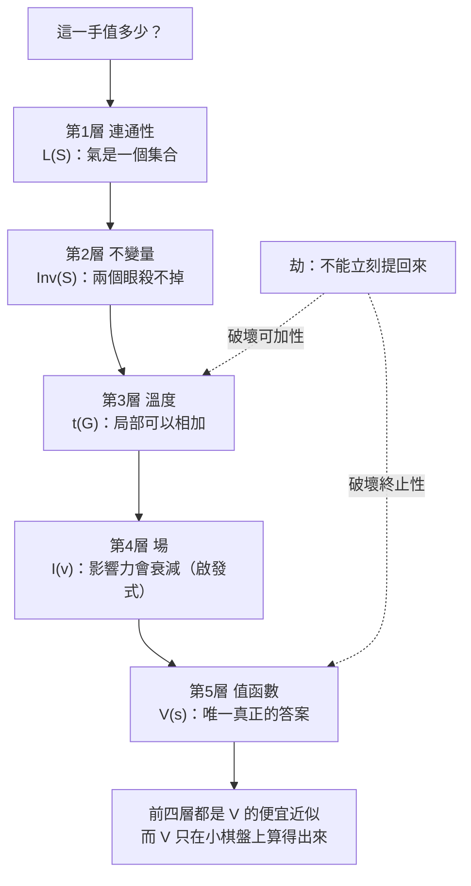

# 第 1 章：預覽 —— 圍棋的五個問題與一條主軸

---

## 0. 我們在哪裡

這是第一章，所以你不需要前面任何一章。你需要的只有兩樣東西：

* **高中數學**：集合與交集聯集、簡單不等式、函數圖形、機率的直覺。用到更多的地方（遞迴、不動點、賽局值、凹函數），本書會在那一章從零教起。
* **零圍棋基礎**。真的是零。本章 §4 會把規則從頭講一次，而且只講三條半。

讀完這一章，你能做到四件事：

1. 看懂本書的每一張棋圖，並把圖上的每一顆子和座標對上。
2. 說出圍棋的完整規則，並解釋為什麼「提子」不是一種選擇而是自動的結果。
3. 用兩套規則（數子、數目）各數一次同一局棋的勝負。
4. 說出這本書的五層骨架各回答什麼問題，以及它們各自在哪一章。

第四件事是本章真正的目的。這一章是**地圖**，不是課程。

### 0.1 如何閱讀本書（四種方塊與四道透鏡）

本書全部十四章用同一套版式。這一節說明那套版式，之後不再重複。

**四種方塊。** 灰底的引用方塊分成幾類，各有固定的用途：

| 方塊 | 意思 | 你該怎麼對待它 |
| :--- | :--- | :--- |
| **EUREKA** | **本章的頓悟**。每章**恰好一個**，放在 §1 結尾 | 這是那一章唯一必須記住的東西。第一句話一定不含任何符號 |
| **RECALL** | **回頭掛勾**。前面教過的某個東西，此刻要用到 | 如果讀到這裡覺得斷片，回它指的那一節，不要硬撐 |
| **INTUITION** | **一個角度**。同一件事的不同看法 | 三個角度都看不懂沒關係，看懂一個就夠 |
| **BOARD REALITY** | **失效聲明**。剛剛那套說法什麼時候會錯 | **這是全書最重要的方塊。** 任何一套方法都有邊界，不說邊界的書在騙你 |
| **PROVERB** | **一句古諺 + 它對應的公式 + 它的失效條件** | 這是本書的核心主張：口訣是定理的白話版 |

下面這一章的每一個方塊都會長成這個樣子（開頭一行粗體標題，然後是內容）：

> **RECALL**（示意）
> 這裡會寫：**是什麼**、**出自哪一節**、**為什麼此刻需要它**。
> 三句話，不多不少。

**四道透鏡。** 每章的 §2 用固定的四個角度看同一個東西：**手感／實戰**（棋手怎麼講）、**幾何／形狀**（畫出來長什麼樣）、**代數／計算**（寫成式子）、**棋盤現實檢查**（什麼時候不成立）。四道透鏡的標題文字在每一章都一樣，所以你可以直接跳到你習慣的那一道。

**三個誠實標記。** 這本書會標出每個結論的證據等級：

* 🟢 **證明了，而且有可執行程式驗證。**
* 🟡 **只是啟發式或量測結果，沒有證明。** 正文一定會明講。第 9 章整章都是黃的。
* 🔴 **還沒做完。** 這種東西**不准寫進正文**。目前全書沒有任何一條是紅的。

**RECALL 在這一章指向本章自己。** 因為第 1 章前面沒有章可以指。從第 2 章起，每個 RECALL 都會指向一個真實存在的前面章節。

---

## 1. 開場思想實驗與掙得的頓悟

### 思想實驗：沙灘上的兩個人

海邊有一片平坦的沙灘。你和另一個人輪流放石頭，一次一顆，放下去就不能移動。

規則只有一條：**如果一堆石頭被對方的石頭完全包圍，那堆石頭就要拿走。**

目標是圍出比對方大的一塊沙地。

現在來三個問題：

**第一個問題：什麼時候該停？** 沒有時鐘、沒有回合上限。你可以一直放下去，直到沙灘被填滿 —— 但那時候誰也沒有地。所以「停」本身是一個決策。**你什麼時候知道再放一顆石頭是虧的？**

**第二個問題：誰贏了？** 假設你們都同意停了。沙灘上有你的石頭、對方的石頭、還有一些空地。有些空地明顯是你的，有些明顯是對方的，還有一些**兩邊都走得到**。那些算誰的？

**第三個問題，也是最麻煩的：先放的人是不是佔便宜？** 如果是，便宜多少？

這三個問題就是圍棋。而它們的答案分別是：**溫度**（第 7 章）、**地的定義與計分**（第 13 章）、**貼目**（第 13 章 §4.3）。

### 把謎題寫成一個問題

圍棋的規則短到可以寫在一張名片上。棋盤是十九條橫線與十九條縱線的交叉點，兩人輪流在空的交叉點上放子，沒有氣的棋子拿走，不能立刻把局面還原成上一步的樣子，雙方都不想再下就結束，地多的贏。

**這樣一套規則，一個八歲小孩十分鐘就學會。那為什麼職業棋手要花三十年，而且還會輸？**

一般的答案是「因為變化多」。這個答案不對 —— 或者說，它什麼也沒解釋。象棋的變化也很多。

真正的答案是這樣的：

**圍棋的規則告訴你哪些手是合法的，但一句話也沒說哪一手比較好。** 象棋的規則至少告訴你「吃掉對方的王就贏了」，於是每一手棋都可以問「這離將軍更近了嗎」。圍棋的規則只說「最後地多的贏」，而「最後」可能在兩百手之後。

所以圍棋把**全部**的難度，壓進了同一個問題：

$$\textbf{這一手棋，值多少？}$$

而這個問題沒有單一的答案 —— 它有**五個層次**的答案，每一層在不同的情況下才是對的那一個。這本書就是那五層。

> [!EUREKA]
> **圍棋的規則簡單，是因為它把所有困難都推遲到同一個問題上：這一手棋值多少。**
>
> 而這個問題有五個層次的答案，每一層都是一個可以計算的量：
>
> $$L(S) \ \longrightarrow\ \mathrm{Inv}(S) \ \longrightarrow\ t(G) \ \longrightarrow\ I(v) \ \longrightarrow\ V(s)$$
>
> **氣**（這些子還活著嗎）、**不變量**（這塊棋死透了沒有）、**溫度**（現在哪裡最大）、
> **場**（這一帶是誰的）、**值函數**（這一手到底值幾目）。
>
> 五個符號，五個問題，五種不同的算法。**它們不是五個技巧，是同一個問題的五種便宜近似**
> —— 第 10 章會證明前四層全都是第五層 $V$ 的簡化版。
>
> 而圍棋的每一句古諺，都是這五層裡某一層的白話版。「金角銀邊草肚皮」是第 1 層的
> 等周不等式，「大場不如急場」是第 3 層的溫度比較，「棋從斷處生」是第 1 層的連通性。
> 本書要做的就是**把每一句口訣還原成它的公式，並且說清楚那條公式什麼時候會失效**。

### 一張圖：這本書的形狀

```text
                    「這一手值多少？」
                            |
        +---------+---------+---------+---------+
        |         |         |         |         |
      L(S)    Inv(S)      t(G)      I(v)      V(s)
       氣      不變量      溫度       場      值函數
        |         |         |         |         |
      第2,8章   第3,4,12章  第6,7,11章  第9章    第10,13章
        |         |         |         |         |
     連得上嗎?  死了沒?   哪裡最大?  誰的地盤?  幾目?
        |         |         |         |         |
        +---------+----+----+---------+---------+
                       |
                    劫（第5章）
              它讓上面的「相加」失效，
              所以它不是第六層，是一個貫穿全書的例外。
```
*請看最底下那一行：劫沒有自己的一層。它是唯一一個讓「把局部分開來算再加起來」這件事失效的規則，所以它在每一層都要單獨處理。這是本書結構上唯一的不對稱。*



---

## 2. 多角度直觀：一手棋值多少

### 角度一：手感／實戰透鏡

> [!INTUITION]
> **問棋手「這手棋值多少」，你會得到五種不同的回答，而他不會告訴你他切換了。**
>
> 「這塊要先做活」——他在用第 2 層。
> 「這裡比較大」——第 3 層。
> 「這一帶厚」——第 4 層。
> 「這樣下我少三目」——第 5 層。
> 「不能斷」——第 1 層。
>
> 高手的能力有很大一部分，是**知道此刻該用哪一層**。而這件事一般被稱為「棋感」，
> 於是它變得沒辦法教。本書的做法相反：把五層各自寫成公式，
> 再去**量**它們什麼時候該用（第 14 章）。

### 角度二：幾何／形狀透鏡

> [!INTUITION]
> **一顆棋子的價值，一半由它站在哪裡決定 —— 而那是純粹的幾何。**
>
> 棋盤上的一個交叉點，最多有四個鄰居。角上只有兩個，邊上三個，中間四個。
> 一顆孤子的氣數就等於它的鄰居數，所以：
>
> $$\text{角} = 2, \qquad \text{邊} = 3, \qquad \text{盤中央} = 4$$
>
> 這個微不足道的差別，一路長成了「金角銀邊草肚皮」這句諺語 ——
> 因為在角上圍地，棋盤的兩條邊是**免費的牆**。第 2 章會把它寫成一個等周不等式，
> 並且**證明**它。

### 角度三：代數／計算透鏡

> [!INTUITION]
> **每一層都是一個從「局面」到「數字」的函數。**
>
> | 層 | 輸入 | 輸出 | 型別 |
> | :-- | :--- | :--- | :--- |
> | 1 | 一塊棋 $S$ | 它的氣 $L(S)$ | **集合** |
> | 2 | 一塊棋 $S$ | 它死不死 | **布林值** |
> | 3 | 一個局部 $G$ | 溫度 $t(G)$ | **數** |
> | 4 | 一個空點 $v$ | 影響力 $I(v)$ | **實數** |
> | 5 | 整個局面 $s$ | 值 $V(s)$ | **數** |
>
> 注意第 1 層的輸出是**集合**不是數字。這件小事在第 2 章會變成一個關鍵：
> 兩塊棋接起來的時候，它們的氣會**重疊**，而重疊的部分只能算一次。
> 「接一手會損氣」這個新手最難接受的事實，就是這個重疊。

### 角度四：棋盤現實檢查

> [!BOARD REALITY]
> **這五層裡，只有第 5 層是真的答案，而它算不出來。**
>
> $V(s)$ 是唯一沒有近似的量：它就是「雙方都下最好時，這局棋的結果」。
> 而它在 19 路盤上**永遠**算不出來 —— 不是「現在的電腦不夠快」，
> 是 $10^{172}$ 這個數字比可觀測宇宙的原子數（約 $10^{80}$）還大得多。
>
> 所以第 1 到第 4 層不是「入門的簡化版」，它們是**唯一可用的東西**。
> 而本書所有精確的驗證都在 **3 路盤**（$V$ 算得出來的地方）上做。
>
> **這是本書最大的限制，而它會出現在每一章。** 凡是引用小盤面數字的地方，
> 都必須同時說出它的適用範圍 —— 如果哪一處沒說，那是錯誤，請指出來。

---

## 3. 散落的碎片（問題本身）

### 沒有這一套說法的時候，事情長什麼樣

翻開任何一本傳統圍棋入門書，你會拿到一份**口訣清單**：

> 金角銀邊草肚皮。棋從斷處生。兩處有情方可斷。大場不如急場。
> 逢危須棄。動須相應。彼強自保。入界宜緩。

這些話都對。問題是它們**互相矛盾，而且沒有人告訴你什麼時候聽哪一句**。

「金角銀邊」說去佔角，「大場不如急場」說先救棋 —— 那第一手到底下哪？
「逢危須棄」說該丟就丟，「動須相應」說對方動了你要回應 —— 那到底棄還是應？

傳統的答案是：「這要看情況，多下幾盤就有感覺了。」

**這句話的問題不是它錯，是它不可檢驗。** 一句不可檢驗的建議，你沒有辦法知道自己是學會了還是只是運氣好。

### 歷史摩擦：為什麼古人只留下諺語

古人沒有留下公式，不是因為他們不夠聰明。是因為**要把這些話寫成公式，需要三樣他們沒有的東西**：

1. **組合賽局論**（Conway，1970 年代）。「局部可以分開算再加起來」這件事需要一個代數，而那個代數在二十世紀才被建立。第 6、7 章要用它。
2. **可計算性的概念**。「這個問題原理上算不出來」和「這個問題我算不動」是兩件完全不同的事，而區分它們需要計算理論。第 9、10 章的核心就是這個區分。
3. **一台可以跑十萬次驗證的機器**。本書每一條公式旁邊都有一個「試圖推翻它」的程式，而那件事在紙筆時代做不到。

所以古人給我們的是**壓縮過的經驗**：正確、精煉、而且丟掉了所有的前提條件。這本書要做的就是**把那些前提裝回去**。

### 新手典型會錯在哪裡

初學者最常見的三個誤解，全部來自「規則沒有說的東西」：

**一、以為提子就是賺。** 提掉對方一顆子看起來是純收穫 —— 盤面上多一個目，對方少一顆子。但第 14 章量到一件事：在 3 路盤上所有五層判準**同時出錯**的 156 個局面裡，有 **82%** 的錯誤都長成同一個樣子：**它們都說「去提子」，而正解是不提**。提子是最看得見的收穫，也是最容易被高估的收穫。

**二、以為「接起來」總是好的。** 兩塊棋接成一塊，聽起來變強了。但接起來之後，兩塊棋的氣**重疊的部分只能算一次**，所以總氣數常常變少。第 2 章 §4.3 會把這件事寫成一個三項分解。

**三、以為圍住的地就是自己的。** 一塊看起來圍好的地，可能整塊是死的。「活」不是「圍起來」，「活」是一個**對手動不了的不變量** —— 第 3 章 §4.2。

---

## 4. 對齊（解答）

從這裡開始講規則。**三條半。**

### 4.1 棋盤與交叉點

<!-- diagram: ch01_board -->
```text
     A B C D E F G
   7 . . . . . . . 7
   6 . . . . . . . 6
   5 . . + . + . . 5
   4 . . . + . . . 4
   3 . . + . + . . 3
   2 . . . . . . . 2
   1 . . . . . . . 1
     A B C D E F G
```
*一個空的 7 路棋盤。橫向是 A 到 G（圍棋慣例【跳過 I】），縱向由下往上 1 到 7。標成 + 的是【星】，只是方便定位的記號，沒有任何規則上的意義。棋子下在【線的交叉點】上，不是下在格子裡。*

**棋盤**（board）是 $n$ 條橫線與 $n$ 條縱線圍成的網格，而棋子下在**交叉點**（intersection）上。正式比賽用 $n = 19$，也就是 $19 \times 19 = 361$ 個交叉點。本書的主力是 **7 路與 9 路**，因為那個大小的例子你能用紙筆核對。

每個交叉點最多有四個**鄰點**（上下左右，**斜的不算**）。這一句話是整本書的地基：

$$\deg(v) = \begin{cases} 2 & v \text{ 在角上} \\ 3 & v \text{ 在邊上} \\ 4 & \text{其他} \end{cases}$$

「斜的不算」不是一個約定俗成的細節，它是**整個第 2 層的來源**。如果斜的也算，眼就不成立，活棋就不存在，整個遊戲會垮掉。

**這個遊戲有多大？**

<!-- figure: ch01_scale -->
```text
  棋盤             交叉點           局面數上界 3^(n*n)          本書算得動嗎
  ------------------------------------------------------------------
  2 路              4              3^4 ~ 10^1       算得動（本書解了）
  3 路              9              3^9 ~ 10^4       算得動（本書解了）
  4 路             16             3^16 ~ 10^7            算不動了
  7 路             49            3^49 ~ 10^23             算不動
  9 路             81            3^81 ~ 10^38             算不動
  19 路           361          3^361 ~ 10^172             算不動

  「上界」是因為很多字串排列在圍棋規則下不合法（例如沒氣的棋子）。
  但即使打對折再打對折，19 路的 10^172 也還是 10^172。

  對照：可觀測宇宙的原子數大約 10^80。
  所以本書所有【精確】的計算都在 3 路盤上做 —— 那是有答案的地方。
```
*請看「4 路」那一行：跳過 3 路只差 7 個交叉點，就已經算不動了。這不是一條平滑的曲線，是一道牆 —— 而本書所有的精確驗證都在牆的左邊。*

### 4.2 輪流落子與提子（規則的最小集合）

> [!RECALL]
> **每個交叉點最多四個鄰點，斜的不算。**
> 這是本章 §4.1 剛講的。接下來「氣」的定義完全建立在這個鄰點關係上 ——
> 如果你把斜線也算成鄰居，下面每一句話都會是錯的。

**規則一（落子）。** 黑先，之後輪流。每次在一個**空的**交叉點上放一顆自己顏色的子，或者**虛手**（pass，不下）。

**規則二（氣）。** 上下左右相連的同色棋子構成一**塊**（棋串）。一塊棋的**氣**（liberty）是它所有鄰點裡還空著的那些交叉點所成的**集合**。

<!-- diagram: ch01_liberty -->
```text
     A B C D E F G
   7 . . . . . . . 7
   6 . . . . . . . 6
   5 . . + b + . . 5
   4 . . a X c . . 4
   3 . . + d + . . 3
   2 . . . . . . . 2
   1 . . . . . . . 1
     A B C D E F G
```
*黑子 D4 的【氣】就是 a、b、c、d 這四個【緊鄰的空交叉點】。斜的不算。角上的子只有兩口氣，邊上的子三口 —— 這個「位置決定氣數」的小事，第 2 章會長成金角銀邊的證明。*

**規則三（提子）。** 一塊棋的氣變成 0 時，它**立刻**從棋盤上拿走。

<!-- diagram: ch01_atari -->
```text
     A B C D E F G
   7 . . . . . . . 7
   6 . . . . . . . 6
   5 . . + X + . . 5
   4 . . X O X . . 4
   3 . . + a + . . 3
   2 . . . . . . . 2
   1 . . . . . . . 1
     A B C D E F G
```
*白 D4 的四口氣被黑佔掉了三口，只剩 a 一口。這個狀態叫【叫吃】。注意這裡沒有任何「威脅」的概念 —— 只有一個數字：氣 = 1。*

<!-- diagram: ch01_capture -->
```text
     A B C D E F G
   7 . . . . . . . 7
   6 . . . . . . . 6
   5 . . + X + . . 5
   4 . . X + X . . 4
   3 . . + X + . . 3
   2 . . . . . . . 2
   1 . . . . . . . 1
     A B C D E F G
```
*和上一張比對：黑下在 a（D3）之後，白 D4 的氣變成 0，於是【立刻從棋盤上拿走】—— D4 現在是空的（那個 + 是星位記號）。提子不是一種選擇，是規則的自動結果：氣歸零的棋子不能留在盤上。*

**注意「立刻」與「自動」這兩個詞。** 新手常常以為提子是一個動作 ——「我要不要提掉他」。不是。**提子是規則的結果，不是玩家的選擇。** 你下的是 D3 這一手，白子被拿走是規則替你做的。

**規則三點五（劫）。** 提子有一個例外：**你不能下出一手，讓整個盤面回到上一手之前的樣子。** 這條規則的存在只有一個理由 —— 沒有它，兩邊可以無限提來提去，遊戲永遠不會結束。這個東西叫**劫**，它是本書唯一一個貫穿五層的例外，第 5 章整章在講它。

**規則四（結束）。** 雙方連續虛手，棋局結束。

就這樣。下面用程式把上面三張圖跑一次：

```python
from go_core.board import BLACK, WHITE, Board, format_coord
from go_core.strings import find_string, liberties

# 一顆孤子的氣數 = 它的鄰居數
b = Board(7)
for coord, expect in [("D4", 4), ("A4", 3), ("A1", 2)]:
    t = Board(7)
    t.place(BLACK, coord)
    n = len(liberties(t, find_string(t, t._pt(coord))))
    print(f"  黑子在 {coord}：{n} 口氣")
    assert n == expect

# 叫吃 -> 提子
b.place(WHITE, "D4")
b.place_many(BLACK, ["C4", "E4", "D5"])
left = sorted(format_coord(p, 7)
              for p in liberties(b, find_string(b, b._pt("D4"))))
print(f"\n  白 D4 只剩 {len(left)} 口氣：{left}   <- 叫吃")
assert left == ["D3"]

taken = b.play(BLACK, "D3")
print(f"  黑下 D3 -> 提掉 {sorted(format_coord(p, 7) for p in taken)}")
print(f"  D4 現在是空的嗎？{b.grid[b._pt('D4')] == 0}")
assert sorted(format_coord(p, 7) for p in taken) == ["D4"]
assert b.grid[b._pt("D4")] == 0
```

### 4.3 圍地與勝負

> [!RECALL]
> **提子是自動的：氣歸零就拿走。**
> 本章 §4.2 剛講完。這一節要用到它的一個推論 ——
> **既然沒氣的棋子不能留在盤上，那麼一塊棋能不能永遠保住至少一口氣，
> 就決定了它的生死。** 而「地」只有活棋才圍得住。

**地**（territory）的定義只有一句話：

$$\textbf{一個空的交叉點，如果它走得到黑子、走不到白子，它就是黑的地。}$$

（這裡的「走」只能沿著空點上下左右走。）反過來就是白的地。**兩色都走得到的空點不屬於任何人**，那種點叫**單官**。

<!-- diagram: ch01_territory -->
```text
     A B C D E F G
   7 . . . . O . . 7
   6 . . . . O . . 6
   5 . . + . O O O 5
   4 X X X + . . . 4
   3 . . X . + . . 3
   2 . . X . . . . 2
   1 . . X . . . . 1
     A B C D E F G
```
*黑用 6 顆子把左下角的 6 個交叉點圍了起來（A1、A2、A3、B1、B2、B3）。【地】的定義只有一句話：一個空點如果只走得到黑子、走不到白子，它就是黑的地。注意黑借用了棋盤的兩條邊當免費的牆 —— 同樣 6 個點如果圍在盤中央，要花的子多得多。*

```python
from go_core.board import BLACK, WHITE, Board
from go_core.score import dame, territory

b = Board(7)
b.place_many(BLACK, ["A4", "B4", "C4", "C3", "C2", "C1"])
b.place_many(WHITE, ["E7", "E6", "E5", "F5", "G5"])
tb, tw = territory(b)
d = dame(b)
print(f"  黑地 {tb} 點、白地 {tw} 點、兩色都走得到的空點 {len(d)} 個")
print(f"  黑用了 6 顆子圍 {tb} 點，白用了 5 顆子圍 {tw} 點")
assert (tb, tw) == (6, 4)
assert len(d) == 28
assert tb + tw + len(d) + 6 + 5 == 49          # 全部交叉點都被分完
print(f"\n  {tb} + {tw} + {len(d)} + 6 + 5 = 49 <- 一點也沒漏")
```

**看那個效率差：黑 6 顆子圍到 6 點，白 5 顆子只圍到 4 點。** 黑在角上，兩條棋盤邊是免費的牆；白在邊上，只有一條。

> [!PROVERB]
> **「金角銀邊草肚皮」**
> **它其實在說**：圍同樣大的一塊地，在角上需要的棋子最少，邊上次之，中央最多。因為棋盤的邊界是**不用自己蓋的牆**。第 2 章 §4.5 會把它寫成一個等周不等式並證明：在角上圍面積 $A$ 的地，只需要約 $2\sqrt{A}$ 顆子；在中央要約 $4\sqrt{A}$ 顆。
> **失效條件**：這句話的前提是**「有地方可以圍」**。棋盤太小的時候它完全反過來 —— 第 10 章解出 3 路盤的精確值：第一手下天元不虧（$\Delta V = 0$），下邊上虧 5 目，**下角上虧 18 目，和直接虛手一樣糟**。3 路盤上角落不是金的，是最糟的一手。

**勝負。** 棋局結束後，數哪一方多。「數」有兩套規則，而它們**幾乎**總是給同一個答案：

* **數子**（中國規則）：**你的子 + 你的地**。
* **數目**（日本規則）：**你的地 + 你提到的子**。

兩套規則的差別只有一個東西 —— 誰多下了幾手。這件事第 13 章有一個四行代數的定理，本章 §5.2 會讓你**親眼看到**它。

### 4.4 貼目

> [!RECALL]
> **黑先。**
> 本章 §4.2 的規則一。這一節整節都是在處理這三個字的後果。

黑先下，所以黑佔便宜。**貼目**（komi）就是黑要還給白的補償：計分時黑要減掉一個固定的數。

「貼多少」不是傳統，也不是投票決定的。它有一個精確的定義：

$$\textbf{公平的貼目} = V(\text{空盤})$$

也就是「雙方都下最好時，黑贏多少」。貼掉這個數之後，空盤的值就變成 0，遊戲才是公平的。

> [!RECALL]
> **19 路盤的局面數上界是 $3^{361} \approx 10^{172}$。**
> 本章 §4.1 那張表。這個數字此刻變成一件很實際的事：
> **正因為 $V(\text{空盤})$ 算不出來，貼目才必須用統計估。**
> 貼目不是一個傳統問題，是一個計算問題 —— 而那個計算做不到。

所以現實中的 7.5 目是**統計估出來的**：看幾十萬局職業對局的勝率，調到黑白各半。

但在小棋盤上它算得出來。第 10 章解出 3 路盤：$V(\text{空盤}) = +9$，所以 3 路盤的公平貼目就是 **9**。而第 13 章發現一件更微妙的事 —— **貼目和規則有關**：同一個 3 路盤，數子規則的公平貼目是 **9**，數目規則卻是 **5**。

**為什麼？** 因為兩套規則下「什麼時候該停手」不一樣，於是最優對局走出兩個不同的終局。**規則改變的不是分數，是停手的時機。**

### 4.5 棋圖怎麼讀

<!-- diagram: ch01_read -->
```text
     A B C D E F G
   7 . . . . . . . 7
   6 . . . . . . . 6
   5 . X + 2 + b . 5
   4 . . 4 1 3 . . 4
   3 . . a . + O . 3
   2 . . . . . . . 2
   1 . . . . . . . 1
     A B C D E F G
```
*這張圖示範本書的全部圖示約定：X 是黑子、O 是白子、. 是空點、+ 是星位；數字 1234 是【著手順序】（黑先，所以奇數是黑）；小寫字母 a、b 是正文要指涉的參考點。一張圖最多放 9 手，超過就分圖 —— 因為第 10 手開始，讀者就數不清了。*

| 字元 | 意思 |
| :--- | :--- |
| `X` | 黑子 |
| `O` | 白子 |
| `.` | 空的交叉點 |
| `+` | 空的星位（只是定位記號） |
| `1`–`9` | 著手順序。**奇數是黑，偶數是白** |
| `a`–`h` | 正文要提到的參考點 |

座標橫向 `A B C D E F G H J K...` —— **跳過 I**，因為 I 和數字 1 太像。縱向由下往上從 1 起算。上下左右都印座標，方便你對位。

> [!BOARD REALITY]
> **本書的每一張棋圖都是程式產生的，一張也不是手打的。**
>
> 每張圖背後有一個 `positions/*.sgf` 檔，由 `scripts/sgf_to_ascii.py` 畫出來，
> 再由 `scripts/check_diagrams.py` 回頭**逐字元**比對正文裡的圖。
>
> 理由很實際：**圍棋書最常見的錯誤是棋圖少一顆子或標號錯位**，
> 而讀者會為此困惑半小時，然後以為是自己笨。這條規矩讓那種錯誤不可能發生。
>
> 同樣的規矩也適用於本書的每一段程式（要能跑、要印東西、要 `assert` 一個預期值）
> 和每一個數字。**如果你在書裡找到一個對不上的數字，那是一個 bug，不是你的理解問題。**

### 4.6 五層骨架預覽

<!-- figure: ch01_spine -->
```text
  五層骨架                                    （全書目錄，不是計算結果）
  ======================================================================

  層   符號        它回答的問題                        章
  ----------------------------------------------------------------------
  1   L(S)        這些棋子是【一塊】嗎？還剩幾口氣？    2, 8
                  -> 連通性。棋盤是一張圖，棋串是連通分量，氣是鄰點集合。

  2   Inv(S)      這塊棋【死了沒有】？                  3, 4, 12
                  -> 不變量。兩個眼是一個對手動不了的量，所以它是活的。

  3   t(G)        現在【哪裡最大】？                    6, 7, 11
                  -> 溫度。局部可以相加，而溫度就是「這裡還值多少」。

  4   I(v)        這一帶是【誰的】？                    9
                  -> 場。唯一整層標黃的一層：它是啟發式，而且證明了
                     它算不出死活（定理 9.5）。

  5   V(s)        這一手【值多少目】？                  10, 13
                  -> 值函數。前四層都是它的便宜近似。只有小盤算得出來。

  例外  劫          「不能立刻提回來」                  5
                  -> 它讓局部不能相加，所以它不是第六層，是一個貫穿的例外。

  ======================================================================
  第 14 章把這五層架在 3 路盤 1,742 個已解局面上量了一次：
  死活 = 溫度 > 場 > 連通性（552 次分歧零敗），而仍有 9.0% 的局面
  五層一句話也說不出來。那 9% 是這本書欠讀者的帳，它印在書裡。
```
*請看最下面三行。那是本書和坊間棋書最大的差別 —— 不是它比較對，是它**說得夠精確，精確到可以被指出哪裡錯**，而且它自己先指了一次。*

**五層之間有一個順序，而那個順序是量出來的，不是我排的。** 第 14 章把四個判準架在 3 路盤所有已解局面上，只看它們**提名不同**的時候誰對：

$$\textbf{死活} = \textbf{溫度} \ \succ\ \textbf{場} \ \succ\ \textbf{連通性}$$

死活與溫度在 552 次分歧裡**一次都沒輸過**。而這正是每個老師都在教的那句話 ——「先看死活，再比大小，最後才講形」。

> [!PROVERB]
> **「大場不如急場」**
> **它其實在說**：一塊未定死活的棋，它的溫度等於它的**賭注** $k = s + t$（自己的子數加眼位大小），而生死一翻是 $2k$。所以只要 $k$ 大於盤上最大的官子價值 $T'$，就該先救棋。第 12 章 §4.4 把它寫成一個判定式：$k > T' \Rightarrow$ 急場。
> **失效條件**：兩種情況下這句話會給你錯誤的答案 —— **第一，那塊棋已經 Benson 無條件活了**（第 3 章），那它的溫度是 0，救它是純粹的浪費；**第二，那塊棋已經死透了**，救不活，這時候「急」只會多送幾顆子。這句諺語的前提是「未定」，而「未定」是一個可以檢查的條件。

---

## 5. 應用：手算追蹤與非黑盒程式

### 5.1 一整局 7 路棋

下面是一局完整的 7 路盤棋，從第一手到終局。

**它不是人下的。** 它由 `go_core/anatomy.py` 裡一個叫 `book_player` 的程式下出來，而那個程式**完全照本書的五層順序走**，沒有任何搜尋：

$$\text{能提就提} \ \to\ \text{被叫吃就逃} \ \to\ \text{佔要害} \ \to\ \text{其餘看場}$$

> [!RECALL]
> **奇數是黑，偶數是白；一張圖最多 9 手。**
> 本章 §4.5 的圖示約定。這一局有 54 手，所以下面用三張圖：
> 開局的前 9 手（標號）、中盤的盤面、終局的盤面。

<!-- diagram: ch01_game_open -->
```text
     A B C D E F G
   7 . . . . . . . 7
   6 . . . . . . . 6
   5 . . 8 2 7 . . 5
   4 . . 3 1 5 . . 4
   3 . . 6 4 9 . . 3
   2 . . . . . . . 2
   1 . . . . . . . 1
     A B C D E F G
```
*這一局的前 9 手。黑 1 佔天元（7 路盤最大的一點），白 2 立刻貼上來。看不懂沒關係 —— 第 1 章不要求你懂棋，只要求你能把棋圖和座標對上。*

前九手全部擠在中央九個交叉點裡。**7 路盤沒有「角」可言** —— 這正是 §4.3 那句諺語的失效條件在小棋盤上的樣子。

<!-- diagram: ch01_game_mid -->
```text
     A B C D E F G
   7 . . . . O . . 7
   6 . X X X O X . 6
   5 . O O O X X . 5
   4 . O X X X X . 4
   3 X X O O X X . 3
   2 . O O O O O . 2
   1 . . . . . . . 1
     A B C D E F G
```
*第 27 手之後。黑（X）在上方連成一大片，白（O）在下方兩路。此時盤上還沒有定案 —— 中間那條交界線是後面一半棋的戰場。*

<!-- diagram: ch01_game_final -->
```text
     A B C D E F G
   7 X . X . X X X 7
   6 . X X X . X . 6
   5 X X X . X X X 5
   4 X . X X X X . 4
   3 X X O O X X X 3
   2 X O O O O O O 2
   1 O O O . O O . 1
     A B C D E F G
```
*終局（共 54 手，雙方各 27 手，最後兩手是虛手）。棋盤上黑 26 子、白 13 子，黑地 8 點、白地 2 點，沒有單官。數子 C = +19、數目 J = +19 —— 兩套規則給出同一個答案，而 §5.2 會說明為什麼這不是巧合。*

**用手算一次。** 終局盤面上：

* 黑子 26 顆、白子 13 顆（$26 + 13 = 39$ 顆子在盤上）
* 黑地 8 點、白地 2 點
* 單官 0 個
* 檢查：$26 + 13 + 8 + 2 = 49$ ✓（7 路盤有 49 個交叉點，一點也沒漏）

**數子（中國規則）**：黑 $= 26 + 8 = 34$，白 $= 13 + 2 = 15$，差 $34 - 15 = \mathbf{+19}$。

**數目（日本規則）**：黑地 8、白地 2，而整局黑提了 14 顆白子、白提了 1 顆黑子。
黑 $= 8 + 14 = 22$，白 $= 2 + 1 = 3$，差 $22 - 3 = \mathbf{+19}$。

**兩套完全不同的數法，同一個答案。**

### 5.2 用程式數兩次

```python
import random

from go_core.anatomy import play_book_game
from go_core.board import BLACK
from go_core.score import chinese_score, japanese_score

moves, _reasons, game = play_book_game(7, max_moves=70, rng=random.Random(2))
real = [(c, m) for c, m in moves if m is not None]
b_moves = sum(1 for c, _m in real if c == BLACK)
w_moves = len(real) - b_moves

r = game.report()
print(f"  共 {len(real)} 手：黑下了 {b_moves} 手、白下了 {w_moves} 手")
print(f"  盤上 黑 {r['stones'][0]} 子 / 白 {r['stones'][1]} 子")
print(f"  地   黑 {r['territory'][0]} 點 / 白 {r['territory'][1]} 點")
print(f"  提子 黑提 {r['prisoners'][0]} 顆 / 白提 {r['prisoners'][1]} 顆")
print()
print(f"  數子 C = {r['chinese']:+.0f}   （子 + 地）")
print(f"  數目 J = {r['japanese']:+.0f}   （地 + 提子）")
print(f"  差   C - J = {r['chinese'] - r['japanese']:+.0f}"
      f"        b - w = {b_moves - w_moves:+d}")

assert b_moves == w_moves == 27
assert r["chinese"] == r["japanese"] == 19.0
assert r["chinese"] - r["japanese"] == b_moves - w_moves == 0
print("\n  C - J = b - w。這一局兩人手數相同，所以兩套規則一定相等。")
```

### 5.3 輸出裡該看什麼

**看最後那一行。** 兩套規則相等**不是巧合，也不是規則設計得剛好** —— 它是一條恆等式的特例：

$$C - J = b - w$$

其中 $b$、$w$ 是黑白各**下過**幾顆子（含後來被提掉的）。這一局黑白各下 27 手，$b - w = 0$，所以 $C = J$。第 13 章 §4.2 會用四行代數證明它。

**這句話有多強？** 它是說：兩套規則的差別**不是**「算地的方式不同」，而**只是**「誰多下了幾手」。它們對「地」的定義完全一致，對「子」的處理也一致 —— 唯一的差別是數目規則不算你自己的子，所以多下一手要多花一目。

**還要看兩個數字。** 黑提了 14 顆白子，白只提了 1 顆。這局棋不是靠圍地贏的，是靠**吃棋**贏的 —— 而在數子規則下，被提掉的子最後會變成地，所以兩種贏法在計分上沒有差別。這也是 $C - J = b - w$ 的一個側面。

> **配套範例腳本**：`examples/ch01_preview/ex01_first_game.py` —— 把這一局逐手播放，
> 每 9 手印一張圖，並在終局同時用三種規則（數子、數目、Tromp-Taylor）各數一次。

---

## 6. 練習與完整解答

### 基礎練習

#### 練習 1.1

<!-- diagram: ch01_ex1 -->
```text
     A B C D E F G
   7 . . . . . . . 7
   6 . . . X . . . 6
   5 . . X O X . . 5
   4 . . X O X . . 4
   3 . . + a + . . 3
   2 . . . . . . . 2
   1 . . . . . . . 1
     A B C D E F G
```
*練習 1.1：白兩子 D4、D5 還剩幾口氣？黑下在 a 會發生什麼事？*

<details>
<summary>解答</summary>

**白兩子只剩一口氣，就是 a（D3）。黑下 a 會一次提掉兩顆子。**

先算：白 D4 與 D5 是**連在一起的一塊**（上下相鄰），所以要算的是**整塊**的氣，不是各自的氣。

這塊棋的鄰點有：C4、C5（黑）、E4、E5（黑）、D6（黑）、D3（空）。

$$L(\{D4, D5\}) = \{D3\}, \qquad |L| = 1$$

黑下 D3 之後 $|L| = 0$，於是**兩顆子一起被拿走**（§4.2 規則三）。

**這一題要看的是「一塊」這兩個字。** 新手常常分開算 D4 的氣和 D5 的氣，
得到「各有一口」的結論。但它們是同一塊棋，共用同一組氣。

```python
from go_core.board import BLACK, WHITE, Board, format_coord
from go_core.strings import find_string, liberties

b = Board(7)
b.place_many(WHITE, ["D4", "D5"])
b.place_many(BLACK, ["C4", "C5", "E4", "E5", "D6"])

S = find_string(b, b._pt("D4"))
print(f"  白這一塊有 {len(S)} 顆子：{sorted(format_coord(p, 7) for p in S)}")
libs = sorted(format_coord(p, 7) for p in liberties(b, S))
print(f"  它的氣：{libs}   共 {len(libs)} 口   <- 叫吃")
assert len(S) == 2 and libs == ["D3"]

taken = b.play(BLACK, "D3")
print(f"  黑下 D3 -> 一次提掉 {len(taken)} 顆："
      f"{sorted(format_coord(p, 7) for p in taken)}")
assert len(taken) == 2
```
</details>

#### 練習 1.2

<!-- diagram: ch01_ex2 -->
```text
     A B C D E F G
   7 . . . . . . . 7
   6 . . . . . . . 6
   5 X X X . + . . 5
   4 . . X + . . . 4
   3 . . X . O O O 3
   2 . . X . O . . 2
   1 . . X . O . . 1
     A B C D E F G
```
*練習 1.2：黑與白各圍出了幾個交叉點的地？中間那一大片既走得到黑也走得到白的空點，又該算誰的？（提示：地的定義是「只走得到一色」。）*

<details>
<summary>解答</summary>

**黑 8 點、白 4 點，其餘 25 點誰的也不是。**

黑的地：A1–A4 與 B1–B4，共 **8** 點。這些空點沿著空格走，只碰得到黑子。

白的地：F1、F2、G1、G2，共 **4** 點。

其餘 25 個空點（D 那一列、上方的大片、以及右上角）沿著空點走**兩色都碰得到**，
所以誰的也不是 —— 那些是**單官**。

$$8 + 4 + 25 + 7 + 5 = 49 \quad \checkmark$$

**這一題要看的是「地」不是「圍起來的樣子」。** 中間那一大片看起來很空曠，
但它同時通向黑和白，所以它不屬於任何人。**地是一個關於連通性的判準，不是關於面積的。**

```python
from go_core.board import BLACK, WHITE, Board
from go_core.score import dame, territory

b = Board(7)
b.place_many(BLACK, ["A5", "B5", "C5", "C4", "C3", "C2", "C1"])
b.place_many(WHITE, ["E1", "E2", "E3", "F3", "G3"])
tb, tw = territory(b)
d = dame(b)
print(f"  黑地 {tb} 點、白地 {tw} 點、單官 {len(d)} 點")
print(f"  黑用 7 顆子、白用 5 顆子")
print(f"  {tb} + {tw} + {len(d)} + 7 + 5 = {tb + tw + len(d) + 12}")
assert (tb, tw) == (8, 4)
assert len(d) == 25
assert tb + tw + len(d) + 12 == 49
```
</details>

#### 練習 1.3

> [!RECALL]
> **數子 = 子 + 地；數目 = 地 + 提子；而 $C - J = b - w$。**
> 本章 §4.3 定義了兩套數法，§5.3 給了那條恆等式。
> 下面這一題只給你數字、不給你盤面 —— 因為這條恆等式**只依賴那幾個計數**，
> 不依賴棋子長在哪裡。

**不看盤面：一局 9 路棋下完，黑在盤上有 30 顆子、圍了 12 點地；白有 28 顆子、圍了 9 點地；沒有單官。整局黑提了 5 顆白子，白提了 4 顆黑子。**

**(a)** 用數子規則算勝負。
**(b)** 用數目規則算勝負。
**(c)** 兩者差多少？黑白各下了幾手？

<details>
<summary>解答</summary>

**(a) 數子：** 黑 $= 30 + 12 = 42$，白 $= 28 + 9 = 37$，$C = +5$。

（檢查：$30 + 28 + 12 + 9 = 79$，而 9 路盤有 81 個交叉點 —— 少了 2。
所以這個題目的盤面**不合法**，因為題目說沒有單官。這一點下面會處理。）

**(b) 數目：** 黑 $= 12 + 5 = 17$，白 $= 9 + 4 = 13$，$J = +4$。

**(c)** $C - J = 5 - 4 = +1$，所以由 $C - J = b - w$ 得到 $b - w = 1$：**黑比白多下一手。**

這很合理 —— 黑先，所以在雙方交替、最後黑收最後一手的情況下，黑正好多下一手。
第 13 章量了 300 局隨機 9 路對局，$b - w$ 的**中位數恰好是 1**。

**至於那個少掉的 2 點**：這正是這一題要你發現的事。
$C - J = b - w$ 是一條恆等式，它**不檢查你的盤面合不合法**。
如果你報上來的數字加不到 81，那是數字有問題，不是公式有問題。
**先做守恆檢查，再套公式** —— 這是本書每一章都會重複的紀律。

```python
# 一個好用的檢查：把題目的數字丟進去，看它加不加得起來
n = 9
black_stones, white_stones, black_terr, white_terr, dame_pts = 30, 28, 12, 9, 0
total = black_stones + white_stones + black_terr + white_terr + dame_pts
print(f"  盤面總點數 = {total}，但 {n} 路盤有 {n * n} 點")
print(f"  差了 {n * n - total} 點 -> 這組數字不可能來自一個真實的終局")
assert total != n * n

C = (black_stones + black_terr) - (white_stones + white_terr)
J = (black_terr + 5) - (white_terr + 4)
print(f"\n  就算如此，恆等式照樣成立：C = {C:+d}、J = {J:+d}、C - J = {C - J:+d}")
print(f"  所以 b - w = {C - J:+d}（黑多下一手）")
assert C == 5 and J == 4 and C - J == 1
print("\n  公式不會替你檢查輸入。守恆檢查要自己做。")
```
</details>

### 實戰練習

#### 練習 1.4

把 §5 那一局重跑一次，但把亂數種子換成別的值。**找出一局黑白手數不同的棋，並驗證 $C - J$ 恰好等於 $b - w$。**

<details>
<summary>解答</summary>

種子 1 就是一個：黑下了 31 手、白 29 手，$b - w = 2$。

```python
import random

from go_core.anatomy import play_book_game
from go_core.board import BLACK

found = None
for seed in range(1, 6):
    moves, _r, game = play_book_game(7, max_moves=70, rng=random.Random(seed))
    real = [(c, m) for c, m in moves if m is not None]
    b_n = sum(1 for c, _m in real if c == BLACK)
    w_n = len(real) - b_n
    rep = game.report()
    gap = rep["chinese"] - rep["japanese"]
    flag = "" if b_n == w_n else "   <- 手數不同"
    print(f"  種子 {seed}：黑 {b_n} 手、白 {w_n} 手、"
          f"C = {rep['chinese']:+.0f}、J = {rep['japanese']:+.0f}、"
          f"C-J = {gap:+.0f}、b-w = {b_n - w_n:+d}{flag}")
    assert gap == b_n - w_n            # 每一局都成立
    if b_n != w_n and found is None:
        found = seed

print(f"\n  第一個手數不同的種子：{found}")
print("  五局全部滿足 C - J = b - w —— 一次例外也沒有。")
assert found is not None
```

**這一題的重點不是答案，是方法。** 本書每一條公式旁邊都有一段這樣的程式：
它不是在示範公式怎麼用，而是在**試圖推翻它**。跑五局零例外不能證明什麼，
但如果跑出一個例外，那條公式就完了 —— 而這正是它有意義的原因。
</details>

#### 練習 1.5

**這一題沒有標準答案，它是一個閱讀計畫。**

你手上有一個問題：「我下棋的時候，到底在算什麼？」本書的十四章分成三段。
請根據你的目的，決定讀哪一段：

**(a)** 你想弄懂「這塊棋死了沒有」——該讀哪幾章？
**(b)** 你想弄懂「現在該下哪裡比較大」——該讀哪幾章？
**(c)** 你想弄懂「AI 到底在算什麼」——該讀哪幾章？

<details>
<summary>解答</summary>

**(a) 死活：第 2 → 3 → 4 → 12 章。**
第 2 章給你氣（沒有氣的概念，死活無從談起），第 3 章給你兩眼定理與 Benson
無條件活，第 4 章處理對殺，第 12 章把死活和溫度接起來（一塊未定的棋值多少）。
**這一條路線是本書最紮實的一條** —— 從頭到尾都是 🟢。

**(b) 大小：第 6 → 7 → 11 章，外加第 5 章。**
第 6 章教你「局部可以相加」這件事為什麼成立，第 7 章給你溫度與收官的精確理論，
第 11 章把它用在布局上。第 5 章（劫）之所以要讀，是因為**劫正是讓「相加」失效的那個例外**
—— 不知道它什麼時候失效，前兩章的結論你不敢用。

**(c) AI：第 9 → 10 章，然後第 14 章。**
第 9 章是影響力場（AI 早期的做法，而本書證明了它算不出死活），
第 10 章是值函數、minimax 與 MCTS —— 那一章有一個約兩百行、沒有神經網路的
MCTS，你可以整段讀完。第 14 章把五層架在一起量一次，包括它們一起失靈的 9%。

**三條路線都可以從第 2 章直接開始。** 這一章（第 1 章）唯一必讀的是 §4.5（棋圖怎麼讀），
其餘的都會在後面重講一次。

```python
routes = {
    "死活": [2, 3, 4, 12],
    "大小": [5, 6, 7, 11],
    "AI":   [9, 10, 14],
}
covered = sorted(set(c for r in routes.values() for c in r))
missing = [c for c in range(2, 15) if c not in covered]
for name, chs in routes.items():
    print(f"  {name}：第 {'、'.join(str(c) for c in chs)} 章")
print(f"\n  三條路線一共覆蓋 {len(covered)} 章，沒有被任何一條覆蓋的是：{missing}")
assert missing == [8, 13]
print("  第 8 章（形與手筋）和第 13 章（終局計分）不屬於任何單一路線 ——")
print("  它們是三條路線都會用到的工具。")
```
</details>

---

## 7. 本章頓悟總結

* **圍棋的規則只有三條半**（落子、氣、提子，加上劫這個例外），加一條結束條件。規則簡單，是因為它**把所有困難推遲到同一個問題上：這一手棋值多少**。

* **那個問題有五個層次的答案**：$L(S)$ 連通性、$\mathrm{Inv}(S)$ 不變量、$t(G)$ 溫度、$I(v)$ 場、$V(s)$ 值函數。它們不是五個技巧，是**同一個問題的五種便宜近似** —— 第 10 章會證明前四層都是 $V$ 的簡化。

* **只有第 5 層是真答案，而它算不出來。** $3^{361} \approx 10^{172}$ 比可觀測宇宙的原子數還多。所以本書所有**精確**的驗證都在 3 路盤上做，而每一次引用小盤面的數字，都必須說出它的適用範圍。

* **地的定義只有一句話**：只走得到一色的空點。兩色都走得到的是單官，不屬於任何人。而勝負有兩套數法（數子、數目），它們的差別**只是誰多下了幾手**：$C - J = b - w$。§5 那一局黑白各 27 手，所以兩套規則都是 $+19$。

* **每一句古諺都是某一層的白話版，而每一句都有失效條件。** 「金角銀邊」在 3 路盤上完全反過來（角落虧 18 目，和虛手一樣糟）；「大場不如急場」的前提是那塊棋**未定** —— 已經活淨或已經死透的棋，救它是純粹的浪費。

* **這本書的每一張圖、每一段程式、每一個數字都是生成並驗證過的。** 找到對不上的地方，那是 bug 不是你的理解問題。而書裡故意留著四個**被我自己的程式推翻**的宣稱，連同推翻它們的程式一起。

**接下來：** 第 2 章從最底層開始 —— 把棋盤變成一張圖，把「氣」變成一個集合，然後證明「金角銀邊草肚皮」。那一章也會出現本書第一個被自己推翻的宣稱（§4.5：長方形不是最省的圍地形狀）。

如果你只想快速判斷這本書值不值得讀，直接跳到**第 8 章 §4.1**（一個我寫下來又被程式打死的說法）和**第 9 章開頭的 WARNING**（整層標黃的理由）。那兩處決定了全書的證據標準。
