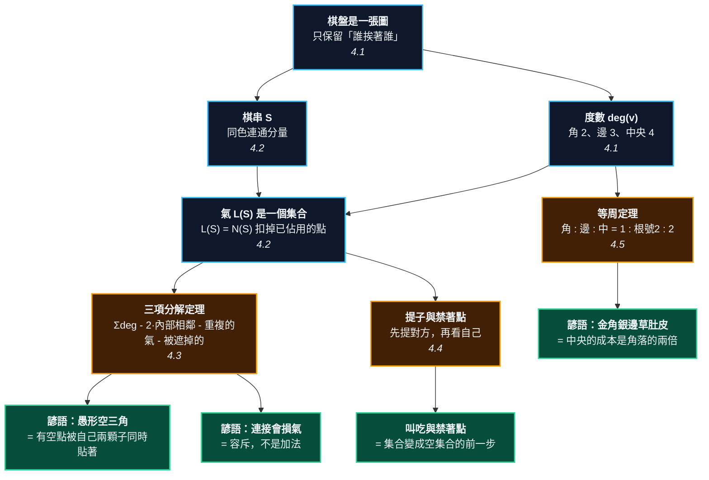

# 第 2 章：棋盤即圖 —— 連、氣、提的完整形式化

---

## 0. 我們在哪裡

**開始之前你需要具備：**

* 第 1 章 §4.1–§4.3 的規則最小集合：黑白輪流在交叉點上落子、沒有氣的棋子被拿走、圍住的空點算你的地。
* 第 1 章 §4.5「棋圖怎麼讀」的字元約定：`X` 是黑子、`O` 是白子、`.` 是空點、`+` 是空的星位、小寫字母是正文要指的參考點。
* 第 1 章 §0.1「如何閱讀本書」介紹的四種方塊與四道透鏡。
* 數學方面：集合是什麼、兩個集合的聯集與交集是什麼。除此之外不需要別的。

**讀完本章後你將能夠：**

* 看著任何一個盤面，正確算出每一塊棋有幾口氣 —— 包括為什麼會是那個數字。
* 用一條三項公式，算出任何形狀的氣，並指出這個形狀的每一分損失是從哪裡來的。
* 自己證明「金角銀邊草肚皮」，並說出這句諺語在什麼情況下會給出錯誤的建議。
* 說出「愚形」的精確定義，而不是「看起來很醜」。

---

## 1. 開場思想實驗與掙得的頓悟

### 思想實驗：一棟大樓的逃生門

想像一棟辦公大樓，裡面有一群人。外面失火了，火正在往裡面燒。

現在問一個問題：**這群人能不能活下來，取決於什麼？**

不取決於他們有幾個人。一百個人和三個人，如果被關在同一間沒有出口的房間裡，結果一樣。

取決於**出口**。準確地說，取決於這群人所在的空間，有幾個還沒被火封住的出口。

再想深一層。假設有兩間相鄰的辦公室，各有四扇對外的門。有人把中間那道牆打通，變成一間大辦公室。現在這間大辦公室有幾扇門？

八扇嗎？不是。原本那兩間各有一扇門是**朝著對方開的** —— 打通以後，那兩扇門變成了房間內部的空氣，不再通往外面。所以是六扇。

還有更麻煩的情況。假設這兩間辦公室不是並排，而是**斜對角**相鄰，中間隔著一個小門廳。它們各有一扇門通往那個門廳 —— 但那是**同一個門廳**。如果消防隊把門廳封了，兩扇門一起失效。從「出口數量」的角度看，這兩扇門其實只算一扇。

### 把謎題寫成一個問題

現在把大樓換成棋盤，把人換成棋子，把出口換成「氣」。

新手學圍棋，第一課學到的定義通常是：「氣就是一顆棋子旁邊的空點數。」這個定義聽起來很清楚，用起來卻立刻出問題：

* 兩顆各有 4 口氣的子，接起來以後為什麼是 6 口，不是 8 口？
* 同樣三顆子，排成一直線是 8 口氣，排成一個彎是 7 口氣。差在哪裡？
* 為什麼老棋手看一眼就說「這個形很笨」，卻說不出笨在哪裡？

**這一章要回答的問題是：氣到底是什麼？**

答案在剛才的思想實驗裡已經出現了。「出口有幾個」這種問法，暗示出口是一個可以相加的數量。但門廳的例子告訴我們：兩扇門可能是同一個出口。所以出口不是一個**數量**，而是一個**集合** —— 而集合的合併，不是加法。

> [!EUREKA]
> **一塊棋能不能活下去，不取決於它有幾顆子，而取決於它旁邊還空著哪些點 —— 那是一個集合，不是一個數字。**
>
> 寫成符號就是 $L(S) = N(S) \setminus \mathrm{Occupied}$：一塊棋 $S$ 的氣，是它所有鄰點裡還空著的那些點**所成的集合**。
>
> 因為它是集合，兩塊棋合併時，它們的氣會重疊；重疊的部分只能算一次。所以連接的代價是**容斥**，不是加法。整章接下來要做的事，就是把這一句話推到底：往前推得到提子與禁著點，往旁邊推得到「愚形」的精確定義，往上推得到「金角銀邊草肚皮」的證明。這三件事在傳統教材裡是三個不相干的章節，在這裡是同一條式子的三個推論。

```text
                        第 2 章的一句話

     棋盤  ───►  一張圖 G = (V, E)：只有「哪些點彼此挨著」這一件事
                    │
                    ├──►  棋串 S    = 同色棋子的連通分量      「這是同一塊棋」
                    │
                    └──►  氣 L(S)   = N(S) \ 已佔用的點       「這塊棋的出口」
                             │
                             │   L(S) 是一個【集合】，不是一個數字
                             │
         ┌───────────────────┼───────────────────┬─────────────────┐
         ▼                   ▼                   ▼                 ▼
     提子規則             三項分解             等周問題           效率
    |L(S)| = 0        |L| = Σdeg               角  2√A         η = |L| / |S|
    就把 S 拿走           - 2·e(S)              邊  2√(2A)
                          - 重複的氣            中  4√A
                          - 被外子遮掉的
         │                   │                   │                 │
         ▼                   ▼                   ▼                 ▼
     「叫吃」             「愚形空三角」        「金角銀邊」       第 8 章
     「禁著點」           「連接會損氣」        「草肚皮」        （形與手筋）
```



---

## 2. 多角度直觀：氣

本章的中心物件只有一個：$L(S)$。下面用四道透鏡看它。

> [!INTUITION]
> **角度一：手感／實戰透鏡**
>
> 你在對局時真的會數氣。手指沿著那塊棋的外圍一個點一個點地移過去，嘴裡默數「一、二、三……」。
>
> 請回想你數氣時做的一件事：當你的手指繞到某個角落，發現「欸，這個點我剛才數過了」，你會跳過它。那個「跳過」的動作，就是**集合的去重複**。你的手已經知道氣是集合了，只是你的腦袋還把它當成數字。
>
> 這一章要做的，是把你手指已經會做的事，寫成一條你可以在盤外驗算的公式。

> [!INTUITION]
> **角度二：幾何／形狀透鏡**
>
> 把一塊棋想像成地圖上的一個國家。它的氣是它的**邊境上的空地**。
>
> 兩件事立刻變得明顯。第一，國家的**面積**（棋子數）和它的**邊境長度**（氣數）是兩回事：一個很胖的國家可能邊境很短，一個細長的國家邊境很長。第二，如果國家的形狀有一個凹角，凹角內側的那塊空地會**同時**貼著國境的兩段 —— 那塊空地被算了兩次。
>
> 「空三角」就是一個有凹角的國家。它的凹角吃掉了一口氣。

> [!INTUITION]
> **角度三：代數／計算透鏡**
>
> 定義只有兩行：
>
> $$N(S) \;=\; \bigcup_{s \in S} N(s) \;\setminus\; S \qquad\qquad L(S) \;=\; N(S) \setminus \mathrm{Occupied}$$
>
> 關鍵的字是第一行的那個 $\bigcup$。**聯集**不是加法。$|A \cup B| = |A| + |B| - |A \cap B|$，中間那個交集項就是重複計算的部分。
>
> 本章 §4.3 會把這個聯集完全展開，得到一條有三個扣分項的公式。傳統教材裡「連接損氣」「愚形」「貼在邊上不好」是三句不相干的話；展開之後會看到，它們是同一條公式裡的三個不同項。

> [!BOARD REALITY]
> **角度四：棋盤現實檢查**
>
> 把氣當成數字而不是集合，在實戰上會付出兩種代價。
>
> **第一種：對殺時多算一口氣。** 兩塊棋互相包圍，你數自己 5 口、對方 4 口，覺得穩贏，於是不管別處直接開打。實際上你那 5 口裡有一口是和對方**共用**的（第 4 章會給它一個名字：公氣），真正能用的只有 4 口。你差一氣，整塊棋沒了。這是業餘棋手輸掉整局最常見的單一原因。
>
> **第二種：自填。** 你覺得棋不夠結實，補一手。那一手落在自己棋塊的氣上，於是這塊棋從 4 口氣變成 3 口氣，還多送對方一手棋的時間。第 3 章會看到，這種「補一手反而變弱」的情況，在做眼的時候尤其致命。

---

## 3. 散落的碎片（問題本身）

如果不把氣當成集合，圍棋的入門知識會呈現成下面這副樣子。這不是誇張，這是市面上大部分入門書的實際結構。

**第一片碎片：一個會失效的定義。** 「氣就是棋子旁邊的空點數。」這個定義對一顆孤子是對的。對兩顆子就開始失效，因為它沒有說明「旁邊」在兩顆子的情況下要怎麼合併。於是書上會補一句：「連在一起的棋子共用氣。」共用是什麼意思？沒有下文。

**第二片碎片：一張要背的形狀表。** 因為定義不夠用，教材改成列舉：一子 4 氣、二連 6 氣、直三 8 氣、空三角 7 氣、方四 8 氣、直四 10 氣……學生把它背下來，遇到表上沒有的形狀就沒轍。而棋盤上的形狀有無限多種。

**第三片碎片：一句沒有理由的美學判斷。** 「空三角是愚形。」為什麼？「因為效率差。」效率差多少？「你多下就會有感覺。」這句話把一個可以在三十秒內算清楚的算術問題，變成了一個需要三年的直覺問題。

**第四片碎片：一句被當成常識的諺語。** 「金角銀邊草肚皮。」所有人都知道要先佔角。但如果你問「角落到底比中央好多少」，得到的答案通常是「好很多」。這是一個有精確答案的問題 —— 答案是**剛好兩倍** —— 而這個答案在坊間的入門書裡幾乎找不到。

**第五片碎片：一條順序沒說清楚的規則。** 「沒有氣的棋子要被拿走」和「不能下自殺手」這兩條規則，在某些盤面上會**互相衝突**：有一個點，你下下去自己就沒氣了，但同時對方也沒氣了。誰先被拿走？很多入門書根本沒提這件事，於是學生第一次在網路對局遇到它的時候，會以為是程式出了錯。

### 新手典型會錯在哪裡

上面五片碎片，會在初學者身上長成三種具體的錯誤：

1. **把接和長混為一談。** 覺得「把棋接起來就會變強」，於是遇到斷點就接。但接是有成本的：接點本身原本是氣，接上去以後變成子。有時候接完之後那塊棋的氣比接之前還少。
2. **在自己的棋上補成愚形。** 想補強，補出一個空三角，白白損掉一口氣。
3. **開局往中間下。** 覺得中央地大、氣派。實際上在中央圍同樣大的地，要花角落兩倍的子。

這三種錯誤有同一個根源：**把氣當成一個數字**。接下來把它當成集合，三個錯誤會一起消失。

---

## 4. 對齊（解答）

### 4.1 棋盤是一張圖

先問一個看起來很笨的問題：**棋盤上，哪些東西是真的重要的？**

棋盤是木頭做的，上面畫著 19 條橫線和 19 條直線。線和線之間的距離大約 2.2 公分，橫向略寬於縱向。棋子放在線的**交叉點**上，不是放在格子裡。

現在把圍棋規則從頭到尾看一遍，你會發現：規則從來沒有用到「距離」。沒有任何一條規則提到公分、提到角度、提到棋盤是木頭還是石頭。規則只用到一件事 —— **哪個交叉點挨著哪個交叉點**。

所以，對圍棋而言，棋盤就是這樣一個東西：

> **定義 2.1（棋盤）** $n$ 路棋盤是一張**圖**（graph，白話說：一堆點，加上「哪兩個點相連」的資訊）$G = (V, E)$。
> * $V$ 是**頂點**（vertex，白話說：交叉點）的集合，$|V| = n^2$。19 路盤有 $361$ 個。
> * $E$ 是**邊**（edge，白話說：兩個交叉點相鄰這件事）的集合。兩個交叉點相鄰，意思是它們在同一條線上、而且緊挨著。

注意「相鄰」只有上、下、左、右四個方向。**斜對角不算相鄰。** 這是整個圍棋規則裡最重要的一個約定，也是「空三角是愚形」這件事的最終來源 —— 我們會在 §4.3 看到為什麼。

> **定義 2.2（鄰點與度數）** 一個交叉點 $v$ 的**鄰點集合**寫成 $N(v)$，就是所有和它相鄰的點。$v$ 的**度數**（degree）$\deg(v) = |N(v)|$。

<!-- diagram: ch02_degree -->
```text
     A B C D E F G H J
   9 a . . . b . . . . 9
   8 . . . . . . . . . 8
   7 . . + . . . + . . 7
   6 . . . . . . . . . 6
   5 . . . . c . . . . 5
   4 . . . . . . . . . 4
   3 . . + . . . + . . 3
   2 . . . . . . . . . 2
   1 . . . . . . . . . 1
     A B C D E F G H J
```
*三個空點：a 在角上只有 2 個鄰點，b 在邊上有 3 個，c 在中央有 4 個。「金角銀邊」的全部祕密，就從這三個數字開始。*

度數只有三種可能：

$$\deg(v) = \begin{cases} 2 & v \text{ 在四個角上} \\ 3 & v \text{ 在邊上（不含角）} \\ 4 & v \text{ 在中央} \end{cases}$$

這三個數字看起來平淡無奇。請先把它們記住，§4.5 會用它們證明一句一千年來只被當作口訣的話。

**一個可以核對的數值檢查。** 9 路盤上，角有 4 個點、邊有 $4 \times 7 = 28$ 個點、中央有 $7 \times 7 = 49$ 個點，合計 $4 + 28 + 49 = 81 = 9^2$，對得上。所有點的度數加起來是

$$4 \times 2 + 28 \times 3 + 49 \times 4 = 8 + 84 + 196 = 288$$

而每一條邊會被它的兩個端點各算一次，所以邊數 $|E| = 288 / 2 = 144$。另一種算法：橫向每一列有 8 條邊、共 9 列，縱向同理，$9 \times 8 + 9 \times 8 = 144$。兩種算法一致。

### 4.2 棋串與氣：兩個集合

有了圖，可以定義本章的兩個主角。

> [!RECALL]
> **度數 $\deg(v)$：角 2、邊 3、中央 4。**
> 這是 §4.1 定義 2.2 剛給的。下面馬上要用到它，因為一顆孤子的氣數就等於它的度數 ——
> 這是「氣」與「圖」之間最短的那條連線，也是後面所有計算的起點。

> **定義 2.3（棋串）** **棋串**（string／連），白話說：一塊棋，指的是同色棋子在圖 $G$ 上的**連通分量**（connected component，白話說：從其中任一顆子出發，沿著相鄰關係一直走同色的子，能走到的全部）。

要找出一顆子所屬的棋串，做法是最單純的「一直往外走」：從這顆子出發，看它四周有沒有同色的子，有就走過去，把走過的都記下來，走不動為止。這個做法叫**洪水填充**（flood fill），它就是連通分量定義的照抄。

> **定義 2.4（氣）** 一個棋串 $S$ 的**氣**（liberty／ダメ），寫成 $L(S)$，是
>
> $$L(S) \;=\; N(S) \setminus \mathrm{Occupied}, \qquad\text{其中}\quad N(S) \;=\; \Big(\bigcup_{s \in S} N(s)\Big) \setminus S$$
>
> 白話說：把這塊棋每一顆子的鄰點全部收集起來（$\bigcup$），扣掉這塊棋自己佔的點，再扣掉被任何棋子佔住的點，剩下的空點所成的**集合**就是氣。

請注意最後那三個字。$L(S)$ 是一個集合。當我們說「這塊棋有 5 口氣」，我們說的是 $|L(S)| = 5$ —— 那是集合的**元素個數**，是從集合算出來的一個數，不是集合本身。

這個區別聽起來像在鑽牛角尖。它不是。整章剩下的內容都建立在這個區別上。

<!-- diagram: ch02_one_stone -->
```text
     A B C D E F G H J
   9 . . . . . . . . . 9
   8 . . . . . . . . . 8
   7 . . + . . . + . . 7
   6 . . . . a . . . . 6
   5 . . . c X d . . . 5
   4 . . . . b . . . . 4
   3 . . + . . . + . . 3
   2 . . . . . . . . . 2
   1 . . . . . . . . . 1
     A B C D E F G H J
```
*中央一顆黑子，氣是 {a, b, c, d} 這個集合，四個元素。請記住它是一個集合，不是數字 4 —— 下一節就會用到這個區別。*

一顆孤零零的子，它的棋串就是它自己，$L(\{v\}) = N(v)$，所以 $|L| = \deg(v)$。中央 4 口氣，邊上 3 口，角上 2 口。

<!-- diagram: ch02_two_apart -->
```text
     A B C D E F G H J
   9 . . . . . . . . . 9
   8 . . . . . . . . . 8
   7 . . + . . . + . . 7
   6 . . . . . . . . . 6
   5 . . X . + . X . . 5
   4 . . . . . . . . . 4
   3 . . + . . . + . . 3
   2 . . . . . . . . . 2
   1 . . . . . . . . . 1
     A B C D E F G H J
```
*兩顆分開的黑子，是兩個不同的棋串，各自 4 口氣，合起來 8 口。這是唯一一種「氣可以相加」的情況：兩個集合完全不重疊。*

<!-- diagram: ch02_two_connected -->
```text
     A B C D E F G H J
   9 . . . . . . . . . 9
   8 . . . . . . . . . 8
   7 . . + . . . + . . 7
   6 . . . . . . . . . 6
   5 . . . X X . . . . 5
   4 . . . . . . . . . 4
   3 . . + . . . + . . 3
   2 . . . . . . . . . 2
   1 . . . . . . . . . 1
     A B C D E F G H J
```
*兩顆連在一起的黑子，是一個棋串。氣不是 4+4=8，而是 6 —— 它們互相佔掉了對方一個鄰點，一邊各扣一個。*

$4 + 4 = 8$，但答案是 $6$。差的那 $2$ 是這一整節的入口。

### 4.3 三項分解：為什麼連接會損氣

> [!RECALL]
> **氣是一個集合。**
> §4.2 定義了 $L(S) = N(S) \setminus \mathrm{Occupied}$，而 $N(S)$ 裡面有一個 $\bigcup$。
> 這一節要做的事，就是把那個 $\bigcup$ 攤開來算。攤開的過程中會掉出三個扣分項，而那三項分別是「連接損氣」「愚形」「貼邊」這三句話的來源。

#### 先數配對，不要數點

直接數 $|N(S)|$ 很難，因為要一邊數一邊記得哪些點已經數過。所以換一個角度：不要數**點**，改成數**配對**。

考慮所有形如 $(s, v)$ 的配對，其中 $s$ 是 $S$ 裡的一顆子，$v$ 是 $s$ 的一個鄰點。這種配對總共有幾個？每顆子 $s$ 貢獻 $\deg(s)$ 個，所以

$$\text{配對總數} \;=\; \sum_{s \in S} \deg(s)$$

這個數很好算：只要看每顆子在角上、邊上還是中央，把 2、3、4 加起來。

現在把這些配對按照「$v$ 是什麼」分成三類：

**第一類：$v$ 也是 $S$ 裡的子。** 這種配對對應到 $S$ 內部的一對相鄰棋子。設 $S$ 內部相鄰的**對數**為 $e(S)$。每一對 $\{s, t\}$ 會產生**兩個**配對（$(s,t)$ 和 $(t,s)$），所以這一類有 $2 \cdot e(S)$ 個。這些配對指向自己人，不是氣。

**第二類：$v$ 是空點。** 這一類的配對才有可能是氣。但同一個空點 $v$ 可能被 $S$ 裡的**好幾顆**子貼著。設 $\mathrm{mult}(v)$ 表示 $S$ 裡有幾顆子貼著 $v$。那麼這一類的配對數是 $\sum_v \mathrm{mult}(v)$，而**不同的空點**有幾個呢？每個空點被算了 $\mathrm{mult}(v)$ 次，多算了 $\mathrm{mult}(v) - 1$ 次。所以

$$|L(S)| \;=\; \sum_{v} \mathrm{mult}(v) \;-\; \sum_{v} \big(\mathrm{mult}(v) - 1\big)$$

**第三類：$v$ 被別人的子佔著。** 可能是對方的子，也可能是自己的另一個棋串（沒有和 $S$ 相連的那種）。設這一類的配對數為 $b(S)$。這些點不是氣。

三類加起來就是全部：

$$\sum_{s \in S} \deg(s) \;=\; 2\,e(S) \;+\; \sum_v \mathrm{mult}(v) \;+\; b(S)$$

把 $\sum_v \mathrm{mult}(v)$ 移項，再代進上面 $|L(S)|$ 的式子，得到本章的主定理。

> **定理 2.5（氣的三項分解）** 對任何棋串 $S$，
>
> $$\boxed{\;|L(S)| \;=\; \underbrace{\sum_{s \in S} \deg(s)}_{\text{原始配額}} \;-\; \underbrace{2\,e(S)}_{\text{內部相鄰}} \;-\; \underbrace{\sum_v \big(\mathrm{mult}(v) - 1\big)}_{\text{重複的氣}} \;-\; \underbrace{b(S)}_{\text{被外子遮掉}}\;}$$
>
> 其中 $e(S)$ 是 $S$ 內部相鄰的棋子對數，$\mathrm{mult}(v)$ 是 $S$ 裡貼著空點 $v$ 的棋子數，$b(S)$ 是指向他人棋子的配對數。

四個項，每一項都有一個實戰名字：

| 項 | 數學上是什麼 | 實戰上叫什麼 |
| :--- | :--- | :--- |
| $\sum \deg(s)$ | 每顆子的原始鄰點配額 | 「這塊棋在中央還是在邊上」 |
| $-\,2\,e(S)$ | 內部相鄰的對數 | 「棋子擠在一起」 |
| $-\sum(\mathrm{mult}-1)$ | 被重複貼到的空點 | **「愚形」** |
| $-\,b(S)$ | 被外面的子擋住 | 「被壓住了」「被扳了」 |

#### 逐一驗算

現在把前面看過的每個形狀都算一遍。全部在中央，所以每顆子的 $\deg = 4$。

**一子**：$4 - 0 - 0 - 0 = 4$。

**二連**：$4 + 4 = 8$，內部相鄰 1 對，$8 - 2 = 6$。這就是剛才那個 $4+4 \ne 8$ 的答案：兩顆子互相佔掉對方一個鄰點，一邊扣一個，總共扣 2。

<!-- diagram: ch02_straight_three -->
```text
     A B C D E F G H J
   9 . . . . . . . . . 9
   8 . . . . . . . . . 8
   7 . . + . . . + . . 7
   6 . . . . . . . . . 6
   5 . . . X X X . . . 5
   4 . . . . . . . . . 4
   3 . . + . . . + . . 3
   2 . . . . . . . . . 2
   1 . . . . . . . . . 1
     A B C D E F G H J
```
*直三：三顆子排成一直線，8 口氣。請自己數一遍，並注意每一口氣都只貼著其中一顆子。*

**直三**：$\sum \deg = 12$，內部相鄰 2 對（D5–E5、E5–F5），重複的氣 0。$12 - 4 - 0 - 0 = 8$。

<!-- diagram: ch02_bent_three -->
```text
     A B C D E F G H J
   9 . . . . . . . . . 9
   8 . . . . . . . . . 8
   7 . . + . . . + . . 7
   6 . . . a X . . . . 6
   5 . . . X X . . . . 5
   4 . . . . . . . . . 4
   3 . . + . . . + . . 3
   2 . . . . . . . . . 2
   1 . . . . . . . . . 1
     A B C D E F G H J
```
*空三角：同樣三顆子，只有 7 口氣。少掉的那一口在 a —— a 同時貼著 D5 和 E6 兩顆子，被重複計算了一次。愚形的全部祕密就在這個 a。*

**空三角**：$\sum \deg = 12$，內部相鄰一樣是 2 對（D5–E5、E5–E6），$-4$。但這裡多了一項：**D6 這個空點，同時貼著 D5 和 E6 兩顆黑子**，所以 $\mathrm{mult}(\text{D6}) = 2$，重複的氣是 $2 - 1 = 1$。

$$12 - 4 - 1 - 0 = 7$$

這就是「空三角是愚形」的全部內容。三顆子和直三一樣多，內部相鄰的對數和直三一樣多，唯一的差別是：**有一個空點被自己的兩顆子同時貼著**。那兩顆子在那個方向上做的是同一件工作。

為什麼會發生這件事？因為 D5 和 E6 是**斜對角**。§4.1 說過，斜對角不算相鄰 —— 所以它們不會貢獻 $e(S)$；但斜對角的兩個點必定共用兩個鄰點，其中一個（D6）是空的。斜對角是唯一會產生「重複的氣」的相對位置。

> **推論 2.6（愚形的精確定義）** 一個棋串是**愚形**，意思是它的第三項不為零：存在一個空點，同時貼著這個棋串裡的兩顆以上的子。
>
> 而由於只有斜對角會造成這件事，這又等於說：**這個棋串裡有一對斜對角相鄰、而且它們之間的那個空點還空著。**

> [!PROVERB]
> **「愚形空三角」**
> **它其實在說**：空三角的第三項是 1，所以它比同樣三顆子的直三少一口氣（7 對 8）。愚形不是美學判斷，是一個算術事實 —— 有一個空點被你自己的兩顆子同時貼著，那兩顆子在做重複的工作。
> **失效條件**：當那個重複的空點**本來就不需要**時，空三角不但不愚，反而是好棋。最常見的是做眼的時候：第 3 章會看到，眼的價值不在氣多，而在「對手填不進來」，這時候把子擠在一起反而正確。另一種情況是這個空三角同時擋住了對方的關鍵斷點 —— 少一口氣換一個斷點，經常是划算的。職業棋手下出的空三角，幾乎都屬於這兩種。

#### 兩種損失，不是一種

再看一組對照，它會說明第二項和第三項是**不同的東西**。

<!-- diagram: ch02_straight_four -->
```text
     A B C D E F G H J
   9 . . . . . . . . . 9
   8 . . . . . . . . . 8
   7 . . + . . . + . . 7
   6 . . . . . . . . . 6
   5 . . X X X X . . . 5
   4 . . . . . . . . . 4
   3 . . + . . . + . . 3
   2 . . . . . . . . . 2
   1 . . . . . . . . . 1
     A B C D E F G H J
```
*直四：四顆子排成一直線，10 口氣。*

<!-- diagram: ch02_square_four -->
```text
     A B C D E F G H J
   9 . . . . . . . . . 9
   8 . . . . . . . . . 8
   7 . . + . . . + . . 7
   6 . . . X X . . . . 6
   5 . . . X X . . . . 5
   4 . . . . . . . . . 4
   3 . . + . . . + . . 3
   2 . . . . . . . . . 2
   1 . . . . . . . . . 1
     A B C D E F G H J
```
*方四：同樣四顆子，只有 8 口氣 —— 但少掉的兩口，和空三角少掉的那一口，來源完全不同。這是本節最重要的一組對照。*

* **直四**：$\sum \deg = 16$，內部相鄰 3 對，重複的氣 0。$16 - 6 - 0 = 10$。
* **方四**：$\sum \deg = 16$，內部相鄰 **4** 對（D5–E5、D6–E6、D5–D6、E5–E6），重複的氣 **0**。$16 - 8 - 0 = 8$。

方四比直四少 2 口氣，但它**不是愚形** —— 它的第三項是 0，沒有任何一個空點被重複貼到。它少的兩口氣，來自第二項：四顆子圍成一個正方形，比排成一直線多了一對內部相鄰。

這是一個傳統教材講不清楚的區別。「棋子太擠」和「愚形」是兩種不同的低效率：

* **第二項的損失（擠）**：棋子彼此相鄰太多。這是**必要成本** —— 你想連在一起，就得付這個錢。
* **第三項的損失（愚）**：有空點被重複貼到。這是**純浪費** —— 你付了錢，卻沒有換到任何連接。

「愚形」這個詞應該只保留給第三種。

#### 連接的代價：兩集合的容斥

最後看一個實戰上天天發生的情況：兩塊分開的棋，接起來。

<!-- diagram: ch02_connect_cost -->
```text
     A B C D E F G H J
   9 . . . . . . . . . 9
   8 . . . . . . . . . 8
   7 . . + . . . + . . 7
   6 . . . b X . . . . 6
   5 . . . X a . . . . 5
   4 . . . . . . . . . 4
   3 . . + . . . + . . 3
   2 . . . . . . . . . 2
   1 . . . . . . . . . 1
     A B C D E F G H J
```
*兩顆斜著的黑子，各 4 口氣，但 a 和 b 是共用的，所以聯集只有 6 個點。如果黑在 a 接上，得到的就是上一張圖的空三角。*

$$L(\text{D5}) = \{\text{C5},\, \text{D4},\, \text{D6},\, \text{E5}\}, \qquad L(\text{E6}) = \{\text{D6},\, \text{E5},\, \text{E7},\, \text{F6}\}$$

兩個集合各有 4 個元素，但它們的交集是 $\{\text{D6}, \text{E5}\}$，兩個元素。所以

$$|L(\text{D5}) \cup L(\text{E6})| \;=\; 4 + 4 - 2 \;=\; 6$$

這就是**兩集合的容斥原理**：$|A \cup B| = |A| + |B| - |A \cap B|$。

現在黑在 $a$（E5）落一子接起來。新棋串是 $\{$D5, E5, E6$\}$。它的氣是什麼？E5 本來是雙方的氣，現在變成子，要扣掉；但 E5 自己也帶來新的鄰點（E4 和 F5），要加進來：

$$L(S_1 \cup S_2 \cup \{p\}) \;=\; \Big(L(S_1) \cup L(S_2) \cup E(p)\Big) \setminus \{p\}$$

其中 $E(p)$ 是 $p$ 的空鄰點。代進數字：$\{$C5, D4, D6, E5$\} \cup \{$D6, E5, E7, F6$\} \cup \{$E4, F5$\}$ 有 8 個元素，扣掉 E5 自己，得到 **7** —— 和前面直接數空三角的結果一致。

> [!PROVERB]
> **「連接會損氣」**
> **它其實在說**：氣是集合，合併時要用容斥。兩塊各 $|L_1|$、$|L_2|$ 口氣的棋接起來，新的氣數不是 $|L_1| + |L_2|$，而是 $|L_1| + |L_2| - |L_1 \cap L_2|$，再扣掉接點本身、加上接點帶來的新氣。共用的氣越多，接起來越虧。
> **失效條件**：這句話只在講「氣的數量」。實戰上接起來的價值往往不在氣，而在**把兩個要分別做活的負擔變成一個**（第 3 章）與**消滅對方的斷點**（第 8 章）。用氣數來反對連接，是一個常見的初學者誤區 —— 少一口氣換一塊確定活的棋，幾乎永遠划算。

> [!RECALL]
> **斜對角不算相鄰。**
> §4.1 的定義 2.1 說，$E$ 只連接上下左右四個方向。這件事在這一節出現了兩次：
> 一次是空三角的兩顆斜對角子不貢獻 $e(S)$（所以第二項和直三一樣），
> 一次是它們必定共用一個空鄰點（所以第三項比直三多 1）。同一個約定，兩個相反方向的後果。

### 4.4 提子與禁著點：兩條規則，一個順序

有了 $L(S)$，圍棋的兩條核心規則可以寫成兩行。

> [!RECALL]
> **$L(S)$ 是一個集合，所以它可以是空集合。**
> §4.2 的定義 2.4 把氣定義成一個集合 $L(S) = N(S) \setminus \mathrm{Occupied}$。
> 這一節需要的正是「集合可以是空的」這件事：下面兩條規則都在講 $L(S) = \varnothing$ 的時候該怎麼辦。
> 如果氣只是一個數字，「空集合」和「數字 0」看起來沒有差別；但在 §4.4 最後那個提子順序的問題上，
> 差別會變得很重要 —— 我們要問的是「這一瞬間，誰的集合先變空」。

> **規則 2.7（提子）** 若某個棋串 $S$ 滿足 $|L(S)| = 0$，則把 $S$ 的所有棋子從盤上拿走。

> **規則 2.8（禁著點）** 一手棋落下、並執行完提子之後，若自己這一串的氣仍然是空集合，這一手不合法。

<!-- diagram: ch02_atari -->
```text
     A B C D E F G H J
   9 . . . . . . . . . 9
   8 . . . . . . . . . 8
   7 . . + . . . + . . 7
   6 . . . . O . . . . 6
   5 . . . O X O . . . 5
   4 . . . . a . . . . 4
   3 . . + . . . + . . 3
   2 . . . . . . . . . 2
   1 . . . . . . . . . 1
     A B C D E F G H J
```
*黑一子只剩 a 一口氣，這叫「叫吃」。白只要下在 a，黑的氣集合就變成空集合。*

**叫吃**（atari／アタリ，白話說：再一手就會被提），精確地說就是 $|L(S)| = 1$。這個詞在傳統教材裡是一種狀態的名字；在這裡它是一個等式。

<!-- diagram: ch02_capture_before -->
```text
     A B C D E F G H J
   9 . . . . . . . . . 9
   8 . . . . . . . . . 8
   7 . . + . . . + . . 7
   6 . . . . O . . . . 6
   5 . . . O + O . . . 5
   4 . . . . 1 . . . . 4
   3 . . + . . . + . . 3
   2 . . . . . . . . . 2
   1 . . . . . . . . . 1
     A B C D E F G H J
```
*白 1 下在最後一口氣上。這一手落下的瞬間，黑 E5 的氣是空集合 —— 提子規則說：|L(S)| = 0 就把 S 拿走。*

<!-- diagram: ch02_capture_after -->
```text
     A B C D E F G H J
   9 . . . . . . . . . 9
   8 . . . . . . . . . 8
   7 . . + . . . + . . 7
   6 . . . . O . . . . 6
   5 . . . O a O . . . 5
   4 . . . . O . . . . 4
   3 . . + . . . + . . 3
   2 . . . . . . . . . 2
   1 . . . . . . . . . 1
     A B C D E F G H J
```
*提子之後。a 現在是空點，而白四子圍出了一個「眼」的雛形 —— 第 3 章的主角。*

#### 同一個點，兩種身分

現在來看一件事，它是本節的重點。

<!-- diagram: ch02_suicide -->
```text
     A B C D E F G H J
   9 . . . . . . . . . 9
   8 . . . . . . . . . 8
   7 . . + . . . + . . 7
   6 . . . . O . . . . 6
   5 . . . O a O . . . 5
   4 . . . . O . . . . 4
   3 . . + . . . + . . 3
   2 . . . . . . . . . 2
   1 . . . . . . . . . 1
     A B C D E F G H J
```
*黑不能下在 a：落子後這顆黑子的氣是空集合，而且沒有提到任何白子。這叫禁著點。注意這張圖和上一張是同一個盤面 —— 同一個點，對白是眼，對黑是禁著點。*

上面兩張棋圖是**同一個盤面**。$a$ 這一點，白可以下（下了以後那顆白子和周圍四子連成一串，還有外氣），黑不能下（下了以後那顆黑子孤零零地被四顆白子圍著，$L = \varnothing$，而且沒有提到任何白子）。

一個點對一方是安全的空間、對另一方是禁區 —— 這種不對稱，是第 3 章「眼」的全部基礎。第 3 章要問的問題是：怎樣**製造**這種不對稱，而且製造兩個。

#### 順序決定一切

§3 提到的第五片碎片，現在可以處理了。有一種盤面，一手棋同時讓雙方都沒氣。誰先被拿走？

<!-- diagram: ch02_capture_first_before -->
```text
     A B C D E F G H J
   9 O X . . . . . . . 9
   8 a O . . . . . . . 8
   7 O . + . . . + . . 7
   6 . . . . . . . . . 6
   5 . . . . + . . . . 5
   4 . . . . . . . . . 4
   3 . . + . . . + . . 3
   2 . . . . . . . . . 2
   1 . . . . . . . . . 1
     A B C D E F G H J
```
*白 A9 只剩 a 一口氣。但 a 這一點，黑下下去以後三個鄰點全是白子 —— 看起來正是上一張圖的禁著點。它到底能不能下？*

$a$（A8）在邊上，$\deg = 3$，三個鄰點是 A9（白）、A7（白）、B8（白）。黑下在這裡，看起來完全符合禁著點的條件。

但規則 2.8 有一個關鍵的字：**「並執行完提子之後」**。

<!-- diagram: ch02_capture_first_after -->
```text
     A B C D E F G H J
   9 . X . . . . . . . 9
   8 1 O . . . . . . . 8
   7 O . + . . . + . . 7
   6 . . . . . . . . . 6
   5 . . . . + . . . . 5
   4 . . . . . . . . . 4
   3 . . + . . . + . . 3
   2 . . . . . . . . . 2
   1 . . . . . . . . . 1
     A B C D E F G H J
```
*能。黑 1 落下時，規則的順序是「先提對方，再看自己」：先檢查白 A9，它的氣變成空集合，被提走；提完之後才輪到檢查自己，這時黑 1 已經有 A9 這口氣了。禁著點的判定發生在提子之後，不是之前。*

順序是這樣的：

1. 黑子放上 A8。
2. **先**檢查對方：白 $\{$A9$\}$ 的氣本來是 $\{$A8$\}$，現在 A8 有子了，$L = \varnothing$ $\Rightarrow$ 提走。
3. **再**檢查自己：A9 現在是空點，所以黑 $\{$A8$\}$ 的氣是 $\{$A9$\}$，不是空集合 $\Rightarrow$ 合法。

「先提對方，再看自己」這七個字，就是整條規則的全部內容。它不是一個補丁，而是一個必要的裁決順序：如果沒有它，這個盤面在規則上是沒有定義的。

> [!BOARD REALITY]
> **提子的順序，在程式裡是一個經典的錯誤來源。**
> 寫圍棋程式的人幾乎都犯過同一個錯：先檢查自殺，再檢查提子。這樣寫的程式會拒絕上面那一手，而規則上它是合法的。
> 在人的對局裡，這個錯誤的版本是「以為自己不能下」而錯過了唯一的活棋手段 —— 這在角落的死活題裡出現得非常頻繁，因為角上的度數小，「三個鄰點全是對方的子」很容易發生。第 3 章的盤角死活題，有相當比例的正解就是這一手。

### 4.5 等周問題：金角銀邊草肚皮的證明

到目前為止，$L(S)$ 都用在「我的棋會不會被吃」上。這一節把同一個工具轉過來，用在「我能圍到多少地」上 —— 然後證明一句一千年的諺語。

#### 圍地，用集合寫出來

> **定義 2.9（圍住）** 一塊空點的集合 $R$ 被顏色 $c$ **圍住**，意思是 $R$ 的每一個外鄰點都是 $c$ 的子。用符號寫：$N(R) \setminus R$ 裡的每個點都有 $c$ 的子。
>
> 圍住 $R$ 所需的棋子數，就是 $|N(R) \setminus R|$。我們把它叫做 $R$ 的**邊界**，寫成 $\partial R$。

於是「圍地」這件事，變成了一個很乾淨的最佳化問題：

$$\textbf{給定要圍的面積 } |R| = A, \textbf{ 最小化邊界 } |\partial R|.$$

這在數學上叫**等周問題**（isoperimetric problem，白話說：面積固定，周長最短的形狀是什麼）。

#### 三個位置，三個答案

考慮一個 $a \times b$ 的長方形區域。它在盤上的位置有三種，邊界大小完全不同。

> [!RECALL]
> **角上的點只有 2 個鄰點，邊上 3 個，中央 4 個。**
> §4.1 的定義 2.2。這一節整個論證就架在這三個數字上：
> 一個貼著棋盤邊緣的區域，它「朝向盤外」的那些方向根本沒有鄰點，
> 所以那些方向不需要棋子去堵。**棋盤的邊緣是一道免費的圍牆，而角落有兩道。**
> 這句話就是下面三條公式的全部來源。

**在角上**（兩邊靠著棋盤邊緣）。棋盤邊緣不需要棋子去堵 —— 那裡本來就沒有鄰點。所以只需要堵兩側：

$$|\partial R| = a + b$$

**在邊上**（一邊靠著棋盤邊緣）。設 $a$ 是沿著棋盤邊的長度、$b$ 是往裡的深度。要堵左、右兩側（各 $b$ 個點）和上方（$a$ 個點）：

$$|\partial R| = a + 2b$$

**在中央**（四面都要堵）：

$$|\partial R| = 2(a + b)$$

現在對每一種求最小值。用到的工具是**算術–幾何平均不等式**（AM–GM，白話說：兩個正數的和，不會小於它們乘積開根號的兩倍）：

$$x + y \;\ge\; 2\sqrt{xy}, \qquad \text{等號成立於 } x = y.$$

> [!RECALL]
> **AM–GM 不等式**：對任意兩個正數 $x, y$，有 $x + y \ge 2\sqrt{xy}$，而且等號只在 $x = y$ 時成立。
> 這是高中課本的內容，不是圍棋知識。這裡需要它，是因為下面三個最小化問題的形式都是「乘積固定，求和最小」，而這正是 AM–GM 回答的問題。

**角上**：$ab = A$，求 $\min (a+b)$。直接套用：

$$a + b \;\ge\; 2\sqrt{ab} \;=\; 2\sqrt{A}, \qquad \text{等號於 } a = b = \sqrt{A}.$$

**邊上**：$ab = A$，求 $\min (a + 2b)$。把 $2b$ 當成一個整體：

$$a + 2b \;\ge\; 2\sqrt{a \cdot 2b} \;=\; 2\sqrt{2ab} \;=\; 2\sqrt{2A}, \qquad \text{等號於 } a = 2b.$$

**中央**：$ab = A$，求 $\min 2(a+b)$：

$$2(a+b) \;\ge\; 4\sqrt{ab} \;=\; 4\sqrt{A}, \qquad \text{等號於 } a = b = \sqrt{A}.$$

> **定理 2.10（長方形的等周界）** 在**長方形**區域之中，圍出面積 $A$ 所需的最少棋子數是
>
> $$\boxed{\;\text{角：}\;2\sqrt{A} \qquad \text{邊：}\;2\sqrt{2A} \qquad \text{中央：}\;4\sqrt{A}\;}$$
>
> 三者的比值是 $\;1 : \sqrt{2} : 2 \;\approx\; 1 : 1.41 : 2$。**在中央圍地的成本，是在角落的兩倍。**

請注意定理 2.10 的敘述裡多了三個字：**「在長方形區域之中」**。這不是客套話。§4.5.1 會給出一個具體的反例：有些形狀比任何長方形都省。

不過那個反例不會動搖上面那個 $1 : \sqrt2 : 2$ —— 因為那個比值有一個完全不依賴形狀的理由。

#### 為什麼比值一定是 1 : √2 : 2（反射論證）

上面的推導用了長方形，所以只能保證長方形之間的比較。但「金角銀邊草肚皮」講的不是長方形，是**位置**。位置的效應有一個更乾淨的來源。

想像你在中央找到了圍出面積 $4A$ 的最省形狀，它的邊界是 $b$ 顆子。把這個形狀對摺兩次：沿著一條垂直線對摺，再沿著一條水平線對摺。摺完之後，你得到一個面積 $A$ 的形狀，而它剛好可以塞進棋盤的角落 —— 兩條摺線變成了棋盤的兩條邊緣。

關鍵在於：**摺線上原本需要棋子的地方，現在不需要了。** 那裡是棋盤的邊緣，本來就沒有鄰點。所以摺完之後的邊界，是原本的四分之一：$b/4$。

反過來說：

$$f_{\text{中}}(4A) \;=\; 4 \cdot f_{\text{角}}(A)$$

其中 $f$ 表示「圍出這個面積所需的最少棋子數」。同樣地，只對摺一次就得到貼邊的情形：

$$f_{\text{中}}(2A) \;=\; 2 \cdot f_{\text{邊}}(A)$$

現在假設 $f_{\text{中}}(A) = k\sqrt{A}$（$k$ 是某個常數，我們不需要知道它是多少）。代進去：

$$k\sqrt{4A} = 4 f_{\text{角}}(A) \;\Longrightarrow\; 2k\sqrt{A} = 4 f_{\text{角}}(A) \;\Longrightarrow\; f_{\text{角}}(A) = \tfrac{k}{2}\sqrt{A}$$

$$k\sqrt{2A} = 2 f_{\text{邊}}(A) \;\Longrightarrow\; f_{\text{邊}}(A) = \tfrac{k}{\sqrt2}\sqrt{A}$$

> **定理 2.11（金角銀邊草肚皮，不依賴形狀的版本）** 設圍地的最省形狀滿足 $f_{\text{中}}(A) = k\sqrt{A}$，則
>
> $$f_{\text{角}} : f_{\text{邊}} : f_{\text{中}} \;=\; \frac{k}{2} : \frac{k}{\sqrt2} : k \;=\; \boxed{1 : \sqrt2 : 2}$$
>
> **常數 $k$ 被約掉了。** 不管最省的形狀是長方形、菱形，還是任何別的東西，比值都是 $1 : \sqrt2 : 2$。

這才是「金角銀邊草肚皮」的真正內容。它不是在講長方形，是在講**棋盤的角落是一個四分之一平面，邊是一個半平面**。定理 2.10 只是這件事在長方形上的一個具體實例（那裡 $k = 4$）。

#### 在棋盤上驗證

$A = 16$ 時，公式說：角 $2\sqrt{16} = 8$ 子，邊 $2\sqrt{32} \approx 11.31$ 子，中央 $4\sqrt{16} = 16$ 子。

<!-- diagram: ch02_iso_corner -->
```text
     A B C D E F G H J
   9 . . . . . . . . . 9
   8 . . . . . . . . . 8
   7 . . + . . . + . . 7
   6 . . . . . . . . . 6
   5 X X X X + . . . . 5
   4 . . . . X . . . . 4
   3 . . + . X . + . . 3
   2 . . . . X . . . . 2
   1 . . . . X . . . . 1
     A B C D E F G H J
```
*8 顆黑子圍出 A1–D4 共 16 目。請數一遍黑子：8 顆。*

<!-- diagram: ch02_iso_edge -->
```text
     A B C D E F G H J
   9 . . . . . . . . . 9
   8 . . . . . . . . . 8
   7 . . + . . . + . . 7
   6 . . . . . . . . . 6
   5 . . X X X X . . . 5
   4 . X . . . . X . . 4
   3 . X + . . . X . . 3
   2 . X . . . . X . . 2
   1 . X . . . . X . . 1
     A B C D E F G H J
```
*同樣 16 目（C1–F4），靠邊圍要 12 顆子，比角上多了一半。*

<!-- diagram: ch02_iso_center -->
```text
     A B C D E F G H J
   9 . . . . . . . . . 9
   8 . . . . . . . . . 8
   7 . . X X X X + . . 7
   6 . X . . . . X . . 6
   5 . X . . + . X . . 5
   4 . X . . . . X . . 4
   3 . X + . . . X . . 3
   2 . . X X X X . . . 2
   1 . . . . . . . . . 1
     A B C D E F G H J
```
*同樣 16 目（C3–F6），在中央要 16 顆子，剛好是角上的兩倍。8 : 12 : 16 —— 這就是「金角銀邊草肚皮」，一個等周問題。*

**8 : 12 : 16。**

角落和中央的數字和公式完全吻合（$8$ 和 $16$）。邊上的實際值是 12，公式給的是 11.31 —— 差別在於棋盤上的 $a$ 和 $b$ 必須是整數，而最佳的 $a = 2b$ 在 $A = 16$ 時要求 $b = 2\sqrt{2} \approx 2.83$，不是整數。取最接近的整數解（$a=8, b=2$ 或 $a=4, b=4$）都得到 12。

把公式反過來看更有衝擊力。**給定 $L$ 顆棋子，最多能圍多少地？**

$$A_{\text{角}} = \left(\frac{L}{2}\right)^2, \qquad A_{\text{邊}} = \frac{L^2}{8}, \qquad A_{\text{中}} = \left(\frac{L}{4}\right)^2$$

同樣 8 顆子：角落圍 16 目，中央圍 4 目。**四倍。** 這就是為什麼開局的前六手，職業棋手幾乎不會下在中央。

#### 4.5.1 長方形不是最省的形狀

現在來還定理 2.10 那三個字的債。

拿一塊面積 5 的地。長方形的選擇只有 $1 \times 5$（5 是質數），在中央要 12 顆子才圍得住。但下面這個十字形，只要 **8** 顆：

$$\text{十字（面積 5）：}\quad 5 \times 4 \;-\; 2 \times 4 \;-\; 4 \;=\; 8$$

那三項是不是很眼熟？**它就是定理 2.5。** 一塊空地的邊界 $|\partial R| = |N(R) \setminus R|$，和一塊棋的氣 $|L(S)| = |N(S) \setminus \mathrm{Occupied}|$，是同一個集合運算 —— 所以三項分解對它一字不改地成立：

$$|\partial R| \;=\; \sum_{r \in R} \deg(r) \;-\; 2\,e(R) \;-\; \sum_{v}\big(\mathrm{mult}(v) - 1\big)$$

十字形有四個凸出的角，每個角外側的那個點都被兩個格子同時貼著，所以第三項是 4。而 $1 \times 5$ 的長方形第三項是 0。

> [!RECALL]
> **三項分解（定理 2.5）對「空地的邊界」一樣成立。**
> §4.3 是為棋串的氣推導的，但整個推導只用到「$N(\cdot)$ 是一個聯集」這一件事，沒有用到「裡面裝的是棋子」。
> 所以把 $S$ 換成一塊空地 $R$，公式原封不動。**唯一改變的是符號的好壞：**
> 對你的棋子，第三項是損失（少一口氣）；對你要圍的地，第三項是**節省**（少一顆子）。

這是本章最值得記住的一個對稱。同一個「重複」，站在兩邊看，一個是虧、一個是賺：

| 第三項不為零 | 對象是**你的棋子** | 對象是**你要圍的地** |
| :--- | :--- | :--- |
| 名字 | 愚形 | 好形 |
| 後果 | 少一口氣 | 少花一顆子 |
| 實戰 | 空三角，避免 | 圍地時把邊界拉成有凸角的形狀 |

實際上，格點上真正最省的形狀是**菱形**（把正方形轉 45 度），不是正方形。以下是用電腦窮舉出來的真實最小值，和定理 2.10 的長方形公式並排：

| 面積 $A$ | 角（實際／長方形公式） | 邊（實際／公式） | 中央（實際／公式） | 中÷角 |
| ---: | :--- | :--- | :--- | ---: |
| 4 | 4 ／ 4.00 | 5 ／ 5.66 | 8 ／ 8.00 | 2.00 |
| 5 | 4 ／ 4.47 | 6 ／ 6.32 | 8 ／ 8.94 | 2.00 |
| 7 | 5 ／ 5.29 | 7 ／ 7.48 | 10 ／ 10.58 | 2.00 |
| 8 | 5 ／ 5.66 | 7 ／ 8.00 | 10 ／ 11.31 | 2.00 |
| 9 | 5 ／ 6.00 | 7 ／ 8.49 | 11 ／ 12.00 | 2.20 |

實際值全面低於長方形公式（有時低不少 —— $A = 9$ 時角落只要 5 顆，長方形要 6 顆）。但最右邊那一欄穩穩地停在 2 附近。

**定理 2.10 的常數是錯的，定理 2.11 的比值是對的。** 這正是為什麼上一小節要用反射論證重證一次：那個論證不管形狀，所以它活了下來。

> [!BOARD REALITY]
> **實戰上為什麼還是常常看到長方形？**
> 因為圍地的邊界不是想畫哪裡就畫哪裡 —— 它是**你的棋子**，而那些棋子自己也要活。菱形的邊界佈滿凸角，凸角在對方看來就是斷點（第 8 章），一切就白搭。
> 所以實戰的最佳形狀，是「圍地效率」和「邊界強度」之間的妥協，而這個妥協通常落在略帶凸角的長方形上 —— 也就是你在真實棋局裡看到的樣子。本章只能算前者；後者要到第 8 章與第 12 章才有工具。

> [!PROVERB]
> **「金角銀邊草肚皮」**
> **它其實在說**：這是一個等周問題，而且它講的是**比值**，不是絕對值。棋盤的邊緣是一道免費的圍牆，角落有兩道；把中央的最省形狀對摺一次得到邊、對摺兩次得到角，於是成本比一定是 $1 : \sqrt2 : 2$（定理 2.11）。這個比值不管最省的形狀長什麼樣都成立。反過來看：同樣的棋子，在角上能圍**四倍**於中央的地。
> **失效條件一**：絕對值會騙人。定理 2.10 的 $2\sqrt A : 2\sqrt{2A} : 4\sqrt A$ 只在長方形之間成立，真實的最省形狀（菱形）比它省 —— 見 §4.5.1。要引用時請引用比值，不要引用常數。
> **失效條件二**：這條諺語假設角落是**空的**。當角落已經有對方的厚勢時，你實際能圍到的 $A$ 遠小於理論值，$2\sqrt{A}$ 這個「便宜」就不存在了。另外，定理只計算了圍地的成本，完全沒有計算**影響力**的收益 —— 中央的子雖然圍不到地，卻對全盤施加壓力（第 9 章）。所以這條諺語在開局的前十幾手成立，之後就要和第 9 章的場一起看。單獨使用它，會下出一種只有實地、沒有厚度的棋。

### 4.6 回頭看效率

把 §4.3 和 §4.5 的結果放在一起，可以給「效率」一個定義。

> **定義 2.11（氣效率）** 一個棋串的**氣效率** $\eta(S) = |L(S)| / |S|$，白話說：平均每顆子帶來幾口氣。

| 形狀 | $|S|$ | $\sum\deg$ | $-2e(S)$ | $-$重複 | $|L(S)|$ | $\eta$ |
| :--- | ---: | ---: | ---: | ---: | ---: | ---: |
| 一子 | 1 | 4 | 0 | 0 | 4 | 4.00 |
| 二連 | 2 | 8 | 2 | 0 | 6 | 3.00 |
| 直三 | 3 | 12 | 4 | 0 | 8 | 2.67 |
| 空三角 | 3 | 12 | 4 | 1 | 7 | 2.33 |
| 直四 | 4 | 16 | 6 | 0 | 10 | 2.50 |
| 方四 | 4 | 16 | 8 | 0 | 8 | 2.00 |

$\eta$ 隨著棋子變多而下降，這是必然的：$n$ 顆子排成一直線在中央有 $2n + 2$ 口氣，所以 $\eta = 2 + 2/n \to 2$。**一塊棋越大，每顆子的邊際貢獻越接近 2。**

> [!BOARD REALITY]
> **不要把 $\eta$ 當成下棋的目標。**
> 表上 $\eta$ 最高的是「一子」。若真的追求 $\eta$，最好的下法是把每顆子都下在離其他子很遠的地方，永遠不連。那當然是一盤必輸的棋 —— 因為孤子做不出兩個眼（第 3 章），也圍不到地（§4.5 的邊界要連起來才算圍住）。
> $\eta$ 衡量的是「這塊棋抵抗被吃的效率」，不是「這手棋的好壞」。「這手棋的好壞」要到第 7 章有了溫度，才有定義。在那之前，$\eta$ 只用來回答一個很窄的問題：同樣顆數的子，哪一種擺法比較不容易被吃。

---

## 5. 應用：手算追蹤與非黑盒程式

### 5.1 用手算一遍

<!-- diagram: ch02_worked -->
```text
     A B C D E F G H J
   9 . . . . . . . . . 9
   8 . . . . . . . . . 8
   7 . . + . . . + . . 7
   6 . . . O O . . . . 6
   5 . . O X X . . . . 5
   4 . . . X O . . . . 4
   3 . . + . . X + . . 3
   2 . . . . . . . . . 2
   1 . . . . . . . . . 1
     A B C D E F G H J
```
*§5 要手算的盤面。五個棋串：黑 {D4,D5,E5}、黑 {F3}、白 {E4}、白 {C5}、白 {D6,E6}。先別看答案，自己數數看每一塊有幾口氣。*

**第一步：找出所有棋串。** 從任一顆子出發做洪水填充。D5 和 E5 左右相鄰、D5 和 D4 上下相鄰，所以這三顆是同一串。F3 和誰都不相鄰，自成一串。白方同理：D6–E6 一串，C5 一串，E4 一串。共五串。

> [!RECALL]
> **三項分解定理（定理 2.5）**：$|L(S)| = \sum_s \deg(s) - 2e(S) - \sum_v(\mathrm{mult}(v)-1) - b(S)$。
> 出自 §4.3。四項依序是：原始配額、內部相鄰的對數、被重複貼到的空點、被外面的子遮掉的。
> 接下來每一塊棋都用這四項算一次 —— 重點不是得到答案，而是看清楚**每一口氣是被哪一種原因扣掉的**。

**第二步：對黑 $\{$D4, D5, E5$\}$ 用三項分解。** 三顆子都在中央，$\sum \deg = 4 + 4 + 4 = 12$。

內部相鄰：D4–D5、D5–E5，共 2 對，扣 $2 \times 2 = 4$。

重複的氣：D4 和 E5 是斜對角，它們共用的兩個鄰點是 D5（黑子，不是空點）和 **E4（白子，不是空點）**。所以沒有任何**空點**被重複貼到 —— 第三項是 0。這是一個值得停下來看的細節：這塊棋的形狀是空三角，但它的「重複的氣」被一顆白子佔走了，所以損失從第三項轉移到了第四項。

被外子遮掉的：逐顆數 ——
* D4 的鄰點 D3（空）、C4（空）、E4（**白**）、D5（自己人）→ 遮掉 1
* D5 的鄰點 D6（**白**）、C5（**白**）、E5（自己人）、D4（自己人）→ 遮掉 2
* E5 的鄰點 E6（**白**）、E4（**白**）、F5（空）、D5（自己人）→ 遮掉 2

$b(S) = 1 + 2 + 2 = 5$。

$$|L| = 12 - 4 - 0 - 5 = 3$$

驗算：直接列出氣的集合，$L = \{\text{C4}, \text{D3}, \text{F5}\}$，三個元素。一致。

**第三步：其餘四串。**

* 白 $\{$D6, E6$\}$：$\sum\deg = 8$，內部 1 對（$-2$），遮掉 2（D6 下面是 D5 黑、E6 下面是 E5 黑）。$8 - 2 - 0 - 2 = 4$。氣是 $\{$C6, D7, E7, F6$\}$。
* 白 $\{$C5$\}$：$\deg = 4$，遮掉 1（D5 是黑）。$4 - 1 = 3$。氣是 $\{$B5, C4, C6$\}$。
* 白 $\{$E4$\}$：$\deg = 4$，遮掉 2（D4 黑、E5 黑）。$4 - 2 = 2$。氣是 $\{$E3, F4$\}$。
* 黑 $\{$F3$\}$：$\deg = 4$，遮掉 0。$= 4$。氣是 $\{$E3, F2, F4, G3$\}$。

**第四步：讀出這個盤面在說什麼。**

白 $\{$E4$\}$ 只有 2 口氣，是全盤最弱的一塊。而它的兩口氣 E3 和 F4，**同時也是黑 $\{$F3$\}$ 的氣**：

$$L(\text{白 E4}) \cap L(\text{黑 F3}) = \{\text{E3}, \text{F4}\}$$

兩塊敵對的棋，氣的集合有交集 —— 這個交集在第 4 章有一個名字：**公氣**。它是對殺理論的核心，而它在這裡出現得完全自然：它就是兩個集合的交集，和 §4.3 的容斥項是同一個東西，只是換了一個場合。

### 5.2 用程式驗一遍

```python
"""第 2 章 §5：三項分解的手算，用程式核對一遍。"""
from go_core import BLACK, WHITE, Board, format_coord, find_string, liberties
from go_core.strings import all_strings, liberty_decomposition

b = Board(9)
b.place_many(BLACK, ["D4", "D5", "E5", "F3"])
b.place_many(WHITE, ["E4", "C5", "D6", "E6"])
print(b)

name = lambda S: "".join(sorted(format_coord(p, b.n) for p in S))
got = {}
for S in all_strings(b):
    d = liberty_decomposition(b, S)
    got[name(S)] = d["liberties"]
    colour = "黑" if b.grid[next(iter(S))] == BLACK else "白"
    print(f"{colour} {name(S):12s} |L| = {d['deg_sum']:2d}"
          f" - 2*{d['internal_pairs']} - {d['duplicated']} - {d['blocked']}"
          f" = {d['liberties']}")

# §5.1 手算出來的五個答案
assert got == {"D4D5E5": 3, "F3": 4, "E4": 2, "C5": 3, "D6E6": 4}

# 公氣：兩塊敵對棋串的氣，交集不是空的
shared = liberties(b, find_string(b, "E4")) & liberties(b, find_string(b, "F3"))
print("白 E4 與黑 F3 的公氣：", sorted(format_coord(p, b.n) for p in shared))
assert {format_coord(p, b.n) for p in shared} == {"E3", "F4"}
print("三項分解與手算一致。")
```

**輸出裡該看什麼。** 每一行的四個數字，就是定理 2.5 的四項。請特別看黑 `D4D5E5` 那一行：`12 - 2*2 - 0 - 5 = 3`。第三項是 0（不是 1），因為那塊棋雖然長得像空三角，但重複的那個點被白 E4 佔走了 —— 損失從第三項搬到了第四項。三項分解不只給你答案，還告訴你**這口氣是被哪一種原因扣掉的**。

> **配套範例腳本**：`examples/ch02_connectivity/ex01_liberty_decomposition.py`

### 5.3 把等周定理也驗一遍

```python
"""第 2 章 §4.5：8 : 12 : 16，用程式數一遍。"""
import math
from go_core import BLACK, Board, neighbors, parse_coord

def enclose_cost(board, region):
    """圍住 region 需要幾顆子 = |N(R) \\ R|。"""
    R = {board.pt(x) for x in region}
    boundary = set()
    for p in R:
        for q in neighbors(p, board.n):
            if q not in R:
                boundary.add(q)
    return len(boundary)

def rect(c0, c1, r0, r1):
    cols = "ABCDEFGHJ"
    return [f"{cols[c]}{r}" for c in range(c0, c1 + 1) for r in range(r0, r1 + 1)]

b = Board(9)
corner = rect(0, 3, 1, 4)     # A1-D4，貼著兩邊
edge   = rect(2, 5, 1, 4)     # C1-F4，貼著一邊
centre = rect(2, 5, 3, 6)     # C3-F6，四面懸空
for label, region in [("角", corner), ("邊", edge), ("中央", centre)]:
    A = len(region)
    print(f"{label}: 面積 {A} 目，需要 {enclose_cost(b, region)} 顆子")

assert enclose_cost(b, corner) == 8
assert enclose_cost(b, edge) == 12
assert enclose_cost(b, centre) == 16

# 和連續版的公式對照
A = 16
print(f"\n公式：角 {2*math.sqrt(A):.2f}、邊 {2*math.sqrt(2*A):.2f}、中央 {4*math.sqrt(A):.2f}")
print("角與中央完全吻合；邊的 11.31 因為 a = 2b 在此處不是整數，被迫進位到 12。")
```

> **配套範例腳本**：`examples/ch02_connectivity/ex02_isoperimetric.py`

---

## 6. 練習與完整解答

### 基礎練習

#### 練習 2.1

<!-- diagram: ch02_ex1 -->
```text
     A B C D E F G H J
   9 . . . . . . . . . 9
   8 O . . . . . . . . 8
   7 X . + . . . + . . 7
   6 X . . . . . . . . 6
   5 X . . . + . . . . 5
   4 . . . . . . . . . 4
   3 . . + . . . + . . 3
   2 . . . . . . . . . 2
   1 . . . . . . . . . 1
     A B C D E F G H J
```
*練習 2.1：黑三子貼在左邊。用三項分解算出它有幾口氣，再自己數一遍對答案。*

用定理 2.5 的四項算出黑 $\{$A5, A6, A7$\}$ 的氣數，並列出氣的集合。

<details>
<summary><b>解答</b></summary>

三顆子都在左邊緣（不是角），所以每顆 $\deg = 3$：

* 原始配額：$3 + 3 + 3 = 9$
* 內部相鄰：A5–A6、A6–A7，2 對，扣 $2 \times 2 = 4$
* 重複的氣：這三顆子排成一直線，沒有斜對角關係，扣 $0$
* 被外子遮掉：A7 上面的 A8 是白子，扣 $1$

$$|L| = 9 - 4 - 0 - 1 = 4$$

氣的集合是 $\{$A4, B5, B6, B7$\}$。

值得注意的是：同樣三顆子，在中央排成直線有 8 口氣，貼在邊上只剩 5 口（這裡再被白 A8 遮掉一口，成為 4 口）。差別完全來自第一項 —— 邊上的子每顆少一個原始配額。

```python
from go_core import BLACK, WHITE, Board, format_coord, find_string, liberties
from go_core.strings import liberty_decomposition

b = Board(9)
b.place_many(BLACK, ["A5", "A6", "A7"]).place(WHITE, "A8")
S = find_string(b, "A5")
d = liberty_decomposition(b, S)
print(f"|L| = {d['deg_sum']} - 2*{d['internal_pairs']}"
      f" - {d['duplicated']} - {d['blocked']} = {d['liberties']}")
print("氣：", sorted(format_coord(p, 9) for p in liberties(b, S)))
assert d["liberties"] == 4
assert {format_coord(p, 9) for p in liberties(b, S)} == {"A4", "B5", "B6", "B7"}
```
</details>

#### 練習 2.2

<!-- diagram: ch02_ex2 -->
```text
     A B C D E F G H J
   9 . . . . . . . . . 9
   8 . . . . . . O . . 8
   7 . . + . . a X O . 7
   6 . . . . . . b . . 6
   5 . . . . + . . . . 5
   4 . . . . . . . . . 4
   3 . . + . . . + . . 3
   2 . . . . . . . . . 2
   1 . . . . . . . . . 1
     A B C D E F G H J
```
*練習 2.2：黑 G7 剩幾口氣？如果黑想長出去，下 a 和下 b 哪一個氣比較多？*

黑 G7 現在有幾口氣？黑想長一手，$a$（F7）和 $b$（G6）哪一個之後氣比較多？

<details>
<summary><b>解答</b></summary>

黑 G7 現在：$\deg = 4$，被 G8（白）和 H7（白）遮掉 2 口，剩 $4 - 2 = 2$ 口，氣是 $\{$F7, G6$\}$。

**下 $a$（F7）**：新棋串 $\{$F7, G7$\}$。原始配額 $4 + 4 = 8$，內部相鄰 1 對扣 2，重複的氣 0，被遮掉 2（還是 G8 和 H7）。

$$|L| = 8 - 2 - 0 - 2 = 4$$

**下 $b$（G6）**：新棋串 $\{$G6, G7$\}$。原始配額 $8$，內部 1 對扣 2，重複的氣 0，被遮掉一樣是 2。

$$|L| = 8 - 2 - 0 - 2 = 4$$

**兩者一樣，都是 4 口氣。** 這一題的重點正是「一樣」：從純粹的氣數看，這兩手沒有差別。要分出高下，必須用到氣以外的東西 —— 哪一邊的方向更有價值、哪一邊更容易被再次壓住。那是第 8 章（形）和第 9 章（場）的工作。

這個結論本身是有用的：**當兩手棋的氣數相同時，不要再用氣去比較它們。** 這是很多初學者卡住的地方 —— 他們試圖用一個只能回答「會不會被吃」的工具，去回答「哪一手比較好」。

```python
from go_core import BLACK, WHITE, Board, find_string, liberties

def libs_after(move):
    b = Board(9)
    b.place(BLACK, "G7").place_many(WHITE, ["G8", "H7"])
    b.play(BLACK, move)
    return len(liberties(b, find_string(b, "G7")))

b0 = Board(9)
b0.place(BLACK, "G7").place_many(WHITE, ["G8", "H7"])
print("現在：", len(liberties(b0, find_string(b0, "G7"))))
print("下 F7 之後：", libs_after("F7"), "  下 G6 之後：", libs_after("G6"))
assert len(liberties(b0, find_string(b0, "G7"))) == 2
assert libs_after("F7") == libs_after("G6") == 4
```
</details>

#### 練習 2.3

<!-- diagram: ch02_ex3 -->
```text
     A B C D E F G H J
   9 . . . . . . . . . 9
   8 . . . . . . . . . 8
   7 . . + . . . + . . 7
   6 . . . . . . . . . 6
   5 . . . . + . . . . 5
   4 . . . . . . . . . 4
   3 . O O . . . + . . 3
   2 O X X O . . . . . 2
   1 a b X O . . . . . 1
     A B C D E F G H J
```
*練習 2.3：黑三子現在有幾口氣？輪到白下，白下 a 還是 b 才能吃掉黑棋？*

<details>
<summary><b>解答</b></summary>

黑棋串是 $\{$B2, C2, C1$\}$。

* 原始配額：B2 在中央區（$\deg=4$）、C2（$\deg=4$）、C1 在下邊（$\deg=3$）。合計 $11$。
* 內部相鄰：B2–C2、C2–C1，2 對，扣 $4$。
* 重複的氣：**B2 和 C1 是斜對角**。它們共用的兩個鄰點是 C2（自己人）和 **B1（空點）**。所以 B1 被重複貼到，扣 $1$。
* 被外子遮掉：B2 的 A2（白）、B3（白）→ 2；C2 的 C3（白）、D2（白）→ 2；C1 的 D1（白）→ 1。合計 $5$。

$$|L| = 11 - 4 - 1 - 5 = 1$$

只剩一口氣，就是 **B1**。所以白下 $b$（B1）提掉黑三子。

下 $a$（A1）沒有用 —— A1 根本不在黑棋的氣裡（A1 的鄰點是 A2 和 B1，都不是黑子）。白若下 A1，黑仍有 B1 一口氣，而且黑反過來可以下 B1 逃跑或反擊。

這一題把本章的四項全部用上了，而且第三項再一次來自斜對角。**每次你在自己的棋裡看到斜對角，就要檢查它們中間那個點在不在。**

```python
from go_core import BLACK, WHITE, Board, format_coord, find_string, liberties
from go_core.strings import liberty_decomposition

b = Board(9)
b.place_many(BLACK, ["B2", "C2", "C1"])
b.place_many(WHITE, ["A2", "B3", "C3", "D2", "D1"])
S = find_string(b, "B2")
d = liberty_decomposition(b, S)
print(f"|L| = {d['deg_sum']} - 2*{d['internal_pairs']}"
      f" - {d['duplicated']} - {d['blocked']} = {d['liberties']}")
print("被重複貼到的空點：",
      [format_coord(p, 9) for p in d["shared_empty_points"]])
print("氣：", sorted(format_coord(p, 9) for p in liberties(b, S)))
assert d["liberties"] == 1 and d["duplicated"] == 1

after = b.copy()
taken = after.play(WHITE, "B1")
print("白下 B1，提掉：", sorted(format_coord(p, 9) for p in taken))
assert len(taken) == 3
```
</details>

### 實戰練習

#### 練習 2.4

<!-- diagram: ch02_ex4 -->
```text
     A B C D E F G H J
   9 . . . . . . . . . 9
   8 O X . . . . . . . 8
   7 O X + . . . + . . 7
   6 . . . . . . . . . 6
   5 . . . . + . . . . 5
   4 . . . . . . . . . 4
   3 . . + . . . + . . 3
   2 . . . . . . . . . 2
   1 . . . . . . . . . 1
     A B C D E F G H J
```
*練習 2.4：黑白兩塊互相貼著。各自有幾口氣？如果雙方只在這裡下、誰先把對方的氣填光誰就贏，輪到白先，白有機會嗎？*

<details>
<summary><b>解答</b></summary>

**白 $\{$A7, A8$\}$**：兩顆都在左邊緣，$\deg = 3$ 各，配額 $6$；內部 1 對扣 $2$；重複的氣 $0$；被黑 B7、B8 遮掉 $2$。

$$|L| = 6 - 2 - 0 - 2 = 2, \qquad L = \{\text{A6}, \text{A9}\}$$

**黑 $\{$B7, B8$\}$**：兩顆在中央區，$\deg = 4$ 各，配額 $8$；內部 1 對扣 $2$；重複的氣 $0$；被白 A7、A8 遮掉 $2$。

$$|L| = 8 - 2 - 0 - 2 = 4, \qquad L = \{\text{B6}, \text{B9}, \text{C7}, \text{C8}\}$$

白 2 口，黑 4 口。白要吃黑得填 4 手，黑要吃白只需填 2 手。白就算先下，填了兩手之後黑還有 2 口氣，而白自己已經被填到 0 —— 白差得很遠。

**白沒有機會**，而且差距不是一口氣，是兩口。

這一題是第 4 章的預告。請注意這裡有一個本章沒有處理的細節：黑和白的氣集合**沒有交集**（$\{$A6, A9$\}$ 和 $\{$B6, B9, C7, C8$\}$ 不相交），所以雙方填氣互不干擾，「誰的氣多誰贏」這個簡單的比較才成立。§5.1 那個盤面就不是這樣 —— 白 E4 和黑 F3 有兩口公氣，那時候比較規則會變得複雜。第 4 章會處理有公氣的情況，並給出一條包含手番的完整不等式。

```python
from go_core import BLACK, WHITE, Board, format_coord, find_string, liberties

b = Board(9)
b.place_many(BLACK, ["B7", "B8"]).place_many(WHITE, ["A7", "A8"])
f = lambda S: sorted(format_coord(p, 9) for p in S)
lw = liberties(b, find_string(b, "A7"))
lb = liberties(b, find_string(b, "B7"))
print("白氣", len(lw), f(lw))
print("黑氣", len(lb), f(lb))
print("公氣（交集）：", f(lw & lb))
assert len(lw) == 2 and len(lb) == 4 and len(lw & lb) == 0
```
</details>

#### 練習 2.5

<!-- diagram: ch02_ex5 -->
```text
     A B C D E F G H J
   9 . . . . . . . . . 9
   8 . . . . . . . . . 8
   7 . . + . . . + . . 7
   6 . . . . . . . . . 6
   5 . . . X X . . . . 5
   4 . . X . . X . . . 4
   3 . . X . . X + . . 3
   2 . . . X X . . . . 2
   1 . . . . . . . . . 1
     A B C D E F G H J
```
*練習 2.5：8 顆黑子在中央圍出了 D3、D4、E3、E4 共 4 目。同樣 8 顆子放在角上能圍幾目？先用公式算，再回頭看 §4.5 的第一張圖。*

<details>
<summary><b>解答</b></summary>

用定理 2.11 的比值（或定理 2.10 的長方形版本，兩者在這裡給出同一個答案）反過來算：

$$A_{\text{中}} = \left(\frac{L}{4}\right)^2 = \left(\frac{8}{4}\right)^2 = 4 \qquad\qquad A_{\text{角}} = \left(\frac{L}{2}\right)^2 = \left(\frac{8}{2}\right)^2 = 16$$

中央 4 目，角落 16 目。**四倍。** §4.5 的第一張圖就是那 8 顆子放在角上的樣子。

比值是 4 而不是 2，因為 2 是**邊界長度**的比，而面積和邊界是平方關係：邊界省一半，面積就變四倍。這個 4 和定理 2.11 一樣不依賴形狀 —— 常數 $k$ 在相除時被約掉了。

一句實戰上的翻譯：**開局在中央下的每一手，若只用來圍地，價值大約是同一手下在空角的四分之一。** 這不代表中央的棋沒有價值 —— 它的價值不在地，在影響力（第 9 章）。但如果你下中央的理由是「這裡地大」，那個理由是錯的。

```python
from go_core import BLACK, Board, neighbors

def enclose_cost(board, region):
    R = {board.pt(x) for x in region}
    return len({q for p in R for q in neighbors(p, board.n) if q not in R})

b = Board(9)
centre_region = ["D3", "D4", "E3", "E4"]
corner_region = [f"{c}{r}" for c in "ABCD" for r in range(1, 5)]
print("中央 4 目需要", enclose_cost(b, centre_region), "顆子")
print("角落", len(corner_region), "目需要", enclose_cost(b, corner_region), "顆子")
assert enclose_cost(b, centre_region) == 8
assert enclose_cost(b, corner_region) == 8
print("同樣 8 顆子：中央圍 4 目，角落圍 16 目 —— 四倍。")
```
</details>

---

## 7. 本章頓悟總結

* **氣是一個集合，不是一個數字。** $L(S) = N(S) \setminus \mathrm{Occupied}$。這一句話是本章唯一需要記住的東西，其餘全部是它的推論。
* **棋盤是一張圖。** 只有「哪些點彼此挨著」是真的，而斜對角不算挨著。度數 2／3／4 這三個數字，後來變成了「金角銀邊草肚皮」。
* **三項分解定理**把任何形狀的氣拆成四項：原始配額、內部相鄰、重複的氣、被外子遮掉。**四項各自對應一句傳統上不相干的話。**
* **「愚形」的精確定義是第三項不為零**：有一個空點被自己的兩顆以上的子同時貼著。這只會由斜對角造成。空三角 7 氣、直三 8 氣，差的就是這一項。
* **「擠」和「愚」是兩種不同的低效率。** 方四比直四少 2 口氣，但它的第三項是 0 —— 它擠，但不愚。第二項是連接的必要成本，第三項才是純浪費。
* **提子與禁著點的關鍵是順序**：先提對方，再看自己。這不是補丁，而是讓某些盤面有定義的必要裁決。
* **「金角銀邊草肚皮」是一個等周問題**，而它真正的內容是**比值** $1 : \sqrt2 : 2$。這個比值來自反射論證（角落是四分之一平面、邊是半平面），所以不管最省的形狀是什麼都成立；長方形的 $2\sqrt A : 2\sqrt{2A} : 4\sqrt A$ 只是它的一個特例，而且常數偏大。反過來看，同樣的棋子在角上能圍**四倍**的地。
* **三項分解對「空地」也成立，而且第三項的好壞相反。** 同一個「重複」，長在你的棋子上叫愚形（少一口氣），長在你要圍的空地邊界上卻是節省（少一顆子）。這是本章最值得帶走的一個對稱。

**接下來。** 本章給了「這塊棋現在有幾口氣」。第 3 章要問一個完全不同的問題：**這塊棋能不能保證永遠不會沒氣？** 那不再是一次計算，而是一個對所有可能的對手下法都成立的保證 —— 一個**不變量**。而 §4.4 那個「同一個點，對白是眼、對黑是禁著點」的不對稱，就是製造這個保證的原料。
