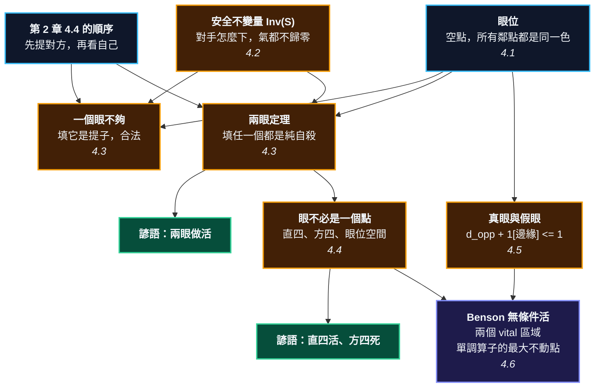

# 第 3 章：眼與不敗的不變量 —— 死活的第一原理

---

## 0. 我們在哪裡

**開始之前你需要具備：**

* 第 2 章 §4.2 的兩個定義：棋串是同色的連通分量，氣 $L(S)$ 是一個**集合**。
* 第 2 章 §4.4 的兩條規則，特別是它們的**順序**：一手棋落下，先檢查對方有沒有棋串沒氣（提掉），再檢查自己是不是自殺。這一章有一半的內容是這個順序的後果。
* 第 2 章 §4.3 的三項分解 —— 只在少數幾個地方用到，會有 RECALL 提醒。
* 數學方面：集合、以及「鴿籠原理」的直覺（三隻鴿子兩個籠，一定有一個籠子裝兩隻）。

**讀完本章後你將能夠：**

* 說出「活」的精確定義，並區分兩種不同的「活」—— 一種要應手，一種不用。
* 自己證明兩眼定理，而不是背它。
* 用一條不等式判斷真眼與假眼，並說出這條不等式什麼時候會騙你。
* 對任何盤面跑一次 Benson 演算法，判定哪些棋是「就算我從此不應也殺不掉」。

---

## 1. 開場思想實驗與掙得的頓悟

### 思想實驗：兩個通風口

你被關在一個房間裡。牆是你自己砌的，很厚。房間有兩個通風口，空氣從那裡進來。

外面有一個人想悶死你。

他堵通風口的唯一辦法，是**把自己塞進去** —— 那個通風口的形狀剛好只容得下一個人，而且四周都是你的牆。

問題來了：只要另一個通風口還通著，房間裡就還有空氣，你還活著。而塞在通風口裡的那個人，四面都是你的牆，他自己會先窒息。

所以他不敢塞。他只有在**「這是最後一個通風口」**的時候才敢塞進去 —— 因為在那一瞬間，你先窒息，牆會塌，他就重獲自由。

兩個通風口，他永遠等不到那一瞬間。

**因為他一次只能塞一個。**

### 把謎題寫成一個問題

每一本圍棋入門書都會告訴你：「要做兩個眼才能活。」

然後就沒有然後了。為什麼是兩個？一個為什麼不行？三個為什麼是浪費？這個「二」是從哪裡冒出來的？

初學者通常會得到一個循環的答案：「因為有兩個眼對方就填不進來。」——為什麼填不進來？「因為那是自殺。」——那一個眼的時候呢，那不也是自殺嗎？

它確實是。但它是一種**合法的自殺**。

**這一章要回答的問題是：那個「二」是從哪裡來的？**

答案完全藏在第 2 章 §4.4 那七個字裡：**先提對方，再看自己**。

「填掉對方最後一口氣」這一手，為什麼合法？因為在檢查「我是不是自殺」之前，對方已經先被提走了 —— 提走之後那裡空出一大片，我有氣。所以這一手不是自殺，是提子。

而如果對方有兩個眼呢？我填其中一個。這一手能提掉對方嗎？不能，對方還有另一個眼當作氣。既然提不到對方，「先提對方」這一步就什麼都沒發生，接下來檢查我自己 —— 我四面都是對方的子，氣是空集合。**純自殺，不合法。**

> [!EUREKA]
> **「活」不是一種形狀，而是一個保證：不管對手怎麼下，你都有辦法讓自己的氣不歸零。**
>
> 而「兩個眼」之所以是這個保證最便宜的實現方式，理由完全來自第 2 章的提子順序。填掉最後一口氣之所以合法，是因為那一手同時提掉了對方；當對方有兩個眼時，填任何一個都提不到對方，於是那一手退化成純自殺，永遠不能下。
>
> 那個「二」不是圍棋知識，是**鴿籠原理**：對手一手只能填一個點，而他需要兩個點同時消失。
>
> 寫成符號，本章要建立的東西是這個：
> $$\mathrm{Inv}(S) \;\equiv\; \text{對手的任何下法序列之下，}\;|L(S)| \ge 1 \;\text{恆成立}$$
> 接下來整章就是在回答一個問題：**什麼樣的盤面，能保證這個不變量？**

```text
                        第 3 章的一句話

   第 2 章 §4.4 的順序          先提對方  ─────►  再看自己
     （規則 2.7 與 2.8）             │                 │
                                     │                 │
              ┌──────────────────────┴───┐        ┌────┴──────────────┐
              ▼                          ▼        ▼                   ▼
      只有一個眼：填它能提到你        兩個眼：填任一個都提不到你
      => 那一手是【提子】，合法       => 那一手是【純自殺】，不合法
              │                                    │
              ▼                                    ▼
            死                                    活
                                                   │
                    ┌──────────────────────────────┼───────────────────┐
                    ▼                              ▼                   ▼
              眼可能是【假】的              眼不必只有【一個點】      「活」有兩種
            d_opp + 1[邊緣] <= 1            vital 區域               要應手 / 不用應手
                    │                              │                   │
                    └──────────────┬───────────────┴───────────────────┘
                                   ▼
                       Benson 無條件活（最大不動點）
                    「兩個 vital 區域」= 兩眼定理的正確推廣
```



---

## 2. 多角度直觀：眼

本章的中心物件是**眼**。四道透鏡。

> [!INTUITION]
> **角度一：手感／實戰透鏡**
>
> 對局時你會盯著一塊棋自問：「這塊有幾個眼？」然後手指在盤上點兩下。
>
> 請注意你剛才做的事：你數的不是「洞」，也不是「空間」。你數的是**對手不能下的點**。這才是眼的功能 —— 它是一塊禁區，而且是只對他一個人生效的禁區。
>
> 這也解釋了一種常見的挫折感：你數到兩個眼，很安心；對手下了一手，其中一個眼忽然「不見了」。那個眼從一開始就不是禁區 —— 它是假眼。§4.5 會給出一條可以在三秒內算完的判定式，讓這種事不再發生。

> [!INTUITION]
> **角度二：幾何／形狀透鏡**
>
> 眼在盤上長什麼樣子？一個空點，四周（或在邊上是三周、在角上是兩周）全被自己的子圍住。
>
> 但真正決定它真假的，不是那四周，是**四個對角**。這件事很反直覺：明明對角在圍棋裡「不算相鄰」（第 2 章 §4.1），為什麼它決定了眼的真假？
>
> 因為對角決定了**那些圍著眼的子彼此連不連得起來**。如果它們是同一塊棋，眼是真的；如果它們是好幾塊各自為政的棋，對手只要吃掉其中一塊，眼就破了。第 2 章那條「斜對角不算相鄰」的約定，在第 2 章造成了愚形，在這一章造成了假眼 —— 同一個約定，兩個後果。

> [!INTUITION]
> **角度三：代數／計算透鏡**
>
> 本章要建立三個由弱到強的東西：
>
> $$\underbrace{\text{眼位}}_{\text{只看鄰點}} \;\longrightarrow\; \underbrace{\text{真眼}: \; d_{\text{opp}}(v) + \mathbb{1}[v \in \partial G] \le 1}_{\text{加看對角，局部判定}} \;\longrightarrow\; \underbrace{\text{Benson 無條件活}}_{\text{全盤，可判定，最大不動點}}$$
>
> 前兩個是給人用的快速規則，第三個是定理。三者的可靠度嚴格遞增，而本章會誠實標示每一個的失效範圍。

> [!BOARD REALITY]
> **角度四：棋盤現實檢查**
>
> 死活算錯，是業餘棋手輸掉整局最戲劇化的方式 —— 一塊二十顆子的棋忽然不見了，勝負當場結束。三種最常見的錯法：
>
> **第一種：把假眼當真眼。** 對局時你只看到「四周都是我的子」，沒看對角。這是本章 §4.5 的判定式要根治的。
>
> **第二種：以為做完了就不用管。** 直四是活的，但它**需要應手**（§4.4、§4.6）。如果你把它當成「已經活透了」而跑去別處連下三手，對手在你的眼位裡動兩下，那塊棋就死了。
>
> **第三種：只看一塊棋。** 這是最隱蔽的一種。你這塊棋的第二個眼，是和隔壁那塊棋共用的；隔壁那塊死了，你的眼也跟著沒了。§4.6 的 Benson 迭代之所以要一輪一輪跑，就是為了抓這件事 —— §5 的手算範例整個就在示範它。

---

## 3. 散落的碎片（問題本身）

**第一片碎片：一個沒有理由的數字。** 「兩眼做活。」為什麼是二？入門書給不出理由，於是這條規則被當成公理背下來。而一旦它是公理，讀者就沒有能力判斷它的邊界 —— 例如雙活（第 13 章）根本沒有兩個眼，卻也是活的；而有些明明有兩個眼的棋，卻是死的（本章 §5 就有一個）。

**第二片碎片：一張又一張形狀表。** 「直四活、曲四活、方四死、丁四死、板六活、盤角曲四死。」六條規則，六張圖，各自獨立。學生把它們背下來，遇到表上沒有的形狀就沒轍。而眼位空間的形狀有無限多種。

**第三片碎片：一句只能靠看的判斷。** 「這是假眼。」怎麼看出來的？「就是看出來的。」這句話把一個三秒鐘的算術問題，變成了一個需要五年的直覺問題。

**第四片碎片：三個被混用的「活」。** 圍棋書裡的「活」至少有三個不同的意思，而它們從來沒有被區分：
1. 我**現在就已經**活了，對手怎麼下我都不用理。
2. 我**只要正確應手**就活得了。
3. 我**輪到我下**的話可以做活（也就是還沒活）。

第 1 種和第 2 種的差別，在實戰上價值好幾目 —— 因為第 2 種代表你未來還欠一手棋。傳統教材把兩者都叫「活」，於是初學者在形勢判斷時系統性地高估自己。

**第五片碎片：死活題被當成題庫，不是理論。** 市面上有幾千道死活題。它們是很好的練習，但它們不是一個理論 —— 做完一千道，你會變快，卻不會多知道一條可以套用到第一千零一道的規則。

### 新手典型會錯在哪裡

1. **數到兩個眼就放心。** 沒有檢查眼是不是真的，也沒有檢查那兩個眼是不是屬於同一塊棋。
2. **在自己活棋的眼位裡補一手。** 第 2 章 §4.6 的 $\eta$ 說補一手會損氣，這裡更嚴重：補在眼位裡可能把兩個眼變成一個。
3. **把「還沒活」當成「已經活了」。** 直四、板六、大眼 —— 這些形狀是活的，但都欠著一手應手。

---

## 4. 對齊（解答）

### 4.1 什麼是眼位

先給一個只看鄰點、完全不看對角的最樸素定義。它不夠強，但它是後面所有東西的地基。

> **定義 3.1（眼位）** 一個空點 $v$ 是顏色 $c$ 的**眼位**（eye-like point），若 $v$ 的**每一個**鄰點上都有 $c$ 的子。
>
> 用集合寫：$\;v \notin \mathrm{Occupied}\;$ 且 $\;N(v) \subseteq \{\,\text{顏色為 } c \text{ 的點}\,\}$。

注意這個定義用的是 $N(v)$ —— 上下左右，不含對角。在角上 $|N(v)| = 2$，邊上 $3$，中央 $4$。

> [!RECALL]
> **$N(v)$ 只有上下左右四個方向，斜對角不算。**
> 第 2 章 §4.1 的定義 2.1。這裡要用它兩次，而且用法相反：
> **眼位**的定義只看 $N(v)$（所以對角無關）；但 §4.5 的**真假眼**判定完全靠對角。
> 兩者不矛盾 —— 前者問「這個洞封住了嗎」，後者問「封住它的那些子，是不是同一塊棋」。

<!-- diagram: ch03_eye_like -->
```text
     A B C D E F G H J
   9 . . . . . . . . . 9
   8 . . . . . . . . . 8
   7 . . + . . . + . . 7
   6 . . . . . . . . . 6
   5 . . . . + . . . . 5
   4 . . . . . . . . . 4
   3 . . + . . . + . . 3
   2 X X X . X X . . . 2
   1 a X . . b X . . . 1
     A B C D E F G H J
```
*a 是眼位：它的兩個鄰點 A2 與 B1 都是黑子。b 不是：它的鄰點 D1 還空著。眼位的定義只看鄰點，不看對角。*

$a$ 在角上，$N(a) = \{\text{A2}, \text{B1}\}$，兩個都是黑子，所以 $a$ 是眼位。
$b$ 在邊上，$N(b) = \{\text{D1}, \text{F1}, \text{E2}\}$，其中 D1 是空點，所以 $b$ 不是眼位。

### 4.2 安全不變量：把「活」寫成一句話

§3 說過，「活」這個字在圍棋書裡有三個意思。現在把它們分開，各給一個定義。

> **定義 3.2（活）** 棋串 $S$ 是**活的**，若存在一個回應策略，使得無論對手怎麼下，$S$（或包含它的後繼棋串）永遠不被提。
>
> 用不變量的語言寫：存在策略使得
> $$\mathrm{Inv}(S) \;\equiv\; |L(S)| \ge 1 \quad \text{在整盤棋的每一個時刻都成立}$$

> **定義 3.3（無條件活／虛手也活）** 棋串 $S$ 是**無條件活的**（unconditionally alive，也叫 pass-alive），若上面那件事在「我從此每一手都虛手、一顆子都不再下」的情況下仍然成立。

第二個比第一個強，而且是嚴格地強：

$$\text{無條件活} \;\Longrightarrow\; \text{活}$$

而反過來不成立 —— §4.4 會給出一個「活但不是無條件活」的具體形狀（直四）。這兩者的差別，正是 §3 第四片碎片說的那件事：**它值一手棋。**

為什麼要費事定義第二個？因為第一個定義裡有一個「存在一個策略」，而策略有無窮多種，這讓「活」原則上不容易判定。第二個定義裡沒有策略 —— 我什麼都不做 —— 所以它可以被一個演算法在多項式時間內判定。§4.6 就是那個演算法。

**本章的策略是：先把可判定的那一個做到底，再誠實說明它漏掉了什麼。**

### 4.3 兩眼定理

現在證明本章的主定理。整個證明只用到第 2 章的兩條規則和它們的順序。

> [!RECALL]
> **規則 2.7 與 2.8，以及它們的順序。**
> 第 2 章 §4.4：一手棋落下之後，**先**檢查對方有沒有棋串的氣變成空集合（有就提走），**再**檢查自己這一串的氣是不是空集合（是就非法）。
> 這一節的每一步都靠這個順序。請把它放在手邊。

#### 先看一個眼為什麼不夠

<!-- diagram: ch03_one_eye -->
```text
     A B C D E F G H J
   9 . . . . . . . . . 9
   8 . . . . . . . . . 8
   7 . . + . . . + . . 7
   6 . . . . . . . . . 6
   5 . . . . + . . . . 5
   4 . . . . . . . . . 4
   3 O O + . . . + . . 3
   2 X X O . . . . . . 2
   1 a X O . . . . . . 1
     A B C D E F G H J
```
*黑三子外氣已被填光，只剩 a 這一個眼。白下 a 會怎樣？那顆白子四周全是黑子，看起來是自殺 —— 但別忘了第 2 章 §4.4 的順序。*

黑棋串是 $\{$A2, B2, B1$\}$。它的氣：A2 的鄰點是 A1、A3（白）、B2（自己人）；B2 的鄰點是 B1、B3（白）、A2、C2（白）；B1 的鄰點是 A1、B2、C1（白）。所以

$$L(S) = \{\text{A1}\}, \qquad |L(S)| = 1$$

> **命題 3.4（一個眼不夠）** 若棋串 $S$ 只有一個眼位 $v$，而且 $L(S) = \{v\}$，則對手下 $v$ 是合法的，且會提掉 $S$。
>
> **證明。** 對手在 $v$ 落子。依規則的順序：
> 1. **先檢查對方（也就是 $S$）**：$v$ 本來是 $S$ 唯一的氣，現在被佔了，所以 $|L(S)| = 0$。依規則 2.7，$S$ 被提走。
> 2. **再檢查自己**：$S$ 已經被移除，$v$ 周圍空出來了，所以這顆子有氣。
>
> 這一手是**提子**，不是自殺。合法。∎

<!-- diagram: ch03_one_eye_after -->
```text
     A B C D E F G H J
   9 . . . . . . . . . 9
   8 . . . . . . . . . 8
   7 . . + . . . + . . 7
   6 . . . . . . . . . 6
   5 . . . . + . . . . 5
   4 . . . . . . . . . 4
   3 O O + . . . + . . 3
   2 . . O . . . . . . 2
   1 1 . O . . . . . . 1
     A B C D E F G H J
```
*白 1 落下的瞬間，先檢查黑棋：黑三子的氣是空集合，被提走。提完之後白 1 有三口氣。一個眼救不了這塊棋 —— 因為「填最後一口氣」這一手，是靠提子才合法的。*

**請注意這個證明真正說了什麼。** 它沒有說「一個眼比較弱」。它說的是：對手那一手之所以合法，**完全是靠提子救回來的**。如果提不到，那一手就不合法。

於是問題變成：**怎麼讓他提不到？**

#### 兩個眼

<!-- diagram: ch03_two_eyes -->
```text
     A B C D E F G H J
   9 . . . . . . . . . 9
   8 . . . . . . . . . 8
   7 . . + . . . + . . 7
   6 . . . . . . . . . 6
   5 . . . . + . . . . 5
   4 . . . . . . . . . 4
   3 O O O O . . + . . 3
   2 X X X X O . . . . 2
   1 a X b X O . . . . 1
     A B C D E F G H J
```
*同樣把外氣填光，但這次有兩個眼 a 與 b。白下 a：黑還有 b，沒被提，所以白那顆子是純自殺 —— 不合法。白下 b 同理。白永遠等不到「這是最後一口氣」的那一刻。*

> **定理 3.5（兩眼定理）** 設棋串 $S$ 有兩個**不同**的眼位 $v_1 \ne v_2$。則 $S$ 是**無條件活的** —— 就算 $S$ 的主人從此一手都不下，$S$ 也永遠不會被提。
>
> **證明。** 分三步。
>
> **第一步：$v_1, v_2$ 都是 $S$ 的氣。** 依定義 3.1，$v_i$ 是空點，而且它的鄰點全是 $S$ 的顏色。這些鄰點裡至少有一個屬於 $S$ 本身（否則 $v_i$ 就不是 $S$ 的眼），所以 $v_i \in L(S)$。因此只要 $v_1, v_2$ 還空著，就有
> $$|L(S)| \ge 2$$
>
> **第二步：對手不能下 $v_1$。** 假設對手在 $v_1$ 落子，考察規則的兩步：
>
> * **先檢查對方**（也就是 $S$）：$S$ 現在的氣至少還有 $v_2$（$v_2$ 仍是空點，且是 $S$ 的鄰點），所以 $|L(S)| \ge 1$，$S$ **不被提**。
>   還有沒有別的我方棋串可能被提？沒有 —— $v_1$ 的所有鄰點依定義都是 $S$ 的顏色，所以這顆子唯一貼著的敵方棋串就是 $S$。
> * **再檢查自己**：這顆子的鄰點全是對方的子（$S$ 的顏色），一個空點都沒有，所以它的氣是空集合。
>
> 提子沒發生，自己沒氣 —— 依規則 2.8，這一手**不合法**。
>
> **第三步：$v_2$ 同理。** 把上面的 $v_1$ 與 $v_2$ 對調，論證一字不變。
>
> 所以 $v_1$ 與 $v_2$ 永遠是空點，$|L(S)| \ge 2 > 0$ 恆成立。$\mathrm{Inv}(S)$ 成立，而且過程中 $S$ 的主人一手都沒下。∎

#### 那個「二」到底是什麼

回頭看第二步。對手要下 $v_1$，唯一能救他的是「提到對方」。他提不到，因為 $S$ 還有 $v_2$。

那他能不能先把 $v_2$ 也填掉？不能 —— 填 $v_2$ 是同一個問題，那時候 $S$ 還有 $v_1$。

他真正需要的，是**同時**佔住 $v_1$ 和 $v_2$。而

$$\textbf{一手棋只能下一個點。}$$

這就是鴿籠原理，也是整個「二」的來源。兩個眼不是一個關於形狀的事實，是一個關於**回合制**的事實。如果圍棋的規則允許一手下兩子，兩眼定理立刻失效，而三眼會變成新的門檻。

> [!PROVERB]
> **「兩眼做活」**
> **它其實在說**：兩個眼位讓對手每一次填眼的嘗試都退化成純自殺（定理 3.5）。那個「二」來自「一手只能下一個點」這條回合制規則，不是來自棋形。
> **失效條件一**：眼必須是**真的**。假眼在定義 3.1 底下也算眼位，但它撐不住 —— §4.5 會說明為什麼。
> **失效條件二**：兩個眼必須屬於**同一塊棋**。§5 有一個盤面，四個點通通通過真眼判定式，卻只有一半的棋活著。
> **失效條件三**：兩眼是**充分**條件，不是必要條件。雙活（seki，第 13 章）雙方都沒有兩個眼，卻都活著 —— 因為那裡的活不是靠不變量，是靠溫度為負（第 13 章 §4.4）。

### 4.4 眼不必是一個點

> [!RECALL]
> **兩眼定理（定理 3.5）的證明用到了眼的什麼性質？**
> §4.3 的第二步只用了兩件事：（a）$v_1$ 的鄰點全是我方的子，所以對手下在那裡自己沒氣；
> （b）$v_2$ 還空著，所以對手提不到我。
> **證明從頭到尾沒有用到「眼只有一個點」。** 這一節就是要把這個觀察兌現。

定理 3.5 要的是「兩個對手不能進來的地方」。它剛好用一點大的眼來實現，但一點不是必需的。

<!-- diagram: ch03_straight_four -->
```text
     A B C D E F G H J
   9 . . . . . . . . . 9
   8 . . . . . . . . . 8
   7 . . + . . . + . . 7
   6 . . . . . . . . . 6
   5 . . . . + . . . . 5
   4 . . . . . . . . . 4
   3 . . + . . . + . . 3
   2 X X X X X . . . . 2
   1 . . . . X . . . . 1
     A B C D E F G H J
```
*直四眼位：A1–D1 是【一個】四點的區域，而且它是 vital 的。但 Benson 要兩個，所以這塊棋不是「虛手也活」—— 它需要應手。直四是活的，只是活得沒那麼廉價。*

這塊黑棋圍出了 A1、B1、C1、D1 四個空點。它活嗎？

**活。** 白若在 B1 落子，黑在 C1 應一手，眼位就被切成 $\{$A1$\}$ 與 $\{$D1$\}$ 兩個真眼（B1 上的白子被夾在中間，遲早被提）。白若在 C1 落子，黑在 B1 應。無論白下哪裡，黑都有一手把它切成兩個眼。

**但它不是無條件活。** 如果黑完全不應，白依序填 B1、C1、A1，最後下 D1 —— 那一手會提掉整塊黑棋。

> **定義 3.6（眼位空間／區域）** 一塊被顏色 $c$ 完全包住的區域 $R$：$R$ 是「非 $c$ 的點」構成的連通分量，而且 $R$ 的所有外鄰點都是 $c$ 的子。

直四的眼位空間是**一個**四點的區域，不是兩個。所以定理 3.5 用不上。

#### 為什麼方四是死的

<!-- diagram: ch03_square_four -->
```text
     A B C D E F G H J
   9 . . . . . . . . . 9
   8 . . . . . . . . . 8
   7 . . + . . . + . . 7
   6 . . . . . . . . . 6
   5 . . . . + . . . . 5
   4 . . . . . . . . . 4
   3 X X X . . . + . . 3
   2 . . X . . . . . . 2
   1 . . X . . . . . . 1
     A B C D E F G H J
```
*方四眼位 A1、A2、B1、B2。注意 A1 的兩個鄰點 A2 與 B1 都還在眼位裡面 ——A1 根本不貼著黑棋，所以它不是黑棋的氣，這個區域【不是 vital】。「方四死」這句口訣，就是 vital 這個條件的白話版。*

方四的眼位空間也是四個點，和直四一樣多。為什麼直四活、方四死？

看 A1 這個點。它的鄰點是 A2 和 B1 —— **兩個都還在眼位裡面**。A1 完全不貼著任何黑子。

這件事的後果很嚴重：**A1 不是黑棋的氣**。白棋走進 A1，不會減少黑棋的氣，所以那一手是「免費」的。白可以在方四裡從容佈置，黑無法用「填眼是自殺」來阻止他。

對比直四：A1 貼著 A2（黑），B1 貼著 B2（黑），C1 貼著 C2（黑），D1 貼著 D2 與 E1（黑）。**四個點全都是黑棋的氣。** 白走進任何一點，都在減自己的活路。

這個區別有一個名字。

> **定義 3.7（vital 區域）** 區域 $R$ 對棋串 $S$ 而言是 **vital** 的，若 $R$ 裡的**每一個空點**都是 $S$ 的氣：
> $$\{\,v \in R : v \text{ 是空點}\,\} \;\subseteq\; L(S)$$

直四的眼位空間是 vital 的；方四的不是。

> [!PROVERB]
> **「直四曲四活，方四丁四死」**
> **它其實在說**：四點的眼位空間，若每一個點都貼著圍牆（vital），就活；若有點不貼牆，對手可以在那裡免費落子，就死。直四、曲四的四個點都貼牆；方四有兩個角點不貼牆（例如 A1 的鄰點 A2 與 B1 都在眼位裡），丁四（T 字形）的中心點也不貼牆。
> **失效條件**：這條諺語只講「眼位空間的形狀」，完全沒講**圍牆本身牢不牢**。如果圍牆上有斷點、或圍牆的某一段是可以被吃掉的孤子，那麼再漂亮的直四也沒有用 —— §4.6 的 Benson 迭代與 §5 的手算範例，整個就在示範這件事。

### 4.5 真眼與假眼

現在回到「眼位」這個定義的漏洞。

<!-- diagram: ch03_false_eye_edge -->
```text
     A B C D E F G H J
   9 . . . . . . . . . 9
   8 . . . . . . . . . 8
   7 . . + . . . + . . 7
   6 . . . . . . . . . 6
   5 . . . . + . . . . 5
   4 . . . . . . . . . 4
   3 . . + . . . + . . 3
   2 O X X . . . . . . 2
   1 X a X X . . . . . 1
     A B C D E F G H J
```
*邊上的眼位 a。邊上只有兩個對角，而白佔了 A2 —— 判定式 d_opp + 1 = 2 > 1，是假眼。下一張圖說明為什麼。*

> [!RECALL]
> **命題 3.4：一個眼撐不住，是因為「填它」那一手靠提子救回了合法性。**
> §4.3。接下來要看的假眼是同一個機制，只是被提走的不是整塊棋，而是圍著眼的其中一顆子。
> 讀下面這一段時，請一直問同一個問題：**對手填這個點，會不會提到什麼？**

$a$（B1）符合定義 3.1：它的三個鄰點 A1、C1、B2 全是黑子。但它不是一個好眼。

原因在 A1 那顆子。A1 的鄰點只有兩個：A2（白子）和 B1（也就是 $a$）。所以

$$L(\{\text{A1}\}) = \{\text{B1}\} = \{a\}$$

**A1 是一顆只剩一口氣的孤子，而它的最後一口氣，就是那個眼。**

<!-- diagram: ch03_false_eye_broken -->
```text
     A B C D E F G H J
   9 . . . . . . . . . 9
   8 . . . . . . . . . 8
   7 . . + . . . + . . 7
   6 . . . . . . . . . 6
   5 . . . . + . . . . 5
   4 . . . . . . . . . 4
   3 . . + . . . + . . 3
   2 O X X . . . . . . 2
   1 . 1 X X . . . . . 1
     A B C D E F G H J
```
*白 1 下在假眼上。黑 A1 的氣本來只有 B1 一個，現在是空集合，被提走。假眼的本質：**那個眼點是某顆己方子的最後一口氣**，所以填它對白而言是提子，不是自殺。*

白下 $a$：依規則的順序，先檢查黑棋 —— 黑 $\{$A1$\}$ 的氣變成空集合，被提走。提子發生了，所以這一手合法。

**這和命題 3.4 是同一件事。** 一個眼之所以撐不住，是因為填它會提到對方；假眼之所以撐不住，也是因為填它會提到對方 —— 只是被提的不是整塊棋，而是圍著眼的其中一顆子。

> **定義 3.8（真眼與假眼）** 一個眼位若能撐住（對手填它永遠是純自殺），叫**真眼**；否則叫**假眼**。

#### 一條可以在三秒內算完的判定式

上面的分析要看「A1 有幾口氣」，實戰上太慢。有一條只看**對角**的快速規則。

為什麼是對角？因為圍著眼的那幾顆子，能不能連成一塊，取決於對角。以 $a = $ B1 為例，它的鄰點 A1、C1、B2 要連起來，必須經過 A2 或 C2 —— 而 A2、C2 正是 B1 的兩個對角點。

> **定理 3.9（真眼的判定式）** 設 $v$ 是顏色 $c$ 的眼位，$d_{\text{opp}}(v)$ 是 $v$ 的對角點裡被對方佔住的個數。則
>
> $$\boxed{\;v \text{ 是真眼} \iff d_{\text{opp}}(v) + \mathbb{1}\big[v \text{ 在棋盤邊緣}\big] \;\le\; 1\;}$$
>
> 其中 $\mathbb{1}[\cdot]$ 在條件成立時是 1、否則是 0。

拆開來看，這就是那句口訣：

| $v$ 的位置 | 對角點數 | 指示函數 | 條件 | 對方最多可佔 | 己方至少要佔 | 口訣 |
| :--- | ---: | ---: | :--- | ---: | ---: | :--- |
| 中央 | 4 | 0 | $d_{\text{opp}} \le 1$ | 1 | 3 | 「中央三」 |
| 邊上 | 2 | 1 | $d_{\text{opp}} \le 0$ | 0 | 2 | 「邊上二」 |
| 角上 | 1 | 1 | $d_{\text{opp}} \le 0$ | 0 | 1 | 「角上一」 |

那個 $\mathbb{1}[v \in \partial G]$ 在做什麼？它在補償**邊上少掉的對角**。中央有四個對角，對手拿走一個，還有三個撐著；邊上只有兩個，對手拿走一個就只剩一個，撐不住。指示函數把「邊上少兩個對角」這件事，換算成「容許值少一格」。

<!-- diagram: ch03_true_eye_centre -->
```text
     A B C D E F G H J
   9 . . . . . . . . . 9
   8 . . . . . . . . . 8
   7 . . + . . . + . . 7
   6 . . . X X X . . . 6
   5 . . . X a X . . . 5
   4 . . . X X O . . . 4
   3 . . + . . . + . . 3
   2 . . . . . . . . . 2
   1 . . . . . . . . . 1
     A B C D E F G H J
```
*中央的眼位 a。四個對角裡對方只佔了一個（F4），判定式 d_opp + 0 = 1 <= 1，是真眼。*

$$d_{\text{opp}} + \mathbb{1}[\cdot] = 1 + 0 = 1 \le 1 \quad\Longrightarrow\quad \text{真眼}$$

<!-- diagram: ch03_false_eye_centre -->
```text
     A B C D E F G H J
   9 . . . . . . . . . 9
   8 . . . . . . . . . 8
   7 . . + . . . + . . 7
   6 . . . X X X . . . 6
   5 . . . X a X . . . 5
   4 . . . O X O . . . 4
   3 . . + . . . + . . 3
   2 . . . . . . . . . 2
   1 . . . . . . . . . 1
     A B C D E F G H J
```
*同樣的眼位 a，但對方佔了兩個對角（D4、F4）。d_opp + 0 = 2 > 1，是假眼。差別只在一顆子。*

$$d_{\text{opp}} + \mathbb{1}[\cdot] = 2 + 0 = 2 > 1 \quad\Longrightarrow\quad \text{假眼}$$

而且可以看出假眼的結構性後果：在這張圖裡，圍著 $a$ 的黑子分成了**兩塊** —— $\{$D5, D6, E6, F5, F6$\}$ 和孤零零的 $\{$E4$\}$。E4 只有兩口氣。這正是 §2 角度二說的：對角決定了圍著眼的子連不連得起來。

<!-- diagram: ch03_true_eye_edge -->
```text
     A B C D E F G H J
   9 . . . . . . . . . 9
   8 . . . . . . . . . 8
   7 . . + . . . + . . 7
   6 . . . . . . . . . 6
   5 . . . . + . . . . 5
   4 . . . . . . . . . 4
   3 . . + . . . + . . 3
   2 X X X . . . . . . 2
   1 X a X X . . . . . 1
     A B C D E F G H J
```
*把 A2 換成黑子，a 就變成真眼：d_opp + 1 = 0 + 1 = 1 <= 1。同時 A1 也不再是孤子 —— 它和整塊棋連上了。這兩件事是同一件事。*

> [!WARNING]
> **判定式 3.9 是一條給人用的快速規則，不是定理的全部。**
> 它只看「此時此刻」對角上有沒有敵子，並**假設那些對角上的己方子本身是安全的**。如果某個對角上的己方子自己就快被吃掉，判定式會給出過於樂觀的答案。
> 真正可靠、而且完全可判定的判準是下一節的 Benson。§5 會給一個盤面，四個點在判定式底下**全部是真眼**，而其中一半的棋是死的。
> 本書的立場是：判定式拿來在對局時三秒鐘篩掉明顯的假眼；要下結論，用 Benson。

### 4.6 Benson 無條件活

> [!RECALL]
> **兩種「活」（定義 3.2 與 3.3）。**
> §4.2：**活** = 存在一個回應策略讓氣永不歸零；**無條件活** = 連回應都不需要，我全程虛手也吃不掉。
> 這一節要建立的演算法判定的是**後者** —— 因為後者裡沒有「存在一個策略」這個量詞，所以它可以被機器算出來。
> 前者更寬鬆，但也更難判定；本節末會誠實說明兩者差在哪裡。

現在把兩眼定理推到它的極限。

定理 3.5 要的是「兩個對手進不來的地方」。§4.4 說那個地方不必是一個點，可以是一整塊 vital 區域。把這兩件事合起來，再加上一個 §4.5 教會我們的教訓（**圍牆本身也得是安全的**），就得到 Benson 的定理。

> **定理 3.10（Benson, 1976）** 考慮顏色 $c$ 的一組棋串 $X$ 與一組被 $c$ 圍住的區域 $\mathcal{R}$。若
>
> 1. $X$ 裡的每一個棋串，在 $\mathcal{R}$ 裡至少有 **2 個 vital 區域**；且
> 2. $\mathcal{R}$ 裡的每一個區域，它的所有鄰接棋串都在 $X$ 裡，
>
> 則 $X$ 裡的所有棋串都是**無條件活**的。而且，滿足這兩個條件的最大的 $(X, \mathcal{R})$ 是唯一的，並且可以用下面的迭代算出來。

條件 1 是兩眼定理的推廣（「兩個」還在，「眼」被放寬成「vital 區域」）。條件 2 是 §4.5 那個教訓的形式化：**你不能靠一塊自己都不安全的圍牆來做眼。**

#### 演算法：一直刪到刪不動

```text
    X  <-  我方的所有棋串
    R  <-  所有被我方圍住的區域

    重複：
        步驟 1：從 R 刪掉「有鄰接棋串不在 X 裡」的區域
        步驟 2：從 X 刪掉「在 R 裡的 vital 區域少於 2 個」的棋串
    直到 X 與 R 都不再變小

    剩下的 X 就是無條件活的。
```

兩個步驟都只會讓集合**變小**，不會變大。而集合是有限的，所以迭代一定會停。停下來的那個 $(X, \mathcal{R})$，就是滿足定理兩個條件的**最大**的一組 —— 數學上這叫**最大不動點**（greatest fixed point），由 Knaster–Tarski 定理保證存在且唯一。

「一直刪到刪不動為止，剩下的就是答案」—— 這個句型在數學裡出現得非常頻繁，而它在這裡的圍棋意思很直白：**先假設所有棋都活著，然後不斷把站不住腳的剔除掉。**

> [!RECALL]
> **「vital」的定義（§4.4 的定義 3.7）**：區域 $R$ 對棋串 $S$ 而言 vital，意思是 $R$ 裡的每一個空點都是 $S$ 的氣。
> 這一節的步驟 2 每一輪都要重算它。方四之所以死，就是因為它的區域不 vital（A1 不貼牆）；直四之所以「活但需要應手」，是因為它只有**一個** vital 區域。

<!-- diagram: ch03_benson_two_eyes -->
```text
     A B C D E F G H J
   9 . . . . . . . . . 9
   8 . . . . . . . . . 8
   7 . . + . . . + . . 7
   6 . . . . . . . . . 6
   5 . . . . + . . . . 5
   4 . . . . . . . . . 4
   3 . . + . . . + . . 3
   2 X X X X . . . . . 2
   1 . X . X . . . . . 1
     A B C D E F G H J
```
*Benson 無條件活的最小例子：兩個一點的區域 A1 與 C1，每一個的空點都是這塊棋的氣，所以兩個都是 vital。*

迭代第一輪就停了：唯一的棋串有兩個 vital 區域，兩個區域的鄰接棋串也都在 $X$ 裡。無條件活。

#### 為什麼它必須是迭代，而不是一次檢查

這是本節最重要的一張圖。

<!-- diagram: ch03_benson_cascade -->
```text
     A B C D E F G H J
   9 . . . . . . . . . 9
   8 . . . . . . . . . 8
   7 . . + . . . + . . 7
   6 . . . . . . . . . 6
   5 . . . . + . . . . 5
   4 . . . . . . . . . 4
   3 . . + . . . + . . 3
   2 X X X . . . . . . 2
   1 a X b X X . . . . 1
     A B C D E F G H J
```
*左邊那塊棋看起來有兩個眼 a 與 b，右邊那塊 D1、E1 只有 b。先別急著判斷，跟著 Benson 迭代走一遍 —— 這個盤面要跑四輪。*

盤上有兩個黑棋串：

* $A = \{$A2, B1, B2, C2$\}$，它有兩個 vital 區域：$\{a\} = \{$A1$\}$ 與 $\{b\} = \{$C1$\}$。
* $B = \{$D1, E1$\}$，它只有一個：$\{b\}$。

用判定式 3.9 檢查：$a$ 在角上，對角只有 B2（黑），$d_{\text{opp}} + 1 = 0 + 1 = 1 \le 1$，真眼。$b$ 在邊上，對角是 B2 與 D2，B2 是黑、D2 是空，$d_{\text{opp}} + 1 = 0 + 1 = 1 \le 1$，也是真眼。

**兩個真眼，A 看起來活得很穩。** 但跟著迭代走：

| 輪 | 步驟 1（刪區域） | 步驟 2（刪棋串） | 剩下 |
| :--- | :--- | :--- | :--- |
| 1 | 沒有區域被刪 | $B$ 只有 1 個 vital 區域 → 刪掉 $B$ | 棋串 1 個，區域 3 個 |
| 2 | $\{b\}$ 的鄰接棋串 $B$ 不在 $X$ 裡 → 刪掉 $\{b\}$ | $A$ 現在只剩 $\{a\}$ 一個 vital 區域 → 刪掉 $A$ | 棋串 0 個，區域 1 個 |
| 3 | 剩下的區域也失去鄰接棋串 → 刪掉 | 沒東西可刪 | 0, 0 |
| 4 | 沒有變化 | 沒有變化 | **停** |

**結果：一塊都不是無條件活。**

翻譯成棋語：$b$ 這個眼是左右兩塊棋**共用**的。右邊那塊自己活不了；等白棋吃掉右邊，$b$ 那一帶就打通了，左邊只剩一個眼。

> [!BOARD REALITY]
> **這是實戰上最常見、也最貴的死活誤判。**
> 你數自己這塊棋：一、二，兩個眼，安心。你沒注意到第二個眼是和隔壁那塊共用的，而隔壁那塊自己還沒活。
> 這種錯誤的代價通常是整盤棋，因為它發生在中盤，而且你會在錯誤的判斷下繼續投入 —— 你以為那塊棋是資產，其實它是負債。
> Benson 迭代之所以要一輪一輪跑，就是為了抓這件事：**一塊棋的死活，可能取決於旁邊另一塊棋的死活。你不能單獨看一塊棋。**

<!-- diagram: ch03_benson_fixed -->
```text
     A B C D E F G H J
   9 . . . . . . . . . 9
   8 . . . . . . . . . 8
   7 . . + . . . + . . 7
   6 . . . . . . . . . 6
   5 . . . . + . . . . 5
   4 . . . . . . . . . 4
   3 . . + . . . + . . 3
   2 X X X . X X X . . 2
   1 a X b X X c X . . 1
     A B C D E F G H J
```
*補上四顆子，右邊那塊有了自己的第二個眼 c。現在迭代第一輪就停了，兩塊棋都無條件活。差別只在那四顆子 —— 但它救的不只是右邊，也救了左邊。*

補上四顆子之後，$B$ 有了自己的第二個 vital 區域 $\{c\}$。迭代第一輪就穩定，兩塊棋都無條件活。

請注意這件事的方向：那四顆子下在**右邊**，救活的卻是**兩塊**。左邊那塊一顆子都沒加，卻從死變活 —— 因為它的第二個眼終於站得住了。

#### Benson 活與活，差在哪裡

$$\text{無條件活} \;\subsetneq\; \text{活}$$

直四是活的（§4.4 示範過應手的方法），但 Benson 說它不是無條件活。**這不是 Benson 的缺陷，是它的定義。** 兩者的差別有一個很實際的名字：

> **那一手棋。** 一塊「活但非無條件活」的棋，等於欠著一手棋。做形勢判斷（第 10 章）時，這一手要算進去。

> [!IMPORTANT]
> **本書對這三層判準的立場，明講如下。**
>
> | 判準 | 地位 | 可靠度 | 用在哪裡 |
> | :--- | :--- | :--- | :--- |
> | 眼位（定義 3.1） | 定義 | 只是形狀，什麼都不保證 | 當作詞彙 |
> | 真眼判定式（定理 3.9） | 局部啟發式 | 假設對角上的己方子安全 | 對局時三秒篩選 |
> | Benson（定理 3.10） | 定理，且可判定 | 完全可靠，但**只給充分條件** | 下結論、寫程式、覆盤 |
>
> Benson 說「無條件活」，那就一定活。Benson 說「不是」，那塊棋**可能**還是活的（直四就是），只是需要應手。這個不對稱要記牢。

---

## 5. 應用：手算追蹤與非黑盒程式

### 5.1 用手算一遍

<!-- diagram: ch03_worked -->
```text
     A B C D E F G H J
   9 c X d X X . . . . 9
   8 X X X . . . . . . 8
   7 . . + . . . + . . 7
   6 . . . . . . . . . 6
   5 . . . . + . . . . 5
   4 . . . . . . . . . 4
   3 . . + . . . + . . 3
   2 X X X X . . . . . 2
   1 a X b X . . . . . 1
     A B C D E F G H J
```
*§5 要手算的盤面。下面一塊、上面兩塊。四個看起來都像眼的點：a b c d。請先自己判斷哪些棋活、哪些死，再跟著 §5 的迭代走一遍。*

> [!RECALL]
> **Benson 迭代的兩個步驟（§4.6）。**
> 步驟 1：從區域集合裡刪掉「有鄰接棋串已經不在存活集合裡」的區域。
> 步驟 2：從存活集合裡刪掉「vital 區域少於 2 個」的棋串。
> 重複到不再變小。下面的手算就是照這兩步走四輪 —— 請特別注意第 2 輪，
> 那一輪同時發生了刪區域與刪棋串，也就是「連鎖倒塌」。

上下兩塊棋，形狀幾乎一樣。先用 §4.5 的判定式檢查那四個點。

**第一步：四個點都是真眼嗎？**

| 點 | 位置 | 對角點 | 對方佔幾個 | 指示函數 | $d_{\text{opp}} + \mathbb{1}$ | 判定 |
| :--- | :--- | :--- | ---: | ---: | ---: | :--- |
| $a$ = A1 | 角 | B2（黑） | 0 | 1 | 1 | 真眼 |
| $b$ = C1 | 邊 | B2（黑）、D2（黑） | 0 | 1 | 1 | 真眼 |
| $c$ = A9 | 角 | B8（黑） | 0 | 1 | 1 | 真眼 |
| $d$ = C9 | 邊 | B8（黑）、D8（空） | 0 | 1 | 1 | 真眼 |

**四個點全部通過。** 如果你只有判定式，你會說上下兩塊都活了。

**第二步：數棋串。** 這是判定式看不到的地方。

* 下面：A2–B2–C2–D2 連成一排，B1 貼著 B2，D1 貼著 D2 —— 全部連通，**一個**棋串 $\{$A2, B1, B2, C2, D1, D2$\}$。
* 上面：A8–B8–C8 連成一排，B9 貼著 B8 —— 這是一個棋串 $\{$A8, B8, B9, C8$\}$。而 D9 與 E9 呢？D9 的鄰點是 C9（空）、E9（黑）、D8（**空**）。所以 D9 沒有和上面那塊連起來，$\{$D9, E9$\}$ 是**另一個**棋串。

**下面一塊，上面兩塊。** 這就是全部的差別 —— 而它在棋圖上只表現為 D8 那一個空點。

**第三步：找區域，算 vital。**

下面：$\{a\}$、$\{b\}$ 兩個區域。$a$ = A1 貼著 A2 與 B1（都在那唯一的棋串裡）→ 是它的氣 → vital。$b$ = C1 貼著 B1、C2、D1 → vital。**兩個 vital 區域。**

上面：$\{c\}$、$\{d\}$ 兩個區域。
* $\{c\}$ = A9 貼著 A8、B9 → 都屬於棋串 $\{$A8, B8, B9, C8$\}$ → 對它 vital。
* $\{d\}$ = C9 貼著 B9、C8（屬於上面那塊）與 D9（屬於 $\{$D9,E9$\}$）→ 對**兩塊**都 vital。

所以：$\{$A8,B8,B9,C8$\}$ 有 2 個 vital 區域（$c$ 與 $d$），$\{$D9,E9$\}$ 只有 1 個（$d$）。

**第四步：跑迭代。**

| 輪 | 步驟 1（刪區域） | 步驟 2（刪棋串） | 剩餘（棋串, 區域） |
| :--- | :--- | :--- | :--- |
| 1 | 無 | $\{$D9,E9$\}$ 只有 1 個 vital → 刪 | (2, 5) |
| 2 | $\{d\}$ 的鄰接棋串 $\{$D9,E9$\}$ 已不在 $X$ → 刪 | $\{$A8,B8,B9,C8$\}$ 只剩 $\{c\}$ → 刪 | (1, 3) |
| 3 | 上面剩下的區域失去鄰接棋串 → 刪 | 下面那塊仍有 2 個 → 保留 | (1, 2) |
| 4 | 無變化 | 無變化 | **停** |

**結論：下面那塊無條件活；上面兩塊都不是。**

**第五步：讀出這個盤面在說什麼。**

四個點通通通過真眼判定式，而一半的棋是死的。差別只在 D8 那一個空點 —— 它讓 $\{$D9, E9$\}$ 變成一塊獨立的、只有一個眼的棋，而那塊棋一倒，$d$ 就不再是眼，上面整片跟著倒。

這正是 §4.5 那個 WARNING 說的事：判定式**假設對角上的己方子是安全的**。在這個盤面上，$d$ 的其中一個鄰點 D9 屬於一塊自己都活不了的棋，而判定式看不見這件事，因為它只看對角，不看那些子屬於哪一塊。

### 5.2 用程式驗一遍

```python
"""第 3 章 §5：真眼判定式說四個都是真眼，Benson 說一半的棋是死的。"""
from go_core import BLACK, Board, format_coord
from go_core.benson import benson_alive, enclosed_regions, is_vital
from go_core.eyes import eye_report
from go_core.strings import all_strings

b = Board(9)
b.place_many(BLACK, ["A2", "B2", "C2", "D2", "B1", "D1",     # 下面那塊
                     "A8", "B8", "B9", "C8", "D9", "E9"])    # 上面兩塊
print(b)

print("\n--- 第一步：真眼判定式 ---")
for label, pt in [("a", "A1"), ("b", "C1"), ("c", "A9"), ("d", "C9")]:
    r = eye_report(b, pt)
    print(f"  {label} = {pt}: {r['判定式']}   ->  {'真眼' if r['真眼'] else '假眼'}")
    assert r["真眼"], f"{pt} 應該通過判定式"

print("\n--- 第二步：數棋串 ---")
name = lambda S: "".join(sorted(format_coord(p, b.n) for p in S))
chains = all_strings(b, BLACK)
for ch in chains:
    print(f"  {name(ch)}")
assert len(chains) == 3, "下面一塊，上面兩塊"

print("\n--- 第三步：每塊棋有幾個 vital 區域 ---")
regions = [r for r in enclosed_regions(b, BLACK) if len(r) <= 4]
for ch in chains:
    vit = [name(r) for r in regions if is_vital(b, r, ch)]
    print(f"  {name(ch):14s} vital 區域 {len(vit)} 個: {vit}")

print("\n--- 第四步：迭代 ---")
X, log = benson_alive(b, BLACK, trace=True)
for row in log:
    print(f"  第 {row['round']} 輪：剩下 {row['chains']} 個棋串、{row['regions']} 個區域")

print("\n--- 結論 ---")
for ch in chains:
    print(f"  {name(ch):14s} {'無條件活' if ch in X else '不是無條件活'}")
assert len(X) == 1
assert name(next(iter(X))) == "A2B1B2C2D1D2"
print("\n判定式說四個都是真眼；Benson 說只有下面那塊活。後者是對的。")
```

**輸出裡該看什麼。** 看第四步那四行。第 1 輪只刪掉一個棋串（右上角那塊），第 2 輪卻連帶刪掉一個區域**和**一個棋串 —— 那就是連鎖倒塌。如果 Benson 只做一輪（也就是「檢查每塊棋有沒有兩個眼」），它會給出和真眼判定式一樣的錯誤答案。**迭代不是實作細節，它就是這個演算法的全部內容。**

> **配套範例腳本**：`examples/ch03_life_and_death/ex01_benson_trace.py`

### 5.3 直四：活，但欠一手

```python
"""第 3 章 §4.4：直四是活的，但不是無條件活 —— 而補一手可以買到無條件活。"""
from go_core import BLACK, Board, format_coord
from go_core.benson import benson_alive, enclosed_regions, is_vital
from go_core.strings import find_string

WALL = ["A2", "B2", "C2", "D2", "E2", "E1"]          # 實心圍牆，沒有斷點
name = lambda S, n=9: "".join(sorted(format_coord(p, n) for p in S))

def report(extra):
    b = Board(9)
    b.place_many(BLACK, WALL + extra)
    ch = find_string(b, "A2")
    regions = [r for r in enclosed_regions(b, BLACK) if len(r) <= 4]
    vit = [name(r) for r in regions if is_vital(b, r, ch)]
    return len(benson_alive(b, BLACK)) > 0, vit

ok, vit = report([])
print(f"直四本身          ：vital 區域 {vit} -> {'無條件活' if ok else '不是無條件活'}")
assert not ok and vit == ["A1B1C1D1"]

for move in ["A1", "B1", "C1", "D1"]:
    ok, vit = report([move])
    print(f"再下 {move} 之後      ：vital 區域 {vit} -> {'無條件活' if ok else '不是無條件活'}")

assert report(["B1"])[0] and report(["C1"])[0]        # 下在中間兩點：買到了
assert not report(["A1"])[0] and not report(["D1"])[0]  # 下在兩端：沒買到
print("\n把一個四點區域切成兩個，才會有兩個 vital 區域。切在端點等於沒切。")
```

**輸出裡該看什麼。** 下 B1 或 C1，四點區域被切成 $\{$A1$\}$ 與 $\{$C1, D1$\}$（或 $\{$A1, B1$\}$ 與 $\{$D1$\}$），兩個都 vital → 無條件活。下 A1 或 D1，區域只是變小成三點，還是**一個**，什麼都沒買到。這就是死活題裡「要下在要點」那句話的內容：**要點就是能把一個區域切成兩個的點。**

> **配套範例腳本**：`examples/ch03_life_and_death/ex02_eye_space_shapes.py`

---

## 6. 練習與完整解答

### 基礎練習

#### 練習 3.1

<!-- diagram: ch03_ex1 -->
```text
     A B C D E F G H J
   9 . . . . . . . . . 9
   8 . . . . . . . . . 8
   7 . . + . . . + . . 7
   6 . . . . . . . . . 6
   5 . . . . + . . . . 5
   4 . . . . . . . . . 4
   3 . . + . . . + . . 3
   2 . . . . . X X X X 2
   1 . . . . . . a X b 1
     A B C D E F G H J
```
*練習 3.1：a 與 b 各是不是眼位？是眼位的那個，是不是真眼？用定義和判定式算，不要用看的。*

<details>
<summary><b>解答</b></summary>

**$a$ = G1。** 依定義 3.1 要檢查 $N(a)$。G1 在下邊緣，$N(\text{G1}) = \{\text{F1}, \text{H1}, \text{G2}\}$。其中 **F1 是空點**，所以 $a$ **不是眼位**。判定式根本用不上 —— 判定式的前提是「已經是眼位」。

**$b$ = J1。** J1 在右下角，$N(\text{J1}) = \{\text{H1}, \text{J2}\}$，兩個都是黑子 → **是眼位**。

套判定式：J1 在角上，只有一個對角點 H2，那是黑子，所以 $d_{\text{opp}} = 0$。角上屬於邊緣，$\mathbb{1} = 1$。

$$d_{\text{opp}} + \mathbb{1} = 0 + 1 = 1 \le 1 \quad\Longrightarrow\quad \textbf{真眼}$$

**額外一問：這塊棋活了嗎？** 沒有。它只有一個真眼（$b$），$a$ 那邊還沒圍好。黑若下 F1，$a$ 就變成第二個眼位，那時才活。

```python
from go_core import BLACK, Board
from go_core.eyes import is_eye_like, eye_report
from go_core.benson import benson_alive

b = Board(9)
b.place_many(BLACK, ["F2", "G2", "H2", "J2", "H1"])
print("a = G1 是眼位嗎？", is_eye_like(b, "G1", BLACK) is not None)
print("b = J1:", eye_report(b, "J1")["判定式"], "->",
      "真眼" if eye_report(b, "J1")["真眼"] else "假眼")
print("現在無條件活嗎？", len(benson_alive(b, BLACK)) > 0)
assert is_eye_like(b, "G1", BLACK) is None
assert eye_report(b, "J1")["真眼"]
assert len(benson_alive(b, BLACK)) == 0

b.play(BLACK, "F1")           # 補上第二個眼
print("黑補 F1 之後呢？", len(benson_alive(b, BLACK)) > 0)
assert len(benson_alive(b, BLACK)) == 1
```
</details>

#### 練習 3.2

<!-- diagram: ch03_ex2 -->
```text
     A B C D E F G H J
   9 . . . . . . . . . 9
   8 . . . . . . . . . 8
   7 . . + . . . + . . 7
   6 . . . X X X O X X 6
   5 . . . X a X X b X 5
   4 . . . X X O O X X 4
   3 . . + . . . + . . 3
   2 . . . . . . . . . 2
   1 . . . . . . . . . 1
     A B C D E F G H J
```
*練習 3.2：a 與 b 都是中央的眼位。哪一個是真眼？把兩個對角普查表都寫出來，再套判定式。*

<details>
<summary><b>解答</b></summary>

兩個點都在中央，所以 $\mathbb{1}[\cdot] = 0$，判定式退化成 $d_{\text{opp}} \le 1$。

**$a$ = E5。** 對角點是 D4、D6、F4、F6。

| 對角 | D4 | D6 | F4 | F6 |
| :--- | :-- | :-- | :-- | :-- |
| 誰的 | 黑 | 黑 | **白** | 黑 |

$d_{\text{opp}} = 1$，$1 + 0 = 1 \le 1$ → **真眼**。

**$b$ = H5。** 對角點是 G4、G6、J4、J6。

| 對角 | G4 | G6 | J4 | J6 |
| :--- | :-- | :-- | :-- | :-- |
| 誰的 | **白** | **白** | 黑 | 黑 |

$d_{\text{opp}} = 2$，$2 + 0 = 2 > 1$ → **假眼**。

**為什麼？** 看那兩顆白子 G4、G6 造成了什麼：圍著 $b$ 的四顆黑子 G5、H4、H6、J5 之中，G5 往左連到主群，但 H4、H6、J5 這一邊被 G4、G6 從對角切開了。實際上這裡有**兩個**黑棋串，而 $b$ 是它們的接縫。白只要在接縫附近動手，$b$ 就會破。

```python
from go_core import BLACK, WHITE, Board
from go_core.eyes import eye_report, diagonal_census
from go_core.strings import all_strings

b = Board(9)
b.place_many(BLACK, ["D5", "E4", "E6", "F5", "D4", "D6", "F6",
                     "G5", "H4", "H6", "J5", "J4", "J6"])
b.place_many(WHITE, ["F4", "G4", "G6"])
for label, pt in [("a", "E5"), ("b", "H5")]:
    mine, opp, empty, total = diagonal_census(b, pt, BLACK)
    r = eye_report(b, pt)
    print(f"  {label} = {pt}: 對角 {total} 個（己方 {mine}、對方 {opp}）"
          f"  {r['判定式']}  -> {'真眼' if r['真眼'] else '假眼'}")
print("  黑棋串數量：", len(all_strings(b, BLACK)))
assert eye_report(b, "E5")["真眼"]
assert not eye_report(b, "H5")["真眼"]
assert len(all_strings(b, BLACK)) == 2
```
</details>

#### 練習 3.3

<!-- diagram: ch03_ex3 -->
```text
     A B C D E F G H J
   9 . . . . . . . . . 9
   8 . . . . . . . . . 8
   7 . . + . . . + . . 7
   6 . . . . . . . . . 6
   5 . . . . + . . . . 5
   4 . . . . . . . . . 4
   3 . . + . . . + . . 3
   2 O X X X . . . . . 2
   1 X a X b X . . . . 1
     A B C D E F G H J
```
*練習 3.3：黑棋有 a 與 b 兩個眼位，看起來是兩眼活。真的嗎？輪到白下，白有辦法嗎？*

<details>
<summary><b>解答</b></summary>

**$a$ = B1。** 邊上，$\mathbb{1} = 1$。對角是 A2（**白**）與 C2（黑），$d_{\text{opp}} = 1$。

$$1 + 1 = 2 > 1 \quad\Longrightarrow\quad \textbf{假眼}$$

**$b$ = D1。** 邊上，$\mathbb{1} = 1$。對角是 C2（黑）與 E2（空），$d_{\text{opp}} = 0$。

$$0 + 1 = 1 \le 1 \quad\Longrightarrow\quad \textbf{真眼}$$

**所以黑只有一個真眼，沒有活。** 白的下法是直接下 $a$（B1）：黑 A1 的氣只有 B1 一個，被提走。之後黑那一帶就只剩一個眼，死。

**這一題的重點是「看起來」三個字。** 兩個眼位、形狀對稱、位置也漂亮 —— 但 A2 那一顆白子把左邊的 A1 變成了孤子。判定式抓得到它，肉眼常常抓不到。

```python
from go_core import BLACK, WHITE, Board, format_coord, find_string, liberties
from go_core.eyes import eye_report
from go_core.benson import benson_alive

b = Board(9)
b.place_many(BLACK, ["A1", "C1", "B2", "C2", "D2", "E1"])
b.place_many(WHITE, ["A2"])
for label, pt in [("a", "B1"), ("b", "D1")]:
    r = eye_report(b, pt)
    print(f"  {label} = {pt}: {r['判定式']} -> {'真眼' if r['真眼'] else '假眼'}")
print("  黑 A1 的氣：", [format_coord(p, 9) for p in liberties(b, find_string(b, "A1"))])
assert not eye_report(b, "B1")["真眼"] and eye_report(b, "D1")["真眼"]
assert len(benson_alive(b, BLACK)) == 0

taken = b.play(WHITE, "B1")
print("  白下 B1，提掉：", [format_coord(p, 9) for p in taken])
assert len(taken) == 1
```
</details>

### 實戰練習

#### 練習 3.4

<!-- diagram: ch03_ex4 -->
```text
     A B C D E F G H J
   9 . . . . . . . . . 9
   8 . . . . . . . . . 8
   7 . . + . . . + . . 7
   6 . . . . . . . . . 6
   5 . . . . + . . . . 5
   4 . . . . . . . . . 4
   3 . . + . . . + . . 3
   2 X X X X X . . . . 2
   1 a b c d X . . . . 1
     A B C D E F G H J
```
*練習 3.4：黑棋圍出 a b c d 四點的直四眼位（圍牆是實的，沒有斷點）。它是 Benson 活嗎？如果不是，黑下哪一手可以讓它變成 Benson 活？四個點都試一遍，答案不只一個 —— 但也不是四個都行。*

<details>
<summary><b>解答</b></summary>

**現況：不是 Benson 活。** 眼位空間 $\{a, b, c, d\}$ 是**一個**四點的區域。它是 vital 的（四個點各自貼著上方的圍牆：$a$ 貼 A2、$b$ 貼 B2、$c$ 貼 C2、$d$ 貼 D2 與 E1），但定理 3.10 要**兩個**，所以不成立。

**這塊棋還是活的**（§4.4 示範過應手），只是欠一手。

**要買到無條件活，必須把那一個區域切成兩個。**

| 下在 | 切出來的區域 | 兩個都 vital 嗎 | Benson 活 |
| :--- | :--- | :--- | :--- |
| $a$ = A1 | $\{b, c, d\}$ —— **一個** | 不適用 | ✗ |
| $b$ = B1 | $\{a\}$ 與 $\{c, d\}$ | $a$ 貼 A2 ✓；$c$ 貼 C2 ✓，$d$ 貼 D2 ✓ | **✓** |
| $c$ = C1 | $\{a, b\}$ 與 $\{d\}$ | $a$ 貼 A2 ✓，$b$ 貼 B2 ✓；$d$ 貼 D2 ✓ | **✓** |
| $d$ = D1 | $\{a, b, c\}$ —— **一個** | 不適用 | ✗ |

**答案：$b$ 或 $c$。** 下在兩端（$a$ 或 $d$）只是把區域變小，沒有切開它。

<!-- diagram: ch03_ex4_answer -->
```text
     A B C D E F G H J
   9 . . . . . . . . . 9
   8 . . . . . . . . . 8
   7 . . + . . . + . . 7
   6 . . . . . . . . . 6
   5 . . . . + . . . . 5
   4 . . . . . . . . . 4
   3 . . + . . . + . . 3
   2 X X X X X . . . . 2
   1 a X c d X . . . . 1
     A B C D E F G H J
```
*練習 3.4 的答案之一：黑下 b。眼位被切成 {a} 與 {c, d} 兩個區域，兩個都是 vital，於是 Benson 活。下 c 也可以，下 a 或 d 都不行。*

**這一題其實在定義「要點」。** 死活題的解答常常說「要下在要點上」，卻很少說要點是什麼。現在有定義了：

> **要點 = 能把一個 vital 區域切成兩個 vital 區域的點。**

而這也解釋了為什麼進攻方和防守方的要點常常是**同一個點**：對防守方而言，下在那裡切出兩個眼；對進攻方而言，下在那裡讓區域永遠切不開。這就是「敵之要點即我之要點」。

```python
from go_core import BLACK, Board, format_coord
from go_core.benson import benson_alive, enclosed_regions, is_vital
from go_core.strings import find_string

WALL = ["A2", "B2", "C2", "D2", "E2", "E1"]
name = lambda S: "".join(sorted(format_coord(p, 9) for p in S))

def check(extra):
    b = Board(9)
    b.place_many(BLACK, WALL + extra)
    regions = [r for r in enclosed_regions(b, BLACK) if len(r) <= 4]
    ch = find_string(b, "A2")
    return ([name(r) for r in regions if is_vital(b, r, ch)],
            len(benson_alive(b, BLACK)) > 0)

vit, ok = check([])
print(f"  現況        vital={vit}  Benson活={ok}")
for m in ["A1", "B1", "C1", "D1"]:
    vit, ok = check([m])
    print(f"  黑下 {m}    vital={vit}  Benson活={ok}")
assert check(["B1"])[1] and check(["C1"])[1]
assert not check([])[1] and not check(["A1"])[1] and not check(["D1"])[1]
```
</details>

#### 練習 3.5

<!-- diagram: ch03_ex5 -->
```text
     A B C D E F G H J
   9 a X b X . . . . . 9
   8 X . X X . . . . . 8
   7 . . + . . . + . . 7
   6 . . . . . . . . . 6
   5 . . . . + . . . . 5
   4 . . . . . . . . . 4
   3 . . + . . . + . . 3
   2 . . . . . . . . . 2
   1 . . . . . . . . . 1
     A B C D E F G H J
```
*練習 3.5：左上角。a 與 b 用判定式算都是真眼，看起來兩眼活。但這塊棋是 Benson 活嗎？如果不是，補哪一手就是？（提示：先數一數這裡總共有幾個【棋串】。）*

<details>
<summary><b>解答</b></summary>

**第一步：判定式。**

* $a$ = A9，角上。唯一的對角是 B8，**空點**（不是白子），所以 $d_{\text{opp}} = 0$。$0 + 1 = 1 \le 1$ → 真眼。
* $b$ = C9，邊上。對角是 B8（空）與 D8（黑），$d_{\text{opp}} = 0$。$0 + 1 = 1 \le 1$ → 真眼。

兩個都通過。判定式說：兩眼活。

**第二步：數棋串。判定式看不到的地方。**

* A8：鄰點是 A9（區域）、A7（空）、B8（**空**）→ **孤子**，自成一串。
* B9：鄰點是 A9（區域）、C9（區域）、B8（**空**）→ **孤子**，自成一串。
* C8、D8、D9：C8–D8 相鄰、D8–D9 相鄰 → 一串。

**三個棋串。** B8 那一個空點，把本該是一塊的棋切成了三塊。

**第三步：迭代。**

* $\{a\}$ = A9 的鄰接棋串是 $\{$A8$\}$ 與 $\{$B9$\}$；$\{b\}$ = C9 的是 $\{$B9$\}$ 與 $\{$C8,D8,D9$\}$。
* 第 1 輪：$\{$A8$\}$ 只有 1 個 vital 區域（$a$）→ 刪。$\{$C8,D8,D9$\}$ 只有 1 個（$b$）→ 刪。$\{$B9$\}$ 有 2 個（$a$ 與 $b$）→ 留。
* 第 2 輪：$\{a\}$ 的鄰接棋串 $\{$A8$\}$ 不在了 → 刪 $\{a\}$。$\{b\}$ 的鄰接棋串 $\{$C8,D8,D9$\}$ 不在了 → 刪 $\{b\}$。於是 $\{$B9$\}$ 一個 vital 區域都不剩 → 刪。
* **全滅。**

**第四步：補哪一手？** 補 **B8**。

那一手把三個棋串接成一個 $\{$A8, B8, B9, C8, D8, D9$\}$，$a$ 與 $b$ 同時變成這一塊棋的兩個 vital 區域 → 第一輪就穩定，無條件活。

**這一題和練習 3.4 是同一件事的兩面。** 3.4 要**切開**一個區域來製造兩個眼；3.5 要**連接**幾個棋串，好讓已經存在的兩個眼屬於同一塊棋。定理 3.10 的兩個條件，一個管「幾個區域」，一個管「圍牆牢不牢」—— 這兩題各打中一個。

```python
from go_core import BLACK, Board, format_coord
from go_core.benson import benson_alive
from go_core.eyes import eye_report
from go_core.strings import all_strings

STONES = ["A8", "B9", "C8", "D9", "D8"]
name = lambda S: "".join(sorted(format_coord(p, 9) for p in S))

b = Board(9)
b.place_many(BLACK, STONES)
for label, pt in [("a", "A9"), ("b", "C9")]:
    r = eye_report(b, pt)
    print(f"  {label} = {pt}: {r['判定式']} -> {'真眼' if r['真眼'] else '假眼'}")
print("  棋串：", [name(s) for s in all_strings(b, BLACK)])
X, log = benson_alive(b, BLACK, trace=True)
print("  迭代：", [(r["round"], r["chains"]) for r in log])
print("  Benson 活：", [name(s) for s in X] or "無")
assert eye_report(b, "A9")["真眼"] and eye_report(b, "C9")["真眼"]
assert len(all_strings(b, BLACK)) == 3
assert len(X) == 0

b2 = Board(9)
b2.place_many(BLACK, STONES + ["B8"])
print("  補 B8 之後：棋串", len(all_strings(b2, BLACK)),
      "個，Benson 活", len(benson_alive(b2, BLACK)), "個")
assert len(all_strings(b2, BLACK)) == 1 and len(benson_alive(b2, BLACK)) == 1
```
</details>

---

## 7. 本章頓悟總結

* **「活」是一個不變量，不是一種形狀**：$\mathrm{Inv}(S) \equiv$「對手怎麼下，$|L(S)| \ge 1$ 都成立」。整章都在回答「什麼盤面能保證它」。
* **那個「二」來自回合制，不是來自棋形。** 填眼之所以合法，是因為它同時提到對方；有兩個眼時提不到，那一手就退化成純自殺。對手需要同時佔住兩個點，而一手只能下一個 —— 鴿籠原理。
* **「活」有兩種，差一手棋。** 無條件活（虛手也活）$\subsetneq$ 活（要應手）。直四是後者。做形勢判斷時，後者欠著的那一手要算進去。
* **眼不必是一個點。** 真正重要的性質叫 **vital**：區域裡的每一個空點都是這塊棋的氣。「方四死」就是「方四的角點不貼牆，所以區域不 vital」。
* **真假眼的判定式** $d_{\text{opp}}(v) + \mathbb{1}[v \in \partial G] \le 1$ 把「中央三、邊上二、角上一」壓縮成一行。它是**局部啟發式**，假設對角上的己方子是安全的。
* **Benson 是「一直刪到刪不動」的最大不動點**，而它必須是迭代的：一塊棋的死活可能取決於旁邊另一塊棋的死活。§5 的盤面裡，四個點全部通過真眼判定式，卻只有一半的棋活著。
* **「要點」有定義了**：能把一個 vital 區域切成兩個 vital 區域的點。攻守雙方的要點是同一個點，因為它們在爭奪同一次分割。

**接下來。** 本章處理的是「一塊棋自己能不能活」。第 4 章要處理兩塊棋**互相包圍**時會發生什麼 —— 那時候「活」不再是一個單方面的不變量，而是一場關於氣數與手番的競賽。而你會發現，本章的「眼」在那裡搖身一變，成為一種不對稱的資源：**有眼的一方可以填公氣，無眼的一方不能。**
