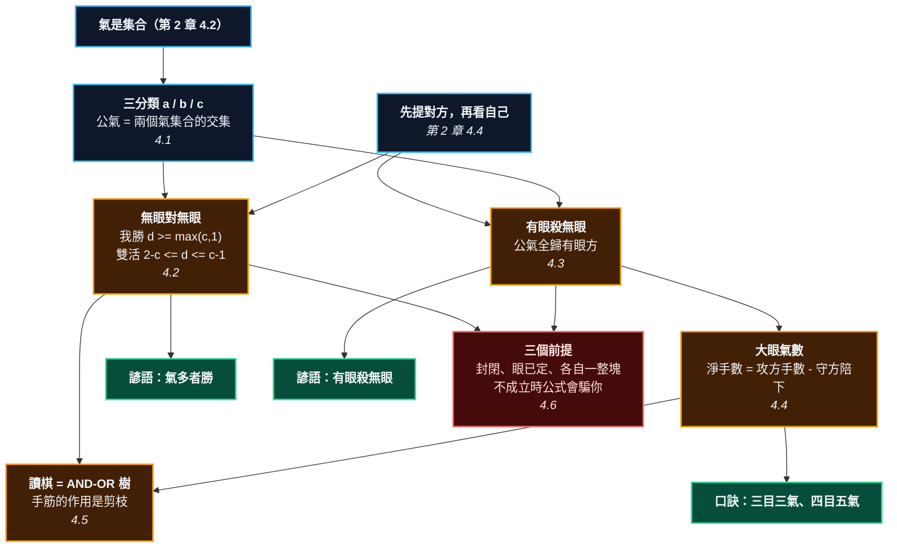

# 第 4 章：對殺與大眼 —— 把口訣表變回公式

---

## 0. 我們在哪裡

**開始之前你需要具備：**

* 第 2 章 §4.2 的氣：$L(S)$ 是一個**集合**。這一章要對兩個這樣的集合取交集。
* 第 2 章 §4.4 的規則順序：**先提對方，再看自己**。本章的每一條結論都靠它。
* 第 3 章 §4.3 的兩眼定理與命題 3.4：一個眼撐不住，是因為填它會提到你。
* 第 3 章 §4.6 的 Benson：無條件活。本章處理的都是**還沒活**的棋。

**讀完本章後你將能夠：**

* 把任何一場對殺的氣分成三類，寫出 $(a, b, c)$。
* 用一條含手番的不等式判斷對殺的勝、負、還是雙活 —— 而且知道雙活的**精確帶寬**。
* 說出「三目三氣、四目五氣、五目八氣、六目十二氣」那串數字是怎麼來的，以及它們**到底在數什麼**。
* 說出這條不等式的三個前提，以及前提不成立時它會怎麼騙你。

---

## 1. 開場思想實驗與掙得的頓悟

### 思想實驗：兩支軍隊，一口井

兩支軍隊在沙漠裡互相包圍。誰先斷水誰輸。

甲軍有五桶水，乙軍有五桶水。看起來是平手 —— 誰先動手誰佔便宜。

但沙漠中央還有一口井，**兩軍都能取水，也都能下毒**。

現在事情變得奇怪了。往井裡下毒，會同時毒到對方和自己 —— 因為你也在喝那口井的水。所以那口井既是資源，也是雙方共同的定時炸彈。誰先去動它，誰就先傷到自己。

於是兩軍就這樣對峙著，誰也不敢碰那口井。**沒有人贏，也沒有人輸。**

再加一個條件：假設甲軍營地裡另外有一口**私人的**井，乙軍碰不到。現在甲軍可以放心地去給公共井下毒了 —— 毒完之後乙軍沒水喝，而甲軍還有自己那口。

**那口私人的井，就是眼。**

### 把謎題寫成一個問題

翻開任何一本圍棋書講對殺的章節，你會看到一串規則：

* 「氣多者勝。」
* 「氣數相同，先手者勝。」
* 「有眼殺無眼。」
* 「大眼氣數：三目三氣、四目五氣、五目八氣、六目十二氣。」
* 「有公氣時可能形成雙活。」

五條規則，各自獨立，沒有一條說明理由。而且最後那條裡的「可能」兩個字，等於什麼都沒說 —— 什麼時候可能？

更麻煩的是那張大眼氣數表。三目三氣：你自己排一個三目的大眼，數一數白要下幾手才吃得掉，會發現答案是 **4**，不是 3。那個 3 是哪來的？

**這一章要回答兩個問題：那條判定式長什麼樣？那張表在數什麼？**

> [!EUREKA]
> **對殺不是比誰的氣多，是比「外氣的差距」和「公氣的數量」誰大。**
>
> 公氣是一口**下了毒的共用井**：填它會讓雙方的氣同時少一口。所以公氣不屬於任何一方 —— 它是一道門檻，誰想贏，外氣就得領先到能跨過這道門檻。令 $\tau = 1$ 表示我先手、$0$ 表示對方先手，令
> $$d \;=\; a - b + \tau$$
> （$a$ 是我的外氣、$b$ 是對方的外氣），則無眼對無眼時：
> $$\textbf{我勝} \iff d \ge \max(c, 1), \qquad \textbf{雙活} \iff 2 - c \le d \le c - 1$$
> **雙活不是一個特例，它是一條隨公氣數線性變寬的帶子。** 公氣越多，帶子越寬，越容易誰都殺不掉誰。
>
> 而「眼」的作用，是把那口井的毒解掉 —— 有眼的一方可以放心填公氣，於是**公氣全部算給有眼的一方**：
> $$\textbf{有眼殺無眼：我勝} \iff b \le a + c + \tau$$
>
> 至於那張大眼氣數表：它數的不是攻方要下幾手，而是**攻方手數減掉守方被迫陪下的手數**。攻方吃掉三目大眼實際要下 4 手，但守方得在眼裡陪下 1 手 —— 淨值 3。那個「三目三氣」的 3，是一個**淨手數**。

```text
                        第 4 章的一句話

    兩塊敵對的棋           L(S1)            L(S2)
                             \               /
                              \   交集 = 公氣 c
                               \     /
              a = 只貼我 ────────┼──────── b = 只貼他
                                 │
                                 ▼
                    d = a - b + tau     （tau = 我先手嗎）
                                 │
        ┌────────────────────────┼────────────────────────┐
        ▼                        ▼                        ▼
    無眼對無眼               有眼殺無眼                大眼氣數
  我勝  d >= max(c,1)     我勝  b <= a+c+tau      攻方實際 g(n) = 1+n(n-1)/2
  雙活  2-c <= d <= c-1   （公氣全歸有眼方）        守方陪下 n-2
  他勝  d <= min(1-c,0)   （永遠不會雙活）          淨值   f(n) = 2+(n-1)(n-2)/2
        │                        │                        │
        ▼                        ▼                        ▼
   「氣多者勝」            「有眼殺無眼」          「三目三氣、四目五氣」
   「有公氣易雙活」                                 「五目八氣、六目十二氣」
```



---

## 2. 多角度直觀：公氣

本章的中心物件是**公氣**（shared liberty／ダメ）—— 兩塊敵對棋串共用的那些氣。

> [!INTUITION]
> **角度一：手感／實戰透鏡**
>
> 對局時你會用手指沿著自己這塊棋數一圈：「一、二、三、四、五。」然後再數對方：「一、二、三、四、五。」平手，你先手，那就開打。
>
> 然後你輸了。
>
> 因為你數的那五口氣裡，有兩口是**你和對方共用的**。你把它們算成自己的，也把它們算成對方的 —— 於是你以為是 5 對 5，其實是 3 對 3 加上一個雙方都不敢碰的地雷區。
>
> 這一章要做的第一件事，就是把你數氣的方式改掉：**數三次，不是兩次。** 只貼我的、只貼他的、兩邊都貼的。

> [!INTUITION]
> **角度二：幾何／形狀透鏡**
>
> 公氣長什麼樣？它是**夾在兩塊棋中間的那條縫**。
>
> 這裡有一個很反直覺的幾何事實：**兩塊棋如果直接貼在一起，一口公氣都沒有。** 公氣需要中間剛好隔一格。想想看為什麼 —— 一個點要同時貼著黑白兩色，它的四個鄰點裡就得同時有黑有白，這表示黑白之間隔著它，而不是直接相鄰。
>
> 所以「對殺」的幾何圖像不是兩堵牆撞在一起，而是兩堵牆隔著一條走廊對峙。走廊有多寬，公氣就有多少。

> [!INTUITION]
> **角度三：代數／計算透鏡**
>
> 三個數就夠了：
> $$a = |L(S_1) \setminus L(S_2)|, \qquad b = |L(S_2) \setminus L(S_1)|, \qquad c = |L(S_1) \cap L(S_2)|$$
>
> 填一口對方的外氣：他 $-1$，我不變。
> 填一口公氣：**雙方同時 $-1$。**
>
> 第二條是全部的關鍵。它說明填公氣是一手「兩敗俱傷」的棋，所以在自己安全之前不能填。整章剩下的內容，就是把這句話推到底。

> [!BOARD REALITY]
> **角度四：棋盤現實檢查**
>
> **失效一：把公氣算兩次。** 這是業餘棋手輸掉整塊大棋最常見的單一原因。你數自己 6 氣、對方 5 氣，覺得穩贏；實際上其中 3 口是公氣，$(a,b,c) = (3,2,3)$，$d = 3-2+1 = 2 < c = 3$ —— 不是你贏，是**雙活**。
>
> **失效二：在雙活裡多下一手。** 雙活成立以後，那些公氣是**單官都不如的禁區**：你填一口，自己的氣就少一口，最後把自己填死。第 13 章會給這件事一個名字（負溫度），但現在你已經可以算出來了。
>
> **失效三：以為「有眼殺無眼」是無條件的。** 它不是。$b \le a + c + \tau$ —— 如果對方的外氣夠多，有眼一樣輸。眼值多少？值 $c + 1$ 左右，不是無限大。

---

## 3. 散落的碎片（問題本身）

**第一片：「氣多者勝」有一個沒說的前提。** 這句話在沒有公氣時是對的。有公氣時它會直接給出錯誤答案，而傳統教材通常補一句「不過有公氣的時候要小心」就結束了。

**第二片：「雙活」被當成特例介紹。** 幾乎所有入門書都把雙活放在附錄或最後一章，當成一種奇特的例外。它不是例外 —— 它是判定式的**中間那一段**，而且那一段的寬度可以精確算出來。

**第三片：一張數字對不上的表。** 「三目三氣。」讀者回家排一個三目大眼，數白要下幾手，數出 4。他會以為自己排錯了。他沒有排錯 —— 是那張表在數別的東西，而沒有人告訴他在數什麼。

**第四片：「有眼殺無眼」聽起來像魔法。** 為什麼一個眼可以把公氣全部搶過來？書上通常畫兩張圖就結束了。

**第五片：「讀棋」被當成天賦。** 「這個要算清楚。」怎麼算？「多練。」讀棋是一個可以描述的過程 —— 它是一棵樹，而且樹的兩種節點行為完全不同。

### 新手典型會錯在哪裡

1. **數氣時把公氣算給自己。** 於是系統性地高估自己。
2. **在對殺裡先填公氣。** 直覺上「填公氣兩邊都少一口，不虧」—— 錯得很嚴重：你先填，你就先到零。**填公氣永遠是最後才做的事。**
3. **看到自己有眼就放心。** 眼值 $c+1$，不是無限。

---

## 4. 對齊（解答）

### 4.1 把氣分成三類

> [!RECALL]
> **氣是集合（第 2 章 §4.2 的定義 2.4）**：$L(S) = N(S) \setminus \mathrm{Occupied}$。
> 這一節要用的是集合最基本的兩個運算：交集與差集。因為氣是集合，
> 「兩塊棋共用的氣」才有意義 —— 如果氣只是一個數字，就沒有「共用」這回事。

> **定義 4.1（三分類）** 設 $S_1$ 與 $S_2$ 是兩塊敵對的棋串。
>
> $$\underbrace{L(S_1) \cap L(S_2)}_{\textbf{公氣}}, \qquad \underbrace{L(S_1) \setminus L(S_2)}_{S_1 \textbf{ 的外氣}}, \qquad \underbrace{L(S_2) \setminus L(S_1)}_{S_2 \textbf{ 的外氣}}$$
>
> 寫成數字：$a = |L(S_1) \setminus L(S_2)|$，$b = |L(S_2) \setminus L(S_1)|$，$c = |L(S_1) \cap L(S_2)|$。

<!-- diagram: ch04_classify -->
```text
     A B C D E F G H J
   9 . . . . . . . . . 9
   8 . . . . . . . . . 8
   7 . . + . . . + . . 7
   6 . . . . . . . . . 6
   5 . . X c O . . . . 5
   4 . a X c O b . . . 4
   3 . . X c O . + . . 3
   2 . . . . . . . . . 2
   1 . . . . . . . . . 1
     A B C D E F G H J
```
*黑白之間隔著一列。標 c 的三點【同時貼著兩邊】—— 那是公氣。標 a 的只貼黑、標 b 的只貼白。注意：兩道牆如果直接貼在一起，反而一口公氣都沒有 —— 公氣需要中間剛好隔一格。*

那個「隔一格」的觀察值得停下來想一想。一個點要成為公氣，它必須同時貼著黑子和白子。以 D4 為例：它的鄰點是 C4（黑）、E4（白）、D3、D5。有黑有白，所以是公氣。

但如果黑白直接相鄰（例如黑 C4、白 D4），那麼任何一個點最多只貼到其中一色 —— 因為黑白之間沒有縫隙讓第三個點插進來。

> **推論 4.2** 兩塊直接相鄰的敵對棋串，公氣為 0。公氣只出現在兩塊棋**隔著恰好一格**對峙的地方。

這解釋了實戰上的一件事：**「緊氣」（把對方的氣填掉）和「製造公氣」是相反的操作。** 你貼上去，公氣消失；你隔一路擋，公氣出現。

### 4.2 無眼對無眼：一條含手番的不等式

先建立一個抽象模型。這一節之後的所有結論，都是在這個模型上算出來的。

> **模型 4.3（對殺的五個數）** 一場對殺由五個量決定：
> $$(a, b, c, \;\text{我有沒有眼}, \;\text{他有沒有眼}) \;+\; \text{輪到誰}$$
>
> 合法的著手只有三種：
> 1. **填對方的外氣**：他的總氣 $-1$，我的不變。
> 2. **填公氣**：**雙方的總氣同時 $-1$。**
> 3. **虛手**（去別處下）。
>
> 而「填公氣」有一個限制：填完之後我自己的氣不能歸零 —— 除非那一手同時提掉了對方（第 2 章規則 2.8）。

> [!RECALL]
> **「先提對方，再看自己」（第 2 章 §4.4）。**
> 模型的第 3 條限制完全來自這裡。填最後一口公氣的時候，如果對方也歸零了，
> 那我是在提子，合法；如果只有我歸零，那是自殺，不合法。
> 這個順序在下面每一個結論裡都會再出現一次。

#### 一口公氣：誰先誰贏

<!-- diagram: ch04_one_dame -->
```text
     A B C D
   4 O O O X 4
   3 O X X X 3
   2 O O p X 2
   1 X X X X 1
     A B C D
```
*p 是全盤唯一的空點，也是雙方唯一的氣（外氣都是 0，公氣 1）。誰先下 p，誰就提掉對方 —— 因為提子發生在自殺判定之前。*

$(a, b, c) = (0, 0, 1)$。黑先下 $p$：先檢查白棋，白的氣歸零 → 提走；提完之後黑那顆子有一大片空間。合法，黑勝。白先同理。

$$d = 0 - 0 + 1 = 1 \;\ge\; \max(c, 1) = 1 \quad\Longrightarrow\quad \text{先手者勝}$$

#### 三口公氣：雙活

<!-- diagram: ch04_seki3 -->
```text
     A B C D
   4 O r X O 4
   3 O q X O 3
   2 O p X O 2
   1 O O O O 1
     A B C D
```
*黑三子被白完全包住，雙方的外氣都是 0，公氣有三口（p、q、r）。【誰先填公氣，誰就先輸】—— 因為對方只要【不跟】，等你把公氣填到剩一口，輪到他提你。所以雙方都不動：雙活。*

$(a, b, c) = (0, 0, 3)$，$d = 1$。判定式說 $\max(c,1) = 3 > 1$，所以不是我勝；而 $2 - c = -1 \le 1 \le 2 = c - 1$，落在雙活帶裡。

用手算一遍：白填 $p$，雙方各剩 2 口；黑填 $q$，各剩 1 口；白現在要填 $r$ 嗎？填了白自己也歸零，而黑也歸零 —— 誰被提？**填的人先提對方**，所以白填 $r$ 會提掉黑。等一下，那白不是贏了嗎？

不對。倒回去看第二步：黑填 $q$ 之後雙方各剩 1 口氣（就是 $r$）。**輪到白**。白填 $r$ → 黑歸零，被提 → 白勝。所以黑不該填 $q$。

黑的正確下法是**不動**。白填 $p$（各剩 2），黑不動，白再填 $q$（各剩 1），此時輪到黑，黑填 $r$ → 提白。所以白也不該填。

雙方都不動 —— 這就是雙活。

<!-- diagram: ch04_seki_min -->
```text
     A B C
   3 X . O 3
   2 X . O 2
   1 X . O 1
     A B C
```
*最小的雙活：3 路盤，黑佔左列、白佔右列，中間三點全是公氣。雙方的外氣都是 0。誰先填公氣，誰就先把自己填死 —— 所以誰都不動。*

#### 定理

> **定理 4.4（無眼對無眼）** 令 $d = a - b + \tau$，其中 $\tau = 1$ 表示我先手、$0$ 表示對方先手。在模型 4.3 下：
>
> $$\boxed{\;\textbf{我勝} \iff d \ge \max(c, 1) \qquad \textbf{雙活} \iff 2 - c \le d \le c - 1 \qquad \textbf{他勝} \iff d \le \min(1 - c, 0)\;}$$

先檢查它退化的情形：

* **$c = 0$（沒有公氣）**：我勝 $\iff d \ge 1 \iff a \ge b + 1 - \tau$。我先手時 $a \ge b$，對方先手時 $a > b$。**這就是「氣多者勝，相同則先手者勝」。** 雙活帶是 $2 \le d \le -1$，空的 —— 沒有公氣就沒有雙活。
* **$c = 1$**：我勝 $\iff d \ge 1$，和 $c=0$ 一樣。雙活帶 $1 \le d \le 0$，還是空的。**一口公氣不足以形成雙活。**
* **$c = 2$**：我勝需要 $d \ge 2$。雙活帶 $0 \le d \le 1$，**寬度 2**。
* **$c = 3$**：我勝需要 $d \ge 3$。雙活帶 $-1 \le d \le 2$，**寬度 4**。

> **推論 4.5（雙活的帶寬）** 雙活帶的寬度是 $2(c-1)$，在 $c \ge 2$ 時非空。
>
> 白話說：**每多一口公氣，雙活的範圍就往兩邊各擴一格。** 公氣越多，越難分出勝負。

這條推論在實戰上的用法很直接：**看到公氣多，第一個念頭應該是「這裡會不會是雙活」，而不是「我氣比較多所以我贏」。**

> [!PROVERB]
> **「氣多者勝，氣同者先下手為強」**
> **它其實在說**：定理 4.4 在 $c \le 1$ 時的特例。$d \ge 1$ 就是「外氣領先，或持平而我先手」。
> **失效條件**：只要 $c \ge 2$，這句話就不再正確 —— 真正的門檻是 $d \ge c$，而不是 $d \ge 1$。外氣多一口卻只換到雙活，是實戰上非常常見的失望。公氣有幾口，你就得多領先幾口外氣。

### 4.3 有眼殺無眼：公氣的歸屬

> [!RECALL]
> **第 3 章命題 3.4：一個眼撐不住，是因為「填它」那一手靠提子救回了合法性。**
> 反過來說：**只要對方提不到我，那個眼點他就永遠填不下去。**
> 這一整節都是這句話的推論 —— 有眼的一方在填光公氣之後還剩一口氣（眼），
> 所以他從頭到尾提不到；而無眼的一方填光公氣就歸零。

<!-- diagram: ch04_eye_wins -->
```text
     A B C D
   4 X p O O 4
   3 X X X O 3
   2 e X q O 2
   1 X X X O 1
     A B C D
```
*黑有一個眼 e，白沒有。雙方的外氣都是 0，公氣是 p 與 q 兩口。黑贏 —— 而且不管誰先手。兩口公氣全部算在有眼的一方頭上。*

$(a, b, c) = (0, 0, 2)$，黑有一個眼，白沒有。用定理 4.4 算（假裝沒有眼）會得到雙活。但實際上黑贏，而且**不管誰先手**。

為什麼？看白的處境。白要吃黑，必須填掉黑的所有氣：$p$、$q$、還有那個眼 $e$。但 $e$ 是眼 —— 白只有在黑的其他氣都沒了的時候才填得下去（第 3 章命題 3.4）。所以白必須先填 $p$ 和 $q$。

而 $p$、$q$ 是**公氣**：白每填一口，白自己的氣也少一口。白填完 $p$、$q$ 之後，白自己剩幾口氣？零。白在填完之前就被提了。

反過來看黑：黑填 $p$、$q$ 之後，黑自己還剩那個眼 $e$，**一口氣**。夠了。

> **這就是眼的全部作用：它讓你在填光公氣之後，還剩一口氣。**

> **定理 4.6（有眼殺無眼）** 我有一個眼、對方沒有眼時：
>
> $$\boxed{\;\textbf{我勝} \iff b \le a + c + \tau\;}$$
>
> 而且**永遠不會是雙活**。

把它讀成「氣的比較」：我方可用的氣是 $a + c$（外氣加公氣，因為公氣我填得起），對方可用的只有 $b$（他的外氣，公氣他填不起）。**公氣全部算給有眼的一方。**

<!-- diagram: ch04_eye_loses -->
```text
     A B C D
   4 X X X X 4
   3 X O O p 3
   2 X X O O 2
   1 X O O e 1
     A B C D
```
*這次換白有眼 e。同樣的道理，唯一那口公氣 p 算給白，白勝。把這張圖和上一張並排看：眼在誰那邊，公氣就在誰那邊。*

> [!PROVERB]
> **「有眼殺無眼」**
> **它其實在說**：有眼的一方可以安全地填公氣（填完還剩眼那一口），無眼的一方不行。所以公氣全部記在有眼的一方帳上，判定式變成 $b \le a + c + \tau$。
> **失效條件一**：**這不是無條件的。** 眼大約值 $c + 1$ 口氣，不是無限。對方外氣夠多（$b > a + c + \tau$），有眼照樣輸。
> **失效條件二**：眼必須是**真的**（第 3 章 §4.5），而且必須是**已經成立的**。如果那個「眼」還要花一手才做得出來，這條判定式不適用 —— §4.6 會把這個前提寫清楚。

#### 雙方都有眼

<!-- diagram: ch04_both_eyes_seki -->
```text
     A B C D
   4 X X X O 4
   3 X X p O 3
   2 e X O O 2
   1 X X O f 1
     A B C D
```
*雙方各有一個眼（e 與 f），還剩一口公氣 p。誰填 p 誰就先把自己填到只剩一個眼，然後被對方提。所以雙活。「雙方有眼也會雙活」—— 而且這是最常見的一種雙活。*

$(a,b,c) = (0,0,1)$，雙方各一個眼。判定式：

> **定理 4.7（雙方有眼）** $\textbf{我勝} \iff d \ge c + 1$，$\textbf{雙活} \iff 1 - c \le d \le c$，$\textbf{他勝} \iff d \le -c$。

$d = 1$，$c = 1$：我勝需要 $d \ge 2$，不成立；雙活帶是 $0 \le d \le 1$，成立 → 雙活 ✓。

<!-- diagram: ch04_both_eyes_race -->
```text
     A B C D
   4 O X X X 4
   3 O O X f 3
   2 O O X X 2
   1 e O X X 1
     A B C D
```
*同樣雙方各一個眼，但這次【沒有公氣】。沒有公氣就沒有「誰先動誰吃虧」，於是回到單純的比快 —— 誰先手誰贏。公氣是雙活的必要條件。*

把兩張圖並排，結論很清楚：

> **推論 4.8** 雙活的必要條件是 $c \ge 1$（雙方有眼時）或 $c \ge 2$（雙方無眼時）。**沒有公氣，就沒有雙活。**

### 4.4 大眼氣數：那張表在數什麼

> [!RECALL]
> **第 3 章 §4.4 的「死形」與「活形」。**
> 直四是活形（一個 vital 區域，加一手就能切成兩個眼）；丁四、方四是死形。
> 這一節只處理**死形**：守方已經做不出兩個眼，剩下的問題純粹是「攻方要花幾手」。
> 眼位若是活形，下面每一個數字都不適用 —— 表上的 $f(4)=5$ 對丁四成立，對直四不成立。

現在處理本章最大的一片碎片。

<!-- diagram: ch04_nakade3 -->
```text
     A B C D E F G
   7 . . . . . . . 7
   6 O O O O O O O 6
   5 O X X X X X O 5
   4 O X p q r X O 4
   3 O X X X X X O 3
   2 O O O O O O O 2
   1 . . . . . . . 1
     A B C D E F G
```
*黑被白完全包圍，只剩 p、q、r 三點的大眼。白要下幾手才提得掉？先猜一個數，§4.4 會給兩個答案 —— 而且兩個都對。*

口訣說「三目三氣」。我們來實際數一遍。

**白第一手下 $q$（正中）。** 白那顆子的氣是 $p$ 和 $r$。
**黑不動**（動了只是自填）。
**白第二手下 $p$。** 白 $\{p, q\}$ 這一串的氣只剩 $r$。
**現在輪到黑。** 黑下 $r$ 會怎樣？$r$ 是白串的最後一口氣 —— 依「先提對方」，白兩子被提走！黑用一手提掉兩子。

提完之後，眼位裡有一顆黑子（在 $r$），$p$、$q$ 兩點空著。黑的眼位縮小成兩點。

**白第三手下 $p$，第四手下 $q$** —— 第四手填掉黑的最後一口氣，提掉黑棋。

$$\textbf{白總共下了 4 手。} \qquad \textbf{黑在眼裡陪下了 1 手。}$$

那張表上的 3，是 $4 - 1$。

> **定義 4.9（大眼氣數 = 淨手數）** 一個 $n$ 點大眼的**氣數**，定義為
> $$f(n) \;=\; (\text{攻方實際下的手數}) \;-\; (\text{守方在眼內被迫下的手數})$$
>
> 為什麼要減？因為在一場對殺裡，守方在自己眼裡下的每一手，都是他**沒有拿去填對方外氣**的一手。那些手在對殺的帳上，是攻方賺到的先手，所以要從成本裡扣掉。

有了正確的定義，那張表就可以算了。下面三個數字全部由完整搜尋算出（`examples/ch04_capture_races/ex02_big_eye.py`）：

| 眼位形狀 | 點數 $n$ | 攻方實際手數 $g(n)$ | 守方陪下 | **淨手數 $f(n)$** | 口訣 |
| :--- | ---: | ---: | ---: | ---: | :--- |
| 直二 | 2 | 2 | 0 | **2** | —— |
| 直三、曲三 | 3 | 4 | 1 | **3** | 三目三氣 |
| 丁四、方四 | 4 | 7 | 2 | **5** | 四目五氣 |
| 花五、刀把五 | 5 | 11 | 3 | **8** | 五目八氣 |
| 花六 | 6 | 16 | 4 | **12** | 六目十二氣 |
| 直四（活形） | 4 | 殺不掉 | —— | —— | 直四活 |

三欄各自有閉合解：

$$\boxed{\;g(n) = 1 + \frac{n(n-1)}{2} \qquad \text{守方陪下} = n - 2 \qquad f(n) = 2 + \frac{(n-1)(n-2)}{2}\;}$$

驗算：$g(3) = 1 + 3 = 4$ ✓，守方 $1$ ✓，$f(3) = 2 + 1 = 3$ ✓。
$g(6) = 1 + 15 = 16$ ✓，守方 $4$ ✓，$f(6) = 2 + 10 = 12$ ✓。

而三者的關係是一條恆等式：

$$g(n) - (n-2) = 1 + \frac{n(n-1)}{2} - n + 2 = 2 + \frac{n^2 - 3n + 2}{2} = 2 + \frac{(n-1)(n-2)}{2} = f(n)$$

> [!PROVERB]
> **「三目三氣、四目五氣、五目八氣、六目十二氣」**
> **它其實在說**：$f(n) = 2 + \frac{(n-1)(n-2)}{2}$，而且這個數是**淨手數**（攻方手數 $1 + \frac{n(n-1)}{2}$ 減掉守方陪下的 $n-2$ 手）。你自己排一個三目大眼數手數會數到 4，那不是你數錯 —— 是那張表在數淨值。
> **失效條件一**：$n \ge 7$ 就不適用。七點以上的眼位空間大到守方可以在裡面自己做出兩個眼（第 3 章 §4.4），那就不是大眼，是活棋。
> **失效條件二**：必須是**死形**。同樣四點，丁四、方四是死形（$f=5$），直四是活形（殺不掉）。形狀比點數重要 —— 判準是第 3 章 §4.4 的 vital。

<!-- diagram: ch04_nakade5 -->
```text
     A B C D E F G
   7 . . . . . . . 7
   6 . O O O O O . 6
   5 O O X X X O O 5
   4 O X X s X X O 4
   3 O X p r t X O 3
   2 O X X q X X O 2
   1 O O X X X O O 1
     A B C D E F G
```
*五點的大眼（花五）。口訣說「五目八氣」。八是哪來的？白實際上要下的手數並不是 8。*

花五有一個值得注意的細節：中心那一點 $r$ **不貼著任何黑子**（它的四個鄰點全是眼位裡的其他點）。所以 $r$ 不是黑棋的氣。

> [!RECALL]
> **這正是第 3 章 §4.4 的 vital 條件。**
> 區域 $R$ 對棋串 $S$ 而言 vital，意思是 $R$ 裡的每一個空點都是 $S$ 的氣。花五的中心不是氣 → 這個區域不 vital → 黑做不出兩個眼 → 死形。
> 而那個不貼牆的中心點，正是攻方的**要點**：白第一手下在那裡，效率最高。

### 4.5 讀棋就是 AND-OR 樹搜尋

前面四節都在算「結果是什麼」。這一節談「怎麼算」。

「讀棋」在數學上是一棵樹的深度優先搜尋，而這棵樹有兩種節點：

> **定義 4.10（AND-OR 樹）**
> * **OR 節點**（輪到我）：只要**有一個**子節點成功，這個節點就成功。
> * **AND 節點**（輪到對手）：**每一個**子節點都要成功，這個節點才成功。

這個不對稱，就是讀棋累人的全部原因。在 OR 節點你可以挑最好的一手 —— 找到一個就收工。在 AND 節點你必須把對手**所有**的回應都算一遍 —— 漏掉一個，整個結論作廢。

工作量大約是

$$\text{節點數} \;\approx\; B^{\,D}$$

其中 $B$ 是**分枝因子**（每一步有幾種選擇），$D$ 是**深度**。$B = 5$、$D = 6$ 就已經是一萬五千個節點 —— 遠超過人的工作記憶。

（這裡刻意用大寫。本章的 $b$ 與 $d$ 已經分別是「對方的外氣」和 $a-b+\tau$，再借去當分枝因子與深度只會製造混亂。）

> **這就是「讀不清楚」的精確意思**：不是你笨，是 $B^D$ 超過了你腦子能裝的量。

那高手是怎麼辦到的？兩個辦法，都是在壓 $B$ 和 $D$：

1. **手筋壓 $B$。** 「這裡只有三種下法值得看」—— 一個熟悉的形狀，會把 20 個候選點砍到 3 個。手筋的作用不是「厲害的一手」，是**剪枝**。
2. **定式與死活知識壓 $D$。** 「走到這裡就是直四，活的，不用再往下算了」—— 一個已知的結論，把剩下的整棵子樹砍掉。第 3 章的 Benson 就是這種砍法的極致：它讓你在 $O(1)$ 的判斷裡結束一整棵樹。

> [!BOARD REALITY]
> **AND 節點是所有讀棋失誤的來源。**
> 人算棋時有一個系統性的偏誤：在 OR 節點（自己走）算得很仔細，在 AND 節點（對手走）只算「他大概會怎麼回」。
> 但 AND 節點要求的是**全部**。你漏掉的那一手，就是對手實戰中會下的那一手。
> 一個可以立刻用的習慣：**每次輪到對手的那一層，強迫自己說出至少兩個候選點**，就算第二個看起來很蠢。這一個習慣，比多做一百道死活題有用。

### 4.6 三個前提

> [!RECALL]
> **模型 4.3 只允許三種著手**：填對方外氣（他 $-1$）、填公氣（雙方各 $-1$）、虛手。
> 這一節要問的是：**什麼樣的真實盤面，才真的只有這三種著手、而且效果剛好如此？**
> 答案是三個前提。它們不是為了嚴謹而加的裝飾 —— 少了任何一條，上面那些「$-1$」就會變成別的數。

定理 4.4、4.6、4.7 不是對任何盤面都成立的。它們有三個前提，而這三個前提**不是我事先假設的 —— 它們是被反例逼出來的**。

寫這一章時，我先寫下判定式，然後拿真實盤面去對。前兩輪對不上，每一次對不上都指出一個我沒寫出來的假設。三輪之後，才得到下面這三條。

> **前提一（嚴格封閉：三個互不相通的口袋）**
> 公氣的鄰點只能是這兩塊棋、或別的公氣；我方外氣的鄰點只能是我方的棋、或我方別的外氣（對方同理）。
>
> *為什麼需要*：模型假設「填一口公氣＝雙方各少一口」。如果公氣旁邊還通往別的空點，填它反而可能**增加**填的人的氣，模型就垮了。

> **前提二（眼的狀態已經定下來）**
> 外氣口袋裡不能有兩點相鄰。
>
> *為什麼需要*：兩點相鄰的空地還能做出一個眼。模型的「有沒有眼」是一個已經固定的旗標，不處理「還能做出來」的情形。

> **前提三（各自是一整塊，各自最多一個眼）**
> $S_1$、$S_2$ 各自是單一連通分量。兩個眼就是活棋（第 3 章），不是對殺。

> [!IMPORTANT]
> **前提不成立時，判定式會給出錯誤答案 —— 而且不會警告你。**
> §6 的練習 4.2 就是一個具體例子：一個看起來很像雙活的盤面，判定式說雙活，實際上白先能殺。差別就在前提一。
> `go_core.capture_race.race_preconditions` 會幫你檢查這三條。實戰上你當然不會跑程式，但你可以養成一個習慣：**套判定式之前，先看一眼那些氣是不是真的被關在三個獨立的口袋裡。**

---

## 5. 應用：手算追蹤與非黑盒程式

### 5.1 用手算一遍

<!-- diagram: ch04_seki3 -->
```text
     A B C D
   4 O r X O 4
   3 O q X O 3
   2 O p X O 2
   1 O O O O 1
     A B C D
```
*黑三子被白完全包住，雙方的外氣都是 0，公氣有三口（p、q、r）。【誰先填公氣，誰就先輸】—— 因為對方只要【不跟】，等你把公氣填到剩一口，輪到他提你。所以雙方都不動：雙活。*

**第一步：找出兩塊棋。**

黑：$\{$C2, C3, C4$\}$。白：$\{$A1, A2, A3, A4, B1, C1, D1, D2, D3, D4$\}$（沿著邊連成一整圈）。

**第二步：算兩個氣集合。**

黑的氣：C2 的鄰點 B2（空）、C1（白）、C3（自己人）、D2（白）→ B2。C3 → B3。C4 → B4（C4 上方是盤外）。
$$L(\text{黑}) = \{\text{B2}, \text{B3}, \text{B4}\}$$

白的氣：B1 的鄰點 A1（自己人）、C1（自己人）、B2（空）→ B2。A2 → B2。A3 → B3。A4 → B4。D2 → 沒有（C2 是黑、D1 D3 自己人）。
$$L(\text{白}) = \{\text{B2}, \text{B3}, \text{B4}\}$$

**第三步：三分類。**

$$L(\text{黑}) \cap L(\text{白}) = \{\text{B2}, \text{B3}, \text{B4}\} \quad\Longrightarrow\quad c = 3$$
$$a = |L(\text{黑}) \setminus L(\text{白})| = 0, \qquad b = 0$$

**兩塊棋一口外氣都沒有，三口氣全是公氣。**

**第四步：查前提。**
* B2 的鄰點：A2（白）、C2（黑）、B1（白）、B3（公氣）✓
* B3 的鄰點：A3（白）、C3（黑）、B2、B4（公氣）✓
* B4 的鄰點：A4（白）、C4（黑）、B3（公氣）✓
* 外氣口袋是空的，前提二自動成立。兩塊棋各自連通 ✓

三個前提都成立，可以套判定式。

**第五步：套定理 4.4。**

$$d = a - b + \tau = 0 - 0 + 1 = 1$$
$$\text{我勝需要 } d \ge \max(3, 1) = 3 \quad \text{✗}$$
$$\text{雙活需要 } 2 - 3 = -1 \;\le\; 1 \;\le\; 3 - 1 = 2 \quad \text{✓}$$

**雙活。** 而且 $\tau = 0$（白先）時 $d = 0$，一樣落在 $[-1, 2]$ 裡 —— 雙方誰先手都一樣。

**第六步：讀出這個盤面在說什麼。**

黑三子沒有兩個眼，按第 3 章的標準它「不活」；白也一樣。但它們**都不會死**。這是本書第一次遇到「不活也不死」的第三種狀態，而它的來源很具體：**公氣是一種雙方都不敢碰的資源。**

第 13 章會給這件事一個更好的名字：雙活是溫度為負的局部（第 13 章 §4.4）。現在你已經可以用氣算出它了。

### 5.2 用程式驗一遍

```python
"""第 4 章 §5：三分類 -> 檢查前提 -> 套判定式 -> 用搜尋核對。"""
from go_core import BLACK, WHITE, Board, format_coord
from go_core.capture_race import (classify_liberties, race_preconditions,
                                  race_formula, race_winner)
from go_core.strings import all_strings

b = Board(4)
b.place_many(BLACK, ["C2", "C3", "C4"])
b.place_many(WHITE, ["A1", "A2", "A3", "A4", "B1", "C1", "D1", "D2", "D3", "D4"])
print(b)

B = all_strings(b, BLACK)[0]
W = all_strings(b, WHITE)[0]
d = classify_liberties(b, B, W)
show = lambda s: sorted(format_coord(p, b.n) for p in s)
print(f"\n黑的氣 {show(d['own'] | d['shared'])}")
print(f"白的氣 {show(d['opp'] | d['shared'])}")
print(f"a = {d['a']}  b = {d['b']}  c = {d['c']}   公氣 {show(d['shared'])}")
assert (d["a"], d["b"], d["c"]) == (0, 0, 3)

ok, why = race_preconditions(b, B, W)
print(f"\n三個前提都成立嗎？{ok}   {why}")
assert ok

for turn, who in [(True, "黑先"), (False, "白先")]:
    f = race_formula(d["a"], d["b"], d["c"], False, False, turn)
    s = race_winner(d["a"], d["b"], d["c"], False, False, turn)
    print(f"  {who}: 判定式 = {f}   完整搜尋 = {s}")
    assert f == s == "雙活"
print("\n判定式與搜尋一致：雙活。")
```

**輸出裡該看什麼。** 看 `a = 0  b = 0  c = 3` 那一行。兩塊棋的氣**完全重疊** —— 這是雙活最純粹的形式。再看最後兩行：判定式（一個算術）和完整搜尋（一棵樹）給出同一個答案。判定式之所以可以信，就是因為它被這樣逐格比對過 6,322 次。

> **配套範例腳本**：`examples/ch04_capture_races/ex01_race_formula.py`

### 5.3 大眼氣數，用搜尋算出來

```python
"""第 4 章 §4.4：那張口訣表，用完整搜尋重新算一遍。"""
from go_core import BLACK, WHITE, Board, neighbors
from go_core.capture_race import big_eye_liberties, attacker_moves, defender_moves
from go_core.search import moves_to_capture, net_moves_to_capture

N = 7

def nakade(shape, origin=(3, 2)):
    """幫一個眼位空間砌黑牆，外面再包白 —— 做出「只剩一個大眼」的死棋。"""
    r0, c0 = origin
    R = {(r0 + dr, c0 + dc) for dr, dc in shape}
    ring = lambda S: {(r + dr, c + dc) for (r, c) in S
                      for dr in (-1, 0, 1) for dc in (-1, 0, 1)
                      if 0 <= r + dr < N and 0 <= c + dc < N} - S
    wall = ring(R)
    board = Board(N)
    for p in wall:
        board.grid[p] = BLACK
    for p in ring(R | wall):
        board.grid[p] = WHITE
    return board, frozenset(R), next(iter(wall))

SHAPES = [("直二", [(0, 0), (0, 1)]),
          ("直三", [(0, 0), (0, 1), (0, 2)]),
          ("丁四", [(0, 0), (0, 1), (0, 2), (1, 1)]),
          ("花五", [(0, 1), (1, 0), (1, 1), (1, 2), (2, 1)])]

print(f"{'形狀':<6}{'n':>3}{'攻方手數':>9}{'守方陪下':>9}{'淨手數':>8}{'公式 f(n)':>10}")
for label, shape in SHAPES:
    board, region, target = nakade(shape)
    n = len(shape)
    g = moves_to_capture(board, target, WHITE, candidates=region, max_depth=5 * n + 8)
    f = net_moves_to_capture(board, target, WHITE, region, max_depth=5 * n + 8)
    print(f"{label:<6}{n:>3}{g:>9}{g - f:>9}{f:>8}{big_eye_liberties(n):>10}")
    assert f == big_eye_liberties(n)          # 淨手數 = 口訣表
    assert g == attacker_moves(n)             # 攻方實際手數 = 1 + n(n-1)/2
    assert g - f == defender_moves(n)         # 守方陪下 = n - 2

print("\n三欄的閉合解全部對上：g(n) = 1 + n(n-1)/2，守方 = n-2，f(n) = 2 + (n-1)(n-2)/2。")
```

**輸出裡該看什麼。** 「攻方手數」和「淨手數」是**兩個不同的數**，而口訣表給的是後者。三目大眼白實際要下 4 手，表上寫 3。這一欄之差，是幾十年來讀者自己排棋數手數時的困惑來源。

> **配套範例腳本**：`examples/ch04_capture_races/ex02_big_eye.py`

---

## 6. 練習與完整解答

### 基礎練習

#### 練習 4.1

<!-- diagram: ch04_ex1 -->
```text
     A B C D E F G H J
   9 . . . . . . . . . 9
   8 . . . . . . . . . 8
   7 . . + . . . + . . 7
   6 . . . . . . . . . 6
   5 . . . . + X . O . 5
   4 . . . . . X . O . 4
   3 . . + . . X + O . 3
   2 . . . . . . . . . 2
   1 . . . . . . . . . 1
     A B C D E F G H J
```
*練習 4.1：寫出這個盤面的 (a, b, c)。注意哪些點是公氣、哪些不是 —— 不要把「靠得近」當成「公用」。*

<details>
<summary><b>解答</b></summary>

黑 $\{$F3, F4, F5$\}$ 的氣：E3, E4, E5（左邊）、F2（下）、F6（上）、G3, G4, G5（右邊）。共 8 口。

白 $\{$H3, H4, H5$\}$ 的氣：G3, G4, G5（左邊）、H2、H6、J3, J4, J5。共 8 口。

**交集**：$\{$G3, G4, G5$\}$ —— G 列的三點同時貼著黑（F 列）與白（H 列）。

$$c = 3, \qquad a = 8 - 3 = 5, \qquad b = 8 - 3 = 5$$

**判定式**：$d = 5 - 5 + \tau = \tau$。

* 黑先（$\tau = 1$）：我勝需要 $d \ge 3$，$1 < 3$ ✗。雙活帶 $-1 \le 1 \le 2$ ✓ → **雙活**。
* 白先同理 → **雙活**。

**這一題的重點**：兩塊棋的氣「各有 8 口」，看起來勢均力敵，先手就能贏。錯。真正的數是 $(5, 5, 3)$，三口公氣把它變成雙活。**多數一次交集，結論就完全不同。**

（注意：這個盤面在空曠處，並不符合 §4.6 的前提一 —— 外氣通往一大片空地。這裡只練習分類與套公式；真正下結論要先查前提。）

```python
from go_core import BLACK, WHITE, Board, format_coord
from go_core.capture_race import classify_liberties, race_formula
from go_core.strings import all_strings

b = Board(9)
b.place_many(BLACK, ["F3", "F4", "F5"]).place_many(WHITE, ["H3", "H4", "H5"])
B, W = all_strings(b, BLACK)[0], all_strings(b, WHITE)[0]
d = classify_liberties(b, B, W)
print("公氣：", sorted(format_coord(p, 9) for p in d["shared"]))
print(f"(a, b, c) = ({d['a']}, {d['b']}, {d['c']})")
print("黑先：", race_formula(d["a"], d["b"], d["c"], False, False, True))
assert (d["a"], d["b"], d["c"]) == (5, 5, 3)
assert race_formula(5, 5, 3, False, False, True) == "雙活"
```
</details>

#### 練習 4.2

<!-- diagram: ch04_ex2 -->
```text
     A B C
   3 X . p 3
   2 X . O 2
   1 X . O 1
     A B C
```
*練習 4.2：把最小雙活改一下 —— 白少一子，多出 p 這個點。先分類 (a, b, c) 並套判定式，然後【檢查三個前提】。最後用搜尋核對。三個答案會不會一致？*

<details>
<summary><b>解答</b></summary>

**分類。** 黑 $\{$A1, A2, A3$\}$ 的氣：B1, B2, B3。白 $\{$C1, C2$\}$ 的氣：B1, B2, C3。

交集 $= \{$B1, B2$\}$ → $c = 2$。黑的外氣 $= \{$B3$\}$ → $a = 1$。白的外氣 $= \{$C3$\}$（也就是圖上標 $p$ 的那一點）→ $b = 1$。

**套判定式。** $d = 1 - 1 + \tau = \tau$。
* 黑先：我勝需 $d \ge 2$ ✗；雙活帶 $0 \le 1 \le 1$ ✓ → 判定式說**雙活**。
* 白先：$d = 0$，雙活帶 $0 \le 0 \le 1$ ✓ → 判定式說**雙活**。

**檢查前提。** 前提一不成立：
* 公氣 B2 的鄰點是 A2（黑）、C2（白）、B1（公氣）、**B3**（黑的外氣）—— B3 不是公氣，所以 B2 這個口袋通往別處 ✗
* 黑的外氣 B3 的鄰點是 A3（黑）、B2（公氣）、**C3**（白的外氣）✗

**用搜尋核對。** 黑先：白提不掉，黑也提不掉 → 相當於雙活 ✓。
**白先：白能提掉黑。** 判定式錯了。

**為什麼錯？** 白先下 B3。這一手同時做了兩件事：填掉黑的外氣，而且讓白的 C3 那一點連上了 B3。模型假設「填對方外氣不影響自己」，但這裡白下 B3 之後，B3 這顆白子和 C3 是相鄰的 —— 白多了一口氣。三個口袋是通的，模型的假設破了。

**這一題的教訓**：判定式是一個定理，而定理有前提。前提不成立時它不會警告你，它只會給你一個錯的答案。**先查前提，再套公式。**

```python
from go_core import BLACK, WHITE, Board
from go_core.capture_race import classify_liberties, race_formula, race_preconditions
from go_core.strings import all_strings
from go_core.search import can_capture

b = Board(3)
b.place_many(BLACK, ["A1", "A2", "A3"]).place_many(WHITE, ["C1", "C2"])
B, W = all_strings(b, BLACK)[0], all_strings(b, WHITE)[0]
d = classify_liberties(b, B, W)
print(f"(a, b, c) = ({d['a']}, {d['b']}, {d['c']})")
ok, why = race_preconditions(b, B, W)
print("前提成立嗎？", ok)
for r in why:
    print("   ", r)
print("判定式（白先）：", race_formula(d["a"], d["b"], d["c"], False, False, False))
cands = frozenset(d["own"] | d["opp"] | d["shared"])
cap, mv = can_capture(b, next(iter(B)), WHITE, candidates=cands, max_depth=14)
print("盤面搜尋（白先）：", "白提得掉黑" if cap else "提不掉")
assert not ok                      # 前提不成立
assert race_formula(d["a"], d["b"], d["c"], False, False, False) == "雙活"
assert cap                         # 而真相是白能殺
print("\n判定式說雙活，搜尋說白勝 —— 前提不成立時，公式會騙你。")
```
</details>

### 實戰練習

#### 練習 4.3

<!-- diagram: ch04_ex3 -->
```text
     A B C D E F G
   7 . . . . . . . 7
   6 O O O O O O O 6
   5 O X X X X X O 5
   4 O X . p . X O 4
   3 O X X X X X O 3
   2 O O O O O O O 2
   1 . . . . . . . 1
     A B C D E F G
```
*練習 4.3：同樣的三目大眼。白第一手應該下 p（正中），還是下旁邊？兩種都算一遍，比較白總共要花幾手。*

<details>
<summary><b>解答</b></summary>

眼位是 C4、D4（$=p$）、E4 三點。

**白先下 $p$（正中，D4）。** 白一子的氣是 C4 與 E4，兩口。黑不動。白下 C4 → 白兩子只剩 E4 一口氣 → 黑下 E4 提掉白兩子。眼位變成只有黑一子在 E4、C4 與 D4 空著（兩點）。白再下 C4、D4 兩手 → 提掉黑。

$$\text{白：} \; 2 + 2 = 4 \text{ 手}, \qquad \text{黑陪下：} \; 1 \text{ 手}$$

**白先下 C4（旁邊）。** 白一子的氣只有 D4，一口 —— 立刻被叫吃。黑下 D4 → 提掉白一子。現在黑在 D4 有一子，眼位剩 C4、E4 兩個**互不相連**的點 —— 那是**兩個真眼**，黑活了！

所以下旁邊不是「慢一點」，是**直接失敗**。

**結論：要點是正中那一點。** 而「正中」在這裡有精確的意思：

> 三目大眼的正中，是唯一一個**下下去不會把眼位切成兩塊**的點。下在旁邊會把 $\{$C4, D4, E4$\}$ 切成 $\{$D4, E4$\}$ 與空的一邊，讓黑得到分割的機會。

這和第 3 章練習 3.4 是同一件事的兩面：防守方想**切開**眼位做出兩個眼，進攻方想**佔住那個切點**讓它切不開。「敵之要點即我之要點」，說的就是這個共用的切點。

```python
from go_core import BLACK, WHITE, Board, neighbors, format_coord
from go_core.search import moves_to_capture

N = 7
def nakade3():
    R = {(3, 2), (3, 3), (3, 4)}
    ring = lambda S: {(r + dr, c + dc) for (r, c) in S
                      for dr in (-1, 0, 1) for dc in (-1, 0, 1)
                      if 0 <= r + dr < N and 0 <= c + dc < N} - S
    wall = ring(R)
    b = Board(N)
    for p in wall:
        b.grid[p] = BLACK
    for p in ring(R | wall):
        b.grid[p] = WHITE
    return b, frozenset(R), next(iter(wall))

def total_after(first):
    """白第一手下 first，之後雙方輪流。回傳白總共要下幾手；殺不掉則 None。"""
    b, R, tgt = nakade3()
    b.play(WHITE, first)
    # _to_move=BLACK 很重要：白剛下完，接下來輪到黑。
    # 忘記交出手番，等於讓白連下兩手 —— 那會算出完全錯誤的答案。
    rest = moves_to_capture(b, tgt, WHITE, candidates=R, max_depth=18,
                            _to_move=BLACK)
    return None if rest is None else rest + 1

for first in ["D4", "C4", "E4"]:
    total = total_after(first)
    tail = "" if total else "   (殺不掉，黑做出兩個眼活了)"
    print(f"白第一手 {first}: 白總手數 = {total}{tail}")

assert total_after("D4") == 4          # 正中：4 手殺
assert total_after("C4") is None       # 旁邊：殺不掉
assert total_after("E4") is None
print()
print("下正中：4 手殺。下旁邊：殺不掉 —— 不是慢一步，是直接失敗。")
```
</details>

#### 練習 4.4

回到 §2 角度四提到的那個實戰場景：你數自己 6 氣、對方 5 氣，其中 3 口是公氣。輪到你下。

問：這是勝、負、還是雙活？如果你想贏，至少要先在外面補幾手？

<details>
<summary><b>解答</b></summary>

「自己 6 氣、對方 5 氣，其中 3 口公氣」翻譯成三分類：

$$a = 6 - 3 = 3, \qquad b = 5 - 3 = 2, \qquad c = 3$$

$$d = a - b + \tau = 3 - 2 + 1 = 2$$

我勝需要 $d \ge \max(c, 1) = 3$ ✗。雙活帶 $2 - 3 = -1 \le 2 \le 3 - 1 = 2$ ✓。

**雙活。** 你以為的「我多一口氣，先手，穩贏」，實際上是和棋。

**要贏得補幾手？** 每在外面補一手，$a$ 加一、$d$ 加一。需要 $d \ge 3$，現在 $d = 2$，所以**補一手**就夠了 —— 但那一手必須下在能增加外氣的地方，而且**不能是公氣**（填公氣是 $c$ 減一、$d$ 不變……等等，$c$ 減一會讓門檻 $\max(c,1)$ 也減一）。

這裡有一個有趣的分岔：填一口公氣，$c: 3 \to 2$，門檻從 3 降到 2，而 $d$ 呢？填公氣不改變 $a$ 與 $b$，但輪到對方了，$\tau: 1 \to 0$，所以 $d = 3 - 2 + 0 = 1 < 2$。**還是不行。**

所以正解是：**在外面補一口外氣**（$a: 3 \to 4$，$\tau$ 變 0，$d = 4 - 2 + 0 = 2$）—— 咦，也不行？

問題在於補一手就要交出先手。真正的算法是：補 $k$ 手之後，對方也下了 $k$ 手（假設對方也在補自己的外氣，$b$ 也加 $k$），$d$ 不變。所以**單純互補外氣不會改變結果**。

**要打破雙活，你必須做的是「補外氣而對方不能跟」** —— 也就是找一手**先手**（對方必須回應在別處的棋）。這正是第 7 章「先手」要處理的東西，也是為什麼對殺的勝負常常不在對殺本身，而在旁邊。

**這一題的答案是**：雙活；而且你補外氣沒有用，除非你能找到一手對方不得不應的先手。

```python
from go_core.capture_race import race_formula
print("(a,b,c) = (3,2,3), 我先手：", race_formula(3, 2, 3, False, False, True))
assert race_formula(3, 2, 3, False, False, True) == "雙活"
# 雙方各補一手外氣：a 與 b 同時加一，結果不變
print("雙方各補一手後：", race_formula(4, 3, 3, False, False, True))
assert race_formula(4, 3, 3, False, False, True) == "雙活"
# 唯有「我補兩手、他補一手」（也就是我多搶到一手先手）才翻得過來
print("我多搶到一手先手：", race_formula(5, 3, 3, False, False, True))
assert race_formula(5, 3, 3, False, False, True) == "我勝"
print("\n打破雙活靠的不是補氣，是先手。")
```
</details>

---

## 7. 本章頓悟總結

* **公氣是一口下了毒的共用井。** 填它，雙方的氣同時少一口。所以填公氣永遠是最後才做的事，而它是整章所有結論的來源。
* **對殺要數三次，不是兩次**：只貼我的（$a$）、只貼他的（$b$）、兩邊都貼的（$c$）。把公氣算給自己，是輸掉大棋最常見的單一原因。
* **判定式**：令 $d = a - b + \tau$，無眼對無眼時 $\textbf{我勝} \iff d \ge \max(c,1)$，$\textbf{雙活} \iff 2-c \le d \le c-1$。**「氣多者勝」只是 $c \le 1$ 的特例。**
* **雙活不是特例，是一條帶子**，寬度 $2(c-1)$。公氣越多，越難分勝負。沒有公氣，就沒有雙活。
* **眼的作用是解毒**：有眼的一方可以安全地填公氣，於是公氣全部算給他 —— $\textbf{我勝} \iff b \le a + c + \tau$。但眼只值 $c+1$ 左右，不是無限。
* **大眼氣數表在數淨手數**：$f(n) = g(n) - (n-2)$，其中攻方實際手數 $g(n) = 1 + \frac{n(n-1)}{2}$、守方被迫陪下 $n-2$ 手。三目大眼白實際要下 4 手，表上寫 3 —— 兩個都對，只是在數不同的東西。
* **讀棋是 AND-OR 樹**，工作量 $B^D$（分枝因子的深度次方）。手筋壓 $B$，已知結論壓 $D$。「讀不清楚」是容量問題，不是聰明問題。
* **判定式有三個前提**（封閉、眼已定、各自一整塊），而它們是被反例逼出來的。前提不成立時，公式會安靜地給你錯的答案。

**接下來。** 本章與第 3 章處理的都是「這塊棋活不活」。第 5 章要處理一件完全不同的事：**劫**。到目前為止，我們一直假設一盤棋會結束 —— 而劫是唯一一個讓這個假設失效的東西。它是遊戲狀態圖裡唯一的環，而處理它的規則，會把「別處的一手棋」變成一種可以在此地兌換的貨幣。那也是本書唯一一次必須放棄「局部可以相加」這條性質的地方。
