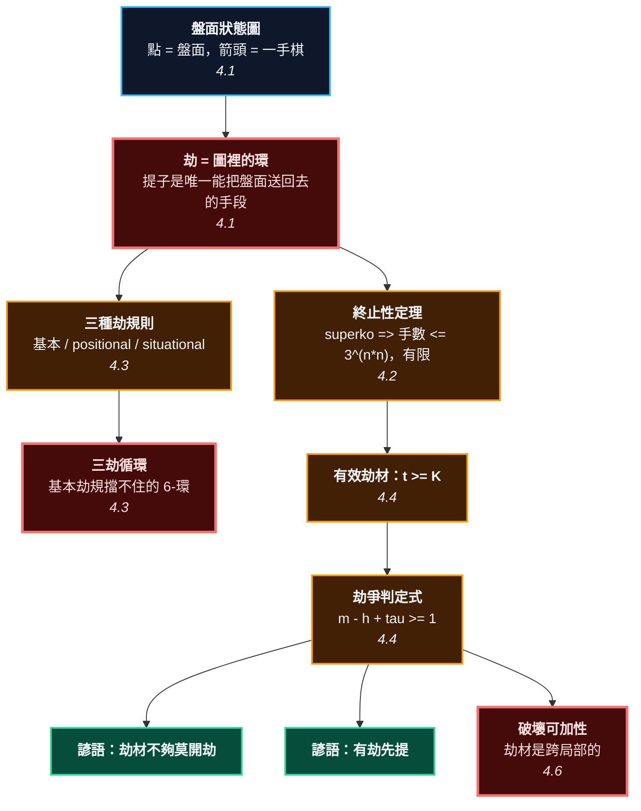

# 第 5 章：劫 —— 圖裡唯一的環，與一種貨幣

---

## 0. 我們在哪裡

**開始之前你需要具備：**

* 第 2 章 §4.4 的提子與禁著點，特別是那個順序：**先提對方，再看自己**。
* 第 3 章的「活」與第 4 章的對殺 —— 這一章會用到「一塊棋值多少」這個直覺，但不需要細節。
* 第 4 章 §4.2 的判定式 $d = a - b + \tau$。這一章會出現一條**形狀完全一樣**的式子，而那不是巧合。
* 數學方面：什麼是圖、什麼是環（一條走回起點的路）。第 2 章 §4.1 已經給過圖的定義。

**讀完本章後你將能夠：**

* 說出劫的規則為什麼**必須**存在 —— 而且是一個關於「這個遊戲有沒有定義」的理由，不是美學。
* 分辨三種劫規則，並說出哪一種擋得住三劫循環、哪一種擋不住。
* 用一條含手番的不等式判斷劫爭的勝負，並算出一手棋**夠不夠格**當劫材。
* 說出為什麼劫是本書唯一一處必須放棄「局部可以相加」的地方。

---

## 1. 開場思想實驗與掙得的頓悟

### 思想實驗：兩個小孩，一個玩具

兩個小孩搶同一個玩具。

甲搶過來。乙立刻搶回去。甲再搶回來。乙再搶回去。

這件事**永遠不會結束**。不是因為他們固執，是因為這個過程沒有終點：每一次搶奪都把世界還原成兩步之前的樣子，於是同樣的動作可以無限重複。

大人的處理方式很簡單：「不准馬上搶回來。你要先去做別的事，等一下才能再來。」

這條規則看起來很隨便 —— 為什麼是「等一下」？為什麼不是「等三分鐘」？

但它做到了一件關鍵的事：**它讓這件事有機會結束。** 因為乙被迫先去做別的事，而別的事總會做完；等他做完回來，情況可能已經不同了。

還有一個副作用，而這個副作用比規則本身更有趣：**「別的事」忽然變得很重要。** 乙為了搶回玩具，必須先找一件甲不得不理會的事去做。那件事的大小，決定了他能不能把玩具搶回來。

一件本來和玩具無關的事，變成了搶玩具的籌碼。

### 把謎題寫成一個問題

圍棋的規則短得驚人：輪流下、沒氣的提走、不能自殺、圍多的贏。四條，一個小孩十分鐘學得會。

然後有第五條，而且它長得完全不像前四條：

> 「不能下出一個和之前完全相同的盤面。」

前四條都在講**這一手棋本身**，第五條卻在講**歷史**。它需要記憶。它讓「這一手合不合法」取決於三十手之前發生過什麼。這在一個號稱最簡潔的遊戲裡，看起來像一個難看的補丁。

**這一章要回答的問題是：這條規則為什麼非有不可？**

答案不在美學，在**終止性**。

如果沒有這條規則，那兩個小孩會一直搶下去 —— 而且不只是「他們很煩」，是**這盤棋沒有結果**。沒有結果，就沒有勝負；沒有勝負，「最佳下法」這四個字就沒有意義。第 10 章要用 Zermelo 定理保證圍棋有唯一的正確答案，而那個定理的第一個前提就是「有限」。

**劫規則不是補丁，是這個遊戲能被定義的必要條件。**

> [!EUREKA]
> **劫是盤面狀態圖裡唯一的環。**
>
> 把每一個盤面當成一個點、每一手棋當成一條箭頭，整盤棋就是在一張巨大的有向圖上走路。這張圖幾乎處處是單向往下的（每下一手，棋子只會變多）—— 唯一例外是提子，而唯一會把盤面**原封不動送回去**的提子，就是劫。
>
> 沒有規則擋住這個環，就存在無限長的路徑，這盤棋就沒有結果。所以劫規則的功能只有一個：**把環剪斷。**
>
> 而剪斷的代價是：它把「別處的一手棋」變成了一種可以在此地兌換的貨幣。**劫材不是心理戰，是一場交替消耗資源的競賽** —— 而它的判定式和第 4 章的對殺長得一模一樣：
> $$m - h + \tau \;\ge\; 1$$
> （$m$、$h$ 是雙方**有效**劫材的數量，$\tau = 1$ 表示劫現在在我手上。）
>
> 至於一個劫材「有效」的條件，也只有一行：它的價值必須 $\ge$ 劫本身的價值 $K$。**值 8 目的劫材，在一個值 10 目的劫面前，根本不是劫材。**

```text
                        第 5 章的一句話

    盤面狀態圖：每個盤面一個點，每一手棋一條箭頭
                          │
                          │  幾乎處處單向往下（棋子只會變多）
                          │  唯一的例外：提子
                          ▼
                    ┌───────────┐
                    │   劫 = 環  │  黑提 -> 白提回 -> 盤面完全復原
                    └─────┬─────┘
                          │
        ┌─────────────────┴─────────────────┐
        ▼                                   ▼
    不剪斷這個環                        剪斷它（劫規則）
    -> 存在無限路徑                     -> 遊戲有限（<= 3^(n*n) 手）
    -> 這盤棋沒有結果                   -> 勝負有定義（第 10 章要用）
    -> Zermelo 定理不適用                        │
                                                 │  但代價是：
                                                 ▼
                                    「別處的一手棋」變成一種貨幣
                                                 │
                        ┌────────────────────────┴──────────────────┐
                        ▼                                           ▼
              有效劫材：價值 t >= K                    劫爭判定式：m - h + tau >= 1
                        │                                           │
                        ▼                                           ▼
              「劫材不夠莫開劫」                        和第 4 章的對殺同一個形狀
                                                                    │
                                                                    ▼
                                          而且它跨局部 -> 破壞第 6、7 章的可加性
```



---

## 2. 多角度直觀：劫

> [!INTUITION]
> **角度一：手感／實戰透鏡**
>
> 對局中出現劫的那一刻，你的注意力會忽然從這個角落**彈到全盤**。你開始數：「我那邊還有幾個地方可以叫吃？他那邊呢？」
>
> 這個動作和你在對局中做的其他任何事都不一樣。平常你是在一個局部裡讀棋；打劫的時候你在**盤點全盤的存貨**。
>
> 那個「彈出去」的感覺，就是劫的數學本質在你身上的投影：**劫是唯一一個讓局部與全盤無法分離的東西。** 第 6、7 章會把整盤棋拆成互不干擾的局部來算，而劫是那個拆解唯一失效的地方。

> [!INTUITION]
> **角度二：幾何／形狀透鏡**
>
> 劫的形狀非常固定：一顆子被三面（或角上兩面）包住，只剩一口氣，而提掉它之後**提子的那一顆自己也只剩一口氣**。
>
> 為什麼會這樣？因為提子留下的那個空位，正好就是提子方那顆子唯一的出口。這是一種**幾何上的對稱**：兩個位置互為對方的最後一口氣。
>
> 這個對稱正是環的來源。如果不對稱（例如提完之後有兩口氣），那就不是劫，只是普通的提子 —— 提完就結束了，回不去。

> [!INTUITION]
> **角度三：代數／計算透鏡**
>
> 把盤面編號，整盤棋就是一張有向圖 $\mathcal{G} = (\mathcal{S}, \mathcal{A})$：頂點是盤面（加上輪到誰），邊是合法著手。
>
> 一盤棋 = 這張圖上的一條路徑。
> 「遊戲會結束」= 所有路徑都是有限的。
> 「遊戲可能不結束」= 圖裡有**環**。
>
> 於是「劫規則要做什麼」就變成一個純粹的圖論問題：**怎麼把環剪掉，而且盡量少剪掉別的東西。** 三種劫規則，就是三種剪法。

> [!BOARD REALITY]
> **角度四：棋盤現實檢查**
>
> **失效一：劫材不夠就開劫。** 這是打劫最常見的輸法。你看到一個劫，覺得「拚一下」，結果對手比你多一個劫材，你不但輸掉劫，還把所有劫材都用光了 —— 而那些劫材本來每一個都可以換到實利。**打輸的劫，代價是劫的價值加上你所有劫材的價值。**
>
> **失效二：把小棋當劫材。** 你下一手值 5 目的劫材，去打一個值 20 目的劫。對手看都不看，直接消劫。你賺 5，他賺 20。這就是 $t \ge K$ 這個條件的實戰意義。
>
> **失效三：忘記劫材會消失。** 你數好了「我有三個劫材」，但打劫過程中對手回應你的劫材時，往往順手把那裡補乾淨了 —— 你的第二、第三個劫材可能因此消失。劫材清單是**動態的**，這是本章的模型沒有處理的部分，也是它的誠實邊界。

---

## 3. 散落的碎片（問題本身）

**第一片：一條看起來像補丁的規則。** 「不能馬上提回來。」為什麼？入門書通常說「否則會沒完沒了」，然後就結束了。「沒完沒了」聽起來像是一個禮貌問題，而不是一個數學問題。它其實是後者。

**第二片：三種規則被混為一談。** 中國規則、日本規則、AGA 規則、Tromp-Taylor 規則對劫的處理**不一樣**，而差別剛好在一種罕見但真實存在的情況上（三劫循環）。大部分教材只教一種，然後在附錄裡說「有些地方規定不同」。

**第三片：「劫材」被當成心理學。** 「打劫要看氣勢」「劫材要用得巧」—— 這些話不是解釋。劫爭是一場資源競賽，而資源競賽有判定式。

**第四片：劫材的大小沒有標準。** 「這個劫材夠大嗎？」新手完全沒有判準。實際上判準只有一行：跟劫本身比。

**第五片：三劫循環被當成傳說。** 每個棋友都聽過「三劫無勝負」，但很少有人能說出：在哪一種規則下無勝負？在哪一種規則下不會發生？

### 新手典型會錯在哪裡

1. **看到劫就想打。** 沒有先數劫材。
2. **用大棋當劫材。** 劫材應該用**剛好夠大**的，從小的開始用 —— 用掉一個值 30 目的劫材去打一個值 10 目的劫，就算贏了也虧。
3. **對手一提劫就慌。** 其實應該先算：他要贏這個劫，需要幾個劫材？

---

## 4. 對齊（解答）

### 4.1 一個劫長什麼樣：狀態圖裡的環

<!-- diagram: ch05_ko_shape -->
```text
     A B C D E F G H J
   9 . . . . . . . . . 9
   8 . . . . . . . . . 8
   7 . . + . . . + . . 7
   6 . . . X O . . . . 6
   5 . . X O a O . . . 5
   4 . . . X O . . . . 4
   3 . . + . . . + . . 3
   2 . . . . . . . . . 2
   1 . . . . . . . . . 1
     A B C D E F G H J
```
*標準的單劫。白 D5 那一子只剩 a 這一口氣 —— 黑下 a 就提得掉它。而黑提完之後，黑那一顆子也只剩一口氣（原本白子的位置）。「你提我一子、我提你一子」，這就是劫。*

> [!RECALL]
> **氣是一個集合，$|L(S)| = 0$ 就被提走（第 2 章 §4.2、§4.4）。**
> 這裡要看的是白 D5 那一子的氣集合：它的鄰點是 D6（黑）、D4（黑）、C5（黑）、E5（空）。
> 所以 $L(\{\text{D5}\}) = \{\text{E5}\}$，只有一個元素 —— 黑下 E5，這個集合變成空集合。

黑下 $a$（E5），提掉白 D5。

<!-- diagram: ch05_ko_taken -->
```text
     A B C D E F G H J
   9 . . . . . . . . . 9
   8 . . . . . . . . . 8
   7 . . + . . . + . . 7
   6 . . . X O . . . . 6
   5 . . X b + O . . . 5
   4 . . . X O . . . . 4
   3 . . + . . . + . . 3
   2 . . . . . . . . . 2
   1 . . . . . . . . . 1
     A B C D E F G H J
```
*黑提之後。現在輪到白，而 b 這一點白下下去就能把黑那顆子提回來 —— 盤面會【一模一樣】地回到上一張圖。如果允許，兩人可以這樣提到天荒地老。*

現在黑那顆子（在 E5）的氣是什麼？它的鄰點是 D5（現在空了）、E6（白）、E4（白）、F5（白）。所以 $L = \{\text{D5}\}$ —— 也只有一口氣，就是白剛剛被提掉的那個位置。

**兩個位置互為對方的最後一口氣。** 這個對稱就是環的來源。

> **定義 5.1（狀態圖）** 一盤棋的**狀態圖** $\mathcal{G} = (\mathcal{S}, \mathcal{A})$：
> * 頂點 $\mathcal{S}$：所有「盤面 + 輪到誰」的組合。
> * 有向邊 $\mathcal{A}$：從狀態 $s$ 到 $s'$ 有一條邊，若存在一手合法著手把 $s$ 變成 $s'$。
>
> 一盤棋，就是這張圖上的一條有向路徑。

> **命題 5.2（劫就是環）** 若沒有任何禁止重複的規則，上面那個盤面在狀態圖裡構成一個長度 2 的環：
> $$s \xrightarrow{\;\text{黑 E5}\;} s' \xrightarrow{\;\text{白 D5}\;} s$$

`go_core.ko.find_cycle` 在這個盤面上（`rule="none"`）找到的正是這條長度 2 的環。

### 4.2 沒有劫規則，這個遊戲沒有定義

> **定理 5.3（終止性）**
> 1. 在 `rule="none"`（完全沒有劫規則）之下，存在**無限長**的合法棋局。
> 2. 在 **positional superko**（任何盤面都不准重複）之下，任何棋局的長度都 $\le 3^{n^2}$，因此**有限**。
>
> **證明。**
>
> （1）由命題 5.2，狀態圖裡有一個長度 2 的環。沿著這個環無限繞下去，就是一局永不結束的棋。
>
> （2）盤面上每一個交叉點只有三種狀態（空、黑、白），所以不同盤面的總數至多 $3^{n^2}$。positional superko 說每一個盤面至多出現一次，所以棋局的長度至多是盤面總數。$\square$

$3^{361}$ 是一個荒謬的數字（大約 $10^{172}$），比宇宙裡的原子還多。但**「有限」和「無限」在數學上是天差地別**：

* 有限 $\Rightarrow$ 這盤棋有結果 $\Rightarrow$ 有勝負 $\Rightarrow$「最佳下法」有定義。
* 無限 $\Rightarrow$ 有些棋局沒有結果 $\Rightarrow$ 沒有勝負 $\Rightarrow$ 談「最佳」沒有意義。

第 10 章的 Zermelo 定理（存在唯一的最優值 $V$）第一個前提就是「有限」。**沒有劫規則，第 10 章整章不成立。**

> [!BOARD REALITY]
> **這不是理論潔癖。**
> 網路圍棋伺服器真的遇過這個問題：兩個程式在一個三劫循環裡卡死，對局永遠不結束，伺服器只好人工介入。實作圍棋規則的人都知道 superko 檢查很煩（要記住整局的歷史），但沒有人敢拿掉它。

### 4.3 三種剪法

> [!RECALL]
> **定理 5.3 說的是「有沒有無限路徑」，不是「哪一手不合法」。**
> §4.2 只證明了「必須剪掉環」。**怎麼剪**是另一個問題，而且有選擇餘地：
> 剪太少（只擋單劫）會漏掉長一點的環；剪太多會誤傷正常的棋。
> 這一節比較三種剪法，判準只有一個：**它擋得住哪些環。**

環要剪，但剪多剪少有差別。歷史上出現過三種剪法。

> **規則 5.4（三種劫規則）**
> * **基本劫規（basic ko）**：不准下出**上一手之前**那個盤面。也就是「不准立刻提回來」。
> * **Positional superko**：不准下出**任何曾經出現過**的盤面。
> * **Situational superko**：不准下出任何曾經出現過的**「盤面 + 輪到誰」**組合。

基本劫規最溫和，只剪掉長度 2 的環。這對單劫夠用了。

**但它不夠。**

<!-- diagram: ch05_triple_ko -->
```text
     A B C D E F G H J
   9 . . . . . . . . . 9
   8 . X O . . . . . . 8
   7 X O + O . . + . . 7
   6 . X O . . . . . . 6
   5 . . . . + . . . . 5
   4 . . . . . . . . . 4
   3 . X O . . . O X . 3
   2 X O . O . O X . X 2
   1 . X O . . . O X . 1
     A B C D E F G H J
```
*三個劫，方向交替（左下與左上黑可提，右下白可提）。只有基本劫規的話，這個盤面存在一條長度 6 的循環 —— 六手之後盤面與手番完全復原。基本劫規擋不住它。*

這是**三劫循環**。三個劫，而且方向必須**交替** —— 如果三個劫都朝同一個方向，其中一方根本無子可提，循環不起來。

在基本劫規之下，`find_cycle` 找到這條路徑：

$$\text{黑 C2} \to \text{白 H2} \to \text{黑 C7} \to \text{白 B2} \to \text{黑 G2} \to \text{白 B7} \to (\text{回到起點})$$

六手，每個劫各被提兩次，盤面與手番完全復原。而**每一手都沒有違反基本劫規** —— 因為基本劫規只看上一手之前那個盤面，而這裡每一手回到的都是六手之前的盤面。

| 規則 | 單劫（2-環） | 三劫（6-環） |
| :--- | :--- | :--- |
| 無規則 | **擋不住** | 擋不住 |
| 基本劫規 | 擋住了 | **擋不住** |
| Positional superko | 擋住了 | 擋住了 |
| Situational superko | 擋住了 | 擋住了 |

這張表就是三種規則存在的全部理由，而它是用 `go_core/ko.py` 在真實盤面上算出來的，不是背來的。

**那 positional 和 situational 差在哪？** 差在**虛手**。situational superko 把「輪到誰」也算進狀態，所以同一個盤面在「黑下」和「白下」兩種情況下算作不同的狀態。這個差別只在極少數涉及虛手的終局盤面上才看得出來，實務上兩者幾乎等價。Tromp-Taylor 規則採用 positional，AGA 規則採用 situational。

> [!PROVERB]
> **「三劫無勝負」**（三劫循環判和）
> **它其實在說**：在**只有基本劫規**的規則體系（例如傳統日本規則）之下，三劫循環真的無法用規則終止，所以只能判無勝負。這不是裁判的偷懶，是規則本身的漏洞。
> **失效條件**：在 superko 之下這句話**不成立** —— 循環被規則擋住，某一方必須先讓步，於是有勝負。所以「三劫無勝負」是一句**依賴規則版本**的諺語。你在中國規則或 Tromp-Taylor 下不會遇到它。

### 4.4 劫材：一種跨局部的貨幣

規則剪斷了環，代價是什麼？

被提的一方不能立刻提回來，他必須先去下**別的地方**。而「別的地方」不能隨便下 —— 它必須是一手對方**不得不回應**的棋。這種棋叫**劫材**（ko threat／コウ立て）。

<!-- diagram: ch05_worked -->
```text
     A B C D E F G H J
   9 . . . . . . X t . 9
   8 . . . . . . X O O 8
   7 . . + . . . X X X 7
   6 . . . X O . O O O 6
   5 . . X O a O . . . 5
   4 . . . X O . . . . 4
   3 . . + . . . + . . 3
   2 . . . . . . . . . 2
   1 . . . . . . . . . 1
     A B C D E F G H J
```
*§5 要手算的盤面。左下是一個劫（提點 a），右上是黑的一個劫材：黑下 t 就叫吃白 H8、J8 兩子。這一手值不值得當劫材，要看劫本身值多少 —— 這正是本章要算的東西。*

#### 什麼樣的棋才算劫材

> **定義 5.5（劫的價值）** 劫的價值 $K$ = 打贏這個劫和打輸這個劫之間的**差距**（以目數計）。

> **命題 5.6（有效劫材）** 一手價值 $t$ 的棋，是一個**有效劫材**，若且唯若
> $$\boxed{\;t \;\ge\; K\;}$$
>
> **證明。** 我下這手劫材，對方有兩種選擇：
> * **回應**：他損失 0（把威脅解掉），我得以回提劫。
> * **不理，直接消劫**：他得到 $K$（贏下劫），我得到 $t$（實現威脅）。
>
> 他會選對他比較好的。不理的淨收益是 $K - t$。所以他只在 $K > t$ 時不理。
> 反過來說，我要讓他不得不理，需要 $t \ge K$。$\square$

這個證明很短，但它推翻了一個很常見的直覺：**劫材不是「越大越好」，是「夠大就好」。**

一手值 30 目的棋，拿去打一個值 10 目的劫，效果和一手值 10 目的棋**完全一樣**（都是逼對方回應），但你把一個值 30 目的機會用掉了。所以：

> **推論 5.7（劫材的使用順序）** 從**剛好夠大**的劫材開始用，由小而大。

> [!RECALL]
> **第 4 章的判定式 $d = a - b + \tau$（§4.2）。**
> 那裡是「兩塊棋交替填氣，誰先填光誰贏」。這裡是「兩個人交替找劫材，誰先找不到誰輸」。
> **同一種結構**：一場交替消耗資源的競賽，加上一個手番項。所以下面那條式子的形狀，你已經見過了。

#### 劫爭的判定式

現在數劫材。設劫的價值是 $K$，我有 $m$ 個有效劫材（價值 $\ge K$）、他有 $h$ 個。

**誰先要找劫材？** 剛被提的那一方 —— 因為他不能立刻回提。

於是過程是：找劫材的人下劫材 → 對手回應 → 找劫材的人回提 → 換對手找劫材 → ……

> **定理 5.8（劫爭判定式）** 令 $\tau = 1$ 表示**劫現在在我手上**（也就是我剛提了劫、他要先找劫材）、$\tau = 0$ 表示相反。則
>
> $$\boxed{\;\textbf{我打贏這個劫} \iff m - h + \tau \;\ge\; 1\;}$$
>
> 其中 $m$、$h$ 只數**價值 $\ge K$** 的劫材。

拆開來看：

* **劫在我手上**（$\tau = 1$）：我贏 $\iff m \ge h$。**平手也算我贏** —— 因為他要先動。
* **劫在他手上**（$\tau = 0$）：我贏 $\iff m > h$。我得多一個。

用一個具體例子走一遍（$K = 10$，我有 $[15, 12]$，他有 $[20]$，劫在他手上）：

| 回合 | 誰在找劫材 | 發生什麼 |
| ---: | :--- | :--- |
| 1 | 我 | 我下值 15 的劫材，他應了，我回提 |
| 2 | 他 | 他下值 20 的劫材，我應了，他回提 |
| 3 | 我 | 我下值 12 的劫材，他應了，我回提 |
| 4 | 他 | **他找不到有效劫材** → 他輸掉這個劫 |

$m = 2$，$h = 1$，$\tau = 0$：$2 - 1 + 0 = 1 \ge 1$ ✓ 我贏。

現在把我的第二個劫材從 12 改成 **8**。$8 < K = 10$，所以它**不是有效劫材** —— $m$ 從 2 掉到 1：

$$1 - 1 + 0 = 0 \;<\; 1 \quad\Longrightarrow\quad \text{我輸}$$

**一個劫材從 12 變成 8，勝負就翻過來了。** 它不是「小一點」，是「不存在」。

> [!PROVERB]
> **「劫材不夠莫開劫」**
> **它其實在說**：定理 5.8。開劫之前先數 $m$ 和 $h$，而且只數價值 $\ge K$ 的。$m - h + \tau < 1$ 就不要開 —— 因為打輸的劫，代價是劫的價值**加上**你用掉的所有劫材。
> **失效條件一**：$K$ 本身可能不對稱。**無憂劫**（花見劫）就是這種情形：一方打輸只損失一點點，另一方打輸則是整塊棋。這時候「劫材夠不夠」要用兩個不同的 $K$ 分別算 —— §4.5 會處理。
> **失效條件二**：劫材清單是**動態的**。對手回應你的劫材時，常常順手把那一帶補乾淨，你原本數好的第二、第三個劫材可能因此消失。這是本章模型沒有處理的部分。

### 4.5 劫的分類：其實是 K 的分類

> [!RECALL]
> **定義 5.5：$K$ 是「打贏」和「打輸」之間的**差距**，不是「這塊棋值多少」。**
> §4.4 剛給的。下面幾種劫的名字，全部是 $K$ 的不同樣貌 ——
> 對稱不對稱（無憂劫）、大不大（天下劫）、要花幾手才回提得了（緊氣劫）。
> **它們不是四種不同的東西，是同一個量的四種取值。**

圍棋術語裡有一堆劫的名字。它們全部可以用 $K$ 與劫材來分類。

> **無憂劫（花見劫）**：$K$ 對雙方**不對稱**。我打輸只損失 $K_{\text{我}}$（很小），他打輸損失 $K_{\text{他}}$（很大）。
> 這時候我的劫材門檻是 $K_{\text{他}}$（我要讓他不敢不理），而他的門檻是 $K_{\text{我}}$（很低，所以他隨便一手都算劫材）——
> 但**我打輸也沒關係**。所以我可以放心開劫，這就是「無憂」。

> **天下劫**：$K$ 大到超過全盤所有其他局部的價值。這時候任何一手棋都不夠格當劫材（$t < K$ 對所有 $t$ 成立），$m = h = 0$，於是**劫在誰手上誰贏**（$\tau$ 說了算）。天下劫的勝負在開劫的那一瞬間就決定了。

> **緊氣劫**：提劫之後，被提的一方**還要多花一手**才能回提（因為他的氣不夠）。這等於給了對方一個免費的手番，相當於 $\tau$ 多算一次。實戰上這叫「緩一氣劫」，而它的效果就是把判定式裡的 $\tau$ 從 $\{0,1\}$ 擴充成一個更大的數。

> **萬年劫**：雙方都不急著解決的劫。用第 7 章的語言說，它的溫度很低，所以雙方都把它留到最後。這一章算不出來 —— 它需要溫度（第 7 章 §4.2）。

> [!RECALL]
> **第 4 章的「雙活」是溫度為負的局部（那裡用氣算出來，第 13 章 §4.4 才給名字）。**
> 萬年劫是同一類東西：一個雙方都不想先動的局部。本章的工具（$K$ 與劫材計數）處理不了它，
> 因為本章假設「劫遲早要解決」。萬年劫違反這個假設，所以留給第 7 章。

### 4.6 劫為什麼破壞可加性

這一節是全書的一個轉折點，也是本章存在的最重要理由。

第 6、7 章要建立一個非常強的工具：把整盤棋拆成互不干擾的局部，各自算一個數，然後把數加起來。

$$G \;=\; G_1 + G_2 + \cdots + G_n$$

有了這個分解，「大局觀」就退化成一個排序問題 —— 這是全書最大的槓桿。

**劫打破它。**

理由很簡單：**劫材是跨局部的**。我在左上角打劫，卻要靠右下角的一手來延續。左上角這個局部的價值，取決於右下角有幾個劫材。於是「左上角值多少」這個問題**沒有局部的答案**。

具體地說：

> **命題 5.9（可加性失效）** 存在兩個局部 $G_{\text{劫}}$ 與 $G_{\text{別處}}$，使得
> $$V(G_{\text{劫}} + G_{\text{別處}}) \;\ne\; V(G_{\text{劫}}) + V(G_{\text{別處}})$$
>
> **證明（構造）。** 取一個價值 $K = 10$ 的劫，雙方都沒有劫材。此時 $\tau$ 決定一切：劫在誰手上誰贏。
>
> 現在在別處加上一個局部 $G_{\text{別處}}$，它給了對手一個價值 12 的劫材。$12 \ge K$，所以 $h$ 從 0 變成 1，判定式的結果**翻轉**。
>
> 但 $G_{\text{別處}}$ 這個局部本身的值（它值幾目）完全沒有改變。改變的是它對**另一個局部**的影響。這正是可加性失效的定義。$\square$

> [!IMPORTANT]
> **本書對這件事的立場，明講如下。**
>
> 第 6、7 章的所有定理，都會在敘述裡寫明「**假設無劫**」。這不是懶惰，是誠實：
> 組合賽局論處理帶環的賽局（loopy games）有一套理論，但它的複雜度遠超過它在實戰中的回報。
>
> 本書的做法是：
> 1. 第 5 章（本章）把劫單獨講清楚。
> 2. 第 6、7 章明確假設無劫，並在每個定理裡寫出這個前提。
> 3. 第 7 章末給出「有劫時貪婪法會壞掉多少」的具體例子。
> 4. loopy games 只給一頁概覽與參考文獻。
>
> **一本誠實的教科書必須明講它的假設在哪裡失效。** 圍棋裡「局部可加」失效兩次：**劫**（本章）與**大規模纏繞的中盤戰鬥**（第 12 章）。這兩處本書都不假裝有定理。

---

## 5. 應用：手算追蹤與非黑盒程式

### 5.1 用手算一遍

> [!RECALL]
> **這一節要用的三樣東西**：定義 5.5（$K$ 是打贏與打輸的差距）、
> 命題 5.6（有效劫材的條件 $t \ge K$）、定理 5.8（判定式 $m - h + \tau \ge 1$）。
> 全部在 §4.4。手算的順序永遠是這三步：**先算 $K$，再篩劫材，最後套判定式。**

回到 §4.4 那個盤面。左下角是一個劫，右上角是一個劫材。

**第一步：這個劫值多少？**

劫的爭議是白 D5 那一顆子。黑贏了這個劫，就是提掉一子並補實；白贏了，就是連回來。粗略估計：一顆子的死活大約值 $2 \times 1 = 2$ 目（提掉一子，自己多一目、對方少一目），再加上周圍的影響，這裡就算

$$K \approx 4$$

（真正精確的算法要用第 7 章的溫度。這裡只需要一個量級。）

**第二步：右上那手劫材值多少？**

黑下 $t$（H9），叫吃白 H8、J8 兩子。白若不理，黑提兩子。提掉 $n$ 顆子大約值 $2n$ 目（那 $n$ 個位置從白的變成黑的），所以

$$t \approx 2 \times 2 = 4$$

**第三步：它夠格嗎？**

$$t = 4 \;\ge\; K = 4 \quad \text{✓ 剛好夠格}$$

它是一個有效劫材 —— 而且是**剛好**夠格的那一種。依推論 5.7，這正是應該最先使用的劫材。

**第四步：數劫材，套判定式。**

假設這是全盤唯一的劫材，而且它屬於黑。那麼 $m = 1$（黑），$h = 0$（白）。

* 若黑剛提了劫（$\tau = 1$）：$1 - 0 + 1 = 2 \ge 1$ ✓ 黑贏。
* 若白剛提了劫（$\tau = 0$）：$1 - 0 + 0 = 1 \ge 1$ ✓ 黑還是贏。

**黑贏定了。** 而且注意第二種情況：就算劫在白手上、黑要先找劫材，黑仍然贏 —— 因為白一個劫材都沒有。

**第五步：讀出這個盤面在說什麼。**

如果 $K$ 比較大（例如這個劫牽涉一塊十子的大棋，$K = 25$），那麼 $t = 4 < 25$，右上那手就**不是劫材**了。同一手棋，在不同的劫面前，一個是關鍵資源、一個什麼都不是。

**這就是 §4.6 說的可加性失效。** 「右上角這一手值多少」這個問題，在有劫的盤面上沒有局部的答案 —— 它的答案取決於左下角。

### 5.2 用程式驗一遍

```python
"""第 5 章 §4.2、§4.3：劫是環，而三種規則是三種剪法。"""
from go_core import BLACK, WHITE, Board, format_coord
from go_core.ko import GameState, find_cycle, max_game_length

C = "ABCDEFGHJ"

def ko_stones(col, row, taker=BLACK):
    """排一個標準單劫。回傳 (黑子, 白子, 待提子, 提點)。"""
    c = C.index(col)
    P = lambda dc, dr: f"{C[c + dc]}{row + dr}"
    three = [P(1, 2), P(0, 1), P(1, 0)]           # 可以提子的一方
    four = [P(2, 2), P(1, 1), P(3, 1), P(2, 0)]   # 被提的一方
    return (three, four, P(1, 1), P(2, 1)) if taker == BLACK \
        else (four, three, P(1, 1), P(2, 1))

def build(spots):
    b, pts = Board(9), []
    for col, row, taker in spots:
        blk, wht, victim, kopt = ko_stones(col, row, taker)
        b.place_many(BLACK, blk)
        b.place_many(WHITE, wht)
        pts += [victim, kopt]
    return b, pts

single, single_pts = build([("C", 4, BLACK)])
triple, triple_pts = build([("A", 1, BLACK), ("F", 1, WHITE), ("A", 6, BLACK)])

print(f"{'規則':<14}{'單劫':>10}{'三劫':>10}")
print("-" * 34)
results = {}
for rule in ["none", "basic", "positional", "situational"]:
    row = []
    for board, pts in [(single, single_pts), (triple, triple_pts)]:
        st = GameState(board, rule=rule, to_move=BLACK)
        cycle = find_cycle(st, pts, max_len=10)
        row.append(len(cycle) if cycle else 0)
    results[rule] = tuple(row)
    fmt = lambda k: f"{k}-環" if k else "無環"
    print(f"{rule:<14}{fmt(row[0]):>10}{fmt(row[1]):>10}")

# 這張表就是三種規則存在的理由
assert results["none"][0] == 2            # 沒規則：單劫就無限循環
assert results["basic"][0] == 0           # 基本劫規擋住單劫
assert results["basic"][1] == 6           # 但擋不住三劫循環
assert results["positional"] == (0, 0)    # superko 兩個都擋住
assert results["situational"] == (0, 0)

st = GameState(triple, rule="basic", to_move=BLACK)
cycle = find_cycle(st, triple_pts, max_len=10)
path = " -> ".join(f"{'黑' if c == BLACK else '白'}{format_coord(p, 9)}"
                   for c, p in cycle)
print(f"\n基本劫規下的三劫循環：{path}")
print(f"9 路盤在 superko 下的手數上界：3^81 ≈ {max_game_length(9):.3g}（有限，但荒謬地大）")
```

**輸出裡該看什麼。** 看「基本劫規」那一列：單劫欄是「無環」，三劫欄是「6-環」。**同一條規則，擋得住兩手的循環，擋不住六手的循環。** 這一格就是 superko 存在的全部理由。

> **配套範例腳本**：`examples/ch05_ko/ex01_cycles_and_rules.py`

### 5.3 劫爭：模型與判定式

```python
"""第 5 章 §4.4：劫爭的判定式，和完整模擬逐格比對。"""
import random
from go_core.ko import ko_fight, ko_fight_rule

# 一、一個具體的劫爭，逐回合印出來
winner, log = ko_fight(ko_value=10, my_threats=[15, 12], his_threats=[20],
                       i_hold_the_ko=False)
for line in log:
    print(" ", line)
print(f"  結果：{winner}")
assert winner == "打贏劫"

# 二、把第二個劫材從 12 改成 8（小於 K = 10）
winner2, log2 = ko_fight(ko_value=10, my_threats=[15, 8], his_threats=[20],
                         i_hold_the_ko=False)
print(f"\n  把 12 改成 8 之後：{winner2}")
print("  8 < K = 10，所以它根本不算劫材 —— 勝負就這樣翻過來了。")
assert winner2 == "打輸劫"

# 三、判定式 vs 完整模擬
random.seed(3)
total = bad = 0
for _ in range(20000):
    K = random.randint(1, 20)
    mine = [random.randint(1, 30) for _ in range(random.randint(0, 5))]
    his = [random.randint(1, 30) for _ in range(random.randint(0, 5))]
    for hold in (True, False):
        total += 1
        if ko_fight(K, mine, his, hold)[0] != ko_fight_rule(mine, his, K, hold):
            bad += 1
print(f"\n  判定式 vs 完整模擬：{total} 組，不符 {bad} 組")
assert bad == 0

# 四、天下劫：K 大到沒有任何一手夠格當劫材 -> 劫在誰手上誰贏
assert ko_fight_rule([30, 25], [28, 27], ko_value=100, i_hold_the_ko=True) == "打贏劫"
assert ko_fight_rule([30, 25], [28, 27], ko_value=100, i_hold_the_ko=False) == "打輸劫"
print("  天下劫（K = 100，雙方劫材全部不夠格）：劫在誰手上誰贏。")
```

**輸出裡該看什麼。** 第二段：把一個劫材從 12 改成 8，勝負翻轉。這不是「稍微弱一點」—— 在 $K = 10$ 的門檻下，8 目的棋和 0 目的棋是**同一件事**。這是 $t \ge K$ 這條門檻最有衝擊力的展示。

> **配套範例腳本**：`examples/ch05_ko/ex02_ko_fight.py`

---

## 6. 練習與完整解答

### 基礎練習

#### 練習 5.1

<!-- diagram: ch05_ex1 -->
```text
     A B C D E F G H J
   9 . . . . . . . . . 9
   8 . . . . . . . . . 8
   7 . . + . . . + . . 7
   6 . . . X O . . . . 6
   5 . . X b a O . . . 5
   4 . . . X O . . . . 4
   3 . . + . . . + . . 3
   2 . . . . . . . . . 2
   1 . . . . . . . . . 1
     A B C D E F G H J
```
*練習 5.1：黑下 a 提子之後，白【不能】下 b。但白可以下別的地方。請說出：白下完別處、黑應了之後，白能不能下 b？三種規則（基本劫規、positional、situational）的答案一樣嗎？*

<details>
<summary><b>解答</b></summary>

**能。三種規則的答案都一樣：可以。**

理由要分開看：

* **基本劫規**：它只禁止「下出上一手之前那個盤面」。白下完別處、黑應了之後，盤面上多了兩顆子 —— 這時白下 $b$ 產生的盤面，和劫開始前那個盤面**不一樣**（多了那兩顆子）。所以合法。
* **Positional superko**：它禁止任何曾經出現過的盤面。同理，多了兩顆子，是全新的盤面。合法。
* **Situational superko**：同上，而且「輪到誰」也對得上。合法。

**這就是劫材機制的來源。** 三種規則的差別**不在單劫**上 —— 單劫的行為它們完全一致。差別只在三劫循環那種需要看更遠歷史的情形。

**一個常見的誤解**：有人以為「打劫要隔一手」是一條獨立的規則。它不是 —— 它是「不准重複盤面」的**推論**。你下了別處、對手應了，盤面就不同了，於是回提就合法了。

```python
from go_core import BLACK, WHITE, format_coord
from go_core.ko import GameState, IllegalMove
from go_core.board import Board

C = "ABCDEFGHJ"
def single_ko():
    b = Board(9)
    b.place_many(BLACK, ["D6", "C5", "D4"])
    b.place_many(WHITE, ["E6", "D5", "F5", "E4"])
    return b                     # 待提子 D5，提點 E5

for rule in ["basic", "positional", "situational"]:
    st = GameState(single_ko(), rule=rule, to_move=BLACK)
    st.play(BLACK, "E5")                       # 黑提劫
    try:
        st.copy().play(WHITE, "D5")
        immediate = "可以"
    except IllegalMove:
        immediate = "不行"
    st.play(WHITE, "A1")                       # 白下別處（當作劫材）
    st.play(BLACK, "A9")                       # 黑應
    try:
        st.play(WHITE, "D5")
        later = "可以"
    except IllegalMove:
        later = "不行"
    print(f"  {rule:<14} 立刻回提：{immediate}    下完別處再回提：{later}")
    assert immediate == "不行" and later == "可以"
print("\n三種規則在【單劫】上的行為完全一致。差別只出現在三劫循環。")
```
</details>

#### 練習 5.2

一個劫值 $K = 8$ 目。黑有三個劫材，價值分別是 $12$、$9$、$5$；白有兩個，價值 $30$、$10$。現在**白剛提了劫**。

問：黑打得贏這個劫嗎？如果打不贏，黑至少還需要一個價值多少的劫材？

<details>
<summary><b>解答</b></summary>

**第一步：篩掉無效劫材。** 門檻是 $K = 8$。

* 黑：$12 \ge 8$ ✓、$9 \ge 8$ ✓、$5 < 8$ ✗ → $m = 2$
* 白：$30 \ge 8$ ✓、$10 \ge 8$ ✓ → $h = 2$

那個值 5 的劫材**不算**。白如果不理它，白賺 8（贏劫），黑只賺 5 —— 白當然不理。

**第二步：套判定式。** 白剛提了劫，所以劫在白手上，$\tau = 0$（從黑的角度）。

$$m - h + \tau = 2 - 2 + 0 = 0 \;<\; 1 \quad\Longrightarrow\quad \textbf{黑打不贏。}$$

**第三步：還需要什麼？** 需要 $m - h + \tau \ge 1$，也就是 $m \ge 3$。所以黑需要**再多一個有效劫材**，價值至少 $8$。

注意：不是「再多一個劫材」，是「再多一個**價值 $\ge 8$** 的劫材」。黑手上那個值 5 的，就算再來十個也沒用。

**第四步：實戰上該怎麼辦？** 兩條路：

1. **先找一手能把值 5 那個劫材做大的棋**（讓它變成 $\ge 8$）。
2. **降低 $K$** —— 也就是先在劫的周圍下一手，讓這個劫變得沒那麼重要。$K$ 從 8 降到 5 以下，那個劫材就活過來了，$m$ 變成 3。

第二條路很反直覺，但它在實戰中很常見：**你打不贏一個劫的時候，有時候該做的不是找劫材，是把劫變小。**

```python
from go_core.ko import ko_fight, ko_fight_rule

K = 8
black = [12, 9, 5]
white = [30, 10]
print("黑先找劫材（劫在白手上）：", ko_fight_rule(black, white, K, i_hold_the_ko=False))
assert ko_fight_rule(black, white, K, i_hold_the_ko=False) == "打輸劫"

print("補一個值 8 的劫材：",
      ko_fight_rule(black + [8], white, K, i_hold_the_ko=False))
assert ko_fight_rule(black + [8], white, K, i_hold_the_ko=False) == "打贏劫"

print("或者把 K 從 8 降到 5（那個值 5 的劫材就活了）：",
      ko_fight_rule(black, white, 5, i_hold_the_ko=False))
assert ko_fight_rule(black, white, 5, i_hold_the_ko=False) == "打贏劫"

_, log = ko_fight(K, black, white, i_hold_the_ko=False)
print()
for line in log:
    print(" ", line)
```
</details>

### 實戰練習

#### 練習 5.3

<!-- diagram: ch05_ex2 -->
```text
     A B C D E F G H J
   9 . . . . . . . . . 9
   8 . X O . . . . . . 8
   7 X O + O . . + . . 7
   6 . X O . . . . . . 6
   5 . . . . + . . . . 5
   4 . . . . . . . . . 4
   3 . X O . . . O X . 3
   2 X O . O . O X . X 2
   1 . X O . . . O X . 1
     A B C D E F G H J
```
*練習 5.2：這個三劫盤面，在 situational superko 之下，黑提了左下的劫以後，白最多能連續提幾次劫才會被規則擋住？*

<details>
<summary><b>解答</b></summary>

在 situational superko 之下，**每一個「盤面 + 輪到誰」都只能出現一次**。

黑提左下（第 1 手）之後，雙方可以繼續在三個劫之間輪流提。每一手都產生一個新的盤面組合，直到某一手會**還原**一個出現過的組合為止。

從 §4.3 的 6-環可以直接讀出答案：那條路徑是

$$\text{黑 C2} \to \text{白 H2} \to \text{黑 C7} \to \text{白 B2} \to \text{黑 G2} \to \text{白 B7}$$

第 6 手（白 B7）會讓盤面回到起點 —— 在 situational superko 之下，**這一手就是非法的**。所以黑提了第 1 手之後，還能走 4 手（第 2 到第 5 手），第 6 手被擋。

**換句話說：superko 讓某一方在第 6 手被迫讓步。** 而「被迫讓步」正是勝負得以產生的原因。

**這一題真正的重點是那個對比：**

| | 基本劫規 | Situational superko |
| :--- | :--- | :--- |
| 六手之後 | 合法，回到起點，可以無限繞 | **非法**，必須換一手 |
| 結果 | 無勝負（規則無法終止） | 有勝負（一方讓步） |

所以「三劫無勝負」不是圍棋的性質，是**某些規則版本**的性質。

```python
from go_core import BLACK, WHITE, format_coord
from go_core.board import Board
from go_core.ko import GameState, IllegalMove, find_cycle

C = "ABCDEFGHJ"
def ko_stones(col, row, taker=BLACK):
    c = C.index(col)
    P = lambda dc, dr: f"{C[c + dc]}{row + dr}"
    three = [P(1, 2), P(0, 1), P(1, 0)]
    four = [P(2, 2), P(1, 1), P(3, 1), P(2, 0)]
    return (three, four, P(1, 1), P(2, 1)) if taker == BLACK \
        else (four, three, P(1, 1), P(2, 1))

b, pts = Board(9), []
for col, row, taker in [("A", 1, BLACK), ("F", 1, WHITE), ("A", 6, BLACK)]:
    blk, wht, victim, kopt = ko_stones(col, row, taker)
    b.place_many(BLACK, blk)
    b.place_many(WHITE, wht)
    pts += [victim, kopt]

cycle = find_cycle(GameState(b, rule="basic", to_move=BLACK), pts, max_len=10)
print("基本劫規下的循環：",
      " -> ".join(f"{'黑' if c == BLACK else '白'}{format_coord(p, 9)}"
                  for c, p in cycle))
assert len(cycle) == 6

st = GameState(b, rule="situational", to_move=BLACK)
played = 0
for colour, pt in cycle:
    try:
        st.play(colour, pt)
        played += 1
    except IllegalMove as e:
        print(f"第 {played + 1} 手被 superko 擋住")
        break
print(f"situational superko 之下，這條路徑只走得了 {played} 手")
assert played == 5
```
</details>

#### 練習 5.4

回到 §4.6 的可加性問題。用一個具體的數字例子說明：為什麼「這個角落值多少目」在有劫的盤面上**沒有局部的答案**。

<details>
<summary><b>解答</b></summary>

取一個劫，$K = 10$。左上角這個局部，它值多少？

**情境甲：全盤沒有任何劫材。** $m = h = 0$。判定式 $0 - 0 + \tau \ge 1$，也就是 $\tau = 1$ 才贏。**劫在誰手上誰贏。**

**情境乙：右下角有一個屬於白的、價值 12 的局部。** 那手棋是有效劫材（$12 \ge 10$），所以 $h = 1$。現在黑就算劫在手上（$\tau = 1$）：

$$m - h + \tau = 0 - 1 + 1 = 0 \;<\; 1 \quad\Longrightarrow\quad \text{黑輸}$$

**左上角這個劫的價值，因為右下角的一個局部而改變了。** 而右下角那個局部本身值幾目，一點都沒變。

**這就是可加性失效的定義。** 若要寫成式子：

$$V(G_{\text{左上}} + G_{\text{右下}}) \;\ne\; V(G_{\text{左上}}) + V(G_{\text{右下}})$$

左邊不等於右邊，因為右下角對左上角有**非局部的影響** —— 而那個影響不是透過棋子的位置，是透過「有沒有一手夠大的棋可以用來拖延」。

**對比一下沒有劫的情況。** 兩個互不相鄰的角落，各自的價值完全獨立：我在左上多下一手，不會改變右下值多少目。這就是第 6、7 章要用的可加性，而它在沒有劫的時候是成立的（第 6 章 §4.2 會證明）。

**實戰上的意思**：形勢判斷的時候，你可以把各個角落的目數加起來 —— **除非盤上有劫**。有劫的時候，你還必須把「劫材存貨」當成一個獨立的資產來估。這是所有形勢判斷工具（包括第 10 章的 AI）都要特別處理的一件事。

```python
from go_core.ko import ko_fight_rule

K = 10
# 情境甲：沒有任何劫材 -> 劫在誰手上誰贏
assert ko_fight_rule([], [], K, i_hold_the_ko=True) == "打贏劫"
assert ko_fight_rule([], [], K, i_hold_the_ko=False) == "打輸劫"
print("情境甲（無劫材）：劫在誰手上誰贏")

# 情境乙：右下角給了白一個值 12 的劫材 -> 就算劫在黑手上，黑也輸
assert ko_fight_rule([], [12], K, i_hold_the_ko=True) == "打輸劫"
print("情境乙（白多一個值 12 的劫材）：黑就算握著劫也輸")

# 而那個值 12 的局部，本身的目數完全沒變 —— 變的是它對【另一個局部】的影響
print("\n右下角值幾目沒變，左上角的勝負卻翻了 —— 這就是可加性失效。")
```
</details>

---

## 7. 本章頓悟總結

* **劫是狀態圖裡唯一的環。** 整張圖幾乎處處單向往下（棋子只會變多），只有提子能把盤面送回去，而只有劫能把它**原封不動**地送回去。
* **劫規則不是補丁，是必要條件。** 沒有它，存在無限長的棋局，這盤棋就沒有結果；沒有結果就沒有勝負，第 10 章的 Zermelo 定理不成立。有了 positional superko，手數上界是 $3^{n^2}$ —— 荒謬地大，但**有限**。
* **三種規則是三種剪法**，而它們的差別可以被計算出來：基本劫規擋得住單劫的 2-環，**擋不住三劫循環的 6-環**；superko 兩個都擋。「三劫無勝負」是一句**依賴規則版本**的諺語。
* **一個劫材有效的條件只有一行**：$t \ge K$。值 8 目的棋，在一個值 10 目的劫面前，不是「小劫材」，是**不是劫材**。
* **劫爭是一場資源競賽**，判定式 $m - h + \tau \ge 1$ —— 和第 4 章的對殺 $d = a - b + \tau$ **同一個形狀**，因為它們是同一種結構：交替消耗，加一個手番項。
* **劫材要從剛好夠大的開始用。** 用一個值 30 的劫材去打值 10 的劫，效果和用值 10 的完全一樣，卻多浪費了 20。
* **劫是全書唯一必須放棄可加性的地方。** 劫材是跨局部的，所以「這個角落值多少」在有劫時沒有局部的答案。第 6、7 章的每一條定理都會寫明「假設無劫」。

**接下來。** 到這裡為止，本書問的都是「這塊棋會不會死」。從第 6 章開始，問題整個換掉：**這一手值多少？** 那是一個完全不同的世界，而它的入口是一個看起來很簡單的觀察 —— 一個接近終局的棋盤，不是一個 361 點的巨大賽局，而是若干個互不干擾的小賽局的**和**。有了這個和，「大局觀」就退化成一個小學生能做的排序。

而你現在已經知道，那個「和」在什麼地方會壞掉。
