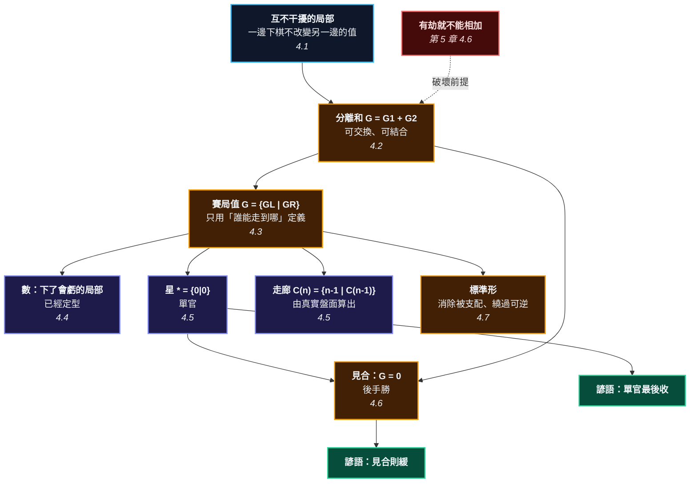

# 第 6 章：局部可以相加 —— 組合賽局論入門

---

## 0. 我們在哪裡

**開始之前你需要具備：**

* 第 2 章 §4.4 的規則（提子、禁著點）。本章要用它來判斷「這一手合不合法」。
* 第 5 章 §4.6 的結論：**劫破壞可加性**。本章從頭到尾假設無劫，而這個假設是有代價的 —— 每一條定理都會寫出來。
* 第 13 章的「數目」現在還沒到，所以本章先用一個簡化的記分法，並在 §4.1 明確寫出來。
* 數學方面：分數（尤其是 $\tfrac12$、$\tfrac14$ 這種分母是 2 的冪次的）。除此之外不需要別的 —— 賽局值會從零建立。

**讀完本章後你將能夠：**

* 說出「兩個局部可以相加」到底是什麼意思，以及它為什麼是一條**定理**而不是比喻。
* 從一個真實的小盤面，算出那個局部的**組合賽局值**。
* 分辨「數」與「不是數」的局部 —— 而這個分辨在下一章會直接變成「該不該現在下」。
* 說出「見合」的精確定義：**值等於 0**。

---

## 1. 開場思想實驗與掙得的頓悟

### 思想實驗：五家分店

你管五家分店。它們在五個不同的城市，客源、員工、供應鏈完全不重疊 —— 一家店發生什麼事，另外四家完全不受影響。

你只有一個人，一天只能去一家店。

現在問：**今天該去哪一家？**

這個問題看起來需要「綜觀全局的商業直覺」。實際上不需要。你只要對每一家店算一個數（去了能多賺多少），然後挑最大的那個。

**「綜觀全局」在這裡退化成一個排序。**

而它之所以可以退化，只因為一件事：**五家店互不影響**。如果它們共用一個倉庫，這招就完全失效 —— 你在 A 店做的決定會改變 B 店的數字，那就沒有「B 店值多少」這回事了。

### 把謎題寫成一個問題

到第 5 章為止，本書問的都是「這塊棋會不會死」。從這一章開始，問題整個換掉：

> **這一手值多少？**

而這個問題有一個令人洩氣的表面答案：「要看全盤。」

一盤圍棋有 361 個點。如果每一手的價值都取決於其他 360 個點的狀態，那「這一手值多少」就是一個 $3^{361}$ 規模的問題 —— 沒有人算得動，包括電腦。

於是圍棋教學就退到「大局觀」這三個字上：一種據說要下十年才會有的東西。

**這一章要回答的問題是：那 361 個點，能不能拆開來算？**

答案是可以 —— 而且拆開之後，「大局觀」在收官階段會退化成小學生的算術。

> [!EUREKA]
> **一個接近終局的棋盤，不是一個 361 點的巨大賽局，而是若干個互不干擾的小賽局的「和」。**
>
> 每一個小賽局可以被賦予一個數學物件（有時候是一個數，有時候不是），而整盤的最佳下法，只取決於這些物件怎麼相加、怎麼比較。
>
> 而「相加」不是一個比喻。它是一個**有定義、有交換律、有結合律、而且可以在真實盤面上驗算**的運算：
> $$G \;=\; G_1 + G_2 + \cdots + G_n$$
>
> 本章會在一個真實的 9 路盤上驗證這件事：分別算出兩個角落的值，把它們相加；再把兩個角落擺在同一個盤面上整盤算一次。**兩個答案一模一樣。**
>
> 而每一個局部的值，來自一條只有一行的遞迴定義：
> $$G \;=\; \{\, G^L \mid G^R \,\}$$
> 左邊是黑能走到的所有局面，右邊是白能走到的所有局面。沒有棋盤、沒有氣、沒有眼 —— 只有「誰能走到哪」。

```text
                        第 6 章的一句話

    整盤棋（361 點，算不動）
              │
              │  【前提】各局部互不干擾（無劫 —— 第 5 章 4.6）
              ▼
      G = G1 + G2 + ... + Gn          <- 分離和，有交換律與結合律
              │
              │  每個 Gi 用一條遞迴定義賦值
              ▼
       G = { G^L | G^R }              <- 黑能走到的 | 白能走到的
              │
     ┌────────┴─────────┐
     ▼                  ▼
  是「數」            不是「數」
  （下了會虧）        （下了會賺，或有奇偶）
     │                  │
     │                  ├─ 星 *  = {0|0}      單官
     │                  ├─ 走廊 {n-1 | C(n-1)}
     │                  └─ 開關 {a|b}, a>b     「熱」的局部
     ▼                  │
  雙方都不想動           ▼
  -> 已經定型        誰先下誰賺 -> 第 7 章的溫度要處理的東西
     │
     ▼
  見合：G = 0  ->「見合則緩」
```



---

## 2. 多角度直觀：分離和

> [!INTUITION]
> **角度一：手感／實戰透鏡**
>
> 收官的時候你在做一件很具體的事：**掃視全盤，一個角落一個角落地問「這裡值幾目」，然後挑最大的。**
>
> 你沒有在「綜觀全局」。你在做一張清單，然後排序。
>
> 這一章要證明的，就是這個看起來很土的做法**是對的** —— 而且它為什麼對，有一個精確的理由（局部互不干擾）。順帶也會說明它什麼時候會錯（有劫的時候，第 5 章 §4.6）。

> [!INTUITION]
> **角度二：幾何／形狀透鏡**
>
> 什麼叫「互不干擾」？在盤上，它是一件可以用眼睛檢查的事：**兩個局部之間隔著已經定型的棋，你在這邊下的任何一手，都不會改變那邊的任何一口氣。**
>
> 收官階段的棋盤，看起來就像一張被切開的地圖：中間是一整片已經定案的疆界，邊邊角角散落著幾個還沒收乾淨的小口子。那些小口子，就是一個個獨立的局部。
>
> 而中盤的棋盤完全不是這樣 —— 一塊棋牽著另一塊，到處都連著。**這就是為什麼組合賽局論在收官階段威力驚人，在中盤幾乎沒用。** 本書不會假裝它有用。

> [!INTUITION]
> **角度三：代數／計算透鏡**
>
> 整章建立在一條遞迴定義上：
> $$G = \{\, G^L \mid G^R \,\}$$
>
> 這條定義有一個乍看很奇怪的地方：它**沒有終止條件**。$G^L$ 也是賽局，$G^R$ 也是賽局，一直遞迴下去 —— 到哪裡停？
>
> 停在**沒有選項**的地方。$\{\,\mid\,\}$（雙方都沒有著手）就是最基本的賽局，我們把它叫做 $0$。所有其他的值，都是從這個 $0$ 一層一層堆出來的。
>
> 這件事值得停下來想一想：**整個組合賽局論，是從「沒有東西」開始長出來的。** 數字 1、$\tfrac12$、星號 $*$ —— 全部都是 $\{\,\mid\,\}$ 的組合。

> [!BOARD REALITY]
> **角度四：棋盤現實檢查**
>
> **失效一：局部根本不獨立。** 你把棋盤切成五塊，各自算了值，加起來做決定 —— 但其中兩塊其實連著（一塊棋的死活牽動另一塊，或是有劫材關係）。這時候加法給出的答案是錯的，而且它不會告訴你它錯了。**用加法之前，先確認局部真的獨立。**
>
> **失效二：把「還沒定型」當成「已經定型」。** 你數自己的地：「這裡 12 目。」但那個角落還有一個白棋可以擠進來的口子 —— 它不是 12，它是一個值為 $\{12 \mid 10\}$ 的**熱**局部。形勢判斷把熱的局部當成數來加，是業餘棋手系統性高估自己的主因。
>
> **失效三：在中盤用這一章。** 這一章的工具在收官階段近乎完美，在中盤幾乎沒用 —— 因為中盤的局部彼此糾纏。本書不會在第 12 章假裝可以用它。

---

## 3. 散落的碎片（問題本身）

**第一片：「大局觀」是一個逃避。** 問「這手值多少」，得到的答案是「要看全盤」。這句話正確但無用 —— 它把一個可以計算的問題，推給了一個據說要十年的直覺。

**第二片：目數計算沒有統一的定義。** 傳統教材會教你數目，但「數」的到底是什麼？是「現在盤上的目數」？是「雙方下到最後的目數」？是「這一手能多賺的目數」？三個不同的東西，常常用同一個字。

**第三片：「見合」被當成一種下棋的態度。** 「這兩處見合，所以不急。」聽起來像經驗法則。它其實是一個等式：**那個局部的值等於 0**。

**第四片：單官被當成「不值錢的棋」。** 事實更有趣：單官的值不是 0，是 $*$ —— 一個既不大於 0、也不小於 0、也不等於 0 的東西。它不值目，但它決定**誰先手**。而兩個單官加起來才真的是 0。

**第五片：組合賽局論被當成「數學家的玩具」。** Berlekamp 與 Wolfe 的《Mathematical Go》是寫給數學家的圍棋。本書要反過來：把它當成一個**收官時真的可以用**的工具，而且明確標示它什麼時候不能用。

### 新手典型會錯在哪裡

1. **把「熱」的局部當成數。** 一個還能被侵入的角落，不是一個固定的目數。
2. **忘記檢查獨立性。** 特別是有劫的時候（第 5 章 §4.6）。
3. **以為單官等於 0。** 單官的奇偶會決定最後誰多下一手，而那一手常常值好幾目。

---

## 4. 對齊（解答）

### 4.1 什麼叫「互不干擾」

先把記分法講清楚，否則後面每一個數字都沒有意義。

> **約定 6.1（本章的記分法）** 考慮盤面上一塊固定的**區域** $R$（一組空點），周圍的棋子當作不動的牆，而且假設那些牆是活的（死活是第 3、4 章的事）。
>
> * 只考慮下在 $R$ 裡面的著手。
> * **定型（settled）**：$R$ 裡每一塊相連的空點，它周圍的子全是同一色。此時雙方再下都只是自填。
> * **記分**：定型時，空點算給圍住它的一方（黑的算正、白的算負），被提的子算對方的目。
>
> 這是日本規則的數目法（第 13 章 §4.2 會完整處理）。**它有一個重要的後果：在自己的地裡補一手，會扣自己一目。** 這個後果是 §4.4 的全部關鍵。

> **定義 6.2（互不干擾）** 兩個區域 $R_1$、$R_2$ 互不干擾，若在 $R_1$ 裡的任何合法著手，都不改變 $R_2$ 裡任何一點的合法性與歸屬（反之亦然）。

實務上的檢查方式很簡單：**兩個區域之間隔著已經定型的棋，而且沒有共用的劫材關係。**

> [!RECALL]
> **劫材是跨局部的（第 5 章 §4.6 的命題 5.9）。**
> 那一節證明了：有劫的時候，$V(G_1 + G_2) \ne V(G_1) + V(G_2)$，因為別處的一個局部會改變這裡的劫爭勝負。
> 所以定義 6.2 的「互不干擾」在有劫時**不成立**，而本章接下來的每一條定理都預設它成立。
> 這不是小字附註 —— 它是本章工具的適用範圍。

### 4.2 分離和

> **定義 6.3（分離和）** 兩個互不干擾的局部 $G$ 與 $H$ 並存時，整體記作 $G + H$。輪到你的時候，你可以選**其中一個**局部下一手，另一個維持不變。

這個定義簡單到看起來沒說什麼。但它有兩個立刻可以驗證的性質：

$$G + H = H + G \qquad\qquad (G + H) + K = G + (H + K)$$

**交換律**成立，因為「哪個局部先被寫下來」不影響任何事。**結合律**成立，理由相同。

這兩條看起來平凡的性質，是第 11 章「手割」的全部理論基礎 —— 那個看起來像魔法的分析法，本質上就是「和可以重新排列」。

#### 在真實盤面上驗證

光說不練沒有意義。這一章的做法是：**把兩個局部分別算一次，再把它們擺在同一個盤面上整盤算一次，看兩個答案一不一樣。**

<!-- diagram: ch06_corridor2 -->
```text
     A B C D E F G H J
   9 . . . . . . . . . 9
   8 . . . . . . . . . 8
   7 . . + . . . + . . 7
   6 . . . . . . . . . 6
   5 . . . . + . . . . 5
   4 . . . . . . . . . 4
   3 . . + . . . + . . 3
   2 X X O . . . . . . 2
   1 a b O . . . . . . 1
     A B C D E F G H J
```
*長度 2 的走廊。黑下 b 封口，得 1 目；白下 b 擠進來，剩下的 a 變成單官。所以這個局部的值是 {1 | *}。*

<!-- diagram: ch06_sum -->
```text
     A B C D E F G H J
   9 . . O . . . . . . 9
   8 X X O . . . . . . 8
   7 . . + . . . + . . 7
   6 . . . . . . . . . 6
   5 . . . . + . . . . 5
   4 . . . . . . . . . 4
   3 . . + . . . + . . 3
   2 X X O . . . . . . 2
   1 . . O . . . . . . 1
     A B C D E F G H J
```
*兩條長度 2 的走廊，隔得很遠、互不干擾。整體的值就是兩個局部的值【相加】 —— 這就是第 6 章的全部槓桿。*

程式對第二張圖做的事是：把 A1、B1、A9、B9 四個點當成**一整個區域**，把所有下法窮舉一遍，算出一個值。它完全不知道「這其實是兩個局部」。

結果：那個值，恰好等於前一張圖的值**加上它自己**。

$$\underbrace{\{1 \mid *\}}_{\text{下面那條}} \;+\; \underbrace{\{1 \mid *\}}_{\text{上面那條}} \;=\; \underbrace{\{1 \mid 1\}}_{\text{整盤算出來的}}$$

§5.2 的程式會把這個等式跑給你看。

> **定理 6.4（可加性）** 若 $R_1$ 與 $R_2$ 互不干擾，則把它們當成一整個區域算出來的賽局值，等於分別算出來的值相加。

**這條定理就是本章的全部槓桿。** 它讓「整盤 361 點」變成「幾個小局部各自的值，然後相加」。

### 4.3 賽局值

> [!RECALL]
> **定理 6.4 說「可以相加」，但沒說「加什麼」。**
> §4.2 證明了兩個互不干擾的局部可以拆開處理，可是「一個局部的值」到底是什麼東西？
> 是一個目數嗎？—— 不是，因為 §4.2 那條走廊的答案是 $\{1 \mid *\}$，那不是目數。
> 這一節要給的，就是那個「東西」的定義。**先有加法，後有被加的東西** ——
> 這個順序是刻意的：可加性是我們真正想要的性質，值的定義是為了滿足它而設計的。

現在給那條遞迴定義。

> **定義 6.5（賽局值）** 一個賽局是一對集合：
> $$G = \{\, G^L \mid G^R \,\}$$
> $G^L$ 是**黑**（Left）能一手走到的所有局面，$G^R$ 是**白**（Right）能一手走到的所有局面。集合的元素本身也是賽局。
>
> 遞迴的終點是 $\{\,\mid\,\}$：雙方都沒有著手。我們把它叫做 $\mathbf{0}$。

> **約定 6.6（誰贏）** 用**正常規則**：輪到你而你沒有著手，你就輸。
> 而值的方向是：**越大對黑越好**（以目計）。

有了這兩條，每個賽局都落在四種類別之一：

| 類別 | 意思 | 記法 |
| :--- | :--- | :--- |
| $G > 0$ | 不管誰先手，黑都贏 | 黑勝 |
| $G < 0$ | 不管誰先手，白都贏 | 白勝 |
| $G = 0$ | 誰先走誰輸（後手勝） | **見合** |
| $G \parallel 0$ | 誰先走誰贏（先手勝） | 「混」（fuzzy） |

第四種是初學 CGT 最不習慣的一種：**有些賽局既不大於 0、也不小於 0、也不等於 0。** 它們和 0 之間的關係是「混」。單官就是這種東西 —— §4.5 會看到。

比較兩個賽局的方法只有一個：把它們相減，看差是不是 $\ge 0$。

$$G \ge H \iff G - H \ge 0, \qquad \text{其中 } -G = \{\, -G^R \mid -G^L \,\}$$

$-G$ 就是**把黑白對調**。這也很直觀：把整個局部的顏色反過來，值就變號。

### 4.4 數：下了會虧的局部

> [!RECALL]
> **約定 6.1 的記分法：在自己的地裡補一手，會扣自己一目。**
> 這一節整節都靠這件事。如果用中國規則（數子），填自己的地不扣分，
> 這一節的結論會完全不同 —— 第 13 章 §4.2 會處理兩種規則的差異。

<!-- diagram: ch06_settled -->
```text
     A B C D E F G H J
   9 . . . . . . . . . 9
   8 . . . . . . . . . 8
   7 . . + . . . + . . 7
   6 . . . . . . . . . 6
   5 . . . . + . . . . 5
   4 X X X . . . . . . 4
   3 . . X . . . + . . 3
   2 . . X . . . . . . 2
   1 . . X . . . . . . 1
     A B C D E F G H J
```
*已經定型的黑地：A1–B3 共 6 目，四周全是黑子。雙方在這裡下都只是自填 —— 黑下損自己一目，白下是送死。這種【下了會虧】的局部，它的值就是一個【數】：6。*

這個局部的值是 $6$。而重點不在那個 6，在**為什麼它是一個「數」**。

* 黑在裡面下一手：黑的地從 6 目變成 5 目。**黑虧了。**
* 白在裡面下一手：那顆白子沒氣（周圍全是黑），是禁著點，根本下不了；就算能下也是送一子給黑。**白虧了。**

**雙方都不想動的局部，它的值就是一個數。**

> **定理 6.7（數的判準）** 一個賽局是「數」，若且唯若**雙方都嚴格地不想先動** —— 也就是黑的每一個選項都 $<$ 這個值，白的每一個選項都 $>$ 這個值。

反過來說：**如果一個局部有人想先下，它就不是數。** 這是第 7 章「溫度」的入口 —— 溫度衡量的正是「有多想先下」。

#### 半目是怎麼冒出來的

CGT 有一條漂亮的規則，回答了「$\{a \mid b\}$ 到底等於多少」這個問題。

> **定理 6.8（簡單性規則）** 若 $G$ 的所有選項都是數，而且**黑的每一個都嚴格小於白的每一個**，則
> $$G \;=\; \text{嚴格夾在 } \max(G^L) \text{ 與 } \min(G^R) \text{ 之間、最簡單的二進位分數}$$
>
> 「最簡單」的順序是：先找整數（絕對值最小的那個），沒有整數才找分母 2 的，再沒有才找分母 4 的……

用它算幾個：

$$\{0 \mid 2\} = 1 \qquad (0 \text{ 與 } 2 \text{ 之間有整數 } 1)$$
$$\{0 \mid 1\} = \tfrac12 \qquad (0 \text{ 與 } 1 \text{ 之間沒有整數，退而求其次})$$
$$\{0 \mid \tfrac12\} = \tfrac14 \qquad (\text{再退一級})$$

**這就是圍棋為什麼會出現半目與四分之一目，而永遠不會出現三分之一目。** 那條「最簡單」的搜尋順序，走的是二分法：$1, \tfrac12, \tfrac14, \tfrac18, \ldots$。$\tfrac13$ 從來不在這條路上。

### 4.5 不是數的東西：星、走廊，以及真分數去哪了

#### 星：單官

<!-- diagram: ch06_dame -->
```text
     A B C D E F G H J
   9 . . . . . . . . . 9
   8 . . . . . . . . . 8
   7 . . + . . . + . . 7
   6 . . . . . . . . . 6
   5 . . . . + . . . . 5
   4 . . . . . . . . . 4
   3 . . + . . . + . . 3
   2 X O . . . . . . . 2
   1 a O . . . . . . . 1
     A B C D E F G H J
```
*全盤最小的局部：一個單官 a。黑下 a 不賺不賠，白下 a 也是。但【誰先下】這件事本身有意義 —— 這個局部的值是「星」，寫成 *。*

$a$（A1）在角上，兩個鄰點是 A2（黑）和 B1（白）。誰下都行，誰下都不改變目數。

* 黑下 $a$：局部定型，目數 0。所以 $G^L = 0$。
* 白下 $a$：局部定型，目數 0。所以 $G^R = 0$。

$$G = \{\, 0 \mid 0 \,\} \;=\; *$$

$*$（讀作「星」）**不是 0**。它是那個「誰先走誰贏」的東西：

* $* > 0$？不對 —— 白先走的話白贏。
* $* < 0$？不對 —— 黑先走的話黑贏。
* $* = 0$？不對 —— $0$ 是後手勝，$*$ 是先手勝。

$* \parallel 0$。**單官不值目，但它值一個手番。**

而它有一個漂亮的性質：

$$* + * = 0$$

<!-- diagram: ch06_two_dame -->
```text
     A B C D E F G H J
   9 b O . . . . . . . 9
   8 X O . . . . . . . 8
   7 . . + . . . + . . 7
   6 . . . . . . . . . 6
   5 . . . . + . . . . 5
   4 . . . . . . . . . 4
   3 . . + . . . + . . 3
   2 X O . . . . . . . 2
   1 a O . . . . . . . 1
     A B C D E F G H J
```
*兩個單官 a 與 b。這是【見合】最單純的樣子：你下 a 我就下 b，你下 b 我就下 a。整體的值是 0。用 CGT 寫就是 * + * = 0 —— 兩個一樣的星互相抵銷。*

程式對這張圖做的事，和 §4.2 一樣：把 A1 和 A9 當成一整個區域窮舉。算出來的值是 **0**。

**兩個單官加起來剛好抵銷。** 這就是見合最單純的形式，而 §4.6 會給它一個完整的定義。

> [!BOARD REALITY]
> **把單官當成 0，是形勢判斷最隱蔽的一種錯誤。**
> 收官收到最後，盤上剩下幾個單官。很多人（包括不少段位棋手）會說「單官不值錢，隨便收」。
> 值不值錢要看**奇偶**：$k$ 個單官的和，$k$ 是偶數時等於 $0$（後手有利），奇數時等於 $*$（先手有利）。
> 而那一個手番，會決定「收完單官之後還剩的那個一目半的官子」歸誰。
> **輸半目的棋，有相當比例是在這裡輸掉的** —— 而且輸的人通常不知道自己是在哪一步輸的。
> 練習 6.3 會把這件事算清楚。

#### 走廊：一族由盤面算出來的值

<!-- diagram: ch06_corridor3 -->
```text
     A B C D E F G H J
   9 . . . . . . . . . 9
   8 . . . . . . . . . 8
   7 . . + . . . + . . 7
   6 . . . . . . . . . 6
   5 . . . . + . . . . 5
   4 . . . . . . . . . 4
   3 . . + . . . + . . 3
   2 X X X O . . . . . 2
   1 a b c O . . . . . 1
     A B C D E F G H J
```
*長度 3 的走廊。黑下 c 封口得 2 目；白下 c 擠進來，剩下的就是上一張圖那條長度 2 的走廊。值是 {2 | {1 | *}}。*

把長度 1 到 4 的走廊全部算一遍，會得到一個非常乾淨的模式：

| 長度 $n$ | 賽局值 |
| ---: | :--- |
| 1 | $*$ |
| 2 | $\{1 \mid *\}$ |
| 3 | $\{2 \mid \{1 \mid *\}\}$ |
| 4 | $\{3 \mid \{2 \mid \{1 \mid *\}\}\}$ |

一眼就看得出遞迴：

$$\boxed{\;C(1) = *, \qquad C(n) = \{\, n-1 \;\mid\; C(n-1) \,\}\;}$$

翻譯回棋：**黑封口，得 $n-1$ 目（封口那一手佔掉了一格）；白擠進來，剩下的就是短一格的同一種走廊。**

這族值不是我從書上抄的 —— 它是程式對真實盤面窮舉出來的。§5 會示範怎麼自己跑一次。

#### 真分數去哪了

到這裡有一個問題應該浮現了：**§4.4 講了半目與四分之一目，可是上面所有的例子，值不是整數就是 $*$ 或走廊，一個真分數都沒有。**

這不是巧合。寫這一章的時候，我用程式掃了 **40,000 個隨機生成的單一局部**（$4\times4$ 與 $5\times5$ 的盤面，取一塊 1 到 4 個空點的**連通**區域，其餘空點填實），統計它們的值：

| 值的類型 | 個數 |
| :--- | ---: |
| 整數 | 12,938 |
| 不是數（星、走廊、開關……） | 27,062 |
| **真分數（$\tfrac12$、$\tfrac14$……）** | **0** |

一個都沒有。

**但故事還有下半段，而它是校對這本書的時候才發現的。**

如果把盤上**所有**空點合起來當成「一個區域」——那其實不是一個局部，是**若干個互不相連的局部的和** ——結果就不一樣了：

| 樣本 | 個數 | 真分數 |
| :--- | ---: | ---: |
| 單一連通局部 | 40,000 | **0** |
| 不相連的空點合成一區（也就是「和」） | 7,075 | **1** |

那唯一的一個是 $\tfrac12$，出現在一個 $5\times5$ 的盤面上，空點是 E5、A2、D1、E1 —— 三塊互不相連的地方。

$$\boxed{\ \textbf{真分數不是不會出現，是它出現在「和」裡，不在單一局部裡。}\ }$$

**而這正好是簡單性規則預測的事。** 定理 6.8 要的是「黑動一手虧、白動一手也虧，而且虧的量把值卡在半目」。一個**單一**的圍棋局部很難剛好長成那樣；但好幾個局部**加起來**，就有機會湊出來 —— 加法本來就是製造中間值的機器。

**為什麼？** 回頭看定理 6.8。要得到 $\tfrac12$，需要 $\{0 \mid 1\}$ —— 黑的最佳選項是 $0$、白的最佳選項是 $1$，而且黑的**比較小**。翻譯回棋：黑動一手虧一目，白動一手也虧一目，而且虧的量剛好讓中間值落在半目上。

在約定 6.1 的記分法下，這種配置很難出現：一個局部只要有人動了會賺，它就變成「熱」的（不是數）；而如果雙方動了都虧，通常整個局部早就定型了，值是整數。

> [!IMPORTANT]
> **那半目到底在哪裡？**
>
> 在**均值**裡，不在值裡。
>
> 拿走廊 $C(2) = \{1 \mid *\}$ 來說。它**不是** $\tfrac12$ —— 程式驗過，它和 $\tfrac12$ 的關係是「混」（既不大於、也不小於、也不等於）。但如果雙方在這裡輪流下到底，平均的結果是半目。那個「平均」就是第 7 章要定義的**均值** $m(G)$。
>
> 所以本書要修正一個常見的說法：
>
> * ❌ 「圍棋局部的值會出現半目。」
> * ✅ 「圍棋局部的**均值**會出現半目。原始的賽局值幾乎都是整數、星、或熱的開關。」
>
> 這個區別在第 7 章會變得非常重要，因為**收官排序用的是溫度，而形勢判斷用的是均值** —— 兩個不同的數，來自同一個賽局。
>
> **誠實聲明**：上面那個 0 是一個**搜尋結果**，不是定理。搜尋範圍是 $\le 5\times5$ 的盤面、一塊 $\le 4$ 個空點的連通區域、約定 6.1 的記分法。更大的盤面、或別的記分法（例如中國規則），可能會有不同的結果。本書不宣稱「圍棋局部的值不可能是真分數」——只報告在這個範圍內沒有找到。
>
> **而且範圍一放寬就找到了**：把不相連的空點合起來當一個區域（那是若干局部的**和**），7,075 個樣本裡出現了一個 $\tfrac12$。所以正確的說法不是「圍棋沒有真分數」，是「**真分數出現在和裡，不在單一局部裡**」。這個修正本身就是「搜尋結果不是定理」最好的示範 —— 第一版的搜尋範圍太小，結論就過強了。

### 4.6 見合

> **定義 6.9（見合）** 一個局部（或若干局部的和）是**見合**，若它的值等於 $0$ —— 也就是**誰先走誰輸**。

> [!RECALL]
> **$G = 0$ 的意思是「後手勝」，不是「值零目」。**
> §4.3 的約定 6.6：$0 = \{\,\mid\,\}$ 是「雙方都沒有著手」，而一個賽局**等於** $0$ 的意思是它和 $0$ 打平 ——
> 先走的人輸。這和「這裡值 0 目」是兩件不同的事：$*$ 也不值目，但 $* \ne 0$。

兩個單官的和是見合（§4.5 驗過了）。更一般地：

> **命題 6.10** 若 $G$ 與 $H$ 的值互為相反數（$H = -G$），則 $G + H = 0$，也就是見合。

這正是「見合」在實戰裡的樣子：**兩個大小相同、方向相反的地方。** 你下一個，我下另一個，總帳不變。

而它的實戰意義非常直接：

> [!PROVERB]
> **「見合則緩」**
> **它其實在說**：$G + H = 0$。這一對局部的和是零，先動的人反而吃虧 —— 所以應該把手番拿去別處，等到全盤沒有更大的地方，再回來收。
> **失效條件一**：兩處必須**真的**一樣大。如果一邊 $8$ 目、一邊 $6$ 目，那不是見合，是 $\{8\} + \{-6\} = 2$，你該去下那個 8 目的。實戰上「看起來見合」而其實不對等，是常見的誤判。
> **失效條件二**：兩處必須**互不干擾**（定義 6.2）。如果對手在一處的一手同時影響兩處，見合就破了 —— 這在有劫的時候特別常發生（第 5 章 §4.6）。

> [!PROVERB]
> **「單官最後收」**
> **它其實在說**：單官的值是 $*$，不是 $0$。它不值目，所以任何值目的地方都比它大，應該最後才收。
> **但**「不值目」不等於「沒用」：$*$ 與 $0$ 是**混**的關係，也就是誰先手誰贏。所以單官的**奇偶**會決定最後誰多下一手 —— 而那一手常常值好幾目。
> **失效條件**：單官若同時是雙方的「緊氣」要點（例如它是某個對殺的公氣，第 4 章 §4.2），那它就不只是單官，值可能非常大。**先確認它真的不影響任何死活，再把它排到最後。**

### 4.7 標準形：為什麼要化簡

> [!RECALL]
> **「相等」在本章的意思是 $G - H = 0$（§4.3），不是「長得一樣」。**
> 這一節要做的化簡會把一個賽局改寫成完全不同的樣子 ——
> 幾千個字元變成一行。憑什麼說那還是同一個值？
> 就憑 §4.3 那個定義：兩個賽局相等，意思是它們的**差是後手勝**。
> 結構可以差很多，值可以完全相同。

最後一個技術性的東西，但沒有它，這一章的值全部沒法看。

直接窮舉出來的賽局值，會包含大量**沒有人會選的爛選項**。長度 4 的走廊，原始的值印出來有好幾千個字元。

CGT 有兩條化簡規則，兩者都不改變值：

> **規則一（消除被支配的選項）**：黑的兩個選項若 $A \le B$，那 $A$ 永遠不會被選，刪掉。白的兩個選項若 $A \ge B$，同理。
>
> *白話*：有更好的走法，就不會走差的。

> **規則二（繞過可逆著手）**：若黑走到 $G^L$，而白在那裡有一個回應 $G^{LR}$ 滿足 $G^{LR} \le G$，那黑那一手等於白讓白把局面拉回原點（甚至更糟）。這時可以把 $G^L$ 換成 $G^{LR}$ 的黑選項，直接跳過這一來一回。
>
> *白話*：如果對手有一手能把你打回原形，那你那一手等於沒下。

套用這兩條之後，長度 4 的走廊從幾千個字元，變成 $\{3 \mid \{2 \mid \{1 \mid *\}\}\}$ —— 一行。

> [!RECALL]
> **化簡不改變值。**
> 這一點必須驗證，不能假設。§5.2 的程式會對每一個化簡前後的賽局做 `==` 比較（而 `==` 是用 §4.3 的 $G - H \ge 0$ 定義的，不是比結構）。
> **看起來一樣**和**值相等**是兩件事，而 CGT 在乎的永遠是後者。

---

## 5. 應用：手算追蹤與非黑盒程式

### 5.1 用手算一遍

手算長度 3 的走廊（§4.5 那張圖，區域是 A1、B1、C1，上面是黑牆，D1 是白子）。

**第一步：這個局部定型了嗎？**

A1、B1、C1 三個空點是相連的，構成一塊。它的邊界有哪些子？A2、B2、C2（黑）和 D1（白）。**黑白混雜 → 沒定型。** 所以它不是一個數，要往下算。

**第二步：黑的選項。**

* **黑下 C1（封口）**：現在 A1、B1 這一塊的邊界是 A2、B2（黑）和 C1（黑）—— 全黑，**定型**。黑得 2 目。所以這個選項的值是 $2$。
* 黑下 B1 或 A1：等於自己往自己的地裡填，只會更少。這兩個選項會被規則一（被支配）刪掉。

所以 $G^L$ 的最佳者是 $2$。

**第三步：白的選項。**

* **白下 C1（擠進來）**：C1 變白子（連著 D1，活的）。剩下 A1、B1 這一塊，邊界是 A2、B2（黑）和 C1（白）—— 還是混雜，沒定型。**這正好是一條長度 2 的走廊。**
* 白下 B1 或 A1：那顆白子孤立在黑的包圍裡，會被提掉，是送子。被規則一刪掉。

所以 $G^R$ 的最佳者是 $C(2)$。

**第四步：合起來。**

$$C(3) = \{\, 2 \;\mid\; C(2) \,\}$$

而 $C(2)$ 用同樣的方法算：黑封口得 1 目，白擠進來剩一個單官。

$$C(2) = \{\, 1 \mid * \,\} \qquad\Longrightarrow\qquad C(3) = \{\, 2 \mid \{1 \mid *\} \,\}$$

**第五步：讀出這個值在說什麼。**

$C(3)$ 不是一個數 —— 它是「熱」的，因為黑下（得 2）和白下（掉到 $C(2)$，大約半目）差很多。**有人想先下，所以它不是數。**

差多少？$2$ 與「大約 $\tfrac12$」之間差大約 $1.5$。這個「差多少」除以 2，就是第 7 章要定義的**溫度**。你已經在算它了，只是還沒給它名字。

### 5.2 用程式驗一遍

```python
"""第 6 章 §4.2、§4.5：可加性，以及走廊那一族值。"""
from go_core import BLACK, WHITE, Board
from go_core.cgt import STAR, ZERO, Game, number
from go_core.endgame import corridor, region_value

print("=== 走廊：由真實盤面窮舉出來的值 ===")
values = {}
for n in range(1, 5):
    board, region = corridor(n)
    g = region_value(board, region).canonical()
    values[n] = g
    print(f"  長度 {n}: {g!r}")

# 遞迴 C(n) = {n-1 | C(n-1)}，C(1) = *
assert values[1] == STAR
for n in range(2, 5):
    assert values[n] == Game([number(n - 1)], [values[n - 1]]), n
print("  遞迴 C(n) = {n-1 | C(n-1)} 成立，C(1) = *。")

print("\n=== 可加性：分開算再相加 vs 擺在一起整盤算 ===")
b = Board(9)
b.place_many(BLACK, ["A2", "B2", "A8", "B8"])
b.place_many(WHITE, ["C1", "C2", "C9", "C8"])
both = region_value(b, ["A1", "B1", "A9", "B9"]).canonical()
apart = values[2] + values[2]
print(f"  下面那條走廊  = {values[2]!r}")
print(f"  上面那條走廊  = {values[2]!r}")
print(f"  分開算再相加  = {apart.canonical()!r}")
print(f"  整盤一起算    = {both!r}")
assert apart == both
print("  兩者相等 —— 定理 6.4（可加性）在真實盤面上成立。")

print("\n=== 星：* + * = 0 ===")
assert STAR + STAR == ZERO
assert STAR != ZERO
assert not (STAR > ZERO) and not (STAR < ZERO)
print(f"  * 的勝負類別：{STAR.outcome()}（不是「後手勝」，所以 * 不等於 0）")
print(f"  * + * 的勝負類別：{(STAR + STAR).outcome()}  -> 見合")
```

**輸出裡該看什麼。** 看「分開算再相加」與「整盤一起算」那兩行 —— 它們是**用兩種完全不同的方式**得到的：一個是把兩個值用 CGT 的加法規則算出來，另一個是把四個點當成一整塊、窮舉所有下法。兩者相等，就是定理 6.4。

> **配套範例腳本**：`examples/ch06_game_values/ex01_additivity.py`

### 5.3 值的類型普查

```python
"""第 6 章 §4.5：真分數在單一局部裡找不到，在【和】裡找得到。"""
import random
from collections import Counter

from go_core import BLACK, EMPTY, WHITE, Board
from go_core.board import neighbors
from go_core.endgame import region_value


def components(pts, n):
    """把一組點切成連通分量。"""
    pts, out = set(pts), []
    while pts:
        seed = pts.pop()
        comp, stack = {seed}, [seed]
        while stack:
            q = stack.pop()
            for r in neighbors(q, n):
                if r in pts:
                    pts.discard(r)
                    comp.add(r)
                    stack.append(r)
        out.append(comp)
    return out


def kind_of(board, region):
    g = region_value(board, frozenset(region), max_depth=8).canonical()
    num = g.as_number(3, 6)
    if num is None:
        return "不是數", None
    return ("整數" if num.denominator == 1 else "真分數"), num


# --- 一、單一連通局部（其餘空點填實，讓它真的孤立）---------------------
rng = random.Random(6)
single = Counter()
while sum(single.values()) < 3000:
    n = rng.choice([4, 5])
    b = Board(n)
    pts = [(r, c) for r in range(n) for c in range(n)]
    for q in pts:
        b.grid[q] = rng.choices([EMPTY, BLACK, WHITE], [0.30, 0.36, 0.34])[0]
    comps = [c for c in components([q for q in pts if b.grid[q] == EMPTY], n)
             if 1 <= len(c) <= 4]
    if not comps:
        continue
    region = rng.choice(comps)
    for q in pts:                       # 其餘空點填實
        if b.grid[q] == EMPTY and q not in region:
            b.grid[q] = rng.choice([BLACK, WHITE])
    single[kind_of(b, region)[0]] += 1

print(f"單一連通局部 {sum(single.values())} 個：")
for k in ["整數", "不是數", "真分數"]:
    print(f"  {k:<6}{single[k]:>6}")
assert single["真分數"] == 0

# --- 二、那個唯一的真分數：三塊不相連的空點加起來 ----------------------
b = Board(5)
b.place_many(BLACK, ["C5", "D5", "A4", "D4", "E4", "A3",
                     "B2", "C2", "D2", "E2", "B1"])
b.place_many(WHITE, ["A5", "B5", "B4", "C4", "B3", "C3", "D3", "E3",
                     "A1", "C1"])
print()
print(b)
empties = ["E5", "A2", "D1", "E1"]
comps = components([b._pt(q) for q in empties], 5)
print(f"  這四個空點分成 {len(comps)} 塊互不相連的地方 —— 它是一個【和】")
whole = region_value(b, empties, max_depth=8).canonical()
print(f"  合起來的值 = {whole!r}  =  {whole.as_number(3, 6)}")
assert len(comps) == 3
assert whole.as_number(3, 6) is not None
assert whole.as_number(3, 6).denominator == 2

print()
print("  單一局部：3000 個，真分數 0 個。")
print("  若干局部的和：這一個就是 1/2。")
print("  真分數不是不會出現，是它出現在【和】裡 —— 加法是製造中間值的機器。")
```

**輸出裡該看什麼。** 兩段要一起看。第一段是 3000 個單一局部、真分數 **0** 個；第二段是**一個具體的盤面**，四個空點分成三塊互不相連的地方，合起來的值就是 $\tfrac12$。

**這是本章被程式修正了兩次的地方。** 第一次：寫大綱時我以為「半目的局部真的存在」，程式說單一局部裡沒有。第二次：校對時我把搜尋範圍拉大，程式說**和**裡面有。第一次的修正寫進了 §4.5 的 IMPORTANT，第二次的修正把那個 IMPORTANT 又改了一遍 ——**「搜尋結果不是定理」這句話，本章示範了兩次，第二次是打自己的臉。**

> **配套範例腳本**：`examples/ch06_game_values/ex02_value_census.py`

---

## 6. 練習與完整解答

### 基礎練習

#### 練習 6.1

<!-- diagram: ch06_ex1 -->
```text
     A B C D E F G H J
   9 . . . . . . . . . 9
   8 . . . . . . . . . 8
   7 . . + . . . + . . 7
   6 . . . . . . . . . 6
   5 . . . . + . . . . 5
   4 . . . . . . . . . 4
   3 X X X O . . + . . 3
   2 . . X O . . . . . 2
   1 . . X O . . . . . 1
     A B C D E F G H J
```
*練習 6.1：這個局部已經定型了嗎？它的值是多少？先自己數，再想想「雙方在這裡下會怎樣」。*

<details>
<summary><b>解答</b></summary>

**定型了。** 區域是 A1、A2、B1、B2 四個空點，它們相連成一塊。這一塊的邊界是 A3、B3、C3、C2、C1 —— **全部是黑子**。單一顏色 → 定型。

**值是 $4$。** 四個空點全是黑的地。

**為什麼它是一個「數」而不是「熱」的？** 依定理 6.7，要檢查雙方是不是都不想動：

* 黑下在裡面（例如 B2）：黑的地從 4 目變成 3 目。**虧一目。**
* 白下在裡面：那顆白子四周全是黑（或連到的都是黑），沒有氣，是禁著點 —— 根本下不了。就算能下也是送子。**虧。**

雙方都虧 → 是數 → 值 $4$。

**注意 C 列那三顆白子。** 它們在區域外面，是「牆」的一部分。這一題要練的是：**先確認區域的邊界是不是單一顏色，再數目。** 很多人會被旁邊的白子干擾，以為這裡還有得爭。

```python
from go_core import BLACK, WHITE, Board
from go_core.endgame import region_value, territory

b = Board(9)
b.place_many(BLACK, ["A3", "B3", "C3", "C2", "C1"])
b.place_many(WHITE, ["D1", "D2", "D3"])
region = ["A1", "A2", "B1", "B2"]
black_pts, white_pts, settled = territory(b, [b.pt(p) for p in region])
print(f"定型了嗎：{settled}   黑 {black_pts} 目、白 {white_pts} 目")
g = region_value(b, region).canonical()
print(f"賽局值：{g!r}   是數嗎：{g.as_number(3, 8)}")
assert settled and g.as_number(3, 8) == 4
```
</details>

#### 練習 6.2

<!-- diagram: ch06_ex2 -->
```text
     A B C D E F G H J
   9 d O . . . . . . . 9
   8 X O . . . . . . . 8
   7 . . + . . . + . . 7
   6 . . . . . . . . . 6
   5 . . . . + . . . . 5
   4 . . . . . . . . . 4
   3 . . + . . . + . . 3
   2 X X X O . . . . . 2
   1 . . . O . . . . . 1
     A B C D E F G H J
```
*練習 6.2：一條長度 3 的走廊，加上一個單官 d。整體的值是多少？誰先下比較好？*

<details>
<summary><b>解答</b></summary>

**用可加性拆開算。** 兩個局部互不干擾（一個在左下、一個在左上，中間隔著大片空盤 —— 而且各自都被盤邊與棋子封死）。所以

$$G = C(3) + * = \{2 \mid \{1 \mid *\}\} + *$$

**誰先下比較好？** 因為 $C(3)$ 是熱的（黑下得 2，白下只剩約半目），而 $*$ 只值一個手番，所以**先下的人應該去下走廊，不是去下單官。**

程式算出整體的值是 $\{\{2 \mid 2\} \mid \{\{1 \mid 1\} \mid 0\}\}$，勝負類別是「黑勝」。

**這一題要練的是兩件事：**

1. **先確認獨立性，再相加。** 這兩個局部隔得夠遠、各自封死，所以可以加。
2. **單官不是零。** 加上一個 $*$ 之後，整體的值變了（多了一個手番的奇偶）。如果你把單官當成 0 忽略掉，你會算錯最後誰多下一手。

```python
from go_core import BLACK, WHITE, Board
from go_core.cgt import STAR
from go_core.endgame import corridor, region_value

# 分開算
c3 = region_value(*corridor(3)).canonical()
print(f"  走廊(3) = {c3!r}")
print(f"  單官    = {STAR!r}")
apart = (c3 + STAR).canonical()

# 擺在同一個盤面上整盤算
b = Board(9)
b.place_many(BLACK, ["A2", "B2", "C2", "A8"])
b.place_many(WHITE, ["D1", "D2", "B9", "B8"])
both = region_value(b, ["A1", "B1", "C1", "A9"]).canonical()

print(f"  分開算再相加 = {apart!r}")
print(f"  整盤一起算   = {both!r}")
print(f"  勝負類別     = {both.outcome()}")
assert apart == both
assert both.outcome() == "黑勝"
print("  可加性再次成立。")
```
</details>

### 實戰練習

#### 練習 6.3

證明：$*$ 不等於 $0$，但 $* + * = 0$。然後說明這件事在收官時的實際意義。

<details>
<summary><b>解答</b></summary>

**第一部分：$* \ne 0$。**

$* = \{0 \mid 0\}$。黑先走：黑走到 $0$，那時輪到白，白在 $0$ 裡沒有著手 → **白輸**。白先走：對稱地，**黑輸**。

所以 $*$ 是「先手勝」。而 $0 = \{\,\mid\,\}$ 是「後手勝」（先走的人沒得走，直接輸）。兩者的勝負類別不同，所以 $* \ne 0$。

**第二部分：$* + * = 0$。**

在 $* + *$ 裡，先走的人必須在其中一個 $*$ 上走，把它變成 $0$。剩下 $0 + * = *$，輪到對手。對手在那個 $*$ 上走，變成 $0 + 0 = 0$，輪回第一個人 —— 他沒得走，**輸**。

所以 $* + *$ 是後手勝，也就是 $0$。$\square$

**收官時的實際意義：單官的奇偶。**

盤上剩下 $k$ 個單官時，整體是 $k$ 個 $*$ 相加：

* $k$ 是**偶數**：兩兩抵銷，總和是 $0$。**後手有利** —— 對手每收一個，你就收一個，最後多下一手的是你。
* $k$ 是**奇數**：抵銷剩一個 $*$。**先手有利** —— 你會多收到一個單官，也就是多一個手番。

而「多一個手番」在日本規則下不值目（單官不是地），但在**收完單官之後還有東西要收**的時候，那個手番就值錢了。

這也解釋了一個實戰現象：**高手在收單官時會數奇偶。** 那不是強迫症，是在算 $\sum *$ 等於 $0$ 還是 $*$。

```python
from go_core.cgt import STAR, ZERO

assert STAR != ZERO
assert STAR.outcome() == "先手勝" and ZERO.outcome() == "後手勝"
assert STAR + STAR == ZERO

total = ZERO
for k in range(1, 7):
    total = total + STAR
    parity = "奇數 -> 先手有利" if k % 2 else "偶數 -> 後手有利"
    print(f"  {k} 個單官：值 = {total!r:3s}  {total.outcome()}   {parity}")
    assert (total == ZERO) == (k % 2 == 0)
```
</details>

#### 練習 6.4

§4.5 說「掃了 40,000 個單一局部，真分數 0 個」。這是不是表示「圍棋局部的值不可能是真分數」？

<details>
<summary><b>解答</b></summary>

**不是。** 那是一個**搜尋結果**，不是定理。它的正確讀法是：

> 在「$\le 5\times5$ 的盤面、一塊 $\le 4$ 個空點的**連通**區域、約定 6.1 的記分法」這個範圍內，沒有找到值是真分數的局部。

要把它變成定理，需要證明「在約定 6.1 之下，任何局部的值都不可能是真分數」—— 而本書沒有這個證明。

**而且這一次，範圍稍微放寬就找到反例了。** §4.5 下半段：把不相連的空點合起來（那是若干局部的**和**），7,075 個樣本裡出現了一個 $\tfrac12$。**這正是「搜尋結果不是定理」最貴的一課** —— 本書第一版的搜尋範圍太小，於是結論下得太強，校對時才被更大的搜尋推翻。

**那要怎麼看待這個結果？** 它足以支撐一個**修正**：

* 原本的說法「圍棋局部的值會出現半目」—— 沒有證據支持。
* 修正後的說法「圍棋局部的**均值**會出現半目」—— 這個第 7 章會證明。

**這一題真正要練的是讀數據的態度。** 一個大規模搜尋找不到反例，是很強的證據，但它不是證明。本書的 `docs/04_formula_index.md` 用三個記號區分這件事：

| 記號 | 意思 |
| :--- | :--- |
| 🟢 | 有完整證明，且有程式驗證 |
| 🟡 | 啟發式／經驗模型，**沒有**證明 |
| 🔴 | 待完成 |

「局部的值不會是真分數」這一條，如果要寫進索引，它是 🟡，不是 🟢。

```python
from fractions import Fraction
from go_core.cgt import Game, number

# 抽象地說，{0|1} = 1/2 這件事完全成立 —— 真分數在 CGT 裡當然存在
half = Game([number(0)], [number(1)])
assert half.as_number() == Fraction(1, 2)
print(f"  {{0|1}} = {half.as_number()}   —— 抽象的 CGT 裡，1/2 當然存在")

quarter = Game([number(0)], [number(Fraction(1, 2))])
assert quarter.as_number() == Fraction(1, 4)
print(f"  {{0|1/2}} = {quarter.as_number()}")
print()
print("  問題不是「1/2 這個值存不存在」，而是「圍棋局部會不會產生它」。")
print("  前者是數學，後者是經驗 —— 兩者的證據標準不一樣。")
```
</details>

---

## 7. 本章頓悟總結

* **一個接近終局的棋盤是若干個小賽局的和。** $G = G_1 + \cdots + G_n$，而這個加法有交換律、有結合律，並且在真實盤面上驗證過：分別算兩個局部的值再相加，等於把它們擺在一起整盤算。
* **賽局值只用一條遞迴定義**：$G = \{G^L \mid G^R\}$，遞迴的終點是 $0 = \{\,\mid\,\}$。整個理論從「沒有東西」開始長出來。
* **「數」＝下了會虧的局部。** 雙方都不想先動，所以它已經定型。反過來說：**只要有人想先下，它就不是數** —— 那正是第 7 章「溫度」要衡量的東西。
* **簡單性規則**回答了「$\{a \mid b\}$ 等於多少」：夾在中間、最簡單的二進位分數。這解釋了圍棋為什麼會有半目與四分之一目，卻永遠不會有三分之一目。
* **有些賽局既不大於、也不小於、也不等於 $0$。** 單官就是這種東西：$* = \{0\mid0\}$，$* \parallel 0$。它不值目，但值一個手番，而且 $* + * = 0$。
* **走廊是一族由盤面算出來的值**：$C(1) = *$，$C(n) = \{n-1 \mid C(n-1)\}$。
* **見合的精確定義是 $G = 0$**（後手勝），不是「兩個一樣大的地方」。
* **半目在均值裡，不在【單一局部的】值裡。** 40,000 個單一連通局部的普查裡，整數 12,938 個、非數 27,062 個、真分數 **0** 個。這推翻了本書大綱原本的說法。**而校對時把範圍放寬到「若干局部的和」，7,075 個樣本裡就出現了一個 $\tfrac12$** —— 於是連這條修正本身也被修正了一次。兩次都是程式推翻作者，不是作者想通。

**接下來。** 本章把每個局部變成了一個數學物件，但還沒回答最重要的問題：**這些物件要怎麼比大小？** $\{2 \mid \{1\mid*\}\}$ 和 $\{5 \mid 1\}$，哪一個該先下？

第 7 章會給每個局部兩個數：**均值**（它最後大概值幾目）與**溫度**（現在下一手能賺幾目）。然後證明一件事：**最優收官，就是依溫度遞減下棋** —— 一個小學生做得到的排序。而「先手」這個困擾了無數業餘棋手的概念，會變成一個溫度的比較。
