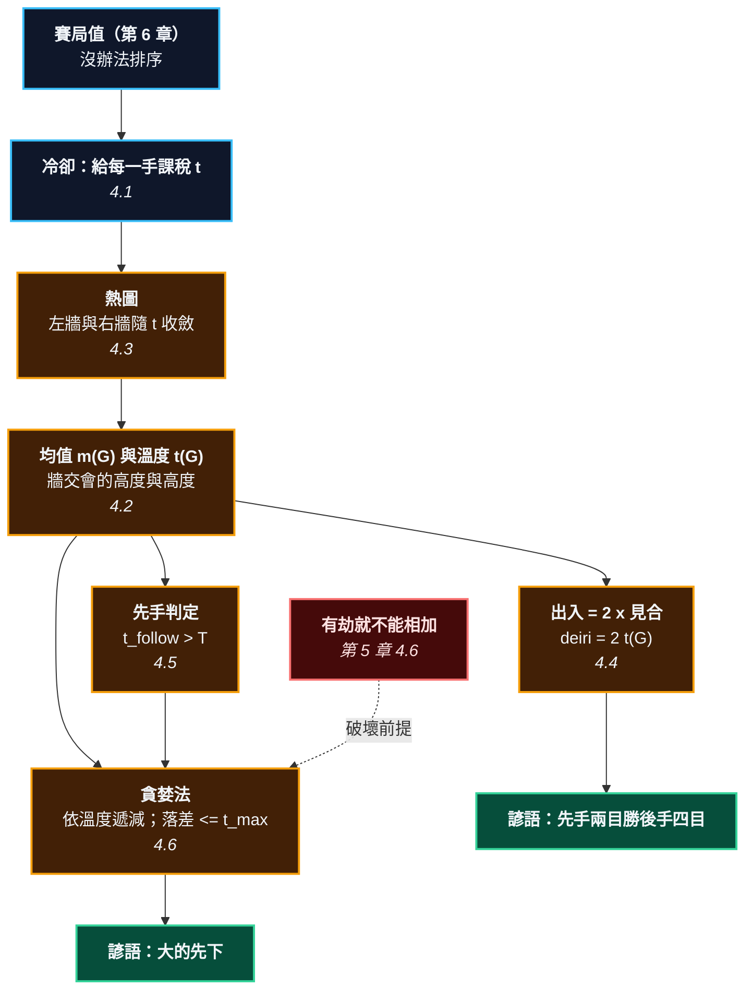

# 第 7 章：溫度與官子 —— 為什麼「大的先下」是定理

---

## 0. 我們在哪裡

**開始之前你需要具備：**

* 第 6 章 §4.2 的分離和：互不干擾的局部可以相加，而且這在真實盤面上驗證過。
* 第 6 章 §4.3 的賽局值 $G = \{G^L \mid G^R\}$，以及 §4.4 的「數＝下了會虧的局部」。
* 第 6 章 §4.5 的走廊族 $C(n) = \{n-1 \mid C(n-1)\}$ —— 本章會給它們一個溫度。
* 第 5 章 §4.6 的警告：**有劫就不能相加**。本章的每一條定理都預設無劫。
* 數學方面：分數、以及「一條隨參數變動的折線」的直覺。

**讀完本章後你將能夠：**

* 說出一個局部的兩個數 —— **均值**（它大概值幾目）與**溫度**（現在下一手能賺幾目）—— 並知道哪一個用在形勢判斷、哪一個用在收官排序。
* 說出「這手棋 12 目」和「這手棋 6 目」為什麼是**同一手棋**。
* 用一條不等式判斷一手棋是先手還是後手，而且知道那條不等式的兩邊都會變。
* 說出「大的先下」的**誤差界**，以及它在什麼情況下會失效。

---

## 1. 開場思想實驗與掙得的頓悟

### 思想實驗：五場同時進行的談判

你同時在跟五個對手談判。規矩很怪：每一場你只能派一次代表，對手也一樣，而且你們**輪流**派。你派人去某一場，那一場的結果對你有利；他派人去，對你不利。

現在看其中兩場：

* **談判 A**：你去，賺 100 萬；他去，賺 98 萬。
* **談判 B**：你去，賺 60 萬；他去，**虧** 60 萬。

你只能先去一場。去哪一場？

直覺會說 A —— 那裡的金額最大。

但直覺是錯的。去 A，你只比「不去」多賺 2 萬（100 對 98）。去 B，你多賺 **120 萬**（60 對 −60）。

**該先去 B。**

而這件事的一般形式是：**要先去的不是「最值錢」的地方，是「誰先去差最多」的地方。**

### 把謎題寫成一個問題

第 6 章把每個局部變成了一個數學物件。但那些物件長這樣：

$$\{2 \mid \{1 \mid *\}\}, \qquad \{5 \mid 1\}, \qquad *, \qquad 6$$

你沒辦法把它們排序。你甚至沒辦法說 $\{2 \mid \{1\mid*\}\}$「大概值幾目」。

而收官的時候，你**需要**排序 —— 因為你一次只能下一手。

**這一章要回答的問題是：怎麼把一個賽局值變成一個可以排序的數？**

答案是：變成**兩個**數，而不是一個。因為一個局部有兩件不同的事要問，它們的答案不一樣：

* 「這個角落最後大概會是幾目？」—— 形勢判斷要問這個。
* 「現在在這裡下一手，能賺幾目？」—— 收官排序要問這個。

> [!EUREKA]
> **每個局部有兩個數：均值與溫度。**
>
> **均值** $m(G)$：雙方輪流下到底，平均落在幾目。形勢判斷用它。
> **溫度** $t(G)$：現在在這裡下一手，能賺幾目。收官排序用它。
>
> 兩者由同一個想法定義：**給每一手棋課一筆稅**。
> 稅率 $t$ 之下，你每下一手都要付 $t$ 目。稅越重，越沒有人想動。
> 稅重到某個程度時，雙方都不想先下了 —— 這個局部就**凝固成一個數**。
>
> $$\textbf{那個剛好凝固的稅率就是溫度；凝固後的值就是均值。}$$
>
> 對最簡單的局部 $\{a \mid b\}$（$a > b$）：
> $$m = \frac{a+b}{2}, \qquad t = \frac{a-b}{2}$$
> 均值是中點，溫度是**差距的一半** —— 正是那五場談判的答案。
>
> 而有了溫度，「大局觀」在收官階段就退化成一句話：**依溫度遞減下棋**。這不是習慣，是一條**帶誤差界的定理**，而本章會把那個界算出來。

```text
                        第 7 章的一句話

     一個賽局值（第 6 章）      {2 | {1 | *}}   —— 沒辦法排序
                 │
                 │  課稅：每下一手付 t 目
                 ▼
          稅率 t 越高，越沒人想動
                 │
                 ▼
        ┌────────────────────┐
        │  剛好凝固的那個 t   │  = 溫度 t(G)    -> 收官排序用這個
        │  凝固後的那個值     │  = 均值 m(G)    -> 形勢判斷用這個
        └────────────────────┘
                 │
     ┌───────────┼────────────┬──────────────────┐
     ▼           ▼            ▼                  ▼
  見合計算    出入計算      先手判定           貪婪法
  = t(G)     = 2 t(G)    t_follow > T       依溫度遞減下
     │           │            │                  │
     ▼           ▼            ▼                  ▼
 「這手 6 目」「這手 12 目」「先手是一種關係，  「大的先下」
   —— 同一手棋 ——            不是棋的性質」    落差 <= t_max
```



---

## 2. 多角度直觀：溫度

> [!INTUITION]
> **角度一：手感／實戰透鏡**
>
> 收官的時候，你腦子裡真正在跑的句子是：「這裡比較大。」
>
> 「比較大」是什麼意思？你以為你在比較**目數**，但你其實在比較**差距** —— 「我下這裡和他下這裡，差多少」。
>
> 證據：一個已經定型的 20 目大空，你完全不會想下。它「很大」，但它的差距是 0。而一個只值 3 目的小角落，如果被對手先下會虧 3 目，你會馬上去下。
>
> **你比的一直是差距，不是絕對值。** 這一章只是給那個差距一個名字（溫度），並證明照它排序是對的。

> [!INTUITION]
> **角度二：幾何／形狀透鏡**
>
> 溫度有一張圖，叫**熱圖**。橫軸是稅率 $t$，縱軸是目數。畫兩條線：
>
> * **左牆**：稅率 $t$ 之下，黑先手的結果。
> * **右牆**：稅率 $t$ 之下，白先手的結果。
>
> 稅率 0 時，兩條牆離得最遠（黑先和白先差很多）。稅率越高，兩條牆越靠近 —— 因為下棋越來越不划算。到某個高度它們**碰在一起**，之後就變成一條垂直的線（叫「桅杆」）往上延伸。
>
> 碰到的那個**高度**就是溫度，碰到的那個**位置**就是均值。一張圖同時給出兩個數。
>
> 而牆的斜率永遠是 $\pm 1$ —— 因為稅每漲 1 目，先手方的所得就少 1 目。這讓熱圖永遠是折線，而且好畫。

> [!INTUITION]
> **角度三：代數／計算透鏡**
>
> 熱圖的遞迴定義只有兩行：
>
> $$L_G(t) = \max_{G^L} R_{G^L}(t) - t, \qquad R_G(t) = \min_{G^R} L_{G^R}(t) + t$$
>
> 讀法：黑先手時，黑挑一個最好的 $G^L$ 走過去（走到之後輪白，所以看 $G^L$ 的**右**牆），然後付 $t$ 目的稅。白對稱。
>
> 遞迴的終點是「數」：一個數的兩堵牆重合，而且是水平線 $L = R = x$（數不會因為課稅而改變 —— 因為沒有人想在數裡面下棋）。
>
> 而 $t(G)$ 就是**兩堵牆第一次相碰的 $t$**。

> [!BOARD REALITY]
> **角度四：棋盤現實檢查**
>
> **失效一：用均值排序。** 均值大的地方**不一定該先下**。一個均值 20 目、溫度 0 的定型大空，比一個均值 1 目、溫度 5 目的小角落還不該下。用錯數字，整盤收官順序全錯。
>
> **失效二：把出入值和見合值搞混。** 「這手 12 目」和「這手 6 目」可能是同一手棋（§4.4）。兩本書用不同的計算法，讀者拿來直接比較，結論會差一倍。
>
> **失效三：以為先手是棋的性質。** 「這手是先手」—— 不對，先手是這手棋**和當時全局溫度的關係**（§4.5）。同一手棋在中盤是先手，到了收官後期就變成後手。而很多人一輩子把它當成一個固定的標籤。

---

## 3. 散落的碎片（問題本身）

**第一片：「大」沒有定義。** 「這裡比較大」是收官時最常說的一句話，而「大」到底是什麼，沒有任何入門書給定義。

**第二片：兩套計算法在打架。** 出入計算（deiri）和見合計算（miai）給出的數字差一倍。日本的教材多用出入，現代的分析多用見合。讀者同時讀兩本書，會得到互相矛盾的數字。

**第三片：「先手」被當成標籤。** 「這是先手官子」聽起來像是那手棋的固有屬性。它不是。

**第四片：「先手兩目勝後手四目」看起來像口訣。** 為什麼剛好是兩倍？沒有人說。

**第五片：「大的先下」被當成常識。** 它是對的，但它是一個**近似**，而且近似的誤差可以算出來。沒有人算過。

**第六片：形勢判斷和收官排序用了同一個字。** 兩件事都說「這裡幾目」，可是它們問的根本是不同的問題 ——「這個角落最後大概是幾目」（形勢判斷）和「現在在這裡下一手賺幾目」（收官排序）。一個已經定型的 20 目大空，前者是 20、後者是 0。用同一個字表示兩個差這麼多的量，是收官教學最大的一個含糊。本章的做法很直接：**給它們兩個不同的名字**（均值與溫度），然後從頭到尾不混用。

### 新手典型會錯在哪裡

1. **用「這裡有幾目」排序**，而不是「這裡差幾目」。
2. **看到大空就想補**。定型的地溫度是 0，補它等於浪費一手。
3. **把先手當成免費的**。先手不是免費的 —— 它只是「對手不得不應」，而「不得不」取決於全局溫度。

---

## 4. 對齊（解答）

### 4.1 冷卻：給每一手課一筆稅

> [!RECALL]
> **第 6 章 §4.4 的定理 6.7：$G$ 是「數」，若且唯若雙方都嚴格不想先動。**
> 這一節的整個想法就是把它反過來用：如果一個局部**有人想動**（所以不是數），
> 那就**加重下棋的成本**，直到沒有人想動為止。
> 加重多少才夠 —— 那個數量，就是這個局部有多「燙」。

> **定義 7.1（冷卻）** 給定稅率 $t \ge 0$，把賽局 $G$ **冷卻** $t$ 度，記作 $G_t$：每一方每下一手，都要從自己的所得裡扣掉 $t$ 目。
>
> $$G_t = \{\, (G^L)_t - t \;\mid\; (G^R)_t + t \,\}$$
>
> （黑的所得減 $t$、白的所得加 $t$ —— 因為值是「以黑為正」的。）
>
> 例外：一旦冷卻到某個程度讓 $G_t$ 變成一個數，繼續加稅也不會再變 —— 沒有人想動的局面，課再重的稅也一樣沒人動。

用最簡單的例子感受一下。取 $G = \{4 \mid 0\}$：

| 稅率 $t$ | 黑先的結果 | 白先的結果 | 差距 |
| ---: | ---: | ---: | ---: |
| 0 | 4 | 0 | 4 |
| 1 | 3 | 1 | 2 |
| **2** | **2** | **2** | **0** |
| 3 | 2 | 2 | 0 |

稅率 2 的時候，黑先和白先的結果一樣了 —— **這個局部凝固了**，值是 2。

$$t(\{4\mid0\}) = 2, \qquad m(\{4\mid0\}) = 2$$

### 4.2 均值與溫度

> **定義 7.2（溫度與均值）**
> $$t(G) = \min\{\, t \ge 0 : G_t \text{ 是一個數} \,\}, \qquad m(G) = G_{t(G)}$$
>
> **溫度**是「讓這個局部凝固所需的最低稅率」。
> **均值**是凝固之後的那個數。

對最簡單的一族局部，兩個數有閉合解：

> **命題 7.3（開關）** 若 $a > b$ 都是數，則
> $$\boxed{\;t(\{a \mid b\}) = \frac{a-b}{2}, \qquad m(\{a \mid b\}) = \frac{a+b}{2}\;}$$
>
> **證明。** 冷卻 $t$ 度之後，黑先得 $a - t$、白先得 $b + t$。兩者相等時 $a - t = b + t$，解得 $t = \frac{a-b}{2}$，而共同的值是 $\frac{a+b}{2}$。而在此之前（$t$ 較小時）黑先仍大於白先，所以還沒凝固。$\square$

**溫度是差距的一半。** 這正是 §1 那五場談判的答案 —— 該先去的是差距最大的那一場。

#### 走廊的溫度

> [!RECALL]
> **第 6 章 §4.5 的走廊族：$C(1) = *$，$C(n) = \{\,n-1 \mid C(n-1)\,\}$。**
> 那一章算出了它們的**值**，但當時還沒辦法說它們「值幾目」。現在可以了。

把定義 7.2 套上去（§5.2 的程式會算給你看）：

| 長度 $n$ | 賽局值 | 溫度 $t$ | 均值 $m$ |
| ---: | :--- | ---: | ---: |
| 1 | $*$ | $0$ | $0$ |
| 2 | $\{1 \mid *\}$ | $\tfrac12$ | $\tfrac12$ |
| 3 | $\{2 \mid \{1\mid*\}\}$ | $\tfrac34$ | $\tfrac54$ |
| 4 | $\{3 \mid \{2\mid\{1\mid*\}\}\}$ | $\tfrac78$ | $\tfrac{17}{8}$ |
| 5 | $\cdots$ | $\tfrac{15}{16}$ | $\tfrac{49}{16}$ |

兩個閉合解一眼看得出來：

$$\boxed{\;t(C(n)) = 1 - \frac{1}{2^{\,n-1}}, \qquad m(C(n)) = n - 2 + \frac{1}{2^{\,n-1}}\;}$$

**溫度從下方趨近 1，永遠到不了。** 這件事有一個很實在的意思：**再長的走廊，先手在那裡下一手也賺不到 1 目。** 走廊是典型的「小官子」——大在均值，不大在溫度。

而這正好解釋了第 6 章那個「半目去哪了」的問題：$C(2)$ 的**值**是 $\{1\mid*\}$（和 $\tfrac12$ 是「混」的關係），但它的**均值**恰好是 $\tfrac12$。

### 4.3 熱圖

把「稅率 $t$ 之下會怎樣」畫成一張圖，兩個數會同時出現。

> **定義 7.4（熱圖）** 對每個稅率 $t \ge 0$，定義兩堵牆：
> $$L_G(t) = \max_{G^L} R_{G^L}(t) - t \qquad\text{（黑先手的結果）}$$
> $$R_G(t) = \min_{G^R} L_{G^R}(t) + t \qquad\text{（白先手的結果）}$$
> 一旦 $L_G(t) \le R_G(t)$（兩堵牆碰到了），兩者就都固定在**均值**，形成一根垂直的**桅杆**。

畫出 $\{4 \mid 0\}$ 的熱圖：

```text
    目數
      4 ┤L
        │ \
      3 ┤  \                 L = 左牆（黑先），斜率 -1
        │   \
      2 ┤    X ← 兩堵牆在 t = 2 相碰，高度 2
        │   /|
      1 ┤  / |                桅杆：t > 2 之後，兩堵牆合而為一
        │ /  |
      0 ┤R   |                R = 右牆（白先），斜率 +1
        └────┴────────────► 稅率 t
        0    2

        相碰的【高度】 2 = 均值 m(G)
        相碰的【稅率】 2 = 溫度 t(G)
```

**牆的斜率永遠是 $\pm 1$**，因為稅每漲 1 目，先手方就少賺 1 目。所以熱圖永遠是折線，而且可以用手畫。

#### 轉折點：熱圖藏著的第二層資訊

複雜一點的局部，牆會**轉折**。而轉折點本身有意義 —— 這是熱圖最有用、也最少被提到的一件事。

看走廊 $C(3) = \{2 \mid C(2)\}$ 的熱圖（每一格都是程式算出來的，見 §5.3）：

| 稅率 $t$ | 左牆（黑先） | 右牆（白先） |
| ---: | ---: | ---: |
| $0$ | $2$ | $1$ |
| $\tfrac14$ | $\tfrac74$ | $1$ |
| $\tfrac12$ | $\tfrac32$ | $1$ |
| $\tfrac58$ | $\tfrac{11}{8}$ | $\tfrac98$ |
| $\tfrac34$ | $\tfrac54$ | $\tfrac54$ |

左牆一路以斜率 $-1$ 下降。**但右牆在 $t < \tfrac12$ 的時候是平的**（一直是 1），過了 $\tfrac12$ 才開始以斜率 $+1$ 上升。

那個轉折點 $t = \tfrac12$ 是什麼？

$$\tfrac12 \;=\; t(C(2))$$

**它正是「白下完之後，剩下的那個局部」的溫度。**

為什麼會平？因為稅率低於 $\tfrac12$ 的時候，白擠進來之後**還想再擠一次**（剩下的 $C(2)$ 溫度是 $\tfrac12$，還夠燙）。白付的稅被後續的收益抵銷掉了，所以淨結果不變 —— 牆是平的。稅率超過 $\tfrac12$ 之後，後續不划算了，白才真的開始虧。

> **熱圖的轉折點，就是後續手段的溫度。**

而這正是 §4.5 判斷先手要讀的東西：**一手棋是不是先手，取決於它留下的後續有多燙** —— 而那個「多燙」就寫在熱圖的轉折點上。

> [!RECALL]
> **第 6 章 §4.5 的走廊遞迴 $C(n) = \{n-1 \mid C(n-1)\}$。**
> 這裡看到的轉折點，正是那條遞迴在熱圖上留下的痕跡：
> $C(3)$ 的右牆在 $t(C(2))$ 轉折，$C(4)$ 的右牆會在 $t(C(3))$ 轉折，以此類推。
> **賽局的遞迴結構，在熱圖上表現為一串轉折點。** 走廊越長，轉折越多。

### 4.4 出入計算與見合計算

> [!RECALL]
> **命題 7.3：$t(\{a\mid b\}) = \frac{a-b}{2}$。**
> 注意那個 $\frac12$。它就是本節整節的來源 —— 兩套計算法差的正是這個因子。

圍棋界有兩套算官子的方法，而它們給出的數字差一倍。

> **定義 7.5（兩套計算法）** 對一個局部：
> * **出入計算**（deiri）：黑先的結果與白先的結果之**差**。
> * **見合計算**（miai）：那個差的**一半**。

> **定理 7.6** $$\boxed{\;\text{見合值} = t(G), \qquad \text{出入值} = 2\,t(G)\;}$$
>
> **證明。** 由命題 7.3，$t = \frac{a-b}{2}$，而出入值依定義是 $a - b = 2t$。$\square$

所以：

> **「這手棋 12 目（出入）」和「這手棋 6 目（見合）」是同一手棋。**

**哪一個比較有用？** 見合值，也就是溫度。理由很直接：**溫度可以直接拿來排序，出入值不行** —— 因為出入值把「我下」和「他下」兩件事混在一起數了一次。

用一個具體的比較說明。兩個局部：

* $P = \{6 \mid 0\}$：出入 6，見合（溫度）3。
* $Q = \{4 \mid -2\}$：出入 6，見合（溫度）3。

出入值一樣、溫度也一樣 —— 這兩個局部**現在下的價值完全相同**，差別只在均值（$P$ 是 3，$Q$ 是 1）。均值管形勢判斷，溫度管誰先下。**兩個數各司其職。**

> [!PROVERB]
> **「先手兩目勝後手四目」**
> **它其實在說**：定理 7.6 的那個因子 2。一個「後手 4 目」的官子，出入值 4、溫度 2；一個「先手 2 目」的官子，如果它真的是先手（對手必應），你等於用一手棋換到了那 2 目**又保住了手番**。粗略地說，先手的一手棋價值要乘以 2 才能和後手比 —— 而那個 2，就是出入與見合的換算因子。
> **失效條件**：「先手」不是免費的（§4.5）。它成立的前提是對手**真的不得不應**，而那取決於全局溫度。全局溫度一降下來，同一手棋就從先手變成後手，那個因子 2 就不見了。**很多人把「先手兩目」當成永遠的估價，那是錯的。**

### 4.5 先手的判定

> **定義 7.7（全局溫度）** 全局溫度 $T$ = 當下盤面上，所有局部裡**最高的溫度**。
> $$T = \max_i t(G_i)$$

$T$ 就是「現在一手棋的市價」。

> **定理 7.8（先手判定）** 黑在某個局部下一手，走到 $G^L$。這一手是**先手**（白不得不在同一個局部回應），若且唯若
> $$\boxed{\;t(G^L) > T'\;}$$
> 其中 $T'$ 是**除了這個局部以外**的全局溫度。
>
> **理由**：白下一手會去溫度最高的地方。如果黑走完之後，這個局部的溫度 $t(G^L)$ 仍然高於別處的最高溫度 $T'$，那白的最佳選擇就是回到這裡 —— 這就是「不得不應」。反之，白會去別處，黑那一手就是後手。

**這條式子最重要的一件事，是它的右邊會變。**

收官從高溫走到低溫：一開始 $T$ 很大，後來越來越小。所以：

$$\textbf{同一手棋，在收官早期是後手，到了後期會變成先手。}$$

一個具體的數字例子。設某手棋走完之後，局部的後續溫度是 $t(G^L) = 3$：

| 階段 | 別處的最高溫 $T'$ | $3 > T'$？ | 這手棋是 |
| :--- | ---: | :--- | :--- |
| 收官早期 | 8 | 否 | **後手** |
| 收官中期 | 5 | 否 | **後手** |
| 收官後期 | 2 | 是 | **先手** |

#### 逆收：不讓對手拿先手

有了定理 7.8，一個困擾很多人的術語也就清楚了。

假設**白**在某個局部有一手先手（$t(G^R) > T'$）。黑先下在那裡，把白的先手消掉 —— 這叫**逆收**（逆ヨセ）。

逆收值多少？把三種棋放在一起比：

| 種類 | 你得到什麼 | 手番歸誰 |
| :--- | :--- | :--- |
| **後手** $x$ 目 | $x$ 目 | 對手 |
| **先手** $x$ 目 | $x$ 目 | **還是你** |
| **逆收** $x$ 目 | $x$ 目，**而且對手少了一手先手** | 對手 |

先手最好（拿了東西還保住手番），逆收次之（自己是後手，但同時剝奪了對手一手免費的棋），單純的後手最差。

傳統的估價是「**逆收 $x$ 目 ≈ 後手 $2x$ 目**」，而理由就在那個「剝奪」上：對手的先手是一手**不花成本**的棋，你把它消掉，等於同時賺了自己的 $x$ 和對手的 $x$。

> [!IMPORTANT]
> **本書對逆收只給到這裡。**
> 精確處理逆收，需要**不對稱的熱圖**（一個局部對黑是先手、對白是後手）以及 Berlekamp 的 sente/gote 分解理論 —— 那超出本書的範圍。
> 上面那個「$\times 2$」是一個**經驗估價**，不是定理。本書的立場是：能證的證，不能證的說清楚它是估價。
> 實戰上夠用的版本是：**先手 > 逆收 > 後手；而逆收大約值兩倍的後手。**

> [!BOARD REALITY]
> **「先手」是一個關係，不是一個標籤 —— 而這是實戰上最貴的一個誤解。**
> 你在中盤看到一個「先手官子」，心想「這個是先手，留著晚點下」。等你回頭來下的時候，全局溫度已經降下來了 —— 這時候它確實還是先手，你沒虧。
> 但反過來的情況更常見：你在**收官早期**就去下一個「先手官子」，以為對手會應。對手沒應，跑去下一個 8 目的大官子。你那一手變成了後手，而且你還幫對手補強了。
> **判斷先手的正確時機是「現在」，不是「一般而言」。** 而判斷的方法就是定理 7.8：比較 $t(G^L)$ 與此刻的 $T'$。

### 4.6 貪婪法：「大的先下」的誤差界

現在可以處理本章最實用的問題：**收官到底該怎麼下？**

> **策略 7.9（貪婪法）** 每一手都下在**溫度最高**的局部；而在那個局部裡，下熱圖指定的那一手。

第二句常被忽略，但它很重要 —— §4.6 後半會示範忽略它的代價。

#### 為什麼「大的先下」會對？

在做實驗之前，先講清楚它為什麼**應該**對 —— 否則實驗只是一堆數字。

> [!RECALL]
> **命題 7.3：$t(\{a\mid b\}) = \frac{a-b}{2}$、$m = \frac{a+b}{2}$。**
> 換句話說：$a = m + t$、$b = m - t$。**黑在這裡下一手，結果從均值往上跳 $t$；白下一手，往下跳 $t$。**
> 下面的論證整個建立在這個「每下一手就移動一個溫度」的圖像上。

假設盤上有 $n$ 個互不干擾的局部，溫度分別是

$$t_1 \ge t_2 \ge \cdots \ge t_n$$

黑先。如果雙方都照溫度遞減下，那麼：

* 黑拿到第 1、3、5、$\ldots$ 個（各讓總分往上 $t_1, t_3, t_5, \ldots$）
* 白拿到第 2、4、6、$\ldots$ 個（各讓總分往下 $t_2, t_4, \ldots$）

最終總分是

$$\sum_i m_i \;+\; \underbrace{\big(t_1 - t_2 + t_3 - t_4 + \cdots\big)}_{\text{交替相減}}$$

那個交替相減的和，就是「先手值多少」。而因為 $t_1 \ge t_2 \ge t_3 \ge \cdots$，它一定 $\ge 0$ —— **先手在收官階段永遠不吃虧**。

**為什麼是遞減序才最好？** 直覺是這樣：你和對手輪流拿，你拿的是奇數位、他拿的是偶數位。要讓 $t_1 - t_2 + t_3 - \cdots$ 最大，就要讓大的落在奇數位。而「先拿最大的」正好保證這件事。

（這個論證對「每個局部下一手就結束」的情形是完整的。局部有**後續**的時候會出問題 —— 因為下完一手之後那個局部的溫度會變，序列不再是固定的。這正是下面實驗要量的東西。）

#### 貪婪法有多好？

本書的做法是：**寫一個完全搜尋的最優解，然後和貪婪法逐格比對。**

**實驗一：真實的圍棋局部。** 用第 6 章的走廊族與各種開關，隨機組成 600 組收官盤面：

$$\textbf{貪婪法與最優解不一致的組數：0}$$

**在圍棋實際會出現的局部上，貪婪法就是最優解。**

**實驗二：任意的小賽局。** 放寬到隨機生成的任意賽局樹（不限於圍棋會出現的形狀），5,770 組：

| 局部裡挑哪一手的判準 | 非最優的比例 | 最大落差 |
| :--- | ---: | ---: |
| 挑**均值**最好的（錯的判準） | 2.2% | $\tfrac52$ |
| 挑**熱圖**指定的（對的判準） | 1.6% | $2$ |

兩件事同時成立：**貪婪法不是永遠最優**，而且**局部裡挑哪一手的判準會影響結果**。

**實驗三：落差有多大？** 對同樣 5,770 組，比較落差與 $t_{\max}$（全盤最高溫度）：

$$\textbf{落差} > t_{\max} \textbf{ 的組數：0}$$
$$\textbf{落差} / t_{\max} \textbf{ 的最大值：1（上界是緊的）}$$

> **定理 7.10（貪婪法的誤差界，經驗版本）** 在無劫、局部互不干擾的前提下，依溫度遞減下棋，與最優解的差距不超過 $t_{\max}$ —— 也就是**最多差一手最大官子的價值**。
>
> **這是一個經驗結果，不是本書證明的定理。** 上面 5,770 組隨機賽局全部滿足，而且上界是緊的（有落差剛好等於 $t_{\max}$ 的例子）。這個界在 Berlekamp 與 Wolfe 的著作裡有理論版本；本書只驗證，不重證。

一個落差剛好等於 $t_{\max}$ 的例子（三個局部，$t_{\max} = 1$，黑先）：

$$\{1 \mid -1\}, \qquad \{2 \mid \{1 \mid -4\}\}, \qquad \{4 \mid 2\}$$

貪婪法得 $4$，最優解得 $5$。差 $1$，正好是 $t_{\max}$。

**為什麼會差？** 看中間那個局部：$\{2 \mid \{1\mid-4\}\}$。它的白方選項 $\{1\mid-4\}$ 很燙（溫度 $\tfrac52$）。也就是說，白在那裡下一手會**留下一個更燙的後續** —— 那是一手先手。貪婪法只看「現在哪裡最燙」，看不到「下完之後哪裡會變燙」。

> [!PROVERB]
> **「大的先下」**
> **它其實在說**：策略 7.9。依溫度（見合值）遞減下棋，與最優解的差距不超過 $t_{\max}$。這不是習慣，是一條帶誤差界的規則 —— 而且在圍棋實際會出現的局部上，它就是最優解（實驗一，600 組零落差）。
> **失效條件一**：「大」指的是**溫度**，不是均值，也不是出入值。用錯數字，順序全錯。
> **失效條件二**：有**先手**的時候會失準。貪婪法看不到「下完之後那裡會變得更燙」（上面那個落差 1 的例子就是）。實戰上的修正是：**先手官子先收，即使它的溫度看起來比較低。**
> **失效條件三**：有**劫**的時候整套失效（第 5 章 §4.6）—— 因為那時候局部根本不獨立。

---

## 5. 應用：手算追蹤與非黑盒程式

### 5.1 用手算一遍

<!-- diagram: ch07_endgame -->
```text
     A B C D E F G H J
   9 . . . O . . . . . 9
   8 X X X O . . . . . 8
   7 . . + . . . + . . 7
   6 . . . . . . . . . 6
   5 . . . . + . . . . 5
   4 . . . . . . . . . 4
   3 . . + . . . + O O 3
   2 X X O . . . . X . 2
   1 . . O . . . . X . 1
     A B C D E F G H J
```
*§5 要收的盤面。三個互不干擾的局部：左下長 2、左上長 3、右下長 2。先算出每個局部的溫度，排序，然後照順序收 —— 這就是整章的內容。*

**第一步：切成局部。**

盤上有三個還沒收完的地方，彼此隔得很遠，而且各自被盤邊與棋子封死：

* **左下**：A1、B1 —— 一條長度 2 的走廊。
* **左上**：A9、B9、C9 —— 長度 3。
* **右下**：J1、J2 —— 長度 2。

中間一大片是空的，但那不是任何人的局部（沒有棋子圍著），所以不算。

> [!RECALL]
> **第 6 章 §4.2 的定理 6.4（可加性）要求局部互不干擾。**
> 這裡要檢查的就是這件事：三個局部之間隔著空盤，任何一邊下棋都不會改變另一邊的合法性與歸屬。
> 而且**盤上沒有劫**（第 5 章 §4.6）。兩個前提都滿足，才可以往下拆。

**第二步：查表拿溫度與均值。**

用 §4.2 的閉合解 $t(C(n)) = 1 - 2^{-(n-1)}$、$m(C(n)) = n - 2 + 2^{-(n-1)}$：

| 局部 | 長度 | 溫度 $t$ | 均值 $m$ |
| :--- | ---: | ---: | ---: |
| 左上 | 3 | $\tfrac34$ | $\tfrac54$ |
| 左下 | 2 | $\tfrac12$ | $\tfrac12$ |
| 右下 | 2 | $\tfrac12$ | $\tfrac12$ |

**第三步：形勢判斷（用均值）。**

$$m_{\text{全盤}} = \tfrac54 + \tfrac12 + \tfrac12 = \tfrac94 = 2.25$$

雙方輪流收到底，黑大約領先 2.25 目。（實際結果會落在這個數附近，差距不超過最高溫度。）

**第四步：收官順序（用溫度）。**

依溫度遞減：**左上（$\tfrac34$）$\to$ 左下與右下（$\tfrac12$，兩者見合）**。

黑先的話：

1. **黑下左上**（溫度最高的 $\tfrac34$）。左上封口，變成 2 目。
2. **白下左下或右下**（都是 $\tfrac12$）。
3. **黑下另一個**。
4. 剩下的收乾淨。

最終總分：**黑 +3**。而 $3 = \tfrac94 + \tfrac34$ —— **均值加上最高溫度**，正是「先手多賺一個 $t_{\max}$」的意思。

白先的話，對稱地，最終是 **黑 +2**。

**第五步：讀出這個盤面在說什麼。**

$$\text{黑先 } 3, \qquad \text{均值 } 2.25, \qquad \text{白先 } 2$$

黑先與白先差 1 目，而全盤最高溫度是 $\tfrac34$。**先手的價值介於「一個 $t_{\max}$」附近** —— 這就是為什麼收官階段「誰先手」值那麼多，也是為什麼要從最燙的地方開始收。

而左下與右下溫度相同（都是 $\tfrac12$）—— 它們是**見合**（第 6 章 §4.6）。你收一個，我收一個，總帳不變。所以真正需要爭的只有左上那一個。

### 5.2 用程式驗一遍

```python
"""第 7 章 §4.2、§5.1：把一個收官盤面拆成局部，算溫度，排序，收完。"""
from fractions import Fraction
from go_core import BLACK, WHITE, Board
from go_core.endgame import region_value
from go_core.temperature import mean, play_greedy, play_optimal, temperature

b = Board(9)
b.place_many(BLACK, ["A2", "B2", "A8", "B8", "C8", "H1", "H2"])
b.place_many(WHITE, ["C1", "C2", "D9", "D8", "J3", "H3"])
print(b)

regions = {"左下(2)": ["A1", "B1"],
           "左上(3)": ["A9", "B9", "C9"],
           "右下(2)": ["J1", "J2"]}

games = []
print(f"\n{'局部':<10}{'賽局值':<24}{'溫度':>8}{'均值':>8}")
print("-" * 52)
for name, region in regions.items():
    g = region_value(b, region).canonical()
    games.append(g)
    print(f"{name:<10}{repr(g):<24}{str(temperature(g)):>8}{str(mean(g)):>8}")

total_mean = sum(mean(g) for g in games)
print(f"\n形勢判斷（均值總和）：黑 +{total_mean}")
assert total_mean == Fraction(9, 4)

print("\n收官順序（依溫度遞減）：")
order = sorted(range(len(games)), key=lambda i: -temperature(games[i]))
for rank, i in enumerate(order, 1):
    print(f"  第 {rank} 順位：{list(regions)[i]}  溫度 {temperature(games[i])}")

print()
for first in ("black", "white"):
    greedy, log = play_greedy(games, first)
    best = play_optimal(games, first)
    who = "黑" if first == "black" else "白"
    print(f"  {who}先：貪婪法 {greedy}   完全搜尋 {best}   "
          f"{'一致' if greedy == best else '不一致'}")
    assert greedy == best

assert play_optimal(games, "black") == 3
assert play_optimal(games, "white") == 2
print(f"\n黑先 3、均值 {total_mean}、白先 2 —— 先手值大約一個最高溫度 "
      f"{max(temperature(g) for g in games)}。")
```

**輸出裡該看什麼。** 看「溫度」那一欄和「均值」那一欄 —— 它們**排序不同**。均值最大的是左上（$\tfrac54$），溫度最高的也是左上（$\tfrac34$），這次剛好一致；但左下與右下均值相同、溫度也相同，是見合。真正要記住的是：**排序用溫度那一欄，形勢判斷用均值那一欄。**

> **配套範例腳本**：`examples/ch07_temperature/ex01_endgame.py`

### 5.3 溫度的閉合解與熱圖

```python
"""第 7 章 §4.2、§4.3：開關與走廊的溫度、均值，以及熱圖。"""
from fractions import Fraction
from go_core.cgt import STAR, switch
from go_core.endgame import corridor, region_value
from go_core.temperature import analyse, deiri, miai, thermograph

print("=== 開關 {a|b}：t = (a-b)/2、m = (a+b)/2 ===")
for a, b in [(4, 0), (1, 0), (3, -1), (6, 0), (4, -2)]:
    t, m = analyse(switch(a, b))
    print(f"  {{{a:>2} | {b:>2}}}  溫度 {str(t):>5}  均值 {str(m):>5}"
          f"   見合 {miai(switch(a, b))}  出入 {deiri(switch(a, b))}")
    assert t == Fraction(a - b, 2) and m == Fraction(a + b, 2)

print("\n=== 走廊：t = 1 - 2^-(n-1)、m = n - 2 + 2^-(n-1) ===")
for n in range(1, 6):
    g = region_value(*corridor(n)).canonical()
    t, m = analyse(g)
    pt = 1 - Fraction(1, 2 ** (n - 1))
    pm = n - 2 + Fraction(1, 2 ** (n - 1))
    print(f"  C({n})  溫度 {str(t):>7} (公式 {pt})   均值 {str(m):>7} (公式 {pm})")
    assert t == pt and m == pm
print("  溫度從下方趨近 1 —— 再長的走廊，先手也賺不到一整目。")

print("\n=== 熱圖：{4|0} ===")
print(f"  {'稅率 t':>8}{'左牆(黑先)':>12}{'右牆(白先)':>12}")
g = switch(4, 0)
for t, left, right in thermograph(g, [Fraction(k, 2) for k in range(0, 7)]):
    mark = "  <- 兩牆相碰" if left == right and t == 2 else ""
    print(f"  {str(t):>8}{str(left):>12}{str(right):>12}{mark}")
t, m = analyse(g)
print(f"\n  相碰的稅率 = 溫度 = {t}，相碰的高度 = 均值 = {m}")
assert (t, m) == (2, 2)

print("\n=== 出入 = 2 x 見合 ===")
for g in [switch(6, 0), switch(4, -2), region_value(*corridor(3)).canonical()]:
    assert deiri(g) == 2 * miai(g)
    print(f"  {g!r:24s} 見合 {miai(g)}   出入 {deiri(g)}")
print("  「這手 12 目」和「這手 6 目」是同一手棋。")
```

**輸出裡該看什麼。** 熱圖那一段：左牆從 4 往下走、右牆從 0 往上走，斜率都是 1，在 $t = 2$ 相碰於高度 2。**一張圖同時給出溫度（碰撞的稅率）與均值（碰撞的高度）。**

> **配套範例腳本**：`examples/ch07_temperature/ex02_greedy.py`

---

## 6. 練習與完整解答

### 基礎練習

#### 練習 7.1

<!-- diagram: ch07_ex1 -->
```text
     A B C D E F G H J
   9 . . O . . . . . . 9
   8 X X O . . . . . . 8
   7 . . + . . . + . . 7
   6 . . . . . . . . . 6
   5 . . . . + . . . . 5
   4 . . . . . . . . . 4
   3 . . + . . . + . . 3
   2 X X X O . . . . . 2
   1 . . . O . . . . . 1
     A B C D E F G H J
```
*練習 7.1：兩個局部，左下長 3、左上長 2。各自的溫度是多少？黑先的話第一手該下哪裡？*

<details>
<summary><b>解答</b></summary>

**兩個局部：**

* 左下 A1、B1、C1 —— 長度 3 的走廊。$t = 1 - \tfrac14 = \tfrac34$，$m = 1 + \tfrac14 = \tfrac54$。
* 左上 A9、B9 —— 長度 2 的走廊。$t = 1 - \tfrac12 = \tfrac12$，$m = 0 + \tfrac12 = \tfrac12$。

**黑先該下哪裡？** 依貪婪法（策略 7.9）：溫度高的先下 → **左下**（$\tfrac34 > \tfrac12$）。

**形勢判斷：** $m_{\text{全}} = \tfrac54 + \tfrac12 = \tfrac74 = 1.75$。

**實際結果：** 黑先 $+2$，白先 $+1$。

$$\text{黑先 } 2 \;>\; \text{均值 } 1.75 \;>\; \text{白先 } 1$$

先手的價值是 $2 - 1.75 = \tfrac14$……**咦，不是應該接近 $t_{\max} = \tfrac34$ 嗎？**

不是。$t_{\max}$ 是**誤差界**，不是先手的價值。先手的實際價值取決於局部的個數與溫度的分佈：這裡只有兩個局部，先手拿走大的、後手拿走小的，差距是 $\tfrac34 - \tfrac12 = \tfrac14$。這個「大小交替相減」的結構，正是收官的本質。

```python
from fractions import Fraction
from go_core.endgame import corridor, region_value
from go_core.temperature import mean, play_greedy, play_optimal, temperature

c3 = region_value(*corridor(3)).canonical()
c2 = region_value(*corridor(2)).canonical()
games = [c3, c2]
for name, g in [("左下(長 3)", c3), ("左上(長 2)", c2)]:
    print(f"  {name}: 溫度 {temperature(g)}  均值 {mean(g)}")
print(f"  均值總和 {sum(mean(g) for g in games)}")
for first in ("black", "white"):
    print(f"  {first}先：{play_optimal(games, first)}"
          f"（貪婪 {play_greedy(games, first)[0]}）")
assert temperature(c3) == Fraction(3, 4) and temperature(c2) == Fraction(1, 2)
assert sum(mean(g) for g in games) == Fraction(7, 4)
assert play_optimal(games, "black") == 2 and play_optimal(games, "white") == 1
```
</details>

#### 練習 7.2

一個局部的出入值是 8 目。另一個局部的見合值是 5 目。**哪一個該先下？**

<details>
<summary><b>解答</b></summary>

先換算成同一種單位。依定理 7.6：

* 第一個：出入 8 $\Rightarrow$ 見合（溫度）$= 8 / 2 = \mathbf{4}$。
* 第二個：見合（溫度）$= \mathbf{5}$。

$5 > 4$，所以**第二個先下**。

**這一題的陷阱**：如果不換算，直接看到「8 目」和「5 目」，會選第一個 —— 而且會錯。

**實戰上的教訓**：讀官子書的時候，**先確認那本書用的是哪一套計算法**。日本傳統教材多半用出入（數字比較大、比較好聽），現代的分析與 AI 的輸出多半用見合。兩者差一倍，混用會系統性地高估某一類官子。

一個簡單的辨識方法：如果書上說「這個官子雙方各得幾目」，那是出入；如果說「這一手值幾目」，那多半是見合。

```python
from fractions import Fraction
from go_core.cgt import switch
from go_core.temperature import deiri, miai, temperature

# 出入 8 目的局部：{a|b} 且 a - b = 8
first = switch(4, -4)
# 見合 5 目的局部：{a|b} 且 (a-b)/2 = 5
second = switch(5, -5)
for name, g in [("出入 8 目", first), ("見合 5 目", second)]:
    print(f"  {name:<10} 溫度(見合) {miai(g)}   出入 {deiri(g)}")
assert miai(first) == 4 and miai(second) == 5
assert deiri(first) == 8 and deiri(second) == 10
print("  溫度 5 > 4，所以「見合 5 目」那個先下。")
```
</details>

### 實戰練習

#### 練習 7.3

<!-- diagram: ch07_ex2 -->
```text
     A B C D E F G H J
   9 . . O . . . . . . 9
   8 X X O . . . . . . 8
   7 . . + . . . + . . 7
   6 . . . . . . . . . 6
   5 . . . . + . . . . 5
   4 . . . . . . . O O 4
   3 . . + . . . + X . 3
   2 X X O . . . . X . 2
   1 . . O . . . . X . 1
     A B C D E F G H J
```
*練習 7.2：三個局部，兩個長 2、一個長 3。黑先，把整個收官順序寫出來，並算出最終的總分。*

<details>
<summary><b>解答</b></summary>

**三個局部：**

| 局部 | 點 | 長度 | 溫度 | 均值 |
| :--- | :--- | ---: | ---: | ---: |
| 右下 | J1、J2、J3 | 3 | $\tfrac34$ | $\tfrac54$ |
| 左下 | A1、B1 | 2 | $\tfrac12$ | $\tfrac12$ |
| 左上 | A9、B9 | 2 | $\tfrac12$ | $\tfrac12$ |

**形勢判斷：** $m = \tfrac54 + \tfrac12 + \tfrac12 = \tfrac94 = 2.25$。

**收官順序（依溫度遞減）：**

1. **黑下右下**（$\tfrac34$）—— 溫度最高。
2. **白下左下或左上**（$\tfrac12$）—— 兩者見合，下哪個都一樣。
3. **黑下另一個**（$\tfrac12$）。
4. 收乾淨剩下的。

**最終總分：黑 +3。**

**注意第 2、3 步：** 左下與左上溫度相同，是**見合**（第 6 章 §4.6，兩者的和為 0）。白下一個、黑下另一個，總帳不變。所以整盤真正被爭到的，只有右下那個溫度 $\tfrac34$ 的局部。

**驗算：** $3 = \tfrac94 + \tfrac34$ —— 均值加上黑多拿到的那個最高溫度。這個等式在「見合成對」的盤面上會剛好成立。

```python
from fractions import Fraction
from go_core.endgame import corridor, region_value
from go_core.temperature import mean, play_greedy, play_optimal, temperature

c3 = region_value(*corridor(3)).canonical()
c2 = region_value(*corridor(2)).canonical()
games = [c3, c2, c2]
print(f"  溫度：{[str(temperature(g)) for g in games]}")
print(f"  均值總和：{sum(mean(g) for g in games)}")
for first in ("black", "white"):
    greedy, log = play_greedy(games, first)
    best = play_optimal(games, first)
    print(f"  {first}先：貪婪 {greedy}  最優 {best}")
    print(f"     順序：{[(c, '局部' + str(i), str(t)) for c, i, t in log]}")
    assert greedy == best
assert sum(mean(g) for g in games) == Fraction(9, 4)
assert play_optimal(games, "black") == 3
assert play_optimal(games, "black") == sum(mean(g) for g in games) + temperature(c3)
print("  黑先 3 = 均值 9/4 + 最高溫度 3/4。")
```
</details>

#### 練習 7.4

§4.6 給了一個貪婪法失效的例子：

$$\{1 \mid -1\}, \qquad \{2 \mid \{1 \mid -4\}\}, \qquad \{4 \mid 2\}$$

黑先。**貪婪法錯在哪裡？**

<details>
<summary><b>解答</b></summary>

**先算三個局部的溫度：**

| 局部 | 溫度 | 均值 |
| :--- | ---: | ---: |
| $\{4 \mid 2\}$ | $1$ | $3$ |
| $\{1 \mid -1\}$ | $1$ | $0$ |
| $\{2 \mid \{1\mid-4\}\}$ | $1$ | $\tfrac12$ |

三個溫度都是 1 —— **貪婪法沒有辦法分辨它們**，只能隨便挑一個。

**關鍵在中間那個局部。** $\{2 \mid \{1\mid-4\}\}$ 的白方選項是 $\{1 \mid -4\}$，那個東西的溫度是 $\tfrac52$ —— **比目前的全局溫度 1 還高**。

依定理 7.8，這表示：**白在那裡下一手是先手** —— 下完之後那個局部變得比別處都燙，黑不得不回應。

貪婪法看不到這件事。它只問「現在哪裡最燙」，不問「下完之後哪裡會變燙」。所以它可能先去收 $\{4\mid2\}$，把那個先手留給白 —— 而白拿到那個先手，就多賺了一手。

**落差：** 貪婪法得 $4$，最優解得 $5$。差 1，正好是 $t_{\max} = 1$（定理 7.10 的上界，而且是緊的）。

**實戰上的修正：** 這正是「**先手官子先收**」這條經驗法則的來源。一個溫度看起來不高、但**下完之後會留下大後續**的地方，要提前收 —— 因為它實際上是先手。

而這也說明了本章工具的界限：**溫度是一個一階的量，它看不到二階的先手結構。** 第 12 章談攻擊的時候會再遇到同一個問題。

```python
from fractions import Fraction
from go_core.cgt import Game, number, switch
from go_core.temperature import play_greedy, play_optimal, temperature

inner = switch(1, -4)                       # 白下完之後留下的東西，很燙
tricky = Game([number(2)], [inner])         # {2 | {1|-4}}
games = [switch(1, -1), tricky, switch(4, 2)]

for name, g in [("{1|-1}", games[0]), ("{2|{1|-4}}", games[1]), ("{4|2}", games[2])]:
    print(f"  {name:<12} 溫度 {temperature(g)}")
print(f"  白在 {{2|{{1|-4}}}} 下完之後，剩下 {inner!r}，溫度 {temperature(inner)}"
      f" —— 比全局溫度 1 還高，所以那是【先手】。")

greedy, _ = play_greedy(games, "black")
best = play_optimal(games, "black")
tmax = max(temperature(g) for g in games)
print(f"\n  貪婪 {greedy}   最優 {best}   落差 {best - greedy}   t_max {tmax}")
assert best - greedy == tmax == 1
print("  落差正好等於 t_max —— 定理 7.10 的上界是緊的。")
```
</details>

---

## 7. 本章頓悟總結

* **一個局部有兩個數，不是一個。** 均值 $m(G)$ 管形勢判斷，溫度 $t(G)$ 管收官排序。用錯一個，整盤順序全錯。
* **溫度是「讓這個局部凝固所需的最低稅率」。** 對最簡單的 $\{a\mid b\}$，$t = \frac{a-b}{2}$、$m = \frac{a+b}{2}$ —— **溫度是差距的一半**，不是絕對值。
* **熱圖一張圖給兩個數**：兩堵斜率 $\pm1$ 的牆，相碰的稅率是溫度，相碰的高度是均值。
* **出入 $= 2 \times$ 見合。** 「這手 12 目」和「這手 6 目」是同一手棋。讀官子書之前先確認它用哪一套。
* **走廊的溫度從下方趨近 1**：$t(C(n)) = 1 - 2^{-(n-1)}$。再長的走廊，先手也賺不到一整目 —— 它大在均值，不大在溫度。
* **「先手」是一個關係，不是一個標籤**：$t(G^L) > T'$。而右邊會隨收官進程下降，所以**同一手棋在早期是後手，到後期會變成先手**。
* **「大的先下」是一條帶誤差界的規則**：落差 $\le t_{\max}$（5,770 組隨機驗證，上界是緊的）。而在圍棋實際會出現的局部上（開關與走廊，600 組），它就是**最優解**。
* **貪婪法看不到先手。** 它問「現在哪裡最燙」，不問「下完之後哪裡會變燙」。這就是「先手官子先收」這條經驗法則的來源。

**接下來。** 第 6、7 章合起來，把收官從玄學變成了算術。但它們有一個很硬的前提：**局部互不干擾**。這個前提在收官階段幾乎總是成立，在中盤幾乎總是不成立。

第 8 章要回到棋盤本身，處理一個完全不同的問題：**形**。為什麼「好形」是好的？答案在第 2 章就已經給過一半了（三項分解），這次要把另一半補完 —— 而且會發現，手筋不是幾十個要背的圖形，是幾條可以寫成充要條件的規則。
