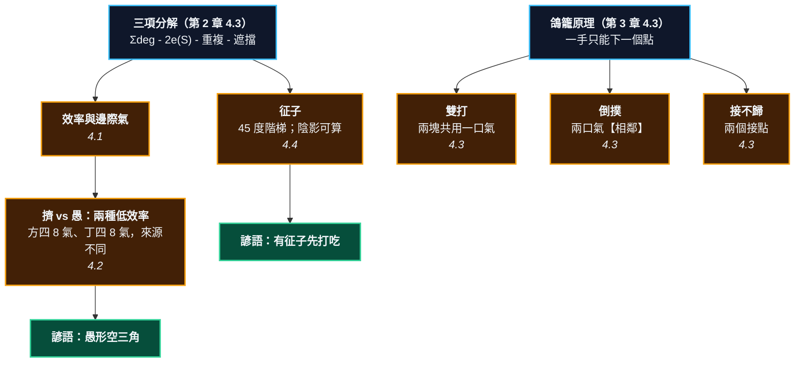

# 第 8 章：形 —— 效率的局部度量

---

## 0. 我們在哪裡

**開始之前你需要具備：**

* 第 2 章 §4.3 的**三項分解定理**（定理 2.5）。這一章有一半的內容是它的直接應用。
* 第 2 章 §4.6 的氣效率 $\eta(S) = |L(S)|/|S|$，以及「空三角是愚形」那個結論。
* 第 3 章 §4.3 的**鴿籠原理**：一手只能下一個點。這一章的另一半全部靠它。
* 第 4 章 §4.5 的 AND-OR 樹 —— 讀征子時會用到。

**讀完本章後你將能夠：**

* 說出「好形」的精確定義，並自己算出任何形狀的氣，而不是查表。
* 分辨兩種不同的低效率（**擠**與**愚**），並說出為什麼方四和丁四氣一樣多卻是兩回事。
* 寫出雙打、倒撲、接不歸的**成立條件**，而不是記三張圖。
* 說出「征子引徵」的有效範圍是怎麼算出來的，以及為什麼一顆離戰場十五路遠的子能決定勝負。

---

## 1. 開場思想實驗與掙得的頓悟

### 思想實驗：一個人，兩件急事

你同時接到兩通電話。兩件事都必須**馬上**處理，而你只有一個人。

無論你先處理哪一件，另一件都會出事。

這不是能力問題，是算術問題：**兩件事，一個你。**

現在把這件事反過來想。如果你能事先安排，讓自己**永遠不會**陷入「一個人兩件急事」的處境 —— 那要怎麼安排？

答案是：**不要讓你的人力做重複的工作。** 四個人抬一張桌子，站四個角，每個人分擔一角；如果兩個人擠在同一邊，那一邊有人在做重複的事，另一邊就空著 —— 桌子一斜，兩件急事同時發生。

### 把謎題寫成一個問題

圍棋有兩個看起來完全不相干的主題，而它們在教材裡通常分屬不同章節：

* **形**。「這是好形」「這是愚形」—— 一組看起來純粹是美學的判斷。
* **手筋**。雙打、倒撲、接不歸、征子、撲、擠、枷 —— 幾十個有名字的圖形，要一個一個背。

第一個看起來像品味，第二個看起來像魔術。

**這一章要回答的問題是：它們有沒有共同的來源？**

有，而且你已經看過兩次了。第 2 章證明了「愚形」就是**有一個空點被自己的兩顆子同時貼著**（三項分解的第三項）。第 3 章證明了「兩眼活」就是**對手一手只能填一個點**（鴿籠原理）。

這兩件事，正是上面那個思想實驗的兩面。

> [!EUREKA]
> **好形是「不做重複的工作」，手筋是「逼對手一個人做兩件事」。**
>
> **形**的部分，第 2 章的三項分解已經算完了：
> $$|L(S)| = \sum_s \deg(s) - \underbrace{2\,e(S)}_{\text{擠}} - \underbrace{\sum_v(\mathrm{mult}(v)-1)}_{\text{愚}} - b(S)$$
> 第二項是**連接的必要成本**，第三項是**純浪費**。「好形」就是把第三項壓成 0。
>
> **手筋**的部分，幾乎全部是同一句話的變奏：**一手只能下一個點。**
>
> | 手筋 | 對手被迫同時做的兩件事 |
> | :--- | :--- |
> | **雙打** | 兩塊棋共用一口氣 → 一手救不了兩塊 |
> | **接不歸** | 兩個接點 → 一手接不了兩個 |
> | **倒撲** | 兩口氣相鄰 → 提子那一手同時填掉自己的氣 |
>
> 而**征子**是唯一一個不靠鴿籠原理的手筋 —— 它靠幾何。它的路徑是一條 45 度的階梯，而它的「引徵有效範圍」是一個可以**完全算出來**的區域。本章會把那個區域畫出來，而且是用程式算的，不是用手畫的。

```text
                        第 8 章的一句話

        第 2 章的三項分解（定理 2.5）        第 3 章的鴿籠原理
                    │                              │
                    ▼                              ▼
        ┌───────────────────────┐      ┌──────────────────────────┐
        │  形：不做重複的工作     │      │  手筋：逼對手一手兩件事    │
        └───────────┬───────────┘      └────────────┬─────────────┘
                    │                                │
        ┌───────────┴────────┐        ┌──────────────┼──────────────┐
        ▼                    ▼        ▼              ▼              ▼
    第二項「擠」        第三項「愚」   雙打          接不歸          倒撲
    2·e(S)            Σ(mult-1)   共用一口氣     兩個接點      兩口氣相鄰
    連接的必要成本      純浪費        │              │              │
        │                    │        └──────────────┴──────────────┘
        ▼                    ▼                       │
      方四 8 氣          丁四 8 氣                     ▼
     （擠，不愚）        （愚）              「一手只能下一個點」

                    ─────────── 例外 ───────────
                    征子：不靠鴿籠，靠幾何。
                    路徑是 45 度階梯，陰影可以完全算出來。
```



---

## 2. 多角度直觀：形

> [!INTUITION]
> **角度一：手感／實戰透鏡**
>
> 你看到一個空三角，會覺得「不舒服」。那個不舒服是真的 —— 但它不是美感，是**你的直覺在幫你數氣**。
>
> 證據：把同樣的空三角放在一個對殺裡，你會立刻算出「差一氣」。放在做眼的地方，你反而覺得它很好。**同一個形狀，兩種感覺** —— 因為兩種場合裡，那口少掉的氣值不同的錢。
>
> 這一章要做的，是把「不舒服」換成一個數，這樣你就能在「這裡少一口氣值不值得」這個問題上做算術，而不是只能說「這裡看起來比較舒服」。

> [!INTUITION]
> **角度二：幾何／形狀透鏡**
>
> 形的幾何只有一件事重要：**斜對角**。
>
> 第 2 章 §4.1 定下的那條約定（斜對角不算相鄰）製造了兩個後果，而它們貫穿全書：
>
> * 斜對角的兩顆**自己的**子，必定共用一個空點 → **愚形**（第 2 章）。
> * 斜對角的兩顆**對方的**子，讓你的眼變假 → **假眼**（第 3 章）。
>
> 這一章加上第三個：斜對角是征子行進的方向 —— **征子就是沿著對角線走的階梯**。
>
> 同一條約定，三個後果。這是本書「同一個東西反覆出現」的最好例子。

> [!INTUITION]
> **角度三：代數／計算透鏡**
>
> 手筋可以寫成述詞（可以在盤面上檢查真假的句子）：
>
> $$\textbf{雙打}(p) \;\equiv\; \big|\{\,S \text{ 對方棋串} : p \in N(S) \text{ 且落子後 } |L(S)|=1 \,\}\big| \;\ge\; 2$$
>
> $$\textbf{倒撲}(p) \;\equiv\; |L(S_p)| = 1 \;\wedge\; \text{對方提掉 } S_p \text{ 之後我能提回更多}$$
>
> 寫成述詞的好處不是「看起來比較數學」，是**它可以被程式在整個盤面上掃一遍**。§5 會示範：給一個盤面，程式列出所有的雙打點與倒撲點。你不需要「看出來」，你可以「算出來」。

> [!BOARD REALITY]
> **角度四：棋盤現實檢查**
>
> **失效一：為了好形而好形。** $\eta$ 最高的形狀是「一顆孤子」（第 2 章 §4.6 的 BOARD REALITY 已經警告過）。追求好形追到不敢連接，是初學者讀完形狀教材之後最常見的副作用。**形是手段，不是目標。**
>
> **失效二：只認得有名字的手筋。** 你背了倒撲的圖，就只在長得像那張圖的時候想到它。但倒撲的條件是「兩口氣相鄰 + 提子那一手會填自己的氣」—— 符合這個條件的形狀有無限多種，而其中大部分不長得像課本上那張。
>
> **失效三：不算征子就打吃。** 征子成不成立，是**可以完全算清楚**的（§4.4）。算錯的代價通常是整塊棋。而算它需要的只是耐心 —— 一條斜線，數到盤邊。

---

## 3. 散落的碎片（問題本身）

**第一片：形被當成美學。** 「好形」「愚形」「厚實」「輕靈」—— 一整套形容詞，沒有一個有定義。

**第二片：形狀表。** 「立二拆三、立三拆四」「兩子頭必扳」「逢方必扳」—— 一堆要背的規則，彼此看不出關係。

**第三片：手筋被當成題庫。** 市面上的手筋書按「名字」分類：倒撲一章、接不歸一章、撲一章。讀者背了名字，遇到沒名字的就沒轍。

**第四片：征子被當成「要算清楚」。** 「這個征子成不成立？」「你要算一算。」怎麼算？「一路數下去。」數到哪裡？「數到盤邊。」那引徵呢？「在征子的路線上。」路線是哪一條？—— 這裡通常會出現一張手畫的斜線圖，而那條線的**寬度**從來沒有被說清楚。

**第五片：形與手筋被當成兩件事。** 它們在教材裡分屬不同章節，而事實上它們來自同一個地方。

### 新手典型會錯在哪裡

1. **補成愚形。** 想加強，結果多下的那顆子在做重複的工作。
2. **只看自己的形，不看對手的形。** 手筋的機會來自**對手**的形有毛病（共用的氣、兩個接點）。
3. **打吃之前不算征子。** 「先打一個看看」是圍棋裡最貴的一句話。

---

## 4. 對齊（解答）

### 4.1 效率與邊際氣

> [!RECALL]
> **三項分解定理（第 2 章 §4.3 的定理 2.5）**：
> $$|L(S)| = \sum_{s \in S}\deg(s) - 2\,e(S) - \sum_v\big(\mathrm{mult}(v)-1\big) - b(S)$$
> 四項依序是：原始配額、內部相鄰的對數、被重複貼到的空點、被外面的子遮掉的。
> 這一章不重證它，只是把它拿來用 —— 而且會用得比第 2 章更兇。

第 2 章給了一個度量：$\eta(S) = |L(S)|/|S|$。它有用，但不夠好，因為**下棋是一手一手下的**。你真正關心的不是「這塊棋平均每顆子幾口氣」，而是：

> **我多下這一顆，多了幾口氣？**

> **定義 8.1（邊際氣）** 在點 $p$ 多下一顆同色子，這塊棋的氣變化量
> $$\Delta L(p) = |L(S \cup \{p\})| - |L(S)|$$

邊際氣可以是**負的** —— 那正是「補一手反而變弱」的精確意思。而三項分解可以把它算得一點都不含糊。

> **命題 8.2（邊際氣公式）** 設 $p$ 是 $S$ 旁邊的空點，$p$ 貼著 $S$ 的 $k$ 顆子（$k \ge 1$），且附近沒有對方的子。則
> $$\boxed{\;\Delta L(p) = \deg(p) - k - 1 - \delta^{+}(p)\;}$$
> 其中 $\delta^{+}(p) \ge 0$ 是這一手**新製造**的重複氣數量（第三項的增量）。

**證明。** 把定理 2.5 的四項逐項比較。加上 $p$ 之後：

* 第一項 $\sum\deg$ 增加 $\deg(p)$；
* 第二項：內部相鄰多了 $k$ 對，所以減少 $2k$；
* 第三項：$p$ **原本就是一個 $\mathrm{mult} = k$ 的空點**（它同時貼著 $S$ 的 $k$ 顆子），所以它原本貢獻 $k-1$ 的懲罰。$p$ 變成棋子之後，那筆懲罰消失了，於是增加 $k-1$；同時 $p$ 可能讓別的空點被重複貼到，那是 $-\delta^{+}$。

$$\Delta L = \deg(p) - 2k + (k-1) - \delta^{+} = \deg(p) - k - 1 - \delta^{+} \qquad\blacksquare$$

$\delta^{+} \ge 0$ 的理由是：多放一顆子只會讓更多空點被貼到，不會讓更少。於是：

> **推論 8.3（一手棋的氣上限）** $\Delta L(p) \le \deg(p) - k - 1$。特別地，在中央（$\deg = 4$）只貼一處（$k=1$）而且不製造愚形（$\delta^{+}=0$）時，$\Delta L = 2$ —— 而這是**任何一手棋能多的氣的絕對上限**。

三個代價，每個都恰好值一口氣：**多貼一顆子 $-1$，多製造一個重複氣 $-1$，靠邊一路 $-1$**（$\deg$ 從 4 變 3）。

拿一條直三（E5、F5、G5，8 口氣）當例子，把每一種下法算出來：

| 這一手 | $\deg$ | $k$ | $\delta^{+}$ | $\Delta L$ | 這一手在做什麼 |
| :--- | ---: | ---: | ---: | ---: | :--- |
| **長** H5 | 4 | 1 | 0 | $+2$ | 乾淨地長一手，達到上限 |
| **肩** E6 | 4 | 1 | 1 | $+1$ | 和 F5 形成斜對角 → 製造一個重複氣 |
| **中間的肩** F6 | 4 | 1 | 2 | $\ \ 0$ | 兩邊都斜對角 → 兩個重複氣，白下一手 |
| **貼兩處** | 4 | 2 | 0 | $+1$ | 連接的代價：少一口 |
| **貼三處** | 4 | 3 | 0 | $\ \ 0$ | 補在自己肚子裡，一口都不賺 |
| **貼四處** | 4 | 4 | 0 | $-1$ | 填自己的眼 |

> [!RECALL]
> **第 2 章 §4.3 的推論 2.6**：愚形 $\iff$ 第三項不為零 $\iff$ 有一對斜對角的自己人，中間的點還空著。
> 命題 8.2 把它從「一個形狀的性質」變成「一手棋的價碼」：**每製造一個重複氣，這一手就少賺一口氣**。
> 「愚形」不再是形容詞，它是一個可以標在棋盤上的數字。

> [!BOARD REALITY]
> **「虎比實接多兩口氣」—— 這句話是錯的。**
>
> 這是本書寫作過程中被自己的程式打臉的地方之一。原本的草稿寫著「實接 $\Delta L = 0$，虎 $\Delta L = +2$，所以虎的氣比較多」。程式一跑，一間跳 E5／G5 的斷點：
>
> $$\textbf{實接 F5：} 7 \to 8 \;(+1) \qquad \textbf{虎 F4：} 7 \to 8 \;(+1) \qquad \textbf{虎 F6：} 7 \to 8 \;(+1)$$
>
> **三種下法的氣完全一樣。** 虎和實接的差別**根本不在氣**，而在：實接之後那是**一塊**棋（`find_string` 回傳一個棋串），虎之後仍然是**兩塊**（連接是條件性的，對手下進虎口雖然通常是送死，但那顆子可以當劫材、可以配合倒撲）。
>
> 這一段留在書裡，是因為它示範了本書的方法：**先寫下宣稱，再寫一個程式去反駁它。** 那個程式在 §5.2。

### 4.2 擠與愚：兩種低效率

<!-- diagram: ch08_four_shapes -->
```text
     A B C D E F G H J K L M N
  13 . . . . . . . . . . . . . 13
  12 . . . . . . . . X . . . . 12
  11 a X X X X . . b X X X . . 11
  10 . . . + . . . . . + . . . 10
   9 . . . . . . . . . . . . . 9
   8 . . . . . . . . . . . . . 8
   7 . . . . . . + . . . . . . 7
   6 . . . . . . . . . . . . . 6
   5 . . X . . . . . X X . . . 5
   4 c X X X . . . d X X . . . 4
   3 . . . . . . . . . . . . . 3
   2 . . . . . . . . . . . . . 2
   1 . . . . . . . . . . . . . 1
     A B C D E F G H J K L M N
```
*四種 4 子形狀，彼此隔得很遠、互不影響。a 直四、b 曲四、c 丁四、d 方四。四種都是四顆子，氣卻分別是 10、9、8、8 —— 而且 d 少的兩口和 b、c 少的來源不同。*

把三項分解逐項算出來（程式會在 §5.2 印給你看）：

| 形狀 | $\sum\deg$ | $-2e(S)$ | $-$重複 | $= |L|$ | $\eta$ | 是愚形嗎 |
| :--- | ---: | ---: | ---: | ---: | ---: | :--- |
| **a 直四** | 16 | $-6$ | $0$ | **10** | 2.50 | 否 |
| **b 曲四**（L） | 16 | $-6$ | $-1$ | **9** | 2.25 | **是** |
| **c 丁四**（T） | 16 | $-6$ | $-2$ | **8** | 2.00 | **是** |
| **d 方四** | 16 | $-8$ | $0$ | **8** | 2.00 | 否 |

丁四和方四的氣一樣多（都是 8），但**它們少掉的兩口氣來自完全不同的地方**：

* **方四**少在第二項：四顆子圍成正方形，內部有 **4** 對相鄰（直四只有 3 對）。這是**擠**。
* **丁四**少在第三項：有兩個空點被自己的兩顆子同時貼著。這是**愚**。

> **定義 8.4（兩種低效率）**
> * **擠**：第二項 $2e(S)$ 大於必要值 $2(|S|-1)$ —— 也就是形狀裡有「環」。這是**連接的成本**，付了錢有買到東西。
> * **愚**：第三項 $\sum(\mathrm{mult}-1) > 0$ —— 有空點被重複貼到。這是**純浪費**，付了錢什麼都沒買到。

> [!RECALL]
> **第 2 章 §4.3 的推論 2.6：愚形 $\iff$ 有一對斜對角相鄰的子，而它們之間的空點還空著。**
> 這一節的表可以直接用它讀：直四沒有斜對角（一直線），所以第三項是 0；
> 曲四有一對，第三項 1；丁四有兩對，第三項 2；
> 方四有兩對斜對角，但它們之間的兩個點**都被自己的子佔住了**，所以第三項是 0 —— 它擠，但不愚。

> [!PROVERB]
> **「愚形空三角」**
> **它其實在說**：第三項不為零。而更完整的說法是 —— 圍棋裡有**兩種**低效率，諺語只罵了其中一種。方四的效率和丁四一樣差（都是 $\eta = 2.00$），卻沒有人罵它愚形，因為它的損失來自第二項。
> **失效條件**：見第 2 章。做眼的時候空三角常常是正解 —— 因為那時候你要的不是氣，是「對手填不進來」。

### 4.3 手筋：三條充要條件

三個最基本的手筋，全部來自同一句話：**一手只能下一個點。**

#### 雙打

<!-- diagram: ch08_double_atari -->
```text
     A B C D E F G H J
   9 . . . . . . . . . 9
   8 . . . . . . . . . 8
   7 . . + . . . + . . 7
   6 . . . . . . . . . 6
   5 . . . . + . . . . 5
   4 . O . O . . . . . 4
   3 O X a X O . + . . 3
   2 . . . . . . . . . 2
   1 . . . . . . . . . 1
     A B C D E F G H J
```
*雙打：黑 B3 與 D3 各有兩口氣，而它們【共用】C3 這一口。白下 a，兩塊同時剩一口氣 —— 一手只能救一塊。又是鴿籠原理。*

黑 B3 的氣是 $\{$B2, C3$\}$，黑 D3 的氣是 $\{$C3, D2$\}$。兩塊棋**共用** C3。

> **命題 8.5（雙打的條件）** 點 $p$ 是雙打點，若且唯若存在兩個以上的對方棋串 $S_1, S_2$ 同時滿足：
> $$p \in L(S_i) \quad\text{且}\quad |L(S_i)| = 2 \quad\text{（對每個 } i\text{）}$$
> （更一般地：落子後有兩個以上的對方棋串只剩一口氣。）

> [!RECALL]
> **共用的氣 = 兩個氣集合的交集（第 4 章 §4.1 的定義 4.1）。**
> 第 4 章把它叫做「公氣」，那裡是黑白兩塊棋共用；這裡是**同色的兩塊棋**共用一口氣。
> 同一個集合運算，不同的場合：在對殺裡它是雙方都不敢碰的地雷，在雙打裡它是對手的致命傷。

#### 倒撲

<!-- diagram: ch08_snapback -->
```text
     A B C D E F G H J
   9 . . . . . . . . . 9
   8 . . . . . . . . . 8
   7 . . + . . . + . . 7
   6 . . . . . . . . . 6
   5 . . . . + . . . . 5
   4 . . . . . . . . . 4
   3 O O + . . . + . . 3
   2 X X O . . . . . . 2
   1 a b O . . . . . . 1
     A B C D E F G H J
```
*倒撲的本形。黑兩子只剩 a、b 兩口氣，而且【兩口氣是相鄰的】—— 這正是倒撲成立的幾何條件。白下 a 會怎樣？*

黑 $\{$A2, B2$\}$ 的氣是 $\{$A1, B1$\}$，兩口 —— 而且 **A1 與 B1 相鄰**。

<!-- diagram: ch08_snapback_2 -->
```text
     A B C D E F G H J
   9 . . . . . . . . . 9
   8 . . . . . . . . . 8
   7 . . + . . . + . . 7
   6 . . . . . . . . . 6
   5 . . . . + . . . . 5
   4 . . . . . . . . . 4
   3 O O + . . . + . . 3
   2 X X O . . . . . . 2
   1 1 b O . . . . . . 1
     A B C D E F G H J
```
*白 1 送一子。那顆白子的鄰點是 A2（黑）與 b —— 只剩一口氣，看起來是白白送死。黑當然想提它，而提的方法是下在 b。*

<!-- diagram: ch08_snapback_3 -->
```text
     A B C D E F G H J
   9 . . . . . . . . . 9
   8 . . . . . . . . . 8
   7 . . + . . . + . . 7
   6 . . . . . . . . . 6
   5 . . . . + . . . . 5
   4 . . . . . . . . . 4
   3 O O + . . . + . . 3
   2 X X O . . . . . . 2
   1 a X O . . . . . . 1
     A B C D E F G H J
```
*黑提掉白一子之後。但黑那一手下在 B1 —— 【那本來是自己的氣】。現在黑三子只剩 a 一口。白再下 a，提黑三子。送一得三。*

**關鍵在「兩口氣相鄰」。** 黑要提掉白那一子，唯一的方法是下在 B1 —— 而 B1 是黑自己的氣。提子那一手同時填掉了自己的一口氣，於是黑從兩口氣變成一口氣。

> **命題 8.6（倒撲的條件）** 我在 $p$ 落子構成倒撲，若三個條件同時成立：
> 1. 落子後我那一串只剩一口氣（自己送吃）；
> 2. 對方提掉它；
> 3. 提完之後，我有一手能提回**更多**的子。
>
> 而條件 3 成立的典型幾何是：**對方那塊棋只有兩口氣，而且那兩口氣彼此相鄰。**

**為什麼「相鄰」是關鍵？** 因為如果兩口氣不相鄰，我送的那顆子會有一口不屬於對方棋串的氣，對方就不必用自己的氣去提它。**倒撲的整個機制，就是逼對手用自己的氣來提子。**

#### 接不歸

<!-- diagram: ch08_connect -->
```text
     A B C D E F G H J
   9 . . . . . . . . . 9
   8 . . . . . . . . . 8
   7 . . + . . . + . . 7
   6 . . . . . . . . . 6
   5 . . . . + . . . . 5
   4 . . . . . . . . . 4
   3 O O O . . . + . . 3
   2 X b X O . . . . . 2
   1 X a X O . . . . . 1
     A B C D E F G H J
```
*黑左右兩塊有【兩個】接點 a 與 b。這是接不歸的結構：如果白能一手同時威脅兩個接點，黑一手只接得了一個。*

> **定義 8.7（接點）** 空點 $p$ 是棋串 $S$ 的**接點**，若 $p \in L(S)$，而且 $p$ 還貼著另一塊同色的棋串。

> **命題 8.8（接不歸的結構）** 若一塊棋有 $k \ge 2$ 個接點，而對手能用**一手**同時使它們全部失效，則這塊棋接不歸 —— 因為**一手只能接一個**。

**這和第 3 章的兩眼定理是同一個定理。**

> [!RECALL]
> **兩眼定理（第 3 章 §4.3 的定理 3.5）的證明骨架**：
> 對手要提掉一塊棋，必須填光它所有的氣；兩個眼是兩個**互不相鄰**的氣；
> 一手只能填一個，而填了第一個之後那顆子自己沒氣 —— 所以填不成。
> **那個「2」來自鴿籠原理，不來自眼的形狀。**
>
> 接不歸是同一句話換一個主詞：那裡是「**對手**一手只能填一個眼」，
> 這裡是「**我**一手只能接一個接點」。同一個論證，攻守互換。

> [!BOARD REALITY]
> **三個手筋，一個共同的搜尋方法。**
> 實戰上要找手筋，不要問「這裡有沒有倒撲」。要問三個問題：
> 1. 對手有沒有兩塊棋**共用一口氣**？（雙打）
> 2. 對手有沒有一塊棋只剩**兩口相鄰的氣**？（倒撲）
> 3. 對手有沒有兩個**接點**？（接不歸）
>
> 這三個問題可以在三秒鐘內掃完，而且它們涵蓋的情況遠比「三張圖」多。**手筋不是認圖，是查條件。**

### 4.4 征子：一條斜線，與它的陰影

征子是本章唯一不靠鴿籠原理的手筋。它靠幾何，而且它是圍棋裡少數幾個**可以完全算清楚**的東西之一。

<!-- diagram: ch08_ladder -->
```text
     A B C D E F G H J K L M N
  13 . . . . . . . . . . . . . 13
  12 . . . . . . . . . . . . . 12
  11 . . . O O . . . . . . . . 11
  10 . . O X b . . . . + . . . 10
   9 . . . a . . . . . . . . . 9
   8 . . . . . . . . . . . . . 8
   7 . . . . . . + . . . . . . 7
   6 . . . . . . . . . . . . . 6
   5 . . . . . . . . . . . . . 5
   4 . . . + . . . . . + . . . 4
   3 . . . . . . . . . . . . . 3
   2 . . . . . . . . . . . . . 2
   1 . . . . . . . . . . . . . 1
     A B C D E F G H J K L M N
```
*征子的本形。黑 D10 只有 a、b 兩口氣。白該從哪一邊叫吃？兩邊都試一遍 —— 只有一邊征得到。*

#### 征子成立的條件

> [!RECALL]
> **AND-OR 樹（第 4 章 §4.5）。** 征子就是一棵極窄的 AND-OR 樹：
> 攻方是 OR 節點（兩口氣，叫吃任一口都行，**一條成功就夠**），
> 守方是 AND 節點（長、或反提，**每一條都得擋住**）。
> 分枝因子只有 2 到 3，所以深度上百手也算得動 —— 這是圍棋裡少數幾個
> 能被完整讀完的搜尋。`go_core/ladder.py` 就是這棵樹。


黑 D10 有兩口氣：$a$（D9）與 $b$（E10）。白該從哪一邊叫吃？

**白下 $b$（E10）**：黑只剩 $a$，黑長到 D9。黑 $\{$D10, D9$\}$ 的氣是 C9、D8、E9 —— **三口氣，跑掉了。**

**白下 $a$（D9）**：黑只剩 $b$，黑長到 E10。黑 $\{$D10, E10$\}$ 的氣是 E9、F10 —— **只有兩口**，因為 E11 是白子。征子繼續。

差別就在那顆 E11。這給出征子的遞迴條件：

> **命題 8.9（征子的遞迴）** 黑被叫吃後長到 $q$。征子繼續，若且唯若 $q$ 的其他三個鄰點裡**恰好有一個**是白子。
>
> * 一個都沒有 → 黑得三口氣，跑掉。
> * 有兩個以上 → 黑長完只剩一口氣，白直接提（那不是征子，是直接死）。
>
> 而在征子的行進中，那顆白子永遠是**白兩手之前下的那一顆** —— 這就是為什麼征子走的是 45 度的階梯。

<!-- diagram: ch08_ladder_path -->
```text
     A B C D E F G H J K L M N
  13 . . . . . . . . . . . . . 13
  12 . . . . . . . . . . . . . 12
  11 . . . O O . . . . . . . . 11
  10 . . O X X O . . . + . . . 10
   9 . . . O X X O . . . . . . 9
   8 . . . . O X X O . . . . . 8
   7 . . . . . O X X O . . . . 7
   6 . . . . . . O X X O . . . 6
   5 . . . . . . . O X X O . . 5
   4 . . . + . . . . O X X O . 4
   3 . . . . . . . . . O X X O 3
   2 . . . . . . . . . . O X O 2
   1 . . . . . . . . . . O X . 1
     A B C D E F G H J K L M N
```
*征子跑完的樣子，共 35 手，一路斜到右下角。這條路徑不是畫的，是 go_core/ladder.py 讀出來的。*

三十五手，一路斜到右下角，黑被提。**征子的長度大約是到盤邊的距離的兩倍** —— 因為每走一格，雙方各下一手。

#### 陰影：引徵的有效範圍到底有多大

現在處理 §3 那個沒人講清楚的問題：**征子引徵要放在哪裡才有效？**

傳統的答案是「放在征子的路線上」，然後畫一條斜線。但那條線有多寬？線的兩側算不算？

本書的做法不是畫線，是**算**：

> **征子陰影的算法**：對盤上每一個空點，放一顆守方的子，**重跑一次征子**，看結果會不會翻轉。翻轉的那些點所成的集合，就是引徵的有效範圍。

<!-- diagram: ch08_ladder_shadow -->
```text
     A B C D E F G H J K L M N
  13 . . . . . . . . . . . . . 13
  12 . . . . . . . . . . . . . 12
  11 . . . O O o . . . . . . . 11
  10 . . O X x x o . . + . . . 10
   9 . . o x x x x o . . . . . 9
   8 . . . o x x x x o . . . . 8
   7 . . . . o x x x x o . . . 7
   6 . . . . . o x x x x o . . 6
   5 . . . . . . o x x x x o . 5
   4 . . . + . . . o x x x x o 4
   3 . . . . . . . . o x x x x 3
   2 . . . . . . . . . o x x . 2
   1 . . . . . . . . . . . . . 1
     A B C D E F G H J K L M N
```
*征子陰影，共 48 個點。做法是：盤上每一個空點都放一顆黑子試一次，重跑征子，看結果會不會翻轉。x 在征子路徑上；o 不在路徑上，卻仍然能破征子 —— 那才是真正的「引徵」。*

**48 個點。** 其中 32 個在征子路徑上（標 `x`，放子當然會破），**16 個不在路徑上**（標 `o`）—— 那 16 個才是真正意義上的「征子引徵」。

而它們的分佈很清楚：**貼著路徑外緣的一條線**。這就是那條「斜線」的精確版本 —— 它的寬度是**一格**，而且偏在特定的一側。

<!-- diagram: ch08_ladder_broken -->
```text
     A B C D E F G H J K L M N
  13 . . . . . . . . . . . . . 13
  12 . . . . . . . . . . . . . 12
  11 . . . O O . . . . . . . . 11
  10 . . O X . . . . . + . . . 10
   9 . . . . . . . . . . . . . 9
   8 . . . . . . . . . . . . . 8
   7 . . . . . . + . . . . . . 7
   6 . . . . . . . . . . . . . 6
   5 . . . . . . . . . . . . . 5
   4 . . . + . . . . . + . . # 4
   3 . . . . . . . . . . . . . 3
   2 . . . . . . . . . . . . . 2
   1 . . . . . . . . . . . . . 1
     A B C D E F G H J K L M N
```
*在陰影裡放一顆黑子（標 # 的那顆，N4），征子就不成立了。它離黑 D10 有 15 路遠，中間隔著整個棋盤 —— 但白再怎麼叫吃，黑都跑得掉。這就是「征子引徵」。*

**一顆離戰場十五路遠的子，決定了近處一塊棋的死活。** 這是圍棋裡最違反直覺的現象之一，而它完全可以被計算。

> [!PROVERB]
> **「有征子先打吃」**
> **它其實在說**：征子成立與否是**確定的**（命題 8.9 的遞迴，加上盤邊），所以打吃之前應該先算完 —— 算完了再下，不會有意外。
> **失效條件一**：算的時候必須把**整個盤面**看進去。征子陰影橫跨半個棋盤，而那條斜線上任何一顆對方的子都可能翻盤。實戰上「沒注意到那邊有一顆子」是征子出事的唯一原因。
> **失效條件二**：對手可能**故意**下在陰影裡當引徵，同時那一手還有別的作用。這時候你打吃就是在幫他 —— 他長出來的同時，那顆引徵子變成了實用的一手。

---

## 5. 應用：手算追蹤與非黑盒程式

### 5.1 用手算一遍

手算 §4.4 的征子開頭三手，確認命題 8.8。

**盤面**：黑 D10；白 D11（上）、C10（左）、E11（右上）。

**第一步：黑有幾口氣？**

D10 的四個鄰點：D11（白）、C10（白）、D9（空）、E10（空）。

$$L(\{\text{D10}\}) = \{\text{D9}, \text{E10}\}, \qquad |L| = 2$$

兩口氣 —— 可以叫吃。白該下哪一口？

**第二步：白下 E10（往右）。**

黑 D10 只剩 D9。黑長到 D9。黑 $\{$D10, D9$\}$ 的氣：

* D10 貢獻：無（四個鄰點都被佔了）
* D9 貢獻：C9、D8、E9

$$|L| = 3 \quad\Longrightarrow\quad \textbf{跑掉了。}$$

依命題 8.9：D9 的其他三個鄰點（C9、D8、E9）**一顆白子都沒有** → 三口氣 → 征子不成立。

**第三步：白下 D9（往下）。**

黑 D10 只剩 E10。黑長到 E10。E10 的其他三個鄰點：E11（**白**）、E9、F10。

$$|L| = 2 \quad\Longrightarrow\quad \textbf{征子繼續。}$$

**恰好一顆白子** —— 正是命題 8.8 要的條件。而那顆白子（E11）是白**開局就擺好**的；從第二輪開始，扮演這個角色的會是白兩手之前下的那一顆。

**第四步：讀出這個盤面在說什麼。**

兩個方向，一個成立一個不成立，差別只在 E11 那一顆子。

**征子的方向是被那顆子決定的** —— 而它決定的不只是方向，還有最後撞到哪一條邊、以及陰影落在盤面的哪一半。實戰上「征子往哪邊走」這件事，往往比「征不征得到」更重要，因為它決定了要檢查哪半個棋盤。

### 5.2 用程式驗一遍

```python
"""第 8 章 §4.2：四種 4 子形狀，用三項分解逐項算。"""
from go_core import BLACK, Board, find_string
from go_core.shape import shape_report

SHAPES = {
    "直四": [(0, 0), (0, 1), (0, 2), (0, 3)],
    "曲四": [(0, 0), (0, 1), (0, 2), (1, 0)],
    "丁四": [(0, 0), (0, 1), (0, 2), (1, 1)],
    "方四": [(0, 0), (0, 1), (1, 0), (1, 1)],
}

print(f"{'形狀':<6}{'Σdeg':>6}{'-2e':>6}{'-重複':>7}{'= 氣':>6}{'η':>7}   低效率的來源")
print("-" * 60)
results = {}
for name, shape in SHAPES.items():
    b = Board(11)
    pts = [(4 + dr, 4 + dc) for dr, dc in shape]
    for p in pts:
        b.grid[p] = BLACK
    r = shape_report(b, find_string(b, pts[0]))
    results[name] = r
    why = "愚（第三項）" if r["stupid"] else (
        "擠（第二項）" if r["internal_pairs"] > len(shape) - 1 else "—")
    print(f"{name:<6}{r['deg_sum']:>6}{-2 * r['internal_pairs']:>6}"
          f"{-r['duplicated']:>7}{r['liberties']:>6}{r['efficiency']:>7.2f}   {why}")

assert results["直四"]["liberties"] == 10
assert results["曲四"]["liberties"] == 9
assert results["丁四"]["liberties"] == 8
assert results["方四"]["liberties"] == 8
# 丁四與方四氣一樣多，但來源不同
assert results["丁四"]["duplicated"] == 2 and results["丁四"]["internal_pairs"] == 3
assert results["方四"]["duplicated"] == 0 and results["方四"]["internal_pairs"] == 4
print("\n丁四與方四都是 8 氣 —— 但丁四是【愚】（重複 2），方四是【擠】（內部 4 對）。")
```

**輸出裡該看什麼。** 最後兩行的斷言。同樣 8 口氣，一個第三項是 2、第二項是 3；另一個第三項是 0、第二項是 4。**兩種完全不同的低效率，被同一個數字掩蓋了** —— 這正是為什麼要看分解，而不是只看總數。

接下來這一段是命題 8.2 的驗算，以及**推翻我自己在草稿裡寫過的一句話**：

```python
"""第 8 章 §4.1：邊際氣公式，以及一個被程式推翻的宣稱。"""
from go_core import BLACK, Board, find_string, liberties
from go_core.shape import marginal_decomposition

# --- 一條直三，每一種下法的邊際氣 ---
b = Board(11)
b.place_many(BLACK, ["E5", "F5", "G5"])
S = find_string(b, "E5")
print(f"直三 E5-F5-G5，現在 {len(liberties(b, S))} 氣")
print(f"  {'這一手':<8}{'deg':>5}{'k':>4}{'delta+':>8}{'dL':>6}")
for mv in ["H5", "E6", "F6", "F4", "D5"]:
    m = marginal_decomposition(b, S, mv)
    assert m["delta"] == m["predicted"], (mv, m)        # 命題 8.2
    assert m["delta"] <= m["deg"] - m["contacts"] - 1   # 推論 8.3
    print(f"  {mv:<8}{m['deg']:>5}{m['contacts']:>4}"
          f"{m['new_duplicated']:>8}{m['delta']:>+6d}")

assert marginal_decomposition(b, S, "H5")["delta"] == 2   # 乾淨地長：達到上限
assert marginal_decomposition(b, S, "F6")["delta"] == 0   # 兩個重複氣，白下一手
assert marginal_decomposition(b, S, "E6")["delta"] == 1   # 一個重複氣

# --- 草稿裡寫過：「虎比實接多兩口氣」。真的嗎？ ---
def union_liberties(board, stones):
    seen, total = set(), set()
    for c in stones:
        pt = board._pt(c)
        if pt in seen:
            continue
        T = find_string(board, pt)
        seen |= T
        total |= liberties(board, T)
    return total

jump = Board(11)
jump.place_many(BLACK, ["E5", "G5"])          # 一間跳，斷點在 F5
base = len(union_liberties(jump, ["E5", "G5"]))
print()
print(f"一間跳 E5/G5：兩塊棋的氣（聯集）= {base}")
results = {}
for name, mv in [("實接 F5", "F5"), ("虎 F4", "F4"), ("虎 F6", "F6")]:
    t = jump.copy()
    t.place(BLACK, mv)
    after = len(union_liberties(t, ["E5", "G5", mv]))
    one_string = find_string(t, "E5") == find_string(t, "G5")
    results[name] = (after, one_string)
    print(f"  {name}: {base} -> {after}  (dL = {after - base:+d})   "
          f"真的連成一塊了嗎 = {one_string}")

assert results["實接 F5"][0] == results["虎 F4"][0] == results["虎 F6"][0] == 8
assert results["實接 F5"][1] is True
assert results["虎 F4"][1] is False and results["虎 F6"][1] is False
print("  三種下法的氣【完全一樣】。草稿裡那句「虎多兩口氣」是錯的 —— "
      "差別在連接是不是真的，不在氣。")
```

**輸出裡該看什麼。** 兩件事。

第一，上面那張表把「愚形」變成了價目表：長 H5 是 $+2$，肩 E6 是 $+1$，中間的肩 F6 是 $0$。三手棋都只貼著直三一顆子，差別**只有製造了幾個重複氣**。

第二，下面那三行推翻了草稿裡的一句話。我原本寫著「虎比實接多兩口氣，所以氣緊的時候該虎」。程式說：**8、8、8。** 完全一樣。真正的差別是最後一欄 —— 實接之後 `find_string(t, "E5") == find_string(t, "G5")`，那是**一塊**棋；虎之後不是。

> **配套範例腳本**：`examples/ch08_shape/ex01_shape_census.py`

### 5.3 手筋：讓程式掃一遍

```python
"""第 8 章 §4.3：手筋是述詞，可以在整個盤面上掃。"""
from go_core import BLACK, WHITE, Board, format_coord, find_string, liberties
from go_core.shape import connection_points, double_atari_points, snapback_points

show = lambda s: sorted(format_coord(p, 9) for p in s)

# --- 雙打 ---
b = Board(9)
b.place_many(BLACK, ["B3", "D3"]).place_many(WHITE, ["A3", "B4", "E3", "D4"])
print("黑 B3 的氣：", show(liberties(b, find_string(b, "B3"))))
print("黑 D3 的氣：", show(liberties(b, find_string(b, "D3"))))
da = [(format_coord(p, 9), k) for p, k in double_atari_points(b, WHITE)]
print("白的雙打點：", da)
assert da == [("C3", 2)]

# --- 倒撲 ---
b2 = Board(9)
b2.place_many(BLACK, ["A2", "B2"]).place_many(WHITE, ["A3", "B3", "C2", "C1"])
libs = liberties(b2, find_string(b2, "A2"))
print("\n黑兩子的氣：", show(libs), "（兩口，而且相鄰）")
sb = [(format_coord(p, 9), sac, got) for p, sac, got in snapback_points(b2, WHITE)]
print("白的倒撲點（落點, 送幾子, 提回幾子）：", sb)
assert sb == [("A1", 1, 3)]

t = b2.copy()
t.play(WHITE, "A1")
print("  白下 A1 後，那顆白子的氣：", show(liberties(t, find_string(t, "A1"))))
taken = t.play(BLACK, "B1")
print("  黑下 B1 提掉：", show(taken))
print("  但黑三子現在的氣：", show(liberties(t, find_string(t, "B2"))))
back = t.play(WHITE, "A1")
print("  白再下 A1，提掉：", show(back))
assert len(back) == 3

# --- 接不歸的結構 ---
b3 = Board(9)
b3.place_many(BLACK, ["A1", "A2", "C1", "C2"])
b3.place_many(WHITE, ["A3", "B3", "C3", "D1", "D2"])
cp = [(format_coord(p, 9), k) for p, k in connection_points(b3, find_string(b3, "A1"))]
print("\n黑左塊的接點：", cp, "—— 兩個接點，一手只接得了一個。")
assert len(cp) == 2
```

**輸出裡該看什麼。** 倒撲那一段的四行：白送一子、黑提、黑的氣從 2 變 1、白提三子。**黑提子那一手是自己把氣填掉的** —— 這一行是整個倒撲的機制，而它在程式輸出裡看得清清楚楚。

> **配套範例腳本**：`examples/ch08_shape/ex02_ladder.py`

---

## 6. 練習與完整解答

### 基礎練習

#### 練習 8.1

<!-- diagram: ch08_ex1 -->
```text
     A B C D E F G H J
   9 . . . . . . . . . 9
   8 . . . . . . . . . 8
   7 . . + . . . + . . 7
   6 . . . . . . . . . 6
   5 . . X X + . . . . 5
   4 . . X a . . . . . 4
   3 . . + . . . + . . 3
   2 . . . . . . . . . 2
   1 . . . . . . . . . 1
     A B C D E F G H J
```
*練習 8.1：黑三子是空三角。用第 2 章的三項分解算出它有幾口氣，然後回答：如果黑再下 a 補成方四，氣會變多還是變少？*


<details>
<summary><b>解答</b></summary>

**空三角的氣。** 黑子在 C4、C5、D5。三顆都在中央，$\sum\deg = 12$；內部相鄰 2 對（C4–C5、C5–D5），扣 4。

第三項：斜對角的一對是 **C4 與 D5**。它們共用的兩個點是 C5（已是黑子）與 **D4（空）** —— 所以 D4 被兩顆黑子同時貼著，$\mathrm{mult}(\text{D4}) = 2$，第三項為 1。

$$|L| = 12 - 4 - 1 = \mathbf{7}$$

（推論 2.6 也直接給答案：有一對斜對角、中間空著 → **這是愚形**。）

**補成方四之後。** 黑下 $a$（D4）。用命題 8.2 直接算，不必重數：

* $\deg(\text{D4}) = 4$（中央）
* $k = 2$ —— D4 貼著 C4 與 D5 兩顆黑子
* $\delta^{+} = 0$ —— D4 帶進來的新空點是 D3 與 E4，兩者都沒有被別的黑子貼到

$$\Delta L = 4 - 2 - 1 - 0 = \mathbf{+1} \qquad\Longrightarrow\qquad 7 \to \mathbf{8}$$

**氣多了一口。** 用整體重算核對：方四 $16 - 2\times 4 - 0 = 8$ ✓

**這一題的重點。** 補在自己的重複氣上，$k = 2$ 看起來很虧（連接的代價 $-1$），但**同時消掉了原本那個重複氣** —— 而那筆帳已經算在「$p$ 原本的 $\mathrm{mult} = k$ 懲罰消失」這一項裡了。這正是命題 8.2 比天真的「貼幾處扣幾口」好用的地方：**它把兩件事一次算完。**

另一個讀法：空三角 7 氣、方四 8 氣，但方四用了四顆子。$\eta$ 從 $7/3 = 2.33$ 掉到 $8/4 = 2.00$ —— **氣變多了，效率反而變差。** 這兩個度量在這裡指向相反的方向，而正確的那一個要看你在下什麼棋：對殺時看氣，圍地時看效率。

```python
from go_core import BLACK, Board, find_string
from go_core.shape import marginal_decomposition, shape_report

def build(stones):
    b = Board(9)
    b.place_many(BLACK, stones)
    return b, find_string(b, stones[0])

bb, bent = build(["C4", "C5", "D5"])
sb, square = build(["C4", "C5", "D5", "D4"])
for name, board, S in [("空三角", bb, bent), ("方四", sb, square)]:
    r = shape_report(board, S)
    print(f"  {name}: {r['deg_sum']} - {2*r['internal_pairs']} - {r['duplicated']}"
          f" = {r['liberties']} 氣   eta={r['efficiency']:.2f}   "
          f"{'愚形' if r['stupid'] else '不愚'}")

m = marginal_decomposition(bb, bent, "D4")
print(f"  補 D4：deg={m['deg']} k={m['contacts']} delta+={m['new_duplicated']}"
      f"  ->  dL = {m['deg']} - {m['contacts']} - 1 - {m['new_duplicated']}"
      f" = {m['delta']:+d}")
assert shape_report(bb, bent)["liberties"] == 7
assert shape_report(sb, square)["liberties"] == 8
assert (m["contacts"], m["new_duplicated"], m["delta"]) == (2, 0, 1)
assert m["delta"] == m["predicted"]        # 命題 8.2
print("  氣 7 -> 8（+1），但效率 2.33 -> 2.00。兩個度量指向相反的方向。")
```
</details>

#### 練習 8.2

<!-- diagram: ch08_ex2 -->
```text
     A B C D E F G H J
   9 . . . . . . . . . 9
   8 . . . . . . . . . 8
   7 . . + . . . + . . 7
   6 . . . . . . . . . 6
   5 . . . . + . . . . 5
   4 . . O . O . . . . 4
   3 . O X . X O + . . 3
   2 . . . . . . . . . 2
   1 . . . . . . . . . 1
     A B C D E F G H J
```
*練習 8.2：白有沒有雙打？如果有，在哪裡？如果沒有，白要先下哪一手才能製造出雙打？*

<details>
<summary><b>解答</b></summary>

**先數氣。**

* 黑 C3：鄰點 B3（白）、C4（白）、C2（空）、D3（空）→ 氣 $\{$C2, D3$\}$，兩口。
* 黑 E3：鄰點 D3（空）、F3（白）、E4（白）、E2（空）→ 氣 $\{$D3, E2$\}$，兩口。

**共用的氣**：$\{$C2, D3$\} \cap \{$D3, E2$\} = \{$D3$\}$。

依命題 8.5，兩塊棋各兩口氣、共用 D3 → **白下 D3 就是雙打**。

下完之後：黑 C3 只剩 C2，黑 E3 只剩 E2。黑一手只救得了一塊。

**這一題和 §4.3 那張圖是同一個結構**，只是兩顆黑子隔得遠了一格。認圖認不出來（形狀不一樣），查條件就查得出來（「兩塊各兩口氣，共用一口」）。

**這正是「手筋不是認圖，是查條件」的意思。**

```python
from go_core import BLACK, WHITE, Board, format_coord, find_string, liberties
from go_core.shape import double_atari_points

b = Board(9)
b.place_many(BLACK, ["C3", "E3"]).place_many(WHITE, ["B3", "C4", "F3", "E4"])
show = lambda s: sorted(format_coord(p, 9) for p in s)
lc = liberties(b, find_string(b, "C3"))
le = liberties(b, find_string(b, "E3"))
print("  黑 C3 的氣：", show(lc))
print("  黑 E3 的氣：", show(le))
print("  共用：", show(lc & le))
da = [(format_coord(p, 9), k) for p, k in double_atari_points(b, WHITE)]
print("  白的雙打點：", da)
assert show(lc & le) == ["D3"]
assert da == [("D3", 2)]
```
</details>

### 實戰練習

#### 練習 8.3

<!-- diagram: ch08_ex3 -->
```text
     A B C D E F G H J K L M N
  13 . . . . . . . . . . . . . 13
  12 . . . . . . . . . . . . . 12
  11 . . . O O . . . . . . c . 11
  10 . . O X . . . . . + . . . 10
   9 . . . . . . . . . . . . . 9
   8 . . . . . . . . . . . . . 8
   7 . . . . . . a . . b . . . 7
   6 . . . . . . . . . . . . . 6
   5 . . . . . . . . . . . . . 5
   4 . . . + . . . . . + . . . 4
   3 . . . . . . . . . . . . . 3
   2 . . . . . . . . . . . . . 2
   1 . . . . . . . . . . . . . 1
     A B C D E F G H J K L M N
```
*練習 8.3：a、b、c 三個點，黑在哪些點放一顆子可以破掉這個征子？先用眼睛判斷（它們離那條斜線多遠），再用程式核對。*


<details>
<summary><b>解答</b></summary>

對照 §4.4 的陰影圖：

| 點 | 在陰影裡嗎 | 類型 |
| :--- | :--- | :--- |
| $a$ = G7 | **是** | 在征子路徑上（`x`） |
| $b$ = K7 | **是** | 不在路徑上，但仍破征子（`o`）—— **真正的引徵** |
| $c$ = M11 | 否 | 離斜線太遠 |

$a$ 和 $b$ 都能破征子，$c$ 不能。

**兩者的差別值得注意。** $a$ 在征子的必經之路上 —— 黑在那裡先放一顆子，等於在路上設了路障，白根本走不過去。$b$ 不在路上，但它在**路的旁邊**：當征子走到那一帶時，黑那顆子讓黑多出一口氣（或者讓白的叫吃子被反提），征子就斷了。

$b$ 才是實戰上真正意義的「征子引徵」—— 因為它可以是一手**本來就有用**的棋（例如一個拆邊、一個逼），順便破了征子。而 $a$ 在路徑上，通常沒有別的作用。

**實戰上的檢查方法**：算征子的時候，不要只看那條斜線，要看**斜線加上它旁邊那一格**。陰影的寬度是兩格（路徑一格 + 外緣一格），不是一格。

```python
from go_core import BLACK, WHITE, Board, format_coord
from go_core.ladder import ladder_capture, ladder_shadow

N = 13
def setup(extra=None):
    b = Board(N)
    b.place(BLACK, "D10")
    b.place_many(WHITE, ["D11", "C10", "E11"])
    if extra:
        b.place(BLACK, extra)
    return b

ok, path = ladder_capture(setup(), "D10", WHITE, max_depth=200)
print(f"  沒有引徵：白征子成功 = {ok}（{len(path)} 手）")
assert ok

shadow = ladder_shadow(setup(), "D10", WHITE, max_depth=200)
on_path = {p for _, p in path}
for label, pt in [("a", "G7"), ("b", "K7"), ("c", "M11")]:
    p = setup()._pt(pt)
    in_shadow = p in shadow
    kind = ("在征子路徑上" if p in on_path else "不在路徑上（真正的引徵）") \
        if in_shadow else "不在陰影裡"
    broke = not ladder_capture(setup(pt), "D10", WHITE, max_depth=200)[0]
    print(f"  {label} = {pt:<4} 在陰影裡 = {in_shadow}   實際破得掉征子 = {broke}   {kind}")
    assert in_shadow == broke

assert setup()._pt("G7") in shadow and setup()._pt("G7") in on_path
assert setup()._pt("K7") in shadow and setup()._pt("K7") not in on_path
assert setup()._pt("M11") not in shadow
```
</details>

#### 練習 8.4

推論 8.3 說：任何一手棋最多只能多**兩口**氣。

(a) 說明為什麼 $\delta^{+} \ge 0$ 恆成立。
(b) 邊上（$\deg = 3$）與角上（$\deg = 2$）的上限各是多少？
(c) 寫一個程式，在 13 路盤上隨機生成幾千個形狀，找出實際能達到的最大 $\Delta L$，看看上界緊不緊。

<details>
<summary><b>解答</b></summary>

**(a) 為什麼 $\delta^{+} \ge 0$。**

$\delta^{+}$ 定義成「$p$ 這一手新製造的重複氣」。回到第三項的定義：$\sum_v(\mathrm{mult}(v)-1)$，其中 $\mathrm{mult}(v)$ 是「有幾顆 $S$ 的子貼著空點 $v$」。

多放一顆子，任何一個空點的 $\mathrm{mult}$ **只可能不變或變大**（多一顆子只會多貼、不會少貼）。唯一會**減少**的情況是某個空點本身被佔掉了 —— 而那個點就是 $p$，它的 $(k-1)$ 已經被單獨拿出來算成公式裡的 $+(k-1)$ 那一項了。

所以扣掉 $p$ 自己之後，第三項只增不減，即 $\delta^{+} \ge 0$。$\blacksquare$

**(b) 邊與角的上限。**

$$\Delta L \le \deg(p) - k - 1, \qquad k \ge 1$$

| 位置 | $\deg$ | 上限（$k=1,\ \delta^{+}=0$） |
| :--- | ---: | ---: |
| 中央 | 4 | $+2$ |
| 邊 | 3 | $+1$ |
| 角 | 2 | $\ \ 0$ |

**在角上長一手，一口氣都不會多。** 這是「金角銀邊草肚皮」那句諺語的反面 —— 角上圍地便宜，但角上的棋**長不出氣來**。同一個幾何事實（$\deg$ 小），在圍地時是優點，在對殺時是致命傷。

**(c) 上界緊不緊。**

程式跑 2,000 個隨機形狀、對每個形狀的每一個相鄰空點都試一次（共 **14,725 手**）：實際出現的最大 $\Delta L$ **恰好是 2**，而且 $\delta^{+} = 0$（上界達到）的情況佔了四成。上界是緊的，而且一點都不罕見 —— 「乾淨地長一手」正是實戰上最常見的一手棋。

```python
import random
from go_core import BLACK, EMPTY, Board, find_string, neighbors
from go_core.shape import marginal_decomposition

random.seed(8)

def random_shape(n, size):
    b = Board(n)
    start = (random.randrange(n), random.randrange(n))
    b.grid[start] = BLACK
    pts = [start]
    while len(pts) < size:
        cand = [q for q in neighbors(random.choice(pts), n) if b.grid[q] == EMPTY]
        if not cand:
            continue
        q = random.choice(cand)
        b.grid[q] = BLACK
        pts.append(q)
    return b, find_string(b, start)

best = -99
tight = checked = 0
by_deg = {2: -99, 3: -99, 4: -99}
for _ in range(2000):
    n = 13
    b, S = random_shape(n, random.randint(1, 8))
    for p in b.points():
        if b.grid[p] != EMPTY or not any(q in S for q in neighbors(p, n)):
            continue
        m = marginal_decomposition(b, S, p)
        assert m["delta"] == m["predicted"], (sorted(S), p, m)   # 命題 8.2
        assert m["new_duplicated"] >= 0, m                        # (a)
        assert m["delta"] <= m["deg"] - m["contacts"] - 1         # 推論 8.3
        checked += 1
        best = max(best, m["delta"])
        by_deg[m["deg"]] = max(by_deg[m["deg"]], m["delta"])
        tight += (m["new_duplicated"] == 0)

print(f"  檢查 {checked} 手，命題 8.2 全中，delta+ 從未為負")
print(f"  實際出現的最大 dL = {best}（理論上界 2）")
print(f"  上界達到（delta+ = 0）的比例 = {tight / checked:.0%}")
print(f"  分位置的最大 dL：角 {by_deg[2]}、邊 {by_deg[3]}、中央 {by_deg[4]}")
assert best == 2
assert by_deg[4] == 2 and by_deg[3] == 1 and by_deg[2] == 0
```

**這一題真正的收穫**：上界 $\deg(p) - k - 1$ 把三件實戰上完全不同的事，寫成了同一個減法 —— **靠邊（$\deg$ 小）、貼自己（$k$ 大）、做愚形（$\delta^{+}$ 大），三種浪費，每一種都恰好值一口氣。**

</details>

---

## 7. 本章頓悟總結

* **好形是「不做重複的工作」。** 第 2 章的三項分解已經給了定義：第三項不為零就是愚形。
* **有兩種低效率，諺語只罵了一種。** 第二項（**擠**）是連接的必要成本；第三項（**愚**）是純浪費。方四和丁四都是 8 氣，但一個擠、一個愚。
* **邊際氣有精確公式（命題 8.2）**：$\Delta L(p) = \deg(p) - k - 1 - \delta^{+}$。三種浪費，每一種恰好值一口氣 —— **靠邊**（$\deg$ 小）、**貼自己**（$k$ 大）、**做愚形**（$\delta^{+}$ 大）。
* **任何一手棋最多只能多兩口氣**（推論 8.3），而且要在中央、只貼一處、不製造愚形。邊上上限 $+1$，角上上限 $\mathbf{0}$ —— 角上的棋長不出氣來。
* **「虎比實接多兩口氣」是錯的。** 一間跳的斷點：實接 8 氣、虎 8 氣、另一邊虎也 8 氣。差別在連接是不是真的，不在氣。這句話在草稿裡活到被 §5.2 的程式打死為止。
* **手筋不是認圖，是查條件**，而三個最基本的都來自同一句話 —— 一手只能下一個點：
  * **雙打**：兩塊棋共用一口氣。
  * **倒撲**：兩口氣**相鄰**（所以提子那一手會填掉自己的氣）。
  * **接不歸**：兩個接點。
* **這三個條件可以在三秒鐘內掃完全盤**，而且涵蓋的情況遠比課本上那幾張圖多。
* **征子是唯一靠幾何的手筋**：命題 8.9 的遞迴（長出去那一點，其他三個鄰點恰好有一顆對方的子）決定它走 45 度階梯。
* **征子陰影可以完全算出來** —— 對每一點放子重跑一次即可。本章的例子：48 個點，其中 16 個不在路徑上（那才是真正的引徵）。而一顆離戰場 **15 路**遠的子，就能決定近處一塊棋的死活。
* **斜對角這條約定，第三次出現了**：它造成愚形（第 2 章）、造成假眼（第 3 章）、決定征子的方向（本章）。

**接下來。** 到目前為止，本書處理的每一件事都有定理：氣、死活、對殺、劫、賽局值、溫度、形。第 9 章要進入一個完全不同的地帶 —— **厚薄**。

那是圍棋詞典裡最含糊的一個詞，而本書會誠實地說：**這一層沒有定理。** 它有一個可計算、有用、能畫出漂亮圖的模型，但那是模型，不是證明。而把模型當成定理，正是坊間「勢力理論」書籍最大的問題。
