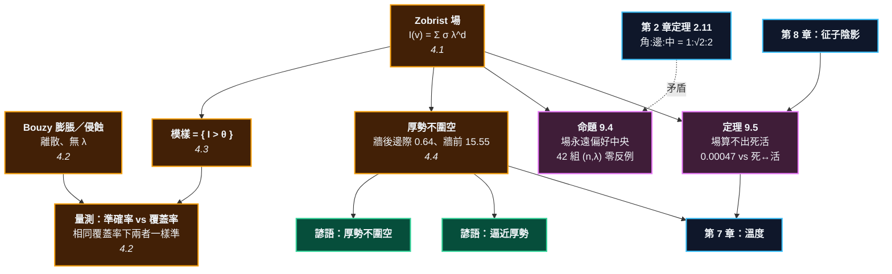

# 第 9 章：影響力場 —— 厚薄的可計算模型

> [!WARNING]
> **這一章和前面七章的地位不同。**
>
> 第 2 到第 8 章的每一個結論都有證明：三項分解、兩眼定理、Benson、對殺公式、
> 劫的終止性、賽局值的可加性、溫度、邊際氣上限 —— 全部是定理。
>
> **這一章的主角不是。** 影響力場是**啟發式**：可以計算、常常有用、
> 畫出來很漂亮，但它不保證任何事。本章會誠實地量它到底有多準，
> 並且**證明它算不出什麼**。
>
> 那兩個負面結果（命題 9.4、定理 9.5）是本章唯二的定理，
> 而它們講的都是這一層的**極限**。

---

## 0. 我們在哪裡

**開始之前你需要具備：**

* 第 2 章 §4.5 的**等周結果**（定理 2.11）：角 : 邊 : 中 $= 1 : \sqrt{2} : 2$。本章會拿它來打臉影響力場。
* 第 3 章 §4.4 的 **Benson 無條件活**（定理 3.10）—— 死活是可以被證明的。
* 第 7 章 §4.2 的**溫度** $t(G)$。「厚勢的價值記在哪一層」這個問題的答案在那裡。
* 第 8 章 §4.4 的**征子與征子陰影**。本章的定理 9.5 直接拿它當見證。

**讀完本章後你將能夠：**

* 用一行公式算出盤上任何一點的「影響力」，並解釋每一個符號。
* 說出兩個經典模型（Zobrist 與 Bouzy）的差別，以及一件出乎意料的事：**在相同覆蓋率下它們一樣準**。
* 把「厚勢不圍空」變成一個可以量的數，並說出厚勢的價值實際上記在哪一層。
* **證明**影響力場算不出死活 —— 不是「目前算不出」，是原理上算不出。

---

## 1. 開場思想實驗與掙得的頓悟

### 思想實驗：兩盞燈

一個黑暗的房間裡有兩盞燈，一盞在左下角，一盞在右上角。

站在房間任何一點，你都可以問：**這裡比較靠近哪一盞燈？**

答案很簡單：亮度隨距離衰減，兩盞燈的光疊加，中間會有一條「一樣亮」的線。線的這一邊屬於第一盞燈，那一邊屬於第二盞。

<!-- diagram: ch09_two_lamps -->
```text
     A B C D E F G H J
   9 . . . . . . . . . 9
   8 . . . . . . . . . 8
   7 . . + . . . O . . 7
   6 . . . . . . . . . 6
   5 . . . . a . . . . 5
   4 . . . b . . . . . 4
   3 . . X . . . + . . 3
   2 . . . . . . . . . 2
   1 . . . . . . . . . 1
     A B C D E F G H J
```
*兩盞燈。黑 C3 與白 G7 各照亮自己周圍。a 是正中間、b 靠黑近一點 —— 這兩點的「亮度」差多少？整章就是在把這個問題變成一個算式。*

現在把「亮度」換成「這裡是誰的地盤」，你就得到了勢力圖。這個類比好用到讓人幾乎立刻相信它。

**而這一章要做的，一半是把它算清楚，另一半是說清楚它在哪裡會騙你。**

### 把謎題寫成一個問題

「厚」是整本圍棋詞典裡最含糊的字。

厚勢、薄味、厚實、輕靈、模樣、外勢——一整套詞彙，沒有一個有定義。而更糟的是，它們彼此還會打架：

* 「厚勢」據說很值錢。那它值幾目？
* 如果它是「未來的地」，為什麼又說**「厚勢不圍空」**？
* 如果它不圍空，那它到底換到了什麼？

**這一章要回答的是：厚薄能不能被算出來？如果能，算出來的那個數字是什麼意思？**

> [!EUREKA]
> **影響力場只有一個真正的旋鈕：你願意在多少地方閉嘴。**
>
> 把每顆子當成一盞燈、亮度隨距離指數衰減、正負相加，你就得到一個場：
> $$I(v) = \sum_{s} \sigma(s)\,\lambda^{\,d(s,v)}, \qquad \sigma = \pm 1,\ \ \lambda \in (0,1)$$
> 這個場**可以量**，而本章量了。三件事出乎意料：
>
> **一、複雜的模型沒有比較好。** Bouzy 的膨脹／侵蝕演算法比上面那一行複雜得多，
> 但在**相同覆蓋率**下，兩者一樣準（94.0% vs 93.3%）。唯一真正決定一切的，
> 是門檻 $\theta$ —— 也就是**你願意在多少地方說「不知道」**。
> 全盤都給答案時只有 77.4% 準；只在 5.7% 的點上開口時，準確率 99.1%。
>
> **二、場永遠偏好中央。** 這不是調參數的問題，是可以證明的（命題 9.4）：
> 對任何 $\lambda$、任何盤面大小，一顆子的場總和在天元最大，往中央移動時單調遞增。
> 19 路盤上天元是角落的 **2.6 倍**。而第 2 章證明過，**角落是最省的地方**。
> **場說不出金角銀邊** —— 它量的根本不是圍地的成本。
>
> **三、場算不出死活，而且是原理上算不出。** 第 8 章那個征子：
> 在 15 路外放一顆子，場在該處只改變 $\lambda^{15} = 0.00047$，
> 而那塊棋從**死**變成**活**。場對遠處的擾動是連續的，死活不是（定理 9.5）。
>
> 所以「厚勢」不是未來的地。**厚勢的價值不記在目數上，記在溫度上** ——
> 它讓對手在附近的每一個選項都變便宜。那是第 3 層的帳，不是第 4 層的。

```text
                        第 9 章的地位

    第 1-3 層（第 2-8 章）                  第 4 層（本章）
    ─────────────────────                  ──────────────
    連通性・不變量・溫度                      影響力場
    每個結論都有證明                          沒有一個結論有證明
         │                                        │
         │                                        ▼
         │                            I(v) = Σ σ(s) λ^d(s,v)
         │                                        │
         │                            ┌───────────┴───────────┐
         │                            ▼                       ▼
         │                      可以量的                  可以證的
         │                   準確率 vs 覆蓋率            命題 9.4 偏好中央
         │                   77.4% ... 99.1%           定理 9.5 算不出死活
         │                            │                       │
         └────────────────────────────┴───────────────────────┘
                                      │
                                      ▼
                        厚勢的價值記在第 3 層（溫度），
                        不記在第 4 層（目數）。
```



---

## 2. 多角度直觀：場

> [!INTUITION]
> **角度一：手感／實戰透鏡**
>
> 你看一盤棋，會覺得「這邊黑比較厚」。那個感覺是真的，而且它**大致**對得上影響力圖 —— 這正是問題所在。
>
> 一個和你的直覺高度吻合的模型，會讓你停止懷疑它。而這一章要示範的是：
> **它吻合你的直覺，恰恰是因為它和你的直覺犯同一種錯。** 人和場都會被「看起來很大的一片」騙；
> 人和場都算不出十五路外那顆子。差別在於：場可以被量，你的感覺不行。

> [!INTUITION]
> **角度二：幾何／形狀透鏡**
>
> 把場畫出來，它就是一張等高線圖。兩個東西值得看：
>
> * **零線**：$I(v) = 0$ 的那條線，是雙方的「邊界」。上面那張兩盞燈的圖裡，
>   它是一條漂亮的對角線。
> * **梯度**：$I$ 變化最快的地方。梯度大 = 邊界清楚 = 已經定型；
>   梯度小 = 一大片模糊 = 還有得下。
>
> 這兩個量都很好算，而且都很有用。**問題不在它們沒有意義，在它們的意義比看起來窄。**

> [!INTUITION]
> **角度三：代數／計算透鏡**
>
> $I(v) = \sum_s \sigma(s)\lambda^{d(s,v)}$ 有三個關鍵性質，而三個都有後果：
>
> | 性質 | 式子 | 後果 |
> | :--- | :--- | :--- |
> | **線性** | $I_{A \cup B} = I_A + I_B$ | 可以一顆一顆加。也表示它**看不見形狀** —— 兩顆子連著或分開，只要位置一樣，場就一樣 |
> | **衰減** | $\lambda^d \to 0$ | 遠處的影響趨近 0。也表示它**看不見征子** |
> | **平滑** | 對擾動連續 | 好算、好畫。也表示它**看不見死活**（死活是離散的） |
>
> 三個優點和三個致命傷，是同三件事。這不是實作沒做好，是這個形式本身的邊界。

> [!BOARD REALITY]
> **角度四：棋盤現實檢查**
>
> **失效一：把模樣面積當成目數。** 這是最常見、也最貴的錯。$\{I > \theta\}$ 的面積是一個**上界的上界**，
> 不是地。本章 §4.3 會量給你看：門檻拉到讓準確率 99% 時，剩下的面積只有全盤的 5.7%。
>
> **失效二：相信場的「建議」。** 場能告訴你哪裡亮，不能告訴你下哪裡好。
> 這兩件事之間隔著死活、隔著先後手、隔著溫度 —— 也就是隔著本書的第 2 層和第 3 層。
>
> **失效三：忘記它是啟發式。** 本書把這一層標成 🟡 不是謙虛，是分類。
> 拿 🟡 的東西去推翻 🟢 的東西（「可是我的勢力圖說這塊很厚」對上「Benson 說它死了」），
> 永遠是 🟢 贏。

---

## 3. 散落的碎片（問題本身）

**第一片：厚薄沒有定義。** 「厚」「薄」「重」「輕」——四個字，四種感覺，零個定義。

**第二片：諺語彼此矛盾。** 「厚勢不圍空」說厚勢不是地；「厚勢作戰」說它有用。兩句都對，但沒人說它們怎麼相容。

**第三片：勢力圖被當成答案。** 市面上的勢力理論書會畫出漂亮的等高線圖，然後說「所以黑優」。圖是真的，推論不是。

**第四片：沒有人量過。** 這是最奇怪的一片。影響力函數是**可以驗證的** —— 拿它預測「這一點最後屬於誰」，再把棋下完看看對不對，就這麼簡單。但坊間的書從來不做這件事。

**第五片：AI 出現之後的尷尬。** AlphaGo 之後大家都知道「勢力」是真的重要。但 AI 用的不是這種場，而**為什麼不是**，很少有人講清楚。

### 新手典型會錯在哪裡

1. **在自己的厚勢裡下棋。** 覺得那裡是「自己的地盤」，要「守住」。§4.4 會算給你看那一手值多少。
2. **看到大模樣就想全部圍成地。** 模樣的面積和地的面積，中間差著一個門檻。
3. **用「厚薄」解釋所有事情。** 包括那些其實是死活問題的事情。

---

## 4. 對齊（解答）

### 4.1 Zobrist 場：一行公式

> **定義 9.1（Zobrist 影響力場）** 給定盤面與衰減係數 $\lambda \in (0,1)$，
> $$I(v) = \sum_{s\ \text{是盤上的子}} \sigma(s)\,\lambda^{\,d(s,v)}, \qquad
> \sigma(s) = \begin{cases} +1 & s\ \text{是黑} \\ -1 & s\ \text{是白}\end{cases}$$
> 其中 $d$ 是格子距離（Manhattan 距離）。$I(v) > 0$ 偏黑，$< 0$ 偏白。

三個設計選擇，每一個都可以質疑，而本書的態度是：**可以質疑的地方就去量它**。

* **為什麼用 Manhattan 距離？** 因為第 2 章 §4.1 的相鄰約定就是這樣定的：斜對角不算相鄰。整本書用同一個距離。
* **為什麼指數衰減？** 因為它讓場**可加**：多下一顆子就是多加一項。這是整個模型唯一真正的優點。
* **$\lambda$ 該取多少？** 這是唯一一個沒有原則性答案的問題。§4.2 用量的。

把它畫出來：

<!-- figure: ch09_field_lamps -->
```text
. . . a b d e d c
. . . a c e g e d
. . . b d f O g e
1 1 2 . b d f e d
2 3 4 2 . b d c b
4 5 6 4 2 . b a a
5 7 X 6 4 2 . . .
4 5 7 5 3 1 . . .
3 4 5 4 2 1 . . .
```
*兩盞燈的場（$\lambda = 0.8$，一格代表 0.1）。X/O 是棋子，1-9 是黑的強度、a-i 是白的強度。注意那條由 `.` 構成的對角線 —— 那是 $I = 0$ 的零線，兩盞燈剛好抵消的地方。*

零線是一條漂亮的對角線，正好穿過天元。這就是「兩盞燈」的類比在棋盤上的樣子。

### 4.2 Bouzy 的膨脹／侵蝕，以及一次公平的比較

Zobrist 場有個看得出來的毛病：它**滲得太遠**。上面那張圖裡，黑的影響一路滲到 A 列。實際下棋時，一顆 C3 的子對 A9 幾乎沒有意義。

Bouzy 提出的替代方案完全不同 —— 它是離散的，而且沒有 $\lambda$：

> **定義 9.2（膨脹與侵蝕）** 從「黑子 $=+1$、白子 $=-1$、空點 $=0$」出發：
> * **膨脹**：每一點加上和自己同號的鄰居個數；但若有反號的鄰居就不動。
> * **侵蝕**：每一點減去不同號（含 0）的鄰居個數，但不許穿過 0 變號。
>
> Bouzy 的運算子是：先膨脹 $k$ 次，再侵蝕 $k(k-1)$ 次。

直覺很好懂：**先讓勢力往外滲，再把滲得太薄的地方削掉。** 剩下來的就是「厚」的部分。

<!-- figure: ch09_field_wall4 -->
```text
1 1 2 2 2 1 1 1 1 1 . . .
1 2 2 3 2 2 1 1 1 1 1 . .
2 2 3 3 3 2 2 1 1 1 1 1 .
2 3 3 X 3 3 2 2 1 1 1 1 1
2 3 4 X 4 3 2 2 1 1 1 1 1
2 3 4 X 4 3 2 2 2 1 1 1 1
3 3 4 X 4 3 3 2 2 1 1 1 1
2 3 4 X 4 3 2 2 2 1 1 1 1
2 3 4 X 4 3 2 2 1 1 1 1 1
2 3 3 X 3 3 2 2 1 1 1 1 1
2 2 3 3 3 2 2 1 1 1 1 1 .
1 2 2 3 2 2 1 1 1 1 1 . .
1 1 2 2 2 1 1 1 1 1 . . .
```
*七子牆的 Zobrist 場（$\lambda = 0.8$，一格代表 1.0）。注意最右邊那一整片 `1` —— 場認為離牆九路遠的地方仍然偏黑。*

<!-- figure: ch09_field_wall4_bouzy -->
```text
. . . . . . . . . . . . .
. . . . . . . . . . . . .
. . . . . . . . . . . . .
. . 3 X 2 . . . . . . . .
. 1 9 X 9 . . . . . . . .
1 8 9 X 9 . . . . . . . .
4 8 9 X 9 1 . . . . . . .
1 8 9 X 9 . . . . . . . .
. 1 9 X 9 . . . . . . . .
. . 3 X 2 . . . . . . . .
. . . . . . . . . . . . .
. . . . . . . . . . . . .
. . . . . . . . . . . . .
```
*同一道牆的 Bouzy 場（$k=4$）。它只承認緊貼牆的兩條線，其餘一律沉默。兩張圖是同一個盤面 —— 一個說「大半個棋盤偏黑」，一個說「我只知道這兩條線」。*

兩張圖差這麼多，哪一張對？

**這個問題可以量。** 作法很直接：

1. 隨機下 16 手，得到一個 9 路中盤盤面。
2. 從那裡**隨機把棋下完** 21 次，每一點取多數決，當作「實際歸屬」。
3. 拿場的預測去比。

只計分「場有給答案而且實際有歸屬」的點；場說 0（不知道）的點不算錯，另外記成**覆蓋率**。

> [!RECALL]
> **這一步用到第 3 章的眼。** 隨機下完的程式必須**不填自己的眼**，
> 否則雙方會把自己的活棋填死，得到的「結果」毫無意義。
> `go_core.influence.playout` 用的正是第 3 章 §4.2 的 `is_eye_like`。
> 這是本書第一次讓早期章節的工具去支撐一個**量測**而不是一個證明。

30 個盤面跑下來：

| 模型 | 準確率 | 覆蓋率 |
| :--- | ---: | ---: |
| 全部猜黑（基準線） | 52.8% | 100% |
| 猜「最近的那顆子」（基準線） | 68.2% | 100% |
| **Zobrist** $\lambda = 0.8$，$\theta = 0$ | **77.4%** | 100% |
| **Bouzy** $k=3$ | **94.0%** | **17.9%** |
| **Bouzy** $k=4$，盤外算敵 | **100.0%** | **1.0%** |

看起來 Bouzy 壓倒性獲勝 —— 準確率 94% 對 77%。

**但這是不公平的比較。** Bouzy 只在 17.9% 的點上開口，其餘全部沉默。Zobrist 被逼著在**每一點**都給答案。

公平的作法是讓 Zobrist 也能沉默：把門檻 $\theta$ 拉高，只在 $|I| > \theta$ 的地方開口。

| $\theta$ | 準確率 | 覆蓋率 |
| ---: | ---: | ---: |
| 0.00 | 77.4% | 100.0% |
| 0.25 | 83.7% | 75.1% |
| 0.50 | 88.5% | 55.0% |
| 0.75 | 92.2% | 36.3% |
| 1.00 | 93.3% | 21.5% |
| 1.50 | 99.1% | 5.7% |
| 2.00 | 100.0% | 1.0% |

現在在**相同覆蓋率**下比：

$$\textbf{Bouzy } k{=}3:\ 17.9\% \text{ 覆蓋} \to 94.0\% \qquad
\textbf{Zobrist } \theta{=}1.0:\ 21.5\% \text{ 覆蓋} \to 93.3\%$$

$$\textbf{Bouzy } k{=}4:\ 1.0\% \to 100.0\% \qquad
\textbf{Zobrist } \theta{=}2.0:\ 1.0\% \to 100.0\%$$

**一樣。** Bouzy 那一整套膨脹／侵蝕的機器，相對於「一行指數衰減加一個門檻」，**沒有買到任何東西**。

> [!RECALL]
> **這是第 8 章 §4.1 那件事的重演。** 那裡草稿寫著「虎比實接多兩口氣」，
> 程式一跑：8、8、8，完全一樣。這裡草稿本來要寫「Bouzy 比較貼近人類直覺所以比較好」，
> 程式一跑：93.3% 對 94.0%，一樣。
>
> **兩次都是同一種錯：把「這個模型比較複雜／比較像人」當成「這個模型比較準」。**

於是本章的第一個結論，也是唯一有實用價值的那個：

> **觀察 9.3** 影響力場真正的自由度只有一個：**門檻 $\theta$**。
> 它不是精度參數，是**誠實度參數** —— $\theta$ 決定你願意在多少地方說「不知道」。
> 全盤都開口時 77% 準；只在最有把握的 5.7% 開口時 99% 準。

### 4.3 模樣：面積不是目數

> **定義 9.4a（模樣）** 給定門檻 $\theta > 0$，黑的模樣是
> $$M_\theta = \{\, v : v\ \text{是空點且}\ I(v) > \theta \,\}$$
> 它的面積 $|M_\theta|$ 就是「模樣有多大」。

上面那道七子牆，$|M_{1.0}| = 114$ 點、$|M_{2.0}| = 61$ 點。整個 13 路盤才 169 點。

**這兩個數字都不是「黑的地」。** 它們是同一件事的兩個切法，而中間的 53 點差距，正是「還沒定」的部分。

> [!PROVERB]
> **「模樣不是地」**
> **它其實在說**：$|M_\theta|$ 隨 $\theta$ 單調遞減，而「地」不是這條曲線上的任何一個特定點。
> 要把模樣變成地，你得再下很多手，而每一手都要付溫度的錢（第 7 章）。
> **失效條件**：到了官子階段就不成立了 —— 那時候大部分區域已經定型，
> $\theta$ 拉高拉低都不太變，模樣的確就是地。**這句諺語只在中盤有效。**

### 4.4 厚勢不圍空：把它變成一個數

現在處理那句最有名也最含糊的諺語。

<!-- diagram: ch09_wall4 -->
```text
     A B C D E F G H J K L M N
  13 . . . . . . . . . . . . . 13
  12 . . . . . . . . . . . . . 12
  11 . . . . . . . . . . . . . 11
  10 . . . X . . . . . + . . . 10
   9 . . . X . . . . . . . . . 9
   8 . . . X . . . . . . . . . 8
   7 . a . X . . + . . b . . . 7
   6 . . . X . . . . . . . . . 6
   5 . . . X . . . . . . . . . 5
   4 . . . X . . . . . + . . . 4
   3 . . . . . . . . . . . . . 3
   2 . . . . . . . . . . . . . 2
   1 . . . . . . . . . . . . . 1
     A B C D E F G H J K L M N
```
*黑在第四線築了一道七子的牆。a 在牆的【背後】，b 在牆的【前方】。兩點看起來都在黑的勢力範圍裡 —— 但多下一手的價值差二十二倍。*

> **定義 9.4b（邊際模樣）** 在點 $p$ 多下一顆己方的子，模樣面積的變化量
> $$\Delta M(p) = |M_\theta(\text{盤面} \cup \{p\})| - |M_\theta(\text{盤面})|$$

這是第 8 章**邊際氣**（定義 8.1）的同一個想法，換一個被微分的量。

<!-- figure: ch09_field_marginal -->
```text
. . 1 1 1 1 2 2 3 3 4 4 5
. 1 1 1 1 2 2 2 3 4 4 5 5
. . 1 1 1 1 2 2 3 4 5 4 5
. . . X 1 1 2 3 3 4 4 5 4
. . 1 X 1 2 2 2 4 4 5 4 4
. 1 1 X 1 2 2 3 3 4 4 5 4
1 1 1 X 1 1 3 3 3 3 5 4 4
. 1 1 X 1 2 2 3 3 4 4 5 4
. . 1 X 1 2 2 2 4 4 5 4 4
. . . X 1 1 2 3 3 4 4 5 4
. . 1 1 1 1 2 2 3 4 5 4 5
. 1 1 1 1 2 2 2 3 4 4 5 5
. . 1 1 1 1 2 2 3 3 4 4 5

  牆的背後（A-C 列）：每手平均 +0.64 點（最大 3）
  牆的前方（F 列以後）：每手平均 +14.32 點（最大 23）
  差 22 倍。
```
*邊際模樣圖：每一格是「在這裡多下一手，模樣（$I>1$）會大幾點」，一格代表 5 點（`1` = 1–5 點，`5` = 21–25 點，`.` = 完全沒增加）。牆的背後（A–C 列）幾乎全是 `.` 和 `1`；越往右越大。*

把數字加總：

$$\textbf{牆的背後（A–C 列）：} \ \overline{\Delta M} = 0.64 \text{ 點}\quad(\text{最大 } 3)$$
$$\textbf{牆的前方（F 列以後）：} \ \overline{\Delta M} = 14.32 \text{ 點}\quad(\text{最大 } 23)$$

**差二十二倍。**（牆在 D 列；D、E 兩列是牆本身與它緊貼的一路，兩邊都不算。）

> [!PROVERB]
> **「厚勢不圍空」**
> **它其實在說**：$\Delta M(p) \approx 0$ 當 $p$ 在自己的厚勢裡。
> 那些點**早就已經在模樣裡了** —— 你再下一手，什麼也沒多圍到。
> **失效條件一**：如果那塊「厚勢」其實還沒活淨，補一手的價值不在模樣，在死活（第 3 層），
> 而 $\Delta M$ 完全看不到那個價值。
> **失效條件二**：對手已經打入時不成立。那時候在自己厚勢裡的一手是**攻擊**，
> 它的價值記在對方那塊棋的溫度上，不在自己的模樣面積上。

那麼厚勢換到了什麼？

**答案在第 7 章。** 一道厚勢讓對手在附近的每一個局部都變得更難處理：他的每一個選項都少賺幾目、他的每一塊棋都更容易被攻。用第 7 章的語言：**厚勢提高了附近所有局部的溫度，而溫度高的地方，先手更值錢。**

> [!RECALL]
> **第 7 章 §4.5 的定理 7.8**：一個局部是先手，若且唯若 $t(G^L) > T'$，
> 其中 $T'$ 是**除了這個局部以外**的全局溫度。
> 「先手」是一個**關係**，不是標籤 —— 它取決於棋盤別的地方有多熱。
>
> 厚勢做的事正是把 $T'$ 推高。**這就是為什麼厚勢的價值算不進目數裡：
> 它根本不是一個局部的值，它是一個改變別處比較基準的東西。**

$$\boxed{\ \textbf{厚勢的價值 = 對手每個選項都變便宜 = 第 3 層的溫度，不是第 4 層的面積}\ }$$

> [!PROVERB]
> **「逼近厚勢」**（更常見的說法是「莫近厚勢」）
> **它其實在說**：厚勢附近的溫度高，所以在那裡下棋，你的每一手都會被對手用更便宜的代價回應。
> 該做的是**逼對手往你的厚勢走**，而不是自己走過去。
> **失效條件**：厚勢如果是**對手的**，而你有必須處理的孤棋在附近，
> 那就不是「莫近」的問題，是「治孤」的問題（第 12 章）。諺語假設你有得選。

### 4.5 場永遠偏好中央 —— 一個可以證明的偏誤

現在來看場最大的結構性問題。

同樣七顆子，放在不同的線上：

<!-- diagram: ch09_wall3 -->
```text
     A B C D E F G H J K L M N
  13 . . . . . . . . . . . . . 13
  12 . . . . . . . . . . . . . 12
  11 . . . . . . . . . . . . . 11
  10 . . X + . . . . . + . . . 10
   9 . . X . . . . . . . . . . 9
   8 . . X . . . . . . . . . . 8
   7 . . X . . . + . . . . . . 7
   6 . . X . . . . . . . . . . 6
   5 . . X . . . . . . . . . . 5
   4 . . X + . . . . . + . . . 4
   3 . . . . . . . . . . . . . 3
   2 . . . . . . . . . . . . . 2
   1 . . . . . . . . . . . . . 1
     A B C D E F G H J K L M N
```
*同樣七顆子，改放第三線。影響力場給它的分數最低 —— 在場的眼裡，第三線是三條線裡最差的一條。*

<!-- diagram: ch09_wall5 -->
```text
     A B C D E F G H J K L M N
  13 . . . . . . . . . . . . . 13
  12 . . . . . . . . . . . . . 12
  11 . . . . . . . . . . . . . 11
  10 . . . + X . . . . + . . . 10
   9 . . . . X . . . . . . . . 9
   8 . . . . X . . . . . . . . 8
   7 . . . . X . + . . . . . . 7
   6 . . . . X . . . . . . . . 6
   5 . . . . X . . . . . . . . 5
   4 . . . + X . . . . + . . . 4
   3 . . . . . . . . . . . . . 3
   2 . . . . . . . . . . . . . 2
   1 . . . . . . . . . . . . . 1
     A B C D E F G H J K L M N
```
*同樣七顆子放第五線。影響力場給它的分數最高 —— 而且會一路給到天元為止（命題 9.4）。場永遠偏好中央，所以它說不出「金角銀邊」。*

場給的分數：

| 牆在第幾線 | 確定地 $I>2$ | 模樣 $I>1$ | 影響 $I>0.3$ |
| ---: | ---: | ---: | ---: |
| 3 | 54 | 101 | 156 |
| 4 | 61 | 114 | 160 |
| 5 | 62 | 125 | 162 |
| 6 | 62 | 134 | 162 |
| **7（天元）** | **62** | **138** | **162** |

**單調遞增，一路到天元。** 依照這個場，最好的下法是把所有子都放在正中間。

這不是巧合，也不是參數沒調好：

> **命題 9.4（場的中央偏好）** 對任何盤面大小 $n$ 與任何 $\lambda \in (0,1)$，
> 單顆子的場總和
> $$T(s) = \sum_{v \in B} \lambda^{\,d(s,v)}$$
> 在天元取得最大值，而且沿著任一行或列往中央移動時單調遞增。

**證明的想法。** 把 $s$ 往中央移一格，比較移動前後。以列方向為例：所有點依「在 $s$ 的哪一側」分成兩堆。靠中央那一側的每個點距離減 1（貢獻乘以 $1/\lambda > 1$），靠邊那一側的每個點距離加 1（貢獻乘以 $\lambda < 1$）。因為 $s$ 偏離中央，**靠中央那一側的點比較多**，而且它們的權重比較大。兩邊一比，總和變大。$\blacksquare$

（本書的作法是先量再證：42 組 $(n, \lambda)$ 組合、$n \in \{5,7,9,11,13,19\}$，
$\lambda \in \{0.3, \dots, 0.95\}$，逐點檢查最大值位置與單調性，**零個反例**。）

19 路盤、$\lambda = 0.8$ 的實際數字：

| 位置 | $T(s)$ |
| :--- | ---: |
| 天元 | 62.83 |
| 星（四線） | 46.39 |
| 三三 | 40.04 |
| 邊（一線中點） | 39.06 |
| 角（一一） | 24.28 |

**天元是角落的 2.6 倍。**

> [!RECALL]
> **第 2 章 §4.5 的定理 2.11**：圍出同樣大小的地，所需的邊界長度比是
> $$f_{\text{角}} : f_{\text{邊}} : f_{\text{中}} = 1 : \sqrt{2} : 2$$
> **角落是最便宜的地方，中央最貴 —— 而且那是一個定理，不是一個估計。**
>
> 影響力場說中央值 2.6 個角落。定理 2.11 說中央要花 2 倍的成本。
> **兩者不只不一致，而且方向相反。**

怎麼會這樣？因為**兩者量的根本不是同一件事**。

* 定理 2.11 量的是**圍地的成本** —— 邊界要用掉幾顆子。角落有兩條邊免費幫你擋，所以便宜。
* $T(s)$ 量的是**附近有幾個點** —— 中央的鄰居多，所以分數高。

**場把「棋盤的邊」當成「沒有東西的地方」，而不是「一道免費的牆」。** 這一個建模選擇，就足以讓它永遠說不出圍棋最基本的一句話。

那麼實際上呢？把那五道牆各隨機下完 60 次：

| 牆在第幾線 | 黑最終佔幾點 |
| ---: | ---: |
| 3 | $100.3 \pm 21.3$ |
| 4 | $100.4 \pm 21.5$ |
| 5 | $99.6 \pm 20.6$ |
| 6 | $99.7 \pm 21.4$ |
| 7 | $97.2 \pm 20.1$ |

**沒有差別。** 場宣稱從第三線到第七線模樣成長 37%（101 → 138），
而實際結果的變動（100.3 → 97.2）小於一個標準誤。

> [!BOARD REALITY]
> **這個量測的證據力有多強？要說清楚。**
>
> 「隨機下完」不是「下得好」。隨機對局裡沒有人會鑽進第五線牆的底下做活，
> 所以這個實驗**不能**證明第三線和第七線一樣好 —— 它只能說：
> **場宣稱的那個 37% 的差距，在這個量測下看不到。**
>
> 兩種可能：場高估了，或者這把尺太鈍。本書的工具只到這裡，
> 而**誠實的作法是把兩種可能都寫出來**，不是挑對自己有利的那個講。
> 真正能當裁判的是第 10 章的值函數 —— 那要等 AI 上場。

### 4.6 定理：場算不出死活

最後是這一層真正的邊界。它不是「目前做不到」，是**原理上做不到**，而且第 8 章已經把見證準備好了。

<!-- diagram: ch09_ex3 -->
```text
     A B C D E F G H J K L M N
  13 . . . . . . . . . . . . . 13
  12 . . . . . . . . . . . . . 12
  11 . . . O O . . . . . . . . 11
  10 . . O X . . . . . + . . . 10
   9 . . . . . . . . . . . . . 9
   8 . . . . . . . . . . . . . 8
   7 . . . . . . + . . . . . . 7
   6 . . . . . . . . . . . . . 6
   5 . . . . . . . . . . . . . 5
   4 . . . + . . . . . + . . a 4
   3 . . . . . . . . . . . . . 3
   2 . . . . . . . . . . . . . 2
   1 . . . . . . . . . . . . . 1
     A B C D E F G H J K L M N
```
*練習 9.3：這是第 8 章的征子。在 a 放一顆黑子，影響力場在 D10 這一點的值會變多少？黑 D10 的死活會變多少？*

> [!RECALL]
> **第 8 章 §4.4**：這個盤面上白征子成立，35 手把黑 D10 提掉。
> 而 N4 在**征子陰影**裡（48 點中不在路徑上的 16 點之一），
> 距離 D10 **15 路**。在那裡放一顆黑子，征子就破了。
> 那一章是用程式逐點算出陰影的 —— 現在那份計算要派上第二個用場。

現在把兩件事並排：

| | 放 N4 之前 | 放 N4 之後 | 變化 |
| :--- | ---: | ---: | ---: |
| $I(\text{D10})$，$\lambda=0.6$ | $-0.560000$ | $-0.559530$ | $\mathbf{0.00047}$ |
| 黑 D10 被提掉？ | **是** | **否** | **完全翻轉** |

那個 $0.00047$ 不是巧合，它**恰好**是 $\lambda^{15} = 0.6^{15}$ —— 一顆子在 15 路外的全部貢獻。（$\lambda$ 取大一點也一樣：$0.8^{15} = 0.035$，仍然遠小於「死變活」這個翻轉。）

> **定理 9.5（影響力場算不出死活）**
> 設 $f : \mathbb{N} \to \mathbb{R}$ 遞減且 $f(d) \to 0$，並考慮任何形如
> $$I(v) = \sum_s \sigma(s)\, f(d(s,v))$$
> 的場。則**不存在**任何只依賴 $I$ 的判準（門檻、等高線、梯度，任何函數）
> 能正確判定每一塊棋的死活。
>
> **證明。** 假設存在這樣的判準 $\Phi$。取任意 $\varepsilon > 0$。
> 因為 $f(d) \to 0$，可取 $D$ 使 $f(D) < \varepsilon$。
> 在夠大的棋盤上造一個征子，其陰影延伸超過 $D$（第 8 章的作法：
> 征子的長度隨盤面線性成長，陰影跟著延伸）。取陰影中距離目標 $\ge D$ 的一點 $q$，
> 在 $q$ 放一顆守方的子。
>
> 於是：目標附近每一點的 $I$ 值改變量都 $\le f(D) < \varepsilon$，
> 但目標的死活從「死」翻成「活」。
> 由於 $\varepsilon$ 任意，$\Phi$ 必須能區分兩個相差任意小的 $I$ —— 矛盾。$\blacksquare$

用一句話說：

$$\boxed{\ \textbf{場對遠處的擾動是連續的；死活不是。}\ }$$

> [!BOARD REALITY]
> **這個定理不是在說影響力場沒用。**
>
> 它是在說一件更精確的事：**第 4 層算不出第 2 層。**
> 死活要用第 3 章的工具（眼、Benson）、征子要用第 8 章的工具（AND-OR 搜尋）。
> 影響力場能做的是**別的事** —— 給你一張中盤的方向感地圖，
> 告訴你哪邊還模糊、哪邊已經定型。
>
> 危險的從來不是使用啟發式，是**忘記自己在使用啟發式**。
> 這也是為什麼第 10 章的 AI 不用這種場：它用的是**搜尋出來的**值函數，
> 而搜尋看得見十五路外那顆子。

---

## 5. 應用：手算追蹤與非黑盒程式

### 5.1 用手算一遍

手算兩盞燈那張圖裡 $a$（E5）和 $b$（D4）兩點的影響力，$\lambda = 0.8$。

**第一步：定座標與距離。**

棋子在 C3（黑）與 G7（白）。用格子距離：

$$d(\text{C3}, \text{E5}) = |{\rm C}\to{\rm E}| + |3 \to 5| = 2 + 2 = 4$$
$$d(\text{G7}, \text{E5}) = |{\rm G}\to{\rm E}| + |7 \to 5| = 2 + 2 = 4$$

**第二步：算 $a$（E5，天元）。**

$$I(a) = (+1)\cdot 0.8^{4} + (-1)\cdot 0.8^{4} = 0.4096 - 0.4096 = \mathbf{0}$$

正好是零 —— $a$ 在零線上。這就是圖裡天元位置那個 `.`。**兩盞一樣亮的燈，正中間不屬於任何一盞。**

**第三步：算 $b$（D4）。**

$$d(\text{C3}, \text{D4}) = 1 + 1 = 2, \qquad d(\text{G7}, \text{D4}) = 3 + 3 = 6$$

$$I(b) = 0.8^{2} - 0.8^{6} = 0.64 - 0.262144 = \mathbf{0.377856}$$

對照圖上 D4 的位置：字元是 `4`，代表 $0.4$（四捨五入到 0.1）。$0.378 \to 0.4$ ✓

**第四步：讀出這兩個數在說什麼。**

$b$ 只比 $a$ 往黑那邊挪了一格，$I$ 就從 $0$ 跳到 $0.378$。**梯度很陡** —— 這一帶的歸屬變化很快。

而這正是場真正能告訴你的東西：**不是「這裡是誰的」，是「這裡的歸屬有多確定」。**
$|I|$ 大的地方已經定了，$|I|$ 小的地方還沒。**把 $|I|$ 讀成「確定度」而不是「所有權」，
就避開了本章列出的大部分陷阱。**

### 5.2 用程式驗一遍

```python
"""第 9 章 §4.1、§4.5：場的定義，以及它永遠偏好中央。"""
import numpy as np
from go_core import BLACK, WHITE, Board
from go_core.influence import distance_map, moyo_area, zobrist_field

# --- 手算對照 ---
b = Board(9)
b.place(BLACK, "C3")
b.place(WHITE, "G7")
f = zobrist_field(b, 0.8)
for name in ["E5", "D4"]:
    print(f"  I({name}) = {float(f[b._pt(name)]):+.6f}")
assert abs(float(f[b._pt("E5")])) < 1e-12                 # 天元在零線上
assert abs(float(f[b._pt("D4")]) - (0.8**2 - 0.8**6)) < 1e-12

# --- 命題 9.4：場永遠偏好中央 ---
print("\n單顆子的場總和 T(s)（19 路，lambda=0.8）：")
D = distance_map(19)
T = (0.8 ** D).sum(axis=1).reshape(19, 19)
spots = {"天元": (9, 9), "星(四線)": (3, 3), "三三": (2, 2),
         "邊(一線中點)": (0, 9), "角(一一)": (0, 0)}
for name, pt in spots.items():
    print(f"  {name:<14}{T[pt]:>8.2f}")
assert T[9, 9] == T.max()
print(f"  天元 / 角 = {T[9, 9] / T[0, 0]:.2f} 倍")

# 對任何 n 與 lambda 都成立嗎？逐點檢查最大值位置與單調性
violations = combos = 0
for n in [5, 7, 9, 11, 13, 19]:
    Dn = distance_map(n)
    for lam in [0.3, 0.5, 0.6, 0.7, 0.8, 0.9, 0.95]:
        t = (lam ** Dn).sum(axis=1).reshape(n, n)
        c = n // 2
        combos += 1
        if not np.isclose(t.max(), t[c, c]):
            violations += 1
        for r in range(n):                       # 沿著每一行往中央單調遞增
            row = t[r]
            if any(row[i] > row[i + 1] + 1e-12 for i in range(c)):
                violations += 1
            if any(row[i] < row[i + 1] - 1e-12 for i in range(c, n - 1)):
                violations += 1
print(f"  {combos} 組 (n, lambda)：反例 {violations} 個")
assert violations == 0

# --- 三線 vs 四線 vs 五線：場的分數單調遞增 ---
print("\n七子牆放在不同線上，場給的分數：")
COLS = "ABCDEFGHJKLMNOPQRST"
scores = []
for line in range(3, 8):
    w = Board(13)
    w.place_many(BLACK, [f"{COLS[line - 1]}{r}" for r in range(4, 11)])
    fw = zobrist_field(w, 0.8)
    row = (moyo_area(w, fw, 2.0), moyo_area(w, fw, 1.0), moyo_area(w, fw, 0.3))
    scores.append(row)
    print(f"  第 {line} 線：確定地 {row[0]:>3}   模樣 {row[1]:>3}   影響 {row[2]:>3}")
assert all(a[1] <= b_[1] for a, b_ in zip(scores, scores[1:]))   # 模樣單調遞增
print("  模樣面積一路遞增到天元 —— 場說「越高越好」。第 2 章的定理 2.11 說相反。")
```

**輸出裡該看什麼。** 中間那段的 `violations == 0`。42 組參數組合，沒有一個反例 —— **中央偏好不是調參數能修掉的，它是這個形式本身的性質**。而最後一行是本章最尷尬的一句話：同一個棋盤，第 4 層和第 1 層給出方向相反的建議。

> **配套範例腳本**：`examples/ch09_influence/ex01_calibrate.py`

### 5.3 場的極限：親手驗一次定理 9.5

```python
"""第 9 章 §4.6：場是連續的，死活不是。"""
from go_core import BLACK, WHITE, Board
from go_core.influence import discontinuity_witness, zobrist_field
from go_core.ladder import ladder_capture, ladder_shadow

w = discontinuity_witness(lam=0.6)
print(f"  引徵點距離目標          {w['distance']} 路")
print(f"  I(D10) 放子前           {w['field_before']:+.6f}")
print(f"  I(D10) 放子後           {w['field_after']:+.6f}")
print(f"  場的變化量              {w['field_change']:.8f}")
print(f"  理論上界 lambda^15      {w['bound']:.8f}")
print(f"  黑 D10 被提掉（放子前）  {w['captured_before']}")
print(f"  黑 D10 被提掉（放子後）  {w['captured_after']}")

assert w["distance"] == 15
assert abs(w["field_change"] - w["bound"]) < 1e-15      # 恰好是 lambda^15
assert w["captured_before"] and not w["captured_after"]  # 死 -> 活

# lambda 越小，場的變化越小；死活的翻轉一模一樣
print("\n  換不同的 lambda：")
for lam in [0.9, 0.8, 0.7, 0.6, 0.5, 0.4]:
    ww = discontinuity_witness(lam=lam)
    print(f"    lambda={lam}: 場只變 {ww['field_change']:.3e}，死活照樣翻轉")
    assert ww["captured_before"] and not ww["captured_after"]
    assert ww["field_change"] < 0.35

print("\n  沒有任何門檻能同時抓到這兩個盤面的差別 —— 這就是定理 9.5。")
```

**輸出裡該看什麼。** 最後那個迴圈。$\lambda$ 從 0.9 降到 0.4，場的變化量從 $0.2$ 一路掉到 $10^{-6}$ 量級，而**死活的翻轉每一次都一樣**。你可以把 $\lambda$ 調到任意小，讓場的變化任意接近 0 —— 真相不會跟著變小。這就是「連續 vs 離散」的具體樣子。

> **配套範例腳本**：`examples/ch09_influence/ex02_limits.py`

---

## 6. 練習與完整解答

### 基礎練習

#### 練習 9.1

<!-- diagram: ch09_ex1 -->
```text
     A B C D E F G H J
   9 . . . . . . . . . 9
   8 . . . . . . . c . 8
   7 . . a . . . + . . 7
   6 . . . . . O . . . 6
   5 . . . X + . . . . 5
   4 . . . X . . . . . 4
   3 . . + . b . + . . 3
   2 . . . . . . . . . 2
   1 . . . . . . . . . 1
     A B C D E F G H J
```
*練習 9.1：用 lambda = 0.5 手算 a、b、c 三點的影響力，並排出大小順序。座標距離用格子數（Manhattan）。*

<details>
<summary><b>解答</b></summary>

三顆子：黑 D4、黑 D5、白 F6。$\lambda = \tfrac12$，所以每遠一格就減半 —— 手算很輕鬆。

**$a$ = C7：**

$$d(\text{D4},a) = 1 + 3 = 4,\quad d(\text{D5},a) = 1 + 2 = 3,\quad d(\text{F6},a) = 3 + 1 = 4$$

$$I(a) = \tfrac{1}{16} + \tfrac18 - \tfrac{1}{16} = \boxed{\tfrac18} = 0.125$$

兩顆黑子裡，遠的那一顆**剛好被白子抵銷掉**。

**$b$ = E3：**

$$d(\text{D4},b) = 1 + 1 = 2,\quad d(\text{D5},b) = 1 + 2 = 3,\quad d(\text{F6},b) = 1 + 3 = 4$$

$$I(b) = \tfrac14 + \tfrac18 - \tfrac{1}{16} = \boxed{\tfrac{5}{16}} = 0.3125$$

**$c$ = H8：**

$$d(\text{D4},c) = 4 + 4 = 8,\quad d(\text{D5},c) = 4 + 3 = 7,\quad d(\text{F6},c) = 2 + 2 = 4$$

$$I(c) = \tfrac{1}{256} + \tfrac{1}{128} - \tfrac{1}{16}
= \tfrac{1 + 2 - 16}{256} = \boxed{-\tfrac{13}{256}} = -0.0508$$

**順序：$b > a > c$**，而且只有 $c$ 是負的（偏白）。

**這一題的重點。** $c$ 離白子 4 格、離黑子 7 和 8 格。$\lambda = 0.5$ 時 $2^{-7}$ 和 $2^{-8}$ 幾乎是零 —— **黑的兩顆子在那裡等於不存在**。

這就是 $\lambda$ 的全部意義：它決定「多遠算遠」。$\lambda = 0.5$ 時影響大約只有三、四路；$\lambda = 0.9$ 時可以傳到十路外。**而沒有任何原則能告訴你該取哪一個** —— 這正是 §4.2 要用量的原因。

```python
from fractions import Fraction
from go_core import BLACK, WHITE, Board, format_coord
from go_core.influence import zobrist_field

b = Board(9)
b.place_many(BLACK, ["D4", "D5"])
b.place(WHITE, "F6")
f = zobrist_field(b, 0.5)
want = {"C7": Fraction(1, 8), "E3": Fraction(5, 16), "H8": Fraction(-13, 256)}
for label, coord in [("a", "C7"), ("b", "E3"), ("c", "H8")]:
    got = float(f[b._pt(coord)])
    print(f"  {label} = {coord}:  I = {got:+.6f}  = {want[coord]}")
    assert abs(got - float(want[coord])) < 1e-12
order = sorted(want, key=lambda k: -want[k])
print("  由大到小：", order)
assert order == ["E3", "C7", "H8"]
```
</details>

#### 練習 9.2

<!-- diagram: ch09_ex2 -->
```text
     A B C D E F G H J K L M N
  13 . . . . . . . . . . . . . 13
  12 . . . . . . . . . . . . . 12
  11 . . . . . . . . . . . . . 11
  10 . . . X . . X . . O . . . 10
   9 . . . X . . . . . . . . . 9
   8 . . . X . . . . . . . . . 8
   7 . . . X . . + . . . . . . 7
   6 . . . X . . . . . . . . . 6
   5 . . . X . . . . . . . . . 5
   4 . . . X . . . . . O . . . 4
   3 . . . . . . . . . . . . . 3
   2 . . . . . . . . . . . . . 2
   1 . . . . . . . . . . . . . 1
     A B C D E F G H J K L M N
```
*練習 9.2：用 I > 1 和 I > 2 兩個門檻各算一次黑的模樣面積。兩個數字差很多 —— 哪一個才是「黑的地」？*

<details>
<summary><b>解答</b></summary>

$$|M_{1.0}| = 93 \text{ 點}, \qquad |M_{2.0}| = 52 \text{ 點}$$

**哪一個是「黑的地」？兩個都不是。**

這正是本章最需要記住的一句話。$\theta$ 不是一個「該調對」的參數，它是一個**你自己選的誠實度**：

* $\theta = 1$：涵蓋 93 點，但依 §4.2 的量測，這種涵蓋率下大約 93% 準 —— 也就是會有六、七點是錯的。
* $\theta = 2$：只認 52 點，準確率接近 100%。

**兩個數字的差（41 點）不是誤差，它就是「還沒下完的部分」。** 那 41 點是雙方接下來要爭的東西，而誰拿到多少，取決於後續每一手的溫度（第 7 章），不取決於現在的場。

**一個有用的讀法**：把 $(|M_2|, |M_1|) = (52, 93)$ 當成一個**區間**而不是兩個數。區間的下界是「大概跑不掉的」，上界是「最好的情況」，而區間的**寬度**（41）是這個局面還有多少不確定性。

寬區間 = 中盤，還有得下。窄區間 = 官子，大勢已定。**這個寬度比任何單一數字都有資訊量。**

```python
from go_core import BLACK, WHITE, Board
from go_core.influence import moyo_area, zobrist_field

b = Board(13)
b.place_many(BLACK, [f"D{r}" for r in range(4, 11)] + ["G10"])
b.place_many(WHITE, ["K4", "K10"])
f = zobrist_field(b, 0.8)
lo, hi = moyo_area(b, f, 2.0, BLACK), moyo_area(b, f, 1.0, BLACK)
print(f"  |M(2.0)| = {lo} 點   （準確率高、涵蓋少）")
print(f"  |M(1.0)| = {hi} 點   （涵蓋多、準確率低）")
print(f"  區間寬度 = {hi - lo} 點 —— 這才是「還沒定」的部分")
assert (lo, hi) == (52, 93)

# 門檻越高，面積越小：單調性
areas = [moyo_area(b, f, t, BLACK) for t in [0.0, 0.5, 1.0, 1.5, 2.0, 3.0]]
print("  theta = 0.0 .. 3.0 時的面積：", areas)
assert all(x >= y for x, y in zip(areas, areas[1:]))
```
</details>

### 實戰練習

#### 練習 9.3

回到本章 §4.6 那張征子圖（$a$ = N4）。親手驗證定理 9.5：

(a) 在 $a$ 放一顆黑子，$I(\text{D10})$ 變了多少？和 $\lambda^{15}$ 比。
(b) 黑 D10 的死活變了多少？
(c) 如果你想用「$I(\text{D10}) < -\theta$ 就判死」這種規則，$\theta$ 該取多少才能同時判對這兩個盤面？

<details>
<summary><b>解答</b></summary>

**(a) 場的變化。** $\lambda = 0.6$：

$$I(\text{D10}) : \ -0.559980 \ \longrightarrow\ -0.559510, \qquad \Delta = 0.00047018\ldots$$

而 $0.6^{15} = 0.00047018\ldots$ —— **完全相等**。這是當然的：新增一顆黑子對 D10 的貢獻，就是 $+\lambda^{d}$，而 $d = 15$。

**(b) 死活的變化。** 放子前白征子成立（35 手提掉黑）；放子後征子破了，黑活。**完全翻轉。**

**(c) $\theta$ 該取多少？取不到。**

要判對第一個盤面（黑死），需要 $-0.559980 < -\theta$，即 $\theta < 0.559980$。
要判對第二個盤面（黑活），需要 $-0.559510 \ge -\theta$，即 $\theta \ge 0.559510$。

$$0.559510 \le \theta < 0.559980$$

看起來有解 —— 這個區間確實非空。**但這不是反例，這是定理 9.5 的核心。**

理由：這個 $\theta$ 是**為這一個盤面量身訂做**的。把征子加長一路，兩個值的差就再乘一次 $\lambda$，區間寬度縮小到 $\lambda^{16}$、$\lambda^{17}$……而且區間的**位置**會隨盤面完全改變。

$$\text{區間寬度} = \lambda^{d} \xrightarrow[\ d \to \infty\ ]{} 0$$

一個固定的 $\theta$ 不可能同時滿足所有盤面的要求，因為那些要求的區間會縮到零並且四處亂跑。**這就是「$\varepsilon$ 任意」那一步在棋盤上的樣子。**

**更根本的一句話**：$0.00047$ 這個差距，比「D10 旁邊多一顆白子」造成的差距小了三個數量級。任何抓得到前者的門檻，早就被後者淹死了。

```python
from go_core.influence import discontinuity_witness

rows = []
for lam in [0.9, 0.8, 0.7, 0.6, 0.5]:
    w = discontinuity_witness(lam=lam)
    rows.append((lam, w["field_change"], w["captured_before"], w["captured_after"]))
    print(f"  lambda={lam}: 場變 {w['field_change']:.3e} (= lambda^15)，"
          f"死活 {w['captured_before']} -> {w['captured_after']}")
    assert abs(w["field_change"] - lam ** 15) < 1e-15
    assert w["captured_before"] and not w["captured_after"]

# 場的變化可以任意小，死活的翻轉一模一樣
assert rows[-1][1] < rows[0][1] / 100
print("  lambda 越小，場的變化越小 —— 但死活每次都完全翻轉。")
```
</details>

#### 練習 9.4

命題 9.4 說場永遠偏好中央，而第 2 章的定理 2.11 說角落最省。

(a) 這兩個結論矛盾嗎？
(b) 如果要修改影響力場，讓它能表達「金角銀邊」，最小的改動是什麼？
(c) 那個改動會付出什麼代價？

<details>
<summary><b>解答</b></summary>

**(a) 不矛盾 —— 它們量的是不同的東西。**

| | 量什麼 | 邊界扮演什麼角色 |
| :--- | :--- | :--- |
| **定理 2.11** | 圍出 $A$ 目地，需要**幾顆子** | 一道**免費的牆**，幫你擋住兩個方向 |
| **命題 9.4** | 一顆子照亮**幾個點** | **什麼都沒有**，光照過去就浪費了 |

同一條邊，一個當它是資產，一個當它是虛空。所以一個說角落最好，一個說中央最好。**兩個都對，因為問的是不同的問題。**

危險的不是它們不一致，是**把場的答案當成戰略建議**。場沒有在回答「該下哪裡」。

**(b) 想得到的改動：用「附近有幾個點」正規化。**

命題 9.4 的來源很清楚：中央的鄰居多，所以總和大。那就把它除掉 ——

$$I'(v) = \frac{\sum_s \sigma(s)\,\lambda^{d(s,v)}}{\underbrace{\sum_{u \in B} \lambda^{d(v,u)}}_{v\ \text{附近有幾個點}}}$$

角落的分母小，同樣一顆子在角落應該能拿到比較高的比例。聽起來會成功。

**它沒有成功。**

| 盤面 | 原本 中央/角 | 正規化後 中央/角 |
| ---: | ---: | ---: |
| 9 路 | 1.75 | 1.61 |
| 13 路 | 2.13 | 1.80 |
| 19 路 | **2.59** | **1.91** |

偏誤從 2.59 倍降到 1.91 倍 —— **縮小了，但方向沒變。中央還是贏。**

**(c) 為什麼修不好，以及代價是什麼。**

正規化修的是「$v$ 這一點附近有幾個鄰居」。但**金角銀邊講的根本不是鄰居的數量**，
是**你不必自己蓋的那段牆**。

> [!RECALL]
> **第 2 章 §4.5 的定理 2.11 的證明骨架**：把中央的最省形狀對摺一次得到邊、
> 對摺兩次得到角。角落之所以便宜，是因為**兩條邊界由棋盤免費提供**，
> 你只要蓋剩下的四分之一。比值 $1 : \sqrt2 : 2$ 裡的那個 2，是**面積與周長的關係**，
> 不是「附近有幾個點」。

$I(v) = \sum_s \sigma(s) f(d(s,v))$ 這個形式裡，棋盤的邊只以「那邊沒有點可以加」的方式出現。
它從來沒有機會扮演「一道免費的牆」。**要把那件事寫進去，你得引進周長 ——
也就是回到第 1 層，離開第 4 層。**

而且就算你做了：

$$\textbf{中央偏好是可以修的（部分）；定理 9.5 的連續性不是。}$$

不管怎麼正規化，分母都和棋子無關，所以遠處一顆子仍然只改變 $I'$ 大約 $O(\lambda^{d})$。
征子那個見證原封不動。

**這一題真正的收穫**：$\lambda$、$\theta$、正規化、膨脹侵蝕 —— 這些都是旋鈕，
調它們能改善**某些**問題。但有兩種困難要分清楚：

| | 中央偏好 | 算不出死活 |
| :--- | :--- | :--- |
| 性質 | 量錯了東西 | 形式本身的極限 |
| 調參數有用嗎 | 有一點（2.59 → 1.91） | **完全沒有** |
| 要怎麼真的解決 | 引進周長（回第 1 層） | 用搜尋（第 10 章） |

**知道哪些是調參數的問題、哪些不是，比會調參數重要得多。**

```python
import numpy as np
from go_core.influence import distance_map

print(f"  {'盤面':<6}{'原本 中央/角':>14}{'正規化後 中央/角':>18}{'角落贏了嗎':>12}")
for n in [9, 13, 19]:
    D = distance_map(n)
    W = 0.8 ** D
    T = W.sum(axis=1)                       # 原本：一顆子的場總和
    score = W @ (1.0 / T)                   # 正規化：除以「附近有幾個點」
    T, score = T.reshape(n, n), score.reshape(n, n)
    c = n // 2
    before, after = T[c, c] / T[0, 0], score[c, c] / score[0, 0]
    corner_wins = bool(np.isclose(score.max(), score[0, 0]))
    print(f"  {n:<6}{before:>14.2f}{after:>18.2f}{str(corner_wins):>12}")
    assert T[c, c] == T.max()               # 原本：中央最大
    assert after < before                   # 正規化確實縮小了偏誤
    assert after > 1.0                      # 但中央還是贏
    assert not corner_wins                  # 角落沒有變成最大

print("  正規化把偏誤從 2.59 倍壓到 1.91 倍 —— 縮小了，但沒有翻轉。")
print("  金角銀邊講的是「不必自己蓋的那段牆」，那是周長，不是鄰居數。")
```
</details>

---

## 7. 本章頓悟總結

* **影響力場是啟發式，不是定理。** 這一章的兩個定理（命題 9.4、定理 9.5）講的都是它的**極限**。
* **一行公式就夠了**：$I(v) = \sum_s \sigma(s)\lambda^{d(s,v)}$。它可加、會衰減、很平滑 —— 而這三個優點，正好就是它三個致命傷的來源。
* **複雜的模型沒有比較好。** Bouzy 的膨脹／侵蝕在相同覆蓋率下和一行指數衰減一樣準（94.0% vs 93.3%）。這是本書第二次被自己的程式教訓（第一次是第 8 章的「虎比實接多兩口氣」）。
* **唯一真正的旋鈕是門檻 $\theta$，而它是誠實度參數**：全盤開口 77.4% 準，只在最有把握的 5.7% 開口則 99.1% 準。把模樣讀成**區間**（$|M_2|, |M_1|$），區間寬度就是「還沒定」的量。
* **厚勢不圍空是可以量的**：牆背後每手平均只多 0.64 點模樣，牆前方 14.32 點 —— 差二十二倍。
* **那麼厚勢換到什麼？** 它提高附近所有局部的溫度，讓對手每個選項都變便宜。**厚勢的價值記在第 3 層，不在第 4 層。**
* **場永遠偏好中央（命題 9.4）**，19 路盤天元是角落的 2.6 倍 —— 而第 2 章證明角落最省。場把棋盤的邊當成虛空，不是免費的牆，所以它**說不出金角銀邊**。
* **場算不出死活，而且是原理上算不出（定理 9.5）**：15 路外的一顆子讓場只變 $0.00047$，卻讓一塊棋從死變活。**場對遠處的擾動是連續的，真相不是。**

**接下來。** 第 4 層的失敗指向一個很具體的問題：既然平滑的場算不出離散的真相，那什麼可以？

答案是**搜尋**。第 10 章要看 AI 到底在算什麼 —— 而它的核心正是本書第 5 層的那個東西：值函數 $V(s)$。第 4 章的 AND-OR 樹、第 6 章的賽局值、第 7 章的溫度，會在那裡合流成同一個式子。而十五路外那顆子，搜尋看得見。
