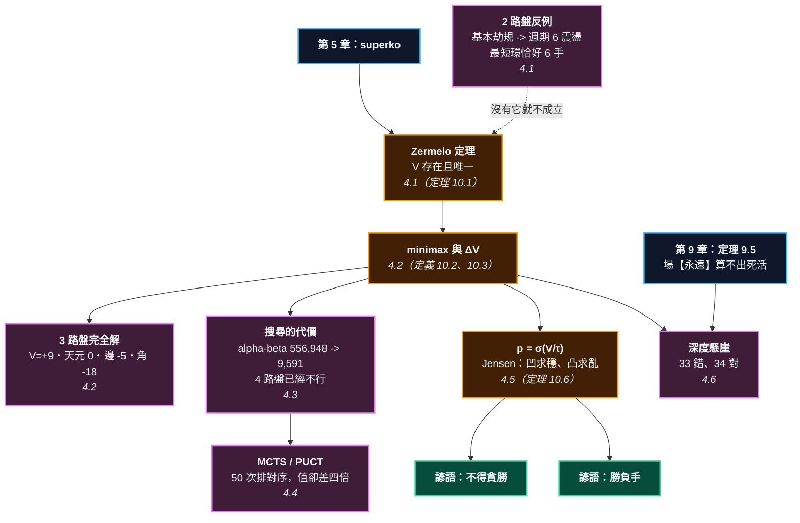

# 第 10 章：全局值函數 —— AI 到底在算什麼

---

## 0. 我們在哪裡

**開始之前你需要具備：**

* 第 4 章 §4.5 的 **AND-OR 樹**與分枝因子 $b^d$。這一章要把它放大到整個棋盤。
* 第 5 章 §4.2 的**終止性定理**（定理 5.3）與 §4.3 的三種劫規則。本章 §4.1 會示範：**沒有 superko，$V$ 根本不存在**。
* 第 6 章的**賽局值**與第 7 章的**溫度**。它們會在這裡被認出來是同一個東西的特例。
* 第 8 章 §4.4 的**征子**與第 9 章 §4.6 的**定理 9.5**。第 9 章證明了場算不出死活；這一章要看搜尋要付多少錢才算得出來。

**讀完本章後你將能夠：**

* 說出 $V(s)$ 是什麼、為什麼它存在、以及它為什麼算不出來。
* 看懂一個**被完全解開**的棋盤：3 路圍棋的每一手值幾目，本章都有確切答案。
* 用一條 S 形曲線解釋「AI 為什麼在大優時下緩手」—— 那是 Jensen 不等式，不是玄學。
* 說出前面九章的每一層，各自是 $V$ 的哪一種近似。

---

## 1. 開場思想實驗與掙得的頓悟

### 思想實驗：一個只會說數字的神仙

假設你身邊有一位神仙。他不會下棋，也不會解釋，只會做一件事：你指著任何一個盤面問他，他就告訴你一個數字 —— **雙方都下最好的棋，最後黑贏幾目。**

有了他，圍棋還剩下什麼問題？

答案是：**什麼問題都沒有了。** 想知道該下哪裡？把每一個合法點都試一遍，問神仙每個結果的數字，挑最大的那個。想知道剛才那手是不是壞棋？比較下之前和下之後的兩個數字。想知道貼目該定多少？問他空盤的數字。

**整個圍棋，被壓縮成一個函數。**

而這一章要說的第一件事是：**這位神仙在數學上確實存在。** 第二件事是：**沒有人見得到他。**

### 把謎題寫成一個問題

AI 出現之後，一個很具體的困惑冒出來了：

**AI 大優的時候，會下出人類覺得「太緩」的棋。** 明明可以吃掉一塊，它偏偏補一手；明明可以多賺五目，它偏偏走一個看起來很鬆的地方。有時候它甚至白白送你幾目。

職業棋手的解釋通常是「它在簡化局面」。這是對的，但它不是解釋 —— 它只是換一個說法。

**真正的問題是：如果 AI 在最大化某個東西，那它最大化的到底是什麼？為什麼那個東西會叫它少賺幾目？**

> [!EUREKA]
> **AI 算的不是「這個盤面多好」，是「從這裡展開的樹長什麼樣」。**
>
> Zermelo 定理保證：有限、完全資訊、無隨機、零和的賽局，存在**唯一**的值
> $$V(s) = \begin{cases} \max_a V(T(s,a)) & \text{輪到黑} \\ \min_a V(T(s,a)) & \text{輪到白}\end{cases}$$
> 「好手」就是 $\arg\max V$，「失誤」就是 $\Delta V$。一切都從這一行推出來。三件事：
>
> **一、$V$ 存在的前提是劫規則，而這件事可以在 2 路盤上親眼看到。**
> 只用基本劫規時，2 路圍棋的值**隨手數上限以週期 6 震盪，永遠不收斂**。
> 為什麼是 6？因為 2 路盤狀態圖裡最短的純落子環**恰好是 6 手** ——
> 正是第 5 章說過「基本劫規擋 2-環、擋不住 6-環」的那個 6。
> **最小的棋盤就是 Zermelo 需要 superko 的反例。**
>
> **二、$V$ 可以被算出來 —— 在 3 路盤上。** 本章把 3 路圍棋完全解開：
> $V(\text{空盤}) = +9$，黑拿走整個棋盤，最佳第一手是天元。而每一手的失分是
> $$\text{天元 } 0 \qquad \text{邊 } -5 \qquad \text{角 } -18 \qquad \text{虛手 } -18$$
> **在 3 路盤上，第一手下角落和直接虛手一樣糟。**
> 到了 4 路盤，同樣的程式就已經跑不完了。
>
> **三、AI 的緩手是 Jensen 不等式。** 勝率是目數擠過一條 S 形曲線的結果：
> $$p = \sigma(V/\tau)$$
> $\sigma$ 在 $V>0$ 這半邊是**凹的**。凹函數配 Jensen：**同樣的期望目數，變異數越小勝率越高。**
> 實際數字（$\tau=6$）：穩穩收 $+19$ 目的勝率是 $0.9596$；
> 期望 $+20$ 目但可能是 $10$ 或 $30$ 的勝率只有 $0.9172$。
> **少賺一目，多賺 4.2% 勝率。** AI 送你那一目不是失誤，是買保險。
> 而 $V<0$ 那半邊 $\sigma$ 是凸的，所以同一條公式也解釋了「勝負手」。

```text
                    第 10 章：所有東西的匯流處

    第 4 章 AND-OR 樹        第 5 章 superko          第 6-7 章 值與溫度
          │                       │                        │
          │                  （沒有它 V 不存在）              │
          ▼                       ▼                        ▼
    ┌─────────────────────────────────────────────────────────────┐
    │        V(s) = max/min_a V(T(s,a))     （Zermelo）            │
    └───────────────────────────┬─────────────────────────────────┘
                                │
        ┌───────────────┬───────┴────────┬────────────────┐
        ▼               ▼                ▼                ▼
    3 路：解得開      4 路：已經不行      MCTS：只展開       p = σ(V/τ)
    V = +9          19 路：3^361       有希望的分支       Jensen
    天元 0           種盤面             50 次就排對序      大優求穩
    邊 -5                              但值估不準         大劣求亂
    角 -18
        │                                                  │
        └──────────────────────┬───────────────────────────┘
                               ▼
                第 9 章：場【永遠】看不見十五路外那顆子
                第 10 章：搜尋看得見 —— 但要讀到第 34 手
                深度 33 的搜尋，和影響力場一樣瞎
```



---

## 2. 多角度直觀：值函數

> [!INTUITION]
> **角度一：手感／實戰透鏡**
>
> 你其實一直在用 $V$，只是用的是很粗的近似。
>
> 「形勢判斷」就是在估 $V$。你數一數雙方的實地、加減一點厚薄、扣掉貼目，得到一個數 ——
> 「黑好像領先五目左右」。那個「五目左右」就是你心裡的 $\hat V$。
>
> 差別只在精度和誠實度。你的 $\hat V$ 有誤差但很快；神仙的 $V$ 沒有誤差但沒有人算得出來。
> **這一章要做的，是把兩者之間的距離量出來。**

> [!INTUITION]
> **角度二：幾何／形狀透鏡**
>
> 把 $V$ 想成一棵樹的樹根上的一個數。樹的每一層是一手棋，葉子是終局。
> 從葉子往上倒推：輪到黑的那一層取 max、輪到白的那一層取 min。
>
> 這棵樹的**寬度**是分枝因子（19 路盤開局約 361），**深度**是棋局長度（約 200 手）。
> 兩個數字擺在一起，你就知道為什麼沒有人見得到神仙：
> $$361^{200} \approx 10^{512}$$
>
> 而這棵樹有一個很反直覺的性質：**它的形狀極不均勻。** 大部分分支一步就可以砍掉
> （下在自己的眼裡、明顯的送死），少數分支要讀到三十幾手（征子）。
> 整章的技術內容，就是在講怎麼利用這種不均勻。

> [!INTUITION]
> **角度三：代數／計算透鏡**
>
> 三個式子，本章反覆使用：
>
> $$V(s) = \max_a V(T(s,a)) \quad\text{或}\quad \min_a V(T(s,a))$$
> $$\Delta V(a) = V(s^\ast) - V(T(s,a)) \ \ge 0 \qquad (s^\ast \text{ 是最佳著之後的盤面})$$
> $$p(s) = \sigma\!\left(\frac{V(s)}{\tau}\right) = \frac{1}{1 + e^{-V(s)/\tau}}$$
>
> 第一條定義「好手」，第二條定義「失誤」，第三條定義「勝率」。
> **第三條是唯一一條不是必然的** —— $\sigma$ 這個形狀是一個建模選擇。
> 但它的**凹凸性**（而不是它的精確形狀）就足以推出本章 §4.5 的全部結論，
> 而凹凸性對任何合理的 S 形曲線都成立。

> [!BOARD REALITY]
> **角度四：棋盤現實檢查**
>
> **失效一：把 AI 的評分當成「這手棋的價值」。** AI 給的是 $\Delta V$ —— 相對於**它算出來的最佳著**的差。
> 那個最佳著可能建立在後續二十手都下對的前提上。對人類而言，「$\Delta V$ 小但很難下對」的一手，
> 未必比「$\Delta V$ 大但穩」的一手好。**$V$ 假設對手也是神仙。**
>
> **失效二：勝率的 $\tau$ 不是常數。** 開局時一目不太決定勝負（$\tau$ 大），
> 官子時一目就是全部（$\tau$ 小）。同樣是「勝率 70%」，在第 50 手和第 250 手意思完全不同。
>
> **失效三：以為 AI 在「理解」。** 它在展開一棵樹。**它下得比你好，不是因為它懂得多，
> 是因為它算得多** —— 而這件事到本章 §4.6 會變得非常具體：深度 33 的搜尋，
> 和第 9 章那個被證明無能的影響力場，答案一模一樣。

---

## 3. 散落的碎片（問題本身）

**第一片：「這手棋值幾目」從來沒有定義。** 圍棋書從第一頁就在講「這手棋大」「那手棋小」，但沒有一本說清楚是相對於什麼。

**第二片：形勢判斷是手藝，不是計算。** 每個人數目的方法都不一樣，而且都不完全對。

**第三片：AI 的行為看起來不理性。** 大優時下緩手，大劣時下無理手。兩者看起來是相反的毛病。

**第四片：「AI 說這手不好」被當成聖旨。** 但 $\Delta V = 0.3$ 目和 $\Delta V = 8$ 目是完全不同的事，而覆盤軟體常常用同一個紅色標記。

**第五片：前面九章看起來像九個互不相干的工具箱。** 氣、眼、對殺、劫、賽局值、溫度、形、場 —— 它們之間到底是什麼關係？

### 新手典型會錯在哪裡

1. **以為 AI 的最佳著就是自己該學的。** 有些手你學得會，有些手的前提是後面二十手都不出錯。
2. **看勝率不看目數。** 勝率 95% 和勝率 99% 在目數上可能差二十目 —— 但在勝率上只差 4%。
3. **以為「算得深」就是「算得多」。** 這一章 §4.3 會示範：alpha-beta 讓同一個答案便宜 58 倍。**方向比蠻力重要。**

---

## 4. 對齊（解答）

### 4.1 Zermelo：$V$ 存在 —— 但要先有劫規則

> **定理 10.1（Zermelo）** 設一個賽局是**有限**（局面數與棋局長度都有限）、
> **完全資訊**（雙方都看得見全部）、**無隨機**、**零和**的。
> 則存在唯一的值 $V$ 與雙方的最優策略，使得任一方都無法單方面改善結果。

**證明的想法**：從終局往回倒推。終局的值直接由記分規則決定。往前一層，輪到誰走，誰就在所有子節點裡挑對自己最好的 —— 這個「挑」是良定義的，因為子節點只有有限多個而且值都已知。一路倒推到根。$\blacksquare$

四個前提裡，圍棋直接滿足後三個：雙方都看得見整個棋盤、沒有骰子、一方贏多少另一方就輸多少。**問題出在第一個。**

> [!RECALL]
> **第 5 章 §4.2 的定理 5.3**：沒有任何劫規則時，**存在無限長的棋局**；
> 加上 positional superko 之後，棋局長度 $\le 3^{n^2}$。
> 而 §4.3 的規則 5.4 說得更細：**基本劫規擋得住 2-環，擋不住三劫那種 6-環。**

那句話在當時是一個關於規則的技術註腳。現在它變成一件要命的事：**如果棋局可以無限長，Zermelo 的前提不成立，$V$ 就不存在。**

而這件事可以在**最小的棋盤**上親眼看到。

<!-- diagram: ch10_2x2_cycle -->
```text
     A B
   2 O X 2
   1 . . 1
     A B
```
*2 路盤上的一個盤面。從這裡出發，只用【落子】就能在 6 手之後回到同一個狀態 —— 基本劫規擋不住這個 6-環（第 5 章規則 5.4）。於是 2 路圍棋在基本劫規下【沒有值】。*

把求解器的手數上限一路調高，看 $V$ 怎麼變（只用基本劫規）：

| 手數上限 | 4 | 6 | 8 | 10 | 12 | 14 | 16 | 18 | 20 | 22 | 24 | 26 |
| :--- | --: | --: | --: | --: | --: | --: | --: | --: | --: | --: | --: | --: |
| **2 路盤 $V$** | $-1$ | $0$ | $0$ | $-1$ | $0$ | $0$ | $-1$ | $0$ | $0$ | $-1$ | $0$ | $0$ |
| **3 路盤 $V$** | — | — | — | $+6$ | $+9$ | $+9$ | $+9$ | $+9$ | $+9$ | $+9$ | $+9$ | $+9$ |

3 路盤在手數上限 13 之後就穩了，一路到 31 都是 $+9$。

**2 路盤永遠不穩，而且週期恰好是 6。**

這不是程式的毛病。把 2 路盤的狀態圖（含輪次與劫點，共 114 個狀態）整個建出來，找最短的**純落子**有向環：

$$\text{A1} \to \text{B1} \to \text{A2} \to \text{A1} \to \text{A2} \to \text{B2} \quad\Longrightarrow\quad \textbf{回到原點，6 手}$$

**週期 6 的震盪，來自狀態圖裡那個 6 手的環。** 基本劫規只禁止「立刻提回」，也就是只擋 2-環；這個環繞了六步才回來，它一路上完全合法。

> **推論 10.1a** 在只有基本劫規的規則下，**2 路圍棋沒有值**。
> Zermelo 定理不適用，因為賽局不是有限的。

> [!BOARD REALITY]
> **這件事在 19 路盤上真的會發生嗎？**
>
> 會，而且有名字：**三劫循環**、**長生**、**雙提兩子**。職業對局史上出現過，
> 而且在只有基本劫規的日本規則下，處理方式是「無勝負」—— 也就是**宣布這盤棋沒有結果**。
>
> 那不是禮讓，那是規則在承認 $V$ 不存在。中國規則與 AGA 規則用 superko 把這個洞補起來，
> 代價是規則變複雜。**這是一個真實的取捨，不是理論潔癖。**

從這裡開始，本章一律假設 superko 成立，於是 $V$ 存在。

### 4.2 minimax 與 $\Delta V$：把一個棋盤真的解開

> **定義 10.2（值函數）** 對盤面 $s$，
> $$V(s) = \begin{cases} \text{終局記分}(s) & s \text{ 是終局} \\ \max_a V(T(s,a)) & \text{輪到黑} \\ \min_a V(T(s,a)) & \text{輪到白}\end{cases}$$
> 一律由黑的角度看：$V > 0$ 表示黑領先。

> **定義 10.3（失誤）** 一手 $a$ 的失分
> $$\Delta V(a) = \big|\,V(s) - V(T(s,a))\,\big| \ \ge 0$$
> 最佳著的 $\Delta V = 0$，其餘的都是正的。**這就是「這手掉幾目」的精確意思。**

現在把它用在一個真的棋盤上。

<!-- diagram: ch10_3x3_moves -->
```text
     A B C
   3 c b . 3
   2 . a . 2
   1 . . . 1
     A B C
```
*3 路盤的空盤。三種第一手：a 天元、b 邊、c 角。這是全書唯一一個「每一手值幾目」有【確切答案】的盤面 —— 因為 3 路圍棋可以被完全解開。*

$$V(\text{3 路空盤，黑先，貼目 0}) = \boxed{+9}$$

**黑拿走整個棋盤。** 而每一點下第一手的失分是：

<!-- figure: ch10_deltav -->
```text
-18  -5 -18
 -5   0  -5
-18  -5 -18

pass -18
```
*3 路盤上，每一點下第一手的失分 $\Delta V$（負號表示比最佳著少賺幾目）。天元 0、邊 $-5$、角 $-18$。虛手也是 $-18$ —— 在 3 路盤上，**第一手下角落和直接不下，一樣糟**。*

這張圖有兩件事值得停下來看。

**第一，角落的失分是 18，不是 9。** 從 $+9$ 掉到 $-9$ —— 不只是輸掉自己的份，是整個棋盤易主。3 路盤的天元同時貼著四個邊點，佔住它等於控制全局；讓給對手，對手就控制全局。

**第二，這和第 2 章的「金角銀邊」正好相反。**

> [!RECALL]
> **第 2 章 §4.5 的定理 2.11**：圍出同樣大的地，角 : 邊 : 中 $= 1 : \sqrt2 : 2$。
> **角落最便宜。** 而第 9 章的命題 9.4 說影響力場**永遠偏好中央**，
> 當時那被列為場的一個缺陷。
>
> 在 3 路盤上，**場是對的，金角銀邊是錯的**。
> 為什麼？因為定理 2.11 的前提是「有地方可以圍」。3 路盤上沒有 ——
> 整個棋盤就是一個中央。**兩個結論都對，各自的前提不同，而只有 $V$ 知道現在該用哪一個。**

雙方都下最好的棋，結局是這樣：

<!-- diagram: ch10_3x3_final -->
```text
     A B C
   3 X . X 3
   2 X X X 2
   1 . X X 1
     A B C
```
*雙方都下最好的棋，3 路盤的結局：黑 9 子、白 0 子。黑拿走整個棋盤。這不是估計，是 15 手的完全搜尋算出來的。*

最優對局的 15 手是：

$$\text{黑B2 白B3 黑A2 白C2 黑B1 白A3 黑C3 白B3 黑A3 白C3 黑C1 白B3 黑C2 白虛手 黑C3}$$

白在 B3 和 C3 反覆送死。那不是白下錯 —— **在一個必敗的局面裡，所有的手都一樣輸，於是「最優」只剩下形式意義。** 這也是 $V$ 的一個誠實的側面：它告訴你結果，不告訴你「該怎麼掙扎比較有機會」，因為它假設對手不會犯錯。

$$\boxed{\ \textbf{貼目就是 } V(\text{空盤})\ }$$

3 路盤的公平貼目是 **9**（黑貼 9 子，$V$ 才變成 0）。這就是「貼目」這個數字的**定義** —— 不是傳統，不是投票，是讓空盤的值歸零的那個數。19 路盤的 7.5 目是幾十年對局統計逼近出來的估計值，因為真正的 $V(\text{19 路空盤})$ 沒有人算得出來。

### 4.3 為什麼 19 路解不出來

3 路盤解得開。4 路盤呢？

| 盤面 | 手數上限 | 節點數 | 時間 |
| :--- | --: | --: | --: |
| 3 路 | 15 | 9,591 | 0.6 秒 |
| 3 路 | 31 | 239,218 | 9.4 秒 |
| **4 路** | **8** | **128,684** | **16 秒** |
| **4 路** | **10** | **398,527** | **59 秒** |

4 路盤在手數上限 10 就要跑一分鐘，而它需要 20 以上才可能收斂 —— 那時候 $V$ 還停在 $0$，離真正的答案還很遠。**同一支程式，4 路盤已經跑不完了。**

上界很好算。盤面數最多 $3^{n^2}$（每點三種狀態），這正是第 5 章定理 5.3 用過的那個界：

$$3^{9} = 19{,}683 \qquad 3^{16} \approx 4.3\times 10^{7} \qquad 3^{361} \approx 10^{172}$$

**每加一路，指數就翻一次。** 從 3 路到 19 路，中間隔著 165 個數量級。

那搜尋技術能幫多少？把同一個問題（3 路、手數上限 15）用兩種方式跑：

| 方法 | 節點數 | 時間 |
| :--- | --: | --: |
| 只有置換表 | 556,948 | 16.4 秒 |
| 置換表 $+$ alpha-beta | **9,591** | **0.6 秒** |

**58 倍。** 而且答案一模一樣。

> [!RECALL]
> **第 4 章 §4.5 的 AND-OR 樹**：工作量 $\approx b^{d}$。
> alpha-beta 的作用是在最理想的情況下把它降到 $b^{d/2}$ —— 相當於**深度加倍**。
> 那一章說「手筋的作用是剪枝」，這裡是同一件事的機器版本：
> **知道先看哪一手（著手排序），比算得快重要得多。**

但 58 倍在 $10^{165}$ 面前什麼也不是。**這就是 1997 年電腦下贏西洋棋、卻要再等二十年才下贏圍棋的原因**：西洋棋的樹夠窄，蠻力加剪枝就能壓下去；圍棋不行。

> [!BOARD REALITY]
> **「算不出來」有兩種，要分清楚。**
>
> * **原理上算不出**：第 9 章的定理 9.5 —— 任何形如 $\sum_s \sigma(s) f(d)$ 的場，
>   **不管給它多少計算資源**，都判不出死活。
> * **資源上算不出**：本節 —— $V$ 完全良定義，演算法也完全正確，
>   只是需要 $10^{165}$ 個節點。
>
> 這兩種困難的**解法完全不同**。第一種要換模型，第二種要換策略 ——
> 而下一節就是那個策略。

### 4.4 MCTS：把預算花在有希望的地方

既然展不開整棵樹，就換一個問法：**我有固定的預算，該花在哪些分支上？**

> **定義 10.4（UCT 與 PUCT）** 每一次模擬，從根往下選擇時取
> $$a^\ast = \arg\max_a \Big[\, \underbrace{Q(a)}_{\text{已知的好}} + \underbrace{c\,\sqrt{\tfrac{\ln N}{n(a)}}}_{\text{還沒看夠}} \,\Big]
> \qquad\text{（UCT）}$$
> $$a^\ast = \arg\max_a \Big[\, Q(a) + c\,P(a)\,\frac{\sqrt{N}}{1+n(a)} \,\Big] \qquad\text{（PUCT）}$$
> 其中 $Q$ 是該分支目前的平均值，$n(a)$ 是它被訪問的次數，$N$ 是總次數，
> $P(a)$ 是**先驗** —— AlphaGo 系列由策略網路提供，也就是「人類會先看哪幾手」。

左邊那項叫你去**已經知道好**的地方，右邊那項叫你去**還沒看清楚**的地方。這兩項的拉扯就是整個演算法。

在 3 路盤上跑（純 UCT，隨機模擬，沒有任何神經網路）：

| 模擬次數 | 選出來的第一手 | 對嗎 |
| --: | :--- | :--: |
| 50 | 天元 B2 | ✓ |
| 100 | 天元 B2 | ✓ |
| 400 | 天元 B2 | ✓ |
| 1600 | 天元 B2 | ✓ |

**50 次模擬就找到了正解。** 而 1600 次之後，各手的訪問次數是：

| 著手 | 訪問次數 | 平均值 |
| :--- | --: | --: |
| **B2（天元）** | **761** | $+0.337$ |
| C2（邊） | 256 | $+0.234$ |
| B1（邊） | 231 | $+0.223$ |
| B3（邊） | 148 | $+0.163$ |
| A2（邊） | 98 | $+0.116$ |
| C1（角） | 27 | $-0.259$ |

**排序完全正確**：天元 $\gg$ 四個邊 $\gg$ 角，和 §4.2 的精確解（$+9 > +4 > -9$）一致。

**但是值錯得離譜。** 真正的 $V = +9$，換算到這裡的尺度應該是 $+1.0$。MCTS 對根節點的估值是 $+0.228$，對最佳著之後的估值是 $+0.337$ —— **兩個都不到真值的三分之一。**

> **觀察 10.5** 隨機模擬的 MCTS **排序先收斂，估值後收斂** ——
> 而且估值收斂得非常慢。

這正是 AlphaGo 為什麼需要**價值網路**。純 MCTS 用隨機亂下的結果去估一個盤面值，那個估計有巨大的偏差（隨機下棋的雙方都爛，所以誰也吃不掉誰，結果被拉向中間）。價值網路的工作就是**取代那個爛估計**。

於是三個零件各司其職，缺一不可：

| 零件 | 回答什麼 | 缺了它會怎樣 |
| :--- | :--- | :--- |
| **策略** $P(a)$ | 先看哪幾手 | 預算被平均分掉，深度不夠 |
| **價值** $V(s)$ | 這個盤面值多少 | 排序對、目數估不準（本節的實測） |
| **搜尋** | 多看幾步 | 只剩直覺，看不見十五路外（§4.6） |

### 4.5 勝率與目數：AI 為什麼下緩手

現在回答開場那個問題。

比賽要的不是目數，是**贏**。而目數和勝率之間隔著一條 S 形曲線：

> **定義 10.5b（勝率）** $$p(s) = \sigma\!\left(\frac{V(s)}{\tau}\right) = \frac{1}{1+e^{-V(s)/\tau}}$$
> $\tau$ 是「一目值多少勝率」的尺度：開局大（一目不決定勝負），官子小（一目就是全部）。

<!-- figure: ch10_sigmoid -->
```text
1.00                               |                         *****
0.94                               |                 ********     
0.88                               |            *****             
0.81                               |         ***                  
0.75                               |       **                     
0.69                               |    ***                       
0.62                               |  **                          
0.56                               |**                            
0.50 ------------------------------*------------------------------
0.44                             **|                              
0.38                           **  |                              
0.31                        ***    |                              
0.25                      **       |                              
0.19                   ***         |                              
0.12              *****            |                              
0.06      ********                 |                              
0.00 *****                         |                              
     ^                             ^                             ^
     -24                        V (目)                        +24

     V < 0 這半邊是凸的 -> 該提高變異數（勝負手）
     V > 0 這半邊是凹的 -> 該降低變異數（緩手、收官）
```
*勝率曲線 $p = \sigma(V/\tau)$，$\tau = 6$。中間陡、兩頭平。**一目棋在盤面接近時值錢，在大優或大劣時幾乎不值錢** —— 這句話就是整節的全部。*

一目值多少勝率，就是這條曲線的斜率：

| $V$ | $p$ | $\mathrm{d}p/\mathrm{d}V$ |
| --: | --: | --: |
| $0$ | $0.500$ | $0.0417$ |
| $+5$ | $0.697$ | $0.0352$ |
| $+10$ | $0.841$ | $0.0223$ |
| $+20$ | $0.966$ | $0.0055$ |

**領先 20 目時，一目的價值只剩盤面接近時的 $1/7.5$。**

現在把它接上 Jensen 不等式。

> **定理 10.6（大優求穩、大劣求亂）** 設 $\sigma$ 在 $V>0$ 為凹、$V<0$ 為凸。
> 給定兩個期望目數相同的選擇，一個確定得到 $\mu$，另一個等機率得到 $\mu \pm \delta$。則
> $$V > 0:\ \ \sigma(\mu) \;>\; \tfrac12\big[\sigma(\mu-\delta)+\sigma(\mu+\delta)\big] \qquad \textbf{（求穩）}$$
> $$V < 0:\ \ \sigma(\mu) \;<\; \tfrac12\big[\sigma(\mu-\delta)+\sigma(\mu+\delta)\big] \qquad \textbf{（求亂）}$$
>
> **證明**：這就是 Jensen 不等式 $\mathbb{E}[\sigma(X)] \le \sigma(\mathbb{E}[X])$（$\sigma$ 凹）
> 與其反向（$\sigma$ 凸）。$\blacksquare$

實際數字（$\tau=6$，$\delta=10$）：

| 期望目數 $\mu$ | 穩的勝率 | 亂的勝率 | 差 | 該怎麼下 |
| --: | --: | --: | --: | :--- |
| $-20$ | $0.0344$ | $0.0828$ | $-0.048$ | **搏** |
| $-10$ | $0.1589$ | $0.2672$ | $-0.108$ | **搏** |
| $-5$ | $0.3029$ | $0.3865$ | $-0.084$ | **搏** |
| $0$ | $0.5000$ | $0.5000$ | $0.000$ | 一樣 |
| $+5$ | $0.6971$ | $0.6135$ | $+0.084$ | **穩** |
| $+10$ | $0.8411$ | $0.7328$ | $+0.108$ | **穩** |
| $+20$ | $0.9656$ | $0.9172$ | $+0.048$ | **穩** |

完美對稱，分界點在 $V=0$。

而最關鍵的一個算式：**大優時，少賺一目換掉變異數，划不划算？**

$$\textbf{穩穩收 }{+19}\textbf{ 目：} \ p = 0.9596$$
$$\textbf{期望 }{+20}\textbf{ 目，但可能是 }10\textbf{ 或 }30\textbf{：} \ p = 0.9172$$

$$\boxed{\ \textbf{少賺一目，多賺 } 4.2\% \textbf{ 勝率}\ }$$

**AI 送你那一目不是失誤，是買保險。** 它最大化的從來就不是 $V$，是 $\sigma(V)$。

> [!PROVERB]
> **「不得貪勝」**（《圍棋十訣》第一條）
> **它其實在說**：$\sigma$ 在 $V>0$ 是凹的。領先時再多賺的目數，換算成勝率越來越不值錢，
> 而為了多賺而承擔的風險，是**線性**地增加變異數。一邊報酬遞減、一邊成本不變，
> 所以過了某一點就該收手。**一千年前的一句訓誡，內容是 Jensen 不等式。**
> **失效條件**：$V < 0$ 時整句話反過來。落後的時候「不貪勝」就是穩穩地輸 ——
> 那時候正確的做法是**提高**變異數，也就是下一節那個諺語。

> [!PROVERB]
> **「勝負手」**
> **它其實在說**：$V<0$ 時 $\sigma$ 是凸的，所以把局面弄複雜（提高變異數）會提高勝率，
> **即使那一手在目數上是虧的**。表上 $\mu=-10$ 那一列：搏一把讓勝率從 $15.9\%$ 變成 $26.7\%$。
> **失效條件一**：只落後兩三目時不成立 —— 那時候 $\sigma$ 幾乎是直線，變異數不改變勝率，
> 而你多虧的目數是實打實的。**勝負手是大劣時的工具，不是小劣時的。**
> **失效條件二**：這條推論假設你能算清楚那個「亂」的分佈。如果你把局面弄亂之後
> 自己也讀不清楚，那不是提高變異數，是把 $\mu$ 也一起弄低了。

### 4.6 深度就是一切：搜尋與場的真正差別

最後把第 9 章那個懸而未決的問題結掉。

<!-- diagram: ch10_ex3 -->
```text
     A B C D E F G H J K L M N
  13 . . . . . . . . . . . . . 13
  12 . . . . . . . . . . . . . 12
  11 . . . O O . . . . . . . . 11
  10 . . O X . . . . . + . . . 10
   9 . . . . . . . . . . . . . 9
   8 . . . . . . . . . . . . . 8
   7 . . . . . . + . . . . . . 7
   6 . . . . . . . . . . . . . 6
   5 . . . . . . . . . . . . . 5
   4 . . . + . . . . . + . . a 4
   3 . . . . . . . . . . . . . 3
   2 . . . . . . . . . . . . . 2
   1 . . . . . . . . . . . . . 1
     A B C D E F G H J K L M N
```
*練習 10.4：第 8 章的征子，第 9 章證明過任何影響力場都算不出它。搜尋算得出來 —— 但要讀多深？在 a 放一顆黑子之後又要讀多深？*


> [!RECALL]
> **第 9 章 §4.6 的定理 9.5**：對任何遞減趨零的 $f$，任何形如
> $I(v) = \sum_s \sigma(s) f(d(s,v))$ 的場都判不出死活。
> 見證就是這個盤面：N4 那顆子讓 $I(\text{D10})$ 只改變 $\lambda^{15}$，
> 而黑 D10 從**死**變成**活**。

搜尋看得見那顆子嗎？看得見。**但要付錢。** 把讀棋的深度上限一格一格調上去：

| 搜尋深度上限 | 沒有引徵時的答案 | 對嗎 |
| --: | :--- | :--: |
| 5 | 跑掉了 | ✗ |
| 20 | 跑掉了 | ✗ |
| 30 | 跑掉了 | ✗ |
| **33** | **跑掉了** | **✗** |
| **34** | **征子成立** | **✓** |
| 40 | 征子成立 | ✓ |
| 60 | 征子成立 | ✓ |

**深度 33 錯，深度 34 對。** 不是逐漸變好，是**一道懸崖**。

而真正該看的是把有引徵和沒引徵並排：

| 深度 | 沒有引徵（正解：征子成立） | 有引徵（正解：跑掉） | 兩者分得出來嗎 |
| --: | :--- | :--- | :--- |
| 5 | 跑掉了 ✗ | 跑掉了 ✓ | **分不出來** |
| 20 | 跑掉了 ✗ | 跑掉了 ✓ | **分不出來** |
| 33 | 跑掉了 ✗ | 跑掉了 ✓ | **分不出來** |
| **34** | 征子成立 ✓ | 跑掉了 ✓ | **分得出來** |

看第三欄。深度 33 以下，**搜尋對這兩個盤面給出一模一樣的答案** —— 就像第 9 章的影響力場一樣。它甚至在有引徵的那一欄「答對了」，但那是因為它放棄了，不是因為它算出來了。

$$\boxed{\ \textbf{深度不足的搜尋，和一個被證明無能的場，一樣瞎。}\ }$$

**第 4 層和第 5 層的差別不是種類，是深度。** 第 9 章證明了場**永遠**到不了；這一章說搜尋到得了，但門票是 34 手。而第 8 章那個「征子陰影」，現在有了第二個意思：**它量的正是「你必須讀多深才看得見」。**

於是整本書可以收在一張表上：

> **前面九章，每一章都是 $V$ 在某個受限情況下的閉合解。**

| 層 | 章 | 是 $V$ 的什麼 | 為什麼能算 |
| :-- | :-- | :--- | :--- |
| 1 連通性 | 2、8 | 「這塊能不能被提」的子賽局 | 局部、無互動 |
| 2 不變量 | 3 | $V$ 的**不動點**：Benson 活 = 不論怎麼下都不變 | 完全不必搜尋 |
| — 劫 | 5 | $V$ **不可加**的地方 | 例外，只能點名 |
| 3 溫度 | 6、7 | $V$ 在**可加性假設**下的一階近似 | 局部獨立 |
| 4 場 | 9 | $V$ 的**平滑近似** | 可加、衰減 —— 而且**證明了不夠** |
| 5 值函數 | 10 | $V$ 本身 | 算不出來 |

**第 2 到第 9 章不是九個工具箱，是同一個函數的九種便宜近似。** 每一種都在某個前提下精確，而每一章的 BOARD REALITY 講的都是同一件事：**那個前提什麼時候會破。**

---

## 5. 應用：手算追蹤與非黑盒程式

### 5.1 用手算一遍

手算 3 路盤第一手下**角**為什麼會輸掉整個棋盤。完整的樹太大，但關鍵的一步可以手推。

**第一步：黑下 A3（角），白會下哪裡？**

依 §4.2，黑下角之後 $V = -9$ —— 白拿走整個棋盤。白的手段是什麼？

**第二步：白下天元 B2。**

現在盤面是黑 A3、白 B2。數一下白 B2 的鄰點：A2、C2、B1、B3 —— **四個點全是空的，而且它們是 3 路盤上僅有的四個邊點。**

**第三步：算「誰貼著誰」。**

3 路盤只有 9 個點：1 個天元、4 個邊、4 個角。天元貼著全部 4 個邊；每個角只貼著 2 個邊。

$$\deg(\text{天元}) = 4, \qquad \deg(\text{邊}) = 3, \qquad \deg(\text{角}) = 2$$

> [!RECALL]
> **第 2 章 §4.2 的 1.4**：$|L(\{v\})| = \deg(v)$ —— 角 2、邊 3、中央 4。
> 在 19 路盤上這只是「角上的子天生少兩口氣」。
> 在 **3 路盤**上，天元的 4 口氣是全盤最大值的**兩倍**，
> 而且它接觸的四個邊點就是整個棋盤的骨架。**同一個不等式，在小盤面上是壓倒性的。**

**第四步：讀出這件事在說什麼。**

黑那顆角上的子有 2 口氣，白那顆天元有 4 口氣，而且白同時貼著四個邊點。黑要活，得在角落做兩個眼 —— 3 路盤的一個角只有 A3、A2、B3 三個點，而白佔著天元就等於把 A2、B3 兩個點都盯住了。**空間不夠。**

這就是為什麼 $\Delta V(\text{角}) = 18$ 而不是 9：黑不但沒佔到好點，**還把好點讓給了白**。$+9 \to -9$ 是同一顆子的兩面。

**這一步是可以手算的，而完整的 $V$ 不行。** 兩者的差距 —— 「看得出一步」和「算得出全部」—— 就是這一整章。

### 5.2 用程式驗一遍

```python
"""第 10 章 §4.1、§4.2：Zermelo 需要劫規則；3 路盤可以被完全解開。"""
import sys
sys.setrecursionlimit(100000)

from go_core import BLACK, WHITE, Board, format_coord
from go_core.minimax import Solver, area_score, move_values

# --- 2 路盤：只有基本劫規時，V 隨手數上限震盪，永遠不收斂 ---
vals2 = []
for ply in range(4, 27, 2):
    s = Solver(komi=0.0, max_ply=ply)
    v, _ = s.search(Board(2), BLACK)
    vals2.append(int(v))
print("2 路盤 V（手數上限 4,6,...,26）：", vals2)
assert vals2 == [-1, 0, 0, -1, 0, 0, -1, 0, 0, -1, 0, 0]      # 週期 6
print("  週期 6 —— 正是第 5 章說基本劫規擋不住的那個 6-環")

# --- 3 路盤：收斂，而且答案很極端 ---
vals3 = []
for ply in [11, 13, 15, 19, 23]:
    s = Solver(komi=0.0, max_ply=ply)
    v, _ = s.search(Board(3), BLACK)
    vals3.append(int(v))
print("\n3 路盤 V（手數上限 11,13,15,19,23）：", vals3)
assert vals3 == [6, 9, 9, 9, 9]                                # 13 之後就穩了
print("  手數上限 13 以後穩定在 +9：黑拿走整個棋盤")

# --- 每一手的失分 ---
vals = dict(move_values(Board(3), BLACK, komi=0.0, max_ply=15))
best = max(vals.values())
groups = {"天元": [(1, 1)],
          "邊": [(0, 1), (1, 0), (1, 2), (2, 1)],
          "角": [(0, 0), (0, 2), (2, 0), (2, 2)]}
print("\n3 路盤第一手的失分：")
for name, pts in groups.items():
    losses = {best - vals[p] for p in pts}
    assert len(losses) == 1, (name, losses)          # 同類的點值一定相同
    print(f"  {name:<4} delta_V = {losses.pop():>3.0f}")
print(f"  虛手   delta_V = {best - vals[None]:>3.0f}")
assert best == 9
assert best - vals[(1, 1)] == 0                       # 天元是唯一的最佳著
assert best - vals[(0, 1)] == 5                       # 邊
assert best - vals[(0, 0)] == 18                      # 角
assert best - vals[(0, 0)] == best - vals[None]       # 下角落 = 虛手
print("\n  在 3 路盤上，第一手下角落和直接虛手一樣糟 —— 都是 -18。")
```

**輸出裡該看什麼。** 第一個斷言：`vals2` 是 `[-1, 0, 0]` 重複四次。那個週期 6 不是巧合，它就是第 5 章預言過的環長。**一個關於規則的技術註腳，在最小的棋盤上變成了「這個賽局沒有值」。**

> **配套範例腳本**：`examples/ch10_value/ex01_solve_3x3.py`

### 5.3 搜尋的代價，以及 Jensen

```python
"""第 10 章 §4.3、§4.5：剪枝值多少，以及 AI 為什麼下緩手。"""
import sys
sys.setrecursionlimit(100000)

from go_core import BLACK, Board
from go_core.minimax import Solver, expected_win_rate, variance_preference, win_rate

# --- alpha-beta 值多少 ---
print("同一個答案，兩種算法（3 路盤，手數上限 15）：")
counts = {}
for ab, label in [(False, "只有置換表"), (True, "置換表 + alpha-beta")]:
    s = Solver(komi=0.0, max_ply=15, use_alphabeta=ab)
    v, _ = s.search(Board(3), BLACK)
    counts[ab] = s.nodes
    print(f"  {label:<22} V = {v:+.0f}   節點 = {s.nodes:>8}")
assert counts[True] == 9591 and counts[False] == 556948
print(f"  剪枝省下 {counts[False] / counts[True]:.0f} 倍，答案完全一樣")

# --- 一目值多少勝率 ---
print("\n一目棋值多少勝率（tau = 6）：")
for v in [0, 5, 10, 20]:
    p = float(win_rate(v, 6))
    slope = p * (1 - p) / 6
    print(f"  領先 {v:>2} 目：勝率 {p:.3f}   一目 = {slope:.4f} 勝率")
assert win_rate(0, 6) == 0.5
ratio = (0.5 * 0.5 / 6) / (float(win_rate(20, 6)) * (1 - float(win_rate(20, 6))) / 6)
print(f"  盤面接近時的一目，值大優時的 {ratio:.1f} 倍")
assert ratio > 7

# --- Jensen：大優求穩、大劣求亂 ---
print("\n同樣的期望目數，穩 vs 亂（tau = 6, spread = 10）：")
for mu in [-20, -10, 0, 10, 20]:
    steady, wild, diff = variance_preference(mu, 10, tau=6)
    verdict = "求穩" if diff > 1e-9 else ("求亂（勝負手）" if diff < -1e-9 else "一樣")
    print(f"  期望 {mu:>+4} 目：穩 {steady:.4f}  亂 {wild:.4f}  差 {diff:+.4f}   {verdict}")
    if mu > 0:
        assert diff > 0                       # 凹 -> 求穩
    elif mu < 0:
        assert diff < 0                       # 凸 -> 求亂
    else:
        assert abs(diff) < 1e-12              # 分界點

# --- 少賺一目，多賺多少勝率 ---
steady = expected_win_rate([19], tau=6)
wild = expected_win_rate([10, 30], tau=6)
print(f"\n  穩穩收 +19 目：       勝率 {steady:.4f}")
print(f"  期望 +20 但可能 10/30：勝率 {wild:.4f}")
print(f"  少賺一目，多賺 {steady - wild:+.4f} 勝率 —— 這就是「緩手」")
assert steady > wild
assert abs((steady - wild) - 0.0423) < 0.001
```

**輸出裡該看什麼。** 最後三行。**期望目數比較高的那個選擇，勝率反而比較低。** 這在「最大化目數」的框架裡是荒謬的，在「最大化 $\sigma(\text{目數})$」的框架裡是必然的。AI 沒有變笨，是我們一直在看錯它的目標函數。

> **配套範例腳本**：`examples/ch10_value/ex02_winrate.py`

---

## 6. 練習與完整解答

### 基礎練習

#### 練習 10.1

<!-- diagram: ch10_ex1 -->
```text
     A B C
   3 c O . 3
   2 a X b 2
   1 . . . 1
     A B C
```
*練習 10.1：黑天元、白扳，輪到黑走。a、b、c 三點哪一個最好？先猜，再用 go_core.minimax 算 —— 這一題有唯一正確答案。*

<details>
<summary><b>解答</b></summary>

用 `move_values` 把每一手都算出來：

| 著手 | $V$ | 失分 |
| :--- | --: | --: |
| **a = A2（邊）** | $+9$ | $0$ |
| **b = C2（邊）** | $+9$ | $0$ |
| B1（邊） | $+9$ | $0$ |
| **c = A3（角）** | $-1$ | $10$ |
| C3、A1、C1（角） | $-1$ | $10$ |
| 虛手 | $-3$ | $12$ |

**a 和 b 一樣好，而且不只它們兩個 —— B1 也一樣。** 三個剩下的邊點全是正解，黑照樣拿走整個棋盤。

**這一題想讓你注意兩件事。**

**第一，「唯一正確答案」不等於「唯一的一手」。** $V$ 是唯一的，但達到 $V$ 的著手可以有很多個。覆盤軟體標出「AI 的一手」時，那常常只是排序後的第一個，不是唯一的正解。

**第二，角落的失分從 18 掉到 10 了。** 空盤時下角落輸掉整盤（$\Delta V = 18$），現在只虧 10。因為黑已經佔了天元 —— **同一個點的價值，取決於盤面上其他的子。** 這正是「$V$ 是全局函數」的意思：它沒有辦法拆成每個點各自的分數。

> [!RECALL]
> **第 6 章 §4.2 的定理 6.4（可加性）** 說局部可以分開算再相加 ——
> 前提是**局部互不干擾**。3 路盤上根本沒有互不干擾的局部：九個點全都互相影響。
> 所以第 6、7 章那一整套工具在這裡完全用不上，只能硬算。
> **可加性不是圍棋的性質，是某些盤面的性質。**

```python
from go_core import BLACK, WHITE, Board, format_coord
from go_core.minimax import move_values

b = Board(3)
b.place(BLACK, "B2")
b.place(WHITE, "B3")
vals = move_values(b, BLACK, komi=0.0, max_ply=15)
best = vals[0][1]
for p, v in vals:
    name = format_coord(p, 3) if p else "虛手"
    print(f"  {name:<5} V = {v:+.0f}   失分 {best - v:>3.0f}")

d = dict(vals)
assert d[b._pt("A2")] == 9 and d[b._pt("C2")] == 9      # a 和 b 一樣好
assert d[b._pt("B1")] == 9                               # 而且還有第三個正解
assert d[b._pt("A3")] == -1                              # 角落虧 10
assert d[None] == -3
print("  三個邊點都是正解。角落的失分從空盤時的 18 降到 10。")
```
</details>

#### 練習 10.2

$\tau$ 代表「一目值多少勝率」。証明：**無論 $\tau$ 取多少**，定理 10.6 的結論都不變。然後回答：$\tau$ 到底影響什麼？

<details>
<summary><b>解答</b></summary>

**證明。** $\sigma(x) = 1/(1+e^{-x})$ 的二階導數是

$$\sigma''(x) = \sigma(x)\big(1-\sigma(x)\big)\big(1 - 2\sigma(x)\big)$$

前兩項恆正，所以 $\sigma''(x)$ 的符號只由 $1-2\sigma(x)$ 決定：

$$\sigma''(x) > 0 \iff \sigma(x) < \tfrac12 \iff x < 0$$

把 $x = V/\tau$ 代進去。因為 $\tau > 0$，$x$ 和 $V$ **同號**，所以

$$V < 0 \Rightarrow \text{凸} \qquad V > 0 \Rightarrow \text{凹}$$

**和 $\tau$ 完全無關。** $\blacksquare$

**那 $\tau$ 影響什麼？影響幅度，不影響方向。**

$\tau$ 是一個尺度參數：它決定曲線多陡，也就是「幾目算是大優」。

| $\tau$ | 什麼階段 | 領先 10 目的勝率 |
| --: | :--- | --: |
| $12$ | 開局，變數還多 | $0.699$ |
| $6$ | 中盤 | $0.841$ |
| $2$ | 官子 | $0.993$ |

同樣領先十目，開局時勝率七成，官子時九成九。**所以「該不該求穩」的**方向**由 $V$ 的正負決定，而「該多穩」由 $\tau$ 決定。**

**實戰上的意義**：$\tau$ 隨著棋局進行單調變小。所以同一個領先幅度，**越到後面越該求穩** —— 不是因為心態，是因為 $\sigma$ 越來越陡，一個失誤能翻掉的勝率越來越多。這也解釋了為什麼 AI 的「緩手」幾乎都出現在中盤之後。

```python
import numpy as np
from go_core.minimax import variance_preference, win_rate

# 凹凸性和 tau 無關
for tau in [0.5, 1, 2, 6, 12, 50]:
    for mu in [-15, -3, 3, 15]:
        _, _, diff = variance_preference(mu, 2.0, tau=tau)
        assert (diff > 0) == (mu > 0), (tau, mu, diff)
print("  六種 tau x 四種局面：求穩／求亂的方向永遠只由 V 的正負決定")

# 二階導數的符號
x = np.linspace(-8, 8, 401)
s = 1 / (1 + np.exp(-x))
second = s * (1 - s) * (1 - 2 * s)
assert (second[x < -0.05] > 0).all()      # V < 0 凸
assert (second[x > 0.05] < 0).all()       # V > 0 凹
print("  sigma'' 的符號 = 1 - 2*sigma 的符號 = -sign(V)")

# tau 只改變幅度
print("\n  領先 10 目時的勝率：")
for tau in [12, 6, 2]:
    print(f"    tau = {tau:>2}：{float(win_rate(10, tau)):.3f}")
assert win_rate(10, 2) > win_rate(10, 6) > win_rate(10, 12)
print("  tau 隨棋局進行變小 -> 同樣的領先，越到後面越穩")
```
</details>

### 實戰練習

#### 練習 10.3

<!-- diagram: ch10_ex2 -->
```text
     A B C
   3 . O . 3
   2 X X O 2
   1 . . . 1
     A B C
```
*練習 10.3：最優對局的第 5 手。黑該下哪裡？順便回答：這個盤面的 V 是多少？*


<details>
<summary><b>解答</b></summary>

| 著手 | $V$ | 失分 |
| :--- | --: | --: |
| **A3** | $+9$ | $0$ |
| **B1** | $+9$ | $0$ |
| A1 | $-1$ | $10$ |
| C1 | $-3$ | $12$ |
| 虛手 | $-3$ | $12$ |

$V = +9$：**黑仍然拿得走整個棋盤**，而且有兩個正解（A3 和 B1）。

**值得注意的是 C1 比 A1 更糟。** 兩個都是角，失分卻是 12 對 10。這說明了一件很重要的事：

$$\textbf{「角」不是一個有意義的分類 —— 有意義的是它和盤上其他子的關係。}$$

A1 貼著黑的 A2；C1 貼著白的 C2。同樣叫「角」，一個是自己的地盤，一個是對方的。人類的分類（角／邊／中央）在空盤上有效，一旦盤上有子就失效了，而 $V$ 從來不用這種分類。

> [!RECALL]
> **第 9 章 §4.1 的三個性質**：影響力場**可加、衰減、平滑**。
> 可加性表示它把每顆子的貢獻獨立相加 —— 也就是說，
> **它也在用「這個點附近有什麼」這種分類。**
>
> $V$ 不是。$V$ 唯一的分類是「從這裡展開的樹長什麼樣」。
> C1 和 A1 的 $V$ 差 2 目，而任何影響力場都會給它們對稱的分數
> （盤面對 A/C 兩邊並不對稱，但場只看距離加權，抓不到「A2 是黑、C2 是白」帶來的後續差異）。

```python
from go_core import BLACK, WHITE, Board, format_coord
from go_core.minimax import move_values

b = Board(3)
b.place_many(BLACK, ["B2", "A2"])
b.place_many(WHITE, ["B3", "C2"])
vals = move_values(b, BLACK, komi=0.0, max_ply=15)
best = vals[0][1]
for p, v in vals:
    name = format_coord(p, 3) if p else "虛手"
    print(f"  {name:<5} V = {v:+.0f}   失分 {best - v:>3.0f}")

d = dict(vals)
assert best == 9
assert d[b._pt("A3")] == 9 and d[b._pt("B1")] == 9     # 兩個正解
assert d[b._pt("A1")] == -1                             # 貼著自己的角
assert d[b._pt("C1")] == -3                             # 貼著對方的角，更糟
assert d[b._pt("A1")] > d[b._pt("C1")]
print("  兩個角的失分不同（10 vs 12）——「角」本身不是有意義的分類。")
```
</details>

#### 練習 10.4

回到 §4.6 的征子（練習 10.3 的圖，$a$ = N4）。

(a) 不放引徵時，搜尋要讀到多深才答對？
(b) 放了引徵之後呢？
(c) 深度 20 的搜尋，對這兩個盤面分別給什麼答案？這說明了什麼？

<details>
<summary><b>解答</b></summary>

**(a) 深度 34。** 深度 33 答「跑掉了」（錯），深度 34 答「征子成立」（對）。**中間沒有過渡。**

征子本身是 35 手，而搜尋要讀到第 34 手才能確定黑跑不掉 —— 幾乎是把整條路走完。

**(b) 任何深度都答對 —— 但理由不對。**

放了引徵之後正解是「跑掉了」。而深度 5 的搜尋也說「跑掉了」。

看起來答對了，**但它是因為讀不完才放棄**（`ladder_capture` 讀不完時保守地回答「跑掉了」）。同一個答案，一個是算出來的，一個是猜的。

**(c) 深度 20 對兩個盤面給出【一樣的】答案：「跑掉了」。**

| | 沒有引徵（正解：征子成立） | 有引徵（正解：跑掉） |
| :--- | :--- | :--- |
| 深度 20 | 跑掉了 ✗ | 跑掉了 ✓ |
| 深度 34 | 征子成立 ✓ | 跑掉了 ✓ |

**深度 20 的搜尋分不出這兩個盤面。**

而第 9 章的定理 9.5 說的正是：任何影響力場都分不出這兩個盤面。

$$\boxed{\ \textbf{深度 20 的搜尋 = 一個被證明無能的場}\ }$$

**這一題真正的收穫**：第 4 層和第 5 層不是兩種不同的東西，是**同一條軸上的兩個位置**。軸是深度。場在深度 0，完全解在深度 $\infty$，實際的 AI 在中間某處 —— 而**它在哪裡，決定了它看得見哪些棋、看不見哪些棋**。

第 8 章算出來的「征子陰影」，到這裡有了第三個意思：

* 第 8 章：引徵的**有效範圍**。
* 第 9 章：場**永遠**看不見的東西。
* 第 10 章：**你必須讀多深**才看得見。

```python
import sys
sys.setrecursionlimit(100000)

from go_core import BLACK, WHITE, Board
from go_core.ladder import ladder_capture

def board(extra=None):
    b = Board(13)
    b.place(BLACK, "D10")
    b.place_many(WHITE, ["D11", "C10", "E11"])
    if extra:
        b.place(BLACK, extra)
    return b

print(f"  {'深度':>5}{'沒有引徵':>12}{'有引徵':>12}{'分得出來嗎':>14}")
rows = []
for d in [5, 20, 33, 34, 40]:
    plain, _ = ladder_capture(board(), "D10", WHITE, max_depth=d)
    broken, _ = ladder_capture(board("N4"), "D10", WHITE, max_depth=d)
    same = plain == broken
    rows.append((d, plain, broken))
    print(f"  {d:>5}{('征子成立' if plain else '跑掉了'):>12}"
          f"{('征子成立' if broken else '跑掉了'):>12}"
          f"{('分不出來' if same else '分得出來'):>14}")

# 深度 33 以下，兩個盤面的答案一模一樣
for d, plain, broken in rows:
    if d <= 33:
        assert plain == broken, d          # 分不出來
    else:
        assert plain and not broken        # 分得出來，而且都對
print("  深度 33 以下的搜尋，和第 9 章那個被證明無能的場，一樣瞎。")
```
</details>

---

## 7. 本章頓悟總結

* **$V(s)$ 存在且唯一（Zermelo）** —— 但前提是賽局有限，而那要靠劫規則。
* **2 路盤就是反例**：只有基本劫規時，$V$ 隨手數上限以**週期 6** 震盪，永遠不收斂；而 2 路盤狀態圖裡最短的純落子環**恰好 6 手**。第 5 章那個「擋不住 6-環」的技術註腳，在最小的棋盤上等於「這個賽局沒有值」。
* **3 路圍棋被完全解開**：$V = +9$，黑拿走整個棋盤，最佳第一手是天元。失分是 **天元 0、邊 $-5$、角 $-18$**，而 **$-18$ 也正是虛手的失分** —— 在 3 路盤上，第一手下角落和不下一樣糟。
* **貼目就是 $V(\text{空盤})$。** 3 路盤是 9。19 路盤的 7.5 目是統計估出來的，因為真正的值沒人算得出來。
* **算不出來有兩種**：第 9 章是**原理上**算不出（給再多資源也不行），這一章是**資源上**算不出（$3^{361} \approx 10^{172}$）。兩種困難的解法完全不同。
* **剪枝比蠻力重要**：同一個答案，alpha-beta 讓節點從 556,948 降到 9,591 —— **58 倍**。但 58 倍在 $10^{165}$ 面前什麼也不是。
* **MCTS 排序先收斂，估值後收斂**：50 次模擬就選對天元，1600 次之後根節點的估值還是 $+0.23$（真值 $+1.0$）。**這就是價值網路存在的理由。**
* **AI 的緩手是 Jensen 不等式**：$p = \sigma(V/\tau)$ 在 $V>0$ 是凹的，所以同樣的期望目數，變異數小的勝率高。**穩穩收 19 目（勝率 0.9596）勝過期望 20 目但會抖（0.9172）** —— 少賺一目，多賺 4.2% 勝率。$V<0$ 時整個反過來，那就是「勝負手」。而凹凸性**與 $\tau$ 無關**，$\tau$ 只決定幅度。
* **深度就是一切**：那個征子，深度 33 答錯、深度 34 答對，中間是一道懸崖。而**深度 33 以下的搜尋，對「有引徵」和「沒引徵」兩個盤面給出一模一樣的答案** —— 和第 9 章那個被證明無能的場一樣瞎。**第 4 層和第 5 層不是兩種東西，是同一條深度軸上的兩個位置。**
* **前面九章，每一章都是 $V$ 在某個受限情況下的閉合解**：連通性是局部子賽局、Benson 是不動點、溫度是可加性假設下的一階近似、場是平滑近似（且已證明不足）。**它們不是九個工具箱，是同一個函數的九種便宜近似。**

**接下來。** 有了 $V$，就可以回頭問一個一直沒問的問題：**定石是什麼？**

答案會很不客氣：定石是**局部**的最優解序列，而 $V$ 是**全局**的。一個定石「成立」，意思是在某些全局條件下 $\Delta V \approx 0$；那些條件一變，同樣的下法就變成失誤。第 11 章要用**手割**（tewari）把這件事拆開來看 —— 那是一個古老的技巧，而它的內容其實是：**把著手順序打亂，因為 $V$ 只看盤面，不看你怎麼走到那裡的。**
