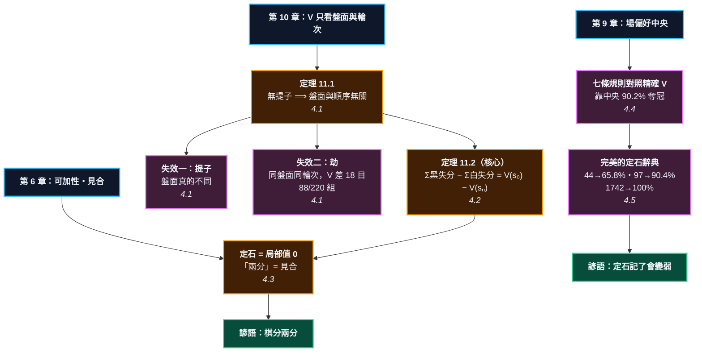

# 第 11 章：定石與布局 —— 為什麼背譜沒用，以及該記什麼

---

## 0. 我們在哪裡

**開始之前你需要具備：**

* 第 6 章 §4.2 的**可加性**（定理 6.4）與 §4.6 的**見合**（定義 6.9）。「兩分」的精確意思就在那裡。
* 第 5 章 §4.6 的**劫破壞可加性**（命題 5.9）。本章 §4.1 會給它一個更狠的版本。
* 第 9 章 §4.5 的**命題 9.4**（場永遠偏好中央）—— 這一章要把那個「缺陷」拿去比賽。
* 第 10 章全部。$V$、$\Delta V$、以及 3 路盤的完全解，是本章所有量測的地基。

**讀完本章後你將能夠：**

* 說出手割到底在做什麼 —— 不是「重排棋子」，是**重新分攤失分**，而且那是一條可以證明的定理。
* 說出「兩分」的精確意思，以及它為什麼幾乎不含資訊。
* 回答「該記什麼」—— 本章把七條規則拿去和精確的 $V$ 比，答案可能會讓你意外。
* 說出一本**完美**的定石辭典最多能準到什麼程度，以及要付出多少記憶量。

---

## 1. 開場思想實驗與掙得的頓悟

### 思想實驗：兩本帳

你和朋友合夥做生意，一年下來虧了十萬。

你們各自記了一本帳。你的帳上寫著：「三月那筆採購虧了八萬，其餘小虧。」朋友的帳上寫著：「全年每個月都小虧一點，加起來十萬。」

**兩本帳的總數一樣。** 但只有第一本告訴你該改什麼。

第二本帳不是錯的 —— 它只是把同一筆損失攤平到看不見。而如果你只有第二本，你會得出「我們沒有犯什麼大錯，只是運氣不好」這個結論。

### 把謎題寫成一個問題

定石說「兩分」。

**兩分是什麼意思？** 如果真的兩分，為什麼選錯定石會輸棋？如果選錯會輸棋，那它就不是兩分。

而更實際的問題是：**背了三百個定石，然後輸給一個不會定石的人 —— 發生了什麼？**

> [!EUREKA]
> **手割不是重排棋子，是重新分攤失分。而那是一條定理。**
>
> 從同一個盤面出發、到達同一個盤面（無提子、無劫）的任意兩個序列，滿足
> $$\sum(\text{黑的失分}) \;-\; \sum(\text{白的失分}) \;=\; V(s_0) - V(s_n)$$
> **右邊只看頭尾。所以左邊與順序無關。** 證明是望遠鏡消去，一行。
>
> 本章在 3 路盤上把它驗到底。同樣四顆子、四種順序：
>
> | 順序 | 每一手的失分 | 黑 | 白 | 黑$-$白 |
> | :--- | :--- | --: | --: | --: |
> | 黑B2 白B3 黑A1 白C2 | $0,\ 0,\ 11,\ 1$ | 11 | 1 | $+10$ |
> | 黑A1 白B3 黑B2 白C2 | $\mathbf{18},\ 8,\ 1,\ 1$ | 19 | 9 | $+10$ |
>
> **總帳一分不差，但第二種順序裡有一手掉 18 目 —— 一看就知道不能下。**
> 第一種順序裡沒有任何一手看起來那麼糟，可是帳是一樣的。
> 這就是手割：**換一本帳，讓那筆大虧現形。**
>
> 至於「兩分」—— 它的精確意思是**局部賽局值為 0**，也就是第 6 章的見合：
> **誰先在那個局部動手誰虧。** 而因為每一個定石都是 $0$，
> **「兩分」這三個字無法區分任何兩個定石** —— 它不告訴你該選哪一個。
> 該選哪一個是全局問題。
>
> 那該記什麼？本章把七條規則拿去和 1,742 個局面的精確解比。
> 贏的不是影響力場（83.4%），也不是跑一百次模擬的 MCTS（77.1%），
> 而是**「下離中央最近的合法點」這條一行的規則：90.2%**。
> 而一本**完美擬合**的定石辭典要記 97 條，才追得平那一句話。

```text
                      第 11 章：兩層手割

    第 10 章：V(s) 只看盤面與輪次，不看你怎麼走到那裡的
                            │
            ┌───────────────┴───────────────┐
            ▼                               ▼
    第一層：盤面版                      第二層：值版（本章核心）
    無提子 ⟹ 盤面只取決於                Σ黑失分 − Σ白失分
    「哪個點放了什麼顏色」                 = V(s₀) − V(sₙ)
            │                               │
            │                               ▼
            │                       重排讓大失分現形
            │                       （18 目 vs 攤平的 11+1）
            ▼
    失效條件                        ┌──────────────────┐
    ① 有提子 → 盤面真的不同           │ 定石 = 局部值 0    │
    ② 有劫   → 盤面一樣，V 差 18 目   │ =「兩分」= 見合    │
                                    │ 幾乎不含資訊       │
                                    └────────┬─────────┘
                                             ▼
                                    該記什麼？
                                    靠中央 90.2%  >  影響力 83.4%
                                    >  MCTS-100 77.1%  >  氣 70.0%
                                    一句話 ≈ 97 條定石
```



---

## 2. 多角度直觀：順序

> [!INTUITION]
> **角度一：手感／實戰透鏡**
>
> 你下棋的時候是有**順序感**的：「這手要先交換」「那手留著以後下」。這種感覺是對的 ——
> 順序在**實戰**上非常重要，因為對手會回應，而不同的順序給對手不同的選擇。
>
> 但手割講的不是那個。手割問的是一個更窄的問題：
> **假設雙方最後就是走到這個盤面，那麼順序還重要嗎？**
>
> 答案是不重要。而那個「不重要」正是它的力量 ——
> 它讓你可以把一個看不懂的序列，換成一個看得懂的序列來評價。

> [!INTUITION]
> **角度二：幾何／形狀透鏡**
>
> 把落子想成往一個集合裡加元素。「黑下 D4」就是把 $(\text{D4}, \text{黑})$ 加進去。
> 加元素這個操作是**可交換**的：先加 $a$ 再加 $b$，和先加 $b$ 再加 $a$，集合一樣。
>
> **提子是唯一的例外** —— 它是「刪除」，而刪除和加入不交換。
>
> 所以整個手割定理可以用一句話記住：**加法可交換，減法不可交換。**
> 有提子就有減法，手割就不能用。

> [!INTUITION]
> **角度三：代數／計算透鏡**
>
> 第 10 章定義了失分 $\Delta V$。沿著一條路走 $n$ 手，把每一手的失分依「誰下的」加總：
>
> $$\sum_i \big[V(s_i) - V(s_{i+1})\big] = V(s_0) - V(s_n)$$
>
> 左邊是望遠鏡級數，中間項全部消掉。而左邊每一項的正負剛好對應「黑失分」與「白失分」：
> 黑走的那一步 $V$ 只會下降或持平，白走的那一步只會上升或持平。於是
>
> $$\boxed{\ \sum(\text{黑失分}) - \sum(\text{白失分}) = V(s_0) - V(s_n)\ }$$
>
> **右邊只認頭尾。** 這就是手割的全部理論內容 —— 一條望遠鏡級數。

> [!BOARD REALITY]
> **角度四：棋盤現實檢查**
>
> **失效一：只有【差】守恆，兩邊各自的總失分不守恆。** 上面那張表裡，
> 一種順序是「黑 11、白 1」，另一種是「黑 19、白 9」。差都是 10，但總量不同。
> 所以手割能告訴你「這個交換對誰有利」，**不能**告訴你「黑總共虧了幾目」。
> 用錯這一點是手割最常見的誤用。
>
> **失效二：有提子就不能用。** §4.1 有一個五手的例子，兩種順序給出**不同的盤面**。
>
> **失效三：有劫就不能用，而且錯得非常兇。** §4.1 會給一個 3 路盤上的例子：
> 同一個盤面、同一方走，$V$ 相差 **18 目**（整個棋盤），差別只在有沒有劫。

---

## 3. 散落的碎片（問題本身）

**第一片：「兩分」沒有定義。** 每本定石書都在說兩分，沒有一本說是相對於什麼、誤差多少。

**第二片：手割看起來像魔法。** 「把這兩手拿掉，變成這個形，你看白虧了」—— 為什麼可以隨便拿掉？沒人說。

**第三片：定石會過時。** 同一個定石，二十年前是好棋，現在 AI 說不好。如果它是「兩分」，怎麼會過時？

**第四片：背了沒用。** 這是最實際的一片。背三百個定石的人，經常打不過完全不背的人。

**第五片：沒有人量過「背譜」的上限。** 「定石要活用」是一句正確的廢話。**活用能提升多少？不背又損失多少？** 沒有數字。

### 新手典型會錯在哪裡

1. **把定石當成「這樣下就對了」。** 定石是局部的均衡，不是全局的最優。
2. **對手不照定石走就慌。** 對手脫離定石通常表示他虧了 —— 而你要能算出虧在哪裡，這正是手割的用途。
3. **記形狀不記條件。** §4.5 會量給你看：記形狀的天花板在哪裡。

---

## 4. 對齊（解答）

### 4.1 手割的第一層：盤面只認集合

> **定理 11.1（手割・盤面版）** 設落子序列 $\pi$ **不含提子**，則最終盤面
> $$B(\pi) = \{(\text{點}, \text{顏色})\}$$
> 只取決於這個集合，與落子的先後順序無關。

**證明。** 沒有提子時，每一手只做一件事：把某個空點設成某個顏色。這些賦值作用在互不相同的點上，因此兩兩可交換。任意重排都得到同一個最終狀態。$\blacksquare$

證明短到近乎無聊。**但它的失效條件不無聊。**

#### 失效一：提子

<!-- diagram: ch11_capture_a -->
```text
     A B C
   3 . . . 3
   2 3 4 . 2
   1 . . 5 1
     A B C
```
*順序甲：黑先放 A1、B1，白再包。白第 5 手提掉黑兩子，角上變空。*

<!-- diagram: ch11_capture_b -->
```text
     A B C
   3 . . . 3
   2 O O . 2
   1 X x O 1
     A B C
```
*順序乙：白先擺好三顆，黑再放。這時黑 A1 是合法的（有 B1 這口氣），但 x 點不合法（自殺）。同樣五手，兩個【不同】的盤面 —— 有提子的時候，手割不能用。*

同樣五顆子、同樣的位置，兩種順序：

* **順序甲**：黑 A1、黑 B1、白 A2、白 B2、白 C1（提掉黑兩子）→ 角上是**空**的。
* **順序乙**：白 A2、白 B2、白 C1、黑 A1（合法）、黑 B1（自殺，不能下）→ 角上有**一顆黑子**。

**加法可交換，減法不可交換。**

#### 失效二：劫（而且錯得更兇）

提子至少會讓你看見盤面不一樣。劫不會 —— **劫讓兩個一模一樣的盤面有不同的值。**

<!-- diagram: ch11_ko_same -->
```text
     A B C
   3 X a X 3
   2 O X . 2
   1 O . X 1
     A B C
```
*輪到白走。這個盤面的 V 是 -9 還是 +9，取決於【a 是不是劫點】。同一個盤面、同一方走，差 18 目（整個棋盤）—— 盤面一樣，局面不一樣。*

$$V = \begin{cases} -9 & \text{沒有劫（白可以下 } a \text{ 提子）} \\ +9 & a \text{ 是劫點（白這一手不能下）}\end{cases}$$

**差 18 目 —— 整個棋盤。**

把 3 路盤上 7 手之內能到的局面全部掃一遍：有 220 組「同一個盤面、同一方走，但劫狀態不同」，其中 **88 組的 $V$ 真的不一樣**。

> [!RECALL]
> **第 5 章 §4.6 的命題 5.9**：劫破壞可加性 —— $V(G_1+G_2) \ne V(G_1)+V(G_2)$。
> 當時的說法是「局部的值在有劫時沒有意義」。
>
> 這裡是同一件事的更強版本：**有劫的時候，「盤面」這個概念本身就不足以決定局面。**
> 你必須額外記住「剛剛發生了什麼」。手割假設盤面決定一切 —— 那個假設在這裡直接破了。

### 4.2 手割的第二層：值版（本章的核心定理）

盤面版只說「重排之後棋子一樣」。那有什麼用？**用處在下一層。**

> **定理 11.2（手割・值版）** 設兩個序列都從 $s_0$ 出發、都到達 $s_n$（同一盤面、同一方輪走），
> 且中途無提子、無劫。則
> $$\sum(\text{黑的失分}) - \sum(\text{白的失分}) = V(s_0) - V(s_n)$$
> 對兩個序列**完全相同**。

**證明。** 把 $V$ 一律由黑的角度看。第 $i$ 手之後盤面從 $s_i$ 變成 $s_{i+1}$：

* 黑走：$V(s_{i+1}) \le V(s_i)$，失分 $= V(s_i) - V(s_{i+1})$。
* 白走：$V(s_{i+1}) \ge V(s_i)$，失分 $= V(s_{i+1}) - V(s_i)$。

兩種情況都可以寫成「黑的失分減白的失分那一項 $= V(s_i) - V(s_{i+1})$」。加總：

$$\sum_i \big[V(s_i) - V(s_{i+1})\big] = V(s_0) - V(s_n)$$

中間項全部消掉。右邊只認頭尾，所以與路徑無關。$\blacksquare$

在 3 路盤上驗到底。四顆子：黑 B2（天元）、黑 A1（角）；白 B3、白 C2。

<!-- diagram: ch11_tewari_good -->
```text
     A B C
   3 . 2 . 3
   2 . 1 4 2
   1 3 . . 1
     A B C
```
*順序甲：黑先佔天元，之後才下角。四顆子的位置和下一張圖【完全一樣】，只有編號不同。每一手的失分：0、0、11、1。*

<!-- diagram: ch11_tewari_bad -->
```text
     A B C
   3 . 2 . 3
   2 . 3 4 2
   1 1 . . 1
     A B C
```
*順序乙：黑第一手就下角。同樣的四顆子，但失分變成 18、8、1、1 —— 第一手掉 18 目，一看就知道不能下。而總帳（黑失分減白失分）和順序甲一模一樣，都是 +10。*

四種合法順序的完整帳本：

<!-- figure: ch11_ledger -->
```text
  順序                      每一手的失分                        黑    白    黑-白
  -----------------------------------------------------------------
  黑B2 白B3 黑A1 白C2         B2+0 B3+0 A1+11 C2+1         11    1    +10
  黑B2 白C2 黑A1 白B3         B2+0 C2+0 A1+11 B3+1         11    1    +10
  黑A1 白B3 黑B2 白C2         A1+18 B3+8 B2+1 C2+1         19    9    +10
  黑A1 白C2 黑B2 白B3         A1+18 C2+8 B2+1 B3+1         19    9    +10

  四種順序的終局盤面：1 種
  四種順序的（黑失分 - 白失分）：+10，四種完全相同
```
*四種順序、同一個終局盤面。最右欄四個都是 $+10$ —— 那是定理 11.2。但左邊那一欄差很多：順序乙的第一手就掉 18 目，順序甲最大的一手只掉 11 目。*

**這就是手割在實戰上的用法。**

假設有人給你一個定石，你看不出好壞。手割告訴你：把它重排成另一個順序。如果重排之後出現一手「一看就知道不能下」的棋 —— 例如第一手就下在角落掉 18 目 —— 那麼**原本那個序列裡也有同樣的虧損**，只是被攤平成 $11+1$，看起來像正常的交換。

$$\textbf{兩本帳的總數一樣，但只有一本告訴你該改什麼。}$$

> [!BOARD REALITY]
> **手割最常見的誤用：以為總量守恆。**
>
> 看表的第三、四欄：順序甲是「黑 11、白 1」，順序乙是「黑 19、白 9」。
> **黑的總失分從 11 變成 19。** 守恆的只有**差**。
>
> 為什麼？因為失分是相對於「從當下這個局面出發的最優下法」算的，
> 而兩種順序經過的中間局面不同。順序乙一開頭就把局面弄糟了，
> 之後雙方都有更多「可以虧」的空間。
>
> 所以手割能回答的是**「這個交換對誰有利」**，不能回答**「黑虧了幾目」**。
> 傳統教材裡「白多下了一手，所以白虧」這種說法，講的正是那個差。

### 4.3 定石 = 局部值 0，也就是「兩分」

> **定義 11.3（兩分）** 一個局部交換是「兩分」，若交換完成後該局部的賽局值為 $0$。

> [!RECALL]
> **第 6 章 §4.6 的定義 6.9（見合）**：$G = 0 \iff$ **後手方必勝**。
> 「值為零」不是「各得一半」，是**誰先在這裡動手誰虧**。

用 CGT 直接驗證：拿第 6 章的走廊 $C(n)$，黑得一個、白得一個鏡像的，和恰好為零。

| 走廊 | 值 $G$ | 溫度 | 均值 | $G + (-G)$ |
| :--- | :--- | --: | --: | :--- |
| $C(1)$ | $*$ | $0$ | $0$ | $\mathbf{0}$ |
| $C(2)$ | $\{*, 1 \mid *, \{2\mid 0\}\}$ | $1/2$ | $1/2$ | $\mathbf{0}$ |
| $C(3)$ | （很長） | $3/4$ | $5/4$ | $\mathbf{0}$ |
| $C(4)$ | （更長） | $7/8$ | $17/8$ | $\mathbf{0}$ |

於是「兩分」有了精確的意思，而它立刻帶來一個不太舒服的推論：

> **推論 11.4** 對每一個真正兩分的定石，局部值都是 $0$。
> 所以**「兩分」這個標籤本身不含資訊** —— 它對所有定石都成立，
> 因此它無法區分任何兩個定石。

這一點要說精確，因為很容易被講過頭。

**不含資訊的是那個標籤，不是那個序列。** 從一個熱的角部局面出發，
通向 $0$ 的路只有少數幾條，其餘的走法都會虧 —— **知道哪幾條是通的，
是真的知識**，而且是要用搜尋才換得到的知識。定石作為一份「已經算好的
主要變化表」，價值是實在的，就像乘法表。

真正沒有資訊的是這三個字。「這個定石兩分」這句話，對每一個定石都成立，
所以它**沒有告訴你該選哪一個**。

而選哪一個是全局問題：

$$\arg\max_a V(G_{\text{局部}} + G_{\text{其餘}}) \ \ne\ \arg\max_a V(G_{\text{局部}})$$

> [!RECALL]
> **第 6 章 §4.2 的定理 6.4（可加性）**：分開算再相加 $=$ 擺在一起整盤算 ——
> **前提是局部互不干擾。**
> 兩邊相等的**充要條件**就是那個前提成立。定石之所以「有時候不成立」，
> 從來不是定石錯了，是**前提不成立**。

> [!PROVERB]
> **「棋分兩分」**
> **它其實在說**：這個局部的賽局值是 $0$（見合）。**不是「雙方各得一半」，
> 是「誰先在這裡動手誰虧」。**
> **失效條件**：值為 $0$ 是**局部**的陳述。一旦這個局部和別處耦合
> （共用一塊棋的死活、共用劫材、影響到同一片模樣），可加性不成立，
> 「兩分」就沒有意義 —— 那時候局部值根本不存在（第 5 章命題 5.9）。

### 4.4 該記什麼：七條規則，一場比賽

抽象講完了。現在來量。

**設定**：3 路盤，4 手之內能到的全部局面 —— **1,742 個**。每個局面用第 10 章的求解器算出所有最佳著。然後讓七條便宜的規則各下一手，看它們選中最佳著的比例、以及平均掉幾目。

| 規則 | 選中最佳著 | 平均失分 | 最大失分 |
| :--- | --: | --: | --: |
| 隨機亂下 | 42.5% | 5.87 | 18 |
| 立刻數子最好（最短視） | 51.1% | 4.06 | 18 |
| MCTS 30 次模擬 | 63.5% | 2.89 | 18 |
| 自己氣最多（第 2 章） | 70.0% | 2.43 | 18 |
| MCTS 100 次模擬 | 77.1% | 1.55 | 18 |
| 影響力最大（第 9 章） | 83.4% | 0.97 | 11 |
| **靠中央（下離中心最近的合法點）** | **90.2%** | **0.63** | 13 |

**贏的是最笨的那一條。**

「下離中央最近的合法點」—— 一句話、不用算氣、不用算場、不用搜尋 —— 打敗了整套影響力場，也打敗了跑一百次模擬的 MCTS。

> [!RECALL]
> **第 9 章 §4.5 的命題 9.4**：影響力場**永遠偏好中央**（42 組 $(n,\lambda)$ 零反例），
> 19 路盤上天元是角落的 2.6 倍。當時這被列為場的**缺陷** ——
> 因為第 2 章的定理 2.11 證明角落最省。
>
> 在 3 路盤上，那個「缺陷」是**正確答案**。而且「靠中央」這條規則
> 只保留了場的偏誤、丟掉了場的全部計算，反而更準（90.2% vs 83.4%）。
>
> **一條規則在哪個盤面上有效，取決於盤面 —— 這正是本章要說的事。**

> [!BOARD REALITY]
> **這個結果不能外推到 19 路盤。**
>
> 3 路盤只有一個天元、沒有「角」可言（第 10 章 §4.2 算過：第一手下角落掉 18 目，
> 和虛手一樣糟）。19 路盤上「全部下中央」是著名的爛棋。
>
> 那這個量測還有什麼意義？意義在**方法**，不在那條規則：
> **一條規則值不值得記，是可以量的。** 只要你有那個盤面的 $V$。
> 19 路盤沒有 $V$，所以那裡的「該記什麼」永遠只能靠統計與經驗 ——
> 而這正是為什麼圍棋教學會有那麼多互相矛盾的口訣。

還有一個數字值得記住：這 1,742 個局面裡，**平均每個局面有 2.6 個最佳著**（最少 1 個、最多 9 個）。

**「唯一正解」通常不唯一。** 覆盤軟體標出的那一手，往往只是排序後的第一個。

### 4.5 一本完美的定石辭典，能有多準？

現在問一個更狠的問題：**如果你的記憶力無限好，背譜的天花板在哪裡？**

**設定**（對背譜最寬容）：記憶者只看得到棋盤的一個窗，窗外一律看不見。定石辭典**直接用同一批資料擬合** —— 也就是說，它是那個窗所能達到的最好結果，而且是在「考題就是練習題」的情況下。

<!-- figure: ch11_dictionary -->
```text
  記憶者看得到                    要記幾條       命中率
  ----------------------------------------
  下面一列 (3 點)                  44     65.8%
  左下角 (4 點)                   97     90.4%
  下面兩列 (6 點)                 383     93.1%
  整個棋盤 (9 點)                1742    100.0%

  （辭典直接用同一批資料擬合 —— 這是對背譜最寬容的設定）
```
*看得越多，準得越多 —— 但要記的條目**指數成長**，命中率只是**慢慢爬**。從 4 點看到 6 點，條目多了四倍（97 → 383），命中率只多了 2.7 個百分點。*

三件事值得注意。

**第一，只有看到整個棋盤才會 100%。** 這是定義上的必然（看到全部就等於知道局面），但它把話說死了：**任何「只看局部」的記憶，天花板都低於 100%。** 不是背得不夠多，是資訊不在窗裡。

**第二，那條一行的規則抵得上 97 條定石。**

$$\textbf{靠中央（一句話）：} 90.2\% \qquad \textbf{左下角辭典（97 條）：} 90.4\%$$

兩者實質相同。**一句話 vs 九十七個形狀。** 而且那 97 條是在考題上訓練出來的最佳值，實戰上只會更差。

**第三，報酬遞減得非常快。** 3 點 $\to$ 4 點：條目 $44 \to 97$（兩倍多），命中率 $65.8\% \to 90.4\%$（大躍進）。4 點 $\to$ 6 點：條目 $97 \to 383$（四倍），命中率 $90.4\% \to 93.1\%$（只多 2.7%）。

> [!BOARD REALITY]
> **哪些部分可以外推到 19 路，哪些不行 —— 要分清楚。**
>
> 上面那張表的**數字**是 3 路盤的，不能外推。3 路盤只有 9 個點，
> 「局部」這個概念幾乎不存在（第 10 章 §4.2 算過：第一手下角落掉 18 目）。
> 真正的定石發生在 19 路盤的角上，而那裡沒有 $V$ 可以對照。
>
> 但表格背後的**機制**是一個計數論證，和盤面大小無關：
>
> * 窗裡每多一個點，可能的局部形狀乘上約 $3$ —— **條目數是指數的**。
> * 命中率的上限是 $100\%$ —— **報酬是有界的**。
> * 一個指數成長、一個有天花板 $\Rightarrow$ **邊際報酬必然遞減**。
>
> 而且第三點在 19 路盤上只會**更強**：19 路的角落窗比 3 路盤大得多，
> 條目數的指數底數一樣是 3，但指數大得多。
>
> **所以可以外推的是「報酬遞減」這個形狀，不是「97 條」這個數字。**
> 本書給不出 19 路盤的那條曲線 —— 那需要 19 路的 $V$，而那不存在。

> [!PROVERB]
> **「定石記了會變弱」**
> **它其實在說**：把記憶花在**形狀**上的邊際報酬遞減得很快（$97 \to 383$ 條只換到 2.7%），
> 而同樣的記憶量花在**規則**上（一句話換 90.2%）划算得多。
> 更糟的是，記形狀的人會在「形狀對但條件不對」時照樣下 ——
> 那是 §4.3 那個 $\arg\max$ 不等式在收帳。
> **失效條件**：這句話**不是**在說定石沒用。真正常見的定石序列是高頻的，
> 記住它們能省下大量計算 —— 就像記乘法表。危險的是**只**記形狀而不記條件，
> 以及在報酬早就遞減的地方繼續背。**記前二十個定石是划算的，記第三百個不是。**

### 4.6 布局：為什麼是角、邊、中

最後回答布局的順序問題，而答案在第 2 章就證完了。

> [!RECALL]
> **第 2 章 §4.5 的定理 2.11**：圍出同樣大的地，所需邊界長度比為
> $$f_{\text{角}} : f_{\text{邊}} : f_{\text{中}} = 1 : \sqrt2 : 2$$
> **角落最便宜，中央要兩倍的成本。** 這是一個定理，不是估計。

所以布局先佔角、再佔邊、最後才進中央 —— 這不是傳統，是**成本排序**。

而「大場 vs 急場」則是第 7 章的溫度問題：

$$\textbf{大場}\ \approx\ \text{溫度高但只關乎目數的局部} \qquad
\textbf{急場}\ \approx\ \text{和死活耦合的局部}$$

> [!RECALL]
> **第 7 章 §4.5 的定理 7.8**：先手 $\iff t(G^L) > T'$。
> 急場之所以「急」，是因為它的後續溫度極高 —— 一旦被對方先佔，
> 那塊棋的死活（第 3 層以下）就出問題，而死活的價值不受溫度遞減規律約束。
> **「大場不如急場」是在說：和死活耦合的局部，不適用純溫度排序。**

但這裡有一個第 10 章給的警告：

**在 3 路盤上，角落是最糟的第一手（掉 18 目，和虛手一樣）。** 定理 2.11 的前提是「有地方可以圍」；3 路盤沒有，整個棋盤就是一個中央。

$$\boxed{\ \textbf{同一條原則，在不同大小的棋盤上可以完全相反。只有 } V \textbf{ 知道現在該用哪一條。}\ }$$

---

## 5. 應用：手算追蹤與非黑盒程式

### 5.1 用手算一遍

手算驗證定理 11.2 —— 不算 $V$ 的內部，只用頭尾兩個數字，把整本帳對平。

**第一步：頭。** 第 10 章 §4.2 算過：

$$V(\text{3 路空盤，黑先}) = +9$$

**第二步：尾。** 四手下完之後的盤面是黑 B2、黑 A1、白 B3、白 C2，輪到黑走。

$$V(s_4) = -1$$

（這是求解器算的；讀者可以用 §5.2 的程式自己跑出來。）

**第三步：套定理 11.2。**

$$\sum(\text{黑失分}) - \sum(\text{白失分}) = V(s_0) - V(s_4) = 9 - (-1) = \mathbf{10}$$

**第四步：對帳。** 回頭看 §4.2 的帳本：

* 順序甲：黑 $11$、白 $1$ $\Rightarrow$ $11 - 1 = 10$ ✓
* 順序乙：黑 $19$、白 $9$ $\Rightarrow$ $19 - 9 = 10$ ✓

**兩本帳，同一個差。**

**第五步：讀出這件事在說什麼。**

$V(s_0)$ 和 $V(s_4)$ 是**兩個數字**，而中間有四手棋。定理 11.2 說：那四手棋怎麼排，都不會改變這兩個數字之間的差。

於是「這個定石對誰有利」這個問題，**根本不需要看那四手棋**。你只要知道起點和終點。

**而順序唯一能改變的，是那 10 目記在哪一手頭上** —— 也就是你看不看得出來。

### 5.2 用程式驗一遍

```python
"""第 11 章 §4.1、§4.2：手割的兩層，以及它的兩個失效條件。"""
import sys
sys.setrecursionlimit(100000)

import itertools

from go_core import BLACK, WHITE, Board, format_coord, opposite
from go_core.minimax import Solver
from go_core.tewari import play_sequence, stone_set, tewari_equal

solver = Solver(komi=0.0, max_ply=15)

# --- 定理 11.1：無提子時，順序不影響盤面 ---
A = [(BLACK, "B2"), (WHITE, "B3"), (BLACK, "A1"), (WHITE, "C2")]
B = [(BLACK, "A1"), (WHITE, "C2"), (BLACK, "B2"), (WHITE, "B3")]
r = tewari_equal(A, B, n=3)
print(f"  無提子的兩種順序，盤面相同嗎：{r['same']}")
print(f"  有提子嗎：{bool(r['captures_a'] or r['captures_b'])}")
assert r["same"] and not r["captures_a"] and not r["captures_b"]

# --- 失效一：有提子時，順序會改變盤面 ---
C = [(BLACK, "A1"), (BLACK, "B1"), (WHITE, "A2"), (WHITE, "B2"), (WHITE, "C1")]
D = [(WHITE, "A2"), (WHITE, "B2"), (WHITE, "C1"), (BLACK, "A1"), (BLACK, "B1")]
r2 = tewari_equal(C, D, n=3)
print(f"\n  有提子的兩種順序，盤面相同嗎：{r2['same']}")
print(f"    順序 C 提子：{[(i, co) for i, _, co, _ in r2['captures_a']]}")
print(f"    順序 D 不合法的手：{r2['illegal_b']}")
print(f"    只有 D 有的子：{r2['only_b']}")
assert not r2["same"]
assert r2["captures_a"] and r2["illegal_b"]

# --- 定理 11.2：失分的差與順序無關 ---
def walk(seq):
    b, steps = Board(3), []
    for colour, coord in seq:
        before = solver.search(b, colour)[0]
        t = b.copy()
        assert not t.play(colour, coord), "這個例子必須無提子"
        after = solver.search(t, opposite(colour))[0]
        loss = (before - after) if colour == BLACK else (after - before)
        steps.append((colour, coord, loss))
        b = t
    return steps, b

print("\n  四顆子的所有順序：")
diffs, finals = set(), set()
for bo in itertools.permutations(["B2", "A1"]):
    for wo in itertools.permutations(["B3", "C2"]):
        seq = [(BLACK, bo[0]), (WHITE, wo[0]), (BLACK, bo[1]), (WHITE, wo[1])]
        steps, final = walk(seq)
        lb = sum(l for c, _, l in steps if c == BLACK)
        lw = sum(l for c, _, l in steps if c == WHITE)
        diffs.add(lb - lw)
        finals.add(final.grid.tobytes())
        order = " ".join(f"{'黑' if c == BLACK else '白'}{p}" for c, p in seq)
        worst = max(steps, key=lambda s: s[2])
        print(f"    {order:<24} 黑{lb:>3.0f} 白{lw:>3.0f} 差{lb - lw:>+4.0f}"
              f"   最大單手失分 {worst[1]} 掉 {worst[2]:.0f}")

assert len(finals) == 1, "四種順序必須到達同一個盤面"
assert diffs == {10.0}, diffs
print(f"\n  終局盤面 {len(finals)} 種、差 {sorted(diffs)} —— 定理 11.2 成立")

# 望遠鏡：差 = V(頭) - V(尾)
v0 = solver.search(Board(3), BLACK)[0]
fin = Board(3)
fin.place_many(BLACK, ["B2", "A1"])
fin.place_many(WHITE, ["B3", "C2"])
v4 = solver.search(fin, BLACK)[0]
print(f"  V(空盤) - V(終局) = {v0:+.0f} - ({v4:+.0f}) = {v0 - v4:+.0f}")
assert v0 - v4 == 10.0
```

**輸出裡該看什麼。** 最後三行。$V(\text{空盤}) - V(\text{終局}) = 9 - (-1) = 10$，而四種順序的「黑失分減白失分」都是 $10$。**望遠鏡級數在棋盤上收斂成兩個數字。**

> **配套範例腳本**：`examples/ch11_joseki/ex01_tewari.py`

### 5.3 該記什麼：讓規則去比賽

```python
"""第 11 章 §4.4：七條規則對照 1,742 個局面的精確解。（約需一分鐘）"""
import sys
sys.setrecursionlimit(100000)

import random

from go_core import BLACK, Board
from go_core.minimax import legal_moves
from go_core.tewari import (policy_centre, policy_greedy_score,
                            policy_influence, policy_liberties,
                            reachable_states, score_policy, solve_all)

states = reachable_states(3, 4)
print(f"  4 手之內可達的局面：{len(states)} 個")
table, solver = solve_all(states, n=3)
print(f"  非終局局面：{len(table)} 個（每個都算出【所有】最佳著）")

def policy_random(seed=0):
    rng = random.Random(seed)
    def fn(board, to_move, ko=None):
        opts = [p for p, _, _ in legal_moves(board, to_move, ko)]
        return rng.choice(opts) if opts else None
    return fn

print(f"\n  {'規則':<14}{'選中最佳著':>12}{'平均失分':>11}")
scores = {}
for name, pol in [("隨機亂下", policy_random(1)),
                  ("立刻數子最好", policy_greedy_score),
                  ("自己氣最多", policy_liberties),
                  ("影響力最大", policy_influence),
                  ("靠中央", policy_centre)]:
    r = score_policy(table, pol, n=3)
    scores[name] = r
    print(f"  {name:<14}{r['hit_rate']:>12.1%}{r['mean_loss']:>11.2f}")

# 最笨的那一條贏了
assert scores["靠中央"]["hit_rate"] > scores["影響力最大"]["hit_rate"]
assert scores["靠中央"]["hit_rate"] > 0.9
assert scores["隨機亂下"]["hit_rate"] < 0.5
print("\n  「靠中央」一句話，打敗整套影響力場。")

# 「唯一正解」通常不唯一
counts = [len(best) for best, _ in table.values()]
print(f"  平均每個局面有 {sum(counts) / len(counts):.1f} 個最佳著"
      f"（最少 {min(counts)}、最多 {max(counts)}）")
assert max(counts) > 1
```

**輸出裡該看什麼。** 倒數第二行的斷言：`靠中央 > 影響力最大`。第 9 章花了一整章建構、量測、並證明其極限的那個場，在這裡輸給了它自己的一句話摘要。**模型的複雜度和它的用處，第三次沒有關係**（前兩次是第 8 章的虎、第 9 章的 Bouzy）。

> **配套範例腳本**：`examples/ch11_joseki/ex02_what_to_memorise.py`

---

## 6. 練習與完整解答

### 基礎練習

#### 練習 11.1

<!-- diagram: ch11_ex1 -->
```text
     A B C
   3 . . 3 3
   2 . 1 . 2
   1 2 . . 1
     A B C
```
*練習 11.1：三手棋。把它重排成【白先下 A1】的順序，並回答：重排之後合法嗎？如果不合法，說明手割為什麼在這裡失效。*

<details>
<summary><b>解答</b></summary>

原序列：黑 B2、白 A1、黑 C3。重排成：白 A1、黑 B2、黑 C3？

**不行 —— 那不是合法的重排。**

手割要求重排之後**雙方的著手數不變、而且仍然交替**。原序列是黑、白、黑（黑兩手、白一手）。任何重排都必須維持黑兩手、白一手，而且是黑先。可能的重排只有：

* 黑 B2、白 A1、黑 C3（原本的）
* 黑 C3、白 A1、黑 B2

兩者都合法，而且到達同一個盤面（無提子，定理 11.1）。

**這一題的重點是手割的一個常被忽略的前提：手數必須相同。**

傳統教材的手割會說「把這兩手拿掉」—— 那看起來像在減少手數，其實不是。正確的操作是把**雙方各一手**同時拿掉（或同時加上），這樣輪次才對得上。**拿掉黑一手而不拿掉白一手，比較的就不是同一件事了。**

$$\textbf{手割的三個前提：無提子、無劫、雙方手數各自不變。}$$

```python
from go_core import BLACK, WHITE
from go_core.tewari import tewari_equal

A = [(BLACK, "B2"), (WHITE, "A1"), (BLACK, "C3")]
B = [(BLACK, "C3"), (WHITE, "A1"), (BLACK, "B2")]
r = tewari_equal(A, B, n=3)
print(f"  合法的重排，盤面相同嗎：{r['same']}")
assert r["same"] and not r["captures_a"]

# 顏色數量必須一致才談得上重排
from collections import Counter
assert Counter(c for c, _ in A) == Counter(c for c, _ in B)
print("  黑白各自的手數：", dict(Counter(c for c, _ in A)))
print("  手割的前提：無提子、無劫、雙方手數各自不變。")
```
</details>

#### 練習 11.2

<!-- diagram: ch11_ex2 -->
```text
     A B C
   3 . O . 3
   2 O X a 2
   1 b X c 1
     A B C
```
*練習 11.2：輪到黑走。a、b、c 哪些是最佳著？先用「靠中央」這條規則猜，再用求解器核對。*

<details>
<summary><b>解答</b></summary>

**先猜。** 「靠中央」看的是離中心 B2 的距離。B2 已經有子，剩下的空點裡：

$$a = \text{C2}: \text{距離 } 1 \qquad b = \text{A1}: \text{距離 } 2 \qquad c = \text{C1}: \text{距離 } 2$$

規則說：**下 a（C2）**。

**再核對。** 求解器給出（黑走，貼目 0）：

| 著手 | $V$ | 失分 |
| :--- | --: | --: |
| **a = C2** | $+9$ | $0$ |
| **b = A1** | $+9$ | $0$ |
| c = C1 | $-1$ | $10$ |
| C3 | $-3$ | $12$ |
| 虛手 | $-3$ | $12$ |

**規則猜對了** —— C2 確實是最佳著之一，黑可以拿走整個棋盤。

**但這一題真正的重點在 b。**

$b = \text{A1}$ 是一個**角**，離中央最遠。「靠中央」這條規則把它排在最後，
可是它和 C2 一樣好。**規則找到了一個正解，卻完全看不見另一個。**

這正是 §4.4 那張表要小心解讀的地方：90.2% 的命中率是「**選中某一個**最佳著」的比例。
它不代表那條規則理解了局面 —— 只代表它夠常撞對。而 §4.4 也量過：
**平均每個局面有 2.6 個最佳著**，所以「撞對」比想像中容易。

$$\boxed{\ \textbf{一條規則的命中率高，不表示它的排序是對的。}\ }$$

實戰上的翻譯：便宜的規則適合用來**產生候選**，不適合用來**排除候選**。
你可以用「靠中央」找出第一個要算的點，但不能因為某手離中央遠就不算它。

```python
import sys
sys.setrecursionlimit(100000)

from go_core import BLACK, WHITE, Board, format_coord
from go_core.minimax import move_values
from go_core.tewari import policy_centre

b = Board(3)
b.place_many(BLACK, ["B2", "B1"])
b.place_many(WHITE, ["B3", "A2"])

guess = policy_centre(b, BLACK)
print(f"  「靠中央」猜：{format_coord(guess, 3)}")

vals = move_values(b, BLACK, komi=0.0, max_ply=15)
best = vals[0][1]
for p, v in vals:
    name = format_coord(p, 3) if p else "虛手"
    print(f"    {name:<5} V = {v:+.0f}   失分 {best - v:>2.0f}")

winners = {p for p, v in vals if v == best}
assert guess in winners                              # 規則猜對了
assert len(winners) == 2                             # 但最佳著有兩個
assert b._pt("C2") in winners and b._pt("A1") in winners
# 而「靠中央」給 A1 的評價嚴格低於 C2
dist = lambda p: abs(p[0] - 1) + abs(p[1] - 1)
assert dist(b._pt("C2")) == 1 and dist(b._pt("A1")) == 2
assert dist(b._pt("A1")) == max(dist(p) for p, _ in vals if p is not None)
print(f"\n  最佳著有 {len(winners)} 個："
      f"{sorted(format_coord(p, 3) for p in winners)}")
print("  其中 A1 是角 —— 離中央最遠，規則把它排在最後，卻和 C2 一樣好。")
print("  命中率高 != 排序正確。規則適合產生候選，不適合排除候選。")
```
</details>

#### 練習 11.3

<!-- diagram: ch11_ex3 -->
```text
     A B C
   3 X a X 3
   2 O X . 2
   1 O . X 1
     A B C
```
*練習 11.3：輪到白走。白下 a 提掉黑一子。如果 a 是劫點（白剛剛才被提），白不能下 —— 算出兩種情況的 V，並解釋差距為什麼是整個棋盤。*

<details>
<summary><b>解答</b></summary>

$$V(\text{沒有劫}) = -9 \qquad V(a \text{ 是劫點}) = +9$$

**差 18 目 —— 整個棋盤易主，而盤面上一顆子都沒有動。**

**為什麼差這麼多？** 因為 3 路盤太小，唯一一塊棋的死活就是全局的死活。白下 $a$ 能提子並活下來，就贏全盤；不能下，就輸全盤。19 路盤上一個劫通常只值幾目到幾十目，這裡值整個棋盤 —— **同一個機制，尺度不同。**

**它對手割的意義。** 定理 11.1 說「盤面只取決於棋子集合」。這裡兩個局面的棋子集合**完全相同**、輪走的人也相同，$V$ 卻差 18 目。

$$\textbf{所以「盤面」不足以決定局面。你還得知道剛剛發生了什麼。}$$

把 3 路盤 7 手之內可達的局面全掃一遍：有 220 組「同盤面、同輪次、劫狀態不同」，其中 **88 組（40%）的 $V$ 真的不同**。這不是罕見的邊角情況。

> [!RECALL]
> **第 5 章 §4.1 的命題 5.2**：劫就是狀態圖裡的環。而環的存在表示
> **狀態不等於盤面** —— 你需要歷史才能決定現在能走哪些棋。
> 第 10 章 §4.1 用同一件事說明 Zermelo 需要 superko；
> 這裡用它說明手割需要「無劫」。**三章，同一個環。**

**實戰上的翻譯**：任何牽涉到劫的定石變化，**不能用手割分析**。傳統教材裡的手割例子幾乎都刻意避開有劫的變化 —— 那不是巧合，是必要條件。

```python
import sys
sys.setrecursionlimit(100000)

from go_core import BLACK, WHITE, Board, format_coord
from go_core.minimax import Solver

b = Board(3)
b.place_many(BLACK, ["A3", "C3", "B2", "C1"])
b.place_many(WHITE, ["A2", "A1"])
solver = Solver(komi=0.0, max_ply=15)

v_free, mv = solver.search(b, WHITE, ko=None)
v_ko, _ = solver.search(b, WHITE, ko=b._pt("B3"))
print(f"  沒有劫：   V = {v_free:+.0f}   白的最佳著 = "
      f"{format_coord(mv, 3) if mv else '虛手'}")
print(f"  B3 是劫點：V = {v_ko:+.0f}")
print(f"  差 {abs(v_ko - v_free):.0f} 目 —— 整個棋盤")

assert v_free == -9 and v_ko == 9
assert abs(v_ko - v_free) == 18
# 兩個局面的棋子完全一樣
from go_core.tewari import stone_set
assert stone_set(b) == stone_set(b)
print("\n  棋子集合完全相同、輪走的人相同，V 差 18 目。")
print("  「盤面」不足以決定局面 —— 手割在有劫時失效。")
```
</details>

#### 練習 11.4

§4.5 的辭典表裡，從「4 點」到「6 點」，條目從 97 條漲到 383 條，命中率只從 90.4% 爬到 93.1%。

(a) 為什麼條目數漲得比命中率快這麼多？
(b) 如果把窗開到 8 點（只差一點沒看到全盤），你預期命中率是多少？
(c) 這對「該背幾個定石」有什麼實際建議？

<details>
<summary><b>解答</b></summary>

**(a) 條目數是指數的，資訊是次可加的。**

窗裡每多一個點，可能的局部形狀就乘上大約 3（空／黑／白）。所以條目數大致是 $3^k$ 級數的成長（實際上小一些，因為很多形狀到不了）：

$$3 \text{ 點} \to 44 \qquad 4 \text{ 點} \to 97 \qquad 6 \text{ 點} \to 383 \qquad 9 \text{ 點} \to 1742$$

而命中率的**上限是 100%**，所以它只能爬 $65.8 \to 100$ 這 34 個百分點。**一個指數成長、一個有天花板 —— 邊際報酬必然遞減。**

更精確地說：多看一個點帶來的資訊，和它**是否影響最佳著**有關。3 路盤上大部分的點對某個特定局部的最佳著沒有影響，所以多記那些形狀是白費。

**(b) 高，但不會是 100%。實測是 97.8%。**

只要窗小於全盤，就存在兩個局面窗內相同、窗外不同、而最佳著不同 —— 那時候辭典必錯其一。

實測：8 點的窗（只漏掉一個角）要記 **1,115 條**，命中率 **97.8%**。

**注意那個代價**：從 6 點到 8 點，條目從 383 漲到 1,115（快三倍），命中率只從 93.1% 爬到 97.8%。而最後那 2.2%，需要再記 627 條（漲到 1,742）才拿得到。**最後一哩路最貴。**

**(c) 建議是明確的：記高頻的，不記低頻的。**

把上面的曲線翻譯成實戰：

| 你花的記憶量 | 換到什麼 |
| :--- | :--- |
| 前 20 個最常見的定石 | 大部分對局能直接用，省下大量計算 |
| 第 20 到 100 個 | 報酬明顯遞減 |
| 第 100 個以後 | 幾乎沒有報酬，而且會誘發「形狀對條件不對」的錯 |

而**同樣的記憶量花在原則上**（「角比邊便宜、邊比中央便宜」「厚勢不圍空」「兩眼才活」「大的先下」）**報酬高得多**，因為原則不會因為對手下了一手你沒背過的棋就失效。

$$\boxed{\ \textbf{記憶花在「條目數指數成長」的東西上，是最差的投資。}\ }$$

```python
import sys
sys.setrecursionlimit(100000)

from collections import Counter, defaultdict

from go_core.tewari import _board_from_key, reachable_states, solve_all

states = reachable_states(3, 4)
table, _ = solve_all(states, n=3)

WINDOWS = [("3 點", [(2, 0), (2, 1), (2, 2)]),
           ("4 點", [(1, 0), (1, 1), (2, 0), (2, 1)]),
           ("6 點", [(1, 0), (1, 1), (1, 2), (2, 0), (2, 1), (2, 2)]),
           ("8 點", [(r, c) for r in range(3) for c in range(3)
                     if (r, c) != (0, 2)]),
           ("9 點", [(r, c) for r in range(3) for c in range(3)])]

print(f"  {'窗':<6}{'條目數':>8}{'命中率':>10}{'每多一條買到':>14}")
prev, rates = None, []
for name, win in WINDOWS:
    winset = set(win)
    groups = defaultdict(list)
    for key, (best, _v) in table.items():
        board, colour, _ko = _board_from_key(key, 3)
        groups[(tuple(int(board.grid[p]) for p in win), colour)].append(best)
    hits = total = 0
    for members in groups.values():
        counter = Counter()
        for best in members:
            inside = [p for p in best if p in winset]
            if inside:
                for p in inside:
                    counter[p] += 1
            else:
                counter[None] += 1
        memorised = counter.most_common(1)[0][0]
        for best in members:
            total += 1
            inside = {p for p in best if p in winset}
            hits += (not inside) if memorised is None else (memorised in best)
    rate = hits / total
    gain = "—" if prev is None else f"{(rate - prev[1]) / (len(groups) - prev[0]) * 1e4:.1f}"
    print(f"  {name:<6}{len(groups):>8}{rate:>10.1%}{gain:>14}")
    rates.append((len(groups), rate))
    prev = (len(groups), rate)

print("\n  最右欄是「每多記一條，命中率多幾個萬分點」——")
print("  它一路遞減。條目數指數成長，命中率卻有 100% 的天花板。")

assert rates[0] == (44, 0.6582089552238806) or rates[0][0] == 44
sizes = [n for n, _ in rates]
hits = [r for _, r in rates]
assert sizes == sorted(sizes) and hits == sorted(hits)   # 兩者都遞增
assert hits[-1] == 1.0 and sizes[-1] == 1742             # 看全盤才 100%
assert hits[1] > 0.9 and sizes[1] < 100                  # 4 點：97 條就有九成
# 邊際報酬遞減：每多一條買到的命中率一路變小
marginal = [(hits[i + 1] - hits[i]) / (sizes[i + 1] - sizes[i])
            for i in range(len(rates) - 1)]
assert marginal == sorted(marginal, reverse=True), marginal
print(f"  每多記一條買到的命中率：{[f'{m*1e4:.1f}' for m in marginal]}（萬分點，遞減）")
```
</details>

---

## 7. 本章頓悟總結

* **手割有兩層。** 第一層（定理 11.1）：無提子時，盤面只取決於棋子集合 —— 因為**加法可交換**。第二層（定理 11.2，本章核心）：
  $$\sum(\text{黑失分}) - \sum(\text{白失分}) = V(s_0) - V(s_n)$$
  右邊只認頭尾，所以左邊與順序無關。證明是望遠鏡級數，一行。
* **手割真正的用途是重新分攤失分。** 同樣四顆子，一種順序記成「黑 11、白 1」，另一種記成「黑 19、白 9」—— 差都是 $+10$，但後者有一手掉 **18 目**，一看就知道不能下。**兩本帳的總數一樣，只有一本告訴你該改什麼。**
* **守恆的只有「差」，不是各自的總量。** 這是手割最常見的誤用。它能回答「這個交換對誰有利」，不能回答「黑虧了幾目」。
* **三個失效條件**：有提子（盤面真的不同）、有劫（盤面相同但 $V$ 差 18 目，3 路盤上 88/220 組如此）、雙方手數改變。
* **「兩分」= 局部賽局值為 0 = 見合**：不是「各得一半」，是**誰先在那裡動手誰虧**。而因為每個定石都是 $0$，**這三個字無法區分任何兩個定石**。序列本身有價值（通向 $0$ 的路只有幾條，那是搜尋換來的知識），沒價值的是「兩分」這個標籤 —— 該選哪一個定石是全局問題，取決於可加性（第 6 章定理 6.4）成不成立。
* **該記什麼？量出來了。** 1,742 個局面對照精確解：**「下離中央最近的合法點」90.2%**，打敗影響力場（83.4%）、MCTS 100 次（77.1%）、氣最多（70.0%）。**模型的複雜度和它的用處，第三次沒有關係。**
* **一本完美擬合的定石辭典**：記 44 條 $\to$ 65.8%，97 條 $\to$ 90.4%，383 條 $\to$ 93.1%，1742 條（等於看全盤）$\to$ 100%。**條目數指數成長，命中率有天花板。** 而那 97 條，抵不過一句話。
* **「唯一正解」通常不唯一**：平均每個局面有 **2.6 個**最佳著。
* **布局的角 $\to$ 邊 $\to$ 中，是第 2 章的定理 2.11**（成本比 $1:\sqrt2:2$），不是傳統。但 3 路盤上完全相反 —— **同一條原則在不同大小的棋盤上可以顛倒，只有 $V$ 知道現在該用哪一條。**

**接下來。** 這一章反覆撞到同一堵牆：局部的結論，要靠「局部真的獨立」才成立。而圍棋裡最不獨立的東西，就是**一塊沒活淨的棋**。

第 12 章要處理攻擊與治孤 —— 那是第 2 層（死活）和第 3 層（溫度）**直接耦合**的地方。攻擊之所以難算，是因為被攻的那塊棋同時出現在兩個帳本上：它的死活值不受溫度遞減規律約束，而它的存亡又改變周圍每一個局部的溫度。**「大場不如急場」的精確版本，就在那裡。**
