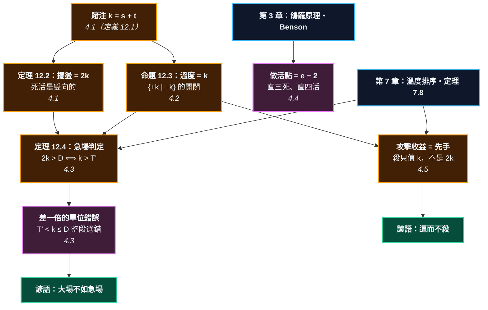

# 第 12 章：攻擊與治孤 —— 死活與溫度的耦合

---

## 0. 我們在哪裡

**開始之前你需要具備：**

* 第 3 章 §4.3 的**鴿籠原理**與 §4.4 的 **Benson 無條件活**（定理 3.10）。這一章會讓鴿籠原理第五次上場。
* 第 6 章 §4.2 的**可加性**（定理 6.4）—— 以及它什麼時候不成立。
* 第 7 章 §4.2 的**溫度**、§4.4 的**出入 vs 見合**（定理 7.6）、§4.6 的**溫度排序**（策略 7.9）。
* 第 10 章的 $V$ 與 $\Delta V$，以及中國規則的數子。

**讀完本章後你將能夠：**

* 算出一塊棋的**賭注**，並說出為什麼它的死活值是賭注的**兩倍**。
* 說出「大場不如急場」到底在修正什麼 —— 答案是一個**差一倍的單位錯誤**。
* 從**做活點的個數**推導「直三死、直四活」，而不是背它。
* 說出攻擊的收益結算在哪一層，以及「逼而不殺」為什麼是正常的。

---

## 1. 開場思想實驗與掙得的頓悟

### 思想實驗：追一隻你追不上的兔子

你在草原上追一隻兔子。你跑得比牠慢，而且你知道你追不上。

**你為什麼還在追？**

因為只要你在追，兔子就得一直跑。牠沒空吃草、沒空回窩、沒空做任何別的事。而你 —— 你一邊跑，一邊可以順路把沿途的果子摘了。

**追兔子的收益不在兔子身上，在你追的時候順手摘到的東西。**

而這裡有一個關鍵條件：**兔子必須真的怕你。** 如果牠知道你追不上而且不在乎，牠就會停下來吃草，那你就白跑了。

### 把謎題寫成一個問題

「攻擊」如果不是為了殺，那是為了什麼？

高手說「攻擊是為了得利」。這句話所有人都聽過，但**那個「利」在哪裡結算？** 棋盤上又沒有一個叫「利」的欄位。

而更實際的問題是那句最有名、也最難用的諺語：**「大場不如急場」。** 大場我算得出來（出入 20 目），急場算不出來（「那塊棋有點薄」）。**兩個數字不在同一個單位上，我要怎麼比？**

> [!EUREKA]
> **一塊未定的棋，價值是它目數的【兩倍】—— 而人們系統性地只算一倍。**
>
> 一塊棋的**賭注** $k = s + t$（自己的子數 $s$ 加上它圍住的空點 $t$）。
> 活了，這 $k$ 點是你的；死了，同樣這 $k$ 點變成對方的。所以
> $$\textbf{死活的擺盪} = 2k \qquad (\text{定理 12.2，本章逐格數子驗證})$$
> 「死活是雙向的」這句話，數學上就是那個 $2$。
>
> **而這個 $2$ 正是「大場不如急場」在修正的東西。** 大場習慣用**出入**報價
> （$D = 2T'$，第 7 章定理 7.6），一塊薄棋卻常常只被數成「大概十幾目」——
> 一個用兩倍的單位、一個用一倍的單位。正確的比較是
> $$\text{急場} \iff 2k > D \iff k > T'$$
> 用一倍去比（$k > D$），你會在 $T' < k \le D$ **這一整段區間裡選錯** ——
> 而那正是實戰上最常出現的區間。
>
> 更好的消息是：這條判定式**不是新原則**。未定塊的局部賽局是
> $\{+k \mid -k\}$，溫度恰好 $k$（本章驗證）。所以「急場先於大場」
> 就是第 7 章的**溫度排序**（策略 7.9），一個字都不用多學。
>
> 至於做活 —— 「直三死、直四活」也不必背。一條長 $e$ 的眼位，
> **做活點恰好 $e-2$ 個**（本章窮舉驗證），而攻方**一手只佔得住一個**。
> 所以 $e \ge 4$ 就活。鴿籠原理，本書第五次。
>
> 那攻擊呢？**攻擊的收益結算在第 3 層，不在第 2 層。**
> 未定塊的溫度是 $k$；只要 $k > T'$，對手就**必須應**（第 7 章定理 7.8）。
> 你賺的是那些「他必須應」的回合裡，你在別處免費拿到的東西 ——
> 就像追兔子時順路摘的果子。而殺掉牠只值 $k$，不是 $2k$：
> **擺盪是 $2k$，但先手只拿得到一半。**

```text
              第 12 章：兩個帳本在同一塊棋上打架

   第 2 層（死活）                        第 3 層（溫度）
   離散：活 或 死                          連續：溫度遞減
   不受溫度排序約束                         大的先下
        │                                      │
        └──────────────┬───────────────────────┘
                       ▼
              一塊未定的棋 —— 兩本帳都記它
                       │
        ┌──────────────┼──────────────────┐
        ▼              ▼                  ▼
   賭注 k = s+t    擺盪 = 2k          溫度 = k
   （它值多少）    （定理 12.2）      （所以可以和大場比）
                       │                  │
                       └────────┬─────────┘
                                ▼
                  急場 ⟺ 2k > D ⟺ k > T'
                  用一倍算，在 T' < k ≤ D 整段選錯
                                │
        ┌───────────────────────┴────────────────────┐
        ▼                                            ▼
   做活點 = e − 2 個                         攻擊的收益 = 先手
   攻方一手佔一個                             殺只值 k，不是 2k
   ⟹ 直三死、直四活                          ⟹ 逼而不殺是正常的
```



---

## 2. 多角度直觀：一塊未定的棋

> [!INTUITION]
> **角度一：手感／實戰透鏡**
>
> 你看到自己有一塊薄棋，會覺得「不安」。那個不安是對的 —— 但它常常被**低估**。
>
> 原因很具體：你看著那塊棋，心裡數的是「它大概值十幾目」。那是**它活著的價值**。
> 但你真正該問的是「它死掉我會差多少」—— 而那是**兩倍**。
>
> 人在估自己的損失時傾向只算「失去的」，忘了同時「對方得到的」。
> 這一章的第一件事就是把那個 $2$ 補回去。

> [!INTUITION]
> **角度二：幾何／形狀透鏡**
>
> 死活是**離散**的。一塊棋不會「活了 0.7」—— 它要嘛活要嘛死。
>
> 而官子是**連續**的：溫度平滑地遞減，每一手的價值一點一點變小。
>
> 兩者放在同一個棋盤上，就出現本章的核心張力：**一個不連續的量，
> 要怎麼和一個連續的量比大小？**
>
> 答案是把離散的那個包裝成一個賽局：$\{+k \mid -k\}$。
> 這個開關的溫度是 $k$ —— **於是它有了一個可以和大場比較的數。**
> 這正是第 6、7 章那一整套機器存在的理由。

> [!INTUITION]
> **角度三：代數／計算透鏡**
>
> 三個數，一條不等式：
>
> $$k = s + t \qquad \text{擺盪} = 2k \qquad t(G) = k$$
> $$\textbf{急場} \iff k > T'$$
>
> 注意 $t(G) = k$ 這一條讓整件事變得平凡：**未定塊的溫度就是它的賭注。**
> 所以你不需要「急場」這個新概念 —— 它只是溫度特別高的一個局部，
> 而第 7 章早就說了「先下最熱的」。
>
> **本章沒有發明新原則，只是把一個算不出來的量算了出來。**

> [!BOARD REALITY]
> **角度四：棋盤現實檢查**
>
> **失效一：$\{+k \mid -k\}$ 是一個粗糙的模型。** 它假設「一手定死活」。
> 真實的薄棋往往要好幾手才定型，中間還有各種先手交換。
> 這個模型抓得到**量級**，抓不到細節。本章凡是用到它的地方都會標出來。
>
> **失效二：$t$（圍住的空點）在開闊的地方沒有定義。** 一塊在中腹逃跑的孤棋，
> 它「圍住」多少空點？沒有答案。本章的賭注只在**被包圍的棋**上算得準；
> 逃跑中的棋只能估。
>
> **失效三：厚薄的價值不在賭注裡。** 一塊棋死了，你不只失去 $2k$ ——
> 對方還得到一堵牆。那筆帳在第 9 章，而第 9 章已經說過它算不清。
> 所以 $2k$ 是**下界**，不是全部。

---

## 3. 散落的碎片（問題本身）

**第一片：「厚」「薄」沒有數字。** 大場可以報價「這裡出入 20 目」，薄棋只能說「有點危險」。

**第二片：兩個量不同單位。** 就算你給薄棋估一個數，那個數是「活著值多少」還是「死了差多少」？差一倍，而且沒人講清楚。

**第三片：「攻擊是為了得利」，但利在哪結算？** 棋譜上看得到棋子，看不到「利」。

**第四片：死活題被當成題庫。** 直三死、直四活、板六活、盤角曲四 —— 一堆要背的結論。

**第五片：「逼而不殺」聽起來像藉口。** 殺不掉的時候才這樣講嗎？還是它真的比較好？

### 新手典型會錯在哪裡

1. **只算自己的損失，不算對方的收穫。** 這就是那個少掉的 $2$。
2. **為了殺而殺。** 花五手去殺一塊值 8 的棋，而每手在別處值 10。
3. **對手不理你的攻擊就慌。** 對手不應，通常表示那塊棋沒你想的那麼重要 —— 或者你的攻擊沒你想的那麼兇。$k$ 和 $T'$ 誰大，是可以算的。

---

## 4. 對齊（解答）

### 4.1 賭注與擺盪：那個少掉的 2

<!-- diagram: ch12_weak -->
```text
     A B C D E F G H J
   9 . . . . . . . . . 9
   8 . . . . . . . . . 8
   7 . . + . . . + . . 7
   6 . . . . . . . . . 6
   5 O O . . + . . . . 5
   4 X X O . . . . . . 4
   3 . X O . . . + . . 3
   2 . X O . . . . . . 2
   1 . X O . . . . . . 1
     A B C D E F G H J
```
*一塊還沒定的黑棋。子數 5、圍住的空點 3，賭注 8。黑先下就活、白先下就死 —— 它同時記在兩個帳本上：死活（第 2 層）與溫度（第 3 層）。*


> **定義 12.1（賭注）** 一塊棋 $S$ 的賭注
> $$k(S) = \underbrace{|S|}_{s\ \text{子數}} + \underbrace{|\text{它圍住的空點}|}_{t\ \text{目數}}$$
> 「它圍住的空點」= 只碰得到 $S$ 的空連通區塊。

上圖的黑棋：$s = 5$、$t = 3$，所以 $k = 8$。

現在問：**這塊棋的死活值多少？**

直覺說 8 —— 那是它活著能拿到的。**直覺少算了一半。**

> **定理 12.2（死活的擺盪）** 一塊賭注為 $k$ 的棋，活與死之間相差
> $$\boxed{\ \text{擺盪} = 2k\ }$$

**證明。** 用中國規則數子。活了，那 $s+t$ 個點屬於我；死了，同樣那 $s+t$ 個點被對方佔據，屬於對方。我的地減對方的地，這一項從 $+k$ 變成 $-k$。$\blacksquare$

<!-- diagram: ch12_alive -->
```text
     A B C D E F G H J
   9 . . . . . . . . . 9
   8 . . . . . . . . . 8
   7 . . + . . . + . . 7
   6 . . . . . . . . . 6
   5 O O . . + . . . . 5
   4 X X O . . . . . . 4
   3 . X O . . . + . . 3
   2 X X O . . . . . . 2
   1 . X O . . . . . . 1
     A B C D E F G H J
```
*黑先，下在唯一的做活點 A2。眼位被切成 A1 與 A3 兩個真眼 —— Benson 無條件活（第 3 章定理 3.10）。*


<!-- diagram: ch12_dead -->
```text
     A B C D E F G H J
   9 . . . . . . . . . 9
   8 . . . . . . . . . 8
   7 . . + . . . + . . 7
   6 . . . . . . . . . 6
   5 O O . . + . . . . 5
   4 X X O . . . . . . 4
   3 . X O . . . + . . 3
   2 O X O . . . . . . 2
   1 . X O . . . . . . 1
     A B C D E F G H J
```
*換白先下同一點。剩下 A1 與 A3 兩個孤立的點，而它們都不是真眼 —— 黑死。同一個點、兩種結局，這就是 16 目的擺盪。*


**同一個點 A2，黑下就活、白下就死，差 16 目。**

本書不套公式 —— `life_swing()` 真的把兩種結局各數一次子再相減。八種眼位大小，全部相符：

<!-- figure: ch12_swing -->
```text
     眼位    子數 s    目數 t    賭注 s+t      實際擺盪   2(s+t)    溫度 t(G)
  --------------------------------------------------------------
      1       3       1         4         8        8          4
      2       4       2         6        12       12          6
      3       5       3         8        16       16          8
      4       6       4        10        20       20         10
      5       7       5        12        24       24         12
      6       8       6        14        28       28         14
      7       9       7        16        32       32         16
      8      10       8        18        36       36         18

  擺盪永遠是賭注的兩倍；未定塊的溫度永遠等於賭注、均值為 0。
```
*八種眼位大小，逐格數子。第五欄（實際數出來的擺盪）和第六欄（$2(s+t)$）完全一致 —— 定理 12.2 不是估計。最後一欄先擺著，下一節會用到。*

> [!RECALL]
> **第 7 章 §4.4 的定理 7.6**：$\text{deiri} = 2 \times \text{miai}$，也就是
> **出入計算是見合計算的兩倍**。當時的說明是「同一手棋兩種報價法」。
>
> 這裡的 $2$ 是**同一個 2**。死活的擺盪就是這塊棋的**出入值**，
> 而它的溫度（見合值）是 $k$。兩章、兩個脈絡、同一個因子 ——
> 因為兩者都在數「從我手上到對方手上」這件事。

### 4.2 未定塊的溫度，恰好是它的賭注

現在把死活裝進第 6 章的框架。

> **命題 12.3（未定塊的溫度）** 若一塊棋「我先下就活、對手先下就死」，
> 它所在的局部就是開關
> $$G = \{\,+k \mid -k\,\}$$
> 依第 7 章命題 7.3，$t(G) = k$、$m(G) = 0$。

**未定塊的溫度就是它的賭注。**

上面那張表的最後一欄就是驗證：八種大小，$t(G)$ 每一格都等於 $k$，均值每一格都是 $0$。

這件事看起來平凡，但它做到了一件關鍵的事：**它把一個離散的死活問題，換算成一個可以和大場比大小的溫度。**

$$\text{離散的「活或死」} \ \longrightarrow\ \text{一個叫「溫度」的數}$$

> [!RECALL]
> **第 6 章 §4.6 的定義 6.9**：$G = 0$ 是**見合**（後手勝）。
> 而這裡 $m(G) = 0$ —— 均值也是零。
>
> 兩個「零」意思完全不同，不要混。$G = 0$ 是「這個局部沒人想先下」；
> $m(G) = 0$ 是「雙方輪流下到底，平均落在零」，而 $t(G) = k$ 很大，
> 表示**兩個人都非常想先下**。**均值為零的局部可以燙得要命。**

### 4.3 「大場不如急場」修正的是一個單位錯誤

有了溫度，比較就變成算術。

> **定理 12.4（急場判定式）** 設全局最大的大場出入為 $D$（也就是溫度 $T' = D/2$），
> 一塊未定的棋賭注為 $k$。則
> $$\textbf{急場（該先補／先攻）} \iff 2k > D \iff k > T'$$

**證明。** 這不是新定理 —— 它就是第 7 章的溫度排序（策略 7.9）：先下溫度最高的。
未定塊的溫度是 $k$（命題 12.3），大場的溫度是 $T' = D/2$。比大小而已。$\blacksquare$

在第 7 章的機器上跑一遍：一個未定塊（溫度 $k$）加三個大場（溫度 10、7、4），問貪婪法先下哪裡：

| 賭注 $k$ | 最大大場 $T'$ | $k > T'$ | 貪婪先下 | 貪婪 $=$ 最優？ |
| --: | --: | :--- | :--- | :--- |
| 4 | 10 | 否 | 大場 | ✓ |
| 8 | 10 | 否 | 大場 | ✓ |
| 10 | 10 | 平手 | 急場 | ✓ |
| 12 | 10 | **是** | **急場** | ✓ |
| 20 | 10 | **是** | **急場** | ✓ |

**沒有例外，而且貪婪法在這裡就是最優解。** 「大場不如急場」在數學上什麼也沒多說。

**那這句諺語為什麼還有必要存在？**

因為人們比較的時候**用錯了單位**。

<!-- figure: ch12_units -->
```text
  大場出入 D = 20 目（也就是全局溫度 T' = 10）

      賭注 k       正確的價碼 2k      正確決定      只數一倍      弄錯了嗎
  -------------------------------------------------------
         4              8        大場        大場          
         6             12        大場        大場          
         8             16        大場        大場          
        10             20        大場        大場          
        12             24        急場        大場         是
        14             28        急場        大場         是
        16             32        急場        大場         是
        18             36        急場        大場         是
        20             40        急場        大場         是
        22             44        急場        急場          

  只要賭注落在 10 < k <= 20 這一段，用一倍算就會選錯 ——
  這一段有 5 格，而它正是實戰上最常出現的區間。
```
*大場習慣用**出入**報價（$D$），薄棋卻常常只被數成「活著值多少」（$k$，一倍）。兩個單位差兩倍，於是在整整一段區間裡選錯 —— 而且錯的方向永遠一樣：**低估急場**。*

$$\boxed{\ \textbf{「大場不如急場」= 請你把薄棋的價碼乘二再比。}\ }$$

> [!PROVERB]
> **「大場不如急場」**
> **它其實在說**：$2k > D$。而人們容易只比 $k > D$ —— 差一個因子 2，
> 於是在 $T' < k \le D$ 這一整段裡都會選錯，而且永遠錯向同一邊（低估急場）。
> 諺語之所以只說「不如」而不說數字，是因為說數字要先有 $k$ 和 $D$，
> 而傳統上沒有人算 $k$。
> **失效條件一**：$k$ 只在**被包圍**的棋上算得準。中腹逃跑的孤棋沒有 $t$，
> 這條判定式就退化成估計。
> **失效條件二**：$2k$ 是**下界**。一塊棋死了，對方還多一堵牆（第 9 章那筆
> 算不清的帳）。所以判定式偏向保守 —— 它說是急場，那多半真的是。

### 4.4 做活點：直三死、直四活是數出來的

現在處理死活題那一堆要背的結論。

<!-- diagram: ch12_three -->
```text
     A B C D E F G H J
   9 . . . . . . . . . 9
   8 . . . . . . . . . 8
   7 . . + . . . + . . 7
   6 . . . . . . . . . 6
   5 O O . . + . . . . 5
   4 X X O . . . . . . 4
   3 . X O . . . + . . 3
   2 a X O . . . . . . 2
   1 . X O . . . . . . 1
     A B C D E F G H J
```
*眼位長 3（直三）。做活點只有 a 一個 —— 白先手佔住它，黑就死了。「直三死」不是要背的口訣，是做活點只有 3 - 2 = 1 個。*


<!-- diagram: ch12_four -->
```text
     A B C D E F G H J
   9 . . . . . . . . . 9
   8 . . . . . . . . . 8
   7 . . + . . . + . . 7
   6 O O . . . . . . . 6
   5 X X O . + . . . . 5
   4 . X O . . . . . . 4
   3 b X O . . . + . . 3
   2 a X O . . . . . . 2
   1 . X O . . . . . . 1
     A B C D E F G H J
```
*眼位長 4（直四）。做活點有 a、b 兩個 —— 白一手只佔得住一個，黑佔另一個就活。「直四活」= 做活點 4 - 2 = 2 個 + 鴿籠原理。*


> **定義 12.5（做活點）** 空點 $p$ 是 $S$ 的**做活點**，若在 $p$ 落一子之後
> $S$ 立刻成為 Benson 無條件活。

把眼位從 1 到 7 全部窮舉：

<!-- figure: ch12_eyespace -->
```text
     眼位 e      做活點數  = e - 2 ?      守方先手      攻方先手
  --------------------------------------------------
        1         0       True         死         死
        2         0       True         死         死
        3         1       True         活         死
        4         2       True         活         活
        5         3       True         活         活
        6         4       True         活         活
        7         5       True         活         活

  做活點恰好 e - 2 個。攻方一手只佔得住一個，所以
  e >= 4（做活點 >= 2）時攻方先手也殺不掉 —— 直三死、直四活。
```
*一條長 $e$ 的眼位，做活點恰好 $e-2$ 個（就是兩端以外的每一點）。第四、五欄是 AND-OR 搜尋算出來的實際死活。*

於是那張要背的表，變成一個計數：

$$e \le 2:\ \text{做活點 } 0 \Rightarrow \textbf{死}$$
$$e = 3:\ \text{做活點 } 1 \Rightarrow \textbf{誰先下誰贏（直三死）}$$
$$e \ge 4:\ \text{做活點 } \ge 2 \Rightarrow \textbf{活（直四活）}$$

**這裡要精確一點：上面三行的「$\Rightarrow$」是【驗證過的等價】，不是【證完的推導】。**

程式跑的是 AND-OR 搜尋，對 $e = 1$ 到 $7$ 逐一確認

$$\textbf{攻方先手殺得掉} \iff \text{做活點} \le 1$$

七種大小無一例外。而鴿籠原理給的是**機制的直覺**：攻方一手只佔得住一個做活點，
所以兩個以上就顧不過來。

**但那還不算完整的證明** —— 因為攻方那顆子不只「佔掉一個點」，它同時**改變了眼位的形狀**，
所以攻方下完之後剩幾個做活點，不是簡單的 $e - 3$。要補完這一步，得追蹤眼位在
每一手之後怎麼重新切分。本書把它留在「已驗證的等價」這個位置，而不假裝證完了。

> [!RECALL]
> **第 3 章 §4.3 的鴿籠原理**：一手只能下一個點。
> 這是它在本書第五次上場（前四次：兩眼定理、接不歸、雙打、倒撲）。
>
> 這次的用法是：**攻方要殺，必須讓做活點歸零；但他一手只佔得住一個，
> 而守方同時也在做活。** 所以做活點 $\ge 2$ 時守方活得成。
>
> 「眼位要寬」這句話，量化之後就是：**眼位每長一格，做活點就多一個，
> 而攻方永遠只有一手。**

> [!BOARD REALITY]
> **這張表只涵蓋【一條直線】的眼位。**
>
> 真實的眼位有各種形狀：曲四、丁四、方四、板六、盤角曲四……
> 而其中有些的做活點數**不等於** $e-2$（方四是最有名的例子：
> 四個點的眼位，做活點是 0，因為它是「有眼殺無眼」那類的形狀）。
>
> **所以 $e-2$ 是直線眼位的公式，不是通則。** 但方法是通則：
> **算做活點的個數，再和「攻方一手」比。** 那個方法對任何形狀都適用，
> 而 `vital_points()` 對任何形狀都跑得動 —— 練習 12.4 會用它算方四。

### 4.5 攻擊的收益，結算在第 3 層

最後回到開場那隻兔子。

**先把「殺」的價碼算清楚。** 未定塊是開關 $\{+k \mid -k\}$，均值 $0$。你先下拿到 $+k$，
相對於均值賺了 $k$。

$$\boxed{\ \textbf{殺掉它，你賺 } k\textbf{，不是 } 2k\ }$$

$2k$ 是**擺盪**（從最好到最壞的全距），$k$ 是**先手能拿到的那一半**。
把擺盪當成收益，是本章第二個差一倍的錯誤。

**再算成本。** 殺它要花 $d$ 手，而那 $d$ 手本來每一手在別處值 $T'$。所以：

> **判準 12.6（該不該去殺／該不該救）** 值得投入 $\iff k > d \cdot T'$。
>
> 這是**啟發式，不是定理**：它假設對手不會因為你的投入而額外獲利，
> 也忽略了攻防過程本身製造的厚勢（第 9 章那筆算不清的帳）。

**於是「逼而不殺」就有了解釋。**

殺掉他值 $k$，而且要花 $d$ 手。**但只要那塊棋還沒定，它的溫度就是 $k$；
只要 $k > T'$，對手就必須應你在那裡的每一手**（第 7 章定理 7.8）。

那些「他必須應」的回合裡，你可以在別處下一手值 $T'$ 的棋，而他沒空去下。

$$\textbf{攻擊的收益} = \sum_i (\text{第 } i \text{ 次先手換到的東西}) \ \approx\ m \cdot T'$$

**這筆錢結算在第 3 層（溫度），不在第 2 層（死活）。** 棋子沒被提，但帳已經進來了。

> [!RECALL]
> **第 7 章 §4.5 的定理 7.8**：先手 $\iff t(G^L) > T'$。
> 「先手」不是一種棋的性質，是一種**關係** —— 它取決於別處有多熱。
>
> 攻擊做的事，就是**人為地把一個局部的溫度抬到 $T'$ 以上**。
> 而一塊薄棋的溫度是 $k$，所以「這塊棋夠不夠薄」和「我攻得動嗎」
> 是同一個問題：$k$ 和 $T'$ 誰大。

> [!PROVERB]
> **「逼而不殺」**
> **它其實在說**：殺只值 $k$ 而且要花 $d$ 手；不殺的話，那塊棋維持未定，
> 溫度一直是 $k > T'$，於是你可以反覆用先手，每次換走別處值 $T'$ 的東西。
> **當 $m \cdot T' > k - d\,T'$ 時，逼而不殺勝過殺。**
> **失效條件一**：這要求對手**真的必須應**。他一旦活淨（或決定棄掉），
> 溫度就歸零，你的先手全部作廢 —— 兔子停下來吃草了。
> **失效條件二**：反過來也成立。**當被攻方的先手價值超過攻方的**，
> 攻擊會反轉 —— 你追兔子追到自己的後院著火。這就是「攻擊的一方也會崩潰」。

> [!BOARD REALITY]
> **本節是全章證據最弱的一節，要說清楚。**
>
> §4.1 到 §4.4 每一條都有窮舉驗證。**這一節沒有。**
>
> 原因是 $\{+k \mid -k\}$ 這個模型抓不到「逼而不殺」的核心 ——
> 它假設一手就定死活，而真實的攻擊是一連串**不**定死活的交換。
> 要把它算清楚，需要為每塊薄棋建一棵完整的局部賽局樹，
> 而那超出本書工具鏈的能力（第 10 章：4 路盤就已經解不完）。
>
> 所以判準 12.6 與上面那條「$m T' > k - dT'$」都標 🟡：
> **它們是量級估計，不是定理。** 可以用來檢查自己的判斷有沒有差一個數量級，
> 不能用來精算。而 §4.1–§4.4 的三條（擺盪、溫度、做活點）是 🟢。

### 4.6 分斷為什麼那麼兇：兩塊棋要活兩次

最後一件事，也是攻擊真正的技術核心。

一塊棋要活，需要兩個眼。**兩塊棋要活，需要四個眼** —— 而且是兩組各自獨立的兩個眼。
分斷之所以是最強的攻擊手段，就是因為它把「一次死活」變成「兩次死活」。

<!-- diagram: ch12_connected -->
```text
     A B C D E F G H J
   9 . . . . . . . . . 9
   8 . . . . . . . . . 8
   7 . . + . . . + . . 7
   6 O O . . . . . . . 6
   5 X X O . + . . . . 5
   4 . X O . . . . . . 4
   3 . X O . . . + . . 3
   2 . X O . . . . . . 2
   1 . X O . . . . . . 1
     A B C D E F G H J
```
*連在一起的一塊，眼位 4（A1-A4）。做活點兩個，白先手也殺不掉。*


<!-- diagram: ch12_split -->
```text
     A B C D E F G H J
   9 O O . . . . . . . 9
   8 . X O . . . . . . 8
   7 . X O . . . + . . 7
   6 X X O . . . . . . 6
   5 O O . . + . . . . 5
   4 O O . . . . . . . 4
   3 X X O . . . + . . 3
   2 . X O . . . . . . 2
   1 . X O . . . . . . 1
     A B C D E F G H J
```
*同樣的子數被切成兩塊，各自只剩兩點眼位。兩塊的做活點都是 0 —— 兩塊【都死】。連接不是防守的一種，它常常就是防守本身。*


兩張圖的黑子數量差不多，眼位空間也差不多。差別只有**連不連在一起**：

| | 眼位 | 做活點 | 白先手 |
| :--- | --: | --: | :--- |
| **連在一起** | 4（一片） | 2 | **殺不掉** |
| **被切成兩塊** | 2 + 2 | 0 + 0 | **兩塊都死** |

**同樣的空間，連著就活，斷開就全死。**

原因回到 §4.4 的計數：做活點是 $e - 2$ 個，而這個式子對 $e$ 是**超可加**的 ——
把一片 $e$ 切成 $e_1 + e_2$，做活點從 $e - 2$ 變成

$$(e_1 - 2) + (e_2 - 2) = e - 4$$

**切一刀，做活點直接少兩個。** 而 $e = 4$ 時 $e - 4 = 0$，剛好歸零。

> [!RECALL]
> **第 2 章 §4.2 的定義 1.2**：棋串是圖上的連通分量。
> **第 8 章 §4.3 的接不歸**：兩個接點，一手只接得了一個。
>
> 這裡是同一件事在死活上的後果。連通性不只影響氣（第 2 章）、
> 不只影響手筋（第 8 章）—— 它決定你要做**幾組**眼。
> 而每多一組，就多一次可能失敗的機會。

> [!PROVERB]
> **「棋從斷處生」**
> **它其實在說**：斷開之後做活點少兩個（$e-4$ 而不是 $e-2$），
> 而且兩塊棋各自都要湊滿兩個眼。攻擊的價值幾乎全部來自這一刀 ——
> 不是因為斷開的子會被吃，是因為**死活的次數從一次變成兩次**。
> **失效條件**：如果兩塊各自都已經很寬（$e_1, e_2 \ge 4$），斷開只是讓對方
> 多花一手，不會死。這時候那一刀反而可能是**送對方加固**的惡手 ——
> 判斷的依據還是 $e_1 - 2$ 和 $e_2 - 2$ 這兩個數。

---

## 5. 應用：手算追蹤與非黑盒程式

### 5.1 用手算一遍

手算 §4.1 那塊黑棋的賭注與擺盪，然後判斷它是不是急場。假設別處最大的大場出入 $D = 20$ 目。

**第一步：數子。**

黑棋是 B1、B2、B3、B4、A4 —— 五顆。

$$s = 5$$

**第二步：數它圍住的空點。**

A1、A2、A3 三個點。檢查它們是不是只碰得到這塊黑棋：

* A1 的鄰點：A2（空）、B1（黑）✓
* A2 的鄰點：A1、A3（空）、B2（黑）✓
* A3 的鄰點：A2（空）、A4（黑）、B3（黑）✓

沒有一個碰到白子或別塊黑棋。

$$t = 3$$

**第三步：賭注與擺盪。**

$$k = s + t = 5 + 3 = 8 \qquad \text{擺盪} = 2k = \mathbf{16}$$

**第四步：和大場比。**

$$2k = 16 \quad \text{vs} \quad D = 20$$

$$16 < 20 \ \Longrightarrow\ \textbf{先佔大場}$$

（用判定式的另一個寫法核對：$k = 8$，$T' = D/2 = 10$，$8 < 10$ ✓ 同樣的答案。）

**第五步：讀出這件事在說什麼。**

如果你**只數一倍**（拿 $k = 8$ 去和 $D = 20$ 比），你也會選大場 —— 這次剛好沒錯。

**但把大場換成出入 12 目的呢？** 正確算法：$2k = 16 > 12$，**該補棋**。
只數一倍：$8 < 12$，**去佔大場** —— **錯了。**

$$\textbf{同一塊棋、同一個人，換一個大場就從對變成錯。} $$

這就是為什麼需要那句諺語：錯誤不是隨機的，它**只在某一段區間裡發生**，
而那一段（$T' < k \le D$）剛好是實戰上最常見的。

### 5.2 用程式驗一遍

```python
"""第 12 章 §4.1、§4.2：賭注、擺盪、以及未定塊的溫度。"""
import sys
sys.setrecursionlimit(100000)

from go_core import BLACK, WHITE, Board, find_string, format_coord
from go_core.attack import (as_switch, enclosed_empties, is_urgent,
                            life_swing, stake)
from go_core.temperature import mean, temperature


def corridor_group(e, n=9):
    """眼位長 e 的一塊黑棋，四周被白包住。"""
    b = Board(n)
    b.place_many(BLACK, [f"B{r}" for r in range(1, e + 2)] + [f"A{e + 1}"])
    b.place_many(WHITE, [f"C{r}" for r in range(1, e + 2)]
                 + [f"B{e + 2}", f"A{e + 2}"])
    return b, find_string(b, "B1")


# --- §4.1 的那塊棋 ---
b, S = corridor_group(3)
region = enclosed_empties(b, S)
print(f"  子數 s = {len(S)}")
print(f"  圍住的空點 t = {len(region)}："
      f"{sorted(format_coord(p, 9) for p in region)}")
print(f"  賭注 k = {stake(b, S)}")
print(f"  實際數出來的擺盪 = {life_swing(b, S)}")
assert len(S) == 5 and len(region) == 3
assert stake(b, S) == 8
assert life_swing(b, S) == 2 * stake(b, S) == 16

# --- 定理 12.2：八種大小逐一驗證，不套公式 ---
print(f"\n  {'眼位':>5}{'賭注 k':>9}{'實際擺盪':>10}{'2k':>6}{'溫度':>7}")
for e in range(1, 9):
    bb, SS = corridor_group(e, n=13)
    k, sw = stake(bb, SS), life_swing(bb, SS)
    G = as_switch(bb, SS)
    print(f"  {e:>5}{k:>9}{sw:>10}{2 * k:>6}{str(temperature(G)):>7}")
    assert sw == 2 * k                       # 定理 12.2
    assert temperature(G) == k               # 命題 12.3
    assert mean(G) == 0                      # 均值為零，但燙得要命

# --- §4.3 的急場判定 ---
print()
for D in [20, 12]:
    urgent, k, margin = is_urgent(b, S, D // 2)
    verdict = "補棋（急場）" if urgent else "佔大場"
    naive = "補棋（急場）" if k > D else "佔大場"
    print(f"  大場出入 D = {D}：正確 -> {verdict:<12} 只數一倍 -> {naive}")
assert is_urgent(b, S, 10)[0] is False       # D = 20：該佔大場
assert is_urgent(b, S, 6)[0] is True         # D = 12：該補棋
print("  換一個大場，同一塊棋就從「不急」變成「急」。")
```

**輸出裡該看什麼。** 中間那張表的兩個斷言：`sw == 2 * k` 和 `temperature(G) == k`。
第一個是死活的擺盪，第二個是它換算成溫度之後的值。**同一塊棋，兩個數，差一倍** ——
而整章的實用價值就在別把它們搞混。

> **配套範例腳本**：`examples/ch12_attack/ex01_stake_and_swing.py`

### 5.3 做活點：把死活題推導出來

```python
"""第 12 章 §4.4：直三死、直四活，是數出來的。"""
import sys
sys.setrecursionlimit(100000)

from go_core import BLACK, WHITE, Board, find_string, format_coord
from go_core.attack import can_kill, life_distance, vital_points


def corridor_group(e, n=9):
    b = Board(n)
    b.place_many(BLACK, [f"B{r}" for r in range(1, e + 2)] + [f"A{e + 1}"])
    b.place_many(WHITE, [f"C{r}" for r in range(1, e + 2)]
                 + [f"B{e + 2}", f"A{e + 2}"])
    return b, find_string(b, "B1")


print(f"  {'眼位 e':>7}{'做活點':>22}{'個數':>6}{'e-2':>5}"
      f"{'守方先手':>10}{'攻方先手':>10}")
for e in range(1, 8):
    b, S = corridor_group(e)
    vp = vital_points(b, S, BLACK)
    names = sorted(format_coord(p, 9) for p in vp)
    d, _ = life_distance(b, S, BLACK, max_moves=2)
    killed = can_kill(b, S, BLACK, max_moves=3)
    print(f"  {e:>7}{str(names):>22}{len(vp):>6}{max(0, e - 2):>5}"
          f"{('活' if d else '死'):>10}{('死' if killed else '活'):>10}")
    assert len(vp) == max(0, e - 2)          # 做活點恰好 e - 2 個

# 鴿籠原理：做活點 >= 2 就殺不掉
for e in range(1, 8):
    b, S = corridor_group(e)
    n_vital = len(vital_points(b, S, BLACK))
    killed = can_kill(b, S, BLACK, max_moves=3)
    assert killed == (n_vital <= 1), (e, n_vital, killed)
print("\n  攻方先手殺得掉 <=> 做活點 <= 1 <=> e <= 3")
print("  一手只佔得住一個做活點 —— 鴿籠原理，本書第五次。")
```

**輸出裡該看什麼。** 最後那個迴圈的斷言：`killed == (n_vital <= 1)`。
**「攻方殺得掉」和「做活點只剩一個」是同一件事**，七種大小無一例外。

直三死、直四活不是兩條要背的結論，是 $e-2$ 這個計數穿過鴿籠原理之後的兩個特例。

> **配套範例腳本**：`examples/ch12_attack/ex02_vital_points.py`

---

## 6. 練習與完整解答

### 基礎練習

#### 練習 12.1

<!-- diagram: ch12_ex1 -->
```text
     A B C D E F G H J
   9 . . . . . . . . . 9
   8 . . . . . . . . . 8
   7 . . + . . . + . . 7
   6 . . . . . . . . . 6
   5 . . . . + . . . . 5
   4 O O . . . . . . . 4
   3 X X O . . . + . . 3
   2 . X O . . . . . . 2
   1 . X O . . . . . . 1
     A B C D E F G H J
```
*練習 12.1：眼位長 2。算出這塊棋的賭注與死活擺盪，並回答：它有幾個做活點？為什麼這塊棋不管誰先下都一樣？*


<details>
<summary><b>解答</b></summary>

**數子。** 黑棋是 B1、B2、B3、A3 —— 四顆。它圍住的空點是 A1、A2 —— 兩個。

$$s = 4, \quad t = 2, \quad k = 6, \quad \text{擺盪} = 2k = \mathbf{12}$$

**做活點：0 個。** 依 §4.4 的公式 $e - 2 = 2 - 2 = 0$。

直接驗證也一樣：黑下 A1 之後只剩 A2 一個眼；黑下 A2 之後只剩 A1 一個眼。
**兩點的眼位做不出兩個眼。**

**為什麼誰先下都一樣？**

因為這塊棋**已經死了**。它不是「未定」的，它是「已定」的 —— 定在死那一邊。

這一點很重要，而且它讓 §4.2 的模型露出邊界：

$$\{+k \mid -k\} \ \textbf{只適用於【未定】的棋。}$$

一塊已經死的棋，它的局部值不是開關，是一個**數**：$-k$（對方已經拿到了）。
依第 6 章定理 6.7，數的溫度是 0 —— **它一點都不急。**

$$\textbf{已經死的棋不是急場。已經活的棋也不是。急場只存在於「未定」。}$$

實戰上的翻譯：確認一塊棋死透了之後，就**不要再去補它**，也不要再去殺它 ——
那裡的溫度是零。初學者最常見的浪費之一，就是花好幾手去「加強」一塊已經死的棋。

```python
import sys
sys.setrecursionlimit(100000)

from go_core import BLACK, WHITE, Board, find_string, format_coord
from go_core.attack import (can_kill, enclosed_empties, life_distance,
                            life_swing, stake, vital_points)

b = Board(9)
b.place_many(BLACK, ["B1", "B2", "B3", "A3"])
b.place_many(WHITE, ["C1", "C2", "C3", "B4", "A4"])
S = find_string(b, "B1")

region = enclosed_empties(b, S)
print(f"  s = {len(S)}, t = {len(region)}"
      f"（{sorted(format_coord(p, 9) for p in region)}）")
print(f"  賭注 k = {stake(b, S)}   擺盪 = {life_swing(b, S)}")
print(f"  做活點：{vital_points(b, S, BLACK)}（{len(vital_points(b, S, BLACK))} 個）")
assert (len(S), len(region)) == (4, 2)
assert stake(b, S) == 6 and life_swing(b, S) == 12
assert vital_points(b, S, BLACK) == []           # e - 2 = 0

# 誰先下都一樣：黑先也活不了，白先當然殺得掉
d, _ = life_distance(b, S, BLACK, max_moves=3)
print(f"  黑先，三手之內活得了嗎：{d}")
print(f"  白先殺得掉嗎：{can_kill(b, S, BLACK, max_moves=3)}")
assert d is None
assert can_kill(b, S, BLACK, max_moves=3)
print("\n  已經死的棋不是急場 —— 它的局部是一個【數】，溫度為 0。")
```
</details>

#### 練習 12.2

<!-- diagram: ch12_ex2 -->
```text
     A B C D E F G H J
   9 . . . . . . . . . 9
   8 . . . . . . . . . 8
   7 . . + . . . + . . 7
   6 . . . . . . . . . 6
   5 O O . . + . . . . 5
   4 X X O . . . . . . 4
   3 . X O . . . + . . 3
   2 . X O . . . . . . 2
   1 . X O . . . . . . 1
     A B C D E F G H J
```
*練習 12.2：這塊棋的賭注是 8。棋盤別處最大的大場出入 20 目。該先補這塊棋，還是先佔大場？先用直覺答，再用判定式算。*


<details>
<summary><b>解答</b></summary>

$$k = 8, \qquad D = 20, \qquad T' = D/2 = 10$$

$$2k = 16 \ <\ 20 = D \qquad\Longrightarrow\qquad \textbf{先佔大場}$$

**但這個答案很脆弱，而那才是重點。**

把大場換成出入 $D = 14$：

$$2k = 16 \ >\ 14 \qquad\Longrightarrow\qquad \textbf{先補棋}$$

**臨界點在 $D = 2k = 16$。** 大場超過 16 目就先佔大場，不到 16 目就先補棋。

**三件值得記住的事。**

**一、臨界值是 $2k$，不是 $k$。** 如果你用 $k = 8$ 當臨界值，你會在 $D$ 介於
8 和 16 之間時全部選錯 —— 那是一段八目寬的區間。

**二、$2k$ 是下界。** 這塊棋死掉的話，白不只多 16 目，還多一堵朝右的牆。
所以真正的臨界值比 16 高一些 —— 判定式偏向「先佔大場」，也就是**偏向危險的那一邊**。
實戰上該把它當成一個保守的門檻：**它說該補，就一定該補；它說不用補，還要再想想。**

**三、$D$ 會下降。** 隨著棋局進行，最大的大場越來越小（第 7 章的溫度遞減），
而 $k$ 不變。所以**同一塊棋會隨著時間從「不急」變成「急」** ——
這正是「棋越下越要小心薄棋」的來源，不是心理作用。

```python
import sys
sys.setrecursionlimit(100000)

from go_core import BLACK, WHITE, Board, find_string
from go_core.attack import is_urgent, life_swing, stake

b = Board(9)
b.place_many(BLACK, [f"B{r}" for r in range(1, 5)] + ["A4"])
b.place_many(WHITE, [f"C{r}" for r in range(1, 5)] + ["B5", "A5"])
S = find_string(b, "B1")

k = stake(b, S)
print(f"  賭注 k = {k}，擺盪 2k = {life_swing(b, S)}")
print(f"\n  {'大場出入 D':>12}{'T = D/2':>10}{'2k vs D':>12}{'該下哪裡':>12}")
for D in [24, 20, 18, 16, 14, 10]:
    urgent, _, _ = is_urgent(b, S, D / 2)
    cmp = f"{2*k} {'>' if 2*k > D else '<' if 2*k < D else '='} {D}"
    print(f"  {D:>12}{D/2:>10}{cmp:>12}{('補棋' if urgent else '佔大場'):>12}")

assert is_urgent(b, S, 10)[0] is False       # D = 20 -> 佔大場
assert is_urgent(b, S, 7)[0] is True         # D = 14 -> 補棋
# 臨界點就在 D = 2k
assert is_urgent(b, S, k - 0.5)[0] is True
assert is_urgent(b, S, k + 0.5)[0] is False
print(f"\n  臨界點在 D = 2k = {2*k}。用 k = {k} 當門檻，"
      f"會在 D 介於 {k} 和 {2*k} 之間時全部選錯。")
```
</details>

### 實戰練習

#### 練習 12.3

<!-- diagram: ch12_ex3 -->
```text
     A B C D E F G H J
   9 . . . . . . . . . 9
   8 . . . . . . . . . 8
   7 . . + . . . + . . 7
   6 O O . . . . . . . 6
   5 X X O . + . . . . 5
   4 . X O . . . . . . 4
   3 . X O . . . + . . 3
   2 . X O . . . . . . 2
   1 . X O . . . . . . 1
     A B C D E F G H J
```
*練習 12.3：直四。白先手殺得掉嗎？把做活點的個數和鴿籠原理連起來，說明為什麼。*


<details>
<summary><b>解答</b></summary>

**殺不掉。**

**做活點有兩個**：$e - 2 = 4 - 2 = 2$，實際算出來是 A1 和 A2。

**鴿籠原理的論證：**

1. 白要殺，必須讓黑的做活點歸零。
2. 白一手只下得了一個點。
3. 白下掉其中一個做活點之後，**黑立刻下另一個**。
4. 黑活。

具體走一遍：白 A2 → 黑 A1？不對，白 A2 之後剩下的空間是 A1 和 A3、A4。
黑下 A3 → 眼位切成 {A4} 和被白佔住的那一帶……

**這正是為什麼要用程式而不是用嘴巴。** 實際搜尋的結果是：白無論下哪一點，
黑都有應手活成。下面的程式把白的每一種第一手都試一遍。

**和直三的對照才是重點：**

| | 眼位 3 | 眼位 4 |
| :--- | --: | --: |
| 做活點 | 1 | 2 |
| 白先手 | **死** | **活** |
| 黑先手 | 活 | 活 |

$$\textbf{差別只有一個數：做活點是 1 還是 2。}$$

而那個數是 $e-2$。**「直三死、直四活」這兩句口訣，合起來是一個減法和一次鴿籠原理。**

> [!RECALL]
> **第 3 章 §4.3 的兩眼定理**：對手一手只能填一個眼，所以兩個眼殺不掉。
> 這裡是**上一層**的同一個論證：對手一手只能佔一個**做活點**，
> 所以兩個做活點殺不掉。
>
> 兩眼定理講的是「已經有兩個眼」，這裡講的是「還能做出兩個眼的方法有幾種」。
> **同一個鴿籠，往前推一步。**

```python
import sys
sys.setrecursionlimit(100000)

from go_core import BLACK, WHITE, Board, find_string, format_coord
from go_core.attack import can_kill, is_alive, vital_points
from go_core.minimax import legal_moves


def corridor_group(e, n=9):
    b = Board(n)
    b.place_many(BLACK, [f"B{r}" for r in range(1, e + 2)] + [f"A{e + 1}"])
    b.place_many(WHITE, [f"C{r}" for r in range(1, e + 2)]
                 + [f"B{e + 2}", f"A{e + 2}"])
    return b, find_string(b, "B1")


b, S = corridor_group(4)
vp = vital_points(b, S, BLACK)
print(f"  做活點：{sorted(format_coord(p, 9) for p in vp)}（{len(vp)} 個 = e - 2）")
print(f"  白先手殺得掉嗎：{can_kill(b, S, BLACK, max_moves=3)}")
assert len(vp) == 2
assert not can_kill(b, S, BLACK, max_moves=3)

# 白的每一種第一手都試一遍，黑都活得成
print("\n  白的每一種第一手，黑的應手：")
for p, _, _ in legal_moves(b, WHITE):
    if p not in set(vital_points(b, S, BLACK)) | set(
            q for q in b.points() if b.grid[q] == 0 and q[1] == 0):
        continue
    t = b.copy()
    try:
        t.play(WHITE, p)
    except ValueError:
        continue
    saved = None
    for q, _, _ in legal_moves(t, BLACK):
        u = t.copy()
        try:
            u.play(BLACK, q)
        except ValueError:
            continue
        if u.grid[u._pt("B1")] == BLACK and is_alive(
                u, find_string(u, "B1"), BLACK):
            saved = q
            break
    print(f"    白 {format_coord(p, 9)} -> 黑 "
          f"{format_coord(saved, 9) if saved else '（活不了）'}")
    assert saved is not None, p

# 直三對照
b3, S3 = corridor_group(3)
print(f"\n  對照直三：做活點 {len(vital_points(b3, S3, BLACK))} 個，"
      f"白先手殺得掉 = {can_kill(b3, S3, BLACK, max_moves=3)}")
assert len(vital_points(b3, S3, BLACK)) == 1
assert can_kill(b3, S3, BLACK, max_moves=3)
print("  差別只有一個數：做活點是 1 還是 2。")
```
</details>

#### 練習 12.4

§4.4 的 BOARD REALITY 說：$e-2$ 是**直線**眼位的公式，不是通則，而**方四**是最有名的反例。

(a) 用 `vital_points()` 算出方四（$2\times2$ 的眼位）有幾個做活點。
(b) 解釋為什麼它和直四（同樣四個點）差這麼多。
(c) 這對「眼位要寬」這句話有什麼修正？

<details>
<summary><b>解答</b></summary>

**(a) 零個。**

方四是一個 $2\times2$ 的四點眼位。**它一個做活點都沒有** —— 黑下在裡面任何一點，
剩下的三點都連成一片，做不出兩個眼。

**(b) 為什麼？因為要的不是「大」，是「切得開」。**

回到做活點的定義：一個點是做活點，若下在那裡之後**剩下的空間分成兩個真眼**。

* **直四** A1-A2-A3-A4：下 A2 切成 $\{$A1$\}$ 與 $\{$A3, A4$\}$ —— 切得開。
* **方四** 的四個點兩兩相鄰成環：下任何一點，**剩下三點仍然連通** —— 切不開。

$$\textbf{做活點的個數，量的是「這個形狀有幾種切法」，不是「它有多大」。}$$

而「切得開」是一個**連通性**的性質 —— 第 2 章的東西。

> [!RECALL]
> **第 8 章 §4.2 的定義 8.4**：方四的低效率來自**第二項**（擠，形狀裡有環），
> 不是第三項（愚）。當時那是關於**氣**的觀察。
>
> 這裡是同一個環的另一個後果：**環狀的眼位切不開。**
> 方四之所以是死形，和它之所以「擠」，是同一件事 ——
> 四個點圍成一個環，而環沒有割點。

**(c) 修正：「眼位要寬」應該是「眼位要細長」。**

同樣四個點：

| 形狀 | 做活點 | 死活 |
| :--- | --: | :--- |
| 直四（$1\times4$） | 2 | 活 |
| 方四（$2\times2$） | **0** | 死 |

**面積一樣，結果相反。**

正確的說法是：**眼位的價值在它的「可切開性」，而細長的形狀比團塊的形狀好切。**
這也解釋了為什麼實戰上「做眼要往寬處」通常指**沿著邊拉長**，而不是團成一坨。

```python
import sys
sys.setrecursionlimit(100000)

from go_core import BLACK, WHITE, Board, find_string, format_coord
from go_core.attack import can_kill, stake, vital_points

# 方四：黑圍出 A1,A2,B1,B2 這個 2x2 的眼位
sq = Board(9)
sq.place_many(BLACK, ["A3", "B3", "C3", "C2", "C1"])
sq.place_many(WHITE, ["A4", "B4", "C4", "D3", "D2", "D1"])
Ssq = find_string(sq, "A3")
print(sq)
vsq = vital_points(sq, Ssq, BLACK)
print(f"  方四：眼位 4 點，做活點 {len(vsq)} 個 -> {vsq}")
assert len(vsq) == 0

# 直四對照
st = Board(9)
st.place_many(BLACK, [f"B{r}" for r in range(1, 6)] + ["A5"])
st.place_many(WHITE, [f"C{r}" for r in range(1, 6)] + ["B6", "A6"])
Sst = find_string(st, "B1")
vst = vital_points(st, Sst, BLACK)
print(f"  直四：眼位 4 點，做活點 {len(vst)} 個 -> "
      f"{sorted(format_coord(p, 9) for p in vst)}")
assert len(vst) == 2

print(f"\n  兩者眼位一樣大，做活點 0 vs 2，死活相反。")
print("  做活點量的是【切得開幾種】，不是【有多大】。")
```
</details>

---

## 7. 本章頓悟總結

* **一塊棋的賭注 $k = s + t$**（子數 $+$ 它圍住的空點），而它的**死活擺盪是 $2k$**（定理 12.2，逐格數子驗證，八種大小全部相符）。**死活是雙向的，那個 2 就是「雙向」。**
* **人們系統性只算一倍。** 這是本章的核心錯誤來源，而且和第 7 章的 $\text{deiri} = 2\times\text{miai}$ 是**同一個 2**。
* **未定塊的局部是開關 $\{+k \mid -k\}$，溫度恰好 $k$、均值 $0$**（命題 12.3）。**均值為零的局部可以燙得要命。** 這一步把離散的死活換算成可以和大場比大小的數。
* **「大場不如急場」= $2k > D$ = $k > T'$**，而它**不是新原則** —— 就是第 7 章的溫度排序（貪婪法在此即最優解，五組參數零例外）。它存在的理由是修正一個**差一倍的單位錯誤**：用一倍去比，會在 $T' < k \le D$ **整段區間裡選錯**，而且永遠低估急場。
* **臨界值是 $2k$，而且 $2k$ 是下界**（死掉還要多送一堵牆）。所以判定式偏保守：**它說該補就一定該補，它說不用補還要再想想。**
* **$D$ 隨棋局下降而 $k$ 不變** $\Rightarrow$ 同一塊棋會從「不急」變成「急」。棋越下越要小心薄棋，不是心理作用。
* **做活點恰好 $e - 2$ 個**（直線眼位，窮舉驗證），而**攻方一手只佔得住一個**。於是：$e \le 2$ 死、$e = 3$ 誰先下誰贏、$e \ge 4$ 活。**直三死、直四活是一個減法加一次鴿籠原理**（本書第五次）。
* **但 $e-2$ 只對直線眼位成立。** 方四同樣四點，做活點 **0** 個 —— 因為做活點量的是「切得開幾種」，不是「有多大」。而「切不開」正是第 8 章說方四「擠」的那個環。
* **分斷把「一次死活」變成「兩次死活」。** 做活點對眼位是超可加的：切一刀，做活點從 $e-2$ 變成 $(e_1-2)+(e_2-2) = e-4$ —— **直接少兩個**。本章的例子：同樣的空間，連著（眼位 4）殺不掉，斷成 2+2 **兩塊都死**。
* **攻擊的收益結算在第 3 層。** 殺掉只值 $k$（不是 $2k$ —— 擺盪是全距，先手只拿一半）；而只要 $k > T'$，對手每一手都必須應，你就能反覆用先手換走別處。**這就是追不上的兔子。**
* **§4.5 是全章證據最弱的一節，已標 🟡。** $\{+k \mid -k\}$ 抓得到量級，抓不到「一連串不定死活的交換」——而那正是真實攻擊的樣子。

**接下來。** 這一章把死活換算成了溫度，但用的是**中國規則數子**。第 13 章要面對一個一直被繞過的問題：**這盤棋到底什麼時候結束，又該怎麼數？**

數子與數目差在哪裡、為什麼貼目是 7.5 而不是 7、雙活的空點算誰的 —— 這些看起來是規則細節，但第 10 章已經給了答案的形狀：**貼目就是 $V(\text{空盤})$**。剩下的是把「終局」這件事本身定義清楚。
