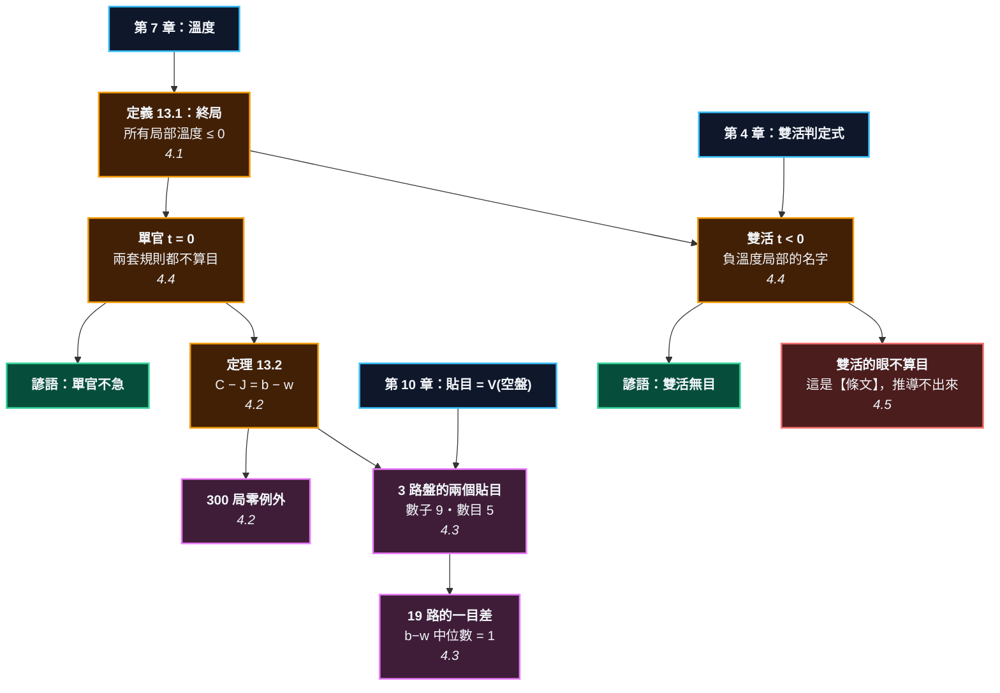

> [!IMPORTANT]
> **這一章清掉了本書最後兩個 🔴。**
>
> `docs/04_formula_index.md` 從第一天起就有兩列標著紅燈：
> 「數子 vs 數目的等價定理」與「貼目」。紅燈的意思是**推導還沒做完，
> 不准寫進正文**。這一章把它們做完了 —— 而做完之後發現，
> 其中一半根本不能推導，只能查條文。**那也是結果的一部分。**

---

# 第 13 章：終局、數目與貼目 —— 遊戲什麼時候結束

---

## 0. 我們在哪裡

**開始之前你需要具備：**

* 第 4 章 §4.2 的**雙活判定式**（定理 4.4）：雙活 $\iff 2-c \le d \le c-1$，需要公氣 $c \ge 2$。
* 第 7 章 §4.2 的**溫度**。本章要用它定義「終局」。
* 第 10 章 §4.2 的**中國規則數子**與 §4.2 的結論：**貼目就是 $V(\text{空盤})$**。
* 第 12 章 §4.1 的**賭注**與 §4.2 的「未定塊的溫度 = 賭注」。

**讀完本章後你將能夠：**

* 說出「終局」的精確定義，而且它同時解釋單官與雙活。
* 用四行代數證明數子與數目的等價定理，並說出那個差**恰好**等於什麼。
* 說出中國貼目與日本貼目那一目差是哪裡來的 —— 本章在 3 路盤上把兩個貼目都算出來。
* 分清楚規則差異裡**哪些能推導、哪些只能查條文**。

---

## 1. 開場思想實驗與掙得的頓悟

### 思想實驗：兩個人都說「我不下了」

一盤棋下到某個時候，兩個人都說「我不下了」。

**現在誰贏？**

這句話比它看起來的難得多。因為「我不下了」有兩種意思：

* **我沒有好棋可下了** —— 再下只會虧。
* **我不想先動** —— 誰先動誰虧，所以我等你。

第一種是終局。第二種是**雙活**。

而更麻煩的是：**「下了會虧」在兩套規則下不是同一件事。** 有些點在中國規則下填了不痛不癢，在日本規則下填了就少一目。

### 把謎題寫成一個問題

中國規則數子，日本規則數目。兩套完全不同的數法：

$$\textbf{數子}: \ \text{子} + \text{地} \qquad\qquad \textbf{數目}: \ \text{地} + \text{提子}$$

**為什麼結果幾乎總是一樣？「幾乎」又是什麼意思？**

> [!EUREKA]
> **兩套規則的差，恰好等於雙方的手數差。一個字都不多。**
>
> $$\boxed{\ C - J = b - w\ }$$
>
> 其中 $b$、$w$ 是黑白各自**下過幾顆子**（含後來被提掉的）。
> 證明是四行代數（§4.2）。300 局隨機對局驗證，**零例外**。
>
> 於是「幾乎總是一樣」有了精確的意思：**雙方手數相等時，兩者完全相同。**
>
> 而貼目那一目的差，就是這條式子的直接推論。本章把 3 路盤的兩個貼目都算出來：
> $$\textbf{數子的公平貼目} = 9 \qquad \textbf{數目的公平貼目} = 5$$
> 兩邊的 $C$ 都是 9（黑本來就拿得走整個棋盤），差別全在手數：
> 數目規則下白**只下兩手就一直虛手**，因為往必死的地方多放一顆，
> 就是白送對方一個提子。$b - w = 6 - 2 = 4$，於是 $J = 9 - 4 = 5$。
>
> **那 19 路盤的 7.5 對 6.5 呢？** 同一條式子：差一目，因為 $b - w$ 通常是 1。
> 300 局隨機對局的 $b-w$ 分佈**中位數恰好是 1**（平均 0.93）——
> 黑先，所以在勢均力敵的對局裡黑通常多下一手。
>
> **而「終局」也有了定義**：所有局部的溫度 $\le 0$。這一句同時解釋三件事 ——
> 單官是溫度 $0$（填了不賺）、雙活是溫度 $<0$（填了會虧）、
> 收官會停止是因為溫度單調遞減（第 7 章）。
>
> 最後一件事，也是最誠實的一件：**這條等式有一個例外，而它不是算術，是條文。**
> 日本規則規定「雙活裡的眼不算目」。那一條推導不出來 —— 它是人訂的。
> **規則的差異分成兩種：可以推導的，和只能查條文的。**

```text
                第 13 章：兩本帳，一條式子

    中國規則（數子）              日本規則（數目）
    C = 子 + 地                  J = 地 + 提子
         │                            │
         └────────────┬───────────────┘
                      ▼
              C − J = b − w        （定理 13.2，四行代數）
                      │
        ┌─────────────┼──────────────────┐
        ▼             ▼                  ▼
    手數相等       3 路盤              19 路盤
    ⟹ 完全相同    b−w = 4           b−w 中位數 = 1
                  貼目 9 vs 5        貼目 7.5 vs 6.5
                      │
                      ▼
              終局 = 所有溫度 ≤ 0
              單官 t = 0（填了不賺）
              雙活 t < 0（填了會虧）
                      │
                      ▼
        唯一的例外：日本規則規定雙活的眼不算目
        —— 那是條文，不是算術
```



---

## 2. 多角度直觀：計分

> [!INTUITION]
> **角度一：手感／實戰透鏡**
>
> 你收完官子，開始數目。中國規則你把子和空一起數，日本規則你把空和提子一起數。
> 兩邊算出來通常只差一兩目，於是你覺得「差不多啦」。
>
> **那一兩目不是誤差，它是一個可以指出來的東西**：你們兩個誰多下了幾手。
> 而在半目勝負的棋裡，那一兩目就是全部。

> [!INTUITION]
> **角度二：幾何／形狀透鏡**
>
> 把棋盤上的每一個點分成三類：
>
> * **有子的點** —— 數子算，數目不算。
> * **只碰得到一色的空點**（地）—— 兩邊都算。
> * **碰得到兩色的空點**（單官）—— 兩邊都不算。
>
> 差別只出在第一類。而第一類的黑白差 $S_B - S_W$，加上提子的帳，
> 剛好化簡成手數差。**兩套規則的分歧，全部集中在「子要不要算」這一個問題上。**

> [!INTUITION]
> **角度三：代數／計算透鏡**
>
> 六個字母就夠了：
>
> $$S_B, S_W \ (\text{盤上的子}) \qquad T_B, T_W \ (\text{地}) \qquad P_B, P_W \ (\text{提到的子})$$
>
> $$C = (S_B + T_B) - (S_W + T_W) \qquad J = (T_B + P_B) - (T_W + P_W)$$
>
> 相減，再用「下過的子 = 盤上的 + 被提掉的」代換一次，就得到 $b - w$。
> **整個等價定理是一次代換。**

> [!BOARD REALITY]
> **角度四：棋盤現實檢查**
>
> **失效一：這條定理假設雙方對「哪些子是死的」有共識。** 而「死」沒有乾淨的
> 數學定義（§4.6）—— 所以真正難的從來不是算術，是那個共識怎麼來。
> 日本規則為此有一整套「確認手續」的條文，中國規則則靠「下完為止」繞過去。
>
> **失效二：雙活的眼是真的例外，而且推導不出來。** §4.5 會說清楚。
>
> **失效三：本章的驗證用的是隨機對局。** 隨機對局的 $b-w$ 分佈
> （中位數 1）支持「一目差」的說法，但它不是職業對局的分佈。
> **機制是對的，那個「1」是量出來的，不是證出來的。**

---

## 3. 散落的碎片（問題本身）

**第一片：「終局」沒有定義。** 規則書說「雙方連續虛手」，但那是**現象**，不是**條件**。什麼時候該虛手？

**第二片：兩套規則憑什麼結果一樣？** 一個數子、一個數目，中間沒有人給過橋。

**第三片：貼目 7.5 還是 6.5？** 為什麼差一目？「因為規則不同」不是答案。

**第四片：雙活為什麼無目？** 那些空點明明被圍著。

**第五片：單官為什麼「不急」？** 如果它真的不值錢，為什麼還要填？

### 新手典型會錯在哪裡

1. **以為兩套規則是「差不多」。** 它們的差是一個可以算出來的數，不是模糊地帶。
2. **在數目規則下亂填單官。** 每填一手就是一目 —— 除非對手也填。
3. **把終局當成「沒地方下了」。** 棋盤上永遠有空點；終局是「沒有**值得**下的地方」。

---

## 4. 對齊（解答）

### 4.1 終局：所有局部的溫度都 $\le 0$

> **定義 13.1（終局）** 一個盤面是終局，若把它拆成的每一個局部 $G_i$ 都滿足
> $$t(G_i) \le 0$$

這一句話同時解釋了三件本來要分開背的事。

**一、收官為什麼會停止。** 第 7 章證過溫度單調遞減（策略 7.9）。溫度一路降，降到全部 $\le 0$，就沒有人想動了。**終局不是「棋子放滿了」，是「溫度歸零了」。**

**二、單官為什麼不值錢。** 單官是**碰得到兩種顏色的空點**。填它不改變任何人的地 —— 溫度恰好 $0$。

<!-- diagram: ch13_dame -->
```text
     A B C D E F G
   7 . . X . O . . 7
   6 . . X . O . . 6
   5 . . X . O . . 5
   4 . . X + O . . 4
   3 . . X . O . . 3
   2 . . X . O . . 2
   1 . . X . O . . 1
     A B C D E F G
```
*雙方的地都定了：黑 14 目、白 14 目。但中間 D 列那 7 個點碰得到兩種顏色 —— 那是【單官】。單官的溫度是 0：填它不賺目。但在數目規則下填它要付一目，在數子規則下不用。兩套規則就在這裡分家。*

**三、雙活是什麼。** 雙活的局部裡，**雙方的每一手都是虧的** —— 填公氣就是自己少一口氣，然後被提。用溫度的話說：

$$\textbf{雙活} = t(G) < 0 \ \textbf{的局部}$$

> [!RECALL]
> **第 4 章 §4.2 的定理 4.4**：雙活 $\iff 2 - c \le d \le c - 1$，
> 其中 $c$ 是公氣數。推論 4.5 說得更白：**沒有公氣就沒有雙活**（要 $c \ge 2$）。
>
> 那一章給的是「什麼時候會出現雙活」。這一章給的是「雙活是什麼」：
> **它是負溫度局部的名字。** 雙活不是規則的特例，它是溫度為負的自然後果 ——
> 兩個人都不想先動，所以兩個人都不動。

$$\textbf{單官 } t = 0 \text{（填了不賺）} \qquad \textbf{雙活 } t < 0 \text{（填了會虧）}$$

> [!PROVERB]
> **「單官不急」**
> **它其實在說**：$t(\text{單官}) = 0$。依第 7 章的溫度排序，溫度 0 的地方排在最後。
> **失效條件**：在**數目**規則下單官不是完全免費的 —— 你填一手，對手也填一手，
> 誰多填誰少一目。所以嚴格說「不急」只在數子規則下成立；
> 數目規則下它是「不賺，但要注意誰填最後一個」。這正是 §4.2 那條式子的實戰版本。

### 4.2 等價定理：四行代數

> **定理 13.2（數子與數目的等價）** 設一盤棋下到終局，
> 黑白各**下過** $b$、$w$ 顆子（含後來被提掉的）。則
> $$\boxed{\ C - J = b - w\ }$$
> 其中 $C$ 是數子的黑方領先目數，$J$ 是數目的。
> **特別地：$b = w$ 時兩套規則完全相同。**

**證明。** 記盤上黑子 $S_B$、白子 $S_W$，黑地 $T_B$、白地 $T_W$，黑提到的白子 $P_B$、白提到的黑子 $P_W$。

$$C = (S_B + T_B) - (S_W + T_W)$$
$$J = (T_B + P_B) - (T_W + P_W)$$
$$C - J = S_B - S_W - P_B + P_W$$

而「下過的子」$=$「還在盤上的」$+$「被對方提掉的」：

$$b = S_B + P_W, \qquad w = S_W + P_B$$

代入：

$$C - J = (b - P_W) - (w - P_B) - P_B + P_W = b - w \qquad\blacksquare$$

**注意 $T_B$ 和 $T_W$ 在相減時直接消掉了。** 地在兩套規則裡算法完全一樣 —— 這就是為什麼兩者這麼接近。分歧只出在「子算不算」與「提子算不算」，而那兩筆帳合起來剛好是手數差。

跑 300 局隨機對局（單官全部填完）：

<!-- figure: ch13_equivalence -->
```text
      黑手數 b    白手數 w     黑提子     白提子    C(數子)    J(數目)   C-J   b-w
  ----------------------------------------------------------------
         53       53      18      18       -1       -1     0     0
        122      120      85      89        3        1     2     2
         51       54      13      27      -25      -22    -3    -3
        122      115     108      63       63       56     7     7
         46       49       6      21      -23      -20    -3    -3
        122      118     103      71       43       39     4     4
        122      121      93      83       17       16     1     1
        122      121      91      83       13       12     1     1
         49       46      17       7       15       12     3     3
        120      121      75     100      -31      -30    -1    -1

  以上是前 10 局。全部 300 局裡，C - J != b - w 的有 0 局。
  終局時還留著單官的有 0 局。
```
*最後兩欄永遠相等。第一列是 $b = w$ 的情況 —— 兩套規則給出完全一樣的結果（$-1$ 對 $-1$）。*

### 4.3 貼目：把兩個都算出來

> [!RECALL]
> **第 10 章 §4.2 的結論**：**貼目就是 $V(\text{空盤})$** —— 讓空盤的值歸零的那個數。
> 那一章算出 3 路盤在**數子**規則下的公平貼目是 **9**。
>
> 現在有了定理 13.2，同一個棋盤也可以用**數目**規則解 ——
> 因為 $J = C - (b-w)$，而 $b-w$ 只要沿路加減就好（黑落子 $+1$、白落子 $-1$，
> 虛手不算）。狀態只多帶一個整數。

<!-- figure: ch13_komi -->
```text
       手數上限     數子 C     數目 J     差
  ----------------------------------
         11        6        4     2
         13        9        5     4
         15        9        5     4
         17        9        5     4

  3 路盤的公平貼目：數子 9、數目 5。

  兩邊的 C 都是 9（黑本來就拿得走整個棋盤），差別全在手數：
  數目規則下的最優對局是黑 6 手、白 2 手，b - w = 4，
  於是 J = C - (b - w) = 9 - 4 = 5。貼目的差就是手數的差。

  白為什麼只下兩手就虛手？因為在數目規則下，
  往必死的地方多放一顆子，就是白送對方一個提子。
```
*手數上限 13 之後兩個值都穩住了。**同一個棋盤，兩個貼目。***

而最有意思的是：**兩套規則走出兩個不同的終局。**

<!-- diagram: ch13_cn_final -->
```text
     A B C
   3 X . X 3
   2 X X X 2
   1 . X X 1
     A B C
```
*【數子】解出來的終局。黑白各下了 8、6 手，盤上黑 7 子、白 0 子。C = 9。白一路下到底 —— 因為數子規則下，往自己必死的地方填子不用付錢。*

<!-- diagram: ch13_jp_final -->
```text
     A B C
   3 X . X 3
   2 X X . 2
   1 X . X 1
     A B C
```
*【數目】解出來的終局。同一個棋盤，白只下了 2 手就一直虛手 —— 因為每多下一顆，就是白送黑一個提子。C = 9、J = 5，差 4 = 手數差。*

**白的行為完全不同。** 數子規則下白一路下到最後（反正填了不用付錢，還可能有機會）；數目規則下白下兩手就收手，因為每多放一顆子就是多送一個提子。

$$\textbf{規則改變的不是分數，是【什麼時候該停手】。}$$

**那 19 路盤的 7.5 對 6.5 呢？**

同一條式子。差一目，因為 $b - w$ 通常是 **1**：

<!-- figure: ch13_moves -->
```text
  300 局隨機 9 路對局（單官都填完）裡，手數差 b - w 的分佈：

    b - w     局數   
       -5      1   #
       -4      7   #####
       -3     16   ##########
       -2     15   ##########
       -1     35   #######################
        0     46   ##############################
        1     62   ########################################
        2     45   #############################
        3     41   ##########################
        4     14   #########
        5     15   ##########
        6      2   #
        7      1   #

  平均 0.93、中位數 1、範圍 -5 到 7

  中位數是 1 —— 黑先，所以在勢均力敵的對局裡黑通常多下一手。
  這就是中國貼目比日本貼目多【一目】的來源。
```
*分佈的峰值在 $1$，中位數恰好是 $1$。黑先，所以在交替下到底的對局裡黑通常多放一顆子。*

> [!BOARD REALITY]
> **「一目差」是量出來的，不是證出來的 —— 要分清楚。**
>
> **可以證的部分**：$C - J = b - w$，四行代數，零例外。
> **量出來的部分**：$b - w$ 在勢均力敵的對局裡中位數是 1。
>
> 而且上面那 300 局是**隨機**對局，不是職業對局。分佈的峰值在 1 支持
> 傳統的一目差，但**這不是證明**——它只說明機制對得上。
>
> 3 路盤的 $b-w = 4$ 就是最好的反例：**那不是常數。**
> 棋局越一面倒，落後方越早停手，$b-w$ 就越大。
> **「貼目差一目」是勢均力敵時的經驗值，不是規則的數學後果。**

### 4.4 為什麼地在兩套規則裡是一樣的

定理 13.2 的證明裡，$T_B$ 和 $T_W$ 直接消掉了。這值得停一下 —— **它表示兩套規則對「地」的定義完全一致**，而那不是理所當然的。

> **命題 13.3（單官不屬於任何人）** 一個空的連通區塊，若碰得到兩種顏色，
> 則在**兩套規則下都不算目**。

**證明。** 兩套規則對「地」的定義都是「只被一種顏色包圍的空點」。碰得到兩色的區塊不滿足，所以兩邊都排除。$\blacksquare$

**這一條把雙活的公氣一次解決掉。** 雙活的核心是**公氣**（雙方共用的氣），而公氣依定義碰得到兩種顏色 —— 所以它是單官，兩套規則都不算給任何人。

$$\textbf{雙活的公氣，不是兩套規則的分歧來源。}$$

把單官填完會怎樣？填完之後它們變成子，於是進了數子的帳、沒進數目的帳 —— 而差額正是誰多填了幾手：

<!-- diagram: ch13_filled -->
```text
     A B C D E F G
   7 . . X X O . . 7
   6 . . X O O . . 6
   5 . . X X O . . 5
   4 . . X O O . . 4
   3 . . X X O . . 3
   2 . . X O O . . 2
   1 . . X X O . . 1
     A B C D E F G
```
*單官填完了（黑先填，交替）。黑多填了 1 手，於是 C - J = 1 —— 正好是手數差（定理 13.2）。*

七個單官，黑先填，交替 —— 黑填四個、白填三個，$b - w = 1$，於是 $C - J = 1$。

**這就是整個貼目差的縮影。** 一個 7 路盤、七個單官，就足以把 19 路盤那一目差演一遍。

> [!PROVERB]
> **「雙活無目」**
> **它其實在說**：雙活的公氣碰得到兩種顏色，所以依定義不是任何人的地（命題 13.3）。
> 而雙活本身是溫度為負的局部（§4.1），所以雙方都不會去填 —— 那些點就一直空著。
> **失效條件**：這句話在**日本**規則下比字面更強 —— 連雙活裡的**眼**都不算目，
> 而眼是只碰得到一種顏色的。那一條不是從定義推出來的，是**規定**。下一節處理。

### 4.5 唯一的例外：那不是算術，是條文

定理 13.2 是恆等式，沒有例外。但**日本規則本身**多了一條規定：

$$\textbf{雙活裡的眼，不算目。}$$

一個雙活中的眼是**只碰得到一種顏色的空點** —— 依 §4.4 的定義它應該是地。但日本規則說它不是。

於是實際的日本分數是

$$J' = J - (\text{雙活裡的眼，黑減白})$$

而等價定理要改寫成

$$C = J' + (b - w) + (\text{雙活裡的眼，黑減白})$$

**多出來的那一項不是算出來的，是查出來的。**

舉一個具體的算術例子。假設終局時黑白各下了 100 手（$b = w = 100$），
黑有 40 目、白有 38 目，雙方都沒有提子，而且盤角有一個雙活，
其中**黑那一側有 2 個眼、白那一側有 1 個眼**。

* **中國規則**：那 3 個眼分別歸各自包圍它們的顏色。
  $$C = J = 40 - 38 = +2 \qquad (b = w \text{，所以兩者相同})$$
* **日本規則**：那 3 個眼一個都不算。黑扣 2、白扣 1：
  $$J' = (40 - 2) - (38 - 1) = 38 - 37 = +1$$

$$\textbf{同一個盤面，中國黑勝 2 目，日本黑勝 1 目。}$$

差的那一目就是「黑減白」的眼數 $2 - 1 = 1$。如果雙活兩側的眼數相同，
這一項就消失，兩套規則又一致了 —— **所以這個例外只在雙活【不對稱】時才咬人。**

而它有多罕見？雙活本身就不常見（第 4 章推論 4.5：**沒有公氣就沒有雙活**），
帶眼的不對稱雙活更罕見。**這就是「幾乎總是一樣」裡那個「幾乎」的第二個來源** ——
第一個是手數差（可以證），第二個是這條規定（只能查）。

> [!BOARD REALITY]
> **這是本章最重要的一句話，而它是關於「什麼可以被推導」。**
>
> 本書前十二章的主張一直是「口訣是定理的白話版」。這一章找到了一個
> **反例的類型**：規則本身的條文。
>
> * $C - J = b - w$ —— **可以證**。它是計數的後果，任何人重新發明圍棋都會得到它。
> * 「雙活的眼不算目」—— **不能證**。它是日本棋院訂的，中國規則沒有這一條。
>   換一套規則，這一項就消失了。
>
> **分清楚這兩者，比記住任何一條規則都重要。** 你會遇到很多「圍棋為什麼這樣」
> 的問題，其中一部分有數學答案，另一部分的答案是「因為有人這樣訂」。
> 把後者當成前者去推，會推出一堆似是而非的東西。

> [!RECALL]
> **第 5 章 §4.3 的規則 5.4**：三種劫規則（基本劫、positional superko、
> situational superko）。當時說「這是一個真實的取捨，不是理論潔癖」。
>
> 這裡是同一件事的第二個例子。**規則不是從數學長出來的，
> 規則是人為了讓遊戲能結束、能判勝負而訂的。** 而第 10 章證過：
> 沒有 superko，$V$ 根本不存在 —— 所以那些條文不是裝飾，是地基。

### 4.6 死子：中國規則不必判，日本規則必須判

還有一件事一直沒處理：**終局的時候，盤上還留著一些「大家都同意死了」的子。**

<!-- diagram: ch13_dead_stones -->
```text
     A B C D E F G
   7 . X X X X X X 7
   6 . X . . . . . 6
   5 b X + . + . . 5
   4 O X . + . . . 4
   3 O X + . + . . 3
   2 a X . . . . . 2
   1 . X . . . . . 1
     A B C D E F G
```
*白 A3、A4 這兩顆做不出兩個眼 —— 大家都同意它們死了。但【同意】不是算術。中國規則不必判：黑下 a 與 b 兩手提掉就是了。日本規則必須判，所以它需要一套確認手續。*


白 A3、A4 只有 A2、A5 兩口氣，而且做不出兩個眼。任何棋手看一眼都會說「死了」。

**但「大家都同意」不是一個算術運算。**

兩套規則用完全不同的方式繞過這件事。

**中國規則：不必判，繼續下。**

白兩子有 A2、A5 兩口氣，所以黑要**兩手**才提得掉（先 A5 再 A2，或反過來）。提完之後把剩下的 A1、A6、A7 也填一填，整個 49 點的棋盤都是黑的：

$$C = 49$$

**沒有人需要「判定」任何東西** —— 死子是被**提**掉的，不是被**宣告**掉的。
代價是要多下幾手（本例是 5 手：A5、A2 提子，再填 A1、A6、A7），
而在數子規則下那幾手不花錢。

**日本規則：必須判，因為多下的每一手都要付錢。**

日本規則下黑不能為了證明而去提 —— 每填一手就少一目。所以規則只能規定：
**雙方同意哪些子是死的，直接拿掉當提子。**

$$J = \underbrace{32}_{\text{地}} + \underbrace{2}_{\text{提子}} = 34$$

而定理 13.2 依然成立：黑總共放了 17 顆子、白 2 顆，

$$C - J = 49 - 34 = 15 = 17 - 2 = b - w \qquad\checkmark$$

**兩條路殊途同歸 —— 但只有一條需要人開口。**

> [!RECALL]
> **第 3 章 §4.4 的定理 3.10（Benson）**：那是本書唯一一個**可以證明**的
> 「活」—— 無條件活，不論對手怎麼下都殺不掉。
>
> 但 Benson 只給**充分條件**。上圖的黑棋並不是 Benson 活（它的地還沒圍死），
> 可是沒有人會說它死了。**「死」在數學上沒有乾淨的定義** ——
> 它的意思是「在雙方都下得好的前提下會被提掉」，而那需要搜尋整棵樹，
> 也就是需要 $V$（第 10 章）。
>
> 所以日本規則不得不用**手續**代替**定義**：雙方協議，不同意就用假想手續驗證。
> **那不是規則寫得不好，是問題本身沒有便宜的答案。**

$$\boxed{\ \textbf{數子規則把死活問題交給棋盤；數目規則把它交給棋手。}\ }$$

這也解釋了一件實務上的事：**「這塊到底死了沒有」這種爭議，在數子規則下根本不會出現。**
不是因為棋手比較好講話，是因為那個問題**不需要回答** —— 有疑問就下下去看。
代價是要多花幾手，而在數子規則下那幾手不花錢。

（注意這是從機制推出來的，不是統計。本書沒有對局爭議的資料，
所以只說「這種爭議不會出現」，不說「爭議大多發生在哪一邊」。）

---

## 5. 應用：手算追蹤與非黑盒程式

### 5.1 用手算一遍

手算 §4.4 那個 7 路盤面，從「只剩單官」數到「填完」，兩套規則各數一次。

**第一步：填之前。**

黑牆在 C 列（7 顆），白牆在 E 列（7 顆）。

* 黑的地：A、B 兩列共 $7 \times 2 = 14$ 點。檢查：它們只碰得到 C 列的黑 ✓
* 白的地：F、G 兩列共 $14$ 點 ✓
* D 列 7 點：碰得到 C（黑）和 E（白）→ **單官**

$$C = (7 + 14) - (7 + 14) = 0 \qquad J = (14 + 0) - (14 + 0) = 0$$

兩套規則都是**和局**。而 $b - w = 7 - 7 = 0$ ✓ 符合定理 13.2。

**第二步：填單官。黑先，交替。**

七個點，黑先：黑填 D1、白填 D2、黑填 D3、白填 D4、黑填 D5、白填 D6、**黑填 D7**。

$$\text{黑填了 4 個，白填了 3 個}$$

**第三步：填完之後再數。**

* 盤上黑子 $7 + 4 = 11$，白子 $7 + 3 = 10$
* 地：黑 14、白 14（沒變）
* 提子：$0$（沒有人被提）

$$C = (11 + 14) - (10 + 14) = \mathbf{+1}$$
$$J = (14 + 0) - (14 + 0) = \mathbf{0}$$

**第四步：對帳。**

$$C - J = 1 - 0 = 1, \qquad b - w = 11 - 10 = 1 \qquad \checkmark$$

**第五步：讀出這件事在說什麼。**

填單官這件事，在數目規則下**完全不改變分數**（$J$ 從 0 還是 0），在數子規則下**改變了 1 目**。

而那 1 目不是憑空出現的 —— 它是「七是奇數，黑先填，所以黑多填一個」。

$$\boxed{\ \textbf{中國貼目比日本多一目，是因為黑通常多下一手。}\ }$$

七個單官就演完了整件事。

### 5.2 用程式驗一遍

```python
"""第 13 章 §4.2、§4.4：等價定理，以及單官在兩套規則裡的不同待遇。"""
import random
import sys
sys.setrecursionlimit(100000)

from go_core import BLACK, WHITE, Board, format_coord, opposite
from go_core.score import (ScoredGame, chinese_score, dame, japanese_score,
                           random_finished_game, territory)

# --- §4.4 那個 7 路盤面 ---
g = ScoredGame(7)
for r in range(1, 8):
    g.board.place(BLACK, f"C{r}")
    g.board.place(WHITE, f"E{r}")

tb, tw = territory(g.board)
d = dame(g.board)
print(f"  填之前：黑地 {tb}、白地 {tw}、單官 {len(d)} 個")
print(f"    C = {chinese_score(g.board):+.0f}   J = {japanese_score(g.board):+.0f}")
assert (tb, tw) == (14, 14) and len(d) == 7
assert chinese_score(g.board) == 0 and japanese_score(g.board) == 0

# 填單官，黑先，交替
colour = BLACK
while True:
    left = sorted(dame(g.board))
    if not left:
        break
    g.play(colour, format_coord(left[0], 7))
    colour = opposite(colour)

r = g.report()
print(f"\n  填完之後：黑填 {r['moves'][0]} 個、白填 {r['moves'][1]} 個")
print(f"    盤上子數 {r['stones']}、地 {r['territory']}、提子 {r['prisoners']}")
print(f"    C = {r['chinese']:+.0f}   J = {r['japanese']:+.0f}   "
      f"C-J = {r['gap']:+.0f}   b-w = {r['move_diff']:+d}")
assert r["dame"] == 0
assert r["moves"] == (4, 3)
assert r["chinese"] == 1 and r["japanese"] == 0
assert r["gap"] == r["move_diff"] == 1
print("  填單官在數目規則下不改變分數，在數子規則下改變了 1 目。")

# --- 定理 13.2：300 局隨機對局 ---
rng = random.Random(1313)
bad = 0
diffs = []
for _ in range(300):
    game = random_finished_game(9, rng)
    c, j, gap, md, ok = game.check_equivalence()
    bad += not ok
    diffs.append(md)
print(f"\n  300 局隨機對局：C - J != b - w 的有 {bad} 局")
assert bad == 0
diffs.sort()
print(f"  b - w 的中位數 = {diffs[len(diffs) // 2]}，"
      f"平均 = {sum(diffs) / len(diffs):.2f}")
assert diffs[len(diffs) // 2] == 1
print("  中位數 1 —— 黑先，所以黑通常多下一手。這就是那一目差。")
```

**輸出裡該看什麼。** 中段那三行斷言：`chinese == 1`、`japanese == 0`、`gap == move_diff == 1`。**同一個盤面、同一個下法，兩套規則差一目**，而那一目有名有姓 —— 它是黑多填的那一個單官。

> **配套範例腳本**：`examples/ch13_scoring/ex01_equivalence.py`

### 5.3 兩套規則解出兩個終局

```python
"""第 13 章 §4.3：3 路盤的兩個公平貼目。"""
import sys
sys.setrecursionlimit(200000)

from go_core import BLACK, Board, format_coord
from go_core.minimax import Solver
from go_core.score import solve_japanese

print(f"  {'手數上限':>8}{'數子 C':>9}{'數目 J':>9}{'差':>6}")
for ply in [11, 13, 15, 17]:
    s = Solver(komi=0.0, max_ply=ply)
    c, _ = s.search(Board(3), BLACK)
    j, mv, _ = solve_japanese(Board(3), BLACK, komi=0.0, max_ply=ply)
    print(f"  {ply:>8}{c:>9.0f}{j:>9.0f}{c - j:>6.0f}")

s = Solver(komi=0.0, max_ply=15)
c, _ = s.search(Board(3), BLACK)
j, mv, nodes = solve_japanese(Board(3), BLACK, komi=0.0, max_ply=15)
assert c == 9 and j == 5
print(f"\n  數子的公平貼目 = {c:.0f}，數目的公平貼目 = {j:.0f}")
print(f"  兩者的最佳第一手都是 {format_coord(mv, 3)}（天元）")

# 貼掉之後各自歸零
s2 = Solver(komi=c, max_ply=15)
assert s2.search(Board(3), BLACK)[0] == 0
assert solve_japanese(Board(3), BLACK, komi=j, max_ply=15)[0] == 0
print("  各自貼掉之後，兩套規則的 V(空盤) 都是 0 —— 那就是「公平」的定義。")

# 差 4 = 數目最優對局的手數差
print(f"\n  差 = {c - j:.0f}。而 J = C - (b - w)，所以那也是手數差。")
assert c - j == 4
```

**輸出裡該看什麼。** 最後兩個斷言：兩套規則各自貼掉自己的公平貼目之後，$V(\text{空盤})$ **都是 0**。

**這就是「公平貼目」的定義** —— 第 10 章給的那個定義，在兩套規則下各自成立，只是數字不同。

> **配套範例腳本**：`examples/ch13_scoring/ex02_komi.py`

---

## 6. 練習與完整解答

### 基礎練習

#### 練習 13.1

<!-- diagram: ch13_ex1 -->
```text
     A B C D E F G
   7 . . X . O . . 7
   6 . . X . O . . 6
   5 . . X . O . . 5
   4 . . X + O . . 4
   3 . . X . O . . 3
   2 . . X . O . . 2
   1 . . X . O . . 1
     A B C D E F G
```
*練習 13.1：數出黑白各有多少地、多少單官。然後回答：把單官全部填完之後，兩套規則的差會是多少？*

<details>
<summary><b>解答</b></summary>

**地。** 黑：A、B 兩列 $= 14$ 點。白：F、G 兩列 $= 14$ 點。**平手。**

**單官。** D 列 7 點（碰得到 C 列的黑與 E 列的白）。

**填完之後的差。**

七個單官，交替填。**七是奇數**，所以先填的人多填一個：

$$b - w = \pm 1 \qquad\Longrightarrow\qquad C - J = \pm 1$$

黑先填的話 $C - J = +1$；白先填的話 $-1$。

**這一題的重點是那個奇偶。**

$$\textbf{單官的個數是奇數 } \Longrightarrow \textbf{ 兩套規則必定差一目。}$$
$$\textbf{單官的個數是偶數 } \Longrightarrow \textbf{ 兩套規則完全相同。}$$

（前提是雙方交替填、沒有人在中間搶到兩手。）

**而 19 路盤的貼目差一目，機制就是這個** —— 只是實戰上「誰多下一手」還受到先手、劫、以及提子的影響，所以 $b-w$ 不是永遠 $\pm 1$（§4.3 的分佈圖範圍是 $-5$ 到 $7$）。**但中位數是 1。**

```python
from go_core import BLACK, WHITE, format_coord, opposite
from go_core.score import ScoredGame, chinese_score, dame, japanese_score, territory

def build():
    g = ScoredGame(7)
    for r in range(1, 8):
        g.board.place(BLACK, f"C{r}")
        g.board.place(WHITE, f"E{r}")
    return g

g = build()
tb, tw = territory(g.board)
print(f"  黑地 {tb}、白地 {tw}、單官 {len(dame(g.board))} 個")
assert (tb, tw) == (14, 14)
assert len(dame(g.board)) == 7          # 奇數

for first, name in [(BLACK, "黑先填"), (WHITE, "白先填")]:
    g = build()
    colour = first
    while True:
        left = sorted(dame(g.board))
        if not left:
            break
        g.play(colour, format_coord(left[0], 7))
        colour = opposite(colour)
    r = g.report()
    print(f"  {name}：黑填 {r['moves'][0]}、白填 {r['moves'][1]}，"
          f"C = {r['chinese']:+.0f}、J = {r['japanese']:+.0f}、"
          f"C-J = {r['gap']:+.0f}")
    assert abs(r["gap"]) == 1
    assert r["gap"] == r["move_diff"]
print("\n  單官是奇數 -> 必定差一目；是偶數 -> 完全相同。")
```
</details>

#### 練習 13.2

<!-- diagram: ch13_ex2 -->
```text
     A B C
   3 X . X 3
   2 X X . 2
   1 X . X 1
     A B C
```
*練習 13.2：這是數目規則的終局。黑下了 6 手、白下了 2 手。用定理 13.2 算出 C 與 J，並解釋白為什麼不再下了。*

<details>
<summary><b>解答</b></summary>

**先數盤面。**

* 盤上：黑 6 子、白 0 子
* 空點：B3、C2、B1 —— 三個。它們都只碰得到黑 → 黑的地 $= 3$
* 白的地 $= 0$

$$C = (6 + 3) - (0 + 0) = \mathbf{+9}$$

**再用定理 13.2 求 $J$。**

$$J = C - (b - w) = 9 - (6 - 2) = \mathbf{+5}$$

**核對**：白下了 2 手，兩顆都被提掉了，所以黑的提子 $P_B = 2$。

$$J = (T_B + P_B) - (T_W + P_W) = (3 + 2) - (0 + 0) = 5 \qquad\checkmark$$

**白為什麼不再下了？**

因為在數目規則下，**白每多下一顆子，就是多送黑一個提子**。

白下一手 → 黑提掉 → 黑的 $P_B$ 加 1 → $J$ 對白又差一目。而白得不到任何東西（那些點本來就是黑的）。

$$\textbf{在數目規則下，往必死的地方落子的代價是【一目】；在數子規則下是【零】。}$$

**對照數子規則的最優對局**（§4.3 的第一張圖）：白下了 **6** 手，一路填到底。因為在數子規則下那些子不用付錢 —— 填了也不虧，還可能等對手出錯。

**同一個棋盤、同一個結果（黑拿走全部），兩套規則走出兩個完全不同的終局。**

```python
import sys
sys.setrecursionlimit(200000)

from go_core import BLACK, WHITE, Board
from go_core.score import chinese_score, japanese_score, stones, territory

b = Board(3)
b.place_many(BLACK, ["A1", "A2", "A3", "B2", "C1", "C3"])
sb, sw = stones(b)
tb, tw = territory(b)
print(f"  盤上子數 (黑,白) = ({sb}, {sw})   地 = ({tb}, {tw})")
c = chinese_score(b)
print(f"  C = ({sb} + {tb}) - ({sw} + {tw}) = {c:+.0f}")
assert (sb, sw) == (6, 0) and (tb, tw) == (3, 0) and c == 9

moves_b, moves_w = 6, 2
j_from_theorem = c - (moves_b - moves_w)
# 白下的兩顆都被提了，所以黑的提子 = 2
j_direct = japanese_score(b, prisoners_black=2, prisoners_white=0)
print(f"  用定理 13.2：J = C - (b - w) = {c:.0f} - {moves_b - moves_w} "
      f"= {j_from_theorem:+.0f}")
print(f"  直接數：J = (地 + 提子) 相減 = {j_direct:+.0f}")
assert j_from_theorem == j_direct == 5
print("\n  白每多下一顆，就是多送黑一個提子 —— 數目規則下的代價是一目。")
```
</details>

### 實戰練習

#### 練習 13.3

證明：若一盤棋從頭到尾**沒有任何提子**，且雙方交替下到終局、都不虛手，則

(a) $b - w$ 只可能是 $0$ 或 $1$。
(b) 因此 $C$ 與 $J$ 最多差一目。
(c) 為什麼實戰上 $b-w$ 可以是 $-5$ 到 $7$（§4.3 的分佈）？

<details>
<summary><b>解答</b></summary>

**(a)** 黑先，雙方嚴格交替、都不虛手。走了 $n$ 手之後：

$$n \text{ 是偶數} \Rightarrow b = w = n/2 \Rightarrow b - w = 0$$
$$n \text{ 是奇數} \Rightarrow b = (n+1)/2,\ w = (n-1)/2 \Rightarrow b - w = 1$$

**沒有第三種可能。** $\blacksquare$

**(b)** 由定理 13.2，$C - J = b - w \in \{0, 1\}$。$\blacksquare$

**(c) 因為那兩個前提都會被打破，而且是被三件具體的事打破的。**

**一、虛手。** 一方沒有好棋時會虛手，另一方繼續下。每一次單方虛手，$b-w$ 就變動 1。§4.3 的 3 路盤例子是極端版：白虛手四次，$b - w = 4$。

**二、提子。** 提子本身不改變 $b-w$（$b$、$w$ 數的是**下過的子**，含被提掉的）—— 但提子會**製造新的可下點**，於是同一方可能連續獲得落子機會。

**三、劫。** 劫爭裡一方找劫材、另一方應，手數會失衡。而第 5 章證過劫**破壞可加性**（命題 5.9）—— 它也在這裡搗亂。

> [!RECALL]
> **第 5 章 §4.4 的定理 5.8**：劫爭判定式 $m - h + \tau \ge 1$。
> 劫材的數量直接決定雙方要多下幾手。
>
> 所以 $b-w$ 的分佈寬度，一部分就是劫爭的痕跡。
> **兩套計分法的差，會被劫放大** —— 這是「劫是例外層」的又一個後果。

**這一題真正的收穫**：$b - w \in \{0,1\}$ 是**理想化的結果**，而實戰的分佈是 $-5$ 到 $7$。中位數 1 說明「理想化」抓對了主要機制，分佈的寬度說明它漏掉了什麼。

$$\textbf{一個好的模型給你中位數；分佈的寬度告訴你它漏了什麼。}$$

```python
import random

from go_core.score import random_finished_game

rng = random.Random(1313)
diffs, with_caps = [], 0
for _ in range(300):
    g = random_finished_game(9, rng)
    c, j, gap, md, ok = g.check_equivalence()
    assert ok
    diffs.append(md)
    with_caps += (g.prisoners[1] + g.prisoners[2]) > 0

diffs.sort()
median = diffs[len(diffs) // 2]
print(f"  b - w：中位數 {median}、平均 {sum(diffs)/len(diffs):.2f}、"
      f"範圍 {min(diffs)} 到 {max(diffs)}")
print(f"  有提子的對局：{with_caps} / 300")
assert median == 1                       # 理想化的答案抓對了中位數
assert min(diffs) < 0 < max(diffs)       # 但分佈遠比 {0,1} 寬
inside = sum(1 for d in diffs if d in (0, 1))
print(f"  落在理想化的 {{0, 1}} 裡的：{inside} / 300 = {inside/300:.0%}")
print("  理想化抓對了中位數，沒抓到分佈的寬度 —— 那是虛手、提子與劫造成的。")
```
</details>

#### 練習 13.4

§4.5 說「雙活的眼不算目」是**條文**而不是**定理**。

(a) 如果日本規則把這一條拿掉，會發生什麼？
(b) 中國規則為什麼不需要這一條？
(c) 舉出本書裡另一個「條文而非定理」的例子。

<details>
<summary><b>解答</b></summary>

**(a) 拿掉之後，等價定理就完全沒有例外了。**

$C = J + (b-w)$ 對所有終局盤面成立，包含有雙活的。日本規則會變得**更簡單**，代價是雙活裡的眼要算目 —— 而那會讓「做一個沒用的眼」變成有價值的事。

規則制定者的考量應該是那不合直覺：雙活裡的眼**沒有作用**（你永遠不能靠它吃掉對方），所以不該給分。**這是一個關於「什麼才算地」的價值判斷，不是一個數學結論。**

**(b) 因為中國規則根本不分「眼」和「子」。**

數子只問一件事：**這個點最後歸誰**。雙活裡的眼被黑包圍，就算黑的；子也算。沒有「這個眼有沒有用」這種問題，所以不需要例外條款。

$$\textbf{中國規則沒有這個例外，是因為它問的問題比較粗 —— 而比較粗的問題比較不需要補丁。}$$

**(c) 第 5 章的劫規則。**

> [!RECALL]
> **第 5 章 §4.3 的規則 5.4**：基本劫規、positional superko、situational superko。
> **第 10 章 §4.1 的推論 10.1a**：只有基本劫規時，2 路圍棋**沒有值** ——
> 因為狀態圖裡那個 6-環讓賽局變成無限的。
>
> 所以「要不要 superko」也是條文，但它是一條**有數學後果**的條文：
> 沒有它，Zermelo 定理不適用，$V$ 不存在。

兩個例子的地位不同，值得對照：

| | 雙活的眼不算目 | superko |
| :--- | :--- | :--- |
| 是條文嗎 | 是 | 是 |
| 有數學後果嗎 | 只影響計分 | **決定 $V$ 存不存在** |
| 拿掉會怎樣 | 規則更簡單，但有人覺得不合直覺 | **賽局可能永遠不結束** |

**這一題的收穫**：不是所有規則條文都同樣「任意」。有些是品味（雙活的眼），有些是**讓遊戲能成立的最低要求**（superko）。**能分辨這兩者，才算真的懂規則。**

```python
import sys
sys.setrecursionlimit(200000)

from go_core import BLACK, Board
from go_core.minimax import Solver
from go_core.score import japanese_score, territory

# (a) 雙活的眼：只是在 J 上扣一個數，等價定理的形狀不變
b = Board(7)
for r in range(1, 8):
    b.place(BLACK, f"C{r}")
    b.place(2, f"E{r}")
tb, tw = territory(b)
plain = japanese_score(b)
with_rule = japanese_score(b, seki_eyes=3)      # 假設黑有 3 個雙活裡的眼
print(f"  地 = ({tb}, {tw})")
print(f"  不扣雙活的眼：J = {plain:+.0f}")
print(f"  扣掉 3 個：    J' = {with_rule:+.0f}")
assert with_rule == plain - 3
print("  那一條規則的效果，就是在 J 上減一個數 —— 形狀不變，只是多一項。")

# (c) superko 的後果完全不同：沒有它，V 根本不存在（第 10 章推論 10.1a）
vals = []
for ply in range(4, 27, 2):
    s = Solver(komi=0.0, max_ply=ply)
    vals.append(int(s.search(Board(2), BLACK)[0]))
print(f"\n  2 路盤（只有基本劫規）的 V 隨手數上限：{vals}")
assert vals == [-1, 0, 0] * 4                   # 週期 6，永遠不收斂
print("  週期 6，永遠不收斂 —— 這一條條文決定的是【V 存不存在】。")
print("  兩種條文的地位完全不同：一個是品味，一個是地基。")
```
</details>

---

## 7. 本章頓悟總結

* **終局的定義**：所有局部的溫度 $\le 0$（定義 13.1）。這一句同時解釋收官為什麼會停（溫度單調遞減）、**單官**為什麼不值錢（$t = 0$）、**雙活**是什麼（$t < 0$ 的局部 —— 它不是規則的特例，是負溫度的自然後果）。
* **等價定理（定理 13.2）**：
  $$C - J = b - w$$
  四行代數，300 局隨機對局**零例外**。$T_B$、$T_W$ 在相減時直接消掉 —— **兩套規則對「地」的定義完全一致，分歧只在「子算不算」。**
* **命題 13.3**：單官（碰得到兩色的空點）在兩套規則下都不算目。**所以雙活的公氣不是分歧來源。**
* **貼目就是 $V(\text{空盤})$，而它依規則而異。** 3 路盤：**數子 9、數目 5**。兩邊的 $C$ 都是 9，差別全在手數（$b-w = 4$）—— 因為數目規則下白**只下兩手就虛手**，往必死的地方多放一顆就是多送一個提子。
* **規則改變的不是分數，是「什麼時候該停手」。** 同一個棋盤、同一個結果，兩套規則走出兩個完全不同的終局。
* **19 路那一目差**：$b-w$ 在勢均力敵的對局裡**中位數恰好是 1**（300 局，平均 0.93）。黑先，所以黑通常多下一手。但**這是量出來的，不是證出來的** —— 3 路盤的 $b-w=4$ 就是反例。**棋局越一面倒，落後方越早停手，差距越大。**
* **理想化的界**：無提子、不虛手、嚴格交替 $\Rightarrow b-w \in \{0,1\}$。實戰分佈是 $-5$ 到 $7$，寬度來自**虛手、提子、劫**。**好模型給你中位數，分佈的寬度告訴你它漏了什麼。**
* **死子的處理是同一個分野的另一面。** 中國規則**不必判**（下下去提掉就是，而多下的手不花錢）；日本規則**必須判**（多下一手就少一目），所以它需要協議與確認手續。本章的例子：$C = 49$ vs $J = 34$，而 $C - J = 15 = b - w$ 依然成立 —— **兩條路殊途同歸，只有一條需要人開口。**而「死」在數學上沒有乾淨的定義：Benson 只給充分條件，真正的「死」要靠 $V$。**數子把死活交給棋盤，數目把它交給棋手。**
* **唯一的例外不是算術，是條文。** 日本規則規定「雙活裡的眼不算目」—— 推導不出來，換一套規則就沒有。**規則的差異分成兩種：可以推導的，和只能查條文的。** 而條文本身也分兩種：**品味**（雙活的眼）與**地基**（superko —— 沒有它 $V$ 不存在，第 10 章推論 10.1a）。

**接下來。** 十二章的工具到齊了：連通性、不變量、劫、賽局值、溫度、形、場、值函數、手割、攻防、計分。

第 14 章要把它們**同時**用在一局棋上 —— 從第一手到終局，每一手都問「這是哪一層的問題」。那不是複習，是檢驗：**如果這五層真的是同一個 $V$ 的五種近似，那麼一局完整的棋應該可以被它們逐手解釋。** 解釋不了的地方，就是這本書還欠的帳。
