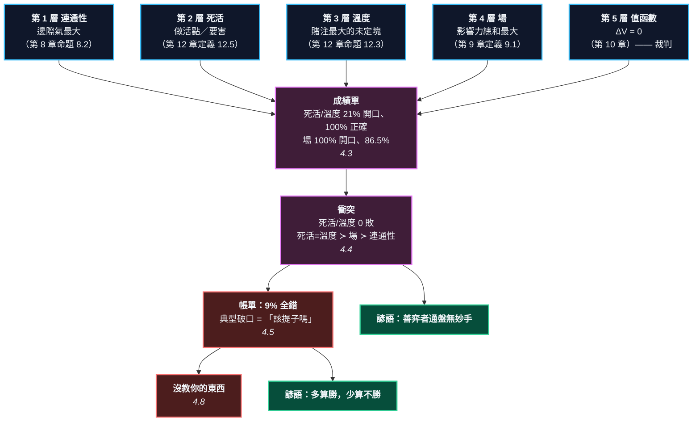

# 第 14 章：一局棋的完整解剖

---

## 0. 我們在哪裡

**開始之前你需要具備：** 這一章用到前面**每一章**。它不introduce任何新工具，只做一件事 —— 把十二章造的尺**同時**架在同一局棋上。

特別需要的是：

* 第 8 章 §4.1 的**邊際氣**（命題 8.2）—— 第 1 層的判準。
* 第 12 章 §4.4 的**做活點**（定義 12.5）與 §4.2 的**未定塊溫度 $=$ 賭注**（命題 12.3）—— 第 2、3 層的判準。
* 第 9 章 §4.1 的**影響力場**（定義 9.1）—— 第 4 層的判準。
* 第 10 章 §4.2 的 $V$ 與 $\Delta V$（定義 10.3）—— 第 5 層，也是唯一的裁判。
* 第 11 章 §4.4 的**規則評分**方法。這一章用同一套方法，但評的是**層**而不是任意規則。

**讀完本章後你將能夠：**

* 拿任何一手棋問「這是哪一層」，並知道那個問題什麼時候答得出來、什麼時候答不出來。
* 說出五層之間的**嚴格優先序**，以及它是量出來的還是猜出來的。
* 拿到一張可以列印的覆盤清單。
* 說出這本書**欠你什麼** —— 一個具體的百分比，以及一個具體的破口長什麼樣子。

---

## 1. 開場思想實驗與掙得的頓悟

### 思想實驗：五個醫生，一張片子

一個病人來了。五個醫生分別看同一張片子。

* 第一個說：「這裡骨頭有裂痕。」
* 第二個說：「我看不出什麼。」
* 第三個說：「我也看不出什麼。」
* 第四個說：「整體來說這一側比較不對勁。」
* 第五個沒說話 —— 他的儀器壞了。

**現在你要相信誰？**

直覺會說：相信講得最多的那個。但這是錯的。**第二和第三個醫生之所以不說話，可能是因為他們的專業判斷是「這不是我的科別」** —— 而一旦他們開口，他們就很少錯。

**「說得少」和「說錯」是兩回事。而把兩者混為一談，是外行判斷專家最常犯的錯。**

### 把謎題寫成一個問題

十二章造了五把尺。**它們合起來夠不夠？**

這個問題聽起來像修辭，但它有一個精確的版本：

> 拿一個局面，讓五層各自提名它們認為該下的點。
> **至少有一層提名到最佳著的比例是多少？**

而在 3 路盤上，這個問題**答得出來** —— 因為第 10 章把 $V$ 算出來了。

> [!EUREKA]
> **要判斷一層好不好，得問它「在它開口的地方，比亂猜好多少」——
> 而不是問它的命中率。**
>
> 把四層架在 3 路盤 1,742 個已解局面上（第 5 層是裁判，不參賽）：
>
> | 層 | 開口的局面 | 命中率 | **亂猜基準** | 選擇性 |
> | :--- | --: | --: | --: | --: |
> | 連通性 | 100% | 68.5% | 45.4% | 68.5% |
> | 死活 | **21%** | **100.0%** | **80.2%** | 95.5% |
> | 溫度 | **21%** | **100.0%** | **80.2%** | 95.5% |
> | 場 | 100% | 86.5% | 45.4% | 73.2% |
>
> 我第一次看到那兩個 100% 的時候，以為找到了一個漂亮的結論。
> **然後我算了基準線。** 死活層開口的那 364 個局面裡，
> 平均 5.4 個合法點就有 **4.3 個是最佳著** —— **亂猜也有 80%。**
> 那個 100% 遠沒有看起來那麼強。
>
> **真正的證據在衝突。** 兩層提名**不同**的時候誰對（分歧本身已經排除了
> 「這個局面隨便下都行」）：
>
> $$\text{死活 vs 場：224 次分歧，死活勝 } \mathbf{8}\text{、場勝 } \mathbf{0}$$
> $$\text{連通性 vs 死活：328 次分歧，死活勝 } \mathbf{68}\text{、連通性勝 } \mathbf{0}$$
>
> **死活／溫度在 552 次分歧裡零敗。** 效果量不大（對上場只有 8 個局面），
> 但方向毫無例外。於是有了一個**量出來的**優先序：
> $$\textbf{死活} = \textbf{溫度} \ \succ\ \textbf{場} \ \succ\ \textbf{連通性}$$
> 這正是「先看死活，再比大小，最後講形」的順序 —— 現在它有數字了。
>
> **而這一章真正要交的是帳，不是成績。**
> 四層合起來仍然有 **9.0%（156 個局面）全部落空**，
> 而那些局面有一個共同的形狀：
> **四層一起說「去提子」，而正解是「不提」。**

```text
                    第 14 章：把五把尺架在同一局棋上

    第 2、8 章        第 3、12 章       第 7、12 章      第 9 章        第 10 章
    連通性            死活              溫度             場             值函數
       │                │                │              │               │
       └────────────────┴────────────────┴──────────────┘               │
                              │                                          │
                        四層各自提名                                  唯一的裁判
                              │                                          │
                              └──────────────┬───────────────────────────┘
                                             ▼
                              1,742 個已解局面（3 路盤）
                                             │
                    ┌────────────────────────┼────────────────────────┐
                    ▼                        ▼                        ▼
              命中率 vs 選擇性          衝突時誰對                    帳單
         死活/溫度 21% 開口          死活/溫度 0 敗            91% 至少一層對
         但 100% 正確                嚴格優先序                 9%  四層全錯
                    │                        │                        │
                    └────────────────────────┴────────────────────────┘
                                             ▼
                              「先死活、再大小、最後看形」
                                     —— 現在有數字了
```



---

## 2. 多角度直觀：解剖

> [!INTUITION]
> **角度一：手感／實戰透鏡**
>
> 覆盤的時候你會說「這手不好」。**但「不好」有五種不同的意思**：
> 形不好（第 1 層）、那塊棋要出事（第 2 層）、有更大的地方（第 3 層）、
> 方向不對（第 4 層）、就是掉目（第 5 層）。
>
> 把它們分開，覆盤才有下一步。「這手不好」不能改進任何東西；
> **「這手在第 3 層錯了 —— 有一個賭注 12 的地方我沒看到」可以。**

> [!INTUITION]
> **角度二：幾何／形狀透鏡**
>
> 把每一層想成一張**遮罩**：它在棋盤上塗黑一小塊，說「答案在這裡面」。
>
> * 死活層塗得很小（平均 0.26 個點）—— 常常整張是空的。
> * 場層塗得很大（平均 1.53 個點，而且從不空手）。
>
> 五張遮罩疊起來，**91% 的局面蓋得到正解**。
> 剩下 9% 是五張遮罩的**共同盲區** —— 而盲區有形狀，不是隨機散布的。

> [!INTUITION]
> **角度三：代數／計算透鏡**
>
> 一層的解釋力要用兩個數，缺一不可：
>
> $$\textbf{命中率} = \Pr(\text{提名集合} \ni \text{最佳著} \mid \text{有開口})$$
> $$\textbf{選擇性} = 1 - \frac{\text{提名數}}{\text{合法點數}}$$
>
> **只看命中率會被騙。** 一層如果把九個點提名八個，命中率接近 1，
> 選擇性接近 0 —— 它什麼也沒說。
>
> 這正是第 9 章 §4.2 的「準確率 vs 覆蓋率」換一個場合再出現一次。
> **同一個取捨，第三次。**

> [!BOARD REALITY]
> **角度四：棋盤現實檢查**
>
> **失效一：全部是 3 路盤。** 只有那裡有 $V$。19 路盤上沒有裁判，
> 所以本章的成績單**不能外推** —— 可以外推的是**方法**：
> 只要你有裁判，就可以這樣量任何一組判準。
>
> **失效二：判準是我選的。** 「第 2 層 = 做活點」是一個**具體的實作**，
> 不是「死活層」的唯一寫法。換一個寫法，數字會變。
> 本章量的是**這一組**判準，不是那些概念的本質。
>
> **失效三：3 路盤上第 2 層和第 3 層永遠一樣。** 因為盤面太小，
> 同時只會有一塊未定的棋。所以「死活 = 溫度」這個等號是**盤面大小的產物**，
> 不是理論結論 —— 在 19 路盤上它們一定會分家。

---

## 3. 散落的碎片（問題本身）

**第一片：覆盤沒有方法。** 「這手不好」「那手緩了」—— 說完就沒有下一句。

**第二片：五層沒有優先序。** 十二章各講各的。真正下棋的時候它們同時說話，該聽誰的？

**第三片：AI 的評分只給一個數。** $\Delta V = 3.2$ 目。**錯在哪一層？** 它不說。

**第四片：沒有人量過「這套框架夠不夠」。** 任何教學體系都宣稱自己完整。**有沒有數字？**

**第五片：一本書該怎麼收尾？** 列出它教過什麼很容易。**列出它沒教什麼比較難。**

### 新手典型會錯在哪裡

1. **聽最大聲的那一層。** 場永遠有話說，所以它的意見最容易被聽見 —— 而它的命中率排第二。
2. **把「這手說得通」當成「這手對」。** 事後永遠說得通。本章的判準是**事前會不會挑它**。
3. **以為框架完整。** 9% 的破口是真的。

---

## 4. 對齊（解答）

### 4.1 「解釋得了」的精確定義

> **定義 14.1（解釋）** 一層**解釋得了**某一手，若那一層**自己的判準**會提名這一手。
>
> 「自己的判準」一律用那一章建立的東西，不另外發明：
>
> | 層 | 判準 | 出處 |
> | :-- | :--- | :--- |
> | 1 連通性 | 邊際氣最大 | 第 8 章命題 8.2 |
> | 2 死活 | 是某塊未定棋的做活點或要害 | 第 12 章定義 12.5 |
> | 3 溫度 | 是**賭注最大**的未定塊的要點 | 第 12 章命題 12.3 |
> | 4 場 | 影響力總和最大 | 第 9 章定義 9.1 |
> | 5 值函數 | $\Delta V = 0$ | 第 10 章定義 10.3 |

**這個定義刻意很窄。** 它要求「事前會挑它」，不是「事後說得通」。

事後解釋沒有資訊 —— 任何一手棋都可以被說成「加強了形」或「顧到了方向」。而事前提名是可以錯的，**可以錯的陳述才有內容**。

> **定義 14.2（選擇性）** $$\text{選擇性} = 1 - \frac{\text{提名數}}{\text{合法點數}}$$

一層如果把大部分合法點都提名了，它的命中率再高也沒有意義。**命中率與選擇性要一起看。**

### 4.2 一局 3 路棋，逐手解剖

先看最優對局（第 10 章解出來的那 15 手）逐手長什麼樣：

<!-- figure: ch14_anatomy3 -->
```text
    手       點      連通性    死活    溫度     場   值函數
  --------------------------------------------
    1  黑   B2        O     .     .     O     O
    2  白   B3        O     .     .     O     O
    3  黑   A2        .     .     .     O     O
    4  白   C2        O     O     O     O     O
    5  黑   B1        .     .     .     O     O
    6  白   A3        O     .     .     O     O
    7  黑   C3        O     .     .     O     O
    8  白   B3        O     O     O     O     O
    9  黑   A3        O     .     .     O     O
   10  白   C3        O     .     .     O     O
   11  黑   C1        O     .     .     O     O
   12  白   B3        .     O     O     O     O
   13  黑   C2        .     O     O     .     O
   14  白   虛手
   15  黑   C3        O     O     .     O     O

  O = 那一層自己的判準會挑這一手；. = 不會。
  這是【最優對局】，所以第 5 層（值函數）整欄都是 O。

  層             命中率      選擇性
  連通性           71%      49%
  死活            36%      88%
  溫度            29%      89%
  場             93%      54%
  值函數          100%      35%

  一層都解釋不了的手：0 / 14
```
*一局 14 手（外加一次虛手）的最優對局。**沒有一手是五層都說不出話的** —— 但注意第 13 手：場那一欄是 `.`，只有死活與溫度指對了。*

**兩件事值得看。**

**第一，第 13 手（黑 C2）。** 場那一欄是句點 —— **影響力場在這一手上指錯了**，而死活與溫度指對了。這是「該聽誰的」在單一著手上的樣子。

**第二，值函數那一欄的選擇性只有 35%。** 因為最優著常常不只一個（第 11 章量過：平均 2.6 個）。**「唯一正解」通常不唯一**，連裁判自己也是。

### 4.3 成績單：1,742 個局面

一局棋只有十幾手，樣本太小。把四層架在第 11 章那 1,742 個已解局面上：

<!-- figure: ch14_scorecard -->
```text
  層              開口的局面     命中率*      亂猜基準**      選擇性
  ----------------------------------------------------
  連通性             1742    68.5%       45.4%    68.5%
  死活               364   100.0%       80.2%    95.5%
  溫度               364   100.0%       80.2%    95.5%
  場               1742    86.5%       45.4%    73.2%

  *  命中率只算「那一層有開口」的局面。
  ** 在【同一批】局面裡隨機挑一個合法點的期望命中率。

  死活與溫度只在五分之一的局面開口，而且一開口就從沒錯過 ——
  但要看基準線：它們開口的那些局面，平均 5.4 個合法點裡
  就有 4.3 個是最佳著，所以亂猜也有 80%。
  真正的證據不在這張表，在下一張（衝突）。
```
*四層的成績單。**死活與溫度：364 個局面開口，364 次都對。** 場：1,742 次開口，錯 235 次。*

$$\boxed{\ \textbf{沉默的層從不出錯；永遠開口的層經常出錯。}\ }$$

**但這句話要打一個很大的折扣，而折扣的來源是基準線。**

死活層開口的那 364 個局面，平均只有 **5.4 個合法點，其中 4.3 個是最佳著**。
換句話說那些局面**隨便下都對的比例是 80.2%**。100% 當然比 80.2% 好，
但那不是「從沒錯過」聽起來的那種好。

更具體地說：在**同一批** 364 個局面裡，**場的命中率是 97.8%** ——
和死活的 100% 只差 2.2 個百分點，也就是 **8 個局面**。

$$\textbf{「死活層從不出錯」是真的，但它的優勢只有 8 個局面。}$$

**這是我在寫這一章時被自己的程式修正的地方。** 原本的草稿把那兩個 100%
當成本章的主結論；算了基準線之後，它降級成一個需要小心解讀的數字。
下一節才是真正的證據。

> [!RECALL]
> **第 9 章 §4.2 的觀察 9.3**：影響力場真正的自由度只有門檻 $\theta$ ——
> 而它是**誠實度參數**，決定你願意在多少地方說「不知道」。
> 全盤開口 77.4% 準，只在 5.7% 開口則 99.1% 準。
>
> 這裡是同一件事，換成整個框架的尺度：
> **死活層等於一個 $\theta$ 開得極高的判準** —— 它只在 21% 的地方開口，
> 代價是沉默，回報是零錯誤。
>
> **準確率與覆蓋率的取捨，這是本書第三次遇到它**
> （前兩次：第 9 章的場、第 11 章的定石辭典）。

> [!PROVERB]
> **「善弈者通盤無妙手」**
> **它其實在說**：高手的每一手 $\Delta V$ 都很小，所以看起來沒有一手特別亮。
> 而本章補上一個操作版本：**高手也不會在該沉默的層上亂開口。**
> 一個局面沒有死活問題時，硬要「攻擊」就是在讓一層說它不該說的話。
> **失效條件**：這句話描述的是**平均**。實戰上確實存在唯一解的局面
> （本章的 1,742 個裡有 152 個是唯一最佳著），那時候「妙手」是真的 ——
> 而且找不到就是掉五目以上。**沒有妙手不等於不必算。**

### 4.4 衝突的時候，誰對？

成績單是各考各的。真正的問題是**它們吵架的時候**。

<!-- figure: ch14_conflicts -->
```text
  A vs B                 都開口      提名不同     只有A對     只有B對     都對     都錯
  --------------------------------------------------------------------
  連通性 vs 死活              364       328        0       68    260      0
  連通性 vs 溫度              364       328        0       68    260      0
  連通性 vs 場              1742      1386       72      384    834     96
  死活 vs 溫度               364         0        0        0      0      0
  死活 vs 場                364       224        8        0    216      0
  溫度 vs 場                364       224        8        0    216      0

  死活與溫度在 3 路盤上永遠提名相同（盤面太小，同時只有一塊未定的棋）。
  而它們【從來沒有輸過】任何一次衝突 —— 連通性 0 勝，場 0 勝。

  嚴格的優先序：死活 = 溫度  >  場  >  連通性
```
*看「只有A對／只有B對」兩欄。**死活與溫度在 552 次分歧裡一次都沒輸過。** 而連通性對上場，72 勝 384 敗。*

於是有了一個**量出來的**優先序：

$$\textbf{死活} = \textbf{溫度} \ \succ\ \textbf{場} \ \succ\ \textbf{連通性}$$

**這正是實戰口訣的順序。** 「先看死活，再比大小，最後才講形」—— 每個老師都這樣教，而現在它有數字了：**死活層在 552 次分歧裡零敗，形（連通性）對上場則是 72 勝 384 敗。**

**為什麼「衝突」比「命中率」是更好的證據？**

因為**分歧本身就排除了容易的局面**。兩層提名相同的那些局面，多半是隨便下都對；
只有它們指向不同的點時，才真的有東西要判。§4.3 的基準線問題在這裡自動消失了。

**代價是效果量變小。** 死活對上場只有 224 次分歧，其中死活贏 8 次、場贏 0 次 ——
$$\textbf{8 勝 0 敗。方向毫無例外，但樣本只有 8。}$$
連通性的情況清楚得多：對上死活 68 敗 0 勝、對上場 384 敗 72 勝，
那是幾百個局面的證據。

**所以優先序裡「場 $\succ$ 連通性」這一段很紮實，「死活 $\succ$ 場」那一段只有 8 個樣本。**
兩者都寫進結論，但強度不同 —— 這種區別本書一律標出來。

> [!RECALL]
> **第 12 章 §4.3 的定理 12.4**：急場 $\iff k > T'$，而它**不是新原則** ——
> 就是第 7 章的溫度排序。
>
> 這裡的優先序也一樣：它不是第六條原則，是**前五層各自精確度的排名**。
> 「先看死活」之所以對，不是因為死活比較重要，
> 而是因為**死活層在它開口的時候從不出錯** —— 那是一個關於可靠度的陳述，
> 不是關於重要性的。

> [!BOARD REALITY]
> **「死活 = 溫度」那個等號是假的，而我知道它為什麼假。**
>
> 表上死活與溫度 364 次都開口、**0 次提名不同**。那不是深刻的定理，
> 是 3 路盤太小：**盤上同時只會有一塊未定的棋**，
> 所以「所有做活點」和「賭注最大那塊的做活點」是同一個集合。
>
> 19 路盤上一定會分家 —— 那裡常有三四塊未定的棋，
> 而第 3 層要在它們之間排序（那正是第 12 章的 $k$ 在做的事）。
> **本章量不到那個差別，所以不宣稱它。**

### 4.5 帳單：9% 的破口

現在是這一章存在的真正理由。

<!-- figure: ch14_bill -->
```text
  至少有一層提名到最佳著：1586 / 1742 = 91.0%
  四層【全部】落空：      156 / 1742 = 9.0%

  同時說對的層數              局面數      佔比
  0                    156    9.0%
  1                    396   22.7%
  2                    834   47.9%
  3                     60    3.4%
  4                    296   17.0%
```
*四層合起來蓋得到 91%。**剩下 9% 是共同盲區。***

**那 156 個局面長什麼樣？** 它們不是隨機的：

* 盤上都只有 **2 到 4 顆子**（開局階段）。
* **152 / 156 有唯一最佳著** —— 正是最不能猜的那種局面。
* 四層裡最好的提名，平均虧 **5.7 目**，最多虧 **10 目**。

而最典型的一種長這樣：

<!-- diagram: ch14_miss -->
```text
     A B C
   3 X O X 3
   2 b a c 2
   1 . . . 1
     A B C
```
*輪到白。四層的判準全部指向 b 與 c（提掉一顆黑子），而正解是 a（天元）—— 提子那兩手各虧 5 目。連通性與場都說「提子」，死活與溫度一句話都沒有。這是本書 9% 的破口裡最典型的一種。*

白 B3 被兩顆黑子夾著。$b$（A2）和 $c$（C2）**各能提掉一顆黑子**。四層裡：

* **連通性**提名 A2、B1、C2 —— 提子當然讓氣變多。
* **場**提名 A2、C2 —— 提掉對方的子當然讓影響力總和大增。
* **死活**與**溫度**：一句話都沒有（盤上沒有「未定的一塊棋」可言）。

**而正解是 B2（天元），$V = -9$ —— 白拿走整個棋盤。** 提子只有 $V = -4$。

$$\textbf{提一顆子，虧五目。}$$

**為什麼？** 因為在 3 路盤上，天元同時貼著四個邊點（第 10 章 §5.1）。佔住它等於控制全局；為了一顆子放棄它，換來的遠不如失去的。

$$\boxed{\ \textbf{四層一起說「提子」，而正解是「不提」。}\ }$$

> [!RECALL]
> **第 10 章 §4.2**：3 路盤第一手下角落掉 **18 目**，和虛手一樣糟 ——
> 因為天元在 3 路盤上是壓倒性的。
>
> 這裡是同一件事的第二次出現。**而它暴露了本書五層共同的一個假設：
> 它們都在問「這一手做了什麼」，沒有一層在問「這一手放棄了什麼」。**
> 提子是一個看得見的收穫，佔天元是一個看不見的收穫 ——
> 四層的判準都偏向看得見的那個。

**這就是本書欠的帳，而它有一個名字：機會成本。** 第 12 章的判準 12.6（$k > d\cdot T'$）碰到了它的邊緣，但那一節本身就標 🟡。**沒有任何一層把「不下這裡的代價」寫成判準** —— 那需要 $V$，而 $V$ 算不出來。

> [!PROVERB]
> **「多算勝，少算不勝」**（《孫子兵法》，後被引為棋諺）
> **它其實在說**：五層都是**便宜的替代品**。它們合起來蓋掉 91%，
> 而最後那 9% 沒有便宜的辦法 —— 只能算。
> 第 10 章的深度懸崖是同一件事的極端版：深度 33 錯、34 對，中間沒有過渡。
> **失效條件**：算得多不保證算得對。第 10 章量過，
> 30 次模擬的 MCTS（63.5%）**輸給**「靠中央」這條一行的規則（90.2%）。
> **算之前要先知道往哪算 —— 那正是這五層的用處。**

### 4.6 一局 9 路棋：沒有裁判的地方

3 路盤有 $V$。9 路盤沒有。這一節就是要讓你看見那個差別。

下面這局棋由一個**完全照本書層級順序**下棋的程式走出來 —— 沒有搜尋，只有優先序：

$$\text{能提就提} \ \to\ \text{被叫吃就逃} \ \to\ \text{佔要害} \ \to\ \text{其餘看場}$$

<!-- diagram: ch14_book_mid -->
```text
     A B C D E F G H J
   9 . . . . . . . . . 9
   8 . . . . . . . . . 8
   7 . . + . X O + . . 7
   6 . . O O X X X . . 6
   5 . . O O X X X . . 5
   4 . . X O O X X . . 4
   3 . . + O O O + . . 3
   2 . . . . . . . . . 2
   1 . . . . . . . . . 1
     A B C D E F G H J
```
*照書下的一局，第 20 手之後。這局棋沒有搜尋 —— 每一手都只是照【能提就提、被叫吃就逃、有要害就佔、其餘看場】這個順序挑出來的。*

<!-- diagram: ch14_book_final -->
```text
     A B C D E F G H J
   9 X . X . X O . O O 9
   8 X X O X X O O O O 8
   7 O X O X X O O X X 7
   6 . O O O X X X X X 6
   5 O O O O X X X . X 5
   4 O . O O O X X X X 4
   3 . O O O O O X X O 3
   2 O . O . O . O O O 2
   1 O O O O O O O . O 1
     A B C D E F G H J
```
*同一局的終局（共 94 手，單官已填完）。數子結果 C = -21。各層決定了幾手：場 64、死活 15、溫度 6、連通性 5。**場下了絕大多數的手** —— 因為多數時候別的層根本沒話說。*

**看那個分佈：場 64 手、死活 15、溫度 6、連通性 5。**

第 4 層下了三分之二的棋 —— **不是因為它最好，是因為多數時候別的層沒話說。**在 3 路盤上這一點被量出來了（死活層只在 21% 的局面開口），這裡是同一個現象在更大的盤上。

> [!RECALL]
> **第 4 層用的是第 9 章那個場。**
>
> $$I(v) = \sum_{s} \sigma(s)\, \lambda^{d(s,v)} \qquad (\lambda = 0.8)$$
>
> 它為什麼總有話說？因為**每個空點都有一個 $I$ 值**，取極大值一定取得到 ——
> 這是它「永遠開口」的機械原因，不是它懂得比較多。
>
> 而它的天花板也在第 9 章：**定理 9.5**（場算不出死活）說明了
> 為什麼它在 3 路盤上停在 86.5%，而不是停在「實作得不夠好」。
> 🟡 場這一層自始至終是啟發式的。

> [!BOARD REALITY]
> **這局棋沒有裁判，所以不要問「它下得好不好」。**
>
> 9 路盤沒有 $V$（第 10 章：4 路盤就算不完了）。所以我**不能**說這 94 手裡
> 哪幾手是錯的，也不能給任何一層打分數。
>
> 這一節能提供的只有一件事：**看見那五層在一局完整的棋上實際發言的比例。**
> 那是描述，不是評價。**而 19 路盤上永遠只能做到這一步** ——
> 這正是為什麼第 3 節說「沒有人量過這套框架夠不夠」：
> 在真正下棋的尺寸上，量不了。

### 4.7 自我覆盤清單

<!-- figure: ch14_checklist -->
```text
  自我覆盤清單                                            （可列印，一頁）
  ======================================================================

  對【每一手】問：

    1. 這手棋在哪一層？
       連通性 / 死活 / 溫度 / 場 / 值函數
       -> 答不出來的手，多半沒有理由，只有印象。

    2. 它的溫度是多少？當時的全局溫度是多少？
       未定塊的溫度 = 賭注 s + t（第 12 章命題 12.3）
       大場的溫度  = 出入 / 2（第 7 章定理 7.6）
       -> 記得把薄棋的價碼【乘二】再比（第 12 章）。

    3. 有沒有更高溫度的局部被忽略？
       -> 這是「大場不如急場」的操作版本。

    4. 我方哪些棋塊【不是】Benson 活？
       -> 那些就是你的賭注。列出來，加總。

    5. 這一手有沒有把一塊棋切成兩塊？
       -> 做活點從 e-2 掉到 e-4（第 12 章 §4.6）。

  對【整局】問：

    6. Delta_V 損失最大的三手在哪裡？它們屬於同一類錯誤嗎？
       -> 看分佈，不要看單點（第 10 章 §3）。

    7. 我輸的那幾目，是【手數差】還是【判斷差】？
       -> C - J = b - w（第 13 章定理 13.2）。

    8. 有沒有一手，四層都說不出理由？
       -> 那是你真正該想的地方 —— 也可能是本書欠你的帳（§4.5）。

  ======================================================================
```
*全書唯一一張不是算出來的圖表 —— 它是前十三章的操作摘要。第 8 條是本章加上去的。*

### 4.8 這本書沒教你的東西

一本書列出自己教過什麼很容易。這一節列的是另一半。

**一、直覺的速度。** 本書把「棋感」換成了可以算的東西 —— 但**實戰有時間限制**。職業棋手在三十秒裡做到的判斷，本書的方法要你算五分鐘。**把慢的正確方法練成快的直覺，這本書幫不上忙**；那需要大量對局，沒有捷徑。

**二、對局的心理。** 落後時該不該搏、對手長考時該想什麼、如何在被逆轉之後穩住 —— 第 10 章 §4.5 給了「大劣時該提高變異數」的數學版本，但**知道該搏和搏得下去是兩回事**。

**三、時間管理。** 本書所有的判準都假設你有時間算。**沒有一章處理「時間也是資源」。** 而那在實戰裡經常比棋理更決定勝負。

**四、第 4 層永遠是啟發式。** 第 9 章證明了場算不出死活（定理 9.5），而那不是實作問題 —— 是那個形式的極限。**厚薄永遠不會有定理。** 你可以量它、可以用它，但不能證它。

**五、19 路盤沒有裁判。** 這是最根本的一項。本書所有的**驗證**都在 3 路盤上，因為那是 $V$ 存在的地方。19 路盤上，這五層是**沒有被檢驗過的假設**。

> [!RECALL]
> **五層各自的出處，以及各自的把握程度：**
>
> | 層 | 核心結果 | 把握 |
> | :--- | :--- | :--- |
> | 1 連通性 | 氣的邊界公式、邊際氣 $\Delta L = \deg(p) - k - 1 - \delta^{+}$（第 2、8 章） | 🟢 |
> | 2 死活 | Benson 無條件活（第 3 章定理 3.5）、要害點數 $= e-2$（第 12 章） | 🟢 |
> | 3 溫度 | 冷卻與 $T = \text{出入}/2$（第 7 章定理 7.6）、擺盪 $= 2k$（第 12 章） | 🟢 |
> | 4 場 | Zobrist／Bouzy 影響力（第 9 章） | 🟡 |
> | 5 值函數 | Zermelo、$V$ 與 $\Delta V$（第 10 章） | 🟢（只在小盤算得出） |
>
> **只有第 4 層是黃的，而它在 9 路盤那局棋裡下了三分之二的手。**
> 這句話大概是全書最誠實的一行。

$$\boxed{\ \textbf{本書給你的是一套可以被檢驗的說法，不是一套已經被檢驗的說法。}\ }$$

**而那正是它和坊間棋書最大的差別** —— 不是它比較對，是它**說得夠精確，精確到可以被指出哪裡錯**。9% 那個數字就是這麼來的。

---

## 5. 應用：手算追蹤與非黑盒程式

### 5.1 用手算一遍

手算 §4.5 那個破口，確認四層真的全部指錯。

**局面**：3 路盤，黑 A3、黑 C3、白 B3。輪到白。

**第一步：白 B3 的氣。**

B3 的鄰點：A3（黑）、C3（黑）、B2（空）。所以

$$L(\text{B3}) = \{\text{B2}\}, \qquad |L| = 1$$

**白自己只有一口氣。**

**第二步：黑 A3、黑 C3 的氣。**

A3 的鄰點：B3（白）、A2（空）。所以 $L(\text{A3}) = \{\text{A2}\}$ —— 也是一口氣。
同理 $L(\text{C3}) = \{\text{C2}\}$。

**三顆子，每顆都只有一口氣。**

**第三步：白下 A2 會怎樣？**

A2 填掉黑 A3 唯一的氣 → **提掉黑 A3**。白得到一個提子，而且白 A2 這顆子有 A1、B2 兩口氣。

看起來很好。**連通性層與場層都會挑它** —— 提子讓自己的氣變多、讓對方的影響力消失。

**第四步：但白 B2 呢？**

B2 不提任何子。它接上白 B3，形成 $\{$B2, B3$\}$。這一串的氣：B1、A2、C2 —— **三口氣**，而且它同時**堵住了黑 A3 與 C3 各自唯一的氣的出口**……

不，更重要的是：**B2 是天元。** 第 10 章 §5.1 算過，3 路盤的天元 $\deg = 4$，是全盤最大值的兩倍，而且它接觸的四個邊點就是整個棋盤的骨架。

**第五步：對答案。**

$$V(\text{白下 B2}) = -9 \qquad V(\text{白下 A2}) = -4$$

**白下天元贏整個棋盤；白提一顆子只贏四目。提子虧五目。**

**第六步：讀出這件事在說什麼。**

四層的判準都在問**「這一手做了什麼」**：多了幾口氣、提了幾顆子、影響力增加多少。

**沒有一層在問「這一手放棄了什麼」。**

而 B2 的價值恰恰是「不下它就會被對方下」—— 那是**機會成本**，而機會成本只有 $V$ 算得出來，因為它要看的是**沒走的那條路**。

### 5.2 用程式驗一遍

```python
"""第 14 章 §4.1、§4.5：解剖的定義，以及四層一起指錯的那個局面。"""
import sys
sys.setrecursionlimit(200000)

from go_core import BLACK, WHITE, Board, format_coord
from go_core.anatomy import (LAYER_NAMES, explain_move, layer1_candidates,
                             layer2_candidates, layer3_candidates,
                             layer4_candidates)
from go_core.minimax import move_values

b = Board(3)
b.place_many(BLACK, ["A3", "C3"])
b.place(WHITE, "B3")
print(b)

# --- 每一層提名什麼 ---
print("  四層各自的提名：")
union = set()
for k, fn in [(1, layer1_candidates), (2, layer2_candidates),
              (3, layer3_candidates), (4, layer4_candidates)]:
    s = fn(b, WHITE)[0]
    union |= s
    names = sorted(format_coord(p, 3) for p in s) or ["（沒有話說）"]
    print(f"    {LAYER_NAMES[k]:<5} {names}")

# --- 裁判怎麼說 ---
vals = move_values(b, WHITE, komi=0.0, max_ply=15)
best = min(v for _, v in vals)
winners = {p for p, v in vals if v == best and p is not None}
print(f"\n  每一手的 V（白要越小越好）：")
for p, v in vals:
    name = format_coord(p, 3) if p else "虛手"
    print(f"    {name:<5} V = {v:+.0f}   失分 {v - best:+.0f}")

print(f"\n  正解：{sorted(format_coord(p, 3) for p in winners)}")
print(f"  四層的聯集：{sorted(format_coord(p, 3) for p in union)}")
assert winners == {b._pt("B2")}
assert not (union & winners), "這個局面就是要四層全部落空"

best_nom = min(dict(vals)[p] for p in union)
loss = best_nom - best
print(f"  四層裡最好的提名，虧 {loss:.0f} 目")
assert loss == 5

print("\n  四層都在問「這一手做了什麼」——")
print("  沒有一層在問「這一手放棄了什麼」。那是機會成本，只有 V 算得出來。")
```

**輸出裡該看什麼。** `assert not (union & winners)`。**四層的提名聯集和正解沒有交集** —— 這不是巧合，是本章 9% 破口的具體樣本。

> **配套範例腳本**：`examples/ch14_anatomy/ex01_dissect.py`

### 5.3 成績單：命中率與選擇性

```python
"""第 14 章 §4.3、§4.4：四層在 1,742 個已解局面上的成績與衝突。（約需一分鐘）"""
import sys
sys.setrecursionlimit(200000)

from go_core.anatomy import (LAYER_NAMES, layer1_candidates, layer2_candidates,
                             layer3_candidates, layer4_candidates)
from go_core.minimax import legal_moves
from go_core.tewari import _board_from_key, reachable_states, solve_all

LAYERS = {1: layer1_candidates, 2: layer2_candidates,
          3: layer3_candidates, 4: layer4_candidates}

states = reachable_states(3, 4)
table, _ = solve_all(states, n=3)
print(f"  已解局面：{len(table)} 個")

noms = {k: {} for k in LAYERS}
for key in table:
    b, c, ko = _board_from_key(key, 3)
    for k, fn in LAYERS.items():
        noms[k][key] = fn(b, c, ko)[0]

print(f"\n  {'層':<8}{'開口':>8}{'命中率':>9}{'選擇性':>9}")
stats = {}
for k in sorted(LAYERS):
    spoke = hit = nom = leg = 0
    for key, (best, _v) in table.items():
        b, c, ko = _board_from_key(key, 3)
        s = noms[k][key]
        nom += len(s)
        leg += len(legal_moves(b, c, ko))
        if s:
            spoke += 1
            hit += bool(s & best)
    stats[k] = (spoke, hit / spoke, 1 - nom / leg)
    print(f"  {LAYER_NAMES[k]:<8}{spoke:>8}{hit / spoke:>9.1%}{1 - nom / leg:>9.1%}")

# 死活與溫度：開口少，但從不出錯
assert stats[2][1] == 1.0 and stats[3][1] == 1.0
assert stats[2][0] < len(table) / 3            # 只在少數局面開口
assert stats[4][0] == stats[1][0] == len(table)  # 場與連通性永遠開口
assert stats[4][1] < 1.0 and stats[1][1] < 1.0   # 而且都會錯
print("\n  死活與溫度：開口少，但命中率 100%。場與連通性：永遠開口，都會錯。")

# 衝突：死活從沒輸過
loses = 0
for key, (best, _v) in table.items():
    s2, s4 = noms[2][key], noms[4][key]
    if s2 and s4 and s2 != s4:
        loses += (not (s2 & best)) and bool(s4 & best)
print(f"  死活對上場的分歧裡，死活輸的次數：{loses}")
assert loses == 0

# 帳單：9% 的破口
missed = sum(1 for key, (best, _v) in table.items()
             if not (set().union(*(noms[k][key] for k in LAYERS)) & best))
print(f"\n  四層全部落空：{missed} / {len(table)} = {missed / len(table):.1%}")
assert 0.05 < missed / len(table) < 0.15
```

**輸出裡該看什麼。** `assert loses == 0`：**死活層在所有分歧裡一次都沒輸過。** 那不是四捨五入之後的「幾乎」，是零。

而最後一行的 9% 是這本書的欠條。

> **配套範例腳本**：`examples/ch14_anatomy/ex02_scorecard.py`

---

## 6. 練習與完整解答

### 基礎練習

#### 練習 14.1

<!-- diagram: ch14_ex1 -->
```text
     A B C
   3 X O X 3
   2 . . . 2
   1 . . . 1
     A B C
```
*練習 14.1：輪到白。四層各會提名哪些點？正解是什麼？為什麼「提子」在這裡是錯的？*

<details>
<summary><b>解答</b></summary>

**四層的提名：**

| 層 | 提名 | 理由 |
| :--- | :--- | :--- |
| 連通性 | A2、B1、C2 | 這幾手讓白的氣增加最多（A2、C2 還提子） |
| 死活 | （無） | 盤上沒有「未定的一塊棋」—— 每塊都只有一顆子 |
| 溫度 | （無） | 同上 |
| 場 | A2、C2 | 提掉一顆黑子，影響力總和大增 |

**正解是 B2（天元），$V = -9$ —— 白拿走整個棋盤。**

| 著手 | $V$ | 失分 |
| :--- | --: | --: |
| **B2** | $-9$ | $0$ |
| A2（提子） | $-4$ | $5$ |
| C2（提子） | $-4$ | $5$ |
| 其餘 | $+9$ | $18$ |

**為什麼提子是錯的？**

提一顆子的收穫是**一顆子加一個點**。佔天元的收穫是**整個棋盤的骨架**（第 10 章 §5.1：3 路盤的天元同時貼著四個邊點）。

前者看得見，後者看不見。**而四層的判準全部偏向看得見的那個** —— 因為它們都在問「這一手做了什麼」。

**這一題的重點不是「別提子」**，那會是另一條同樣糟的口訣。重點是：

$$\textbf{五層都在算收穫，沒有一層在算機會成本。}$$

而機會成本要看「沒走的那條路」，那需要 $V$。**這就是 9% 破口的機制。**

```python
import sys
sys.setrecursionlimit(200000)

from go_core import BLACK, WHITE, Board, format_coord
from go_core.anatomy import (layer1_candidates, layer2_candidates,
                             layer3_candidates, layer4_candidates)
from go_core.minimax import move_values

b = Board(3)
b.place_many(BLACK, ["A3", "C3"])
b.place(WHITE, "B3")

names = lambda s: sorted(format_coord(p, 3) for p in s) or ["（無）"]
l1 = layer1_candidates(b, WHITE)[0]
l2 = layer2_candidates(b, WHITE)[0]
l3 = layer3_candidates(b, WHITE)[0]
l4 = layer4_candidates(b, WHITE)[0]
print(f"  連通性 {names(l1)}")
print(f"  死活   {names(l2)}")
print(f"  溫度   {names(l3)}")
print(f"  場     {names(l4)}")
assert l2 == set() and l3 == set()             # 死活與溫度沉默
assert names(l4) == ["A2", "C2"]               # 場說「提子」

vals = dict(move_values(b, WHITE, komi=0.0, max_ply=15))
best = min(vals.values())
winners = {p for p, v in vals.items() if v == best and p is not None}
print(f"\n  正解 {names(winners)}   V = {best:+.0f}")
print(f"  提子 A2 的 V = {vals[b._pt('A2')]:+.0f}，"
      f"虧 {vals[b._pt('A2')] - best:+.0f} 目")
assert winners == {b._pt("B2")}
assert vals[b._pt("A2")] - best == 5
assert not ((l1 | l2 | l3 | l4) & winners)
print("\n  四層的聯集碰不到正解 —— 因為沒有一層在算機會成本。")
```
</details>

#### 練習 14.2

§4.3 的成績單裡，死活層的**命中率 100%**、**選擇性 95.5%**，但只在 **21%** 的局面開口。

(a) 為什麼「只在 21% 開口」不算缺點？
(b) 如果把死活層改成「隨便提名一個點」，命中率會變成多少？
(c) 這對「該相信誰」有什麼實際建議？

<details>
<summary><b>解答</b></summary>

**(a) 因為它開口的那 21% 正是它有把握的地方。**

死活層的判準是「這一點是某塊未定棋的做活點」。**盤上沒有未定的棋時，
它就沒有做活點可以提名** —— 那時候它沉默，不是因為它笨，是因為**那不是死活問題**。

一個只在自己專業範圍內開口的判準，沉默是它正確運作的一部分。

**(b) 大約 80%。而這個答案會讓你重新評估那個 100%。**

死活層開口的那 364 個局面裡：

$$\text{平均合法點} = 5.4, \qquad \text{平均最佳著} = 4.3$$

隨機挑一個合法點命中的期望值是 $4.3 / 5.4 \approx \mathbf{80.2\%}$。

**所以 100% 只比亂猜好 19.8 個百分點。** 而在同一批局面裡，
**場的命中率是 97.8%** —— 只差 2.2 個百分點，也就是 8 個局面。

$$\boxed{\ \textbf{報告一個命中率而不報告基準線，就是在誤導自己。}\ }$$

**這一題是本章最重要的一題**，因為它示範的是**怎麼讀自己的量測結果**。
本書寫作時，這一章的草稿把那兩個 100% 當成主結論 —— 算了基準線才發現要降級。

**(c) 建議還是成立，但理由換了。**

「有死活問題時先聽死活層」仍然對，**但依據不是那個 100%，是衝突表**：
死活對上場的 224 次分歧裡，死活 8 勝 0 敗；連通性對上死活 328 次分歧，
死活 68 勝 0 敗。**零敗才是證據。**

而反過來也成立：**死活層沉默的那 79% 局面，你需要別的層** ——
那裡場（86.5%，基準 45.4%）明顯比連通性（68.5%，基準 45.4%）可靠。

$$\textbf{先看死活；沒有死活問題，才輪到大小與方向。}$$

而「有沒有死活問題」是可以檢查的：**盤上每一塊棋都 Benson 活嗎？**
（覆盤清單第 4 條。）

```python
import sys
sys.setrecursionlimit(200000)

import statistics

from go_core.anatomy import layer2_candidates, layer4_candidates
from go_core.minimax import legal_moves
from go_core.tewari import _board_from_key, reachable_states, solve_all

table, _ = solve_all(reachable_states(3, 4), n=3)

keys, legals, bests = [], [], []
for key, (best, _v) in table.items():
    b, c, ko = _board_from_key(key, 3)
    if layer2_candidates(b, c, ko)[0]:
        keys.append(key)
        legals.append(len(legal_moves(b, c, ko)))
        bests.append(len(best))

print(f"  死活層開口：{len(keys)}/{len(table)} = {len(keys)/len(table):.0%}")
print(f"  那些局面平均 {statistics.mean(legals):.1f} 個合法點、"
      f"{statistics.mean(bests):.1f} 個最佳著")
baseline = statistics.mean(bt / lg for bt, lg in zip(bests, legals))
print(f"  -> 亂猜的期望命中率 = {baseline:.1%}")
assert 0.75 < baseline < 0.85

# 死活 100%，但場在同一批局面也有 97.8%
h2 = sum(bool(layer2_candidates(*_board_from_key(k, 3))[0] & table[k][0])
         for k in keys)
h4 = sum(bool(layer4_candidates(*_board_from_key(k, 3))[0] & table[k][0])
         for k in keys)
print(f"  死活的命中率 {h2/len(keys):.1%}、場的命中率 {h4/len(keys):.1%}")
assert h2 == len(keys)                       # 死活 100%
assert h4 / len(keys) > 0.95                 # 場也有 95% 以上
print(f"  兩者只差 {h2 - h4} 個局面。")

print("\n  報告命中率而不報告基準線，就是在誤導自己。")
```
</details>

### 實戰練習

#### 練習 14.3

<!-- diagram: ch14_ex2 -->
```text
     A B C D E F G H J
   9 . . . . . . . . . 9
   8 . . . . . . . . . 8
   7 . . + . X O + . . 7
   6 . . O O X X X . . 6
   5 . . O O X X X . . 5
   4 . . X O O X X . . 4
   3 . . + O O O + . . 3
   2 . . . . . . . . . 2
   1 . . . . . . . . . 1
     A B C D E F G H J
```
*練習 14.3：用覆盤清單的第 4 條檢查這個局面 —— 雙方哪些棋塊【不是】Benson 活？把它們的賭注加總。*

<details>
<summary><b>解答</b></summary>

**答案：一塊都不是 Benson 活。**

盤上每一塊棋都還沒圍出兩個真眼 —— 這是**第 20 手**的中盤局面，本來就該如此。

**所以雙方的賭注就是盤上的一切。**

這聽起來像廢話，但它是覆盤清單第 4 條真正的用途：

$$\textbf{它告訴你「現在還沒有任何東西是安全的」。}$$

而那個判斷本身有用 —— 它意味著：

* 第 3 層（溫度）現在應該**主導**，因為每一塊都是未定塊，每一塊都有賭注。
* 第 4 層（場）現在的建議**最不可靠**，因為場算不出死活（第 9 章定理 9.5），而現在全盤都是死活問題。

> [!RECALL]
> **第 12 章 §4.1 的定義 12.1**：一塊棋的賭注 $k = s + t$。
> 而 §4.2 說未定塊的溫度就是 $k$。
>
> 中盤之所以難，就是因為**這時候幾乎每一塊都是未定塊**，
> 於是「該下哪裡」變成一個多塊之間的溫度排序問題 ——
> 而不是單一局部的計算問題。這正是 §4.4 那個 BOARD REALITY 說的：
> **3 路盤量不到第 2 層與第 3 層的差別，因為那裡永遠只有一塊未定的棋。**

**這一題想讓你養成的習慣**：覆盤時先把「不是 Benson 活」的棋塊圈出來。圈完之後，你就知道這個局面該由哪一層主導。

```python
import sys
sys.setrecursionlimit(200000)

from go_core import BLACK, WHITE, Board, all_strings, format_coord
from go_core.attack import is_alive, stake

b = Board(9)
b.place_many(BLACK, ["E7", "E6", "F6", "G6", "E5", "F5", "G5",
                     "C4", "F4", "G4"])
b.place_many(WHITE, ["F7", "C6", "D6", "C5", "D5", "D4", "E4",
                     "D3", "E3", "F3"])

total = {BLACK: 0, WHITE: 0}
for colour, name in [(BLACK, "黑"), (WHITE, "白")]:
    for S in all_strings(b, colour):
        alive = is_alive(b, S, colour)
        k = stake(b, S)
        total[colour] += 0 if alive else k
        seed = format_coord(min(S), 9)
        print(f"  {name} 那塊（含 {seed}，{len(S)} 子）："
              f"Benson 活 = {alive}，賭注 = {k}")
    print()

print(f"  未定的賭注總和：黑 {total[BLACK]}、白 {total[WHITE]}")
# 中盤：一塊都還沒活淨
assert all(not is_alive(b, S, BLACK) for S in all_strings(b, BLACK))
assert all(not is_alive(b, S, WHITE) for S in all_strings(b, WHITE))
print("\n  一塊都不是 Benson 活 —— 全盤都是死活問題。")
print("  這時候第 3 層（溫度）該主導，而第 4 層（場）最不可靠")
print("  —— 因為場算不出死活（第 9 章定理 9.5）。")
```
</details>

#### 練習 14.4

§4.8 說「本書給你的是一套**可以被檢驗**的說法，不是一套**已經被檢驗**的說法」。

(a) 本書哪些結論是在 3 路盤上驗證的？哪些是在任意盤面上證明的？
(b) 如果有人明天算出了 5 路盤的 $V$，本書的哪些數字會改變？哪些不會？
(c) 設計一個實驗，用來檢驗五層優先序在 9 路盤上是否成立。

<details>
<summary><b>解答</b></summary>

**(a) 要分成三類。**

| 類別 | 例子 | 依賴盤面大小嗎 |
| :--- | :--- | :--- |
| **純定理** | 三項分解（2.5）、兩眼定理（3.5）、Benson（3.10）、手割（11.2）、$C-J=b-w$（13.2）、死活擺盪 $=2k$（12.2） | **否** —— 對任意盤面成立 |
| **證明過的否定** | 場算不出死活（9.5）、場永遠偏好中央（9.4） | **否** |
| **3 路盤的量測** | 本章全部的數字、第 11 章的規則評分、第 10 章的貼目 | **是** |

**第三類就是「可以被檢驗但還沒被檢驗」的部分。**

**(b) 會變的與不會變的，界線很清楚。**

* **會變**：本章的 91% / 9%、成績單的每一個百分比、優先序的證據強度、第 11 章的定石辭典曲線、第 10 章的貼目（5 路盤的公平貼目是另一個數）。
* **不會變**：所有純定理。$C - J = b - w$ 不會因為盤面變大就失效；兩眼定理也不會。

而**最有可能被推翻的是「死活 = 溫度」那個等號** —— §4.4 的 BOARD REALITY 已經預告了：那是 3 路盤太小的產物，5 路盤上就該分家。

**(c) 實驗設計。**

9 路盤沒有 $V$，所以需要一個**代理裁判**。三個選項，各有代價：

1. **強引擎的評分**：用一個公認強的程式當裁判。代價是**循環論證的風險** —— 如果那個引擎本身偏向某一層，結果就沒有意義。
2. **對局結果**：讓「只信第 $i$ 層」的五個程式互相對下幾千局，比勝率。代價是**測的是策略不是判準**，而且五個都很弱。
3. **局部窮舉**：找出 9 路盤上**局部可以被完全解開**的位置（角落死活、小官子），只在那些位置上比。代價是**樣本有偏** —— 那些正是死活層的主場。

**第 2 個最乾淨，因為它不需要裁判。** 而且它可以直接回答本章沒回答的問題：**優先序在更大的盤上還成立嗎？**

$$\textbf{注意三個選項都有代價，而說出代價是實驗設計的一半。}$$

（本書沒有做這個實驗 —— 那需要的計算量遠超過「純 Python、每個函式都印得進書裡」這個約束。**這是本書欠的第二筆帳。**）

```python
# 這一題主要是設計，程式只驗證 (a) 的分類：純定理不依賴盤面大小
import sys
sys.setrecursionlimit(200000)

from go_core import BLACK, WHITE, Board, find_string
from go_core.attack import life_swing, stake
from go_core.score import ScoredGame, dame, territory
from go_core.board import format_coord, opposite

# 定理 12.2（擺盪 = 2k）在三種盤面大小上都成立
for n in [7, 9, 13]:
    b = Board(n)
    b.place_many(BLACK, [f"B{r}" for r in range(1, 5)] + ["A4"])
    b.place_many(WHITE, [f"C{r}" for r in range(1, 5)] + ["B5", "A5"])
    S = find_string(b, "B1")
    assert life_swing(b, S) == 2 * stake(b, S), n
print("  定理 12.2（擺盪 = 2k）：7、9、13 路盤都成立")

# 定理 13.2（C - J = b - w）也一樣
for n in [5, 7, 9]:
    g = ScoredGame(n)
    for r in range(1, n + 1):
        g.board.place(BLACK, f"B{r}")
        g.board.place(WHITE, f"D{r}")
    colour = BLACK
    while True:
        d = sorted(dame(g.board))
        if not d:
            break
        g.play(colour, format_coord(d[0], n))
        colour = opposite(colour)
    r = g.report()
    assert r["gap"] == r["move_diff"], n
print("  定理 13.2（C - J = b - w）：5、7、9 路盤都成立")
print("\n  純定理不依賴盤面大小；本章的百分比依賴。這就是那條界線。")
```
</details>

---

## 7. 本章頓悟總結

* **「解釋得了」的定義很窄**：那一層**自己的判準事前會挑這一手**，不是事後說得通。而**命中率必須配著選擇性看** —— 提名八成的點，命中率再高也沒有資訊。
* **命中率一定要配基準線看。** 1,742 個已解局面：死活與溫度只在 21% 開口、命中率 **100%** —— 但那些局面**亂猜也有 80.2%**（平均 5.4 個合法點裡 4.3 個是最佳著），而場在同一批局面有 97.8%。**兩者只差 8 個局面。** 本章的草稿原本把那兩個 100% 當成主結論，算了基準線之後降級。
* **衝突時有一個嚴格的優先序，而且是量出來的**：
  $$\textbf{死活} = \textbf{溫度} \succ \textbf{場} \succ \textbf{連通性}$$
  死活／溫度在 552 次分歧裡**零敗**；連通性對上場是 72 勝 384 敗。**衝突比命中率是更好的證據，因為分歧本身排除了「隨便下都對」的局面。** 但效果量要分開講：**「場 $\succ$ 連通性」有幾百個樣本，「死活 $\succ$ 場」只有 8 個。** 兩者都寫進結論，強度不同。
* **但「死活 = 溫度」那個等號是 3 路盤的產物**（那裡同時只有一塊未定的棋），19 路盤上一定會分家。本章量不到，所以不宣稱。
* **帳單：四層合起來蓋掉 91%，剩下 9.0%（156 個局面）全部落空。** 那些局面幾乎都在開局、幾乎都有唯一最佳著、四層最好的提名平均虧 5.7 目。
* **而破口有一個機制**：典型的例子是四層一起說「提子」，正解卻是佔天元（提子虧 5 目）。**五層都在算「這一手做了什麼」，沒有一層在算「這一手放棄了什麼」** —— 機會成本要看沒走的那條路，那需要 $V$。
* **9 路盤上場下了三分之二的手**（94 手裡 64 手），不是因為它最好，是因為多數時候別的層沒話說。而那局棋**沒有裁判** —— 9 路盤沒有 $V$，所以那一節只能描述，不能評價。
* **這本書沒教你的**：直覺的速度、對局的心理、時間管理、第 4 層永遠是啟發式、**以及 19 路盤上這五層從未被檢驗**。
* $$\textbf{本書給你的是一套可以被檢驗的說法，不是一套已經被檢驗的說法。}$$
  **而那正是它和坊間棋書的差別** —— 不是比較對，是**精確到可以被指出哪裡錯**。9% 這個數字就是這麼來的。

**接下來。** 十三章的內容到齊了，五層的成績單也交了。

剩下的只有一件事：**第 1 章。** 它從一開始就被排在最後寫，理由很簡單 —— **只有全書寫完，才知道要預覽什麼。** 現在知道了。
