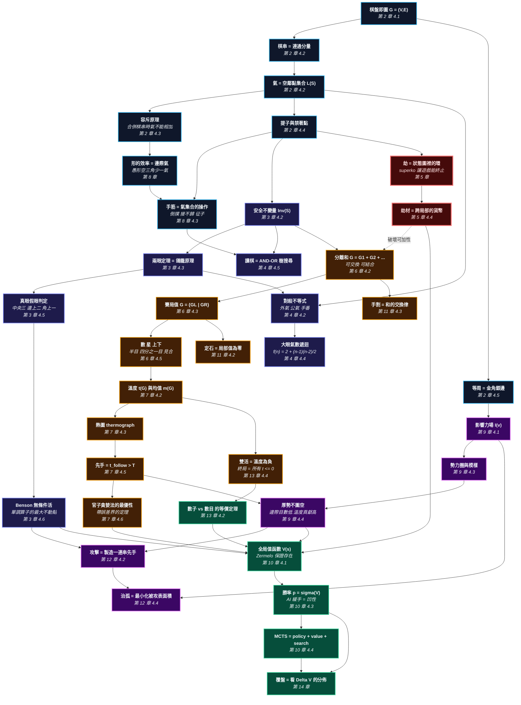

# 統一概念依賴架構：把散落的碎片對齊

> *「圍棋有幾百條諺語。每一條單獨看都對，合起來卻互相矛盾 —— 因為它們是同一組定理在不同溫度、不同層次下的投影。知道『氣』是什麼，並沒有解開其餘的謎題。我們需要的是一個能讓散落對齊的架構。」*

---

## 0. 如何閱讀這一頁（新讀者從這裡開始）

這一頁是**地圖**，不是課程。它在一個畫面裡展示這本書的每一個想法如何彼此相連，讓你在第 7 章深處遇到一個公式時，可以回到這裡看見它坐在哪裡。它被放在最前面就只有這個理由。**你不需要在第一次造訪時就看懂它。** 如果這一頁上有你不認識的詞，那是正常的：這裡的每一個名詞，都會在它旁邊註明的那一章裡，從零開始用白話教一次。

這一頁包含什麼、怎麼用：

* **第 1 節**解釋為什麼這本書圍繞五層骨架組織，而不是圍繞一份諺語清單。現在讀前幾段就好，其餘略讀。
* **五層骨架**是這本書的骨頭：東西在哪裡、什麼守得住、一手值多少、看不見的資產、以及唯一的裁判。骨架下面有一張表，把每一層翻譯成一句白話，並指向教它的章節。
* **第 2 節**是依賴圖。一條從 A 指向 B 的箭頭意思是「先懂 A，B 才說得通」。當某一章讀起來很吃力時，用它決定要回頭讀哪裡。
* **第 3 節**是一張表，一章一列，對照「傳統教法」與「本書教法」。它在你**讀完**一章之後最有用。
* **第 4 節**列出劫為什麼是唯一的例外。

給完全新手的建議路線：讀完第 0 節（就是這一節）與骨架下面的白話表，然後直接去第 1 章。之後每讀完一章回來看一次。讀完第 3 章時，這一頁上大部分的詞彙就是你的了；讀完第 7 章，全部都是。

一個立刻有用的詞彙提示：這一頁裡，**氣**指的是一個棋塊周圍空點的**集合**（第 2 章 §4.2 定義），**溫度**指的是某個局部「現在下一手值多少」（第 7 章 §4.2 定義）。這一頁上幾乎所有其他東西，都是由這兩個詞蓋出來的。

---

## 1. 核心診斷：為什麼「氣」本身無法對齊整本教材

在標準圍棋教學裡，**氣**在第一堂課就被介紹成「棋子旁邊的空點數」。然後它出現在每一個地方，每次都換一套看起來完全不同的外衣：

* 在**死活**裡，它變成「兩眼」—— 但沒人解釋為什麼是兩個。
* 在**對殺**裡，它變成一張要背的表：外氣、內氣、公氣、大眼氣數。
* 在**手筋**裡，它變成幾十個有名字的圖形：倒撲、接不歸、金雞獨立。
* 在**形**裡，它變成美學：好形、愚形、空三角。
* 在**官子**裡，它幾乎消失了，換成一堆目數。
* 在**布局**裡，它完全消失了，換成「厚薄」與「勢力」。
* 在 **AI 覆盤**裡，它又完全消失了，只剩一個勝率百分比。

學生看到這樣的「氣」，**不會**覺得畫面清晰了。他會覺得有人拿了十個彼此無關的問題，硬塞進同一個字。

### 真正的對齊概念是什麼？

「氣」只是一個影子。真正能對齊一切的，是這句話：

$$\textbf{一盤棋是一個「圖上的、可分解的、有限零和賽局」。}$$

用白話說：棋盤是一張**圖**（點與線）；棋塊是圖上的**連通分量**；死活是這個分量能不能維持一個**不變量**；每一手的大小是一個叫**溫度**的數；厚薄是一個隨距離衰減的**場**；而最後有一個裁判 —— **全局值函數** —— 說這些合起來值幾目。

具體地說，圍棋裡的每一條規則、每一句諺語，都是**五個層次的算子**作用在這張圖上的結果：

```
                          圍棋的五層骨架

  第 1 層：連通性              圖 G = (V, E)
          （東西在哪裡）        ├─ 棋串 S = 同色連通分量
                               ├─ 氣 L(S) = N(S) \ Occupied      ← 集合，不是數字
                               ├─ 容斥：|L(S1 U S2)| = |L1| + |L2| - |L1 ∩ L2| - |新佔點|
                               └─ 提子：|L(S)| = 0  =>  移除 S

  第 2 層：不變量              安全不變量 Inv(S)
          （什麼守得住）        ├─ Inv(S): 對手任意下法，皆存在回應使 |L(S)| >= 1
                               ├─ 兩眼定理（鴿籠原理：一手只能填一處）
                               ├─ Benson 無條件活 = 單調算子的最大不動點
                               └─ 對殺不等式：a + c·[有眼] + [手番] > b

  第 3 層：溫度                組合賽局論
          （一手值多少）        ├─ 分離和 G = G1 + G2 + ... + Gn（可交換、可結合）
                               ├─ 賽局值 G = { G^L | G^R }
                               ├─ 均值 m(G)、溫度 t(G)、熱圖
                               ├─ 先手 <=> t_follow > T（全局溫度）
                               └─ 官子最優 = 依 t 遞減排序（帶誤差界的定理）

  第 4 層：場                  位勢函數 I(v) = Σ σ(s)·λ^d(s,v)
          （看不見的資產）      ├─ 勢力圈 = { v : I(v) > θ }
                               ├─ 厚勢的價值記在第 3 層，不記在目數
                               └─ 【啟發式，非定理 —— 全書唯一】

  第 5 層：值函數              V(s) = 貼目下雙方最優的最終結果
          （唯一的裁判）        ├─ Zermelo：存在且唯一（但不可計算）
                               ├─ 好手 = argmax V，失誤 = ΔV
                               ├─ 勝率 p = σ(V/τ)：AI 緩手 = σ 的凹性
                               └─ MCTS = policy + value + search

  ══════════ 橫切一切的例外：劫 ══════════
  劫是狀態圖裡唯一的環。它讓第 3 層的「局部獨立」假設失效，
  因為劫材把整盤棋的所有局部綁在一起。
```

### 五層的白話翻譯

| 層 | 一句話 | 在哪裡教 |
| :--- | :--- | :--- |
| **1. 連通性** | 棋盤是一張格子圖；一塊棋是圖上連在一起的同色點；氣是這塊棋周圍空點的**集合**。因為是集合，合併時要用容斥，不能相加。 | 第 2 章 §4.1（圖）、§4.2（氣的集合定義）、§4.3（容斥定理）、§4.5（等周／金角銀邊） |
| **2. 不變量** | 「活」不是形狀，是一個保證：不管對手怎麼下，我都有辦法讓氣不歸零。兩眼是實現這個保證最便宜的方式。 | 第 3 章 §4.2（不變量定義）、§4.3（兩眼定理）、§4.5（真假眼）、§4.6（Benson）；第 4 章 §4.2（對殺不等式）、§4.4（大眼遞迴） |
| **3. 溫度** | 快結束的棋盤是很多互不干擾小賽局的和；每個小賽局有一個數（溫度）＝此處一手值多少；最優下法就是依這些數排序。 | 第 6 章 §4（賽局值、分離和）、第 7 章 §4.2（溫度）、§4.3（熱圖）、§4.5（先手判定）、§4.6（貪婪最優性） |
| **4. 場** | 棋子的影響隨距離衰減並疊加；厚薄就是這個場。**這一層是估計，不是證明。** | 第 9 章 §4.1（Zobrist）、§4.2（膨脹侵蝕）、§4.4（厚勢不圍空的量化） |
| **5. 值函數** | 存在一個唯一正確的評價函數；所有人類口訣都是它的廉價近似；AI 也只是比較好的近似。 | 第 10 章 §4.1（Zermelo）、§4.3（勝率 vs 目數）、§4.4（MCTS） |
| **例外：劫** | 遊戲圖裡的環。禁止重複的規則讓遊戲能結束，代價是引入劫材這種跨局部的貨幣。 | 第 5 章（整章） |

這一頁上用到、但要到後面才正式教的詞，先各給一句：

* **連通分量**（白話說：從一顆子出發，沿著上下左右一直走同色的子，能走到的全部）
* **不變量**（白話說：一個「不管對手怎麼搞都仍然成立」的性質）
* **不動點**（白話說：一個算完之後不再改變的答案；Benson 的算法就是一直刪到刪不動為止）
* **鴿籠原理**（白話說：三隻鴿子兩個籠，一定有籠子裝兩隻；在圍棋裡它的形式是「一手只能下一處」）
* **分離和**（白話說：兩個互不影響的局部可以當成一個大局部相加）
* **溫度**（白話說：這個局部現在下一手，比不下多賺幾目）
* **均值**（白話說：如果雙方輪流在這個局部下到底，最後平均會是幾目）
* **位勢／場**（白話說：像燈光一樣，離得越遠越暗，而且多盞燈會疊加）
* **凹函數**（白話說：一條越往上越平的曲線；勝率對目數就是這種曲線，這解釋了 AI 為什麼大優時肯送目）

---

## 2. 完整的概念依賴圖

底下是主依賴圖（白話說：一張每條箭頭都從「前提」指向「需要它的想法」、而且沒有迴圈的圖）。注意概念不是混亂地分叉，而是嚴格地由**連通性**流向**不變量**、**溫度**、**場**，最後匯入**值函數**。



**怎麼用這張圖**：卡在某一節時，找到那一節對應的方塊，逆著箭頭往上走兩層，那兩個就是你真正缺的東西。例如第 7 章的「先手判定」讀不懂，往上是「溫度」與「熱圖」，再往上是「賽局值」與「分離和」—— 回第 6 章。

---

## 3. 傳統教法 vs 本書教法（一章一列）

| 章 | 傳統教法 | 本書教法 | 掙得的槓桿 |
| :--- | :--- | :--- | :--- |
| **2 連通性** | 「氣就是旁邊的空點數」，然後給一堆例圖 | 氣是**集合**；合併用容斥；金角銀邊是等周問題 | 「連接會損氣」「愚形」不再需要背 |
| **3 死活** | 「要做兩個眼」，然後 500 道死活題 | 活 = **不變量**；兩眼 = 鴿籠原理最便宜的實現；Benson = 可判定的最大不動點 | 知道「活」到底在保證什麼 |
| **4 對殺** | 背「有眼殺無眼」與大眼氣數表 | 一條含手番與公氣的**不等式**；氣數表是一條遞迴的閉合解 | 一張表變成一行公式 |
| **5 劫** | 「不能馬上提回」，然後列出十種劫的名字 | 劫是狀態圖裡的**環**；ko 規則是終止性的必要條件；劫爭是排序比較 | 知道規則為什麼長這樣 |
| **6 賽局值** | （傳統書完全沒有這一章） | 分離和、賽局值、半目與四分之一目的真實局部 | 「大局觀」變成算術 |
| **7 溫度** | 「先手 6 目大於後手 8 目」，理由不明 | 溫度、熱圖、$t_{\text{follow}} > T$ 的先手判定、貪婪法的誤差界 | 官子從玄學變成排序 |
| **8 形** | 「這是好形，這是愚形」，靠看多了就懂 | 效率 = 邊際氣；每個手筋一個充要條件；征子的 O(n) 判定 | 好形是算出來的 |
| **9 厚薄** | 最含糊的一章，充滿「感覺」 | 可計算的場 + **誠實標示這是啟發式** | 知道哪裡沒有定理，比假裝有定理好 |
| **10 AI** | 「AI 說這裡好」 | $V(s)$、Zermelo、勝率的凹性、MCTS 三要素 | 知道什麼時候不該信 AI |
| **11 定石** | 背三百個定石 | 定石 = 局部值為零；手割 = 和的交換律 | 知道該記的是失效條件，不是變化 |
| **12 攻擊** | 「攻擊是為了得利」 | 收益結算在溫度層；棄子的形式化 | 知道「利」在哪裡結算 |
| **13 終局** | 兩套規則，各背一次 | 終局 = 所有溫度 ≤ 0；兩套規則差一個奇偶項 | 雙活與單官不再是特例 |

---

## 4. 劫：唯一的例外，以及為什麼要單獨處理

第 3 層（溫度）的全部力量，來自一個假設：

$$G = G_1 + G_2 + \cdots + G_n \qquad \text{（各局部互不影響）}$$

有了這個假設，整盤棋的最優解就退化成「對每個 $G_i$ 算一個數，然後排序」。這是本書最大的槓桿。

**劫打破它。** 因為劫材是**跨局部**的：我在左上角打劫，卻要靠右下角的一手來延續。左上和右下不再獨立，$+$ 不再成立。

處理方式（本書明確採取的立場）：

1. **第 5 章把劫單獨講清楚**，包括它的規則為什麼是終止性的必要條件，以及劫爭如何是一個排序比較。
2. **第 6、7 章明確假設「無劫」**，並在每個定理的敘述裡寫出這個前提。
3. **第 7 章末給出有劫時貪婪法會壞掉多少**的具體例子。
4. 組合賽局論裡處理環的理論（loopy games）**只給一頁概覽並指出參考文獻**，不深入 —— 因為它的複雜度遠超過它在實戰中的回報。

> [!IMPORTANT]
> 一本誠實的教科書必須明講它的假設在哪裡失效。
> 「局部可加」在圍棋裡失效兩次：**劫**（第 5 章）與**大規模纏繞的中盤戰鬥**（第 12 章）。
> 這兩處本書都不假裝有定理。
